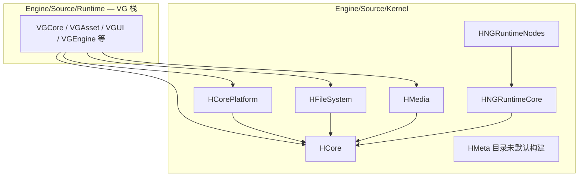

# VisionGal Native Kernel — 架构与总进度

本文描述根 [`CMakeLists.txt`](../../../CMakeLists.txt) 中 **`add_subdirectory(Engine/Source/Kernel)`** 纳入的 **H\*** 原生基建模块的分层、依赖与文档入口。

> **命名区分**：本目录 **Kernel = H\*** 静态/动态基建（数学、平台、VFS、FFmpeg、节点图运行时等）。文档中的 **「VGEngineRuntime 向 Runtime Kernel 演进」** 指 **VG\*** 行程级运行时（`VGEngineRuntime` / `VGEngineRuntimeServices`），位于 [`Engine/Source/Runtime`](../Runtime/RUNTIME_ARCHITECTURE_AND_PROGRESS.md)，**非**本目录。

---

## 1. 分层总览

`#include <HCore/...>` 等形式**不变**；各 H 目标的 `target_include_directories` 以 **`PUBLIC ${VISIONGAL_KERNEL_ROOT}`** 暴露本目录为 include 根。

---

## 2. 模块索引

| 模块 | CMake 目标 | 默认构建 | 文档 | 一句话职责 |
|------|------------|----------|------|------------|
| HCore | `HCore` | 是 | [Docs](HCore/Docs/MODULE_ARCHITECTURE_AND_PROGRESS.md) | 数学、元数据、序列化、事件、VFS 等通用基础 |
| HCorePlatform | `HCorePlatform` | 是 | [Docs](HCorePlatform/Docs/MODULE_ARCHITECTURE_AND_PROGRESS.md) | SDL3 窗口/输入、文件监视、原生对话框 |
| HFileSystem | `HFileSystem` | 是 | [Docs](HFileSystem/Docs/MODULE_ARCHITECTURE_AND_PROGRESS.md) | 文件系统动态库 |
| HNGRuntimeCore | `HNGRuntimeCore` | 是 | [Docs](HNGRuntimeCore/Docs/MODULE_ARCHITECTURE_AND_PROGRESS.md) | 节点图运行时核心 |
| HNGRuntimeNodes | `HNGRuntimeNodes` | 是 | [Docs](HNGRuntimeNodes/Docs/MODULE_ARCHITECTURE_AND_PROGRESS.md) | 节点图运行时节点层 |
| HMedia | `HMedia` | 是 | [Docs](HMedia/Docs/MODULE_ARCHITECTURE_AND_PROGRESS.md) | FFmpeg 音视频封装 |
| HMeta | — | **否** | （预留 `HMeta/CMakeLists.txt`） | 反射/元数据运行时；**已迁入目录**，根 Kernel `CMakeLists.txt` **未** `add_subdirectory` |

---

## 3. 构建顺序

[`CMakeLists.txt`](CMakeLists.txt) 按依赖顺序：

`HCore` → `HCorePlatform` → `HFileSystem` → `HNGRuntimeCore` → `HMedia` → `HNGRuntimeNodes`

---

## 4. 与 Runtime 文档的关系

- **VG 栈总览**：[RUNTIME_ARCHITECTURE_AND_PROGRESS.md](../Runtime/RUNTIME_ARCHITECTURE_AND_PROGRESS.md)（**11** 个 Runtime 子模块 + 本 Kernel）。
- **消费者 CMake**：仍链接 `HCore` 等目标；若目标仅挂载 `Engine/Source/Runtime` include 根、且需直接 `#include <H*>`，须**额外** `PRIVATE` `Engine/Source/Kernel`（见各 VG/Editor/Application `CMakeLists.txt`）。

---

## 5. 开发进展

| 日期 | 进展 |
|------|------|
| 2026-05-16 | **H\*** 模块自 `Engine/Source/Runtime` 物理迁入 `Engine/Source/Kernel`；根 CMake 以 `add_subdirectory(Kernel)` 替代 6 条独立 H 子目录；**HMeta** 仅目录迁移。 |
