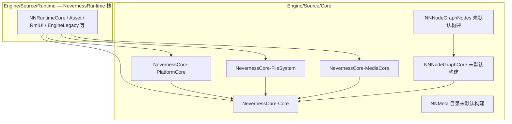

# Neverness Native Core — 架构与总进度

本文描述根 [`CMakeLists.txt`](../../../CMakeLists.txt) 中 **`add_subdirectory(Engine/Source/Core)`** 纳入的 **NN\*** 原生基建模块的分层、依赖与文档入口。CMake 缓存变量 **`VISIONGAL_KERNEL_ROOT`** 仍指向本目录（历史命名，物理路径为 `Engine/Source/Core`）。

> **命名区分**：本目录 **Core = NevernessCore** 静态/动态基建（数学、平台、VFS、FFmpeg 等）。文档中的 **「Runtime Kernel 化」** 指 **NevernessRuntime-Engine**（`NNRuntimeEngine`，C++ 类名 `VGEngineRuntime`）与 **NevernessRuntime-EngineServices**，位于 [`Engine/Source/Runtime`](../Runtime/RUNTIME_ARCHITECTURE_AND_PROGRESS.md)，**非**本目录。

---

## 命名约定（与 Runtime 根文档一致）

| 层级 | 现行约定 | 曾用名 |
|------|----------|--------|
| 目录 | `NNCore`、`NNPlatformCore`、`NNFileSystem`、`NNMediaCore` | HCore、HCorePlatform、HFileSystem、HMedia |
| CMake 目标 | `NevernessCore-Core`、`NevernessCore-PlatformCore` 等 | `HCore` 等 |
| Include | `#include <NNCore/...>` | `#include <HCore/...>`（已废弃于新代码） |
| CMake 变量 | `VISIONGAL_KERNEL_ROOT` → `Engine/Source/Core` | 原 Kernel 根路径 |

---

## 1. 分层总览

各目标的 `target_include_directories` 以 **`PUBLIC ${VISIONGAL_KERNEL_ROOT}`** 暴露 `Engine/Source/Core` 为 include 根，从而解析 `<NNCore/...>`、`<NNPlatformCore/...>` 等前缀。

---

## 2. 模块索引

| 目录 | CMake 目标 | 默认构建 | 曾用名 | 文档 | 一句话职责 |
|------|------------|----------|--------|------|------------|
| NNCore | `NevernessCore-Core` | 是 | HCore | [Docs](NNCore/Docs/MODULE_ARCHITECTURE_AND_PROGRESS.md) | 数学、元数据、序列化、事件、VFS 等通用基础 |
| NNPlatformCore | `NevernessCore-PlatformCore` | 是 | HCorePlatform | [Docs](NNPlatformCore/Docs/MODULE_ARCHITECTURE_AND_PROGRESS.md) | SDL3 窗口/输入、文件监视、原生对话框 |
| NNFileSystem | `NevernessCore-FileSystem` | 是 | HFileSystem | [Docs](NNFileSystem/Docs/MODULE_ARCHITECTURE_AND_PROGRESS.md) | 文件系统动态库 |
| NNMediaCore | `NevernessCore-MediaCore` | 是 | HMedia | [Docs](NNMediaCore/Docs/MODULE_ARCHITECTURE_AND_PROGRESS.md) | FFmpeg 音视频封装 |
| NNNodeGraphCore | `HNGRuntimeCore` | **否** | HNGRuntimeCore | [Docs](NNNodeGraphCore/Docs/MODULE_ARCHITECTURE_AND_PROGRESS.md) | 节点图运行时核心（CMake 已注释） |
| NNNodeGraphNodes | `HNGRuntimeNodes` | **否** | HNGRuntimeNodes | [Docs](NNNodeGraphNodes/Docs/MODULE_ARCHITECTURE_AND_PROGRESS.md) | 节点图运行时节点层（CMake 已注释） |
| NNMeta | — | **否** | HMeta | （预留 `NNMeta/CMakeLists.txt`） | 反射/元数据运行时；根 `CMakeLists.txt` **未** `add_subdirectory` |

---

## 3. 构建顺序

[`CMakeLists.txt`](CMakeLists.txt) 按依赖顺序（默认构建部分）：

`NNCore` → `NNPlatformCore` → `NNFileSystem` → `NNMediaCore`

（`NNNodeGraphCore` / `NNNodeGraphNodes` 在根 CMake 中已注释，不参与默认构建。）

---

## 4. 与 Runtime 文档的关系

- **Runtime 栈总览**：[RUNTIME_ARCHITECTURE_AND_PROGRESS.md](../Runtime/RUNTIME_ARCHITECTURE_AND_PROGRESS.md)（**11** 个 Runtime 子模块 + 本 Core）。
- **消费者 CMake**：链接 `NevernessCore-Core` 等目标；若目标仅挂载 `Engine/Source/Runtime` include 根、且需直接 `#include <NNCore/...>`，须**额外** `PRIVATE` `Engine/Source/Core`（见各 Runtime/Editor/Application `CMakeLists.txt`）。

---

## 5. 开发进展

| 日期 | 进展 |
|------|------|
| 2026-05-17 | **NN\*** 目录与 **NevernessCore-\*** CMake 目标命名；架构文档与 Runtime 根文档「命名约定」对齐。 |
| 2026-05-16 | **H\*** 模块自 `Engine/Source/Runtime` 物理迁入 `Engine/Source/Core`；根 CMake 以 `add_subdirectory(Core)` 替代原 Kernel 子目录；**NNMeta** 仅目录迁移。 |
