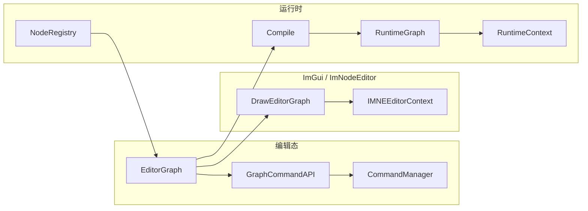

# HNGEditorCore 完整模块架构与开发进展

本文档描述 **Horizon 节点图编辑器核心** 动态库目标（`HNGEditorCore`，CMake 中为 `SHARED`）的源码布局、各子系统职责、与 `HNGRuntimeCore` / `VGImgui` 的协作关系，以及截至当前仓库状态的实现范围与扩展边界。

---

## 1. 模块定位

`HNGEditorCore` 为基于 **ImGui + ax::NodeEditor（ImNodeEditor）** 的通用节点图编辑基础设施：维护 **编辑态图**（`EditorGraph`：节点、引脚、连线、选择集、脏标记与辅助索引），通过 **命令系统**（`CommandManager` + `ICommand`）支持撤销/重做与剪贴板式粘贴，提供 **JSON 序列化**、**编辑图 → 运行时图** 的 `Compile`，并在宿主类 **`Horizon::NodeGraph::HNodeGraphEditor`** 内聚合 **运行时上下文**（`RuntimeContext` + `RuntimeGraph`）及 **Play / Pause / Stop / Recompile** 生命周期。

- **对外主入口（宿主）**：`Horizon::NodeGraph::HNodeGraphEditor`（`Interface/NodeGraphEditor.h`）。
- **编辑数据与绘制入口**：`Horizon::NodeGraphEditor::EditorGraph` 及 `DrawEditorGraph`（`Interface/EditorGraph.h`）。
- **运行时元数据**：引脚与节点结构以 **`HNGRuntimeCore::NodeRegistry::NodeMeta`** 为准；编辑器专用展示与属性面板由 **`NodeEditorRegistry` + `NodeEditorMeta`** 描述（与运行时注册表解耦）。

**主要链接依赖**（见 `CMakeLists.txt`）：

- `HCore`：核心基础设施。
- `VGImgui`：ImGui 与 ImNodeEditor。
- `HNGRuntimeCore`：`NodeRegistry`、`RuntimeGraph`、`RuntimeContext`、`Value` 等运行时类型与编译目标模型。

导出宏定义见根目录 `HNGEditorCoreConfig.h`（`HNG_EDITOR_CORE_API`）。

---

## 2. 源码目录结构

CMake 通过 `GLOB` 收集：`*.h` / `*.cpp`（模块根）、`Interface/*.h`、`Include/*.h`、`Include/Utilities/*.h`、`Source/*.cpp`、`Source/Utilities/*.cpp`。逻辑布局如下。

| 路径 | 职责 |
|------|------|
| `HNGEditorCoreConfig.h` | DLL 导出宏 `HNG_EDITOR_CORE_API`。 |
| `Interface/EditorGraph.h` | **`EditorGraph`**：`nodes` / `links`、`registry` / `editorRegistry`、`GraphIdGenerator`、选择集、`AddNode` / `FindNode` / `FindPin` / `RebuildIndices` / `FixupIdStateAfterLoad`；**`DrawEditorGraph`**、**`HandleCreateLink`**、**`HandleDelete`**、**`DrawNodeCreateMenu`**。 |
| `Interface/NodeGraphEditor.h` | **`HNodeGraphEditor`**：`Initialize`、`Draw`、`Update`、`Play`/`Pause`/`Stop`/`Recompile`、快捷键与复制缓冲区、持有 `RuntimeGraph` / `RuntimeContext`。 |
| `Interface/NodeEditorCore.h` | **`EditorNode` / `EditorPin` / `EditorLink`**、`EditorIdHash`；`std::hash` 对 `NodeId`/`LinkId`/`PinId` 的特化。 |
| `Interface/NodeEditorMeta.h` | **`PropertyMeta` / `NodeEditorMeta`**：属性控件类型、默认值、可选 **`customDraw`** 回调（业务自定义节点面板）。 |
| `Interface/GraphCommandAPI.h` | **`GraphCommandAPI`**：对图的高层变更 API（经 `CommandManager` 走撤销栈）。 |
| `Interface/GraphSerialization.h` | **`SaveGraph` / `LoadGraph`**：JSON 持久化；加载后需上层重新绑定 `context` / `registry`。 |
| `Interface/GraphCompiler.h` | **`Compile(EditorGraph, NodeRegistry)`** → `RuntimeGraph`。 |
| `Include/CommandSystem.h` | **`ICommand`、`CompositeCommand`、`CommandManager`**：Undo/Redo 栈与执行入口。 |
| `Include/CommandInGraph.h` | 图内具体操作命令声明（与 `CommandInGraph.cpp` 成对）。 |
| `Include/GraphIdGenerator.h` | 节点/引脚/连线 ID 生成与持久化状态。 |
| `Include/NodeFactory.h` | 由 **`NodeMeta`** 构造 **`EditorNode`**（引脚布局等）。 |
| `Include/NodeEditorRegistry.h` | **`NodeEditorRegistry`**：按 `NodeTypeId` 注册/查询 `NodeEditorMeta`。 |
| `Include/SelectionSystem.h` | **`SelectionSystem`**：维护 `EditorGraph` 内选择集合的轻量封装（与 ImNodeEditor 同步策略见 `EditorGraph` 注释）。 |
| `Include/IMNEWrap.h` | **`IMNEEditorContext`**：封装 `ax::NodeEditor::EditorContext` 的创建与当前上下文切换。 |
| `Include/EditorGraphDrawingImpl.h` | 节点/引脚/属性面板的绘制实现声明。 |
| `Include/EditorGraphActionsImpl.h` | 拖拽、创建链路等交互实现声明。 |
| `Include/EditorGraphContextMenuImpl.h` | 上下文菜单相关实现声明。 |
| `Include/Utilities/drawing.h`、`Include/Utilities/widgets.h`、`Include/Utilities/builders.h` | 绘制辅助、控件片段、构建辅助。 |
| `Source/*.cpp` | 与 `Interface` / `Include` 对应的实现；**`NodeGraphEditor.cpp`** 为宿主逻辑；**`EditorGraph.cpp`** 为图编辑主循环与索引同步。 |
| `Source/Utilities/*.cpp` | 上述 Utilities 的实现。 |
| `Docs/` | 模块文档（本文件）。 |

---

## 3. 总体架构

核心数据流：**业务层**为 `EditorGraph` 注入 **`NodeRegistry`（运行时）** 与 **`NodeEditorRegistry`（编辑器）** → 用户在 ImNodeEditor 中编辑 → 变更经 **`CommandManager`** 入栈可撤销 → **`dirty`** 触发 **`Compile`** 更新 **`RuntimeGraph`** → **`RuntimeContext`** 在 `Update` 中驱动执行（由 `HNodeGraphEditor` 持有）。

---

## 4. 子系统概要

| 子系统 | 说明 |
|--------|------|
| **编辑模型** | `EditorNode` 含 `properties`（`NodeGraphRuntime::Value`）与 `GetProperty`；连线为 `EditorLink`（起止 `PinId`）。 |
| **ID 与索引** | `GraphIdGenerator` 统一生成 ID；`nodeIndexById` / `pinOwnerById` 加速查找；反序列化后 **`FixupIdStateAfterLoad`**。 |
| **命令与 API** | 所有应可撤销的修改应通过命令执行；`GraphCommandAPI` 提供 `BeginBatch` / `EndBatch` 预留批量打包。 |
| **序列化** | JSON 含版本字段；不持久化 `context` / `registry` 指针。 |
| **编译** | `GraphCompiler.cpp`：`EditorGraph` + `NodeRegistry` → `RuntimeGraph`。 |
| **宿主编辑器** | `HNodeGraphEditor`：快捷键（如 Ctrl+C/V、撤销重做）、复制缓冲区、**`RecompileIfDirty`**、播放控制与变量查询入口 **`TryGetVariable`**。 |
| **扩展点** | `NodeEditorMeta::customDraw` 允许业务模块注册复杂节点 UI；`NodeEditorRegistry` 与 `Runtime::NodeRegistry` 独立。 |

---

## 5. 开发进展（与代码状态对齐）

**已实现（当前仓库）**

- 基于 `EditorGraph` 的完整编辑绘制管线（`DrawEditorGraph`）及创建链接、删除、右键创建菜单等入口函数。
- 命令系统与图内命令、`GraphCommandAPI`、宿主内复制/粘贴与快捷键路径。
- JSON 保存/加载与加载后 ID 状态修复。
- `Compile` 与 `HNodeGraphEditor` 内运行时图/上下文、播放状态及按脏标记重编译。
- `NodeEditorRegistry` / `NodeEditorMeta` 驱动的属性面板与可选自定义绘制挂钩。

**边界与约定**

- `SaveGraph` / `LoadGraph` 后必须由上层重新绑定 **`context`** 与 **`registry`**（及 `editorRegistry`），否则绘制与 `AddNode` 元数据来源不完整。
- 选择交互主体在 ImNodeEditor；本模块在 `EditorGraph` 侧同步 **`selectedNodes` / `selectedLinks`** 供高亮与删除等逻辑使用（见 `EditorGraph` 与 `SelectionSystem` 注释）。
- CMake 使用 **`file(GLOB ...)`**：新增源文件会参与构建，但 CMake 配置变更时需注意重新运行配置（与显式文件列表相比的行为差异）。

---

## 6. 修订记录

| 日期 | 说明 |
|------|------|
| 2026-05-12 | 初版：目录结构、架构与子系统、依赖与进展说明。 |
