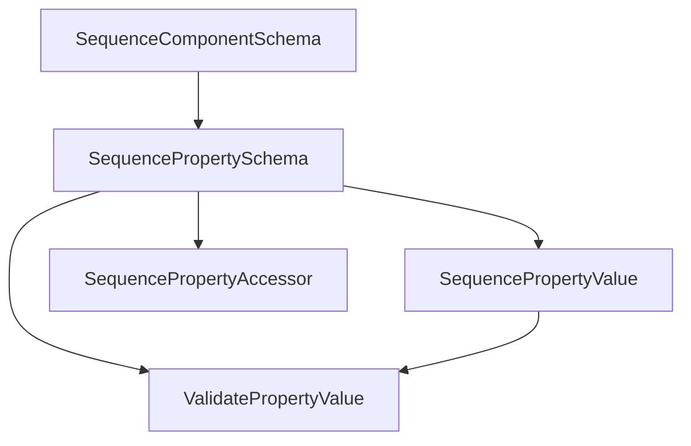

# VGEditorComponentSchema 模块架构与开发进展

本文档描述 **编辑器侧 Galgame 序列组件 Authoring Schema** 静态库目标（`VGEditorComponentSchema`，CMake 中为 `STATIC`）的源码布局、数据结构职责、与宿主编辑器的协作方式，以及截至当前仓库状态的实现范围。

CMake 注释约定：**Phase 10**、**无 ImGui**、**不依赖脚本序列化 DLL**；本库仅提供头文件级模型与少量纯逻辑 `.cpp`，便于被多个编辑器目标静态链接。

---

## 1. 模块定位

`VGEditorComponentSchema` 为 **组件类型级** 与 **属性级** 的单一数据源（Single Source of Truth），服务于：

- **调色板 / Inspector**：展示名、分类、图标、优先级、属性列表与默认值。
- **通用校验**：`ValidatePropertyValue` 基于 `SequencePropertyFlags`、`SequencePropertyRange` 与 `SequencePropertyValue` 的当前取值生成 `SequenceSchemaValidationNote`（不涉及 VFS、不覆盖跨条目业务规则；宿主可映射为 `SequenceValidationIssue` 等）。
- **Patch / 搜索键**：`SequencePropertySchema::Name` 为稳定机器名。
- **图执行预留**：`SequenceComponentSchema::InputPorts` / `OutputPorts`（线性序列阶段可为空）。
- **运行时观测**：`SequenceRuntimePropertySnapshot` 以文本化取值与路径描述一帧属性变化，与引擎强类型解耦。

**命名空间**：`VisionGal::Editor`。

**当前链接方**（仓库内检索）：`VGEditorGalgameSequence` 通过 `target_link_libraries(... PUBLIC VGEditorComponentSchema)` 暴露给依赖该编辑器的目标；本模块 `CMakeLists.txt` 未声明额外 `target_link_libraries`，依赖标准库即可编译。

---

## 2. 源码目录结构

| 路径 | 职责 |
|------|------|
| `CMakeLists.txt` | 显式列出所有头与两个 `.cpp`，`target_include_directories(... PUBLIC Include)`。 |
| `Include/Schema/SequencePropertyType.h` | **`SequencePropertyType`**：Authoring / Inspector / Patch 的统一属性类型枚举（含 Vector、Struct、Array 等预留项）。 |
| `Include/Schema/SequencePropertyFlags.h` | **`SequencePropertyFlags`**：`Required`、`NotEmpty`、`ResourcePathNotEmpty`、`UseRange` 及位运算辅助。 |
| `Include/Schema/SequencePropertyRange.h` | **`SequencePropertyRange`**：数值 inclusive 范围（`optional` Min/Max）。 |
| `Include/Schema/SequencePropertyValue.h` | **`SequenceColorRGBA`**、**`SequencePropertyValue`**（`std::variant`：标量、字符串、颜色等）；声明 **`SequencePropertyValuesEqual`**。 |
| `Include/Schema/SequenceEnumSchema.h` | **`SequenceEnumItem`**、**`SequenceEnumSchema`**：枚举型属性的展示项与整型约定值。 |
| `Include/Schema/SequenceGraphPortSchema.h` | **`SequencePortDirection`**、**`SequencePortDataType`**、**`SequenceGraphPortSchema`**：图端口元数据（Branch / VisualScript 等预留）。 |
| `Include/Schema/SequencePropertyAccessor.h` | **`SequencePropertyAccessor`**：`Getter` / `Setter` 以 `void*` 组件实例与 Schema 解耦；由宿主（如序列编辑器 Bootstrap）绑定 lambda。 |
| `Include/Schema/SequencePropertySchema.h` | **`SequencePropertySchema`**：单属性的完整 Authoring 描述（类型、名、展示、分类、Flags、Range、Enum、默认值、Accessor、可编辑性）。 |
| `Include/Schema/SequenceComponentSchema.h` | **`SequenceComponentSchema`**：类型级 Schema（`TypeNameID`、`DisplayName`、`Description`、`Category`、`Icon`、`Priority`、`Properties`、输入/输出端口列表）；**`PrimaryLabel`** / **`PaletteButtonText`** 辅助方法。 |
| `Include/Runtime/SequenceRuntimePropertySnapshot.h` | **`SequenceRuntimePropertySnapshot`**：条目索引、属性路径、旧/新文本值、时间戳。 |
| `Include/Validation/GenericSchemaValidator.h` | **`SequenceSchemaValidationNote`**、**`ValidatePropertyValue`** 声明。 |
| `Source/Schema/SequencePropertyValue.cpp` | **`SequencePropertyValuesEqual`** 实现。 |
| `Source/Validation/GenericSchemaValidator.cpp` | **`ValidatePropertyValue`**：必填、`NotEmpty` 字符串、`ResourcePathNotEmpty`、整型/浮点范围校验。 |
| `Docs/MODULE_ARCHITECTURE_AND_PROGRESS.md` | 本模块架构与进展说明。 |

---

## 3. 总体架构

层次关系：**`SequenceComponentSchema`** 聚合多条 **`SequencePropertySchema`**，每条属性组合 **类型**（`SequencePropertyType`）、**约束**（`Flags` / `Range` / `Enum`）、**默认值**（`SequencePropertyValue`）与 **存取器**（`SequencePropertyAccessor`）。校验层仅依赖 Schema + 当前值，不反向依赖 ImGui 或具体组件类。

---

## 4. 开发进展（与代码对齐）

**已实现**

- 组件级与属性级 Schema 结构体及图端口、枚举、范围、标志位等配套类型。
- `SequencePropertyValuesEqual` 全 variant 分支比较。
- `ValidatePropertyValue`：`Required`、`NotEmpty`（含全空白）、`ResourcePathNotEmpty`、整型/浮点与 `UseRange` + `SequencePropertyRange` 的边界检查；返回中文提示消息的 `SequenceSchemaValidationNote` 列表。
- `SequenceRuntimePropertySnapshot` 数据结构（无单独 `.cpp`，纯头定义）。

**边界与后续扩展点**

- `SequencePropertyType` 中 **Vector2/Vector3、Struct、Array、ObjectReference、LocalizedText** 等在本库仅为枚举预留；通用校验当前主要针对 `monostate`、字符串、整型、浮点等已实现载体。
- **资源路径是否存在**、**跨条目语义**、**与 VFS 联动** 应由宿主校验器补充，不在 `GenericSchemaValidator` 范围内（头文件注释已说明）。
- **Accessor** 仅提供函数对象形状；具体 `IVGSSequenceComponent*` 与 lambda 绑定在宿主模块完成。

---

## 5. 修订记录

| 日期 | 说明 |
|------|------|
| 2026-05-12 | 初版：目录结构、架构分层、依赖关系与进展说明。 |
