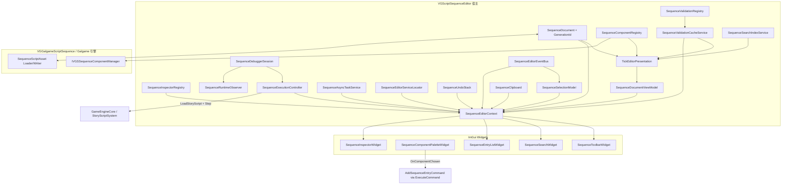
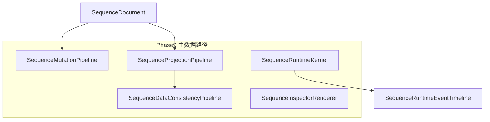

# VGEditorGalgameSequence 模块架构与开发进展

本文档描述 **Galgame 可视化序列脚本编辑器** 动态库目标（`VGEditorGalgameSequence`，CMake 中为 `SHARED`）的整体架构、各子系统职责、与引擎其他部分的协作方式，以及截至当前的实现进展与已知边界。

更细的「如何注册新序列组件 / Inspector」步骤见同目录下的 [SEQUENCE_EDITOR_REGISTRATION.md](SEQUENCE_EDITOR_REGISTRATION.md)。

---

## 1. 模块定位

`VGEditorGalgameSequence` 提供面向 **`.vgasset` 序列脚本资源** 的 ImGui 编辑体验：条目列表、组件调色板、属性检查器、撤销/重做、剪贴板、保存与「执行到某条目」及 **Phase 7 起调试器**；**Phase 8** 起引入 **Reactive 派生图、投影事件总线、Authoring 图数据层、Patch 事务雏形、Runtime 事件时间线、扩展注册表** 及四个静态链接子模块（见 §1 依赖与 §6.9）。

序列数据本身来自 **`VGGalgameScriptSequence`**（`VGSSequenceDataContainer`、`IVGSSequenceComponent` 等）；本模块不重复定义运行时组件类型，而是通过 `IVGSSequenceComponentManager::EnumerateRegisteredTypeNameIDs` 与运行时注册表对齐。

**主要链接依赖**（见 `CMakeLists.txt`）：

- `VGEditorFramework`、`HNGEditorCore`：编辑器任务面板与基础设施。
- `VGGalgame`：Galgame 侧资源与引擎集成。
- `VGCore`、`HCorePlatform`、`HFileSystem`：核心服务、原生保存对话框、路径与 VFS。
- **`VGEditorReactive`**（STATIC）：无业务 `DerivedStateGraph`（失效传播 + 拓扑 flush）。
- **`VGEditorAuthoringGraph`**（STATIC）：`SequenceAuthoringGraph`（布局 / 边 / 注释，与线性文档解耦）。
- **`VGEditorExtensions`**（STATIC）：`ISequenceEditorExtension`、`SequenceExtensionRegistry`。
- **`VGEditorRuntimeBridge`**（STATIC）：`SequenceRuntimeEventFrame`、`SequenceRuntimeEventTimeline`。

对外主入口为 `VisionGal::Editor::VGScriptSequenceEditor`（`Interface/SequenceEditor.h`），实现编辑器框架的 `IEditorTaskPanel`，并可由宿主通过 `RenderEmbeddedUI()` 嵌入同一套 UI。

---

## 2. 源码目录结构

| 路径 | 职责 |
|------|------|
| `Interface/` | 对外 API：`SequenceEditor.h`（`VGScriptSequenceEditor`）、`VGEGSExport.h`。 |
| `Include/Document/` | `SequenceDocument`：资源路径、脏标记、对 `VGSSequenceDataContainer` 的封装与读写；**`SequenceEntryStoragePool`**（Phase 9：列表行 VM 容量预留）。 |
| `Include/Core/` | `SequenceEditorContext`、选择、**`SequenceSelectionTypes` / `SequenceSelectionProjectionController`**、撤销栈、剪贴板；`SequenceEditorEvents.h` 转发至 `Events/SequenceEditorEvent.h`。 |
| `Include/Events/` | `SequenceEditorEvent`、`SequenceEditorEventType`、`SequenceEditorEventBus`（编辑器主线程发布/订阅）。 |
| `Include/Services/` | `SequenceEditorServiceLocator`、`SequenceValidationCacheService`、`SequenceSearchIndexService`、**`SequenceAssetDependencyService`**；**`SequenceDataConsistencyPipeline`**（Phase 9：依赖图 + 搜索索引 + 派生校验有序单入口）。 |
| `Include/Async/` | `SequenceAsyncTaskService`、`SequenceBackgroundValidationTask`；**`SequenceTaskToken`**（与 debounced 全量校验取消协同）。 |
| `Include/AssetMonitoring/` | 资源依赖：`SequenceDependencyGraph`（scheduler 内在文档信号时 `RebuildFromDocument`）；**`SequenceAssetDependencyService`** 在保存等路径显式 `OnAssetChanged` 时重建图并按引用条目刷新校验缓存。 |
| `Include/Transactions/` | Transaction v1：`SequenceTransactionTypes`、`SequenceTransactionBuilder`、`SequenceMutationSummary` 等（与 `SequenceDocumentMutationSummary` 并存）。 |
| `Include/Transactions/Patches/` | **Phase 8**：`SequenceDocumentPatch`（`variant`）、`SequencePatchTransactionV2`、`SequencePatchApplier`（Patch → `SequenceDirtyRegion`）。 |
| `Include/Transactions/Pipeline/` | **Phase 9**：**`SequenceMutationPipeline`**、**`SequenceMutationBatch`**；Patch → 命令批次与 **`SequenceUndoStack::ExecuteBatch`**。 |
| `Include/DirtyRegions/` | `SequenceDirtyRegionFlags`、`SequenceDirtyRegion`、与 summary/transaction 的归一化构建。 |
| `Include/Projection/` | **`SequenceProjectionContext`**、**`SequenceProjectionPipeline`**；**`ISequenceProjection`**（`Rebuild` / `ApplyDirtyRegion` 接收 **Context**）、`SequenceListProjection`、`SequenceTimelineProjection`、`SequenceGraphProjection`。 |
| `Include/Projection/Graph/` | **`SequenceGraphReadModel.h`**：`SequenceGraphNodeVM`（含 **LayoutX/Y**）、`SequenceGraphEdgeVM`（仅 Authoring 线性流 + 边，非执行 VM）。 |
| `Include/Projection/ProjectionEvents/` | **Phase 8**：`SequenceProjectionEvent`（`variant`）、`SequenceProjectionEventBus`；选择 / 导航 / 视口事件头文件。 |
| `Include/Reactive/` | `SequenceDirtyRegionTracker`、**`SequencePresentationScheduler`**（内嵌 **`SequenceProjectionPipeline`** + **`SequenceDataConsistencyPipeline`**）、**`SequenceEditorMetrics`**。 |
| `Include/Reactive/DerivedState/` | **Phase 8**：`SequenceDerivedStateId`、`SequenceDerivedStateGraph`（装配 `VGEditorReactive::DerivedStateGraph`，包装校验 / Overlay / 搜索派生 Pass）。 |
| `Include/EditorSession/` | **Phase 8/9**：`SequenceEditorSession`（Authoring 图 + 投影总线 + 扩展注册表 + 时间线；**Phase 9** 起挂载 **`SequenceProjectionPipeline`** / **`SequenceDataConsistencyPipeline`** / **`SequenceMutationPipeline`** / **`SequenceRuntimeKernel`** 指针）。 |
| `Include/Diff/` | 文档/条目 diff 占位（`SequenceDocumentDiff.h` 等）。 |
| `Include/Inspector/PropertyEditing/` | `SequencePropertyPath`、`SequencePropertyBinding`、`SequencePropertyBindingRegistry` 等。 |
| `Include/Commands/` | `ISequenceEditorCommand` 及增删改、移动、粘贴、属性编辑、复合命令。 |
| `Include/ComponentRegistry/` | 组件元数据、注册表、Bootstrap 声明；**`SequenceComponentMetadata::PropertyDescriptors`**（Phase 7 属性描述）。 |
| `Include/Properties/` | **`SequencePropertyDescriptor`**（`SequencePropertyKind` + 可选 `SequenceEditFieldId` 映射）。 |
| `Include/Inspector/` | `ISequenceInspector`、内置实现工厂、注册表、**`SequenceInspectorRenderer`**（Phase 9：描述符强制路径）。 |
| `Include/Runtime/` | **`SequenceDebuggerSession`**（内含 **`SequenceRuntimeKernel`**）、`SequenceExecutionController`、`SequenceRuntimeSnapshot`、`SequenceRuntimeObserver`；**`SequenceRuntimeBridgeRecorder`**（遗留兼容）。 |
| `Include/Runtime/Kernel/` | **Phase 9**：**`SequenceRuntimeKernel`**、`SequenceRuntimeExecutionState`、`SequenceRuntimeStepResult`；**`EmitDebugStream`** 写 **`SequenceRuntimeEventTimeline`** 并可选转发总线。 |
| `Include/ViewModels/` | `SequenceDocumentViewModel`、`SequenceEntryViewModel`、`SequenceSearchViewModel`（展示层只读模型）。 |
| `Include/Validation/` | `SequenceValidationRegistry`、`ISequenceValidator`、`SequenceValidationIssue` 及 `Builtin/` 内置规则。 |
| `Include/Timeline/` | 线性时间轴 v1：`SequenceTimelineLayout`、`SequenceTimelineController`、`SequenceTimelineWidget`。 |
| `Include/Widgets/` | 工具栏、条目列表、调色板、搜索、Inspector、校验面板、大纲、状态栏、时间轴、**`SequenceGraphWidget`**、**`SequenceRuntimeBridgePanelWidget`**（运行时事件 Dock）等。 |
| `Include/Workspace/` | **`SequenceWorkspaceState`**：窗口可见性 INI（`%APPDATA%\VisionGal\`）持久化。 |
| `Source/` | 与上述头文件对应的 `.cpp`；含 **`Reactive/DerivedState/`**、**`Projection/`**（含 **`SequenceProjectionPipeline.cpp`**）、**`Runtime/Kernel/`**、**`Transactions/Pipeline/`**、**`Services/SequenceDataConsistencyPipeline.cpp`**、`VGSequenceEditor.cpp` 等。 |

---

## 3. 总体架构

核心思想：**单一宿主类持有文档与工具对象，通过 `SequenceEditorContext` 把只读/可写依赖注入各 Widget**，文档变更优先走 **命令 + `SequenceUndoStack`**，以便统一撤销/重做。

---

## 4. 子系统说明

### 4.1 宿主：`VGScriptSequenceEditor`

- 构造路径分支：无参构造创建空文档并 `FillDefaultDemoEntries()`；带路径构造则 `LoadFromAssetPath`，并在进入场景播放模式时通过 `EngineEventBus` 自动 `SaveAsset()`。
- `InitializeChrome()`：Bootstrap 组件 / 校验 / 检查器注册表；装配 `SequenceEditorServiceLocator`（校验缓存、搜索索引、**`debuggerSession`**、异步任务）；**`SequenceDebuggerSession::Bind`** 控制器、Observer、事件总线与 **`SequenceRuntimeEventTimeline`**（**Phase 9**：内核 **`EmitDebugStream`** 写时间线）；**`SequenceAssetDependencyService::Bind`**（文档、依赖图、校验缓存、presentation 刷新回调）；`SequenceSelectionModel::SetEventBus`；将 `SequenceEditorContext` 的 `onDocumentMutationAccumulate` / `requestPresentationRefresh` 指向宿主；**`SequenceEditorSession::Set*`** 挂载投影 / 一致性 / 变更 / 运行时内核指针；首帧 `TickEditorPresentation()`；刷新调色板并订阅 `OnComponentChosen` → `ExecuteCommand(AddSequenceEntryCommand)`。
- **`TickEditorPresentation()`**：在 `m_needsPresentationTick` 或首帧时调用 **`SequencePresentationScheduler::Tick`**：绑定 **`SequenceDocumentViewModel::SetListProjection`**；**`SequenceProjectionPipeline::RunProjectionPass`**（经 **`SequenceProjectionContext`**）；**`SequenceDataConsistencyPipeline::RunAfterProjections`**（依赖图、搜索索引、派生 Pass）；传入 **`SequenceSelectionModel`** 以填充投影上下文；可选发布 `ValidationUpdated`；最后 **`FillContextPointers()`**。
- **`FillContextPointers()`**：写入 `SequenceEditorContext`（含 **`componentRegistry`**、**`debuggerSession`**、**`graphProjection`**（指向 scheduler 内 graph 投影）、`document`、`documentViewModel`、`validationRegistry`、`validationCache`、`runtimeOverlay`、`services`、`eventBus`、`execution` 等），**不**在函数体内触发全链路重建。
- `RenderEditorBody()`：帧首 `PumpCompleted` → `TickEditorPresentation`；**各 Dock 窗口可由 `SequenceWorkspaceState::IsWindowVisible` 控制是否 `Begin`**（含 **序列图** 与 `SequenceGraphWidget`）；快捷键；帧尾再次 `PumpCompleted` + `TickEditorPresentation`。
- `ExecuteTo(index)`：保存资源后委托 **`SequenceDebuggerSession::RequestRunTo`**（内部 `SequenceExecutionController::ExecuteTo` 单次冷路径 + `NotifyExecuteCompleted` + 总线 **`RuntimeStateChanged`**，并发布 **`RuntimeDebugStream`** 起止事件）；结束后置位 `m_needsPresentationTick`。
- **`SaveAsset()`**：保存成功后若资源路径非空，调用 **`SequenceAssetDependencyService::OnAssetChanged`**，按依赖图条目引用触发 **`SequenceValidationCacheService::NotifyEntriesPropertyTouch`** 并请求 presentation 刷新。
- `OpenAsset`：成功后 `validationCache.InvalidateAll` 并 `NotifyDocumentChanged`（结构级摘要），驱动全量重建与校验。

### 4.2 文档层：`SequenceDocument`

- 内部持有 `Ref<VGSSequenceDataContainer>` 与 `m_assetPath`、`m_dirty`。
- **编辑代次**：`GetGenerationId()` / `BumpEditGeneration()`（由 `SequenceEditorContext` 在成功 `ExecuteCommand` / `UndoDocument` / `RedoDocument` 后调用，用于校验缓存等与文档版本对齐）。
- **结构修订**：`GetStructureRevision()` / `BumpStructureRevision()`（加载、重置、演示填充、清空为新文档等路径 bump，与代次一并递增），便于后续区分「仅内容变更」与「条目集合/顺序变化」。
- 加载/保存通过 `GalGame::SequenceScriptAssetLoader` / `SequenceScriptAssetWriter` 与 `SequenceScriptAsset` 交互。
- 对外不再暴露 `GetSequence()`；使用 **`GetEntryCount` / `GetEntryAt`** 只读遍历条目；**`GetSequenceDataMutable()`** 仅供本模块内资源保存与命令实现；**`CloneSequenceDeepForValidation`** 供 worker 线程校验快照；**`SequenceDocument(..., SequenceDocumentValidationSnapshotTag)`** 包装克隆容器。
- 辅助：`InsertEntryAt`、`SetSequenceEntries`、重排接口等供命令与剪贴板使用。

### 4.3 编辑上下文：`SequenceEditorContext`

- **`ExecuteCommand`**：`SequenceUndoStack::ExecuteCommand` 在压栈前尝试 **`ISequenceEditorCommand::TryMergeWith`**（与栈顶命令合并，当前 **`EditSequencePropertyCommand`** 同条目同字段连续编辑）；再 `Execute` / 压栈 → `document->BumpEditGeneration()` → `DescribeExecutedMutation` → `NotifyDocumentChanged`。
- **`UndoDocument` / `RedoDocument`**：供工具栏等调用；在文档 bump 代次后发布 **结构级** `NotifyDocumentChanged`（保守全量路径）。
- **`NotifyDocumentChanged` / `RequestPresentationRefresh`**：Widget 或宿主在不经由命令栈的场景（如工具栏「新建」清空文档）可显式通知；搜索控件在过滤变化时发布 `SearchFilterChanged`（经总线）并 `RequestPresentationRefresh`。
- 指针域：`document`、**`componentRegistry`**、`documentViewModel`、`validationRegistry`、**`validationCache`**、**`eventBus`**、**`services`**（`SequenceEditorServiceLocator`，字段 **`debuggerSession`** 指向 **`SequenceDebuggerSession`**）、`runtimeOverlay`、`searchFilter`、**`debuggerSession`**（与 `services->debuggerSession` 一致，便于 Widget 直接调用）、**`graphProjection`**（指向宿主 `SequencePresentationScheduler` 内 graph 投影）、`executeToEntry` / `executeToUserData`、`lastExecutionSnapshot`；**`onDocumentMutationAccumulate` / `requestPresentationRefresh`** 为宿主提供的 C 风格回调。
- 列表 / 时间轴 / 大纲仍只读 `GetVisibleEntries()`；业务修改仍应通过 `ExecuteCommand`。

### 4.4 命令与撤销：`ISequenceEditorCommand` / `SequenceUndoStack`

| 命令 | 作用 |
|------|------|
| `AddSequenceEntryCommand` | 按 `TypeNameID` 追加条目。 |
| `RemoveSequenceEntryCommand` | 按索引集合删除。 |
| `MoveSequenceEntryCommand` | 拖拽重排。 |
| `PasteSequenceEntriesCommand` | 在指定位置插入克隆条目列表。 |
| `EditSequencePropertyCommand` | 可撤销字符串字段（对话文本/角色名、立绘与背景 **`TextureResourcePath`**）。 |
| `SetSequenceEntryBoolPropertyCommand` | 立绘/背景 **`ShowState` / `Wait`** 等布尔字段可撤销编辑。 |
| `CompoundSequenceCommand` | 组合多条命令为一次撤销单元。 |

标准三操作：`Execute` / `Undo` / `Redo` 均接收 `SequenceDocument&`。

- **`DescribeExecutedMutation()`**：返回 `SequenceDocumentMutationSummary`（`TouchedIndices` + `StructuralChange`），供宿主在 `ExecuteCommand` 成功后做增量 ViewModel 与增量校验；默认基类实现为「结构级」全量降级。具体命令（增删、移动、粘贴、属性编辑、复合命令）均已覆盖。
- **`TryMergeWith(incoming, document)`**（Phase 7）：若栈顶命令可与 `incoming` 合并（当前 **`EditSequencePropertyCommand`** 同索引同 `SequenceEditFieldId`），则吸收新值、写回文档并 **不** 将 `incoming` 压栈；基类默认返回 `false`。
- **`SequenceUndoStack::PeekUndoTop()`**：供上下文在压栈后读取刚执行命令的变更摘要。

### 4.5 选择与剪贴板

- `SequenceSelectionModel`：单选、Ctrl 多选、`ClampToSize`；变更时若已 `SetEventBus`，则发布 **`SelectionChanged`**。
- `SequenceClipboard`：深拷贝选中条目；`TryPaste` 通过 `PasteSequenceEntriesCommand` 插入；`CutSelection` 注释中说明完整「剪切」语义可能需要与复合命令组合。

### 4.6 组件注册：`SequenceComponentRegistry` 与 Bootstrap

- `BootstrapSequenceComponentRegistry` 遍历运行时注册的所有 `TypeNameID`，填充 `SequenceComponentMetadata`（展示名、图标、分类、优先级）；**Phase 7** 起同路径调用 **`FillPropertyDescriptors`**，为内置三类写入 **`PropertyDescriptors`**（`SequencePropertyDescriptor`：字符串 / 资源引用 + `HasEditField` + `SequenceEditFieldId`），供自动 Inspector 与后续元数据驱动 UI。
- 内置三种类型（普通对话、切换立绘、切换背景）在 `SequenceEditorRegistriesBootstrap.cpp` 的 `FillPresentationForTypeNameID` 中写中文名与 FontAwesome 图标；其余类型使用默认立方体图标与分类「序列组件」。
- `BuildPaletteCategories()` 为调色板提供分类列数据。

### 4.7 检查器：`SequenceInspectorRegistry` / `ISequenceInspector`

- `ISequenceInspector` 预留 `OnInspectorGUI`、`OnHeaderGUI`、`OnTimelineGUI`、`OnContextMenu` 等钩子，便于未来时间轴或图形式编辑。
- `MakeSequenceInspectorForMetadata`（`BuiltinSequenceInspectors.cpp`）按类型分派内置专用 Inspector：
  - **普通对话**：带 staging 字符串，失焦后通过 `EditSequencePropertyCommand` 写入（支持撤销）；无撤销栈时只读文本预览。
  - **切换立绘 / 切换背景**：纹理路径经 `EditSequencePropertyCommand`；`ShowState`/`Wait` 经 `SetSequenceEntryBoolPropertyCommand`；背景预览 `Temp` 仅作编辑器派生状态；拖放纹理路径走命令后清空预览以触发重载。
  - **其他类型**：`FallbackSequenceInspector`（空面板，但视为已注册）。
- **`SequenceInspectorWidget`**：单选时优先 **`DrawInspector`**；否则要求 **`SequenceComponentMetadata::PropertyDescriptors`** 非空并由 **`SequenceInspectorRenderer::DrawFromDescriptors`** 绘制（无描述符时显示明确错误文案）；多选提示不显示属性。

### 4.8 运行时与调试：`SequenceExecutionController` 与 **`SequenceDebuggerSession`**

- **`SequenceExecutionController`**：**`ExecuteTo`** 仍为一键冷路径（`BeginDebugSession` → 循环 `Continue`/`Tick` 至目标索引 → **`EndDebugSession`**）。扩展能力：**`BeginDebugSession` / `EndDebugSession`**、**`StepOnce`**、**`ContinueExecution`**（支持目标索引或 `UINT_MAX` 开放运行直至断点命中 / 停滞检测）、与 **`SequenceRuntimeSnapshot`** 扩展字段（**`BreakpointHit`**、**`StoppedOnPause`**、**`StalledNoAdvance`** 等）。
- **`SequenceDebuggerSession`**（**已移除 `SequenceRuntimeSession` 源文件**）：**`RequestRunTo`**（兼容原 Execute To 流程）、**`Step`**、**`ContinueToSelectionOrBreakpoint`**、**`Pause` / `Resume`**、**`ToggleBreakpoint` / `ClearBreakpoints`**；通过 **`SequenceRuntimeObserver::SetBreakpointMarkers`** 维护 **`SequenceRuntimeOverlayState::BreakpointIndices`**；在 **`SequenceEditorEventBus`** 上除 **`RuntimeStateChanged`** 外发布 **`RuntimeDebugStream`**（**`SequenceRuntimeStreamEventKind`**：`RuntimeStarted`、`RuntimePaused`、`RuntimeResumed`、`RuntimeStepped`、`RuntimeNodeEntered`、`RuntimeFinished`、`RuntimeError`、`RuntimeBreakpointHit` 等，载荷见 **`SequenceEditorEvent.h`**）。
- **列表行 UI**：**`SequenceEntryViewModel::EntryBreakpoint`** + 列表控件强调色，与运行时高亮、校验错误并列。

### 4.9 展示层 ViewModel、搜索索引与校验

- **ViewModel**：**`SequenceListProjection`** 持有列表行 **`SequenceEntryViewModel` 存储**；宿主 scheduler 每 tick **`SequenceDocumentViewModel::SetListProjection`** 后，**`GetEntryStorage()`** 委托至 list 投影（无绑定时单测路径仍用内部 `m_storage`）。**`Rebuild` / `RebuildEntriesAtIndices`** 在已绑定时转发为 list 的 **`Rebuild` / `ApplyDirtyRegion`**（属性脏区）。**`ApplyValidationIssues` / `ApplyRuntimeOverlay`** 在已绑定时委托至 **`SequenceListProjection`** 上更新行标志（含 **断点装饰**）。**`GetEntryStorage()`** 供搜索索引重建。
- **搜索**：**`ApplySearchViewModelWithIndex`** 在启用文本维度且过滤串非空时，先用 **`SequenceSearchIndexService::QueryTextIndices`** 得到候选行索引，再对候选行执行 `SequenceSearchViewModel::RowPassesFilters`（与旧版 `ApplySearchViewModel` 行为对齐，但减少全表字符串扫描）。
- **校验展示**：**`ApplyValidationIssues`** 接受 issue 列表（来自缓存或全量）；**`ApplyValidation(registry, document)`** 仍直接 `RunAll`，供测试与降级路径。
- **`SequenceValidationCacheService`**：合并多次 `NotifyDocumentChanged`；**`NotifyEntriesPropertyTouch`** 将条目索引列表并入待处理摘要（供 **`SequenceAssetDependencyService`** 等路径精确置脏）；`ApplyIfStale(document, registry, generationId)` 在文档代次未变且非 stale 时 **跳过**；结构变更或空 `touched` 时 **`RunAll`**，否则 **`RunForEntries`**（见下）。
- **`SequenceValidationRegistry`**：`RunAll` 保留；新增 **`RunForEntries`**，对每个校验器调用 **`ISequenceValidator::ValidateEntries`**（默认实现回退为全量 `Validate`）。内置 **`EmptyDialogueValidator`**、**`MissingResourcePathValidator`** 已实现按行增量扫描。

### 4.10 事件总线、服务定位与异步任务

- **`SequenceEditorEventBus`**（每编辑器实例一个）：`Subscribe(SequenceEditorEventType, Listener)` / `Publish` / `Clear`；约定仅在 **编辑器主线程 / ImGui 帧内** 使用，首版无锁。
- **`SequenceEditorEventType`**：在第六阶段基础上增加 **`RuntimeDebugStream`**；载荷见 **`SequenceEditorEvent.h`**（含 **`SequenceRuntimeStreamEventPayload`** 与 **`SequenceRuntimeStreamEventKind`**，与 `RuntimeStateChanged` 并存）。
- **`SequenceEditorServiceLocator`**：向 Context 暴露 `validationCache`、`searchIndex`、**`debuggerSession`**（**`SequenceDebuggerSession*`**，替代原 `runtimeSession` 命名）、`asyncTasks` 指针。
- **`SequenceAsyncTaskService`**：`EnqueueValidation` 在 **detach 的 `std::thread`** 上执行生产函数，完成项入队；宿主每帧 **`PumpCompleted`** 在主线程执行合并回调（禁止在 worker 上碰 ImGui）。**`SequenceBackgroundValidationTask`** 为对上述 API 的薄封装。当前宿主 **尚未** 在常规编辑路径自动排队后台全量校验，基础设施供后续大文档或 debounce 策略接入。
- **`SequenceAssetDependencyService`**（`Include/Services/` + `Source/Services/`）：**`OnAssetChanged` / `OnAssetRemoved` / `OnAssetRenamed`** → 先 **`SequenceDependencyGraph::RebuildFromDocument`**，再 **`EntriesReferencing`** → **`NotifyEntriesPropertyTouch`** → 宿主 **`RequestPresentationRefresh`**（与引擎全局资源事件总线的订阅对接仍为后续工作）。

### 4.11 展示层 Widget（简要）

| Widget | 行为摘要 |
|--------|----------|
| `SequenceToolbarWidget` | File（新建时 `NotifyDocumentChanged` 结构级摘要）、Edit（Undo/Redo）、**Play**（Execute To 选中项）、**Play → Debug**（Step、Continue、开放运行至断点/停滞、Pause、Resume、Toggle/Clear Breakpoint；用 `context.debuggerSession` 与 `lastExecutionSnapshot`）。 |
| `SequenceStatusBarWidget` | 资源路径、脏标记、校验问题计数、`runtimeOverlay` 中的运行错误。 |
| `SequenceComponentPaletteWidget` | 消费注册表分类，展示可添加组件。 |
| `SequenceSearchWidget` | 文本过滤 + 维度开关；过滤或维度变化时经总线发布 **`SearchFilterChanged`**，并 **`RequestPresentationRefresh`**（不直接重建 ViewModel）。 |
| `SequenceEntryListWidget` | 遍历 `GetVisibleEntries()`；Exec、多选、拖拽、删除；**断点行**样式；`ImGuiListClipper` 虚拟化。 |
| `SequenceGraphWidget` | **序列图** Dock：读 **`graphProjection`** 的节点列表，`Selectable` 同步 **`SequenceSelectionModel`**。 |
| `SequenceTimelineWidget` | 线性行条、选中与拖拽重排（同命令）；无曲线与多轨道。 |
| `SequenceOutlinerWidget` | 按 `Category` 分组展示当前可见行。 |
| `SequenceValidationWidget` | 列出校验问题，点击跳转选中条目索引。 |
| `SequenceInspectorWidget` | 单选：`DrawInspector` 或 **`SequenceInspectorRenderer`**（需 **PropertyDescriptors**）。 |

### 4.12 集成入口

- **任务面板**：`ModuleEditorGalgame.cpp` 中 `NewTask(new VGScriptSequenceEditor(path), ...)`。
- **嵌入 Visual GalGame Editor**：`VisualGalgame.h` 内嵌 `VGScriptSequenceEditor`，调用 `RenderEmbeddedUI()`。

---

## 5. 数据流概要

1. 宿主构造 `SequenceDocument`，Bootstrap 组件 / 检查器 / 校验注册表与属性描述符（可选），装配总线、服务定位、**`SequenceDebuggerSession`**、**`SequenceAssetDependencyService`** 与 Context 回调；**`SequencePresentationScheduler::Tick`** 内按合并后的 `SequenceDocumentMutationSummary` 与脏区驱动 **List / Timeline / Graph** 投影、搜索索引、校验缓存、overlay、可见行与可选 **`SequenceEditorMetrics`** 采样；宿主 **`TickEditorPresentation()`** 负责 pending 合并与 **`FillContextPointers()`** 写 Context 指针。
2. Widget 通过 context **只读**文档与 ViewModel；业务修改应调用 **`context.ExecuteCommand(...)`**（内部 bump 文档代次、`NotifyDocumentChanged`、请求编排刷新）。工具栏撤销/重做走 **`UndoDocument` / `RedoDocument`**。
3. **脏合并**：一帧内多次 `RequestPresentationRefresh` 折叠为有限次 `TickEditorPresentation`（帧首 + 帧尾各一次，吸收搜索等同帧变更）。
4. 资源持久化由 `SequenceDocument` 与 `VGGalgameScriptSequence` 资源管线完成；保存等路径可经 **`SequenceAssetDependencyService`**（`OnAssetChanged` 等）→ **`SequenceDependencyGraph::RebuildFromDocument`** → **`NotifyEntriesPropertyTouch`** → **`RequestPresentationRefresh`**（与引擎全局资源事件总线全面对接仍为后续工作）。
5. 「执行到某行」路径：保存 → **`SequenceDebuggerSession::RequestRunTo`**（内部经 **`SequenceExecutionController`** 冷路径至目标索引）→ **`SequenceRuntimeSnapshot`** → **`SequenceRuntimeObserver`** → overlay；总线 **`RuntimeStateChanged`** 与 **`RuntimeDebugStream`**（单步、断点命中等）；宿主 **`RequestPresentationRefresh`** 刷新行高亮与状态栏。**Step / Continue / Pause / 断点** 等同理会话内状态机与上述事件流协同。
6. **可选异步**：`SequenceAsyncTaskService` 在 worker 上计算 issue 列表，主线程 `PumpCompleted` 中可调用 **`SequenceValidationCacheService::ReplaceIssues`** 并发布 `ValidationUpdated`（具体触发策略待产品化）。

---

## 6. 当前开发进展

### 6.1 已具备的能力

- 序列文档的加载、保存、另存为、未命名重置与脏标记跟踪。
- 与运行时类型列表对齐的组件调色板；内置三类组件的展示信息与专用 Inspector；其余类型有 Fallback。
- 条目列表与时间轴：基于 ViewModel 可见行、搜索维度、校验高亮与运行时高亮；选择、逐行执行、拖拽排序、删除；调色板添加条目。
- 撤销栈与命令对象覆盖增删、移动、粘贴、对话与立绘/背景属性编辑（字符串 + 布尔）、复合命令；工具栏与 Ctrl+C/X/V 剪贴板流程。
- 工具栏「Execute To 选中项」与列表行「Exec」：`ExecuteTo` 前自动保存，快照反馈错误信息。
- 关闭带脏文档时的确认弹窗（任务面板模式）。
- 单元测试 `VGEditorGalgameSequenceTest`：文档 SaveAs/Reset、撤销添加、剪贴板复制粘贴、粘贴命令撤销；**事件总线投递**、**ExecuteCommand 后代次递增**、**校验缓存稳定代次跳过与增量 `ValidateEntries`**、**异步任务 Pump 合并回调**（见同目录测试源文件）。
- ViewModel / 校验：`Rebuild` 行数与文档一致、搜索过滤可清空可见行、内置校验器在演示文档上产生问题的 gtest。

### 6.2 部分完成或过渡状态

- 内置立绘/背景 Inspector 已改为 **`ExecuteCommand`**（`EditSequencePropertyCommand` 扩展纹理路径 + **`SetSequenceEntryBoolPropertyCommand`**）；**无撤销栈**时对话/属性为只读提示，不再直接写组件字段。
- **`SequenceAsyncTaskService`**：宿主在 **非结构** 变更合并后 **100ms debounce**，对克隆文档 **`RunAll`**，主线程 **`ReplaceIssues`** 且 **`generation` 不一致则丢弃**；与现有同步 `ApplyIfStale` 并存（即时增量仍由 presentation tick 内同步路径完成）。
- **`SequenceEditorSettings`** 仍为独立设置占位，与总线无直接耦合。
- `ISequenceInspector` 的 Header / Timeline / ContextMenu 钩子多数未实现具体 UI。
- **`AssetMonitoring`**：`SequenceDependencyGraph` 已在 presentation tick 内 **`RebuildFromDocument`**；与校验/Overlay 的规则级联动仍可增强。

### 6.3 第三阶段（Presentation Layer）已落地要点

- **ViewModel**：`SequenceDocumentViewModel` + `SequenceEntryViewModel`；列表 / 时间轴 / 大纲只消费 `GetVisibleEntries()`；校验与运行时高亮仍通过 ViewModel 字段体现。
- **校验**：`SequenceValidationRegistry` + Builtin 规则；`SequenceValidationWidget` 与状态栏展示问题数量。
- **运行时**：`SequenceRuntimeObserver` + `SequenceRuntimeOverlayState`；列表高亮读 ViewModel，Widget 不轮询引擎。
- **搜索**：`SequenceSearchViewModel` 维度与可见行过滤；第四阶段起生产路径结合 **搜索索引**（见 6.4）。
- **其他 UI**：`SequenceStatusBarWidget`；大行数下列表 `ImGuiListClipper` 虚拟化紧凑行。

### 6.4 第四阶段（增量编辑器基础设施）已落地要点

- **事件**：`SequenceEditorEventBus` + `SequenceEditorEvent` / `SequenceEditorEventType`；文档变更、选择、校验刷新、运行时、搜索过滤均有发布点（见 4.10、4.3、4.5、4.1）。
- **文档代次**：`SequenceDocument::GetGenerationId` / `GetStructureRevision` 与 bump 规则；`SequenceValidationCacheService::ApplyIfStale` 与代次对齐以避免无变更重复 `RunAll`。
- **帧编排**：`TickEditorPresentation` + `FillContextPointers` 取代「每帧多次全链路 `SyncContext`」；脏摘要合并与帧尾二次 tick 收敛同帧成本。
- **增量 ViewModel**：`RebuildEntriesAtIndices` + 结构变更时全量 `Rebuild`；`GetEntryStorage` 驱动索引重建。
- **校验缓存与增量 API**：`RunForEntries` + `ISequenceValidator::ValidateEntries`（默认回退全量）；内置校验器已实现按行扫描。
- **搜索索引**：`SequenceSearchIndexService` + `ApplySearchViewModelWithIndex`。
- **调试会话**：**`SequenceDebuggerSession`** 包装 **`RequestRunTo`**、**`Step` / `Continue`**、断点与 overlay；发布 **`RuntimeStateChanged`** 与 **`RuntimeDebugStream`**（取代原 **`SequenceRuntimeSession`**）。
- **构建**：`CMakeLists.txt` 已 GLOB `Events`、`Services`、`Async`、`AssetMonitoring`、`Transactions`、`Reactive`、`DirtyRegions`、`Projection`、`Diff`、`Inspector/PropertyEditing` 及对应 `Source/` 子目录。

### 6.5 建议后续工作（非承诺路线图，仅反映代码缺口）

- 多选 / 批量属性编辑与 **PropertyBinding** 完全泛化（已有 **`BuiltinBindingsForCommonDialogue`** 与 `SequencePropertyBinding` 描述符，Inspector 仍以专用 UI 为主）。
- 异步全量校验与同步 **`ApplyIfStale`** 的策略收敛（避免重复 `RunAll`、可选「仅异步」大文档模式）及进行中 UI。
- 深化 **AssetMonitoring**：`SequenceDependencyGraph` 与 `DocumentChanged` / 校验 / Overlay 联动。
- 扩展测试覆盖：移动命令、复合命令、执行控制器错误分支等（需可 mock 引擎时更易维护）。
- 多面板（如未来节点图）订阅总线事件，进一步减少宿主硬编码依赖。

### 6.6 第五阶段（Transaction & Reactive Editor）落地要点（与第六阶段交叉演进）

- **P1 数据流**：移除公共 **`GetSequence()`**；Widget / ViewModel / Validator / Clipboard 统一 **`GetEntryCount` / `GetEntryAt`**；文档修改仍仅经 **`SequenceEditorContext::ExecuteCommand`**（及 Undo/Redo）。
- **P2 属性**：`SequenceEditFieldId` 扩展立绘/背景纹理路径；新增 **`SetSequenceEntryBoolPropertyCommand`**；**`Include/Inspector/PropertyEditing/SequencePropertyPath.h`** 提供逻辑路径常量。
- **P3 脏区 / 调度**：**`SequenceDirtyRegionTracker`** 与 **`SequenceDirtyRegionFlags`** 为早期入口；第六阶段起 **`SequenceDirtyRegion`** 归一化与 **`SequencePresentationScheduler::Tick`** 已接入宿主（详见 **§6.7**）。
- **P4–P5 异步校验**：debounce 全量校验仍在 **`VGScriptSequenceEditor::PumpDebouncedAsyncFullValidation`**；与 **`SequenceTaskToken`**、**generation-safe** 丢弃协同（详见 **§6.7**）。
- **P6–P7**：**`SequenceDependencyGraph`**、**Projection** 等在第六阶段继续充实；仍非最终 Graph/Timeline 运行时。
- **仍禁止**：Branch Runtime、Pin Execution、Dialogue Graph Runtime、Graph Serializer、ECS Timeline、Cinematic Sequencer Clone（与阶段目标一致）。

### 6.7 第六阶段（Reactive Transaction Pipeline + Multi Projection）落地要点

- **Transaction v1**：`SequenceTransaction` / `SequenceMutationRecord` / `SequenceTransactionBuilder`；`SequenceEditorContext::NotifyDocumentChanged` 在总线载荷中附加 **`std::optional<SequenceTransaction> CommittedTransaction`**（与 `SequenceDocumentMutationSummary` 并存）。
- **DirtyRegion**：`SequenceDirtyRegion` + `BuildDirtyRegionFromMutationSummary` / `BuildDirtyRegionFromTransaction`；`SequenceDirtyRegionFlags` 独立头 **`Include/DirtyRegions/SequenceDirtyRegionFlags.h`**；宿主 **`MergePendingDocumentMutation`** 合并 `m_pendingDirtyRegion`。
- **Scheduler**：**`SequencePresentationScheduler::Tick`** 接管原 **`TickEditorPresentation`** 内「投影 → 依赖图 → 搜索索引 → 校验 → Overlay → 搜索 VM」顺序；宿主仅搬运 pending 状态并 **`FillContextPointers`**。
- **Projection**：**`SequenceListProjection`** 驱动 `SequenceDocumentViewModel` 增量/全量；**`SequenceTimelineProjection`** 仍为编排占位；**`SequenceGraphProjection`** 已实现读模型（**`SequenceGraphReadModel`**）与 Dock 内 **`SequenceGraphWidget`** 选择同步（非执行 Pin）。
- **PropertyEditing**：**`SequencePropertyBinding`** + **`SequencePropertyBindingRegistry`**（CommonDialogue 描述符表）；Inspector 侧已引用注册表（渐进替换）。
- **Async**：**`SequenceTaskToken`** 与 debounced 全量校验合并回调协同取消（**generation** 仍为主丢弃条件）。
- **单测**：`Phase6_*` 覆盖 Transaction 构建、DirtyRegion、Binding 表、DependencyGraph 重建、**`SequencePresentationScheduler` 首帧 ViewModel 对齐**。

### 6.8 第七阶段（Reactive 投影深化 + 调试器 + 图 + 属性描述 + 工作区 + 撤销合并 + 指标）落地要点

- **投影 API**：**`ISequenceProjection`** 统一 **`Rebuild` + `ApplyDirtyRegion`**；**`SequenceListProjection`** 独占列表行 **`SequenceEntryViewModel`** 存储；宿主经 **`SequencePresentationScheduler`** 持有 list / timeline / graph 实例并向 ViewModel 注入 list 绑定；调度路径可挂 **`SequenceEditorMetrics`**（轻量计时与可选调试叠加）。
- **调试运行时**：移除 **`SequenceRuntimeSession`** 源文件；**`SequenceDebuggerSession`** + 扩展 **`SequenceExecutionController`**（调试会话、**`StepOnce`**、**`ContinueExecution`**、与快照字段 **断点 / 暂停 / 停滞** 等）；**`SequenceEditorEventType::RuntimeDebugStream`** 与 **`SequenceRuntimeStreamEventKind`** 载荷见 **`SequenceEditorEvent.h`**；Context / Locator 使用 **`debuggerSession`** 指针。
- **序列图**：**`SequenceGraphProjection`** 真实重建；**`SequenceGraphWidget`** 嵌入宿主 Dock，读 **`graphProjection`** 并与 **`SequenceSelectionModel`** 同步。
- **属性与 Inspector**：**`SequencePropertyDescriptor`**（含 **`Editable`**）、**`SequenceComponentMetadata::PropertyDescriptors`**、Bootstrap **`FillPropertyDescriptors`**；**`SequenceInspectorRenderer`** + **`SequenceInspectorWidget`** 在无专用 Inspector 时 **强制** 走描述符路径。
- **资源依赖**：**`SequenceAssetDependencyService`**；保存等钩子触发依赖图重建与 **`SequenceValidationCacheService::NotifyEntriesPropertyTouch`**，减少每帧全量 **`RebuildFromDocument`** 式无效刷新。
- **工作区**：**`SequenceWorkspaceState`** 将窗口可见性序列化至 **`%APPDATA%\VisionGal\`** 下 INI。
- **撤销合并**：**`ISequenceEditorCommand::TryMergeWith`**（如 **`EditSequencePropertyCommand`** 合并连续编辑）；**`SequenceUndoStack`** 在 push 前尝试合并。
- **校验缓存扩展**：**`NotifyEntriesPropertyTouch`** 供依赖服务与精确脏区路径复用（与 §4.9 一致）。

### 6.9 第八阶段（Reactive Authoring Platform — 首批落地）

本小节概括 **Phase 8** 已在主干代码中落地的架构切片；更细的子模块边界与演进记录见各库同名的 **`Docs/MODULE_ARCHITECTURE_AND_PROGRESS.md`**。

#### 6.9.1 子 CMake 目标（`CMakeLists.txt` 顶层已 `add_subdirectory`）

| 目标 | 说明 |
|------|------|
| [VGEditorReactive](../../VGEditorReactive/Docs/MODULE_ARCHITECTURE_AND_PROGRESS.md) | `ReactiveCore::DerivedStateGraph`：单线程 `Invalidate` + 拓扑 `FlushDirty`。 |
| [VGEditorAuthoringGraph](../../VGEditorAuthoringGraph/Docs/MODULE_ARCHITECTURE_AND_PROGRESS.md) | `SequenceAuthoringGraph`：与 **`SequenceDocument`** 解耦的布局 / 边 / 注释数据。 |
| [VGEditorExtensions](../../VGEditorExtensions/Docs/MODULE_ARCHITECTURE_AND_PROGRESS.md) | 扩展 SDK 雏形：`ISequenceEditorExtension`、`SequenceExtensionRegistry`。 |
| [VGEditorRuntimeBridge](../../VGEditorRuntimeBridge/Docs/MODULE_ARCHITECTURE_AND_PROGRESS.md) | `SequenceRuntimeEventFrame`、`SequenceRuntimeEventTimeline`（环形缓冲）。 |

#### 6.9.2 派生状态图（P8-1）

- **`SequenceDerivedStateGraph`** 将 **`ApplyIfStale` / `ApplyRuntimeOverlay` / `ApplySearchViewModelWithIndex`** 包装为 `ReactiveCore::DerivedStateGraph` 上的 **Compute 节点**；**`SequencePresentationScheduler::Tick`** 在投影与索引更新后调用 **`InvalidateForPresentationTick`** + **`Flush`**。
- **依赖拓扑**：`SearchResults` 依赖 `Validation` 与 `RuntimeOverlay`，保证搜索 VM 在校验或叠加层变化后一致刷新。
- **`SequenceRuntimeObserver::GetOverlayRevision`**：Overlay 变化时递增，用于 **仅失效 Runtime 子图**，减少无谓的全链路重算。

#### 6.9.3 投影事件与统一选择（P8-2 / P8-3）

- **`SequenceProjectionEventBus`** + **`SequenceProjectionEvent`（`std::variant`）**；**`SequenceSelectionProjectionController`** 将 **`SequenceProjectionSelectionChangedEvent`** 收敛为对 **`SequenceSelectionModel`** 的单一写入。
- **`SequenceSelectionKind` / `SequenceSelectionHandle`**：为 Graph 边、时间轴 Clip 等扩展预留；当前 **Entry** 路径使用 **`MakeEntrySelectionHandle`**。
- **列表 / 时间轴 / 序列图** 在存在 **`projectionEventBus`** 时通过事件发布选择变更，避免 Widget 间直接互调。

#### 6.9.4 Authoring 图编辑（P8-4）

- **`SequenceGraphProjection::SetAuthoringGraph`** + **`SequenceEditorSession::GetAuthoringGraph`**：**Rebuild** 时 **`EnsureNodeForEntry`** 并写回 **`LayoutX/Y`** 到 **`SequenceGraphNodeVM`**。
- **`SequenceGraphWidget`**：**ImGuiListClipper** 虚拟化行；拖拽节点时 **`SetNodePositionForEntry`** 并 **`RequestPresentationRefresh`**（仍无执行 VM / Pin）。

#### 6.9.5 Patch 事务雏形（P8-5）

- **`Include/Transactions/Patches/`**：`SequenceDocumentPatch`、`SequencePatchTransactionV2`；**`BuildDirtyRegionFromPatchTransaction`** 将 Patch 批次映射为 **`SequenceDirtyRegion`**（与 v1 命令路径 **双轨并存**，后续可在 `ExecuteCommand` 提交点挂接 Patch 生成）。

#### 6.9.6 Runtime Bridge（P8-6）与 Phase 9 收敛

- **Phase 8**：**`SequenceRuntimeBridgeRecorder`** 曾订阅 **`RuntimeDebugStream`** 写入 **`SequenceRuntimeEventTimeline`**。
- **Phase 9**：**`SequenceRuntimeKernel::EmitDebugStream`** 为时间线 + 总线调试流的 **主写入路径**；宿主不再默认实例化 Recorder；**`SequenceDebuggerSession::Bind`** 传入时间线指针以完成装配。
- **`SequenceRuntimeBridgePanelWidget`**：Dock **`RuntimeBridge`**（工作区键同名）展示最近事件帧。

#### 6.9.7 大文档与可扩展性（P8-7 / P8-8）

- **列表投影**：`Rebuild` 按 **2048 条一批** 推送行 VM，降低瞬时分配尖峰。
- **搜索索引**：**`RebuildFromViewStorageOrIncremental`** 在小范围 **`TouchedIndices` / `dirty.Entries`** 下按行更新；**`SearchIndexDirty`** 时全量重建。
- **时间轴 / 描述符 Inspector**：**>64 行** 或 **>40 个描述符** 时启用 **`ImGuiListClipper`**（Phase 9 起列表 Dock 阈值下调，见 **`SequenceEntryListWidget`**）。
- **扩展**：**`BootstrapSequenceExtensions`** 注册 **Noop** 演示扩展；**`NotifySessionBegin/End`** 与宿主生命周期对齐。

### 6.10 第九阶段（生产加固 — 管线与内核收敛）

| 目标项 | 实现要点 |
|--------|----------|
| **投影单管线** | **`SequenceProjectionContext`** 统一只读依赖；**`SequenceProjectionPipeline::RunProjectionPass`** 取代调度器内 list/timeline/graph 分支；**`ISequenceProjection`** 签名接收 **Context**。 |
| **数据一致性** | **`SequenceDataConsistencyPipeline::RunAfterProjections`** 封装依赖图 + 搜索索引 + **`SequenceDerivedStateGraph`**；**`SequenceAssetDependencyService`** 委托 **`InvalidateReferencingEntriesForAsset`**。 |
| **变更提交** | **`SequenceMutationPipeline`** + **`SequenceMutationBatch`**；**`SequenceUndoStack::ExecuteBatch`**；**`SequenceEditorContext::mutationPipeline`** 非空时 **`ExecuteCommand`** 走管线；**`ExecutePatch`** 将 Patch 映射为命令（含 **`InsertSequenceEntryAtCommand`** 内部类于 `SequenceMutationPipeline.cpp`）。 |
| **运行时内核** | **`Include/Runtime/Kernel/`**：**`SequenceRuntimeKernel`**（**`EmitDebugStream`**、**`ExecuteTo`**）；**`SequenceDebuggerSession`** 持有内核并 **`Bind(..., SequenceRuntimeEventTimeline*)`**。 |
| **Inspector** | **`SequenceInspectorRenderer`**；移除 **`SequenceAutoInspectorDrawer`**；**`SequencePropertyDescriptor::Editable`**。 |
| **大规模列表** | **`SequenceEntryStoragePool`** 预留；**`SequenceEntryListWidget`** 降低虚拟化阈值并微调行高；**`Phase9_ListProjection`** 单测（10k **Rebuild** 完成）。 |
| **会话聚合** | **`SequenceEditorSession`** 保存 **`SequenceProjectionPipeline`** 等指针（宿主 **`InitializeChrome`** 中 **`Set*`**）。 |

---

## 7. 相关文档与代码入口

| 主题 | 位置 |
|------|------|
| 注册新组件与 Inspector | [SEQUENCE_EDITOR_REGISTRATION.md](SEQUENCE_EDITOR_REGISTRATION.md) |
| 宿主编排与 UI 布局 | `Source/VGSequenceEditor.cpp`、`Interface/SequenceEditor.h` |
| 事件与服务 | `Include/Events/`、`Include/Services/`、`Include/Async/` |
| 运行时组件定义 | `Engine/Source/Runtime/VGGalgameScriptSequence/`（及 `IVGSSequenceComponentManager` 注册） |
| Phase 8 子模块文档 | `Engine/Source/Editor/VGEditorReactive/`、`VGEditorAuthoringGraph/`、`VGEditorExtensions/`、`VGEditorRuntimeBridge/` 各自 **`Docs/MODULE_ARCHITECTURE_AND_PROGRESS.md`** |

---

## 8. 修订记录

| 日期 | 说明 |
|------|------|
| 2026-05-11 | 初版：完整架构说明与进展对齐当前代码树。 |
| 2026-05-11 | 补充第三阶段 Presentation：ViewModel、校验、运行时 Overlay、时间轴与相关测试说明。 |
| 2026-05-12 | 第四阶段：事件总线、帧编排 `TickEditorPresentation`、文档代次、校验缓存与 `ValidateEntries`、搜索索引、运行时会话、异步任务占位；更新目录表、数据流与测试说明。 |
| 2026-05-12 | 第六阶段（首批）：Transaction 类型与事件载荷、`SequenceDirtyRegion`、`SequencePresentationScheduler`、List/Timeline/Graph Projection stub、`SequenceDependencyGraph` 实现、`SequenceTaskToken`、PropertyBinding 注册表与测试。 |
| 2026-05-12 | 第六阶段（收尾）：`Phase6_PresentationScheduler` 单测、`SequenceDependencyGraph::RebuildFromDocument` const 组件扫描、文档目录表与 §6.5/§6.6/§6.7/§8 对齐。 |
| 2026-05-12 | 第七阶段：投影 `Rebuild`/`ApplyDirtyRegion`、List 投影持有行 VM、`SequenceDebuggerSession` 与调试事件流、**`SequenceGraphProjection`** 与 **`SequenceGraphWidget`**、属性描述符与自动 Inspector、**`SequenceAssetDependencyService`**、**`SequenceWorkspaceState`**、撤销 **`TryMergeWith`**、**`SequenceEditorMetrics`**；更新 §2/§4/§5/§6.7/§6.8/§4.11 与数据流。 |
| 2026-05-12 | **第八阶段（首批）**：四子模块 CMake 与文档；**`SequenceDerivedStateGraph`** + `VGEditorReactive`；投影事件总线与 **`SequenceSelectionProjectionController`**；**`SequenceEditorSession`**；**`SequenceAuthoringGraph`** 与 Graph 布局/拖拽；**Patch → DirtyRegion**；**`SequenceRuntimeBridgeRecorder`** 与时间线面板；搜索索引增量与多面板虚拟化入口；**`BootstrapSequenceExtensions`**；**§6.9**；`Phase8_*` 单测。 |
| 2026-05-12 | **第九阶段（生产加固）**：**`SequenceProjectionContext`/`SequenceProjectionPipeline`**、**`SequenceDataConsistencyPipeline`**、**`SequenceMutationPipeline`/`SequenceMutationBatch`/`SequenceUndoStack::ExecuteBatch`**、**`Runtime/Kernel/SequenceRuntimeKernel`** 与调试会话装配、**`SequenceInspectorRenderer`**（移除 **`SequenceAutoInspectorDrawer`**）、**`SequenceEntryStoragePool`**、列表虚拟化阈值、`Phase9_ListProjection` 单测；**`SequenceEditorSession`** 管线指针；文档 **§2/§6.9.6/§6.10/§8**。 |
