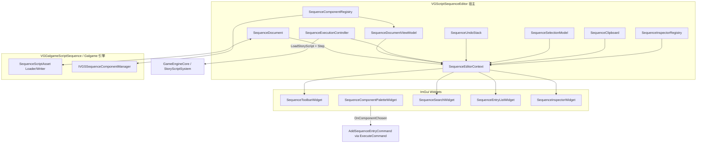

# VGEditorGalgameSequence 模块架构与开发进展

本文档描述 **Galgame 可视化序列脚本编辑器** 动态库目标（`VGEditorGalgameSequence`，CMake 中为 `SHARED`）的整体架构、各子系统职责、与引擎其他部分的协作方式，以及截至当前的实现进展与已知边界。

更细的「如何注册新序列组件 / Inspector」步骤见同目录下的 [SEQUENCE_EDITOR_REGISTRATION.md](SEQUENCE_EDITOR_REGISTRATION.md)。

---

## 1. 模块定位

`VGEditorGalgameSequence` 提供面向 **`.vgasset` 序列脚本资源** 的 ImGui 编辑体验：条目列表、组件调色板、属性检查器、撤销/重做、剪贴板、保存与「执行到某条目」的调试式步进。对外主入口为 `VisionGal::Editor::VGScriptSequenceEditor`（`Interface/SequenceEditor.h`），实现编辑器框架的 `IEditorTaskPanel`，并可由宿主通过 `RenderEmbeddedUI()` 嵌入同一套 UI。

**主要链接依赖**（见 `CMakeLists.txt`）：

- `VGEditorFramework`、`HNGEditorCore`：编辑器任务面板与基础设施。
- `VGGalgame`：Galgame 侧资源与引擎集成。
- `VGCore`、`HCorePlatform`、`HFileSystem`：核心服务、原生保存对话框、路径与 VFS。

序列数据本身来自 **`VGGalgameScriptSequence`**（`VGSSequenceDataContainer`、`IVGSSequenceComponent` 等）；本模块不重复定义运行时组件类型，而是通过 `IVGSSequenceComponentManager::EnumerateRegisteredTypeNameIDs` 与运行时注册表对齐。

---

## 2. 源码目录结构

| 路径 | 职责 |
|------|------|
| `Interface/` | 对外 API：`SequenceEditor.h`（`VGScriptSequenceEditor`）、`VGEGSExport.h`。 |
| `Include/Document/` | `SequenceDocument`：资源路径、脏标记、对 `VGSSequenceDataContainer` 的封装与读写。 |
| `Include/Core/` | `SequenceEditorContext`、选择、撤销栈、剪贴板、事件枚举占位、`SequenceEditorSettings` 预留。 |
| `Include/Commands/` | `ISequenceEditorCommand` 及增删改、移动、粘贴、属性编辑、复合命令。 |
| `Include/ComponentRegistry/` | 组件元数据、注册表、Bootstrap 声明。 |
| `Include/Inspector/` | `ISequenceInspector`、内置实现工厂、注册表。 |
| `Include/Runtime/` | `SequenceExecutionController`、`SequenceRuntimeSnapshot`、`SequenceRuntimeObserver`、`SequenceRuntimeOverlayState`。 |
| `Include/ViewModels/` | `SequenceDocumentViewModel`、`SequenceEntryViewModel`、`SequenceSearchViewModel`（展示层只读模型）。 |
| `Include/Validation/` | `SequenceValidationRegistry`、`ISequenceValidator`、`SequenceValidationIssue` 及 `Builtin/` 内置规则。 |
| `Include/Timeline/` | 线性时间轴 v1：`SequenceTimelineLayout`、`SequenceTimelineController`、`SequenceTimelineWidget`。 |
| `Include/Widgets/` | 工具栏、条目列表、调色板、搜索、Inspector、校验面板、大纲、状态栏、时间轴等 ImGui 控件。 |
| `Source/` | 与上述头文件对应的 `.cpp` 实现；`VGSequenceEditor.cpp` 为宿主级编排逻辑。 |

---

## 3. 总体架构

核心思想：**单一宿主类持有文档与工具对象，通过 `SequenceEditorContext` 把只读/可写依赖注入各 Widget**，文档变更优先走 **命令 + `SequenceUndoStack`**，以便统一撤销/重做。

---

## 4. 子系统说明

### 4.1 宿主：`VGScriptSequenceEditor`

- 构造路径分支：无参构造创建空文档并 `FillDefaultDemoEntries()`；带路径构造则 `LoadFromAssetPath`，并在进入场景播放模式时通过 `EngineEventBus` 自动 `SaveAsset()`。
- `InitializeChrome()`：调用 `BootstrapSequenceComponentRegistry` / `BootstrapSequenceInspectorRegistry`，刷新调色板，订阅调色板选类型事件并执行 `AddSequenceEntryCommand`。
- `SyncContext()`：每次渲染前对 `SequenceDocumentViewModel` 执行 `Rebuild` → `ApplyValidation` → `ApplyRuntimeOverlay` → `ApplySearchViewModel`；随后把 `document`、`documentViewModel`、`validationRegistry`、`runtimeOverlay`、`execution`、`selection`、`undo`、`clipboard`、`inspectorRegistry`、搜索过滤、`executeTo` 回调与 `lastExecutionSnapshot` 写入 `SequenceEditorContext`。
- `RenderEditorBody()`：菜单栏工具栏、状态栏、`DockSpace`、窗口「组件调色板」「时间轴」「大纲」「校验面板」「序列」，以及快捷键（Ctrl+C/X/V）与未保存关闭弹窗。
- `ExecuteTo(index)`：先保存资源，清空再填充 `SequenceRuntimeSnapshot`，委托 `SequenceExecutionController::ExecuteTo`，随后由 `SequenceRuntimeObserver::NotifyExecuteCompleted` 将快照推入 `SequenceRuntimeOverlayState` 供 ViewModel 与状态栏消费。

### 4.2 文档层：`SequenceDocument`

- 内部持有 `Ref<VGSSequenceDataContainer>` 与 `m_assetPath`、`m_dirty`。
- 加载/保存通过 `GalGame::SequenceScriptAssetLoader` / `SequenceScriptAssetWriter` 与 `SequenceScriptAsset` 交互。
- 仍提供 `GetSequence()` 及若干直接修改序列的 API，头文件中标注为 **LEGACY**（尚未全部迁移到命令的 UI 路径仍可能使用）。
- 辅助：`InsertEntryAt`、`SetSequenceEntries`、重排接口等供命令与剪贴板使用。

### 4.3 编辑上下文：`SequenceEditorContext`

- 轻量聚合指针 + `ExecuteCommand(std::unique_ptr<ISequenceEditorCommand>)`，内部将命令交给 `SequenceUndoStack` 与当前 `SequenceDocument`（见 `SequenceEditorContext.cpp`）。
- 扩展点：`documentViewModel`（每帧重建的只读行表）、`validationRegistry`、`runtimeOverlay`（`SequenceRuntimeObserver` 推送）、`searchFilter`、`executeToEntry` / `executeToUserData`、`lastExecutionSnapshot` 由宿主注入；列表 / 时间轴 / 大纲只遍历 `GetVisibleEntries()`，变更仍只通过命令。

### 4.4 命令与撤销：`ISequenceEditorCommand` / `SequenceUndoStack`

| 命令 | 作用 |
|------|------|
| `AddSequenceEntryCommand` | 按 `TypeNameID` 追加条目。 |
| `RemoveSequenceEntryCommand` | 按索引集合删除。 |
| `MoveSequenceEntryCommand` | 拖拽重排。 |
| `PasteSequenceEntriesCommand` | 在指定位置插入克隆条目列表。 |
| `EditSequencePropertyCommand` | 配合 `SequenceEditFieldId` 做可撤销字段编辑（当前主要用于普通对话 Inspector）。 |
| `CompoundSequenceCommand` | 组合多条命令为一次撤销单元。 |

标准三操作：`Execute` / `Undo` / `Redo` 均接收 `SequenceDocument&`。

### 4.5 选择与剪贴板

- `SequenceSelectionModel`：单选、Ctrl 多选、`ClampToSize` 在条目删除后修正索引。
- `SequenceClipboard`：深拷贝选中条目；`TryPaste` 通过 `PasteSequenceEntriesCommand` 插入；`CutSelection` 注释中说明完整「剪切」语义可能需要与复合命令组合。

### 4.6 组件注册：`SequenceComponentRegistry` 与 Bootstrap

- `BootstrapSequenceComponentRegistry` 遍历运行时注册的所有 `TypeNameID`，填充 `SequenceComponentMetadata`（展示名、图标、分类、优先级）。
- 内置三种类型（普通对话、切换立绘、切换背景）在 `SequenceEditorRegistriesBootstrap.cpp` 的 `FillPresentationForTypeNameID` 中写中文名与 FontAwesome 图标；其余类型使用默认立方体图标与分类「序列组件」。
- `BuildPaletteCategories()` 为调色板提供分类列数据。

### 4.7 检查器：`SequenceInspectorRegistry` / `ISequenceInspector`

- `ISequenceInspector` 预留 `OnInspectorGUI`、`OnHeaderGUI`、`OnTimelineGUI`、`OnContextMenu` 等钩子，便于未来时间轴或图形式编辑。
- `MakeSequenceInspectorForMetadata`（`BuiltinSequenceInspectors.cpp`）按类型分派：
  - **普通对话**：带 staging 字符串，失焦后通过 `EditSequencePropertyCommand` 写入（支持撤销）。
  - **切换立绘 / 切换背景**：直接 ImGui 绑定组件字段；背景支持从内容浏览器拖入纹理路径。
  - **其他类型**：`FallbackSequenceInspector`（空面板，但视为已注册）。

### 4.8 运行时步进：`SequenceExecutionController`

- 若当前非播放模式则 `EnterPlayMode`。
- 通过 `GalGame::GameEngineCore` 取得故事脚本系统，`LoadStoryScript(assetPath)` 后循环 `Continue`/`Tick`，直到 `SSSequenceRuntimeDebugInfo::CurrentIndex` 达到目标索引或触发步数上限 / 停滞检测。
- 结果写入 `SequenceRuntimeSnapshot`（当前索引、是否到达目标、错误字符串等），**不保存引擎指针**；宿主随后调用 `SequenceRuntimeObserver::NotifyExecuteCompleted` 写入 `SequenceRuntimeOverlayState`，供 ViewModel 行高亮与状态栏展示（Widget 不轮询引擎）。

### 4.9 展示层 ViewModel 与校验

- `SequenceDocumentViewModel::Rebuild` 从 `SequenceDocument` 与 `SequenceComponentRegistry` 填充每行的 `DisplayName` / `Subtitle` / `Category` / `Icon` 等；`ApplySearchViewModel` 产出 `GetVisibleEntries()`；`ApplyValidation` 汇总 `SequenceValidationRegistry::RunAll` 的问题并标记 `HasValidationError`；`ApplyRuntimeOverlay` 标记 `RuntimeHighlight`。
- `SequenceValidationRegistry` + `ISequenceValidator`：内置规则含空对话文本、立绘/背景缺资源路径等（`BootstrapSequenceValidationRegistry`）。

### 4.10 展示层 Widget（简要）

| Widget | 行为摘要 |
|--------|----------|
| `SequenceToolbarWidget` | File（新建/保存/另存为）、Edit（撤销/重做/复制粘贴）、Play（对唯一选中项 Execute To）。 |
| `SequenceStatusBarWidget` | 资源路径、脏标记、校验问题计数、`runtimeOverlay` 中的运行错误。 |
| `SequenceComponentPaletteWidget` | 消费注册表分类，展示可添加组件。 |
| `SequenceSearchWidget` | 文本过滤 + 维度开关（文本 / 仅错误 / 仅运行行），由 ViewModel 统一筛选可见行。 |
| `SequenceEntryListWidget` | 仅遍历 `GetVisibleEntries()`；行内 Exec、Ctrl 多选、拖拽 `MoveSequenceEntryCommand`、关闭折叠触发删除；大行数时 `ImGuiListClipper` 紧凑行虚拟化。 |
| `SequenceTimelineWidget` | 线性行条、选中与拖拽重排（同命令）；无曲线与多轨道。 |
| `SequenceOutlinerWidget` | 按 `Category` 分组展示当前可见行。 |
| `SequenceValidationWidget` | 列出校验问题，点击跳转选中条目索引。 |
| `SequenceInspectorWidget` | 单选时按 `TypeNameID` 从注册表绘制 Inspector；多选提示不显示属性。 |

### 4.11 集成入口

- **任务面板**：`ModuleEditorGalgame.cpp` 中 `NewTask(new VGScriptSequenceEditor(path), ...)`。
- **嵌入 Visual GalGame Editor**：`VisualGalgame.h` 内嵌 `VGScriptSequenceEditor`，调用 `RenderEmbeddedUI()`。

---

## 5. 数据流概要

1. 宿主构造 `SequenceDocument`，Bootstrap 组件 / 检查器 / 校验注册表，`SyncContext()` 重建 `SequenceDocumentViewModel` 并将指针灌入 `SequenceEditorContext`。
2. Widget 只通过 context 读取文档与选择；修改应调用 `context.ExecuteCommand(...)`，由 `SequenceUndoStack` 推入撤销栈并作用于文档。
3. 资源持久化由 `SequenceDocument` 与 `VGGalgameScriptSequence` 资源管线完成。
4. 「执行到某行」路径：保存 → `SequenceExecutionController` 驱动引擎脚本实例 → 更新 `SequenceRuntimeSnapshot` → `SequenceRuntimeObserver` 写入 overlay → ViewModel 行高亮与状态栏。

---

## 6. 当前开发进展

### 6.1 已具备的能力

- 序列文档的加载、保存、另存为、未命名重置与脏标记跟踪。
- 与运行时类型列表对齐的组件调色板；内置三类组件的展示信息与专用 Inspector；其余类型有 Fallback。
- 条目列表与时间轴：基于 ViewModel 可见行、搜索维度、校验高亮与运行时高亮；选择、逐行执行、拖拽排序、删除；调色板添加条目。
- 撤销栈与命令对象覆盖增删、移动、粘贴、对话字段编辑；工具栏与 Ctrl+C/X/V 剪贴板流程。
- 工具栏「Execute To 选中项」与列表行「Exec」：`ExecuteTo` 前自动保存，快照反馈错误信息。
- 关闭带脏文档时的确认弹窗（任务面板模式）。
- 单元测试 `VGEditorGalgameSequenceTest`：文档 SaveAs/Reset、撤销添加、剪贴板复制粘贴、粘贴命令撤销（见 `Engine/Source/Tests/VGEditorGalgameSequenceTest/`）。
- ViewModel / 校验：`Rebuild` 行数与文档一致、搜索过滤可清空可见行、内置校验器在演示文档上产生问题的 gtest。

### 6.2 部分完成或过渡状态

- `SequenceDocument::GetSequence()` 等 **LEGACY** 直接访问仍存在，部分 Inspector（立绘/背景）仍直接改组件指针字段，**未全部**走 `EditSequencePropertyCommand`，与「全字段可撤销」目标不一致。
- `SequenceEditorSettings` 与 `SequenceEditorEvents.h` 中的枚举 **尚未** 接入统一事件总线，属预留扩展点。
- `ISequenceInspector` 的 Header / Timeline / ContextMenu 钩子多数未实现具体 UI。

### 6.3 第三阶段（Presentation Layer）已落地要点

- **ViewModel**：`SequenceDocumentViewModel` + `SequenceEntryViewModel`；宿主每帧 `Rebuild` 与过滤 / 校验 / 运行时叠加刷新（首版全量重建，后续可按文档代次优化）。
- **列表 / 时间轴 / 大纲**：只消费 `GetVisibleEntries()`；拖拽与 Exec 仍使用真实 `EntryIndex` 走既有命令。
- **校验**：`SequenceValidationRegistry` + Builtin 规则；`SequenceValidationWidget` 与状态栏展示问题数量。
- **运行时**：`SequenceRuntimeObserver` + `SequenceRuntimeOverlayState`；`ExecuteTo` 后推送，列表高亮读 ViewModel，不再依赖 Widget 轮询引擎。
- **搜索**：`SequenceSearchViewModel` 维度与 `ApplySearchViewModel` 统一过滤。
- **其他 UI**：`SequenceStatusBarWidget`；大行数下列表 `ImGuiListClipper` 虚拟化紧凑行。

### 6.4 建议后续工作（非承诺路线图，仅反映代码缺口）

- 将立绘、背景等 Inspector 字段逐步改为命令式编辑，并补齐多选/批量操作策略。
- 以文档代次或脏标记驱动增量 `Rebuild`，降低大序列上的全量重建成本。
- 利用 `SequenceEditorEventType` 或引擎事件，在文档/选择变化时刷新依赖 UI，减少隐式 `SyncContext` 假设。
- 扩展测试覆盖：移动命令、复合命令、执行控制器错误分支等（需可 mock 引擎时更易维护）。

---

## 7. 相关文档与代码入口

| 主题 | 位置 |
|------|------|
| 注册新组件与 Inspector | [SEQUENCE_EDITOR_REGISTRATION.md](SEQUENCE_EDITOR_REGISTRATION.md) |
| 宿主编排与 UI 布局 | `Source/VGSequenceEditor.cpp`、`Interface/SequenceEditor.h` |
| 运行时组件定义 | `Engine/Source/Runtime/VGGalgameScriptSequence/`（及 `IVGSSequenceComponentManager` 注册） |

---

## 8. 修订记录

| 日期 | 说明 |
|------|------|
| 2026-05-11 | 初版：完整架构说明与进展对齐当前代码树。 |
| 2026-05-11 | 补充第三阶段 Presentation：ViewModel、校验、运行时 Overlay、时间轴与相关测试说明。 |
