# MERGED — RuntimeGalgame 模块文档合集

本文件由 `merge_docs.py` 自动生成，**请勿手改**；编辑请修改各子目录 `Docs/MODULE_ARCHITECTURE_AND_PROGRESS.md` 或根目录 `GALGAME_MODULE_ARCHITECTURE_AND_PROGRESS.md` 后重新运行脚本。

共收录 **9** 个子模块文档 + 根总览。


---
## Module: VGGalgame

# VGGalgame 模块架构、使用说明与开发进展

本文档描述 **Galgame 展示与运行时集成层** 目标 `VGGalgame`（CMake：`SHARED`）的目录结构、**`GalGameEngine`** 子系统协作关系、**`GalGameSystem`** 引导步骤，以及本模块内 **具体类** 的 **API 说明**（公开 **`I*`** 契约见 **`VGGalgameContract`** / **`VGGalgameRuntimeCore`**，通过 **`VGGalgameCore`** INTERFACE 聚合链接）。

导出宏见 `VGGalgameConfig.h`（`VG_GALGAME_API`）；编译定义 `VG_GALGAME_EXPORT`。

---

## 1. 模块定位与依赖

| 项目 | 说明 |
|------|------|
| **职责** | 实现 **`IGalGameEngine`** 的具体类 **`GalGameEngine`**；装配 **存档 `ArchiveSystem`**、**对话 `DialogueSystem`**、**分层场景 `LayeredSceneSystem`**、**渲染 `RenderPipeline`**、**资源 `ResourceSystem`**、**UI `GalGameUISystem`**、**剧情 `StoryScriptSystem`**（实现位于本模块 **`Include/ScriptSystem/`**）；实现 **`Game.h`** 中的 **`GalSprite` / `GalAudio` / `GalVideo` / `GalCharacter`**；提供 **`GalGameSystem::Initialize`** 完成子引擎注册、Actor 工厂、场景序列化段、Lua API 与 **Lua / Sequence** 模块挂载。 |
| **CMake 链接** | `PUBLIC VGGalgameNodeGraph`、`PUBLIC VGGalgameCore`、`PUBLIC VGGalgamePresentation`、`PUBLIC VGGalgameLuaRuntime`、`PUBLIC VGGalgameSequenceRuntime`（并间接依赖 **`VGEngine`** 等）。 |
| **典型消费方** | 桌面宿主、编辑器 Play Mode、测试工程；通过 **`CoreGameEngine::AddSubGameEngine`** 挂载。 |
| **不负责** | **`IStoryScriptSystem`** 等契约定义（**`VGGalgameContract`** + **`VGGalgameRuntimeCore/Interface/IGameSystem.h`**）；**`GalGameScriptExecutorFactory`**（**`VGGalgameRuntimeCore/Interface/IStoryScript.h`**）；节点图执行函数（**`VGGalgameNodeGraph`**）；**`RenderPipeline`** 实现体（**`VGGalgamePresentation`**）；Lua / Sequence 执行器具体类（**`VGGalgameLuaRuntime`** / **`VGGalgameSequenceRuntime`**）。 |

---

## 2. 源码目录结构（与仓库实际文件一致）

| 路径 | 职责 |
|------|------|
| `VGGalgameConfig.h` | **`VG_GALGAME_API`**。 |
| `Interface/GalgameSystem.h` / `Source/Interface/GalgameSystem.cpp` | **`GalGameSystem::Initialize`**：创建 **`GalGameEngine`**、注册 **`GalGameEngineGameActorBuilder`**、**`GalGameEngineComponentSerializer`**、**`GalGameLuaBinding`**、**`GalGameLuaScriptModule::MountEngineRuntime`**（**`VGGalgameLuaRuntime`**）、**`GalGameSequenceScriptModule::MountEngineRuntime`**（实现在 **`Source/Interface/GalGameSequenceScriptModuleMount.cpp`**）。 |
| `Include/GalGameEngine.h` / `Source/GalGameEngine.cpp` | **`GalGameEngine`**：子系统生命周期、**`Initialize`**、**`OnUpdate`**（经 **`IGalRuntimeSession::Tick`**）、渲染回调里驱动 **`RenderPipeline`**；持有 **`GalSubsystemBus`**、**`GalGameRuntimeHost`**、**`GalRuntimeSessionHost`**。 |
| `Include/GalSubsystemBus.h` / `Source/GalSubsystemBus.cpp` | **`GalSubsystemBus`** 与各 **`Gal*SubsystemAdapter`**：实现 **`ISubsystemBus`**，直访引擎子系统。 |
| `Include/Runtime/*.h` / `Source/Runtime/*.cpp` | **`GalRuntimeSessionHost`**、**`GalGameRuntimeHost`**、**`GalDefaultExecutionScheduler`** 等 Phase 8 运行时装配。 |
| `Include/Game.h` / `Source/Game.cpp` | **`GalSprite`**、**`GalAudio`**、**`GalVideo`**、**`GalCharacter`** 实现。 |
| `Include/ArchiveSystem.h` / `Source/ArchiveSystem.cpp` | 槽位存档 JSON 目录扫描与读写。 |
| `Include/DialogueSystem/*` / `Source/DialogueSystem/*` | **`DialogueSystem`** 门面；**`DialogueRmlPresentation`**、**`DialogueLineRuntime`**、**`DialogueTypingRuntime`**、**`DialoguePlaybackRuntime`**、**`TypingEffect`**。 |
| `Include/ResourceSystem.h` / `Source/ResourceSystem.cpp` | 场景 Actor 创建与 **`LayeredSceneSystem`** 挂载。 |
| `Include/SceneSystem/*` / `Source/SceneSystem/*` | **`LayeredSceneSystem`**、**`SceneSpriteManager`**、**`SceneAudioManager`**、**`SceneVideoManager`**。 |
| `Include/UISystem/GalUISystem.h` / `Source/UISystem/GalUISystem.cpp` | **`GalGameUISystem`**。 |
| `Include/ScriptSystem/StoryScriptSystem.h` / `Source/ScriptSystem/StoryScriptSystem.cpp` | **`StoryScriptSystem`**：实现 **`IStoryScriptSystem`**；加载脚本、存档回放、UI 选择/输入桥接。 |
| `Include/ScriptSystem/StoryExecutionInstance.h` / `Source/ScriptSystem/StoryExecutionInstance.cpp` | **`StoryExecutionInstance`**：**`IStoryExecutionInstance`** 包装 **`IStoryScriptExecutor`**。 |
| `Include/RenderPipeline.h` | **薄转发**：`#include "VGGalgamePresentation/Include/RenderPipeline.h"`；实现与 `.cpp` 在 **`VGGalgamePresentation`**。 |
| `Include/SpriteAnimationScriptManager.h` / `Source/SpriteAnimationScriptManager.cpp` | **`SpriteTransformScriptManager`**：精灵变换命令工厂。 |
| `Include/SpriteAnimationScript.h` / `Source/SpriteAnimationScript.cpp` | **`ScrollTransformScript`** 等动画脚本片段。 |
| `CMakeLists.txt` | `GLOB` 收集源；定义 **`VG_GALGAME_EXPORT`**。 |
| `Docs/MODULE_ARCHITECTURE_AND_PROGRESS.md` | 本文件。 |

---

## 3. 总体架构

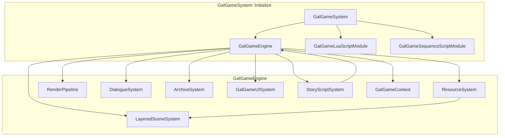

**一帧更新顺序**（`GalGameEngine::OnUpdate` → **`GalRuntimeSessionHost::Tick`**，见 `GalRuntimeSessionHost.cpp` 注释）：**`LayeredSceneSystem::OnUpdate`** → **`DialogueSystem::Update`** → **`GalDefaultExecutionScheduler::Tick`**（内部驱动 **`StoryScriptSystem::Update`** 等）。

**渲染**：引擎 **`IGameEngineContext`** 的 **BeforeRender** 回调中调用 **`RenderPipeline::Render`**（见 **`GalGameEngine::Initialize`** 订阅）。

**主场景切换**（`EngineEventType::MainSceneChanged`）：清空分层场景、切换 **`Scene*`**、**`DialogueSystem::Clear`**；若处于播放模式则 **`LoadSceneStoryScriptOnUpdate`** 延迟加载脚本，避免资源残留竞态（见 **`GalGameEngine.cpp`** 注释）。

---

## 4. 详细使用说明

### 4.1 引擎启动时挂载（推荐）

在 **`CoreGameEngine`** 已完成基础上下文（含 UI **`Rml::Context`**）可用后调用一次：

```cpp
VisionGal::GalGameSystem::Initialize(coreGameEngine);
```

效果摘要（`GalgameSystem.cpp`）：

1. `MakeRef<GalGame::GalGameEngine>()` → **`galgameEngine->Initialize(engine.GetContext())`** → **`engine.AddSubGameEngine(galgameEngine)`**。
2. 注册 **`GalGameEngine`** 类型 Actor 构建器（标签「GalGame Engine」并添加 **`GalGameEngineComponent`**）。
3. **`SceneSerializerRegistry::RegisterSegmentSerializer`** 注册 **`GalGameEngineComponentSerializer`**。
4. **`CoreLua::RegisterGlobalAPI`** 内 **`GalGameLuaBinding::Register`**。
5. **`GalGameLuaScriptModule::MountEngineRuntime`** + **`GalGameSequenceScriptModule::MountEngineRuntime`**。

### 4.2 取得 `IGalGameEngine*`

- 由 **`CoreGameEngine`** 子引擎列表查询 **`GalGameEngine`** 实例后向上转型；或
- 在 Lua / 工具代码中通过 **`VisionGal::GalGame::GalGameEngineAccess::Current()`**（由 **`GalGameEngine::Initialize`** 调用 **`GalGameEngineAccess::SetCurrent`** 注入）。

### 4.3 典型游戏循环配合

1. 确保宿主每帧调用 **`IGalGameEngine::OnUpdate(deltaTime)`**（子引擎接口继承自 **`ISubGameEngine`**）。
2. 渲染管线由引擎上下文 **BeforeRender** 自动触发 **`RenderPipeline`**；无需在空实现的 **`OnRender`** 中重复调用。
3. 剧情推进：脚本系统内部 **`Tick`** 执行器；玩家确认对白继续时调用 **`IDialogueSystem::ContinueDialogue`** 与（若使用 Sequence 执行器）**`IStoryScriptSystem`** / **`IStoryExecutionInstance::Continue`**（详见本模块 **`Include/ScriptSystem/`** 与 **`VGGalgameSequenceRuntime`** 文档）。

### 4.4 场景侧配置

在场景 Actor 上挂载 **`GalGameEngineComponent`**，填写 **`scriptPath`** 与各类 UI 资产路径；进入场景且 **`IsPlayMode()`** 为真时，由 **`GalGameEngine::OnMainSceneChanged`** 触发 **`StoryScriptSystem::LoadSceneStoryScriptOnUpdate`**。

### 4.5 转场与快进

**`GalGameEngine::TransitionCommand*`**：若 **`DialogueSystem::IsFastForward()`** 为真则直接返回成功并不启动转场；否则委托 **`TransitionManager`**（`VGEngine`）。

---

## 5. 本模块公开类型 API 参考

### 5.1 `GalGameSystem`（`Interface/GalgameSystem.h`）

| API | 说明 |
|-----|------|
| `static void Initialize(CoreGameEngine& engine)` | **一次性**引导：子引擎、工厂、序列化、Lua、脚本模块挂载。 |

### 5.2 `GalGameEngine`（`Include/GalGameEngine.h`）

在 **`IGalGameEngine`** 之外扩展：

| API | 说明 |
|-----|------|
| `void Initialize(IGameEngineContext* context)` | 设置 **`GalGameEngineAccess::SetCurrent`**、**`CreateSubsystem`**、订阅视口尺寸与 **BeforeRender**。 |
| `void OnRender() override` | 当前为空；实际渲染在 **`OneRenderSceneCallback`**。 |
| `void OnUpdate(float deltaTime) override` | 经 **`GetRuntimeSession()->Tick`** 驱动子系统（见 §3）；并实现 **`IGalGameEngine::GetSubsystemBus` / `GetContext` / `GetRuntimeSession` / `GetRuntime`**。 |

**`CreateSubsystem` 私有流程**：分配 **`GalGameContext`**（**`GalGameContext::Create`**，**不再写入 `IGalGameEngine*`**）→ 对话系统 **`InitialiseDataModel` + `Initialize`** → **`LayeredSceneSystem::Initialize`** → **`RenderPipeline::Initialize`**（实现类型定义在 **`VGGalgamePresentation`**；本模块头文件为薄 include）→ **`ArchiveSystem::Initialise`** → **`StoryScriptSystem::SetEngine` + `Initialise`** → **`ResourceSystem::Initialize`** → **`GalGameUISystem::Initialize`** → 装配 **`GalSubsystemBus`** 与 **`GalGameRuntimeHost`** / **`GalRuntimeSessionHost`**。

### 5.3 `ArchiveSystem`（`Include/ArchiveSystem.h`）

| API | 说明 |
|-----|------|
| `bool Initialise(const Ref<GalGameContext>& ctx)` | 绑定上下文，扫描存档目录。 |
| `SaveArchive SaveArchiveByNumber(const String& number) override` | 构造当前状态存档（含 **`archiveData`** 序列化路径逻辑，见实现）。 |
| `SaveArchive GetArchiveByNumber` / `bool HasArchiveByNumber` | 读槽位。 |
| `std::string GetCurrentDateFormat()` / `GetCurrentTimeFormat()` | UI 用时间戳字符串。 |

### 5.4 `DialogueSystem`（`Include/DialogueSystem/DialogueSystem.h`）

| API | 说明 |
|-----|------|
| `void Initialize(const Ref<GalGameContext>& ctx)` | 绑定上下文与运行时状态。 |
| `bool InitialiseDataModel(Rml::Context* context)` | 绑定 Rml 数据模型（返回值表示是否成功，见实现）。 |
| 其余方法 | 与 **`IDialogueSystem`** 一一对应；内部 **`TypingEffect`** 驱动 **`m_DialogName` / `m_DialogText`** 显示串。 |
| `void Update() override` | 每帧：**`TypingEffect::Update`**、快进、自动继续逻辑（**`ProcessFastForward`** / **`ProcessAutoDialogue`**）。 |

### 5.5 `ResourceSystem`（`Include/ResourceSystem.h`）

| API | 说明 |
|-----|------|
| `void Initialize(const Ref<GalGameContext>& galCtx, const Ref<LayeredSceneSystem>& sceneSystem)` | 保存 **`Scene*`**（来自上下文主场景）、绑定分层管理器。 |
| `bool PreLoadResource(const String& path)` | 预加载。 |
| `GalSprite* ShowSprite` / `ShowColor` | 创建精灵包装并加入场景图。 |
| `GalAudio* PlayAudio` / `GalVideo* PlayVideo` | 创建音/视频 Actor。 |
| `bool RemoveSprite(GalSprite*)` / `RemoveAudio(GalAudio*)` | 从分层管理器移除。 |

### 5.6 `LayeredSceneSystem`（`Include/SceneSystem/LayeredSceneSystem.h`）

| API | 说明 |
|-----|------|
| `void Initialize(const Ref<GalGameContext>& ctx)` | 将上下文传给子 **`Scene*Manager`**。 |
| `AddCharacter` / `ClearAll` / `ClearAllCharacter` | 角色列表与场景资源清理。 |
| `TraverseScene` / `TraverseCharacter` | 遍历回调。 |
| `OnUpdate` override | 转发子管理器更新（若实现内有 Tick）。 |
| `GetSpriteManager` / `GetAudioManager` / `GetVideoManager` | 返回内部 **`SceneSpriteManager`** 等实例地址（生命周期同 **`LayeredSceneSystem`**）。 |

### 5.7 `GalGameUISystem`（`Include/UISystem/GalUISystem.h`）

| API | 说明 |
|-----|------|
| `void Initialize(const Ref<GalGameContext>& galCtx, IGameEngineContext* context)` | 缓存 **`IScene*`** 与上下文。 |
| `ShowChoiceUI` / `GetChoiceOptionByIndex` / `GetChoiceOptionSize` / `SelectCurrentChoice` | 选择支状态机 + 通过 **`GalGameContext::uiEventBus`** 派发 **`GalGameUIEvent`**（见 **`GalGameEvent.h`**）。 |
| `ShowFullScreenTextUI` / `GetFullScreenTextItem` / `GetFullScreenTextSize` | 全屏文本队列。 |
| `ShowInputUI` / `InputSubmitted` / `GetInputTitle` / `GetInputButtonText` | 输入框流程。 |

### 5.8 `RenderPipeline`（`Include/RenderPipeline.h` → **`VGGalgamePresentation/Include/RenderPipeline.h`**）

| API | 说明 |
|-----|------|
| `void Initialize(IGameEngineContext* context)` | 创建 RT、全屏渲染组件等（**实现 DLL：`VGGalgamePresentation`**）。 |
| `void Render(ILayeredSceneManager* scene, IOrthoCamera* camera, OpenGL::RenderTarget2D* rt)` | 主入口：背景层、场景层、角层混合（**`RenderBackgroundLayer`** / **`RenderSceneLayer`** / **`RenderMixCharacterSprite`**）。 |
| `void OnScreenSizeChanged(int width, int height)` | 视口变化时重建 RT。 |
| `void CaptureBackgroundLayer()` / `CaptureSceneLayer()` | 抓取上一帧纹理供转场使用。 |
| `void SetScene(Scene* scene)` | 主场景指针。 |

本仓库中 **`VGGalgame/Include/RenderPipeline.h`** 仅 **`#include "VGGalgamePresentation/Include/RenderPipeline.h"`**，链接依赖由 CMake **`PUBLIC VGGalgamePresentation`** 保证。

### 5.9 `GalRuntimeSessionHost`（`Include/Runtime/GalRuntimeSessionHost.h`）

| API | 说明 |
|-----|------|
| **`Start` / `Stop` / `Pause` / `Resume`** | 实现 **`IGalRuntimeSession`**；与引擎 Initialize/Reset 对齐。 |
| **`Tick(deltaTime)`** | 会话级 Tick（内部顺序见实现：场景/对白 → **`GalDefaultExecutionScheduler::Tick`** 等）。 |
| **`GetSubsystemBus` / `GetExecutionScheduler` / `GetRuntimeState` / `GetResourceContext`** | 返回引擎装配的总线、调度器与 **`GalGameContext`**。 |
| **`GetEventPipeline()`** | 当前为 **`GalNoopRuntimeEventPipeline`** 占位。 |

### 5.10 `GalGameRuntimeHost`（`Include/Runtime/GalGameRuntimeHost.h`）

| API | 说明 |
|-----|------|
| **`GetExecutionRuntime`** | **`IStoryScriptSystem*`**（引擎内 **`StoryScriptSystem`**）。 |
| **`GetSaveRuntime`** | **`IArchiveSystem*`**（**`ArchiveSystem`**）。 |
| **`GetPlaybackRuntime`** | **`IPlaybackSubsystem*`**；与 **`ISubsystemBus::Playback()`** 指向同一适配器，避免重复状态。 |
| **`GetVariableRuntime`** | 当前可返回 **nullptr**（占位）。 |

### 5.11 `GalDefaultExecutionScheduler`（`Include/Runtime/GalDefaultExecutionScheduler.h`）

| API | 说明 |
|-----|------|
| **`Tick`** | 委托剧情 **`StoryScriptSystem::Update`** 等（与引擎 **`OnUpdate`** 顺序文档化于会话宿主）。 |
| **`SubmitYield`** | **`GalYieldKind::WaitSeconds`** 等路径可委托 **`StoryScriptSystem::Wait`**；其它 Yield 演进中。 |
| **`SubmitWait` / `Cancel` / `Pause` / `Resume`** | 句柄队列占位演进中。 |

### 5.12 `GalSubsystemBus` 与各 Adapter（`Include/GalSubsystemBus.h` / `Source/GalSubsystemBus.cpp`）

| 类型 | 说明 |
|------|------|
| **`GalSubsystemBus`** | 聚合 **`GalSceneSubsystemAdapter`**、**`GalAudioSubsystemAdapter`**、**`GalUISubsystemAdapter`**、**`GalScriptSubsystemAdapter`**、**`GalArchiveSubsystemAdapter`**、**`GalDialogueSubsystemAdapter`**、**`GalPlaybackSubsystemAdapter`**；实现 **`ISubsystemBus`**。 |
| **各 `Gal*SubsystemAdapter`** | **`SetOwner(GalGameEngine*)`** 后，将 **`ISubsystemBus`** 虚调用转发到引擎既有 **`ResourceSystem`** / **`LayeredSceneSystem`** / **`StoryScriptSystem`** 等（**不经 **`IGalGameEngine`** 已删除的上帝 API**）。 |

### 5.13 对白子模块（`Include/DialogueSystem/`）

| 类型 | 职责 |
|------|------|
| **`DialogueSystem`** | **`IDialogueSystem`** 装配门面；**`Update`** 组合各子运行时。 |
| **`DialogueRmlPresentation`** | Rml 数据模型绑定与表现串同步。 |
| **`DialogueLineRuntime`** | 对白行 / 历史 / 与 **`GalGameContext`** 状态同步。 |
| **`DialogueTypingRuntime`** | 打字机与回调。 |
| **`DialoguePlaybackRuntime`** | 自动播放 / 快进节拍。 |

### 5.14 `SpriteTransformScriptManager`（`Include/SpriteAnimationScriptManager.h`）

| API | 说明 |
|-----|------|
| `static SpriteTransformScriptManager* GetInstance()` | 单例访问（若实现为单例）。 |
| `static Ref<IAnimationScript> CreateSpriteTransformWithCommand(IGalGameEngine*, IGameActor*, const String& cmd)` | 解析命令字符串创建 **`IAnimationScript`**。 |
| `static bool StartSpriteTransformWithCommand(...)` | 便捷启动。 |

### 5.15 `ScrollTransformScript`（`Include/SpriteAnimationScript.h`）

| API | 说明 |
|-----|------|
| `enum class Direction { Left, Right, Up, Down }` | 滚动方向。 |
| `void SetDuration(float)` / `SetEasing(EasingFunction)` | 动画参数。 |
| `void Start() override` | **`IAnimationScript`** 生命周期。 |
| `void OnUpdate(Horizon::HEntityInterface* entity) override` | 每帧更新 **`TransformAnimationScript`**。 |

### 5.16 `GalSprite` / `GalAudio` / `GalVideo` / `GalCharacter`（`Include/Game.h`）

均实现 **`VGGalgameRuntimeCore/Interface/IGameObject.h`** 中对应 **`I*`** 接口（通过 **`VGGalgameCore`** 聚合头包含）；额外暴露 **`m_Engine`**、路径、图层、底层 **`IGameActor*`** 与（精灵）**`GalGameRuntimeState*`** 指针，供实现体内访问引擎与全局 UI 状态。

**`GalCharacter::FigureState`**：记录隐藏标志、状态名、当前立绘 **`IGalSprite*`**、当前语音 **`IGalAudio*`**；支持 **`AddFigure`** 状态表、**`ShowFigure`/`HideFigure`** 与 Lua 回调列表。

---

## 6. 开发进展（与当前代码对齐）

### 6.1 已完成

- **`GalGameEngine`** 完整子系统装配与主场景切换流程（含 **OnUpdate** 管线）。
- **资源 / 分层场景 / 渲染管线 / 对话（Rml 数据模型 + 打字机）/ 存档槽位 / Gal UI 事件总线** 联通。
- **`GalGameSystem`** 与 **Lua**、**Sequence** 模块引导一致化。
- **`Game.h`** 资源具体类与 **`SpriteTransformScriptManager`**、**`ScrollTransformScript`**。

### 6.2 进行中 / 占位

- **`GalGameEngine::Reset`** 仍为空；主场景切换时部分对话状态清理代码保留为注释（快进/自动/回调策略待定）。
- **`GalGameEngine::OnRender`** 为空设计，依赖 **BeforeRender** 回调；若宿主未注册引擎上下文回调需自行补渲染路径。

### 6.3 已知集成注意

- **`OneRenderSceneCallback`** 使用 **`Letterbox2DCamera`** 动态转型：摄像机类型不匹配时可能无法渲染 Gal 层，需与项目默认相机对齐。
- **`GalGameUISystem`** 依赖 **`IGameEngineContext`** 提供的主场景指针；场景未就绪时 UI 接口行为以实现为准。

---

## 7. 修订记录

| 日期 | 说明 |
|------|------|
| 2026-05-13 | 对齐 Phase 8：CMake **`VGGalgameLuaRuntime`**、**`RenderPipeline`** 实现位于 **Presentation**、**`CreateSubsystem`** 与 **`GalGameContext`** 无引擎指针、**`OnUpdate`** 经 **`GalRuntimeSessionHost`**、补充 Session/RuntimeHost/Scheduler/SubsystemBus/对白子模块 API 节。 |
| 2026-05-13 | **Phase 8**：引入 **`GalRuntimeSessionHost`** / **`GalDefaultExecutionScheduler`**；`OnUpdate` 经 **`IGalRuntimeSession::Tick`**；`PUBLIC` 链接 **`VGGalgamePresentation`**；**`RenderPipeline`** 迁至表现层 DLL；**`GalRuntimeLayerGraphAdapter`**（占位）与对白拆分说明头。 |
| 2026-05-13 | 删除对 **`VGGalgameRuntime`** 的依赖：**`StoryScriptSystem`** / **`StoryExecutionInstance`** 迁入本模块 **`ScriptSystem/`**；`PUBLIC` 链接 **`VGGalgameNodeGraph`**、**`VGGalgameCore`**。 |
| 2026-05-12 | 重写：纠正与 ScriptSequence 文档误粘贴问题；补齐 VGGalgame 目录、架构、`GalGameSystem` 引导与实现类 API 表。 |


---
## Module: VGGalgameContract

# VGGalgameContract — Phase 8 纯 ABI（INTERFACE）

## 1. 定位

| 项目 | 说明 |
|------|------|
| **职责** | 仅承载 **对外稳定虚接口**、**窄数据类型**（如 **`SubsystemBusSnapshot`**）与 **Yield/调度相关枚举**；**不包含** `SaveArchive` / `GalGameContext` / 执行器工厂 **实现**（见 **VGGalgameRuntimeCore**）。 |
| **CMake** | `INTERFACE` 库；`target_include_directories` 暴露本模块根与 `Engine/Source/Runtime` 根，以支持 `VGGalgameContract/Interface/...` 与历史 `Interface/...` 双风格。 |
| **依赖** | `INTERFACE` → **`VGEngine`**、**`VGCore`**。 |
| **ABI 提示** | 标注 **CORE ABI STABLE** 的头变更须版本号与存档 schema 联动；**Phase 11 前**部分门面（如 **`IGalGameEngine`**）仍可演进。 |

---

## 2. CMake

```cmake
add_library(VGGalgameContract INTERFACE)
target_link_libraries(VGGalgameContract INTERFACE VGEngine VGCore)
```

无独立 `.cpp`、无 DLL。

---

## 3. 目录结构

```
VGGalgameContract/
├── CMakeLists.txt
├── VGGalCoreConfig.h              # VG_GALGAME_CORE_API（由 RuntimeCore DLL 导出时定义 VG_GALGAME_CORE_EXPORT）
├── Include/
│   └── SubsystemBusSnapshot.h
└── Interface/
    ├── IGameEngine.h              # IGalGameEngine（瘦门面）
    ├── ISubsystemBus.h
    ├── IGalGameContext.h
    ├── IGalGameRuntime.h
    ├── IGalRuntimeSession.h
    ├── IExecutionScheduler.h      # GalYieldKind / GalYieldInstruction / IExecutionScheduler
    ├── IPlaybackSubsystem.h
    ├── IRuntimeExecutionServices.h
    ├── ISequenceAction.h
    ├── IScriptSubsystem.h
    ├── IStoryScriptSystem.h
    ├── IStoryScriptExecutor.h
    ├── IStoryExecutionAdapter.h
    ├── ISceneSubsystem.h
    ├── IUISubsystem.h
    ├── IAudioSubsystem.h
    ├── IArchiveSubsystem.h
    ├── IDialogueSubsystem.h
    ├── IDialoguePresenter.h
    ├── IChoicePresenter.h
    ├── IVariableRuntime.h
    ├── IRuntimeEventPipeline.h
    ├── IGalRuntimeEventBus.h
    ├── ILuaRuntimeBridge.h
    ├── IRuntimeDebugBridge.h
    ├── IRuntimeLayerGraph.h
    ├── IRuntimeSnapshotProvider.h
    └── ...
```

---

## 4. 依赖关系

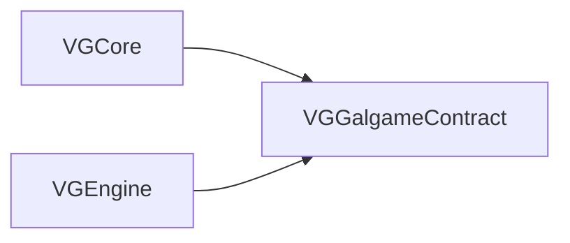

---

## 5. 使用说明

1. **仅依赖契约的模块**（如 **SequenceRuntime**、测试桩）应 **`target_link_libraries(... VGGalgameContract)`** 或通过 **`VGGalgameCore`** INTERFACE 间接获得。
2. **包含路径**：推荐 `#include "VGGalgameContract/Interface/IGameEngine.h"`；同目录下相对包含（如 `IGameEngine.h` 内含 `IGalGameContext.h`）依赖本目录为 include root。
3. **与 RuntimeCore 分界**：需要 **`SaveArchive`** 完整类型、`**GalGameContext**` 定义时，须链接 **RuntimeCore**（或 `VGGalgameCore` 聚合），不可仅在 Contract 中前向声明处展开使用。

---

## 6. 开发进展

| 子项 | 状态 |
|------|------|
| Phase 8.1 Contract 独立目标 | 已落地 |
| `IGalGameRuntime` / `IPlaybackSubsystem` / `IRuntimeExecutionServices` / `ISequenceAction` | 已落地 |
| `IGalRuntimeSession` / `IExecutionScheduler` + Yield | 已落地（调度器逻辑宿主实现演进中） |
| `IRuntimeDebugBridge` / `IGalRuntimeEventBus` / `IVariableRuntime` / Presenter 占位 | 骨架 |
| `IRuntimeEventPipeline` / `ILuaRuntimeBridge` / `IRuntimeLayerGraph` / `IRuntimeSnapshotProvider` | 骨架 |

---

## 7. API 参考（按头文件）

以下表格为 **public virtual / 关键类型** 摘要；**完整签名与注释以各 `.h` 为准**。

### 7.1 `VGGalCoreConfig.h`

| 符号 | 说明 |
|------|------|
| **`VG_GALGAME_CORE_API`** | 导入/导出宏；在 **VGGalgameRuntimeCore** 编译 SHARED 且定义 **`VG_GALGAME_CORE_EXPORT`** 时导出。 |

### 7.2 `Include/SubsystemBusSnapshot.h`

| 成员 | 说明 |
|------|------|
| **`opaqueToken`** (`std::uint64_t`) | 总线快照不透明句柄；默认 **Snapshot/Restore** 为空操作。 |

### 7.3 `Interface/IGameEngine.h` — `IGalGameEngine`

| 方法 | 说明 |
|------|------|
| **`Reset()`** | 重置引擎状态。 |
| **`GetSubsystemBus()`** | 返回 **`ISubsystemBus*`**。 |
| **`GetContext()`** | 返回 **`IGalGameContext*`**。 |
| **`GetRuntimeSession()`** | 返回 **`IGalRuntimeSession*`**（`noexcept`）。 |
| **`GetRuntime()`** | 返回 **`IGalGameRuntime*`**（`noexcept`）；多域运行时聚合。 |

继承 **`ISubGameEngine`**（`VGCore`）；具体 ShowSprite 等能力经 **SubsystemBus**。

### 7.4 `Interface/ISubsystemBus.h` — `ISubsystemBus`

| 方法 | 说明 |
|------|------|
| **`Snapshot()`** | 默认返回空 **`SubsystemBusSnapshot`**。 |
| **`Restore(const SubsystemBusSnapshot&)`** | 默认空操作。 |
| **`Scene()` / `UI()` / `Audio()` / `Script()` / `Archive()` / `Dialogue()`** | 各子系统指针。 |
| **`Playback()`** | **`IPlaybackSubsystem*`**（Wait/节拍）。 |

### 7.5 `Interface/IGalGameContext.h` — `IGalGameContext`

| 方法 | 说明 |
|------|------|
| 虚析构 | 具体实现为 **`GalGameContext`**（RuntimeCore）。 |

### 7.6 `Interface/IGalGameRuntime.h` — `IGalGameRuntime`

| 方法 | 说明 |
|------|------|
| **`GetExecutionRuntime()`** | **`IStoryScriptSystem*`**。 |
| **`GetSaveRuntime()`** | **`IArchiveSystem*`**（定义见 RuntimeCore `IGameSystem.h`）。 |
| **`GetPlaybackRuntime()`** | **`IPlaybackSubsystem*`**。 |
| **`GetVariableRuntime()`** | **`IVariableRuntime*`**；可 nullptr。 |

### 7.7 `Interface/IGalRuntimeSession.h` — `IGalRuntimeSession`

| 方法 | 说明 |
|------|------|
| **`Start` / `Stop` / `Pause` / `Resume`** | 会话生命周期。 |
| **`Tick(float deltaTime)`** | 每帧入口。 |
| **`GetSubsystemBus()`** | 同引擎总线视图。 |
| **`GetExecutionScheduler()`** | **`IExecutionScheduler*`**。 |
| **`GetRuntimeState()`** | **`IGalGameContext*`**（当前与资源上下文同源映射）。 |
| **`GetResourceContext()`** | 同上（演进中可拆分）。 |
| **`GetEventPipeline()`** | **`IRuntimeEventPipeline*`**；可 nullptr。 |

### 7.8 `Interface/IExecutionScheduler.h`

| 类型 | 说明 |
|------|------|
| **`GalExecutionHandle`** | `std::uint64_t`，`0` 无效。 |
| **`GalYieldKind`** | `WaitSeconds`、`WaitDialogueContinue`。 |
| **`GalYieldInstruction`** | `kind` + `seconds` 等载荷。 |

| 方法 | 说明 |
|------|------|
| **`SubmitWait(float)`** | 提交等待任务。 |
| **`Cancel` / `Pause` / `Resume`** | 按句柄控制。 |
| **`PauseAll` / `ResumeAll`** | 全局暂停恢复。 |
| **`Tick(float)`** | 每帧驱动。 |
| **`SubmitYield(const GalYieldInstruction&)`** | 默认返回 `0`；宿主可覆盖。 |

### 7.9 `Interface/IPlaybackSubsystem.h` — `IPlaybackSubsystem`

| 方法 | 说明 |
|------|------|
| **`Wait(float durationSeconds)`** | 协程式等待。 |

### 7.10 `Interface/IRuntimeExecutionServices.h` — `IRuntimeExecutionServices`

| 方法 | 说明 |
|------|------|
| **`DialogueCharacterSay(character, text)`** | 窄服务：播一行对白。 |

### 7.11 `Interface/ISequenceAction.h` — `ISequenceAction`

| 方法 | 说明 |
|------|------|
| **`Execute(IRuntimeExecutionServices&)`** | 执行。 |
| **`Suspend` / `Resume` / `Cancel`** | 默认空操作可覆盖。 |

### 7.12 `Interface/IScriptSubsystem.h` — `IScriptSubsystem`

| 方法 | 说明 |
|------|------|
| **`LoadStoryScript` / `LoadStoryScriptOnUpdate` / `ReloadStoryScript`** | 脚本路径加载。 |
| **`Wait(float)`** | 脚本侧等待。 |
| **`GetStoryScriptSystem()`** | **`IStoryScriptSystem*`**。 |

### 7.13 `Interface/IStoryScriptSystem.h` — `IStoryExecutionInstance` / `IStoryScriptSystem`

**`IStoryExecutionInstance`**

| 方法 | 说明 |
|------|------|
| **`Tick(deltaTime, ISubsystemBus*)`** | 每帧。 |
| **`Continue(ISubsystemBus*)`** | 继续（对白/选项后）。 |
| **`QueryInterface(InterfaceID)`** | RTTI 风格查询；模板 **`ExecutionQuery<T>()`**。 |

**`IStoryScriptSystem`**

| 方法 | 说明 |
|------|------|
| **`GetExecutionInstance(unsigned id)`** | 默认实例 `id=0`。 |
| **`ReloadStoryScript` / `LoadStoryScript` / `LoadStoryScriptOnUpdate`** | 加载策略。 |
| **`GetCurrentStoryScriptPath`** / **`GetScriptLastWriteTime`** | 热重载辅助。 |
| **`DoChoice` / `DoInput`** | UI 事件入口。 |
| **`LoadSceneStoryScript` / `LoadSceneStoryScriptOnUpdate`** | 场景级加载。 |
| **`Wait(float)`** | 等待。 |
| **`LoadArchive(const SaveArchive&)`** | 读档（`SaveArchive` 完整类型在 RuntimeCore）。 |

### 7.14 `Interface/IStoryScriptExecutor.h` — `IStoryScriptExecutor` / `IStoryScriptExecutorCreator`

**`IStoryScriptExecutor`**（继承 **`VGEngineResource`**）

| 方法 | 说明 |
|------|------|
| **`Run(ISubsystemBus*, IGalGameContext*)`** | 启动执行。 |
| **`Tick(float)`** | 每帧。 |
| **`QueryInterface`** | 扩展查询。 |
| **`PreLoadScriptResource`** | 预加载。 |
| **`GetScriptLastWriteTime`** | 文件时间。 |
| **`ContinueDialogue`** | 继续对白。 |
| **`OnChoiceSelected` / `OnInputSubmitted`** | UI 回调。 |

**`IStoryScriptExecutorCreator`**

| 方法 | 说明 |
|------|------|
| **`LoadFromAsset(const String& path)`** | 返回 **`Ref<IStoryScriptExecutor>`**。 |

### 7.15 `Interface/IStoryExecutionAdapter.h` — `IStoryExecutionAdapter`

| 方法 | 说明 |
|------|------|
| **`GetExecution()`** | **`IStoryExecutionInstance*`**（不拥有）。 |
| **`Tick` / `Continue`** | 转发到执行实例。 |

### 7.16 `Interface/ISceneSubsystem.h` — `ISceneSubsystem`

| 方法 | 说明 |
|------|------|
| **`PreLoadResource`** | 预加载资源。 |
| **`TransitionCommand` / `TransitionCommandWithCustomImage`** | 转场命令。 |
| **`ShowSprite` / `ShowColor` / `PlayVideo` / `CreateCharacter`** | 场景表现。 |
| **`RemoveSprite` / `HideAllCharacterSprite` / `CaptureSceneImage`** | 资源与截图。 |
| **`GetLayeredSceneManager()`** | **`ILayeredSceneManager*`**（RuntimeCore 定义）。 |

### 7.17 `Interface/IUISubsystem.h` — `IUISubsystem`

| 方法 | 说明 |
|------|------|
| **`GetGalGameUISystem()`** | **`IGalGameUISystem*`**（RuntimeCore `IGameSystem.h`）。 |

### 7.18 `Interface/IAudioSubsystem.h` — `IAudioSubsystem`

| 方法 | 说明 |
|------|------|
| **`PlayAudio(layer, path)`** | 返回 **`IGalAudio*`**。 |
| **`RemoveAudio(IGalAudio*)`** | 移除。 |

### 7.19 `Interface/IArchiveSubsystem.h` — `IArchiveSubsystem`

| 方法 | 说明 |
|------|------|
| **`LoadArchive(const SaveArchive&)`** | 读档。 |
| **`GetArchiveDataContainer()`** | **`ArchiveDataContainer*`**。 |
| **`GetArchiveSystem()`** | **`IArchiveSystem*`**。 |

### 7.20 `Interface/IDialogueSubsystem.h` — `IDialogueSubsystem`

| 方法 | 说明 |
|------|------|
| **`GetDialogueSystem()`** | **`IDialogueSystem*`**（RuntimeCore）。 |

### 7.21 `Interface/IDialoguePresenter.h` — `IDialoguePresenter`

| 方法 | 说明 |
|------|------|
| **`OnDialogueVisualChanged()`** | 非纯虚默认空；占位。 |

### 7.22 `Interface/IChoicePresenter.h` — `IChoicePresenter`

占位结构体，无纯虚方法（避免破坏构建）。

### 7.23 `Interface/IVariableRuntime.h` — `IVariableRuntime`

占位，仅虚析构。

### 7.24 `Interface/IRuntimeEventPipeline.h` — `IRuntimeEventPipeline`

骨架，仅虚析构。

### 7.25 `Interface/IGalRuntimeEventBus.h` — `IGalRuntimeEventBus`

骨架，仅虚析构。

### 7.26 `Interface/ILuaRuntimeBridge.h` — `ILuaRuntimeBridge`

| 方法 | 说明 |
|------|------|
| **`GetActiveSession()`** | **`IGalRuntimeSession*`**。 |
| **`GetSubsystemBus()`** | **`ISubsystemBus*`**。 |

### 7.27 `Interface/IRuntimeDebugBridge.h` — `IRuntimeDebugBridge`

占位，仅虚析构。

### 7.28 `Interface/IRuntimeLayerGraph.h`

| 类型 / 方法 | 说明 |
|-------------|------|
| **`GalRuntimeLayerKind`** | Background / Character / Effect / UI / Transition。 |
| **`TickLayers(float)`** | 按图层图刷新。 |

### 7.29 `Interface/IRuntimeSnapshotProvider.h` — `IRuntimeSnapshotProvider`

| 方法 | 说明 |
|------|------|
| **`SnapshotSectionId()`** | 稳定段键，如 `"DialogueRuntime"`。 |

---

## 8. 修订记录

| 日期 | 说明 |
|------|------|
| 2026-05-13 | 扩充 API 参考节：覆盖 `Interface/` 与 `Include/SubsystemBusSnapshot.h`；与 RuntimeCore / Core 聚合文档交叉引用。 |
| 2026-05-13 | Phase 8.1：自原 VGGalgameCore 拆出独立 **Contract** 目标。 |


---
## Module: VGGalgameCore

# VGGalgameCore — Phase 8 聚合目标（INTERFACE）

## 1. 定位

| 项目 | 说明 |
|------|------|
| **职责** | **不再包含任何 `.cpp` 实现**；CMake 目标 `VGGalgameCore` 为 **`INTERFACE` 库**，聚合链接 **`VGGalgameContract`**（纯 ABI 头）与 **`VGGalgameRuntimeCore`**（`SHARED`，运行时状态 / 存档 / 工厂实现），并暴露 **`#include "VGGalgameCore/..."`** 薄转发头目录，保证存量 `target_link_libraries(... VGGalgameCore)` 与历史包含路径不变。 |
| **典型消费方** | `VGGalgame`、`VGGalgameSequenceRuntime`、`VGGalgameLuaRuntime`、`VGGalgamePresentation`、`VGGalgameNodeGraph` 等凡链接 `VGGalgameCore` 的目标。 |
| **不负责** | 具体引擎装配、Rml UI、Lua/Sequence 执行器体、节点图执行体 — 见各业务模块。 |

---

## 2. CMake

| 项目 | 说明 |
|------|------|
| **目标类型** | `add_library(VGGalgameCore INTERFACE)` |
| **链接** | `INTERFACE` → `VGGalgameContract`、`VGGalgameRuntimeCore` |
| **包含目录** | `INTERFACE`：`${CMAKE_CURRENT_SOURCE_DIR}`、`Engine/Source/Runtime`、`Engine/Source/RuntimeGalgame`（见 [CMakeLists.txt](../CMakeLists.txt)） |
| **DLL** | 本目标无独立二进制；进程加载的 **`VGGalgameCore.dll`** 来自 **`VGGalgameRuntimeCore`**（`OUTPUT_NAME VGGalgameCore`）。 |

---

## 3. 依赖关系

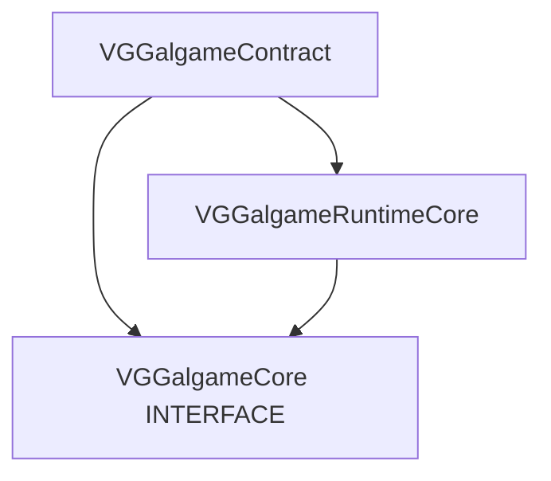

**阅读顺序建议**：先 [VGGalgameContract 文档](../VGGalgameContract/Docs/MODULE_ARCHITECTURE_AND_PROGRESS.md) 再 [VGGalgameRuntimeCore 文档](../VGGalgameRuntimeCore/Docs/MODULE_ARCHITECTURE_AND_PROGRESS.md)。

---

## 4. 目录结构（本仓库物理目录）

```
VGGalgameCore/
├── CMakeLists.txt              # INTERFACE 聚合定义
├── VGGalCoreConfig.h           # 转发 / 与 Contract 对齐的导出宏习惯入口
├── Interface/                  # 薄转发：多数为 #include "VGGalgameContract/Interface/..."
├── Include/                    # 薄转发：多数指向 RuntimeCore 或 Contract 下 canonical 头
├── Docs/
│   └── MODULE_ARCHITECTURE_AND_PROGRESS.md   # 本文件
```

**约定**：

- **契约与 ABI 形状**以 **`VGGalgameContract/Interface/*.h`** 为 **canonical**；本目录下同路径 shim 若仅为单行 `#include`，**API 文档不重复撰写**，见 Contract 文档对应节。
- **具体类型与实现**以 **`VGGalgameRuntimeCore`** 下头文件 / 源文件为准；本目录 `Include/` 中同名转发头仅用于兼容 `#include "VGGalgameCore/..."`。

---

## 5. 使用说明

### 5.1 CMake 侧

```cmake
target_link_libraries(YourTarget PUBLIC VGGalgameCore)
```

等价于同时获得 **Contract** 与 **RuntimeCore** 的传递依赖与包含路径。

### 5.2 包含风格

| 风格 | 示例 | 说明 |
|------|------|------|
| 推荐（契约） | `#include "VGGalgameContract/Interface/IGameEngine.h"` | 新代码、跨 DLL 边界明确依赖 Contract。 |
| 兼容（聚合） | `#include "VGGalgameCore/Interface/IGameEngine.h"` | 与历史代码一致；解析到 shim → Contract。 |
| 实现体 | `#include "VGGalgameRuntimeCore/Include/GalGameContext.h"` 或通过 Core shim | 仅当需要具体类型定义时。 |

---

## 6. 维护脚本（引擎根脚本）

| 脚本 | 作用 |
|------|------|
| [Engine/Scripts/gen_vggalgame_core_shims.ps1](../../../Scripts/gen_vggalgame_core_shims.ps1) | 重新生成 `VGGalgameCore/` 下薄转发头（Interface / Include）。 |
| [Engine/Scripts/check_vggalgame_core_includes.ps1](../../../Scripts/check_vggalgame_core_includes.ps1) | 校验 Core 转发目录未错误引入 NodeGraph / Sequence / Editor 等重型路径。 |

修改 Contract 或 RuntimeCore 的公开路径后，应同步跑脚本与文档。

---

## 7. 开发进展

| 日期 | 说明 |
|------|------|
| 2026-05-13 | Phase 8.1：`VGGalgameCore` 收缩为 **INTERFACE 聚合**；实现迁至 **RuntimeCore**；契约迁至 **Contract**。 |
| 2026-05-13 | 本文档补全：说明聚合职责、依赖图、包含约定与维护脚本。 |

---

## 8. API 文档入口

| 内容 | 文档 |
|------|------|
| 纯虚接口、窄数据类型 | [VGGalgameContract/Docs/MODULE_ARCHITECTURE_AND_PROGRESS.md](../VGGalgameContract/Docs/MODULE_ARCHITECTURE_AND_PROGRESS.md) |
| `GalGameContext`、`SaveArchive`、`GalGameScriptExecutorFactory`、`IGameSystem` 具体定义等 | [VGGalgameRuntimeCore/Docs/MODULE_ARCHITECTURE_AND_PROGRESS.md](../VGGalgameRuntimeCore/Docs/MODULE_ARCHITECTURE_AND_PROGRESS.md) |

本模块 **不提供**独立 API 表；避免与 Contract / RuntimeCore 重复维护。


---
## Module: VGGalgameEditorRuntime

# VGGalgameEditorRuntime — 编辑器与 Gal 运行时隔离（Phase 8.7）

## 1. 定位

| 项目 | 说明 |
|------|------|
| **职责** | 为编辑器模块提供 **仅依赖 `VGGalgameContract`** 的薄桥接头，减少对 **`VGGalgame`** 实现头的直接 **`#include`**。 |
| **CMake** | **`INTERFACE`**；**`PUBLIC`** 链接 **`VGGalgameContract`**；暴露本模块目录与 `Engine/Source/Runtime` 根。 |
| **不负责** | Play Mode 具体装配（仍在 **`VGGalgame`** / **`GalGameSystem`**）；调试器本体（**`IRuntimeDebugBridge`** 占位在 Contract）。 |

---

## 2. 目录结构

```
VGGalgameEditorRuntime/
├── CMakeLists.txt
├── Interface/
│   └── IEditorGalgameRuntimeBridge.h
└── Docs/
    └── MODULE_ARCHITECTURE_AND_PROGRESS.md
```

---

## 3. 依赖关系

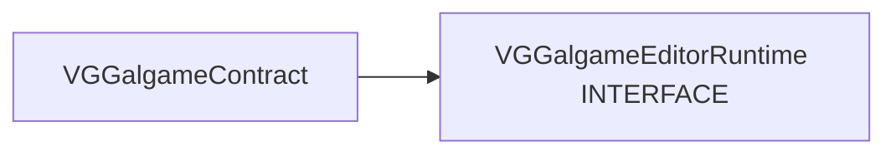

---

## 4. 使用说明

1. 在 **`VGEditorGalgame`**（或等价编辑器模块）中：  
   `target_link_libraries(... PUBLIC VGGalgameEditorRuntime)`  
   仅获得 **Contract** 子集 + **`IEditorGalgameRuntimeBridge`** 声明。
2. **具体桥接实现**由宿主或编辑器插件在运行时注册（演进中）；未注册时 **`TryGet*`** 返回 **nullptr**。
3. 新编辑器功能应优先经 **`IGalRuntimeSession`** / **`ILuaRuntimeBridge`**（Contract）访问，避免恢复使用 **`GalGameEngineAccess`** 穿透。

---

## 5. API 参考 — `IEditorGalgameRuntimeBridge`

| 方法 | 说明 |
|------|------|
| **`TryGetActivePlaySession()`** | 返回当前 Play/Preview 下的 **`IGalRuntimeSession*`**；无则 **nullptr**。 |
| **`TryGetLuaBridge()`** | 返回 **`ILuaRuntimeBridge*`**；无则 **nullptr**。 |

头文件路径：`Interface/IEditorGalgameRuntimeBridge.h`（包含风格见 [CMakeLists.txt](../CMakeLists.txt)，通常为 **`VGGalgameEditorRuntime/Interface/...`**）。

---

## 6. 开发进展

| 日期 | 说明 |
|------|------|
| 2026-05-13 | Phase 8.7：首版 **`IEditorGalgameRuntimeBridge`** 骨架。 |
| 2026-05-13 | 文档扩充：定位、目录、依赖、API、集成说明。 |

---

## 7. 相关文档

- [VGGalgameContract/Docs/MODULE_ARCHITECTURE_AND_PROGRESS.md](../../VGGalgameContract/Docs/MODULE_ARCHITECTURE_AND_PROGRESS.md)
- [GALGAME_MODULE_ARCHITECTURE_AND_PROGRESS.md](../../GALGAME_MODULE_ARCHITECTURE_AND_PROGRESS.md)


---
## Module: VGGalgameLuaRuntime

# VGGalgameLuaRuntime — 架构、使用说明与 API

本文档描述 **CMake 目标 `VGGalgameLuaRuntime`**（Lua 剧情脚本运行时 DLL）的职责、目录结构、与宿主/工厂的衔接方式，以及 **C++ 接口类** 与 **Lua 侧 `GalGame` API** 的说明。

---

## 1. 模块职责（一句话）

在进程内提供 **基于 sol2 的 Lua 剧情脚本执行器**（`LuaStoryScript`），向 **`GalGameScriptExecutorFactory`** 注册资产类型 **`GalGameLuaScript`** 对应的创建器；并在编辑器/核心 Lua 中注册 **`GalGame` 命名空间绑定**（`GalGameLuaBinding`）。**不依赖 Editor**，仅依赖 **`VGGalgameCore`** 与 **`VGLua`** 公开头路径。

---

## 2. CMake 与依赖

| 项目 | 说明 |
|------|------|
| **目标名** | `VGGalgameLuaRuntime`（`SHARED`） |
| **导出宏** | 编译 `PRIVATE VG_GALGAME_SCRIPT_LUA_EXPORT` → `VGGalgameScriptLuaConfig.h` 中 `VG_GALGAME_SCRIPT_LUA_API` |
| **链接** | `PUBLIC VGGalgameCore` |
| **对外 Include** | `PUBLIC`：`Engine/Source/Runtime/VGLua/Include`（sol2 等） |
| **对内 Include** | `PRIVATE`：`Engine/Source/Runtime`、`Engine/Source/RuntimeGalgame`、本模块 `Include/`、`Interface/` |
| **宿主链接** | `VGGalgame` → `PUBLIC VGGalgameLuaRuntime`（游戏宿主加载本 DLL 并调用 `MountEngineRuntime`） |

根 `CMakeLists.txt` 通过 `add_subdirectory(Engine/Source/RuntimeGalgame/VGGalgameLuaRuntime)` 引入本目标。

---

## 3. 目录结构

```
VGGalgameLuaRuntime/
├── CMakeLists.txt                 # 目标定义、宏、链接
├── Module.h                       # GalGameLuaScriptModule::MountEngineRuntime
├── VGGalgameScriptLuaConfig.h     # VG_GALGAME_SCRIPT_LUA_API
├── Include/
│   ├── SSExecutor.h               # LuaStoryScript（IStoryScriptExecutor）
│   └── SSExecutorCreator.h        # LuaStoryScriptExecutorCreator
├── Interface/
│   ├── LuaBinding.h               # GalGameLuaBinding
│   └── StoryScriptLuaInterface.h  # StoryScriptLuaInterface
├── Source/
│   ├── Module.cpp
│   ├── SSExecutor.cpp
│   ├── SSExecutorCreator.cpp
│   └── Interface/
│       ├── LuaBinding.cpp
│       └── StoryScriptLuaInterface.cpp
└── Docs/
    └── MODULE_ARCHITECTURE_AND_PROGRESS.md   # 本文档
```

**命名说明**：历史文件名 `SSExecutor*` 表示「Story Script Executor」；公开类型名为 **`LuaStoryScript`** / **`LuaStoryScriptExecutorCreator`**。

---

## 4. 运行时如何挂载（使用说明）

### 4.1 引擎侧（已实现）

在 **`GalGameSystem::Initialize`**（`VGGalgame/Source/Interface/GalgameSystem.cpp`）中：

1. **`CoreLua::RegisterGlobalAPI`**：对全局 `sol::state` 调用 **`GalGameLuaBinding::Register`**，使编辑器/通用 Lua 可使用 `GalGame` API（与剧情脚本内 `RegisterScript` 注册的表一致，见下文）。
2. **`GalGameLuaScriptModule::MountEngineRuntime()`**：向 **`GalGameScriptExecutorFactory::Get()`** 注册  
   `RegisterAssetExecutor(GLuaScriptAssetType{}.GetNameID(), MakeRef<LuaStoryScriptExecutorCreator>())`  
   其中类型 ID 为 **`"GalGameLuaScript"`**（见 `VGAsset/Include/GalGameAsset.h`）。

因此：**任何链接 `VGGalgame` 的宿主**在初始化 GalGame 子系统后，即可按资产类型加载 Lua 剧情脚本；**无需**在业务代码中再次调用 `MountEngineRuntime`，除非自行搭建不含 `VGGalgame` 的测试宿主（此时需自行链接本库并调用一次）。

### 4.2 剧情脚本资产与执行流程

1. 资源为 **`GalGameLuaScript`** 类型的文本脚本（由 `VFS` 读取路径对应文件内容）。
2. **`LuaStoryScriptExecutorCreator::LoadFromAsset`**：先 **`StoryScriptLuaInterface::ResetStoryScript()`**，再 **`LuaStoryScript::LoadFromFile(path)`**（仅设置路径，构造时已 **`RegisterScript`**）。
3. **`LuaStoryScript::Run(bus, gameContext)`**：  
   - 从 `GalGameContext` 取 **`IGalGameEngine*`**，写入 `GalGame["引擎"]` 与全局 **`VG`**（均为同一引擎指针）。  
   - 读文件、`m_LuaState.script(code)` 得到 **`sol::coroutine`**。  
   - 设置 **`StoryScriptLuaInterface`** 当前协程与脚本路径，调用 **`PreLoadScriptResource()`**，然后 **`m_Coroutine()`** 启动协程。  
4. 用户操作（继续对话、选项、输入）经 **`IStoryScriptExecutor`** 转发到 **`StoryScriptLuaInterface::Continue`**，以 **无参 / 数值 / 字符串** 恢复协程。

### 4.3 协程与 `Continue` 约定

- Lua 剧情应使用 **sol2 协程**；在 C++ 绑定中，对需要等待引擎/UI 的 API 使用 **`sol::yielding`**，与 **`StoryScriptLuaInterface::Continue`** 配对。
- **`Continue(ContinueType::None)`**：恢复协程且无返回值传入。  
- **`ContinueType::Number` / `String`**：将 `number` 或 `str` 作为 **`(*co)(arg)`** 的参数传入（用于选项索引对应的字符串、输入框文本等；具体由脚本侧 `coroutine.yield` 约定）。

### 4.4 资源预加载

**`PreLoadScriptResource`** 在脚本源码上用正则扫描引号内的路径，扩展名为  
`png|jpg|jpeg|tga|bmp|wav|mp3|ogg` 时，调用 **`ISubsystemBus::Scene()->PreLoadResource(path)`**。用于降低首帧加载卡顿；非完整解析器，复杂字符串拼接路径可能无法识别。

---

## 5. 架构示意

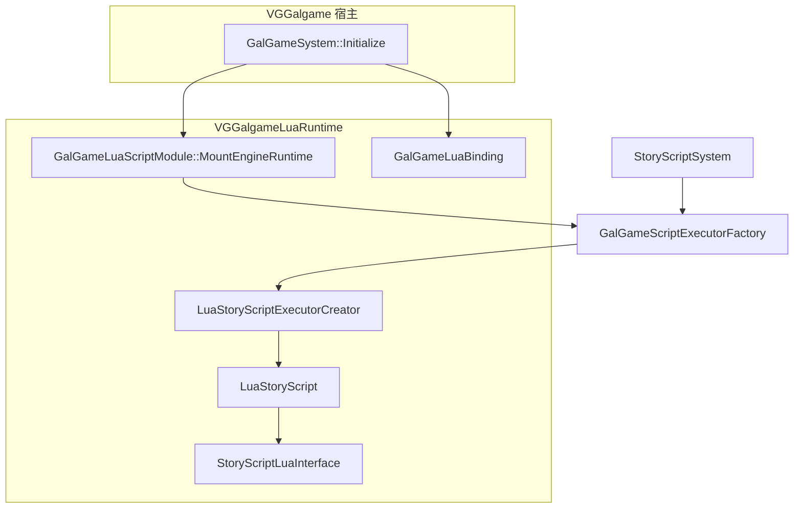

---

## 6. 开发进展（截至文档编写时）

| 主题 | 状态 | 说明 |
|------|------|------|
| 独立 CMake 目标 `VGGalgameLuaRuntime` | 已落地 | 与 `VGGalgame` 解耦链接；DLL 承载执行器与绑定实现。 |
| 工厂注册 `GalGameLuaScript` | 已落地 | `Module.cpp` 注册 `LuaStoryScriptExecutorCreator`。 |
| `LuaStoryScript` 协程驱动 | 已落地 | `Run` / `ContinueDialogue` / 选项与输入回调经 `StoryScriptLuaInterface`。 |
| `GalGameLuaBinding` | 持续演进 | Phase 7 起子系统经 **`IGalGameEngine::SubsystemBus`** 暴露；含 `IGalRuntimeSession` / `IExecutionScheduler` 等绑定。 |
| `LuaStoryScript::Tick` | 空实现 | 当前无每帧逻辑。 |
| `QueryInterface` | 恒为 `nullptr` | 尚未暴露扩展接口。 |
| 头文件命名 `SSExecutor` | 技术债 | 与类型名 `LuaStoryScript` 不一致，后续可重命名文件以对齐。 |

---

## 7. C++ 接口类 API 参考

命名空间均为 **`VisionGal::GalGame`**。

### 7.1 `GalGameLuaScriptModule`（`Module.h`）

| 声明 | 说明 |
|------|------|
| `static void MountEngineRuntime()` | 向 `GalGameScriptExecutorFactory` 注册 **`GalGameLuaScript`** → `LuaStoryScriptExecutorCreator`。进程内应只在与 Sequence 等其它后端一致的初始化点调用一次（当前由 `GalGameSystem::Initialize` 调用）。 |

### 7.2 `LuaStoryScriptExecutorCreator`（`SSExecutorCreator.h`）

继承 **`IStoryScriptExecutorCreator`**（契约见 `VGGalgameContract/Interface/IStoryScriptExecutor.h`）。

| 方法 | 说明 |
|------|------|
| `Ref<IStoryScriptExecutor> LoadFromAsset(const String& path) override` | 调用 `StoryScriptLuaInterface::ResetStoryScript()` 后返回 `LuaStoryScript::LoadFromFile(path)`。 |

### 7.3 `LuaStoryScript`（`SSExecutor.h` / `SSExecutor.cpp`）

**`ScriptExecutionContext`**（同头文件）：聚合 **`ISubsystemBus*`**、**`IGalGameContext*`**、**`IGalGameEngine*`**；**`Run`** 时填充，供 Lua 绑定在 Phase 8 后逐步减少对 **`GalGameEngineAccess`** 的依赖。

继承 **`IStoryScriptExecutor`**。

| 方法 | 说明 |
|------|------|
| `LuaStoryScript()` | 构造内调用 `GalGameLuaBinding::RegisterScript(m_LuaState)`（打开 base/math/string/table + `VGLuaInterface::Initialise` + `Register`）。 |
| `static Ref<LuaStoryScript> LoadFromFile(const String& file)` | 创建实例并 `SetResourcePath(path)`。 |
| `bool Run(ISubsystemBus* bus, IGalGameContext* gameContext) override` | 绑定引擎指针到 `GalGame["引擎"]` 与 `VG`，读盘加载脚本，设置协程与路径，`PreLoadScriptResource()`，执行首次 `m_Coroutine()`；错误时打日志并广播 `LuaScriptEvent`。 |
| `void Tick(float deltaTime) override` | 当前为空。 |
| `IRuntimeInterface* QueryInterface(InterfaceID id) override` | 返回 `nullptr`。 |
| `void PreLoadScriptResource() override` | 正则扫描脚本中的媒体路径并 `Scene()->PreLoadResource`。 |
| `std::filesystem::file_time_type GetScriptLastWriteTime() const override` | 基于 VFS 绝对路径的文件最后修改时间；文件不存在则未定义行为依赖默认构造。 |
| `void ContinueDialogue() override` | `StoryScriptLuaInterface::Continue()`。 |
| `void OnChoiceSelected(...)` override | `Continue(ContinueType::String, 0, options[currentChoice])`。 |
| `void OnInputSubmitted(...)` override | `Continue(ContinueType::String, 0, text)`。 |
| `sol::coroutine GetCoroutine()` | 返回内部协程引用（供调试或扩展）。 |

### 7.4 `StoryScriptLuaInterface`（`StoryScriptLuaInterface.h` / `.cpp`）

静态工具类；维护 **进程内单例** 的当前协程指针与脚本路径（用于错误事件）。

| 成员 | 说明 |
|------|------|
| `enum class ContinueType { None, Number, String }` | 恢复协程时是否向 Lua 传入参数。 |
| `static int Continue(ContinueType type = None, int number = 0, const std::string& str = "")` | 若协程已结束则清空指针；否则 `(*co)()` / `(*co)(number)` / `(*co)(str)`；错误时日志 + `LuaScriptEvent`。返回值当前恒为 `0`。 |
| `static void ResetStoryScript()` | 将当前协程指针置空（加载新脚本前由 Creator 调用）。 |
| `static void SetStoryScriptCoroutine(sol::coroutine* co)` | `Run` 时由 `LuaStoryScript` 设置。 |
| `static sol::coroutine* GetStoryScriptCoroutine()` | 查询当前协程指针。 |
| `static void SetCurrentStoryScriptPath(const std::string& path)` | 供错误上报关联路径。 |

### 7.5 `GalGameLuaBinding`（`LuaBinding.h` / `.cpp`）

| 方法 | 说明 |
|------|------|
| `static void Register(sol::state& state)` | 创建/填充全局表 **`GalGame`**，注册 `GetEngine` / `获取引擎` / `引擎`、`GalSubsystemBus`、`IGalGameEngine` 及子系统门面、`IGalCharacter`、`IGalSprite`、`IGalAudio`、`IGalVideo`、对话/存档/UI/场景、`SaveArchive`、`IGalRuntimeSession`、`IExecutionScheduler` 等 usertype 与中英双语成员（完整列表以 `LuaBinding.cpp` 为准）。 |
| `static void RegisterScript(sol::state& state)` | `open_libraries` + `VGLuaInterface::Initialise` + `Register`，供 **`LuaStoryScript`** 独立 `sol::state` 使用。 |

**Lua 全局表要点摘要**（实现见 `Source/Interface/LuaBinding.cpp`）：

- **`GalGame.GetEngine` / `GalGame.获取引擎` / `GalGame.引擎()`**：经 `GalGameEngineAccess::Current()` 取当前 `IGalGameEngine*`（剧情运行时由 `Run` 同时注入 `GalGame["引擎"]` 与 `VG`）。  
- **`GalGame.Engine`**：`Scene` / `Audio` / `Script` 子表（`ShowSprite`、`PlayAudio`、`LoadStoryScript` 等便捷函数，内部从当前引擎取 `ISubsystemBus`）。  
- **`IGalGameEngine`**：`SubsystemBus`、`RuntimeSession`、**`Runtime`**（`IGalGameRuntime`）、`剧情选择`（yielding）、`全屏文字`、`文本输入`（yielding）、**`等待`→`Playback::Wait`**、转场、立绘/背景/BGM、**`对话系统` / `存档系统` / `场景系统` / `UI系统`** 子系统引用、`存档数据` 等（能力均经总线委托，与瘦 `IGalGameEngine` 对齐）。  
- 子系统 usertype：**`GalSubsystemBus`** 增加 **`Playback`**；**`IPlaybackSubsystem`** 注册 **`等待`**（yielding）；**`IGalGameRuntime`** 暴露执行/存档/播放子域。  

新增 Lua 能力时，应优先在 **`GalGameLuaBinding::Register`** 中扩展，并评估 **`IStoryScriptExecutor` 契约** 与存档版本说明（见 Contract 头文件注释）。

---

## 8. 相关文档与代码入口

- 总览：[RuntimeGalgame/GALGAME_MODULE_ARCHITECTURE_AND_PROGRESS.md](../../GALGAME_MODULE_ARCHITECTURE_AND_PROGRESS.md)  
- 执行器工厂：`VGGalgameRuntimeCore/Interface/IStoryScript.h`  
- 契约：`VGGalgameContract/Interface/IStoryScriptExecutor.h`  
- 宿主初始化：`VGGalgame/Source/Interface/GalgameSystem.cpp`  

### 8.1 修订记录

| 日期 | 说明 |
|------|------|
| 2026-05-13 | Phase 8：`LuaBinding` 对齐瘦引擎与 **`IPlaybackSubsystem`**；**`ScriptExecutionContext`** 注入；**`GalGame.Engine.Script.Wait`** 与 **`Playback::Wait`** 同源。 |


---
## Module: VGGalgameNodeGraph

# VGGalgameNodeGraph — 节点图运行时与 DialogueList 数据

## 1. 定位

| 项目 | 说明 |
|------|------|
| **职责** | **DialogueList** 等节点用的 **共享数据模型**（JSON 序列化）；与 **HNGRuntimeCore** 签名一致的 **`NodeExecuteFn`** 实现（`EntryExecute`、`DialogueListExecute`、`ChoiceExecute`、立绘/BGM/背景等）；**不依赖编辑器 UI**。 |
| **CMake** | `SHARED`；**`VG_GALGAME_NODEGRAPH_API`**；**`PUBLIC HNGRuntimeCore`**、**`PUBLIC HCore`**。 |
| **典型消费方** | **`VGGalgame`**（`PUBLIC` 链接，保证进程加载本 DLL）；**`VGEditorGalgame`**（节点注册与对白面板引用本模块类型）。 |

---

## 2. 目录结构

```
VGGalgameNodeGraph/
├── CMakeLists.txt
├── VGGalgameNodeGraphConfig.h
├── Include/
│   ├── DialogueListNodeData.h    # DialogueLine / DialogueListNode + JSON
│   └── VGNodeExec_Galgame.h      # Vars、PIN_LinesJson、各 Execute 入口
├── Source/
│   └── VGNodeExec_Galgame.cpp
└── Docs/
    └── MODULE_ARCHITECTURE_AND_PROGRESS.md
```

---

## 3. 依赖关系

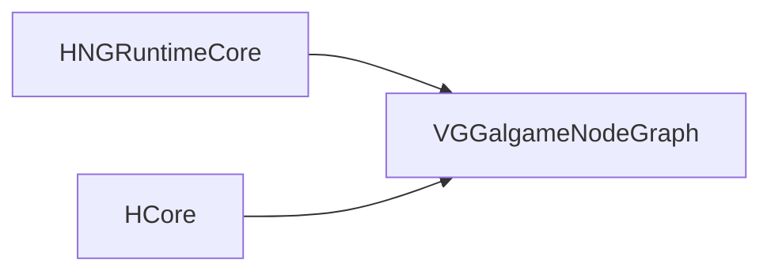

---

## 4. 使用说明

1. **运行时**：由链接 **`VGGalgame`** 的宿主加载；节点图 VM 调用已注册的 **`NodeExecuteFn`**。
2. **变量约定**：执行函数通过 **`RuntimeContext.variables`** 写入 **`VisionGal::Runtime::Vars`** 中声明的键（如 **`CurrentSpeaker`**、**`CurrentText`**），供预览或游戏层读取。
3. **DialogueList JSON**：图资产槽位 **`PIN_LinesJson`** 存放整表 JSON 字符串；运行时在 **`DialogueListExecute`** 中反序列化为 **`DialogueListNode`**（见头文件注释）。

---

## 5. API 参考

### 5.1 `Include/VGNodeExec_Galgame.h`（命名空间 `VisionGal::Runtime`）

| 符号 | 说明 |
|------|------|
| **`Vars::CurrentSpeaker` / `CurrentText` / `CurrentCharacterId` / `CurrentExpression` / `CurrentAudioClip`** | `extern const char*` 变量名常量。 |
| **`PIN_LinesJson`** | DialogueList 节点 JSON 槽名。 |
| **`EntryExecute` / `DialogueListExecute` / `ChoiceExecute`** | `Horizon::NodeGraphRuntime::ExecResult(...)`。 |
| **`ShowCharacterExecute` / `PlayBGMExecute` / `SetBackgroundExecute`** | 同上，立绘/音频/背景节点入口。 |

### 5.2 `Include/DialogueListNodeData.h`

| 类型 | 说明 |
|------|------|
| **`DialogueAnimation`** | `FadeIn` / `Move` / `Shake`。 |
| **`DialoguePresentation`** | 位置、动效、时长等。 |
| **`DialogueLine`** | `speakerId`、`text`、`characterId`、`expression`、`audioClip`、`presentation`、`events`。 |
| **`DialogueListNode`** | **`std::vector<DialogueLine> lines`**。 |
| **`SerializeDialoguePresentation` / `DeserializeDialoguePresentation`** | JSON 辅助。 |
| **`SerializeDialogueLine` / `DeserializeDialogueLine`** | 单行 JSON。 |
| **`SerializeDialogueListNode` / `DeserializeDialogueListNode`** | 整表 JSON。 |
| **`SerializeDialogueListNodeToString` / `DeserializeDialogueListNodeFromString`** | 与图槽位字符串互转。 |

完整函数列表以头文件为准。

---

## 6. 开发进展

| 日期 | 说明 |
|------|------|
| 2026-05-13 | 自 **`VGGalgameRuntime`** 拆出独立 **`VGGalgameNodeGraph`**。 |
| 2026-05-13 | 文档扩充：目录、依赖、API 表、变量约定。 |

---

## 7. 相关文档

- [VGGalgame/Docs/MODULE_ARCHITECTURE_AND_PROGRESS.md](../../VGGalgame/Docs/MODULE_ARCHITECTURE_AND_PROGRESS.md)
- [GALGAME_MODULE_ARCHITECTURE_AND_PROGRESS.md](../../GALGAME_MODULE_ARCHITECTURE_AND_PROGRESS.md)


---
## Module: VGGalgamePresentation

# VGGalgamePresentation — 表现层（Phase 8）

## 1. 定位

| 项目 | 说明 |
|------|------|
| **职责** | 与 Gal **玩法状态**解耦的 **渲染与视觉表现** 逻辑首包；当前主要包含 **`RenderPipeline`**（分层 Gal 场景渲染、截屏 RT、与转场相关的上一帧纹理抓取）。 |
| **不负责** | 剧情脚本、存档、子系统总线、Rml 对白数据模型（在 **`VGGalgame`**）；纯契约（在 **`VGGalgameContract`**）。 |
| **CMake** | `SHARED`；**`VG_GALGAME_PRESENTATION_API`**（`VGGalPresentationConfig.h`）；**`PUBLIC`** 链接 **`VGGalgameCore`**、**`VGEngine`**。 |
| **典型消费方** | **`VGGalgame`**（`PUBLIC` 链接）；通过 **`VGGalgame/Include/RenderPipeline.h`** 薄 include 引用本模块头。 |

---

## 2. CMake 与依赖

| 项目 | 说明 |
|------|------|
| **目标** | `VGGalgamePresentation` |
| **源文件** | `Include/RenderPipeline.h`、`Source/RenderPipeline.cpp`、`VGGalPresentationConfig.h`（见 [CMakeLists.txt](../CMakeLists.txt)） |
| **编译宏** | `PRIVATE VG_GALGAME_PRESENTATION_EXPORT` |
| **链接** | `PUBLIC VGGalgameCore`、`PUBLIC VGEngine` |

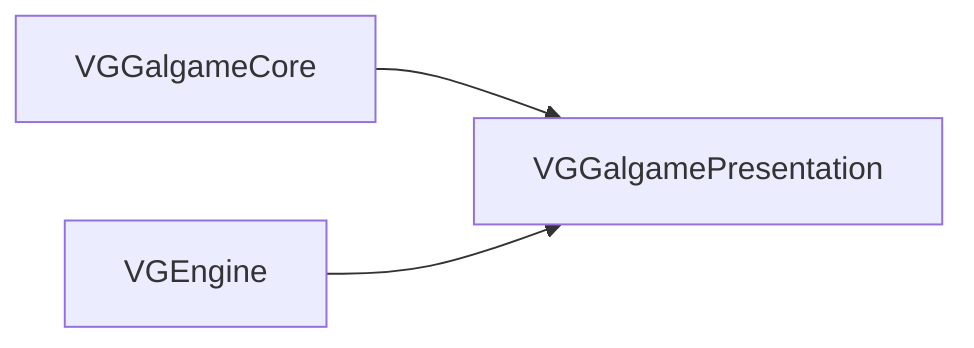

---

## 3. 目录结构

```
VGGalgamePresentation/
├── CMakeLists.txt
├── VGGalPresentationConfig.h
├── Include/
│   └── RenderPipeline.h
├── Source/
│   └── RenderPipeline.cpp
└── Docs/
    └── MODULE_ARCHITECTURE_AND_PROGRESS.md
```

---

## 4. 与 VGGalgame 的衔接

| 项目 | 说明 |
|------|------|
| **头文件转发** | [VGGalgame/Include/RenderPipeline.h](../../VGGalgame/Include/RenderPipeline.h) 单行 **`#include "VGGalgamePresentation/Include/RenderPipeline.h"`** |
| **类型持有** | **`GalGameEngine`** 内 **`Ref<RenderPipeline> m_RenderPipeline`**，在 **`CreateSubsystem`** 中 **`MakeRef<RenderPipeline>()`** 并 **`Initialize(context)`** |
| **渲染触发** | 宿主在 **`IGameEngineContext`** 的 **BeforeRender**（或等价回调）中调用 **`RenderPipeline::Render`**（见 **`GalGameEngine::Initialize`** 订阅实现） |

---

## 5. 架构与数据流

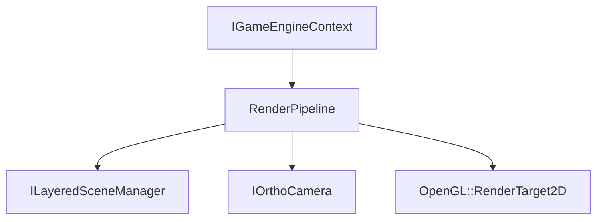

- **`Initialize`**：按视口创建 **`OpenGL::RenderTarget2D`** 链、全屏渲染组件等。
- **`Render`**：背景层 → 场景层 → 角色层混合（**`RenderBackgroundLayer`** / **`RenderSceneLayer`** / **`RenderMixCharacterSprite`**）。
- **`CaptureBackgroundLayer` / `CaptureSceneLayer`**：写入 **`m_PrevBackgroundTexture`** / **`m_PrevSceneTexture`** 供 **`TransitionManager`** 与 Gal 引擎转场逻辑使用。

---

## 6. 使用说明

1. **正常游戏宿主**：只需链接 **`VGGalgame`**，无需单独链接本库（已 `PUBLIC` 传递）。
2. **自定义最小宿主**（无 `VGGalgame`）：`target_link_libraries(... VGGalgamePresentation VGGalgameCore VGEngine)`，自行在合适的渲染阶段调用 **`RenderPipeline::Render`**，并提供 **`ILayeredSceneManager`** 与相机。
3. **屏幕尺寸变化**：调用 **`OnScreenSizeChanged`** 以重建 RT。

---

## 7. API 参考 — `RenderPipeline`

| 方法 | 说明 |
|------|------|
| **`RenderPipeline()`** | 默认构造。 |
| **`void Initialize(IGameEngineContext* context)`** | 绑定引擎上下文并创建内部 RT / 组件。 |
| **`void Render(ILayeredSceneManager* scene, IOrthoCamera* camera, OpenGL::RenderTarget2D* rt)`** | 主渲染入口。 |
| **`void OnScreenSizeChanged(int width, int height)`** | 视口变化。 |
| **`void CaptureBackgroundLayer()`** | 抓取背景层上一帧纹理。 |
| **`void CaptureSceneLayer()`** | 抓取场景层上一帧纹理。 |
| **`void SetScene(Scene* scene)`** | 设置当前 **`Scene*`**。 |

私有辅助方法（**`RenderSprite`**、**`RenderFullScreen`**、各层 **`Render*Layer`**）见 [RenderPipeline.h](../Include/RenderPipeline.h) / [RenderPipeline.cpp](../Source/RenderPipeline.cpp)。

---

## 8. 开发进展

| 日期 | 说明 |
|------|------|
| 2026-05-13 | Phase 8.4：自 **`VGGalgame`** 迁入 **`RenderPipeline`**；宿主头文件改为薄转发。 |
| 2026-05-13 | 文档扩充：CMake、目录、依赖图、与宿主衔接、API 表。 |

---

## 9. 相关文档

- [VGGalgame/Docs/MODULE_ARCHITECTURE_AND_PROGRESS.md](../../VGGalgame/Docs/MODULE_ARCHITECTURE_AND_PROGRESS.md)
- [GALGAME_MODULE_ARCHITECTURE_AND_PROGRESS.md](../../GALGAME_MODULE_ARCHITECTURE_AND_PROGRESS.md)


---
## Module: VGGalgameRuntimeCore

# VGGalgameRuntimeCore — 运行时状态、存档、上下文与工厂（SHARED）

## 1. 定位

| 项目 | 说明 |
|------|------|
| **职责** | Phase 8 起承接原 **`VGGalgameCore`** 中 **非纯 ABI** 部分：共享数据模型（**`GalGameContext`**、**`GalGameRuntimeState`**）、**`SaveArchive`** / **`ArchiveDataContainer`**、**`GalGameScriptExecutorFactory`**、**`IGameSystem.h`**（`IArchiveSystem`、`IDialogueSystem`、分层场景与 UI 系统接口族）、**`IGameObject.h`**（`IGalSprite` 等资源接口）、**`GalGameEngineAccess`**、**`GalGameLayoutUtils`**、**`GalGameEngineComponent`** 与序列化器、**`ISerializableRuntimeState`** 等。 |
| **不负责** | 纯虚门面 **`IGalGameEngine`**、**`ISubsystemBus`** 及各 `I*Subsystem` 的 **Contract 定义** — 见 [VGGalgameContract](../VGGalgameContract/Docs/MODULE_ARCHITECTURE_AND_PROGRESS.md)；宿主装配、对白 Rml 拆分实现 — 见 **`VGGalgame`**。 |
| **CMake 目标名** | **`VGGalgameRuntimeCore`**（`SHARED`） |
| **DLL 输出名** | **`VGGalgameCore.dll`**（`set_target_properties(... OUTPUT_NAME VGGalgameCore)`），与历史部署路径兼容。 |

---

## 2. CMake 与依赖

| 项目 | 说明 |
|------|------|
| **编译定义** | `PRIVATE VG_GALGAME_CORE_EXPORT` → **`VG_GALGAME_CORE_API`**（定义见 [VGGalCoreConfig.h](../VGGalgameContract/VGGalCoreConfig.h)） |
| **链接** | `PUBLIC VGGalgameContract`、`PUBLIC VGEngine` |
| **包含** | `PUBLIC`：`Engine/Source/Runtime`、`Engine/Source/RuntimeGalgame`、`Engine/Source/Runtime/VGLua/Include`、`Interface/`、`Include/` |
| **源收集** | `CMakeLists.txt` 使用 `GLOB`：`Interface/*.h`、`Include/*.h`、`Source/**/*.cpp`（见仓库内 CMake） |

---

## 3. 依赖关系

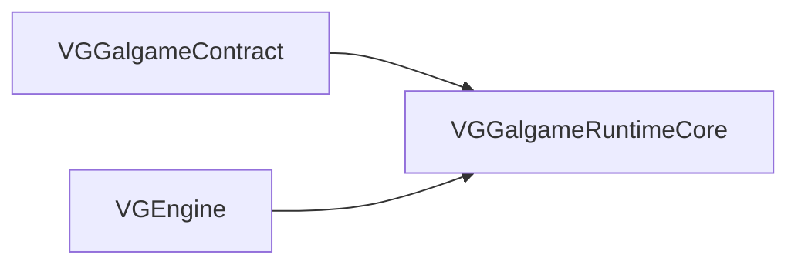

消费方通常 **`target_link_libraries(... VGGalgameCore)`**（INTERFACE 聚合），等价链接本库 + Contract。

---

## 4. 目录结构（与仓库一致）

```
VGGalgameRuntimeCore/
├── CMakeLists.txt
├── Interface/
│   ├── IGameObject.h          # SpriteDesc、IGalGameResource、IGalSprite/Audio/Video/Character
│   ├── IGameSystem.h          # IArchiveSystem、IDialogueSystem、场景层/管理器、ILayeredSceneManager、IGalGameUISystem
│   └── IStoryScript.h         # GalGameScriptExecutorFactory（剧情执行器注册表）
├── Include/
│   ├── ArchiveDataContainer.h
│   ├── Components.h           # GalGameEngineComponent、GalGameEngineComponentSerializer
│   ├── GalExecutionLifecycle.h
│   ├── GalGameContext.h
│   ├── GalGameContextSnapshot.h
│   ├── GalGameEngineAccess.h
│   ├── GalGameEvent.h
│   ├── GalGameLayoutUtils.h
│   ├── GalGameRuntimeState.h
│   ├── ISerializableRuntimeState.h
│   ├── SaveArchive.h
│   ├── SubsystemBusGuard.h
│   ├── VGGalgameCore_Deprecated.h
│   └── ...
├── Source/
│   ├── ArchiveDataContainer.cpp
│   ├── Components.cpp
│   ├── GalGameContextSnapshot.cpp
│   ├── GalGameEngineAccess.cpp
│   ├── GalGameLayoutUtils.cpp
│   ├── IStoryScript.cpp
│   ├── SaveArchive.cpp
│   └── ...
└── Docs/
    └── MODULE_ARCHITECTURE_AND_PROGRESS.md
```

---

## 5. 架构与数据流

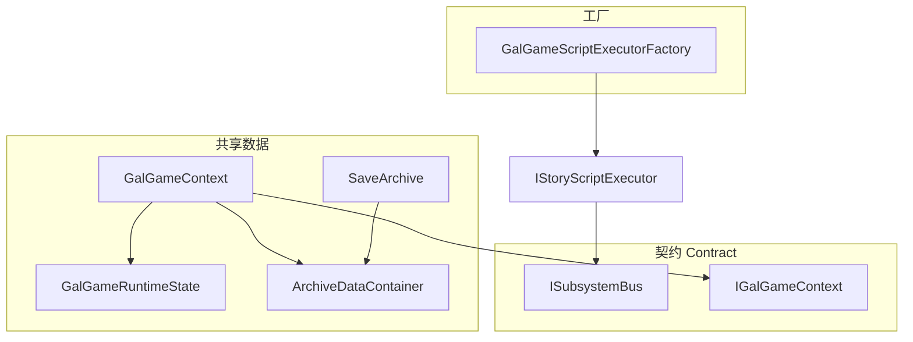

- **`GalGameContext`**：实现 **`IGalGameContext`**；持有 **`GalEngineEventBus`**、**`GalGameUIEventBus`**、**`GalGameRuntimeState`**、**`Ref<ArchiveDataContainer>`**；**不再持有 `IGalGameEngine*`**（Phase 8）。
- **`SaveArchive`**：槽位元数据 + **`archiveData`** + 截图像素等；**`ReadFromJson` / `WriteToJson`**；**`kSaveArchiveSchemaVersion`**。
- **`GalGameScriptExecutorFactory`**：按资产类型注册 **`IStoryScriptExecutorCreator`**，**`LoadAssetExecutor(type, path)`** 供剧情系统加载 Lua / Sequence 等执行器。

---

## 6. 使用说明

1. **链接**：优先通过 **`VGGalgameCore`** INTERFACE 目标链接，避免直接依赖路径漂移。
2. **构造上下文**：使用 **`GalGameContext::Create(ISubsystemBus* bus = nullptr)`** 创建 **`Ref<GalGameContext>`**（推荐入口）。
3. **执行器注册**：在进程启动阶段由 **`VGGalgameLuaRuntime`** / **`VGGalgame`** 挂载代码调用 **`GalGameScriptExecutorFactory::Get().RegisterAssetExecutor(...)`**（详见各模块文档）。
4. **存档**：通过 **`IArchiveSystem`**（宿主 **`ArchiveSystem`** 实现）与 **`SaveArchive`** 协作；长期可扩展 **`ISerializableRuntimeState`** 子域序列化。

---

## 7. 开发进展

| 子项 | 状态 | 说明 |
|------|------|------|
| Contract / RuntimeCore 拆分 | 已落地 | 本模块为 SHARED 实现侧。 |
| `GalGameContext` 去引擎指针 | 已落地 | 引擎经会话 / 总线注入。 |
| `ISerializableRuntimeState` | 骨架 | 接口已定义；与 SaveArchive 分层聚合待演进。 |
| SaveArchive schema | 演进中 | 与 Lua/Choice 校验字段联动时需升版本并更新文档。 |

---

## 8. API 参考（按头文件）

### 8.1 `Interface/IGameObject.h`

| 类型 | 说明 |
|------|------|
| **`SpriteDesc`** | 精灵路径、图层、透明度、偏移、旋转、缩放等描述。 |
| **`IGalGameResource`** | `GetResourcePath`、`GetResourceActor`、`GetResourceLayer` / `SetResourceLayer`。 |
| **`IGalSprite`** | `Show`、`With`、**`Animate(sol::table,...)`**、位置/缩放/对齐、`GetTransformComponent`、`Cut` 等链式 API。 |
| **`IGalAudio`** | `SetLoop`、`Stop`、`IsPlayingAudio`、`SetVolume`/`GetVolume`、`With`。 |
| **`IGalVideo`** | `SetLoop`、`Stop`、`IsPlaying`、`SetVolume`/`GetVolume`。 |
| **`IGalCharacter`** | `GetName`/`SetName`、`Say`、`Voice`、`AddFigure`、`ShowFigure`/`HideFigure`、立绘/语音回调（`sol::function`）。 |

### 8.2 `Interface/IGameSystem.h`（节选）

| 接口 | 主要职责 |
|------|-----------|
| **`IArchiveSystem`** | `SaveArchiveByNumber`、`GetArchiveByNumber`、`HasArchiveByNumber`。 |
| **`IDialogueSystem`** | 角色发言、打字机、继续对白、对白列表遍历、自动/快进、语音状态、**`JumpToDialog`**、**`Reset`/`Clear`/`Update`** 等。 |
| **`ISceneSpriteLayer` / `ISceneAudioLayer` / `ISceneVideoLayer`** | 单层资源集合与音量/播放控制。 |
| **`ISceneSpriteManager` / `ISceneAudioManager` / `ISceneVideoManager`** | 遍历、按层清理、添加/移除、图层管理。 |
| **`ILayeredSceneManager`** | 角色列表、**`TraverseScene`**、子管理器访问、**`OnUpdate`**。 |
| **`IGalGameUISystem`** | 选择支 UI、全屏文本、输入 UI 状态与交互。 |

完整虚函数表以头文件为准（**CORE ABI STABLE** 区段勿随意改签名）。

### 8.3 `Interface/IStoryScript.h`

| API | 说明 |
|-----|------|
| **`GalGameScriptExecutorFactory::Get()`** | 进程内单例。 |
| **`RegisterAssetExecutor(const String& type, Ref<IStoryScriptExecutorCreator>)`** | 注册资产类型 → 创建器。 |
| **`LoadAssetExecutor(const String& type, const String& path)`** | 按类型与路径构造 **`Ref<IStoryScriptExecutor>`**。 |
| **`GetRegisterTypes()`** / **`HasExecutor(const String& type)`** |  introspection。 |

### 8.4 `Include/GalGameContext.h`

| 成员 / 方法 | 说明 |
|-------------|------|
| **`engineEventBus` / `uiEventBus`** | 运行时事件（见 `GalGameEvent.h`）。 |
| **`runtimeState`** | **`GalGameRuntimeState`**：脚本路径、对白行号、截图、模式位等。 |
| **`archiveData`** | **`Ref<ArchiveDataContainer>`**。 |
| **`static Ref<GalGameContext> Create(ISubsystemBus* bus)`** | 推荐构造入口。 |

### 8.5 `Include/SaveArchive.h`

| 字段 / 方法 | 说明 |
|-------------|------|
| **`kSaveArchiveSchemaVersion`** | 顶层 JSON schema 整数版本。 |
| **`WriteToJson` / `ReadFromJson`** | 与 nlohmann::json 互转。 |
| **`ValidateArchiveSchema`** | 反序列化前校验；失败则 **`isValid = false`**。 |

### 8.6 `Include/ArchiveDataContainer.h`

| API | 说明 |
|-----|------|
| **`schemaVersion` / `schemaHash`** | 容器格式版本与校验预留。 |
| **`GetChoicesNamespace` / `GetInputNamespace`** | **`__Choices__` / `__Inputs__`** 命名空间访问。 |
| **`InitializeLuaBinding`** | Lua 表绑定初始化。 |

### 8.7 `Include/Components.h`

| 类型 | 说明 |
|------|------|
| **`GalGameEngineComponent`** | `scriptPath`、`choiceUIPath`、`fullScreenTextUIPath`、`inputUIPath`；Cereal `save`/`load`。 |
| **`GalGameEngineComponentSerializer`** | 场景序列化段注册用。 |

### 8.8 `Include/GalGameEngineAccess.h`

| API | 说明 |
|-----|------|
| **`Current()`** | `thread_local` 当前 **`IGalGameEngine*`**。 |
| **`SetCurrent(IGalGameEngine*)`** | 由 **`GalGameEngine::Initialize`** 注入。 |

### 8.9 `Include/GalGameLayoutUtils.h`

| API | 说明 |
|-----|------|
| **`SetDesignSize` / `GetDesignSize`** | 设计分辨率。 |
| **`GetSpriteXOffset` / `GetSpriteYOffset`** | 精灵对齐偏移。 |

### 8.10 `Include/GalGameContextSnapshot.h`

| API | 说明 |
|-----|------|
| **`Capture(const GalGameContext&)`** | 浅拷贝运行时切片。 |
| **`Apply(GalGameContext&)`** | 写回目标上下文。 |

### 8.11 `Include/ISerializableRuntimeState.h`

| 方法 | 说明 |
|------|------|
| **`SaveToJson(json&)`** / **`LoadFromJson(const json&)`** | 子域可序列化状态契约（占位演进）。 |

### 8.12 其它头文件

| 头文件 | 说明 |
|--------|------|
| **`GalGameRuntimeState.h`** | 对白索引、截图路径/像素、打字延迟、自动/快进位等字段（见源码）。 |
| **`GalGameEvent.h`** | **`GalEngineEventBus`**、**`GalGameUIEventBus`** 与载荷。 |
| **`GalExecutionLifecycle.h`** | 执行生命周期辅助类型（见源码）。 |
| **`SubsystemBusGuard.h`** | RAII 或迁移期守卫（见源码）。 |
| **`VGGalgameCore_Deprecated.h`** | 弃用宏（MSVC / GCC-Clang）。 |

---

## 9. 修订记录

| 日期 | 说明 |
|------|------|
| 2026-05-13 | 文档整体重写：纠正旧版「VGGalgameCore SHARED」表述；对齐 **RuntimeCore** 目标名、**DLL OUTPUT_NAME**、目录与 API 表。 |
| 2026-05-13 | Phase 8.1：自原 Core 拆出 **Contract**；本模块为运行时实现库。 |


---
## Module: VGGalgameSequenceRuntime

# VGGalgameSequenceRuntime 模块架构、使用说明与开发进展

本文档描述 **Galgame 可视化序列脚本（`.vgasset` 等）运行时库** 目标 `VGGalgameSequenceRuntime`（CMake：`SHARED`，**不依赖 Editor**）的目录结构、调度架构、资源与序列化约定，以及集成到引擎 / 自定义宿主时的**详细使用步骤**。

导出宏见 `GSSExport.h`（`VG_GSS_API`）；编译定义 `VG_GALGAME_SCRIPT_SEQUENCE_EXPORT`。

---

## 1. 模块定位与依赖

- **职责**：线性 **Sequence 剪辑表**（`IVGSSequenceComponent` 条目）的加载、JSON 序列化、**数据驱动** 的 **`SequenceExecutionInstance`（Sequence Runtime Kernel）** 调度，以及对话 / 立绘 / 背景等内置 **`IVGSSequenceRuntimeSystem`** 实现；通过 **`ISubsystemBus`**（写入 **`SSSequenceExecutionContext::SubsystemBus`**）与 **`SSExecutorResourceManager`** 与 Galgame 展示层交互。
- **CMake 链接**：`PUBLIC VGGalgameCore`（**不**再 `PUBLIC` 链接已删除的 **`VGGalgameRuntime`**；**`GalGameScriptExecutorFactory`** 在 **`VGGalgameCore`**；注册仍由 **`VGGalgame`** 挂载代码调用 **`GalGameScriptExecutorFactory::RegisterAssetExecutor`**）。
- **典型消费方**：`VGGalgame`、`VGEditorGalgameSequence`（编辑器侧私有链接以访问运行时类型与序列化）、`VGDesktopApplication` 等（以工程 CMake 为准）。

---

## 2. 源码目录结构

CMake 使用 `GLOB` 收集根目录、`Include/**`、`Interface/**`、`Source/**` 下头/源。逻辑分组如下。

| 路径 | 职责 |
|------|------|
| `GSSExport.h` | DLL 导出宏 `VG_GSS_API`。 |
| `Module.h` | **`GalGameSequenceScriptModule::MountEngineRuntime()`** 声明；**实现**位于本模块 **`Source/Interface/Module.cpp`**（注册资产工厂 + **`GalGameScriptExecutorFactory::RegisterAssetExecutor`**）。**`GalGameSystem::Initialize`**（`VGGalgame`）在运行时调用该函数一次。 |
| `Interface/IVGSSequenceComponent.h` / `Source/Interface/IVGSSequenceComponent.cpp` | **`IVGSSequenceComponent`**（含 **`GetComponentTypeID()`**）、**`TVGSSequenceComponent<T>`**、**`IVGSSequenceComponentManager`**（单例注册表 + **`CreateSequenceEntryByTypeNameID`** / **`EnumerateRegisteredTypeNameIDs`**）。 |
| `Interface/IVGSSequenceRuntimeSystem.h` | **`IVGSSequenceRuntimeSystem`**：**`SupportsType`** / `CanExecute` / **`Execute(SequenceRuntimeExecutionContext&)`** / **`Tick(SequenceRuntimeExecutionContext&)`** / **`ShouldHoldPlaybackAfterExecute`**（Wait 闸门语义）。 |
| `Interface/VGSTypeDefine.h` | **`VGSS_INVALID_OBJECT_ID`** 及强类型 ObjectID 别名。 |
| `Interface/VGSSObjectIDGenerator.h` / `Source/Interface/VGSSObjectIDGenerator.cpp` | 运行时对象 ID 生成器实现。 |
| `Include/Runtime/SequenceComponentTypeId.h` / `Source/Runtime/SequenceComponentTypeId.cpp` | **`SequenceComponentTypeID`** 与 **`MakeSequenceComponentTypeIDFromTypeName`**（FNV-1a 64，与 JSON `type` 字符串对应）。 |
| `Include/Runtime/SequenceExecutionCursor.h` | **`SequenceExecutionCursor`**：剪辑表游标。 |
| `Include/Runtime/SequenceExecutionFrame.h` | **`SequenceExecutionFrame`**：游标、`HasDispatched`、**`ActiveWaitTokenIds`**、可选 **`SequenceParallelGroup`**。 |
| `Include/Runtime/SequenceRuntimeExecutionContext.h` | **`SequenceRuntimeExecutionContext`**：`SharedContext` + 活动帧 + **`IStorySequenceExecutionInstance*`** + **`SequenceRuntimeCommandAPI*`** + **`SequenceVariableTable*`** + **`SequenceSignalBus*`** + `DeltaTime`。 |
| `Include/Runtime/SequenceRuntimeCommandAPI.h` / `Source/Runtime/SequenceRuntimeCommandAPI.cpp` | **`SequenceRuntimeCommandAPI`**：`Continue` / **`ContinueWithResume`** / `JumpToSequenceIndex` / `PushFrame`/`PopFrame`（占位）/ **`EmitSignal(name, payload)`** / **`SetVariable`** / **`BeginParallelClipGroup`**。 |
| `Include/Runtime/IStoryExecutionInstance.h` | **`IStorySequenceExecutionInstance`**：内核执行实例虚接口（`GalGame::` 命名空间）。 |
| `Include/Runtime/SequenceExecutionInstance.h` / `Source/Runtime/SequenceExecutionInstance.cpp` | **`SequenceExecutionInstance`**：Runtime Kernel；**`m_GlobalTickCounter`**、**`AsyncWaitRegistry`**、**`SequenceSignalBus`**、**`SequenceVariableTable`**、**`m_UserStateBlob`**、帧轨迹；线性 / 并行 `Tick`。 |
| `Include/Runtime/SequenceValue.h` / `Source/Runtime/SequenceValue.cpp` | **`SequenceValue` / `SequenceValueType`**：Int / Float / Bool / String + JSON 互转。 |
| `Include/Runtime/SequenceVariableTable.h` / `Source/Runtime/SequenceVariableTable.cpp` | **`SequenceVariableTable`**：运行时变量表。 |
| `Include/Runtime/WaitToken.h` / `Include/Runtime/ResumeToken.h` | **`WaitToken`**、**`ResumeToken`**：异步闸门句柄。 |
| `Include/Runtime/AsyncWaitRegistry.h` / `Source/Runtime/AsyncWaitRegistry.cpp` | **`AsyncWaitRegistry`**：WaitToken 分配与 Resolve。 |
| `Include/Runtime/SequenceSignalBus.h` / `Source/Runtime/SequenceSignalBus.cpp` | **`SequenceSignalBus`** / **`SequenceSignal`**：单线程信号队列 + 订阅。 |
| `Include/Runtime/SequenceBlockingPolicy.h` | **`SequenceBlockingPolicy`**：并行汇合策略。 |
| `Include/Runtime/SequenceParallelGroup.h` | **`SequenceParallelGroup`**：并行槽位与派发 / 等待状态。 |
| `Include/Runtime/SequenceRuntimeSnapshot.h` / `Source/Runtime/SequenceRuntimeSnapshot.cpp` | **`SequenceRuntimeSnapshot`**：内存态快照聚合（扩展点）。 |
| `Include/Runtime/SequenceStateSerializer.h` / `Source/Runtime/SequenceStateSerializer.cpp` | **`SequenceStateSerializer`**：`Save`/`Load` 内核 JSON（`schemaVersion`）。 |
| `Include/SequenceRuntimeTypes.h` | **`ESSSequenceExecutorState`**、**`SSSequenceRuntimeDebugInfo`**、**`SSSequenceRuntimeInspectorInfo`**（`IRuntimeInterface`）。 |
| `Include/Sequence/DataContainer.h` / `Source/Sequence/DataContainer.cpp` | **`VGSSequenceDataContainer`**：条目增删改、重排；**`AddVGSSequenceDataContainerDefaultEntries`**。 |
| `Include/Sequence/Components.h` / `Source/Sequence/Components.cpp` | 内置组件：**`VGSSC_CommonDialogue`**、**`VGSSC_ChangeFigure`**、**`VGSSC_ChangeBackground`**（及 `GetTypeNameID` 字符串约定）。 |
| `Include/Sequence/DataContainerSerialization.h` / `Source/Sequence/DataContainerSerialization.cpp` | **nlohmann::json** 容器序列化、**`VGSSequenceComponentJsonRegistry`**、**`TVGSSequenceComponentJsonBinding<T>`**、内置 `component_to_json` / `component_from_json` 与静态注册。 |
| `Include/SequenceExecutionContext.h` | **`SSSequenceExecutionContext`**：`SequenceData`、`ResourceManager`、**`SubsystemBus`**（`ISubsystemBus*`，非拥有）。 |
| `Include/SequenceExecutionData.h` | **`SSSequenceExecutionData`**：默认构造内创建空的 `VGSSequenceDataContainer`；资产载体用。 |
| `Include/SequenceExecutor.h` | **历史别名**：`using SSSequenceExecutor = SequenceExecutionInstance`；实现已迁至 `Runtime/SequenceExecutionInstance.*`。 |
| `Include/ExecutorResourceManager.h` / `Source/ExecutorResourceManager.cpp` | **`SSExecutorResourceManager`**：角色/精灵/音频/视频的注册表、Layer 索引、元数据、线程安全说明。 |
| `Include/RuntimeSystem/Dialogue.h` 等 + `Source/RuntimeSystem/*.cpp` | **`VGSDialogueRuntimeSystem`**、**`VGSFigureRuntimeSystem`**、**`VGSBackgroundRuntimeSystem`**。 |
| `Include/Asset/Asset.h` / `Source/Asset/Asset.cpp` | **`SequenceScriptAssetType`**（`GetNameID()` → **`GalGameSequenceScript`**）、**`SequenceScriptAsset`**（`ExecutionData`）、`SequenceScriptAssetWriter` / **`SequenceScriptAssetLoader`**。 |
| `Include/Asset/AssetFactory.h` / `Source/Asset/AssetFactory.cpp` | **`GalGameSequenceScriptAssetFactory`**：`CreateAsset` 等。 |
| `Include/Executor.h` / `Source/Executor.cpp` | **`SSExecutorSequence`**：实现 **`IStoryScriptExecutor`**；**`Run(ISubsystemBus*, IGalGameContext*)`** / `Tick` / `ContinueDialogue`；`Run` 内构造 **`SequenceExecutionInstance`** 并以 **`Ref<IStoryExecutionInstance>`** 持有。 |
| `Include/ExecutorCreator.h` / `Source/ExecutorCreator.cpp` | **`SSExecutorCreatorSequence`**：`LoadFromAsset` → `SSExecutorSequence::LoadFromAsset`。 |
| `Docs/MODULE_ARCHITECTURE_AND_PROGRESS.md` | 本文件。 |

---

## 3. 总体架构

**分层**：资产层（`SequenceScriptAsset` + Loader）→ 数据容器（`VGSSequenceDataContainer` + 组件多态）→ **Runtime Kernel** **`SequenceExecutionInstance`**（状态机、**帧栈**、Wait、`SequenceRuntimeCommandAPI`）→ **域系统** `IVGSSequenceRuntimeSystem`（`SupportsType` 优先，其次 `CanExecute`）→ **扩展上下文** **`SequenceRuntimeExecutionContext`**（内含 **`SSSequenceExecutionContext*`** 即 `SharedContext`）。

设计约束（见头文件注释）：**禁止在 `SequenceExecutionInstance` 内对组件类型写巨型 `switch`**；扩展通过 **`RegisterRuntimeSystem`**，且 **`FindRuntimeSystem` 逆序遍历**，后注册者优先匹配 **`SupportsType`**，再回退 **`CanExecute`**。

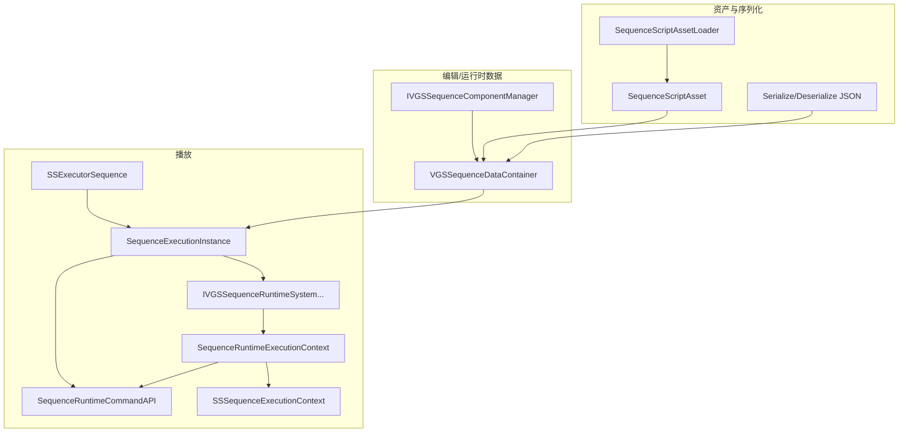

**`Tick` 语义摘要**（`SequenceExecutionInstance.cpp`）：`Playing` 且绑定有效时，**`m_GlobalTickCounter`** 每帧自增；对当前剪辑先 **`RuntimeSystem::Tick`**；若活动帧 **`ActiveWaitTokenIds`** 中存在 **`AsyncWaitRegistry`** 未解析的 id，则本帧不再前进；`Execute` 后若 **`ShouldHoldPlaybackAfterExecute`** 为 true，则 **`CreateWait`** 并将 token 压入 **`ActiveWaitTokenIds`**。宿主 **`Continue()`** / **`ContinueWithResume(ResumeToken)`** 经 **`SequenceRuntimeCommandAPI`** 触发 **`Resolve`**。可选 **`SequenceParallelGroup`** 下按 **`WaitAll` / `WaitAny`** 汇合后跳到 **`ResumeSequenceIndex`**。**`ProcessSignals`** 内 **`SequenceSignalBus::DispatchQueued`**。单帧线性路径下最多前进一条剪辑。队列为空或越界后 **`Finished`**。

**存档（Phase 2B）**：**`SequenceStateSerializer::Save/Load`** 持久化帧栈、变量表、Wait 注册表 Active 集、**`GlobalTickCounter`**、**`UserStateBlob`**；若 **`SSSequenceExecutionContext::ResourceManager`** 非空，同时读写 **`VGSSObjectIDGenerator::GetNextRawIdForSave` / `RestoreNextRawIdFromSave`**。**不**序列化 `VGSSequenceDataContainer` 内剪辑条目本身，也**不**恢复已注册 Gal 对象；读档后宿主需保证剪辑数据与资源表与存档一致。

---

## 4. 详细使用说明

### 4.1 引擎启动时挂载（资产 + 脚本执行器）

在合适的引擎初始化阶段调用一次：

```cpp
VisionGal::GalGame::GalGameSequenceScriptModule::MountEngineRuntime();
```

效果（`Module.cpp`）：

1. `EngineAssetFactory::Get().RegisterFactory(MakeScope<GalGameSequenceScriptAssetFactory>());`
2. `GalGameScriptExecutorFactory::Get().RegisterAssetExecutor(SequenceScriptAssetType{}.GetNameID(), MakeRef<SSExecutorCreatorSequence>());`

之后 VFS / 资源管线即可按 **`GalGameSequenceScript`** 类型创建资产，故事系统可通过工厂加载 **`SSExecutorSequence`**。

### 4.2 作为 `IStoryScriptExecutor` 使用（推荐路径）

1. 使用 **`SSExecutorSequence::LoadFromAsset(path)`** 或工厂 **`SSExecutorCreatorSequence::LoadFromAsset(path)`** 得到 `Ref<SSExecutorSequence>`（内部 `SequenceScriptAssetLoader` 读盘并取出 `ExecutionData`）。
2. 在合适的生命周期调用 **`Run(ISubsystemBus* bus, IGalGameContext* ctx)`**：会创建 **`SSExecutorResourceManager`**，填充 **`m_ExecutionContext.SubsystemBus`** / **`SequenceData`**，构造 **`SequenceExecutionInstance`** 并 **`Play()`**，内核以 **`Ref<IStoryExecutionInstance>`** 保存。
3. **每帧**调用 **`Tick(deltaTime)`**（宿主侧；内核 **`IStoryExecutionInstance::Tick(dt, bus)`** 由 **`SSExecutorSequence`** 转发并传入 **`SubsystemBus`**）。
4. 当对话等剪辑将 **`ShouldHoldPlaybackAfterExecute`** 置为等待时，由 UI/输入层在玩家确认继续时调用 **`ContinueDialogue()`**（转发到 **`m_Executor->Continue(bus)`**）。
5. 调试 UI 可通过 **`QueryInterface(typeid(SSSequenceRuntimeDebugInfo))`** 取得当前索引、类型名、是否 Waiting；**`QueryInterface(typeid(SSSequenceRuntimeInspectorInfo))`** 取得栈深、并行摘要、**`GlobalTickCounter`** 与帧轨迹文本（见 **`SequenceExecutionInstance::QueryInterface`**）。

**注意**：`PreLoadScriptResource`、`OnChoiceSelected`、`OnInputSubmitted` 等接口当前多为占位（`Executor.cpp`），扩展选择支/输入流时在保持 `IStoryScriptExecutor` 契约的前提下在此模块或上层实现。

### 4.3 仅使用调度器 + 自建上下文（不走路径资产）

适用于测试、工具或嵌入式播放：

1. 准备 **`Ref<VGSSequenceDataContainer>`**，向 `m_Sequence` 填入 **`IVGSSequenceComponent`**（或通过 **`IVGSSequenceComponentManager::CreateSequenceEntryByTypeNameID`** 克隆模板后改字段）。
2. 构造 **`SSSequenceExecutionContext`**：`SequenceData`、`ResourceManager`（`MakeRef<SSExecutorResourceManager>()`）、**`SubsystemBus`** 指向有效 **`ISubsystemBus*`**（整个 Tick 周期内保持有效）。
3. **`SequenceExecutionInstance` executor**；**`executor.SetExecutionContext(&ctx)`**；按需 **`RegisterRuntimeSystem`**（若需覆盖内置三个域，后注册者优先匹配）。
4. **`Play()`**，之后每帧 **`Tick(dt, bus)`**；Wait 时 **`Continue(bus)`**。

### 4.4 新增一种序列组件（运行时 + 存档 + 可选执行域）

需同时满足以下约定（与 `DataContainerSerialization.h` 注释一致）：

| 步骤 | 操作 |
|------|------|
| 1 | 定义结构体 `struct MyClip : TVGSSequenceComponent<MyClip>`，实现 **`GetTypeNameID()`** 返回稳定字符串（与 JSON `"type"` 一致）；**`GetComponentTypeID()`** 由模板基类默认提供（与 `type` 字符串哈希一致）。 |
| 2 | 在 **`IVGSSequenceComponentManager::Get()`** 生命周期内 **`EmplaceComponentType<MyClip>()`**（或等价注册），保证 **`CreateSequenceEntryByTypeNameID`** 可创建实例。 |
| 3 | 在命名空间 **`VisionGal`** 中实现 **`void component_to_json(const MyClip&, nlohmann::json& out)`** 与 **`void component_from_json(const nlohmann::json& in, MyClip& out)`**（供 ADL）。 |
| 4 | 在模块静态初始化处（可参考 `DataContainerSerialization.cpp` 的 **`VGSSequenceJsonBuiltinRegistration`**）执行 **`VGSSequenceComponentJsonRegistry::Get().Register(typeId, std::make_shared<TVGSSequenceComponentJsonBinding<MyClip>>())`**。 |
| 5 | 若需要运行时行为：实现 **`IVGSSequenceRuntimeSystem`**（优先 **`SupportsType(MakeSequenceComponentTypeIDFromTypeName(...))`**，必要时保留 **`CanExecute`** 兜底），在宿主或本库构造 **`SequenceExecutionInstance` 之后** **`RegisterRuntimeSystem`**；业务副作用请只通过 **`SequenceRuntimeExecutionContext::SharedContext`** 与 **`CommandAPI`** 驱动状态；若 **`ShouldHoldPlaybackAfterExecute`** 为 true，宿主需在适当时机调用 **`Continue()`**。 |

编辑器侧若需与 **`EnumerateRegisteredTypeNameIDs`** 对齐，应在编辑器 Bootstrap 中注册与运行时相同的 **`TypeNameID`** 与 Schema（见 `VGEditorGalgameSequence` 文档）。

### 4.5 JSON 根形状（序列化常量）

根对象含 **`formatVersion`**（`kVGSSequenceJsonFormatVersion`）、**`sequence`** 数组。单条条目含 **`type`**、**`sequenceIndex`**、**`data`**（组件自有字段）。详见 **`DataContainerSerialization.h`** 内联注释与 `SerializeVGSSequenceDataContainerToJson` / `DeserializeVGSSequenceDataContainerFromJson`（失败时保持 `out` 不变）。

---

## 5. 开发进展（与当前代码对齐）

### 5.1 已完成

- 三内置组件 + 三内置 `RuntimeSystem` + 完整调度与 Wait/Continue。
- 容器 JSON 序列化、绑定注册表、内置类型静态注册。
- `SSExecutorResourceManager` 角色/精灵/音视频注册、Layer 与元数据、文档化线程安全约束。
- `SSExecutorSequence` 对接 `IStoryScriptExecutor`、资产 Loader、修改时间记录。
- `GalGameSequenceScriptModule::MountEngineRuntime` 双注册。
- **Phase 2A — Execution Core 稳定化**：`IStorySequenceExecutionInstance`、`SequenceExecutionInstance`、帧栈 + `SequenceExecutionCursor`、`SequenceRuntimeExecutionContext`、`SequenceRuntimeCommandAPI`、`SequenceComponentTypeID` + `SupportsType` 优先分派、`Tick` 管线拆分、`SSExecutorSequence` 以 **`Ref<IStoryExecutionInstance>`** 持有内核。
- **Phase 2B — Save / Load**：`SequenceStateSerializer`、`SequenceRuntimeSnapshot`、`m_UserStateBlob`、`VGSSObjectIDGenerator` 读档恢复计数器、**`Engine/Source/Tests/VGGalgameSequenceRuntimeTest`**（GTest：`Save→Tick→Load`、挂起 token + **`Continue(nullptr)`**）。
- **Phase 2C — WaitToken / Continuation**：`AsyncWaitRegistry`、`ActiveWaitTokenIds`、`ContinueWithResume`。
- **Phase 2D — SignalBus**：`SequenceSignalBus`、`EmitSignal`、上下文 **`SignalBus*`**。
- **Phase 2E — Variable**：`SequenceValue`、`SequenceVariableTable`、`SetVariable`（**未做**通用表达式 `EvaluateExpression`，留后续）。
- **Phase 2F — Parallel**：`SequenceParallelGroup`、`SequenceBlockingPolicy`、`BeginParallelClipGroup`、并行 `Tick` 汇合。
- **Phase 2G — Inspector**：`SSSequenceRuntimeInspectorInfo`、`QueryInterface`、环形帧轨迹。

### 5.2 Phase 2 路线图（Runtime 与 API 契约，未进入 Graph/Editor）

| 阶段 | 目标 |
|------|------|
| **Phase 2A** | Execution Core 稳定化（**已完成**：见 5.1） |
| **Phase 2B** | Runtime State / SaveLoad（**已完成**：`SequenceStateSerializer`、ObjectID 计数器、`UserStateBlob`、单测） |
| **Phase 2C** | Continuation 与 Async Wait（**已完成**：WaitToken、`ResumeToken`、`AsyncWaitRegistry`） |
| **Phase 2D** | Runtime Event 与 Signal（**已完成**：`SequenceSignalBus`） |
| **Phase 2E** | Variable / Expression（**变量已完成**；表达式求值未做） |
| **Phase 2F** | Timeline / Parallel / Blocking（**已完成**：并行组） |
| **Phase 2G** | Debugger / Inspector Runtime（**已完成**：`SSSequenceRuntimeInspectorInfo` + 帧轨迹） |
| **Phase 2H** | Sequence Package 与 Streaming（分块序列、资源预载） |

### 5.3 进行中 / 占位

- `SSExecutorSequence::PreLoadScriptResource` 为空；`OnChoiceSelected` / `OnInputSubmitted` 未接线。
- `SequenceRuntimeCommandAPI::PushFrame` / `PopFrame`：Phase 2A 不改变栈深度，与多子序列/调用栈对接时实装。
- CMake：`VGGalgameSequenceRuntime` **仅** `PUBLIC VGGalgameCore`；宿主 **`VGGalgame`** 负责 **`MountEngineRuntime`** 实现与 Runtime 工厂链接。

### 5.4 已知实现细节

- 无匹配 **`IVGSSequenceRuntimeSystem`** 的组件：**不阻塞**，当帧跳过并前进索引（便于渐进接入新类型）。
- **`GSSExport.h`** 在非 Windows 分支使用宏名 **`VG_GALGAME_SCRIPT_VISUAL_EXPORT`**，与 Windows 侧 **`VG_GALGAME_SCRIPT_SEQUENCE_EXPORT`** 不一致；跨平台打包时需统一宏命名与编译定义。
- **`SequenceStateSerializer`** 仅保证 **内核调度状态** 与 **变量 / Wait / UserBlob / ObjectID 计数器** 一致；**不**恢复 `ResourceManager` 内已绑定的 Gal 对象；读档后若异步系统不再 `Resolve` 旧 token，需宿主或重放逻辑处理。

---

## 6. 修订记录

| 日期 | 说明 |
|------|------|
| 2026-05-13 | 文档：`GalGameSequenceScriptModule::MountEngineRuntime` 实现路径更正为 **`VGGalgameSequenceRuntime/Source/Interface/Module.cpp`**（由 **`GalGameSystem::Initialize`** 调用）。 |
| 2026-05-13 | Phase 8：**`SSSequenceExecutionContext::ExecutionServices`** + **`IRuntimeExecutionServices`** 默认宿主实现；对白节点优先走窄接口，可空则回退总线。 |
| 2026-05-12 | 初版：目录结构、架构、`Tick`/Wait 语义、集成步骤与扩展清单。 |
| 2026-05-12 | Phase 2A：引入 `SequenceExecutionInstance`、`IStoryExecutionInstance`、`SequenceRuntimeExecutionContext` / `CommandAPI`、组件类型 ID 与 `Tick` 管线；更新目录表与 Phase 2 路线图。 |
| 2026-05-12 | SubsystemBus：`SSSequenceExecutionContext::SubsystemBus`；`Run(ISubsystemBus*, IGalGameContext*)`；`IStoryExecutionInstance::Tick/Continue` 带 bus；内置 RuntimeSystem 经总线访问 Scene/Dialogue。 |


---
## FinalOverview: GALGAME_MODULE_ARCHITECTURE_AND_PROGRESS.md

# Galgame Runtime 总览 — 模块矩阵与 Phase 8 进度

本文档描述 **VisionGal Phase 8 — Runtime Decoupling & Execution Architecture Refactor** 落地后的 **九模块 CMake 矩阵**、**依赖方向** 与 **各子文档入口**。契约与实现类的 **详细 API 表** 以各模块 [`Docs/MODULE_ARCHITECTURE_AND_PROGRESS.md`](VGGalgameContract/Docs/MODULE_ARCHITECTURE_AND_PROGRESS.md) 为准（自 Contract / RuntimeCore 起向下展开）。

---

## 1. 模块矩阵（九目标）

| CMake 目标 | 类型 | 职责摘要 | 典型依赖 / 备注 |
|------------|------|----------|----------------|
| **VGGalgameContract** | `INTERFACE` | 纯 ABI：`IGalGameEngine`、`IGalGameRuntime`、`ISubsystemBus`（含 **`IPlaybackSubsystem`**）、`IRuntimeExecutionServices`、`ISequenceAction`、`IExecutionScheduler`（**`GalYieldInstruction`**）、`IGalRuntimeSession`、`ILuaRuntimeBridge`、占位 `IRuntimeDebugBridge` / `IGalRuntimeEventBus` / `IVariableRuntime` / `IRuntimeSnapshotProvider` 等。 | → `VGEngine`、`VGCore` |
| **VGGalgameRuntimeCore** | `SHARED` | 运行时数据与实现：`GalGameContext`、`SaveArchive`、`GalGameScriptExecutorFactory`、`IGameSystem.h` / `IGameObject.h`、`GalGameEngineAccess`、`Components`、**`ISerializableRuntimeState`** 等。**DLL 文件名 `VGGalgameCore.dll`**（`OUTPUT_NAME`）。 | `PUBLIC` → `VGGalgameContract`、`VGEngine` |
| **VGGalgameCore** | `INTERFACE` | **聚合**：转发头 + 链接 Contract + RuntimeCore；兼容存量 `target_link_libraries(... VGGalgameCore)`。 | → Contract、RuntimeCore |
| **VGGalgameNodeGraph** | `SHARED` | DialogueList 数据模型 + **`VGNodeExec_Galgame`** 节点执行函数；依赖 HNG。**不依赖 VGGalgameCore**。 | `PUBLIC` → `HNGRuntimeCore`、`HCore` |
| **VGGalgameLuaRuntime** | `SHARED` | Lua 剧情：`LuaStoryScript`、`GalGameLuaBinding`、`GalGameLuaScriptModule::MountEngineRuntime`。 | `PUBLIC` → `VGGalgameCore`；Lua 头路径 |
| **VGGalgameSequenceRuntime** | `SHARED` | Sequence 执行内核；**`GalGameSequenceScriptModule::MountEngineRuntime`** 实现在 **`Source/Interface/Module.cpp`**。**DLL 名 `VGGalgameScriptSequence.dll`**。 | `PUBLIC` → `VGGalgameCore` |
| **VGGalgamePresentation** | `SHARED` | 表现层首包：**`RenderPipeline`**（Gal 分层渲染 / RT）。 | `PUBLIC` → `VGGalgameCore`、`VGEngine` |
| **VGGalgame** | `SHARED` | 宿主 **`GalGameEngine`**、**`GalRuntimeSessionHost`**、**`GalDefaultExecutionScheduler`**、**`GalSubsystemBus`**、对白门面与子运行时等。 | `PUBLIC` → `VGGalgameNodeGraph`、`VGGalgameCore`、`VGGalgamePresentation`、`VGGalgameLuaRuntime`、`VGGalgameSequenceRuntime` |
| **VGGalgameEditorRuntime** | `INTERFACE` | 编辑器隔离：**`IEditorGalgameRuntimeBridge`**。 | → `VGGalgameContract` |

根目录 [`CMakeLists.txt`](../../../CMakeLists.txt)（仓库根）`add_subdirectory` 顺序：**Contract → RuntimeCore → Core → NodeGraph → LuaRuntime → SequenceRuntime → Presentation → VGGalgame →（其它）→ EditorRuntime**。

---

## 2. 依赖方向（约束）

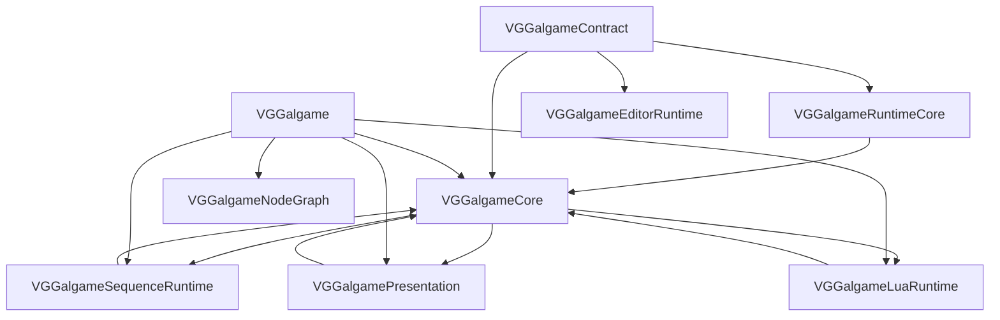

**说明**：**`VGGalgameNodeGraph`** 不经过 **`VGGalgameCore`**；仅由 **`VGGalgame`** 显式 `PUBLIC` 链接以保证宿主进程加载节点图 DLL。

**禁止**：`VGGalgameContract` 的公开头反向 `#include` **`VGGalgameRuntimeCore`** 的实现头（除经 `Engine/Source/Runtime` 根的受控路径外，仍应避免循环依赖）。

---

## 3. Phase 8 子阶段状态（摘要）

| 子阶段 | 状态 | 说明 |
|--------|------|------|
| **8.1 Contract / RuntimeCore 拆分** | 已落地 | 新建 Contract + RuntimeCore；`VGGalgameCore` 为 INTERFACE 聚合；`#include "VGGalgameCore/..."` 薄转发保留。 |
| **8.2 Runtime Session** | 已落地 | `IGalRuntimeSession` + `GalRuntimeSessionHost`；`GalGameEngine::OnUpdate` → `GalRuntimeSessionHost::Tick`（顺序见 `GalRuntimeSessionHost.cpp`）。 |
| **8.3 Execution Scheduler** | 演进中 | `GalYieldKind` / `GalYieldInstruction`、`SubmitYield`；`GalDefaultExecutionScheduler` 与 `StoryScriptSystem` 协同；详见 [VGGalgame 文档](VGGalgame/Docs/MODULE_ARCHITECTURE_AND_PROGRESS.md)。 |
| **8.4 Dialogue Runtime / Presentation** | 已落地（首包） | `DialogueRmlPresentation`、`DialogueLineRuntime`、`DialogueTypingRuntime`、`DialoguePlaybackRuntime` + `DialogueSystem`；`RenderPipeline` 迁至 **Presentation**。 |
| **8.5 Runtime Layer Graph** | 骨架 | `IRuntimeLayerGraph` + `GalRuntimeLayerGraphAdapter`（`TickLayers` 占位）。 |
| **8.6 Snapshot / Save** | 演进中 | **`ISerializableRuntimeState`**；`IRuntimeSnapshotProvider` 骨架；SaveArchive schema 与 Lua 绑定联动时升版本。 |
| **8.7 Editor Runtime 隔离** | 演进中 | **`IRuntimeDebugBridge`** 占位；`VGGalgameEditorRuntime` + **`IEditorGalgameRuntimeBridge`**。 |
| **8.8 Engine / Context 去耦** | 已落地（首包） | 瘦 **`IGalGameEngine`**；`GalGameContext` 无 **`Engine`** 指针；`GalSubsystemBus` Adapter；`IGalGameRuntime` + `IPlaybackSubsystem`。 |
| **8.9 Runtime Event 统一** | 骨架 | **`IGalRuntimeEventBus`** 占位。 |
| **Sequence 模块重命名** | 已落地 | 目录 **`VGGalgameSequenceRuntime`**；CMake 目标同名；DLL 名保持 **`VGGalgameScriptSequence.dll`**。 |
| **Lua 独立库** | 已落地 | **`VGGalgameLuaRuntime`**；详见 [LuaRuntime 文档](VGGalgameLuaRuntime/Docs/MODULE_ARCHITECTURE_AND_PROGRESS.md)。 |
| **NodeGraph 独立库** | 已落地 | **`VGGalgameNodeGraph`**；详见 [NodeGraph 文档](VGGalgameNodeGraph/Docs/MODULE_ARCHITECTURE_AND_PROGRESS.md)。 |

---

## 4. 各模块文档入口

| 模块 | 文档 |
|------|------|
| VGGalgameContract | [VGGalgameContract/Docs/MODULE_ARCHITECTURE_AND_PROGRESS.md](VGGalgameContract/Docs/MODULE_ARCHITECTURE_AND_PROGRESS.md) |
| VGGalgameRuntimeCore | [VGGalgameRuntimeCore/Docs/MODULE_ARCHITECTURE_AND_PROGRESS.md](VGGalgameRuntimeCore/Docs/MODULE_ARCHITECTURE_AND_PROGRESS.md) |
| VGGalgameCore（INTERFACE 聚合） | [VGGalgameCore/Docs/MODULE_ARCHITECTURE_AND_PROGRESS.md](VGGalgameCore/Docs/MODULE_ARCHITECTURE_AND_PROGRESS.md) |
| VGGalgameNodeGraph | [VGGalgameNodeGraph/Docs/MODULE_ARCHITECTURE_AND_PROGRESS.md](VGGalgameNodeGraph/Docs/MODULE_ARCHITECTURE_AND_PROGRESS.md) |
| VGGalgameLuaRuntime | [VGGalgameLuaRuntime/Docs/MODULE_ARCHITECTURE_AND_PROGRESS.md](VGGalgameLuaRuntime/Docs/MODULE_ARCHITECTURE_AND_PROGRESS.md) |
| VGGalgameSequenceRuntime | [VGGalgameSequenceRuntime/Docs/MODULE_ARCHITECTURE_AND_PROGRESS.md](VGGalgameSequenceRuntime/Docs/MODULE_ARCHITECTURE_AND_PROGRESS.md) |
| VGGalgamePresentation | [VGGalgamePresentation/Docs/MODULE_ARCHITECTURE_AND_PROGRESS.md](VGGalgamePresentation/Docs/MODULE_ARCHITECTURE_AND_PROGRESS.md) |
| VGGalgame | [VGGalgame/Docs/MODULE_ARCHITECTURE_AND_PROGRESS.md](VGGalgame/Docs/MODULE_ARCHITECTURE_AND_PROGRESS.md) |
| VGGalgameEditorRuntime | [VGGalgameEditorRuntime/Docs/MODULE_ARCHITECTURE_AND_PROGRESS.md](VGGalgameEditorRuntime/Docs/MODULE_ARCHITECTURE_AND_PROGRESS.md) |

---

## 5. 脚本与合并文档

| 路径 | 说明 |
|------|------|
| `Engine/Scripts/gen_vggalgame_core_shims.ps1` | 重新生成 `VGGalgameCore/` 下薄转发头。 |
| `Engine/Scripts/check_vggalgame_core_includes.ps1` | 校验 Core 转发目录未引入禁止路径。 |
| `Engine/Source/RuntimeGalgame/merge_docs.py` | 将各模块 **`Docs/MODULE_ARCHITECTURE_AND_PROGRESS.md`** 合并为 **`MERGED_ARCHITECTURE_AND_PROGRESS.md`**（默认 **包含全部子模块**；便于全文检索与对外导出）。在 **`RuntimeGalgame`** 目录执行：`python merge_docs.py`。 |

---

## 6. 修订记录

| 日期 | 说明 |
|------|------|
| 2026-05-13 | 总览更新：九模块矩阵、依赖图含 NodeGraph、文档入口含 **VGGalgameCore** / **NodeGraph**；脚本节补充 **merge_docs.py**。 |
