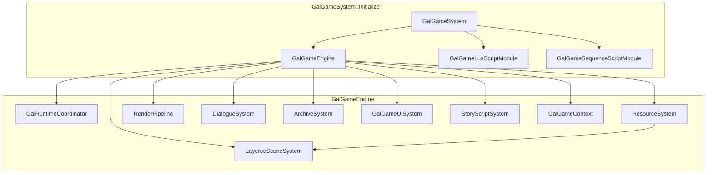

# VGGalgame 模块架构、使用说明与开发进展

本文档描述 **Galgame 展示与运行时集成层** 目标 `VGGalgame`（CMake：`SHARED`）的目录结构、**`GalGameEngine`** 子系统协作关系、**`GalGameSystem`** 引导步骤，以及本模块内 **具体类** 的 **API 说明**（公开 **`I*`** 契约见 **`VGGalgameContract`** / **`VGGalgameRuntimeCore`**，通过 **`VGGalgameCore`** INTERFACE 聚合链接）。

导出宏见 `VGGalgameConfig.h`（`VG_GALGAME_API`）；编译定义 `VG_GALGAME_EXPORT`。

---

## 1. 模块定位与依赖

| 项目 | 说明 |
|------|------|
| **职责** | 实现 **`IGalGameEngine`** 的具体类 **`GalGameEngine`**；装配 **存档 `ArchiveSystem`**、**对话 `DialogueSystem`**、**分层场景 `LayeredSceneSystem`**、**渲染 `RenderPipeline`**、**资源 `ResourceSystem`**、**UI `GalGameUISystem`**、**剧情 `StoryScriptSystem`**（实现位于本模块 **`Include/ScriptSystem/`**）；实现 **`Game.h`** 中的 **`GalSprite` / `GalAudio` / `GalVideo` / `GalCharacter`**；提供 **`GalGameSystem::Initialize`** 完成子引擎注册、Actor 工厂、场景序列化段、Lua API 与 **Lua / Sequence** 模块挂载。 |
| **CMake 链接** | `PUBLIC VGGalgameNodeGraph`、`PUBLIC VGGalgameCore`、`PUBLIC VGGalgamePresentation`、`PUBLIC VGGalgameLuaRuntime`、`PUBLIC VGGalgameSequenceRuntime`（并间接依赖 **`VGEngine`** 等）。 |
| **典型消费方** | 桌面宿主、编辑器 Play Mode、测试工程；通过 **`CoreGameEngine::AddSubGameEngine`** 挂载。 |
| **不负责** | **`IStoryScriptSystem`** 等契约定义（**`VGGalgameContract`** + **`VGGalgameRuntimeCore/Interface/IGameSystem.h`**）；**`GalGameScriptExecutorFactory`**（**`VGGalgameRuntimeCore/Interface/IStoryScript.h`**）；节点图执行函数（**`VGGalgameNodeGraph`**）；**`RenderPipeline`** 实现体（**`VGGalgamePresentation`**）；Lua / Sequence 执行器具体类（**`VGGalgameLuaRuntime`** / **`VGGalgameSequenceRuntime`**）。 |

---

## 2. 源码目录结构（与仓库实际文件一致）

| 路径 | 职责 |
|------|------|
| `VGGalgameConfig.h` | **`VG_GALGAME_API`**。 |
| `Interface/GalgameSystem.h` / `Source/Interface/GalgameSystem.cpp` | **`GalGameSystem::Initialize`**：创建 **`GalGameEngine`**、注册 **`GalGameEngineGameActorBuilder`**、**`GalGameEngineComponentSerializer`**、**`GalGameLuaBinding`**、**`GalGameLuaScriptModule::MountEngineRuntime`**（**`VGGalgameLuaRuntime`**）、**`GalGameSequenceScriptModule::MountEngineRuntime`**（实现在 **`Source/Interface/GalGameSequenceScriptModuleMount.cpp`**）。 |
| `Include/GalGameEngine.h` / `Source/GalGameEngine.cpp` | **`GalGameEngine`**：子系统生命周期、**`Initialize`** / **析构时 `Shutdown` 链**、**`OnUpdate`**（经 **`IGalRuntimeSession::Tick`** → **`GalRuntimeCoordinator::TickFrame`**）、渲染回调里驱动 **`RenderPipeline`**；持有 **`GalSubsystemBus`**、**`GalGameRuntimeHost`**、**`GalRuntimeCoordinator`**、**`GalRuntimeSessionHost`**。 |
| `Include/GalSubsystemBus.h` / `Source/GalSubsystemBus.cpp` | **`GalSubsystemBus`** 与各 **`Gal*SubsystemAdapter`**：实现 **`ISubsystemBus`**，直访引擎子系统。 |
| `Include/Runtime/*.h` / `Source/Runtime/*.cpp` | **`GalRuntimeCoordinator`**（**`ResetRuntime`**、**`SaveRuntimeState`/`RestoreRuntimeState`** 内存 JSON）、**`GalRuntimePhase`**、**`GalRuntimeSessionHost`**、**`GalGameRuntimeHost`**、**`GalDefaultExecutionScheduler`**。 |
| `Include/Game.h` / `Source/Game.cpp` | **`GalSprite`**、**`GalAudio`**、**`GalVideo`**、**`GalCharacter`** 实现。 |
| `Include/ArchiveSystem.h` / `Source/ArchiveSystem.cpp` | 槽位存档 JSON 目录扫描与读写。 |
| `Include/DialogueSystem/*` / `Source/DialogueSystem/*` | **`DialogueSystem`** 门面；**`DialogueRmlPresentation`**、**`DialogueLineRuntime`**、**`DialogueTypingRuntime`**、**`DialoguePlaybackRuntime`**、**`TypingEffect`**。 |
| `Include/ResourceSystem.h` / `Source/ResourceSystem.cpp` | 场景 Actor 创建与 **`LayeredSceneSystem`** 挂载；**`NotifyRuntimeReset`**（Phase 8A/8E 钩子）。 |
| `Include/SceneSystem/*` / `Source/SceneSystem/*` | **`LayeredSceneSystem`**、**`SceneSpriteManager`**、**`SceneAudioManager`**、**`SceneVideoManager`**。 |
| `Include/UISystem/GalUISystem.h` / `Source/UISystem/GalUISystem.cpp` | **`GalGameUISystem`**。 |
| `Include/ScriptSystem/StoryScriptSystem.h` / `Source/ScriptSystem/StoryScriptSystem.cpp` | **`StoryScriptSystem`**：**`GalRuntimeScriptLoader`** + **`GalScriptRuntimeRegistry`**；**`TryCreateStoryExecution`**；**`Initialise(..., ISubsystemBus*)`**；**`ResetExecutionPipeline`**（不写 **Context**）。 |
| `Include/ScriptSystem/GalRuntimeScriptLoader.h` / `Source/ScriptSystem/GalRuntimeScriptLoader.cpp` | **`GalRuntimeScriptLoader`**：路径→执行器（Registry→Factory）。 |
| `Include/ScriptSystem/GalScriptRuntimeRegistry.h` / `Source/ScriptSystem/GalScriptRuntimeRegistry.cpp` | **`GalScriptRuntimeRegistry`**：脚本后端注册与按路径查找。 |
| `Include/ScriptSystem/GalAssetTypeScriptRuntime.h` / `Source/ScriptSystem/GalAssetTypeScriptRuntime.cpp` | **`GalAssetTypeScriptRuntime`**：按资产类型 ID 委托 **`GalGameScriptExecutorFactory`** 的 **`IScriptRuntime`** 实现。 |
| `Include/ScriptSystem/StoryExecutionInstance.h` / `Source/ScriptSystem/StoryExecutionInstance.cpp` | **`StoryExecutionInstance`**：**`IStoryExecutionInstance`** 包装 **`IStoryScriptExecutor`**。 |
| `Include/RenderPipeline.h` | **薄转发**：`#include "VGGalgamePresentation/Include/RenderPipeline.h"`；实现与 `.cpp` 在 **`VGGalgamePresentation`**。 |
| `Include/SpriteAnimationScriptManager.h` / `Source/SpriteAnimationScriptManager.cpp` | **`SpriteTransformScriptManager`**：精灵变换命令工厂。 |
| `Include/SpriteAnimationScript.h` / `Source/SpriteAnimationScript.cpp` | **`ScrollTransformScript`** 等动画脚本片段。 |
| `CMakeLists.txt` | `GLOB` 收集源；定义 **`VG_GALGAME_EXPORT`**。 |
| `Docs/MODULE_ARCHITECTURE_AND_PROGRESS.md` | 本文件。 |

---

## 3. 总体架构



**说明**：**`StoryScriptSystem`** 仅经 **`ISubsystemBus*`** 访问子系统，**不**再持有 **`IGalGameEngine*`**（图中不画回边）。
**一帧更新顺序**（`GalGameEngine::OnUpdate` → **`GalRuntimeSessionHost::Tick`** → **`GalRuntimeCoordinator::TickFrame`**）：**`LayeredSceneSystem::OnUpdate`** → **`DialogueSystem::Update`** → **`GalDefaultExecutionScheduler::Tick`**（内部驱动 **`StoryScriptSystem::Update`** 等）。

**渲染**：引擎 **`IGameEngineContext`** 的 **BeforeRender** 回调中调用 **`RenderPipeline::Render`**（见 **`GalGameEngine::Initialize`** 订阅）。

**主场景切换**（`EngineEventType::MainSceneChanged`）：由 **`GalRuntimeCoordinator::HandleMainSceneChanged`** 统一执行（清空分层场景、切换 **`Scene*`**、**`DialogueSystem::Clear`**；若处于播放模式则 **`LoadSceneStoryScriptOnUpdate`** 延迟加载脚本）；阶段位 **`GalRuntimePhase::Transitioning`**。

---

## 4. 详细使用说明

### 4.1 引擎启动时挂载（推荐）

在 **`CoreGameEngine`** 已完成基础上下文（含 UI **`Rml::Context`**）可用后调用一次：

```cpp
VisionGal::GalGameSystem::Initialize(coreGameEngine);
```

效果摘要（`GalgameSystem.cpp`）：

1. `MakeRef<GalGame::GalGameEngine>()` → **`galgameEngine->Initialize(engine.GetContext())`** → **`engine.AddSubGameEngine(galgameEngine)`**。
2. 注册 **`GalGameEngine`** 类型 Actor 构建器（标签「GalGame Engine」并添加 **`GalGameEngineComponent`**）。
3. **`SceneSerializerRegistry::RegisterSegmentSerializer`** 注册 **`GalGameEngineComponentSerializer`**。
4. **`CoreLua::RegisterGlobalAPI`** 内 **`GalGameLuaBinding::Register`**。
5. **`GalGameLuaScriptModule::MountEngineRuntime`** + **`GalGameSequenceScriptModule::MountEngineRuntime`**。

### 4.2 取得 `IGalGameEngine*`

- 由 **`CoreGameEngine`** 子引擎列表查询 **`GalGameEngine`** 实例后向上转型；或
- 在 Lua / 工具代码中通过 **`VisionGal::GalGame::GalGameEngineAccess::Current()`**（由 **`GalGameEngine::Initialize`** 调用 **`GalGameEngineAccess::SetCurrent`** 注入）。

### 4.3 典型游戏循环配合

1. 确保宿主每帧调用 **`IGalGameEngine::OnUpdate(deltaTime)`**（子引擎接口继承自 **`ISubGameEngine`**）。
2. 渲染管线由引擎上下文 **BeforeRender** 自动触发 **`RenderPipeline`**；无需在空实现的 **`OnRender`** 中重复调用。
3. 剧情推进：脚本系统内部 **`Tick`** 执行器；玩家确认对白继续时调用 **`IDialogueSystem::ContinueDialogue`** 与（若使用 Sequence 执行器）**`IStoryScriptSystem`** / **`IStoryExecutionInstance::Continue`**（详见本模块 **`Include/ScriptSystem/`** 与 **`VGGalgameSequenceRuntime`** 文档）。

### 4.4 场景侧配置

在场景 Actor 上挂载 **`GalGameEngineComponent`**，填写 **`scriptPath`** 与各类 UI 资产路径；进入场景且 **`IsPlayMode()`** 为真时，由 **`GalRuntimeCoordinator::HandleMainSceneChanged`** 触发 **`StoryScriptSystem::LoadSceneStoryScriptOnUpdate`**。

### 4.5 转场与快进

**`GalGameEngine::TransitionCommand*`**：若 **`DialogueSystem::IsFastForward()`** 为真则直接返回成功并不启动转场；否则委托 **`TransitionManager`**（`VGEngine`）。

---

## 5. 本模块公开类型 API 参考

### 5.1 `GalGameSystem`（`Interface/GalgameSystem.h`）

| API | 说明 |
|-----|------|
| `static void Initialize(CoreGameEngine& engine)` | **一次性**引导：子引擎、工厂、序列化、Lua、脚本模块挂载。 |

### 5.2 `GalGameEngine`（`Include/GalGameEngine.h`）

在 **`IGalGameEngine`** 之外扩展：

| API | 说明 |
|-----|------|
| `void Initialize(IGameEngineContext* context)` | **`GalRuntimeCoordinator::Attach`**、设置 **`GalGameEngineAccess::SetCurrent`**、**`CreateSubsystem`**、订阅视口尺寸与 **BeforeRender**、**`MarkHostRunning`** 后 **`GalRuntimeSessionHost::Start`**。 |
| `~GalGameEngine()` | 调用 **`GalRuntimeCoordinator::Shutdown`** 与 **`GalGameEngineAccess::SetCurrent(nullptr)`**，再析构成员。 |
| `void OnRender() override` | 当前为空；实际渲染在 **`OneRenderSceneCallback`**。 |
| `void OnUpdate(float deltaTime) override` | 经 **`GetRuntimeSession()->Tick`** 驱动子系统（见 §3）；并实现 **`IGalGameEngine::GetSubsystemBus` / `GetContext` / `GetRuntimeSession` / `GetRuntime`**。 |
| **`GalRuntimePhase GetRuntimePhase() const noexcept`** | 转发 **`GalRuntimeCoordinator::GetPhase`**，供调试与只读查询。 |

**`CreateSubsystem` 私有流程（Phase 8A-2）**：**`GalRuntimeCoordinator::BeginSubsystemConstruction`** → 分配 **`GalGameContext`** → **`LayeredSceneSystem::Initialize`** → 对话 **`InitialiseDataModel` + `Initialize`** → **`RenderPipeline::Initialize`** → **`ArchiveSystem::Initialise`** → **`ResourceSystem::Initialize`** → **`GalGameUISystem::Initialize`** → **`StoryScriptSystem::Initialise(..., &m_SubsystemBus)`**（内置注册 Lua/Sequence **`IScriptRuntime`**）→ **`GalRuntimeCoordinator::EndSubsystemConstruction`**。

### 5.3 `ArchiveSystem`（`Include/ArchiveSystem.h`）

| API | 说明 |
|-----|------|
| `bool Initialise(const Ref<GalGameContext>& ctx)` | 绑定上下文，扫描存档目录。 |
| `SaveArchive SaveArchiveByNumber(const String& number) override` | 构造当前状态存档（含 **`archiveData`** 序列化路径逻辑，见实现）。 |
| `SaveArchive GetArchiveByNumber` / `bool HasArchiveByNumber` | 读槽位。 |
| `std::string GetCurrentDateFormat()` / `GetCurrentTimeFormat()` | UI 用时间戳字符串。 |

### 5.4 `DialogueSystem`（`Include/DialogueSystem/DialogueSystem.h`）

| API | 说明 |
|-----|------|
| `void Initialize(const Ref<GalGameContext>& ctx)` | 绑定上下文与运行时状态。 |
| `bool InitialiseDataModel(Rml::Context* context)` | 绑定 Rml 数据模型（返回值表示是否成功，见实现）。 |
| 其余方法 | 与 **`IDialogueSystem`** 一一对应；内部 **`TypingEffect`** 驱动 **`m_DialogName` / `m_DialogText`** 显示串。 |
| `void Update() override` | 每帧：**`TypingEffect::Update`**、快进、自动继续逻辑（**`ProcessFastForward`** / **`ProcessAutoDialogue`**）。 |

### 5.5 `ResourceSystem`（`Include/ResourceSystem.h`）

| API | 说明 |
|-----|------|
| `void Initialize(const Ref<GalGameContext>& galCtx, const Ref<LayeredSceneSystem>& sceneSystem)` | 保存 **`Scene*`**（来自上下文主场景）、绑定分层管理器。 |
| `bool PreLoadResource(const String& path)` | 预加载。 |
| `GalSprite* ShowSprite` / `ShowColor` | 创建精灵包装并加入场景图。 |
| `GalAudio* PlayAudio` / `GalVideo* PlayVideo` | 创建音/视频 Actor。 |
| `bool RemoveSprite(GalSprite*)` / `RemoveAudio(GalAudio*)` | 从分层管理器移除。 |

### 5.6 `LayeredSceneSystem`（`Include/SceneSystem/LayeredSceneSystem.h`）

| API | 说明 |
|-----|------|
| `void Initialize(const Ref<GalGameContext>& ctx)` | 将上下文传给子 **`Scene*Manager`**。 |
| `AddCharacter` / `ClearAll` / `ClearAllCharacter` | 角色列表与场景资源清理。 |
| `TraverseScene` / `TraverseCharacter` | 遍历回调。 |
| `OnUpdate` override | 转发子管理器更新（若实现内有 Tick）。 |
| `GetSpriteManager` / `GetAudioManager` / `GetVideoManager` | 返回内部 **`SceneSpriteManager`** 等实例地址（生命周期同 **`LayeredSceneSystem`**）。 |

### 5.7 `GalGameUISystem`（`Include/UISystem/GalUISystem.h`）

| API | 说明 |
|-----|------|
| `void Initialize(const Ref<GalGameContext>& galCtx, IGameEngineContext* context)` | 缓存 **`IScene*`** 与上下文。 |
| `ShowChoiceUI` / `GetChoiceOptionByIndex` / `GetChoiceOptionSize` / `SelectCurrentChoice` | 选择支状态机 + 通过 **`GalGameContext::uiEventBus`** 派发 **`GalGameUIEvent`**（见 **`GalGameEvent.h`**）。 |
| `ShowFullScreenTextUI` / `GetFullScreenTextItem` / `GetFullScreenTextSize` | 全屏文本队列。 |
| `ShowInputUI` / `InputSubmitted` / `GetInputTitle` / `GetInputButtonText` | 输入框流程。 |
| **`ResetTransientUIState`** | **`GalRuntimeCoordinator::ResetRuntime` / `Shutdown`** 时清空选择/全屏字/输入暂存字段。 |

### 5.8 `RenderPipeline`（`Include/RenderPipeline.h` → **`VGGalgamePresentation/Include/RenderPipeline.h`**）

| API | 说明 |
|-----|------|
| `void Initialize(IGameEngineContext* context)` | 创建 RT、全屏渲染组件等（**实现 DLL：`VGGalgamePresentation`**）。 |
| `void Render(ILayeredSceneManager* scene, IOrthoCamera* camera, OpenGL::RenderTarget2D* rt)` | 主入口：背景层、场景层、角层混合（**`RenderBackgroundLayer`** / **`RenderSceneLayer`** / **`RenderMixCharacterSprite`**）。 |
| `void OnScreenSizeChanged(int width, int height)` | 视口变化时重建 RT。 |
| `void CaptureBackgroundLayer()` / `CaptureSceneLayer()` | 抓取上一帧纹理供转场使用。 |
| `void SetScene(Scene* scene)` | 主场景指针。 |

本仓库中 **`VGGalgame/Include/RenderPipeline.h`** 仅 **`#include "VGGalgamePresentation/Include/RenderPipeline.h"`**，链接依赖由 CMake **`PUBLIC VGGalgamePresentation`** 保证。

### 5.9 `GalRuntimeCoordinator` / `GalRuntimePhase`（`Include/Runtime/GalRuntimeCoordinator.h` / `GalRuntimePhase.h`）

| API / 类型 | 说明 |
|-----|------|
| **`GalRuntimePhase` 枚举** | **`Uninitialized` / `Initializing` / `Running` / `Resetting` / `Transitioning` / `ShuttingDown`**；供宿主与子系统只读判断生命周期（**勿**作跨线程同步原语）。 |
| **`Attach` / `BeginSubsystemConstruction` / `EndSubsystemConstruction` / `MarkHostRunning`** | 与 **`GalGameEngine::CreateSubsystem` / `Initialize`** 对齐，固定 Phase 8A-2 装配阶段边界。 |
| **`TickFrame`** | 统一 **`LayeredSceneSystem::OnUpdate`** → **`DialogueSystem::Update`** → **`IExecutionScheduler::Tick`**；由 **`GalRuntimeSessionHost::Tick`** 调用。 |
| **`HandleMainSceneChanged`** | 主场景切换：清层、绑 **`RenderPipeline`** 场景、**`DialogueSystem::Clear`**、播放模式下 **`LoadSceneStoryScriptOnUpdate`**。 |
| **`ResetRuntime`** | 全量清理：停会话、**`TransitionManager::AbortAllTransitions`**、**`StoryScriptSystem::ResetExecutionPipeline`**（不写 Context）、对白、**`LayeredSceneSystem::ClearAll`**（含 **GalCharacter**）、**`ResourceSystem::NotifyRuntimeReset`**、UI、**`GalGameRuntimeState`**/**`ArchiveDataContainer`** 单点重建、**`m_IsEngineEnable=true`**、**`OnRuntimeLifecycleEvent(ResetCompleted)`**、调度器 **`Reset`**。 |
| **`Shutdown`** | **`~GalGameEngine`** 内调用；反序停止脚本与 UI/对白/场景侧可重复清理，并将 **`GalRuntimePhase`** 置 **`Uninitialized`**。 |
| **`SaveRuntimeState` / `RestoreRuntimeState`** | Phase 8D 快照占位，当前不读写磁盘。 |

### 5.10 `GalRuntimeSessionHost`（`Include/Runtime/GalRuntimeSessionHost.h`）

| API | 说明 |
|-----|------|
| **`Start` / `Stop` / `Pause` / `Resume`** | 实现 **`IGalRuntimeSession`**；与引擎 Initialize/Reset 对齐。 |
| **`Tick(deltaTime)`** | 转发 **`GalRuntimeCoordinator::TickFrame`**（内部顺序：场景/对白 → **`GalDefaultExecutionScheduler::Tick`**）。 |
| **`ResetSchedulerStateForHost`** | **`ResetRuntime`** 时重置调度器暂停与句柄种子。 |
| **`GetSubsystemBus` / `GetExecutionScheduler` / `GetRuntimeState` / `GetResourceContext`** | 返回引擎装配的总线、调度器与 **`GalGameContext`**。 |
| **`GetEventPipeline()`** | 当前为 **`GalNoopRuntimeEventPipeline`** 占位。 |

### 5.11 `GalGameRuntimeHost`（`Include/Runtime/GalGameRuntimeHost.h`）

| API | 说明 |
|-----|------|
| **`GetExecutionRuntime`** | **`IStoryScriptSystem*`**（引擎内 **`StoryScriptSystem`**）。 |
| **`GetSaveRuntime`** | **`IArchiveSystem*`**（**`ArchiveSystem`**）。 |
| **`GetPlaybackRuntime`** | **`IPlaybackSubsystem*`**；与 **`ISubsystemBus::Playback()`** 指向同一适配器，避免重复状态。 |
| **`GetVariableRuntime`** | 当前可返回 **nullptr**（占位）。 |

### 5.12 `GalDefaultExecutionScheduler`（`Include/Runtime/GalDefaultExecutionScheduler.h`）

| API | 说明 |
|-----|------|
| **`Tick`** | 委托剧情 **`StoryScriptSystem::Update`** 等（与引擎 **`OnUpdate`** 顺序文档化于会话宿主）。 |
| **`SubmitYield`** | **`GalYieldKind::WaitSeconds`** 等路径可委托 **`StoryScriptSystem::Wait`**；其它 Yield 演进中。 |
| **`SubmitWait` / `Cancel` / `Pause` / `Resume`** | 句柄队列占位演进中。 |
| **`Reset`** | **`GalRuntimeCoordinator::ResetRuntime`** / **`Shutdown`** 时清空全局暂停与句柄计数。 |

### 5.13 `GalSubsystemBus` 与各 Adapter（`Include/GalSubsystemBus.h` / `Source/GalSubsystemBus.cpp`）

| 类型 | 说明 |
|------|------|
| **`GalSubsystemBus`** | 聚合 **`GalSceneSubsystemAdapter`**、**`GalAudioSubsystemAdapter`**、**`GalUISubsystemAdapter`**、**`GalScriptSubsystemAdapter`**、**`GalArchiveSubsystemAdapter`**、**`GalDialogueSubsystemAdapter`**、**`GalPlaybackSubsystemAdapter`**；实现 **`ISubsystemBus`**。 |
| **各 `Gal*SubsystemAdapter`** | **`SetOwner(GalGameEngine*)`** 后，将 **`ISubsystemBus`** 虚调用转发到引擎既有 **`ResourceSystem`** / **`LayeredSceneSystem`** / **`StoryScriptSystem`** 等（**不经 **`IGalGameEngine`** 已删除的上帝 API**）。 |

### 5.14 对白子模块（`Include/DialogueSystem/`）

| 类型 | 职责 |
|------|------|
| **`DialogueSystem`** | **`IDialogueSystem`** 装配门面；**`Update`** 组合各子运行时。 |
| **`DialogueRmlPresentation`** | Rml 数据模型绑定与表现串同步。 |
| **`DialogueLineRuntime`** | 对白行 / 历史 / 与 **`GalGameContext`** 状态同步。 |
| **`DialogueTypingRuntime`** | 打字机与回调。 |
| **`DialoguePlaybackRuntime`** | 自动播放 / 快进节拍。 |

### 5.15 `SpriteTransformScriptManager`（`Include/SpriteAnimationScriptManager.h`）

| API | 说明 |
|-----|------|
| `static SpriteTransformScriptManager* GetInstance()` | 单例访问（若实现为单例）。 |
| `static Ref<IAnimationScript> CreateSpriteTransformWithCommand(IGalGameEngine*, IGameActor*, const String& cmd)` | 解析命令字符串创建 **`IAnimationScript`**。 |
| `static bool StartSpriteTransformWithCommand(...)` | 便捷启动。 |

### 5.16 `ScrollTransformScript`（`Include/SpriteAnimationScript.h`）

| API | 说明 |
|-----|------|
| `enum class Direction { Left, Right, Up, Down }` | 滚动方向。 |
| `void SetDuration(float)` / `SetEasing(EasingFunction)` | 动画参数。 |
| `void Start() override` | **`IAnimationScript`** 生命周期。 |
| `void OnUpdate(Horizon::HEntityInterface* entity) override` | 每帧更新 **`TransformAnimationScript`**。 |

### 5.17 `GalSprite` / `GalAudio` / `GalVideo` / `GalCharacter`（`Include/Game.h`）

均实现 **`VGGalgameRuntimeCore/Interface/IGameObject.h`** 中对应 **`I*`** 接口（通过 **`VGGalgameCore`** 聚合头包含）；额外暴露 **`m_Engine`**、路径、图层、底层 **`IGameActor*`** 与（精灵）**`GalGameRuntimeState*`** 指针，供实现体内访问引擎与全局 UI 状态。

**`GalCharacter::FigureState`**：记录隐藏标志、状态名、当前立绘 **`IGalSprite*`**、当前语音 **`IGalAudio*`**；支持 **`AddFigure`** 状态表、**`ShowFigure`/`HideFigure`** 与 Lua 回调列表。

---

## 6. 开发进展（与当前代码对齐）

### 6.1 已完成

- **`GalGameEngine`** 完整子系统装配与主场景切换流程（含 **OnUpdate** 管线）。
- **Phase 8A**：**`GalRuntimeCoordinator`** / **`GalRuntimePhase`**；**`CreateSubsystem`** 固定顺序（Context → Systems → **StoryScriptSystem**）；**`Reset`** 全量清理与析构 **Shutdown** 链；**`GalRuntimeSessionHost::Tick`** 委托 **`TickFrame`**。
- **资源 / 分层场景 / 渲染管线 / 对话（Rml 数据模型 + 打字机）/ 存档槽位 / Gal UI 事件总线** 联通。
- **`GalGameSystem`** 与 **Lua**、**Sequence** 模块引导一致化。
- **`Game.h`** 资源具体类与 **`SpriteTransformScriptManager`**、**`ScrollTransformScript`**。

### 6.2 进行中 / 占位

- **Phase 8B 深化**：**`GalRuntimeScriptLoader`**、**`IScriptRuntime::TryCreateStoryExecution`**；**`StoryScriptSystem`** **`ISubsystemBus*`**。
- **Phase 8C**：**`GalYieldKind` Signal*** 与 **`SubmitYield`** 分支；与 UI 的 **统一 resume** 表仍待接。
- **Phase 8D**：**`SaveRuntimeState`/`RestoreRuntimeState`** 已实现内存 JSON（**`GalGameRuntimeStateSerializable`**）；与 **SaveArchive** 磁盘聚合仍待版本联动。
- **ResourceSystem** 在 **Scene** 上创建的 Actor 的全量回收与 **Handle GC**（Phase 8E）。
- **`GalGameEngine::OnRender`** 为空设计，依赖 **BeforeRender** 回调；若宿主未注册引擎上下文回调需自行补渲染路径。

### 6.3 已知集成注意

- **`OneRenderSceneCallback`** 使用 **`Letterbox2DCamera`** 动态转型：摄像机类型不匹配时可能无法渲染 Gal 层，需与项目默认相机对齐。
- **`GalGameUISystem`** 依赖 **`IGameEngineContext`** 提供的主场景指针；场景未就绪时 UI 接口行为以实现为准。

---

## 7. 修订记录

| 日期 | 说明 |
|------|------|
| 2026-05-13 | **Phase 8 深化**：**`GalRuntimeScriptLoader`**、**`TryCreateStoryExecution`**、**`ResetRuntime`** 转场中止/生命周期事件、**`SaveRuntimeState`/`RestoreRuntimeState`**、**`GalYieldKind` Signal***、**`ResourceSystem::NotifyRuntimeReset`**；文档目录与 **ResetRuntime** 表更新。 |
| 2026-05-13 | **Phase 8B（首包）**：**`IScriptRuntime`**、**`GalScriptRuntimeRegistry`**、**`GalAssetTypeScriptRuntime`**；**`StoryScriptSystem::Initialise(..., ISubsystemBus*)`**；文档目录与 §5.2/§6 同步。 |
| 2026-05-13 | **Phase 8A**：新增 **`GalRuntimeCoordinator`** / **`GalRuntimePhase`**；**`Reset`** / **析构 Shutdown**；**`CreateSubsystem`** 顺序调整；**`StoryScriptSystem::ResetExecutionPipeline`**、**`GalGameUISystem::ResetTransientUIState`**、**`GalDefaultExecutionScheduler::Reset`**；文档 §3/§5/§6 同步。 |
| 2026-05-13 | **Phase 8**：引入 **`GalRuntimeSessionHost`** / **`GalDefaultExecutionScheduler`**；`OnUpdate` 经 **`IGalRuntimeSession::Tick`**；`PUBLIC` 链接 **`VGGalgamePresentation`**；**`RenderPipeline`** 迁至表现层 DLL；**`GalRuntimeLayerGraphAdapter`**（占位）与对白拆分说明头。 |
| 2026-05-13 | 删除对 **`VGGalgameRuntime`** 的依赖：**`StoryScriptSystem`** / **`StoryExecutionInstance`** 迁入本模块 **`ScriptSystem/`**；`PUBLIC` 链接 **`VGGalgameNodeGraph`**、**`VGGalgameCore`**。 |
| 2026-05-12 | 重写：纠正与 ScriptSequence 文档误粘贴问题；补齐 VGGalgame 目录、架构、`GalGameSystem` 引导与实现类 API 表。 |
