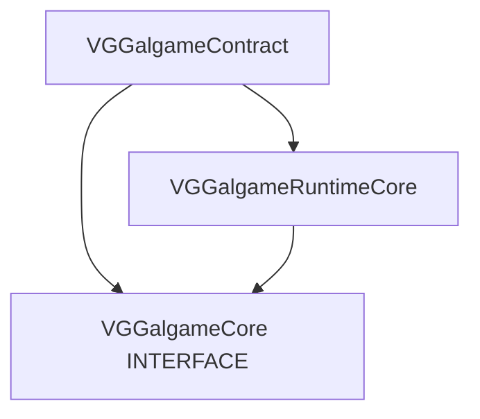

# VGGalgameCore — Phase 8 聚合目标（INTERFACE）

## 1. 定位

| 项目 | 说明 |
|------|------|
| **职责** | **不再包含任何 `.cpp` 实现**；CMake 目标 `VGGalgameCore` 为 **`INTERFACE` 库**，聚合链接 **`VGGalgameContract`**（纯 ABI 头）与 **`VGGalgameRuntimeCore`**（`SHARED`，运行时状态 / 存档 / 工厂实现），并暴露 **`#include "VGGalgameCore/..."`** 薄转发头目录，保证存量 `target_link_libraries(... VGGalgameCore)` 与历史包含路径不变。 |
| **典型消费方** | `VGGalgame`、`VGGalgameSequenceRuntime`、`VGGalgameLuaRuntime`、`VGGalgamePresentation`、`VGGalgameNodeGraph` 等凡链接 `VGGalgameCore` 的目标。 |
| **不负责** | 具体引擎装配、Rml UI、Lua/Sequence 执行器体、节点图执行体 — 见各业务模块。 |

---

## 2. CMake

| 项目 | 说明 |
|------|------|
| **目标类型** | `add_library(VGGalgameCore INTERFACE)` |
| **链接** | `INTERFACE` → `VGGalgameContract`、`VGGalgameRuntimeCore` |
| **包含目录** | `INTERFACE`：`${CMAKE_CURRENT_SOURCE_DIR}`、`Engine/Source/Runtime`、`Engine/Source/RuntimeGalgame`（见 [CMakeLists.txt](../CMakeLists.txt)） |
| **DLL** | 本目标无独立二进制；进程加载的 **`VGGalgameCore.dll`** 来自 **`VGGalgameRuntimeCore`**（`OUTPUT_NAME VGGalgameCore`）。 |

---

## 3. 依赖关系



**阅读顺序建议**：先 [VGGalgameContract 文档](../VGGalgameContract/Docs/MODULE_ARCHITECTURE_AND_PROGRESS.md) 再 [VGGalgameRuntimeCore 文档](../VGGalgameRuntimeCore/Docs/MODULE_ARCHITECTURE_AND_PROGRESS.md)。

---

## 4. 目录结构（本仓库物理目录）

```
VGGalgameCore/
├── CMakeLists.txt              # INTERFACE 聚合定义
├── VGGalCoreConfig.h           # 转发 / 与 Contract 对齐的导出宏习惯入口
├── Interface/                  # 薄转发：多数为 #include "VGGalgameContract/Interface/..."
├── Include/                    # 薄转发：多数指向 RuntimeCore 或 Contract 下 canonical 头
├── Docs/
│   └── MODULE_ARCHITECTURE_AND_PROGRESS.md   # 本文件
```

**约定**：

- **契约与 ABI 形状**以 **`VGGalgameContract/Interface/*.h`** 为 **canonical**；本目录下同路径 shim 若仅为单行 `#include`，**API 文档不重复撰写**，见 Contract 文档对应节。
- **具体类型与实现**以 **`VGGalgameRuntimeCore`** 下头文件 / 源文件为准；本目录 `Include/` 中同名转发头仅用于兼容 `#include "VGGalgameCore/..."`。

---

## 5. 使用说明

### 5.1 CMake 侧

```cmake
target_link_libraries(YourTarget PUBLIC VGGalgameCore)
```

等价于同时获得 **Contract** 与 **RuntimeCore** 的传递依赖与包含路径。

### 5.2 包含风格

| 风格 | 示例 | 说明 |
|------|------|------|
| 推荐（契约） | `#include "VGGalgameContract/Interface/IGameEngine.h"` | 新代码、跨 DLL 边界明确依赖 Contract。 |
| 兼容（聚合） | `#include "VGGalgameCore/Interface/IGameEngine.h"` | 与历史代码一致；解析到 shim → Contract。 |
| 实现体 | `#include "VGGalgameRuntimeCore/Include/GalGameContext.h"` 或通过 Core shim | 仅当需要具体类型定义时。 |

---

## 6. 维护脚本（引擎根脚本）

| 脚本 | 作用 |
|------|------|
| [Engine/Scripts/gen_vggalgame_core_shims.ps1](../../../Scripts/gen_vggalgame_core_shims.ps1) | 重新生成 `VGGalgameCore/` 下薄转发头（Interface / Include）。 |
| [Engine/Scripts/check_vggalgame_core_includes.ps1](../../../Scripts/check_vggalgame_core_includes.ps1) | 校验 Core 转发目录未错误引入 NodeGraph / Sequence / Editor 等重型路径。 |

修改 Contract 或 RuntimeCore 的公开路径后，应同步跑脚本与文档。

---

## 7. 开发进展

| 日期 | 说明 |
|------|------|
| 2026-05-13 | Phase 8.1：`VGGalgameCore` 收缩为 **INTERFACE 聚合**；实现迁至 **RuntimeCore**；契约迁至 **Contract**。 |
| 2026-05-13 | 本文档补全：说明聚合职责、依赖图、包含约定与维护脚本。 |

---

## 8. API 文档入口

| 内容 | 文档 |
|------|------|
| 纯虚接口、窄数据类型 | [VGGalgameContract/Docs/MODULE_ARCHITECTURE_AND_PROGRESS.md](../VGGalgameContract/Docs/MODULE_ARCHITECTURE_AND_PROGRESS.md) |
| `GalGameContext`、`SaveArchive`、`GalGameScriptExecutorFactory`、`IGameSystem` 具体定义等 | [VGGalgameRuntimeCore/Docs/MODULE_ARCHITECTURE_AND_PROGRESS.md](../VGGalgameRuntimeCore/Docs/MODULE_ARCHITECTURE_AND_PROGRESS.md) |

本模块 **不提供**独立 API 表；避免与 Contract / RuntimeCore 重复维护。
