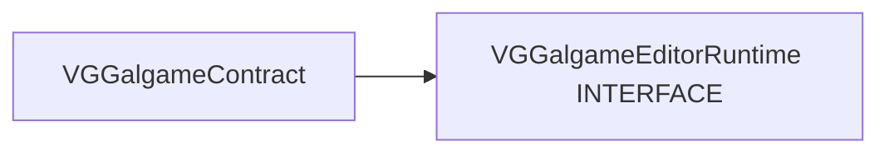

# VGGalgameEditorRuntime — 编辑器与 Gal 运行时隔离（Phase 8.7）

## 1. 定位

| 项目 | 说明 |
|------|------|
| **职责** | 为编辑器模块提供 **仅依赖 `VGGalgameContract`** 的薄桥接头，减少对 **`VGGalgame`** 实现头的直接 **`#include`**。 |
| **CMake** | **`INTERFACE`**；**`PUBLIC`** 链接 **`VGGalgameContract`**；暴露本模块目录与 `Engine/Source/Runtime` 根。 |
| **不负责** | Play Mode 具体装配（仍在 **`VGGalgame`** / **`GalGameSystem`**）；调试器本体（**`IRuntimeDebugBridge`** 占位在 Contract）。 |

---

## 2. 目录结构

```
VGGalgameEditorRuntime/
├── CMakeLists.txt
├── Interface/
│   └── IEditorGalgameRuntimeBridge.h
└── Docs/
    └── MODULE_ARCHITECTURE_AND_PROGRESS.md
```

---

## 3. 依赖关系



---

## 4. 使用说明

1. 在 **`VGEditorGalgame`**（或等价编辑器模块）中：  
   `target_link_libraries(... PUBLIC VGGalgameEditorRuntime)`  
   仅获得 **Contract** 子集 + **`IEditorGalgameRuntimeBridge`** 声明。
2. **具体桥接实现**由宿主或编辑器插件在运行时注册（演进中）；未注册时 **`TryGet*`** 返回 **nullptr**。
3. 新编辑器功能应优先经 **`IGalRuntimeSession`** / **`ILuaRuntimeBridge`**（Contract）访问，避免恢复使用 **`GalGameEngineAccess`** 穿透。

---

## 5. API 参考 — `IEditorGalgameRuntimeBridge`

| 方法 | 说明 |
|------|------|
| **`TryGetActivePlaySession()`** | 返回当前 Play/Preview 下的 **`IGalRuntimeSession*`**；无则 **nullptr**。 |
| **`TryGetLuaBridge()`** | 返回 **`ILuaRuntimeBridge*`**；无则 **nullptr**。 |

头文件路径：`Interface/IEditorGalgameRuntimeBridge.h`（包含风格见 [CMakeLists.txt](../CMakeLists.txt)，通常为 **`VGGalgameEditorRuntime/Interface/...`**）。

---

## 6. 开发进展

| 日期 | 说明 |
|------|------|
| 2026-05-13 | Phase 8.7：首版 **`IEditorGalgameRuntimeBridge`** 骨架。 |
| 2026-05-13 | 文档扩充：定位、目录、依赖、API、集成说明。 |

---

## 7. 相关文档

- [VGGalgameContract/Docs/MODULE_ARCHITECTURE_AND_PROGRESS.md](../../VGGalgameContract/Docs/MODULE_ARCHITECTURE_AND_PROGRESS.md)
- [GALGAME_MODULE_ARCHITECTURE_AND_PROGRESS.md](../../GALGAME_MODULE_ARCHITECTURE_AND_PROGRESS.md)
