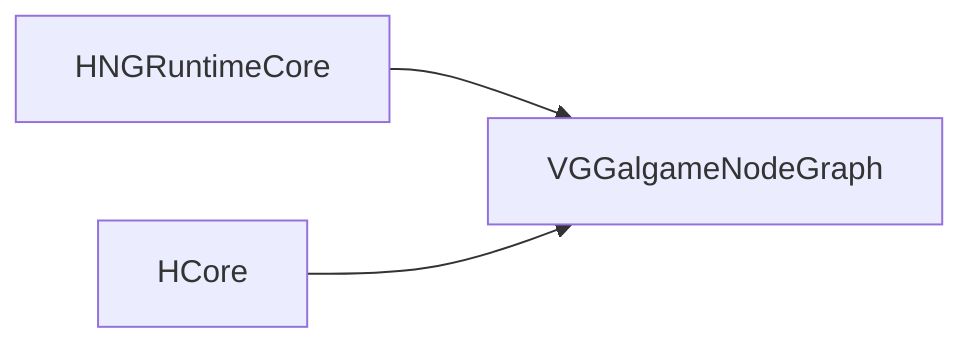

# VGGalgameNodeGraph — 节点图运行时与 DialogueList 数据

## 1. 定位

| 项目 | 说明 |
|------|------|
| **职责** | **DialogueList** 等节点用的 **共享数据模型**（JSON 序列化）；与 **HNGRuntimeCore** 签名一致的 **`NodeExecuteFn`** 实现（`EntryExecute`、`DialogueListExecute`、`ChoiceExecute`、立绘/BGM/背景等）；**不依赖编辑器 UI**。 |
| **CMake** | `SHARED`；**`VG_GALGAME_NODEGRAPH_API`**；**`PUBLIC HNGRuntimeCore`**、**`PUBLIC HCore`**。 |
| **典型消费方** | **`VGGalgame`**（`PUBLIC` 链接，保证进程加载本 DLL）；**`VGEditorGalgame`**（节点注册与对白面板引用本模块类型）。 |

---

## 2. 目录结构

```
VGGalgameNodeGraph/
├── CMakeLists.txt
├── VGGalgameNodeGraphConfig.h
├── Include/
│   ├── DialogueListNodeData.h    # DialogueLine / DialogueListNode + JSON
│   └── VGNodeExec_Galgame.h      # Vars、PIN_LinesJson、各 Execute 入口
├── Source/
│   └── VGNodeExec_Galgame.cpp
└── Docs/
    └── MODULE_ARCHITECTURE_AND_PROGRESS.md
```

---

## 3. 依赖关系



---

## 4. 使用说明

1. **运行时**：由链接 **`VGGalgame`** 的宿主加载；节点图 VM 调用已注册的 **`NodeExecuteFn`**。
2. **变量约定**：执行函数通过 **`RuntimeContext.variables`** 写入 **`VisionGal::Runtime::Vars`** 中声明的键（如 **`CurrentSpeaker`**、**`CurrentText`**），供预览或游戏层读取。
3. **DialogueList JSON**：图资产槽位 **`PIN_LinesJson`** 存放整表 JSON 字符串；运行时在 **`DialogueListExecute`** 中反序列化为 **`DialogueListNode`**（见头文件注释）。

---

## 5. API 参考

### 5.1 `Include/VGNodeExec_Galgame.h`（命名空间 `VisionGal::Runtime`）

| 符号 | 说明 |
|------|------|
| **`Vars::CurrentSpeaker` / `CurrentText` / `CurrentCharacterId` / `CurrentExpression` / `CurrentAudioClip`** | `extern const char*` 变量名常量。 |
| **`PIN_LinesJson`** | DialogueList 节点 JSON 槽名。 |
| **`EntryExecute` / `DialogueListExecute` / `ChoiceExecute`** | `Horizon::NodeGraphRuntime::ExecResult(...)`。 |
| **`ShowCharacterExecute` / `PlayBGMExecute` / `SetBackgroundExecute`** | 同上，立绘/音频/背景节点入口。 |

### 5.2 `Include/DialogueListNodeData.h`

| 类型 | 说明 |
|------|------|
| **`DialogueAnimation`** | `FadeIn` / `Move` / `Shake`。 |
| **`DialoguePresentation`** | 位置、动效、时长等。 |
| **`DialogueLine`** | `speakerId`、`text`、`characterId`、`expression`、`audioClip`、`presentation`、`events`。 |
| **`DialogueListNode`** | **`std::vector<DialogueLine> lines`**。 |
| **`SerializeDialoguePresentation` / `DeserializeDialoguePresentation`** | JSON 辅助。 |
| **`SerializeDialogueLine` / `DeserializeDialogueLine`** | 单行 JSON。 |
| **`SerializeDialogueListNode` / `DeserializeDialogueListNode`** | 整表 JSON。 |
| **`SerializeDialogueListNodeToString` / `DeserializeDialogueListNodeFromString`** | 与图槽位字符串互转。 |

完整函数列表以头文件为准。

---

## 6. 开发进展

| 日期 | 说明 |
|------|------|
| 2026-05-13 | 自 **`VGGalgameRuntime`** 拆出独立 **`VGGalgameNodeGraph`**。 |
| 2026-05-13 | 文档扩充：目录、依赖、API 表、变量约定。 |

---

## 7. 相关文档

- [VGGalgame/Docs/MODULE_ARCHITECTURE_AND_PROGRESS.md](../../VGGalgame/Docs/MODULE_ARCHITECTURE_AND_PROGRESS.md)
- [GALGAME_MODULE_ARCHITECTURE_AND_PROGRESS.md](../../GALGAME_MODULE_ARCHITECTURE_AND_PROGRESS.md)
