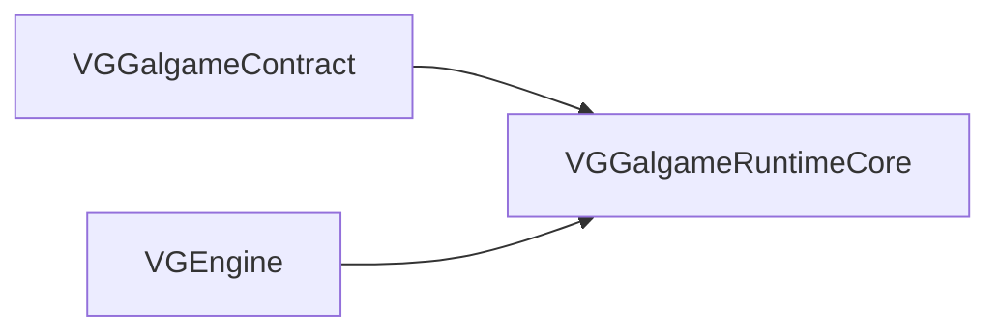
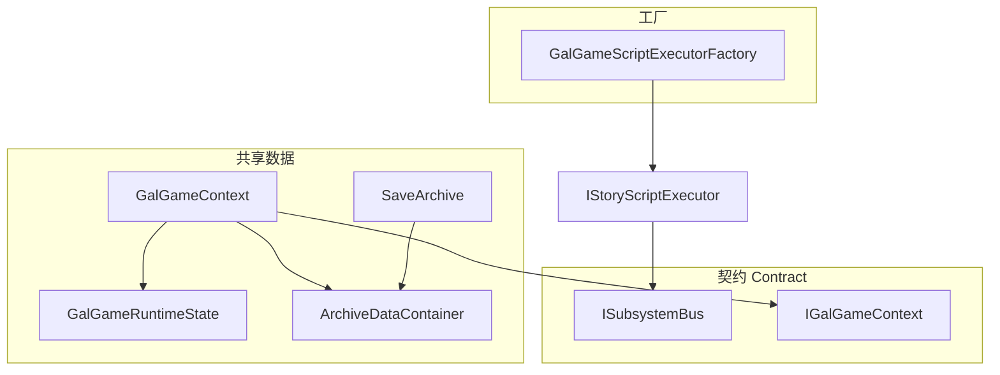

# VGGalgameRuntimeCore — 运行时状态、存档、上下文与工厂（SHARED）

## 1. 定位

| 项目 | 说明 |
|------|------|
| **职责** | Phase 8 起承接原 **`VGGalgameCore`** 中 **非纯 ABI** 部分：共享数据模型（**`GalGameContext`**、**`GalGameRuntimeState`**）、**`SaveArchive`** / **`ArchiveDataContainer`**、**`GalGameScriptExecutorFactory`**、**`IGameSystem.h`**（`IArchiveSystem`、`IDialogueSystem`、分层场景与 UI 系统接口族）、**`IGameObject.h`**（`IGalSprite` 等资源接口）、**`GalGameEngineAccess`**、**`GalGameLayoutUtils`**、**`GalGameEngineComponent`** 与序列化器、**`ISerializableRuntimeState`** 等。 |
| **不负责** | 纯虚门面 **`IGalGameEngine`**、**`ISubsystemBus`** 及各 `I*Subsystem` 的 **Contract 定义** — 见 [VGGalgameContract](../VGGalgameContract/Docs/MODULE_ARCHITECTURE_AND_PROGRESS.md)；宿主装配、对白 Rml 拆分实现 — 见 **`VGGalgame`**。 |
| **CMake 目标名** | **`VGGalgameRuntimeCore`**（`SHARED`） |
| **DLL 输出名** | **`VGGalgameCore.dll`**（`set_target_properties(... OUTPUT_NAME VGGalgameCore)`），与历史部署路径兼容。 |

---

## 2. CMake 与依赖

| 项目 | 说明 |
|------|------|
| **编译定义** | `PRIVATE VG_GALGAME_CORE_EXPORT` → **`VG_GALGAME_CORE_API`**（定义见 [VGGalCoreConfig.h](../VGGalgameContract/VGGalCoreConfig.h)） |
| **链接** | `PUBLIC VGGalgameContract`、`PUBLIC VGEngine` |
| **包含** | `PUBLIC`：`Engine/Source/Runtime`、`Engine/Source/RuntimeGalgame`、`Engine/Source/Runtime/VGLua/Include`、`Interface/`、`Include/` |
| **源收集** | `CMakeLists.txt` 使用 `GLOB`：`Interface/*.h`、`Include/*.h`、`Source/**/*.cpp`（见仓库内 CMake） |

---

## 3. 依赖关系



消费方通常 **`target_link_libraries(... VGGalgameCore)`**（INTERFACE 聚合），等价链接本库 + Contract。

---

## 4. 目录结构（与仓库一致）

```
VGGalgameRuntimeCore/
├── CMakeLists.txt
├── Interface/
│   ├── IGameObject.h          # SpriteDesc、IGalGameResource、IGalSprite/Audio/Video/Character
│   ├── IGameSystem.h          # IArchiveSystem、IDialogueSystem、场景层/管理器、ILayeredSceneManager、IGalGameUISystem
│   └── IStoryScript.h         # GalGameScriptExecutorFactory（剧情执行器注册表）
├── Include/
│   ├── ArchiveDataContainer.h
│   ├── Components.h           # GalGameEngineComponent、GalGameEngineComponentSerializer
│   ├── GalExecutionLifecycle.h
│   ├── GalGameContext.h
│   ├── GalGameContextSnapshot.h
│   ├── GalGameEngineAccess.h
│   ├── GalGameEvent.h
│   ├── GalGameLayoutUtils.h
│   ├── GalGameRuntimeState.h
│   ├── ISerializableRuntimeState.h
│   ├── SaveArchive.h
│   ├── SubsystemBusGuard.h
│   ├── VGGalgameCore_Deprecated.h
│   └── ...
├── Source/
│   ├── ArchiveDataContainer.cpp
│   ├── Components.cpp
│   ├── GalGameContextSnapshot.cpp
│   ├── GalGameEngineAccess.cpp
│   ├── GalGameLayoutUtils.cpp
│   ├── IStoryScript.cpp
│   ├── SaveArchive.cpp
│   └── ...
└── Docs/
    └── MODULE_ARCHITECTURE_AND_PROGRESS.md
```

---

## 5. 架构与数据流



- **`GalGameContext`**：实现 **`IGalGameContext`**；持有 **`GalEngineEventBus`**、**`GalGameUIEventBus`**、**`GalGameRuntimeState`**、**`Ref<ArchiveDataContainer>`**；**不再持有 `IGalGameEngine*`**（Phase 8）。
- **`SaveArchive`**：槽位元数据 + **`archiveData`** + 截图像素等；**`ReadFromJson` / `WriteToJson`**；**`kSaveArchiveSchemaVersion`**。
- **`GalGameScriptExecutorFactory`**：按资产类型注册 **`IStoryScriptExecutorCreator`**，**`LoadAssetExecutor(type, path)`** 供剧情系统加载 Lua / Sequence 等执行器。

---

## 6. 使用说明

1. **链接**：优先通过 **`VGGalgameCore`** INTERFACE 目标链接，避免直接依赖路径漂移。
2. **构造上下文**：使用 **`GalGameContext::Create(ISubsystemBus* bus = nullptr)`** 创建 **`Ref<GalGameContext>`**（推荐入口）。
3. **执行器注册**：在进程启动阶段由 **`VGGalgameLuaRuntime`** / **`VGGalgame`** 挂载代码调用 **`GalGameScriptExecutorFactory::Get().RegisterAssetExecutor(...)`**（详见各模块文档）。
4. **存档**：通过 **`IArchiveSystem`**（宿主 **`ArchiveSystem`** 实现）与 **`SaveArchive`** 协作；长期可扩展 **`ISerializableRuntimeState`** 子域序列化。

---

## 7. 开发进展

| 子项 | 状态 | 说明 |
|------|------|------|
| Contract / RuntimeCore 拆分 | 已落地 | 本模块为 SHARED 实现侧。 |
| `GalGameContext` 去引擎指针 | 已落地 | 引擎经会话 / 总线注入。 |
| `ISerializableRuntimeState` | 骨架 | 接口已定义；与 SaveArchive 分层聚合待演进。 |
| SaveArchive schema | 演进中 | 与 Lua/Choice 校验字段联动时需升版本并更新文档。 |

---

## 8. API 参考（按头文件）

### 8.1 `Interface/IGameObject.h`

| 类型 | 说明 |
|------|------|
| **`SpriteDesc`** | 精灵路径、图层、透明度、偏移、旋转、缩放等描述。 |
| **`IGalGameResource`** | `GetResourcePath`、`GetResourceActor`、`GetResourceLayer` / `SetResourceLayer`。 |
| **`IGalSprite`** | `Show`、`With`、**`Animate(sol::table,...)`**、位置/缩放/对齐、`GetTransformComponent`、`Cut` 等链式 API。 |
| **`IGalAudio`** | `SetLoop`、`Stop`、`IsPlayingAudio`、`SetVolume`/`GetVolume`、`With`。 |
| **`IGalVideo`** | `SetLoop`、`Stop`、`IsPlaying`、`SetVolume`/`GetVolume`。 |
| **`IGalCharacter`** | `GetName`/`SetName`、`Say`、`Voice`、`AddFigure`、`ShowFigure`/`HideFigure`、立绘/语音回调（`sol::function`）。 |

### 8.2 `Interface/IGameSystem.h`（节选）

| 接口 | 主要职责 |
|------|-----------|
| **`IArchiveSystem`** | `SaveArchiveByNumber`、`GetArchiveByNumber`、`HasArchiveByNumber`。 |
| **`IDialogueSystem`** | 角色发言、打字机、继续对白、对白列表遍历、自动/快进、语音状态、**`JumpToDialog`**、**`Reset`/`Clear`/`Update`** 等。 |
| **`ISceneSpriteLayer` / `ISceneAudioLayer` / `ISceneVideoLayer`** | 单层资源集合与音量/播放控制。 |
| **`ISceneSpriteManager` / `ISceneAudioManager` / `ISceneVideoManager`** | 遍历、按层清理、添加/移除、图层管理。 |
| **`ILayeredSceneManager`** | 角色列表、**`TraverseScene`**、子管理器访问、**`OnUpdate`**。 |
| **`IGalGameUISystem`** | 选择支 UI、全屏文本、输入 UI 状态与交互。 |

完整虚函数表以头文件为准（**CORE ABI STABLE** 区段勿随意改签名）。

### 8.3 `Interface/IStoryScript.h`

| API | 说明 |
|-----|------|
| **`GalGameScriptExecutorFactory::Get()`** | 进程内单例。 |
| **`RegisterAssetExecutor(const String& type, Ref<IStoryScriptExecutorCreator>)`** | 注册资产类型 → 创建器。 |
| **`LoadAssetExecutor(const String& type, const String& path)`** | 按类型与路径构造 **`Ref<IStoryScriptExecutor>`**。 |
| **`GetRegisterTypes()`** / **`HasExecutor(const String& type)`** |  introspection。 |

### 8.4 `Include/GalGameContext.h`

| 成员 / 方法 | 说明 |
|-------------|------|
| **`engineEventBus` / `uiEventBus`** | 运行时事件（见 `GalGameEvent.h`）。 |
| **`runtimeState`** | **`GalGameRuntimeState`**：脚本路径、对白行号、截图、模式位等。 |
| **`archiveData`** | **`Ref<ArchiveDataContainer>`**。 |
| **`static Ref<GalGameContext> Create(ISubsystemBus* bus)`** | 推荐构造入口。 |

### 8.5 `Include/SaveArchive.h`

| 字段 / 方法 | 说明 |
|-------------|------|
| **`kSaveArchiveSchemaVersion`** | 顶层 JSON schema 整数版本。 |
| **`WriteToJson` / `ReadFromJson`** | 与 nlohmann::json 互转。 |
| **`ValidateArchiveSchema`** | 反序列化前校验；失败则 **`isValid = false`**。 |

### 8.6 `Include/ArchiveDataContainer.h`

| API | 说明 |
|-----|------|
| **`schemaVersion` / `schemaHash`** | 容器格式版本与校验预留。 |
| **`GetChoicesNamespace` / `GetInputNamespace`** | **`__Choices__` / `__Inputs__`** 命名空间访问。 |
| **`InitializeLuaBinding`** | Lua 表绑定初始化。 |

### 8.7 `Include/Components.h`

| 类型 | 说明 |
|------|------|
| **`GalGameEngineComponent`** | `scriptPath`、`choiceUIPath`、`fullScreenTextUIPath`、`inputUIPath`；Cereal `save`/`load`。 |
| **`GalGameEngineComponentSerializer`** | 场景序列化段注册用。 |

### 8.8 `Include/GalGameEngineAccess.h`

| API | 说明 |
|-----|------|
| **`Current()`** | `thread_local` 当前 **`IGalGameEngine*`**。 |
| **`SetCurrent(IGalGameEngine*)`** | 由 **`GalGameEngine::Initialize`** 注入。 |

### 8.9 `Include/GalGameLayoutUtils.h`

| API | 说明 |
|-----|------|
| **`SetDesignSize` / `GetDesignSize`** | 设计分辨率。 |
| **`GetSpriteXOffset` / `GetSpriteYOffset`** | 精灵对齐偏移。 |

### 8.10 `Include/GalGameContextSnapshot.h`

| API | 说明 |
|-----|------|
| **`Capture(const GalGameContext&)`** | 浅拷贝运行时切片。 |
| **`Apply(GalGameContext&)`** | 写回目标上下文。 |

### 8.11 `Include/ISerializableRuntimeState.h` / **`GalGameRuntimeStateSerializable`**

| 方法 | 说明 |
|------|------|
| **`ISerializableRuntimeState::SaveToJson` / `LoadFromJson`** | 子域可序列化状态契约。 |
| **`GalGameRuntimeStateSerializable`**（`Include/GalGameRuntimeStateSerializable.h`） | **`GalGameRuntimeState`** 与 JSON 的桥接；**`GalRuntimeCoordinator::SaveRuntimeState`** 使用。 |

### 8.12 其它头文件

| 头文件 | 说明 |
|--------|------|
| **`GalGameRuntimeState.h`** | 对白索引、截图路径/像素、打字延迟、自动/快进位等字段（见源码）。 |
| **`GalGameEvent.h`** | **`GalEngineEventBus`**（含 **`OnRuntimeLifecycleEvent`**）、**`GalGameUIEventBus`** 与载荷。 |
| **`GalGameRuntimeStateSerializable.h`** | **`GalGameRuntimeState`** ↔ JSON（**`ISerializableRuntimeState`**）；供宿主内存快照。 |
| **`GalExecutionLifecycle.h`** | 执行生命周期辅助类型（见源码）。 |
| **`SubsystemBusGuard.h`** | RAII 或迁移期守卫（见源码）。 |
| **`VGGalgameCore_Deprecated.h`** | 弃用宏（MSVC / GCC-Clang）。 |

---

## 9. 修订记录

| 日期 | 说明 |
|------|------|
| 2026-05-13 | **Phase 8D**：新增 **`GalGameRuntimeStateSerializable`**；**`GalGameEvent`** 增加 **`OnRuntimeLifecycleEvent`** 说明。 |
| 2026-05-13 | 文档整体重写：纠正旧版「VGGalgameCore SHARED」表述；对齐 **RuntimeCore** 目标名、**DLL OUTPUT_NAME**、目录与 API 表。 |
| 2026-05-13 | Phase 8.1：自原 Core 拆出 **Contract**；本模块为运行时实现库。 |
