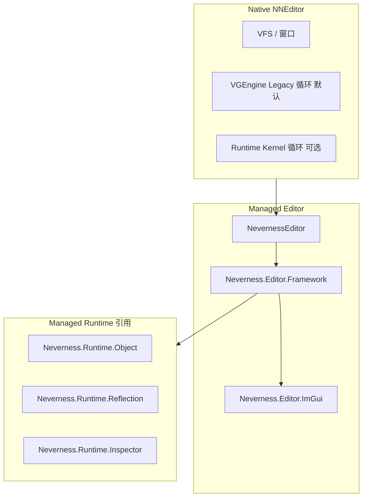

# Neverness Managed Editor — 架构与总进度

本文档描述 **Neverness 编辑器** 托管侧架构。编辑器与 **Runtime** 并列，同属 `Engine/Source/Managed`，但职责为 **工具链与 UI**，不替代 Runtime Kernel。

上级文档：[MANAGED_ARCHITECTURE_AND_PROGRESS.md](../MANAGED_ARCHITECTURE_AND_PROGRESS.md)

---

## 1. 定位

| 项目 | 说明 |
|------|------|
| **职责** | 编辑器 UI 壳层、面板、命令系统、选区、未来 Dock/Asset/Scene 工具 |
| **不负责** | CoreCLR 启动、Native Kernel、Gameplay 运行时主循环（属 Runtime） |
| **与 Runtime 关系** | 引用 Runtime 地基模块（如 `Neverness.Runtime.Object`）；**不**以 `Neverness.Runtime.Host` 为编辑器入口 |

---

## 2. 程序集结构

```
Engine/Source/Managed/Editor/
├── MANAGED_EDITOR_ARCHITECTURE_AND_PROGRESS.md   ← 本文件
├── NervernessEditor/                              ← 编辑器 Exe（NevernessEditor）
├── Neverness.Editor.Framework/                    ← 壳层与面板
└── ThirdParty/
    ├── Neverness.Editor.ImGui/
    ├── Neverness.Editor.ImGuiNodeEditor/
    └── Neverness.Editor.ImGuizmo/
```

| 程序集 | 输出 | 说明 |
|--------|------|------|
| `NevernessEditor` | Exe | 托管编辑器入口；与 Native `NNEditor` 协同（当前 Native 仍可走 Legacy `VGEngine`） |
| `Neverness.Editor.Framework` | Library | **EditorShell**、**DockingLayout**、**EditorPanel**、**CommandRegistry**、**SelectionService** |
| `Neverness.Editor.ImGui` | Library | ImGui 生成绑定（ThirdParty） |

---

## 3. 分层



---

## 4. 模块文档

| 模块 | 文档 |
|------|------|
| **Neverness.Editor.Framework** | [Neverness.Editor.Framework/Docs/MODULE_ARCHITECTURE_AND_PROGRESS.md](Neverness.Editor.Framework/Docs/MODULE_ARCHITECTURE_AND_PROGRESS.md) |

ThirdParty 绑定模块无独立架构文档；见各目录 `README.md`。

---

## 5. 路线图（P1）

| 代号 | 方向 | 状态 |
|------|------|------|
| **E-1** | Framework 壳层巩固（Dock、Panel、Command） | **进行中** |
| **E-2** | Inspector / Graph Editor 与 Runtime.Reflection、Graph 对接 | **未开始** |
| **E-3** | Asset Browser、Scene Editor | **未开始** |
| **E-4** | 编辑器切 **Runtime Kernel** 路径（`NEVERNESS_USE_RUNTIME_KERNEL`） | **未开始** |

---

## 6. 变更记录

| 日期 | 说明 |
|------|------|
| **2026-05-19** | 初版：Neverness 品牌、Editor 分支总文档；与 Runtime 主路径解耦说明。 |
