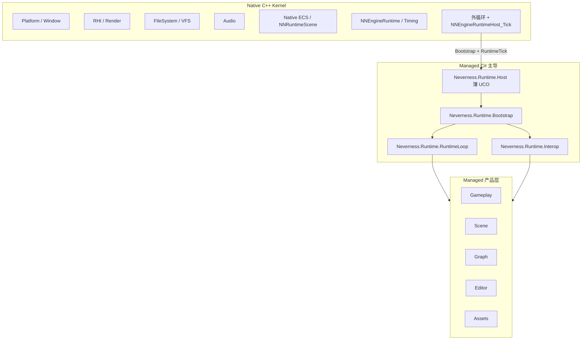

# Neverness Managed — 架构与总进度

本文档描述 **Neverness** 引擎 **托管（C#）侧** 的总体架构。实现细节以子树文档为准：

| 子树 | 文档 |
|------|------|
| **Runtime（产品运行时）** | [Runtime/MANAGED_RUNTIME_ARCHITECTURE_AND_PROGRESS.md](Runtime/MANAGED_RUNTIME_ARCHITECTURE_AND_PROGRESS.md) |
| **Editor（编辑器工具链）** | [Editor/MANAGED_EDITOR_ARCHITECTURE_AND_PROGRESS.md](Editor/MANAGED_EDITOR_ARCHITECTURE_AND_PROGRESS.md) |
| **Native Kernel（C++）** | [Runtime/RUNTIME_ARCHITECTURE_AND_PROGRESS.md](../Runtime/RUNTIME_ARCHITECTURE_AND_PROGRESS.md) |

---

## 1. 核心原则（2026）

| 原则 | 说明 |
|------|------|
| **C# 主导 Runtime** | 启动、主循环编排、Interop 安装、Gameplay / Graph / Editor 产品逻辑均在 **Managed** 完成。 |
| **C++ 仅 Kernel** | Native 负责 RHI、Platform、Window、FileSystem、Audio、Native ECS 存储、帧计时与 **外循环**；**不**承担 Galgame 产品逻辑。 |
| **不用 Host 作主路径** | 不以 CoreCLR 独立宿主（Legacy `NNRuntimeManagedHostLegacy`）作为架构中心；产品进程内嵌 CLR，经 **`Entry.Bootstrap` / `Entry.RuntimeTick`** 与 Native 协作。 |
| **函数表 Interop** | Managed 经 **`NNNativeAPI` / `NNNativeEngineAPI`** 间接调用 Native；禁止散落 `DllImport` 调引擎。 |
| **Legacy 分界** | `VISIONGAL_BUILD_LEGACY_GALGAME`、Lua Runtime、旧 `VGEngine` 产品循环仅作兼容；新能力不进入 Legacy 路径。 |

---

## 2. 职责分界



| 层 | Native（C++） | Managed（C#） |
|----|---------------|---------------|
| **Kernel** | RHI、Platform、Window、FileSystem、Audio、Native ECS、外循环、ABI 表导出 | Bootstrap、Interop、RuntimeLoop、帧内子系统调度 |
| **Foundation** | Object 控制代码、Asset IO Stub/Runtime | Core/Engine 镜像、Object、Reflection、Serialization、Assets |
| **产品** | — | Gameplay、Scene 逻辑、Graph、Editor UI、Inspector |

---

## 3. 程序集地图（`Engine/Source/Managed`）

### 3.1 Runtime（`Neverness.Runtime.*`）

| 程序集 | 命名空间 | 职责 |
|--------|----------|------|
| `Neverness.Runtime.Host` | `Neverness.Managed.Runtime` | **仅 UCO 导出**（`Bootstrap` / `GetApiVersion` / `RuntimeTick`），非架构 Host |
| `Neverness.Runtime.Bootstrap` | `Neverness.Managed.Bootstrap` | 启动门面、初始化顺序、主循环 Tick |
| `Neverness.Runtime.Interop` | `Neverness.Managed.Interop` | Native API 表安装、Handle 桥接 |
| `Neverness.Runtime.RuntimeLoop` | `Neverness.Managed.RuntimeLoop` | 托管 Kernel 帧管线 |
| `Neverness.Runtime.Core` | `Neverness.Managed.Core` | `NNNativeAPI` 镜像 |
| `Neverness.Runtime.Engine` | `Neverness.Managed.Engine` | `NNNativeEngineAPI` 镜像 |
| `Neverness.Runtime.*`（其余） | 各子命名空间 | Object、Scene、Gameplay、Entity 等产品与地基模块 |

完整模块索引见 [Runtime 总文档 §4](Runtime/MANAGED_RUNTIME_ARCHITECTURE_AND_PROGRESS.md)。

### 3.2 Editor（`Neverness.Editor.*`）

| 程序集 | 职责 |
|--------|------|
| `NevernessEditor` | 编辑器可执行入口（`NervernessEditor` 目录） |
| `Neverness.Editor.Framework` | 编辑器壳层：Dock、Panel、Command、Selection |
| `Neverness.Editor.ImGui` 等 | 第三方 ImGui 绑定（ThirdParty） |

见 [Editor 总文档](Editor/MANAGED_EDITOR_ARCHITECTURE_AND_PROGRESS.md)。

---

## 4. 与 Native 的协作模型

1. **进程启动**：Native 初始化 Platform / VFS / `NNEngineRuntimeHost_Initialize`。
2. **Bootstrap**：Native 调用 `Entry.Bootstrap(NNNativeApi_GetDefaultTable())` → `RuntimeBootstrap.Start`（非阻塞）。
3. **每帧**：`NNEngineRuntimeHost_Tick(dt)`（Native Kernel）→ `Entry.RuntimeTick(dt)`（Managed Kernel）。
4. **Bridge**：`NNRuntimeManagedBridge` 持有托管 Tick 回调；**不**依赖 Legacy CoreCLR 宿主。

可选 **Legacy**：`VISIONGAL_ENABLE_MANAGED_HOST_LEGACY=ON` 时构建 `NNRuntimeManagedHostLegacy`，仅用于冒烟与回归，**非**主路径。

---

## 5. 构建与测试

```powershell
# 托管单元测试（推荐日常验证）
dotnet test Engine\Source\Managed\Runtime\Tests\NevernessRuntimeManaged-Foundation.Tests.csproj -c Debug

# 刷新解决方案项目列表
python Engine\Scripts\slnx_generator.py
```

Native 侧见 [RUNTIME_ARCHITECTURE_AND_PROGRESS.md](../Runtime/RUNTIME_ARCHITECTURE_AND_PROGRESS.md)。

---

## 6. 路线图索引

| 阶段 | 内容 | 文档 |
|------|------|------|
| **M-1～M-6** | Runtime 主导权迁移（已完成） | Runtime §0.6 |
| **P0** | Kernel 化：Scheduler、Entity、Scene Runtime | Runtime §0.3 |
| **P1** | Editor 产品化、Graph.Runtime、Asset Pipeline | Editor 总文档 |
| **P2** | GameFramework、Hot Reload、Roslyn | Runtime §0.4 |

---

## 7. 变更记录

| 日期 | 说明 |
|------|------|
| **2026-05-19** | 品牌统一为 **Neverness**；明确 **C# 主导 / C++ Kernel**；弃用 Host 主路径叙事；新增本总文档与 Editor 分支文档。 |
