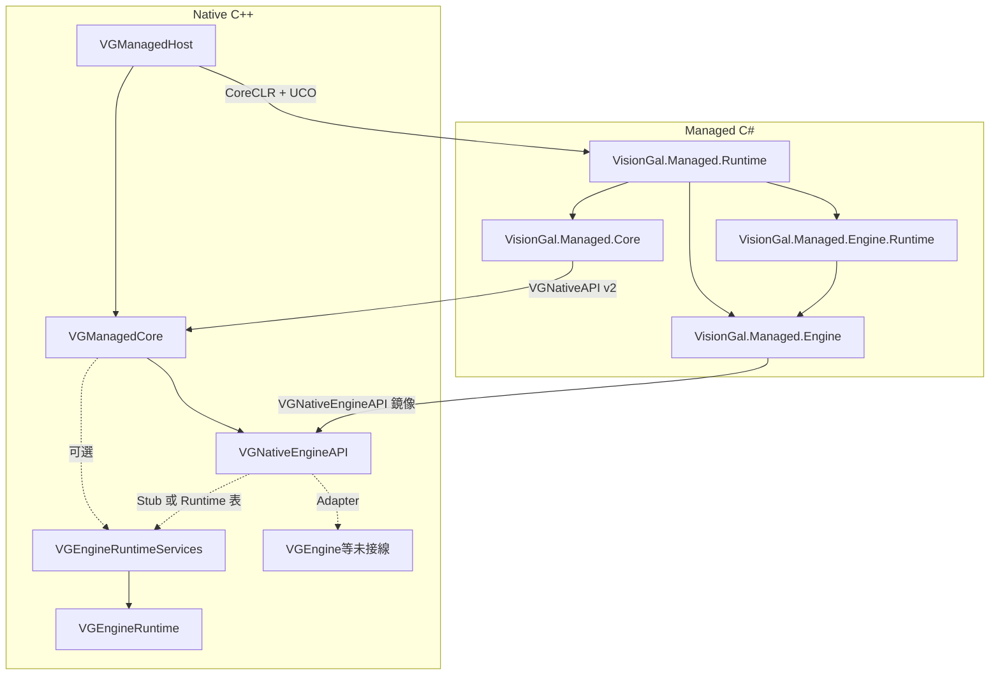

# VisionGal Managed Runtime — 架構與總進度

本文檔描述 **Managed Runtime** 分層、當前完成度與後續規劃。實作細節以各子模組 `Docs/MODULE_ARCHITECTURE_AND_PROGRESS.md` 為準；Native **Engine Service ABI** 另見 [VGNativeEngineAPI/Docs/MODULE_ARCHITECTURE_AND_PROGRESS.md](../Runtime/VGNativeEngineAPI/Docs/MODULE_ARCHITECTURE_AND_PROGRESS.md)。

---

## 1. 分層總覽



| 層級 | 模組 / 程式集 | 職責 |
|------|----------------|------|
| **Native Runtime Host** | **VGManagedHost** | CoreCLR 生命週期、nethost/hostfxr、`load_assembly_and_get_function_pointer`、多程式集登記；**不**承載業務 ABI。 |
| **Managed Runtime Foundation** | **VGManagedCore** + **VisionGal.Managed.Core** | **`VGNativeAPI`**、預設 Native 實作、託管鏡像與 **無 DllImport** 之函數表引導；**v2** 起掛載 **`engineServices`**。 |
| **Managed Engine SDK** | **VGNativeEngineAPI**（Native）+ **VisionGal.Managed.Engine** | **僅** Engine Service 函數表 ABI 與託管鏡像、Handle 型別、Stub / 未來 Adapter 接線點。**不含** Gameplay。 |
| **Engine Runtime（Native）** | **VGEngineRuntime** + **VGEngineRuntimeServices** | 行程級 **Timing / Async** 狀態機與 ABI 覆寫層；**不**鏈結完整 **VGEngine**（首包刻意減輕 Host 測試鏈）。 |
| **Managed Engine Runtime 薄封裝** | **VisionGal.Managed.Engine.Runtime** | 讀已安裝 ABI 之 **EngineTime** 等；依賴 **VisionGal.Managed.Engine**，**不**含 Gameplay。 |
| **託管入口程式集** | **VisionGal.Managed.Runtime** | `[UnmanagedCallersOnly]` 匯出、Bootstrap **Core + Engine**（並引用 **Engine.Runtime**）。 |
| **未來** | *VGManagedGameplay、VGManagedEditor* | 依 **穩定後之 ABI**；當前階段不實施。 |

---

## 2. Phase 總覽

| Phase | 名稱 | 狀態 | 說明 |
|-------|------|------|------|
| **1** | Native Runtime Host | **已完成** | C++ → C# 單向 UCO；見 [VGManagedHost/Docs/MODULE_ARCHITECTURE_AND_PROGRESS.md](VGManagedHost/Docs/MODULE_ARCHITECTURE_AND_PROGRESS.md)。 |
| **2** | Managed ABI Foundation | **已完成** | **VGManagedCore** + **`VGNativeAPI`** + **VisionGal.Managed.Core** + `BootstrapNativeApi` → Native `LogInfo` 閉環。 |
| **3** | Managed Engine Runtime Foundation | **已完成** | **VGNativeEngineAPI**（函數表 + Stub）、**`VG_NATIVE_API_VERSION` = 2** 與 **`engineServices`**、**VisionGal.Managed.Engine**、Handle 與 **AsyncWait** 最小 ABI。 |
| **4** | Engine Runtime Service Integration | **已完成（首包切片）** | **`VG_NATIVE_ENGINE_API_LAYOUT_VERSION` = 2**（Timing / Scene / Asset 表尾擴充）、**VGEngineRuntime**、**VGEngineRuntimeServices**、CMake **`VISIONGAL_USE_ENGINE_RUNTIME_SERVICES`**、**VisionGal.Managed.Engine.Runtime**、**VGManagedHostTest** 於 Runtime 模式下之 Tick / timing / async 斷言。**不含** Gameplay、**不**在 Host 測試鏈鏈結完整 **VGEngine**。 |
| **5** | VGManagedGameplay | 未開始 | 對白 / Sequence / 變數等 **需在 Engine ABI 評審後** 遷入。 |
| **6** | VGManagedEditor | 未開始 | 編輯器工具鏈與宿主 ABI 對齊。 |
| **7** | Hot Reload / ALC | 未開始 | `AssemblyLoadContext`、擴充卸載等。 |
| **8** | VGManagedRoslyn | 未開始 | 腳本編譯管線（依賴 ABI 穩定）。 |

**當前刻意不做**：Gameplay Runtime、Dialogue Runtime、Save、Sequence 產品化、Roslyn、Hot Reload、Visual Script——直至 **Engine Runtime ABI** 與 Adapter 策略定型。

---

## 3. 關鍵設計決策（摘要）

1. **函數表優先**：託管端經 **`VGNativeAPI*`** 與 **`VGNativeEngineAPI*`** 間接呼叫引擎能力，避免散落 `DllImport`。
2. **版本欄位**：**`VG_NATIVE_API_VERSION`** 與 **`VGNativeApiConstants.ApiVersion`** 同步；**`VG_NATIVE_ENGINE_API_LAYOUT_VERSION`** 與 **`VGNativeEngineApiConstants.LayoutVersion`** 同步；破壞性佈局變更必須遞增。
3. **Host 不膨脹**：hostfxr 細節封裝在 **VGManagedHost**；宿主級 ABI 在 **VGManagedCore**；Engine 服務 ABI 在 **VGNativeEngineAPI**。
4. **靜態合併**：**VGManagedCore** 以 **STATIC** 鏈入 **VGManagedHost.dll**；**VGNativeEngineAPI** 以 **STATIC** 鏈入 **VGManagedCore**；若啟用 **`VISIONGAL_USE_ENGINE_RUNTIME_SERVICES`**，另以 **STATIC** 鏈入 **VGEngineRuntimeServices** 與 **VGEngineRuntime**。
5. **Handle 邊界**：資源以 **uint64** Handle 暴露；**禁止**託管層持有 C++ 物件指標穿越 ABI。

---

## 4. 建置與測試（Windows / MSVC）

前提：vcpkg **`nethost`**、**.NET 10 SDK**（與 `net10.0` 目標一致）、根 **CMake** 中 `VISIONGAL_ENABLE_MANAGED_HOST=ON`、`ENABLE_TESTS=ON`。

```bat
cmake -B build -DCMAKE_TOOLCHAIN_FILE=<你的 vcpkg>/scripts/buildsystems/vcpkg.cmake -DENABLE_TESTS=ON -DVISIONGAL_ENABLE_MANAGED_HOST=ON
cmake --build build --config Debug --target VGManagedHostTest visiongal_managed_runtime_publish
ctest -C Debug -R VGManagedHost --output-on-failure
```

`dotnet publish` 由 **VGManagedHost/CMakeLists.txt** 驅動，輸出含 **VisionGal.Managed.Runtime.dll**、**VisionGal.Managed.Core.dll**、**VisionGal.Managed.Engine.dll**、**VisionGal.Managed.Engine.Runtime.dll**。

---

## 5. 變更記錄

| 日期 | 說明 |
|------|------|
| **2026-05-14** | 新增 **VGManagedCore**、**VisionGal.Managed.Core**；擴展 **VGManagedHostTest**（Phase 2 ABI）；本總覽文檔首版。 |
| **2026-05-14** | **Phase 3**：新增 **VGNativeEngineAPI**、**VisionGal.Managed.Engine**；**VG_NATIVE_API_VERSION** 升級至 2；總覽與子模組文檔更新。 |
| **2026-05-14** | **Phase 4**：**ABI layout v2**、**VGEngineRuntime** / **VGEngineRuntimeServices**、**VisionGal.Managed.Engine.Runtime**、**VISIONGAL_USE_ENGINE_RUNTIME_SERVICES** 選項與測試擴充。 |

---

## 6. 文檔合併

在 `Engine/Source/Managed` 執行 `python merge_docs.py` 可重新生成 **MERGED_ARCHITECTURE_AND_PROGRESS.md**（自動生成檔，請勿手改正文）。
