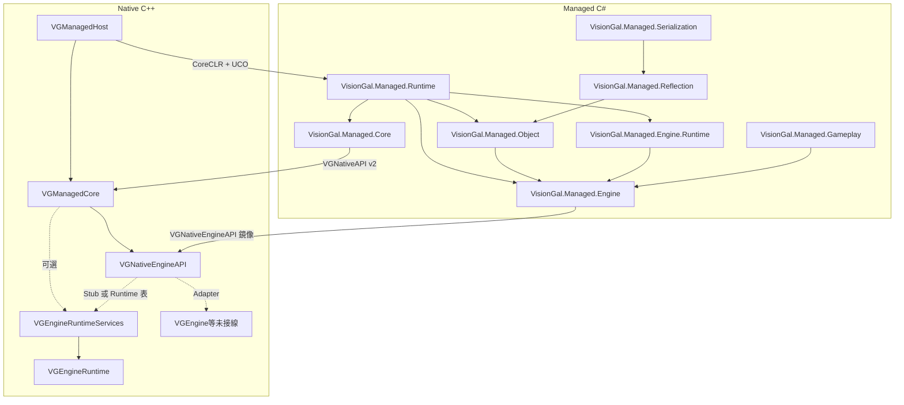

# VisionGal Managed Runtime — 架構與總進度

本文檔描述 **Managed Runtime** 分層、當前完成度與後續規劃。實作細節以各子模組 `Docs/MODULE_ARCHITECTURE_AND_PROGRESS.md` 為準；Native **Engine Service ABI** 另見 [VGNativeEngineAPI/Docs/MODULE_ARCHITECTURE_AND_PROGRESS.md](../Runtime/VGNativeEngineAPI/Docs/MODULE_ARCHITECTURE_AND_PROGRESS.md)。

---

## 1. 分層總覽



| 層級 | 模組 / 程式集 | 職責 |
|------|----------------|------|
| **Native Runtime Host** | **VGManagedHost** | CoreCLR 生命週期、nethost/hostfxr、`load_assembly_and_get_function_pointer`、多程式集登記；**不**承載業務 ABI。 |
| **Managed Runtime Foundation** | **VGManagedCore** + **VisionGal.Managed.Core** | **`VGNativeAPI`**、預設 Native 實作、託管鏡像與 **無 DllImport** 之函數表引導；**v2** 起掛載 **`engineServices`**。 |
| **Managed Engine SDK** | **VGNativeEngineAPI**（Native）+ **VisionGal.Managed.Engine** | **僅** Engine Service 函數表 ABI 與託管鏡像、Handle 型別、Stub / 未來 Adapter 接線點。**不含** Gameplay 產品邏輯。 |
| **Engine Runtime（Native）** | **VGEngineRuntime** + **VGEngineRuntimeServices** | 行程級 **Timing / Async / Scene（擴充）/ Object / AssetRegistry** 等狀態機；**不**鏈結完整 **VGEngine**。 |
| **Managed Engine Runtime 薄封裝** | **VisionGal.Managed.Engine.Runtime** | 讀已安裝 ABI 之 **EngineTime** 等；依賴 **VisionGal.Managed.Engine**，**不**含 Gameplay。 |
| **Managed Engine Foundation** | **VGManagedObject**、**VGManagedReflection**、**VGManagedSerialization**、**VGManagedAssets**、**VGManagedScene** 等 | Unity 式地基：註冊表、元資料、序列化、資產 GUID、場景再水合；Editor/Inspector/Graph 為資料模型 Shell。 |
| **Managed Gameplay** | **VGManagedGameplay** + **VisionGal.Managed.Gameplay** | Galgame 變數表、對白呈現（Phase 6 首包）；與 Legacy 分離。 |
| **託管入口程式集** | **VisionGal.Managed.Runtime** | `[UnmanagedCallersOnly]` 匯出、Bootstrap **Core + Engine + Foundation**。 |
| **Legacy（可選建置）** | `Engine/Source/Legacy/**` | Galgame 執行時與編輯器；**`VISIONGAL_BUILD_LEGACY_GALGAME`** 預設 **OFF**。 |

---

## 2. Phase 總覽

| Phase | 名稱 | 狀態 | 說明 |
|-------|------|------|------|
| **1** | Native Runtime Host | **已完成** | C++ → C# 單向 UCO。 |
| **2** | Managed ABI Foundation | **已完成** | **VGManagedCore** + **`VGNativeAPI`** + **VisionGal.Managed.Core**。 |
| **3** | Managed Engine Runtime Foundation | **已完成** | **VGNativeEngineAPI**、**`engineServices`**、**VisionGal.Managed.Engine**。 |
| **4** | Engine Runtime Service Integration | **已完成（首包）** | **VGEngineRuntime** / **VGEngineRuntimeServices**、layout v2+、Host 測試 Tick/timing/async。 |
| **5** | Managed Engine Infrastructure | **已完成（首包 + 加固 + 5.3）** | Foundation 模組樹、**BootstrapEngineFoundation**、**SceneRehydrator** 實體再水合。 |
| **5.3** | Scene Entity Rehydration | **已完成** | **`ApplyEntryProperties`**、**`RehydrateFromJson`**、Bootstrap 演練。 |
| **6** | VGManagedGameplay | **進行中（首包）** | **GameplayVariableStore**、**DialoguePresenter**；Sequence / 存檔待做。 |
| **7** | Managed Editor 產品化 | **未開始** | 真實 UI / 工具鏈（當前 Shell 資料模型）。 |
| **8** | Hot Reload / ALC | **未開始** | **VGManagedScripting** 脚手架；生產化在 Phase 8。 |
| **9** | VGManagedRoslyn | **未開始** | Roslyn 編譯管線。 |

### 2.1 Phase 5.3 摘要（2026-05-15）

| 類別 | 內容 |
|------|------|
| **API** | **`SceneSerializer.ApplyEntryProperties`**；**`SceneRehydrator`** / **`Scene.RehydrateFromJson`**。 |
| **Bootstrap** | **`BootstrapEngineFoundation`** 在 JSON 往返後清空註冊表並再水合，驗證 **DisplayName** 與 Native **IsAlive**。 |
| **測試** | **SceneRehydrationTests**（屬性套用 + 條件式 Engine 整合）；**VersionToleranceTests**（場景 DTO 含未知根欄位仍可反序列化）。 |

### 2.2 Phase 6 首包摘要（2026-05-15）

| 類別 | 內容 |
|------|------|
| **模組** | **VGManagedGameplay** / **VisionGal.Managed.Gameplay**。 |
| **API** | **GameplayVariableStore**；**DialoguePresenter**（`VGUIApi.SetDialogueText`，未安裝 ABI 時 no-op）。 |
| **測試** | **GameplayVariableStoreTests**、**DialoguePresenterTests**。 |
| **發佈** | **VisionGal.Managed.Runtime** 專案參考 **VisionGal.Managed.Gameplay**，**ManagedRuntimePublish** 含 **VisionGal.Managed.Gameplay.dll**；**VGManagedHostTest** 校驗該檔。 |

**仍刻意不做**：Native **`VGSceneAPI`** C# 橋接、Sequence 產品化、Roslyn/Hot Reload 生產化、Legacy Galgame 遷移。

---

## 3. 關鍵設計決策（摘要）

1. **函數表優先**：託管端經 **`VGNativeAPI*`** 與 **`VGNativeEngineAPI*`** 間接呼叫引擎能力，避免散落 `DllImport`。
2. **版本欄位**：**`VG_NATIVE_API_VERSION`** / **`VG_NATIVE_ENGINE_API_LAYOUT_VERSION`** 與託管常數同步；破壞性佈局變更必須遞增。
3. **Host 不膨脹**：hostfxr 封裝在 **VGManagedHost**；宿主 ABI 在 **VGManagedCore**；Engine 服務 ABI 在 **VGNativeEngineAPI**。
4. **靜態合併**：**VGManagedCore** STATIC 鏈入 **VGManagedHost**；可選 **VGEngineRuntimeServices** STATIC 鏈入建表路徑。
5. **Handle 邊界**：資源以 **uint64** Handle 暴露；禁止託管層持有 C++ 物件指標穿越 ABI。
6. **Object 生命週期**：**`createObject`** 成功即 ref=1，**`Dispose`** 遞減至 0 後 **destroy**；再水合一律建立**新** Native 控制代碼。

---

## 4. 建置與測試（Windows / MSVC）

前提：vcpkg **`nethost`**、**.NET 10 SDK**、**`VISIONGAL_ENABLE_MANAGED_HOST=ON`**、**`ENABLE_TESTS=ON`**。

```bat
cmake -B build -DCMAKE_TOOLCHAIN_FILE=<vcpkg>/scripts/buildsystems/vcpkg.cmake -DENABLE_TESTS=ON -DVISIONGAL_ENABLE_MANAGED_HOST=ON
cmake --build build --config Debug --target VGManagedHostTest visiongal_managed_runtime_publish visiongal_managed_foundation_tests
ctest -C Debug -R VGManagedHost --output-on-failure
dotnet test Engine/Source/Managed/Tests/VisionGal.Managed.Foundation.Tests/VisionGal.Managed.Foundation.Tests.csproj -c Debug
```

`dotnet publish` 輸出目錄預設：**`${CMAKE_BINARY_DIR}/ManagedRuntimePublish`**。

---

## 5. 未來規劃（Phase 6+）

| Phase | 目標 | 依賴 |
|-------|------|------|
| **6** | **SequenceRunner**、變數持久化、Gameplay Bootstrap UCO | Phase 5.3 再水合（已完成） |
| **7** | Editor 產品化：Inspector/Graph 與真實 UI | Phase 6 或並行 Shell 深化 |
| **8** | **AssemblyLoadContext**、Hot Reload 卸載 | 宿主多程序集策略 |
| **9** | **Roslyn** 腳本編譯（`VISIONGAL_ENABLE_ROSLYN`） | ABI 凍結、ALC 就緒 |
| **長期** | **VGEngine** 全量 Adapter 替換 Stub | 各 Engine Service 子表逐項接線 |

---

## 6. 變更記錄

| 日期 | 說明 |
|------|------|
| **2026-05-14** | **Phase 2–4** 落地；本總覽首版。 |
| **2026-05-15** | **Phase 5 首包**：layout v3、Legacy 凍結、Foundation 模組樹、**BootstrapEngineFoundation**。 |
| **2026-05-15** | **Phase 5 加固**：生命週期/匯入/場景 DTO 往返/反射修正；Foundation.Tests + **GetBootstrapFlags**。 |
| **2026-05-15** | **Phase 5.3 + Phase 6 首包**：**SceneRehydrator**、**ApplyEntryProperties**；**VGManagedGameplay**；文檔與測試同步。 |
| **2026-05-15** | **Runtime ↔ Gameplay publish**：Runtime 專案參考 Gameplay；GTest 斷言 publish 含 **VisionGal.Managed.Gameplay.dll**；**VersionToleranceTests**（未知 JSON 根欄位）。 |

---

## 7. 文檔合併

在 `Engine/Source/Managed` 執行 `python merge_docs.py` 可重新生成 **MERGED_ARCHITECTURE_AND_PROGRESS.md**（自動生成檔，請勿手改正文）。
