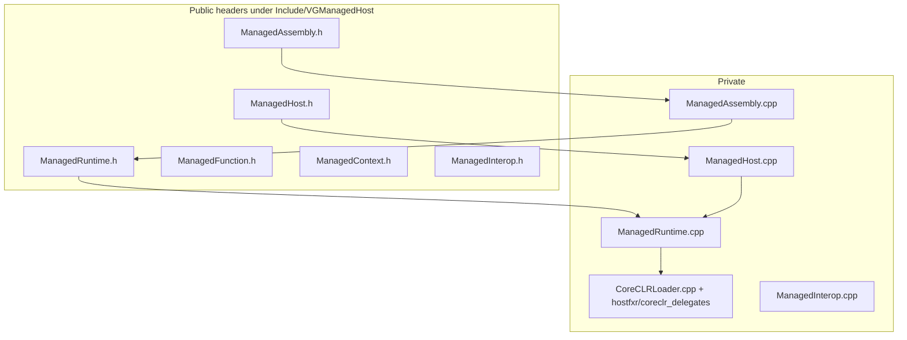
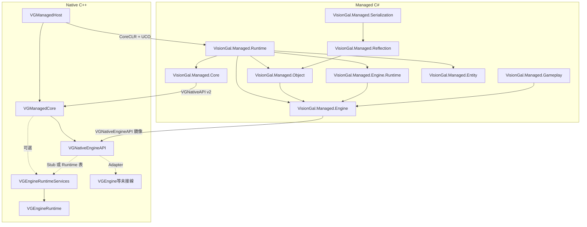

# MERGED — Managed 子樹模組文檔合集

本文件由 `merge_docs.py` 自動生成，**請勿手改**；請編輯各子目錄 `Docs/MODULE_ARCHITECTURE_AND_PROGRESS.md`、根目錄 `MANAGED_RUNTIME_ARCHITECTURE_AND_PROGRESS.md`，以及（可選）`Engine/Source/Runtime/VGNativeEngineAPI/Docs/...`、`VGEngineRuntime/Docs/...`、`VGEngineRuntimeServices/Docs/...` 後重新執行本腳本。

共收錄 **19** 個子模組文檔 + 根總覽。


---
## Module: VGManagedAssets

# VGManagedAssets — 資產 GUID 與登記表（VisionGal.Managed.Assets）

## 1. 定位

| 項目 | 說明 |
|------|------|
| **職責** | **GUID**（128-bit，與 Native VGGuid 互操作）、**AssetDatabase**、**ImportPipeline**、**DependencyTracking**。 |
| **程式集** | **VisionGal.Managed.Assets**（`net10.0`，`AllowUnsafeBlocks`） |
| **依賴** | **VisionGal.Managed.Object**、**VisionGal.Managed.Engine** |

## 2. 匯入回退（Phase 5 加固）

- 優先 **`AssetRegistry.importAsset`**（Native）。
- Native 回傳零 GUID 時，使用 **`GUID.FromDeterministicPath`**（FNV-1a 穩定雜湊），**禁止**對虛擬路徑呼叫 **`GUID.Parse`**。
- **`AssetDatabase.ClearForTesting`**：清空託管快取（不呼叫 Native 登記表）。

## 3. Phase 5 進展

| 日期 | 進展 |
|------|------|
| **2026-05-15** | 初始模組：GUID、資產登記、匯入管線、依賴追蹤。 |
| **2026-05-15** | **加固**：確定性路徑 GUID；`ImportPipeline` 註解與測試；Bootstrap 演練 **Import** + **TryResolveGuid**。 |


---
## Module: VGManagedCore

# VGManagedCore — Managed Runtime 基礎層（Phase 2/3：Native/Managed ABI）

## 1. 定位

| 項目 | 說明 |
|------|------|
| **職責** | 定義並實作 **VisionGal Native ↔ Managed 共享 ABI**：**`VGNativeAPI`** 函數表、預設 Native 實作（如 **`LogInfo`**）、預設 API 表單例、建表服務（**`VGNativeApiTable_BuildDefault`**）。**Phase 3**：表尾掛載 **`engineServices`** → **`VGNativeEngineAPI`**（見 Runtime 模組 **VGNativeEngineAPI**）。**不包含** CoreCLR 啟動、hostfxr、程式集載入（見 **VGManagedHost**）。 |
| **不負責** | Gameplay、對白、Editor、Hot Reload、Roslyn、反射式 Invoke、擴展元資料。 |
| **CMake 目標** | **`VGManagedCore`**（**`STATIC`**） |
| **依賴** | **`VGNativeEngineAPI`**（**`PUBLIC`** 鏈接，傳遞標頭與靜態庫使用需求）；C++ 標準庫；**不**鏈接 `nethost`。 |

---

## 2. 目錄結構

```
Engine/Source/Managed/VGManagedCore/
├── CMakeLists.txt
├── Docs/
│   └── MODULE_ARCHITECTURE_AND_PROGRESS.md   ← 本文件
├── Include/VGManagedCore/
│   ├── VGManagedCoreConfig.h
│   ├── NativeAPI.h            ← VGNativeAPI、VG_NATIVE_API_VERSION、預設 LogInfo、engineServices
│   ├── ManagedHandle.h
│   ├── ManagedABI.h
│   ├── ManagedRuntimeServices.h
│   └── ManagedExports.h       ← VGNativeApi_GetDefaultTable
├── Private/
│   ├── NativeAPI.cpp
│   ├── ManagedRuntimeServices.cpp
│   └── ManagedExports.cpp
└── Managed/VisionGal.Managed.Core/
    ├── VisionGal.Managed.Core.csproj
    ├── VGNativeApiConstants.cs
    ├── VGNativeApi.cs
    └── NativeApiBootstrap.cs
```

---

## 3. 公開 C ABI 摘要

| 符號 | 說明 |
|------|------|
| `VG_NATIVE_API_VERSION` | 與託管 `VGNativeApiConstants.ApiVersion` 對齊（**當前為 2**）。 |
| `VGNativeAPI` | `apiVersion`、`reserved0`、`logInfo`、**`engineServices`**（`const VGNativeEngineAPI*`，可為 nullptr；預設表由建表函式填寫）。 |
| `VGNativeApi_DefaultLogInfo` | 預設 `logInfo`：寫 stderr + 內部診斷計數。 |
| `VGNativeApi_GetLogInfoCallCount` | 診斷：累計 `DefaultLogInfo` 呼叫次數。 |
| `VGNativeApiTable_BuildDefault` | 填充預設表並掛載 **`VGNativeEngineApi_GetDefaultTable()`**。 |
| `VGNativeApi_RegisterLogInfoOverride` | Phase 2 占位（未改變預設表）。 |
| `VGNativeApi_GetDefaultTable` | 回傳行程內唯讀單例表指標。 |

託管鏡像與安裝邏輯見 **`VisionGal.Managed.Core`**；引擎子表鏡像見 **`VisionGal.Managed.Engine`**（由 **`VisionGal.Managed.Runtime`** 引用）。

---

## 4. 與 VGManagedHost 的邊界

- **VGManagedHost**：載入 CoreCLR、解析 **`[UnmanagedCallersOnly]`**，將 **`VGNativeApi_GetDefaultTable()`** 的指標傳給託管 **`Entry.BootstrapNativeApi`**。
- **VGManagedCore**：提供表與 Native 側函式實作；**不**包含 hostfxr。

---

## 5. Phase 路線圖（本模組）

| Phase | 內容 |
|-------|------|
| **2** | **`VGNativeAPI`** v1、`LogInfo` 閉環、託管 **`NativeApiBootstrap`**。 |
| **3（當前）** | **`VG_NATIVE_API_VERSION` = 2**、**`engineServices`** 指標、與 **VGNativeEngineAPI** 建表串接。 |
| **4+** | 擴充表欄位（版本遞增）、**`RegisterLogInfoOverride`** 真正接線、與 Gameplay 合約對齊之共享 struct（遷入 **`ManagedABI.h`** 需評審）。 |

---

## 6. 開發進展

| 日期 | 進展 |
|------|------|
| **2026-05-14** | **Phase 2 落地**：新增 **VGManagedCore** 靜態庫、`VGNativeAPI`、預設 Log、單例表、**VisionGal.Managed.Core**、Runtime **`BootstrapNativeApi`**、擴展 **VGManagedHostTest**。 |
| **2026-05-14** | **Phase 3**：遞增 **`VG_NATIVE_API_VERSION`**、掛載 **VGNativeEngineAPI**、託管 **VisionGal.Managed.Engine**、Stub 跨邊界測試。 |
| **2026-05-15** | **Phase 5 加固**：Foundation Bootstrap 經 **`VGNativeApi_GetDefaultTable`** 與 **GetBootstrapFlags** 驗證。 |


---
## Module: VGManagedEditor

# VGManagedEditor — 編輯器殼層（VisionGal.Managed.Editor）

## 1. 定位

| 項目 | 說明 |
|------|------|
| **職責** | **EditorShell**、停靠 **DockingLayout**、**EditorPanel** 基底、**ConsolePanel** / **HierarchyPanel**、**IEditorCommand** / **CommandRegistry**、**SelectionService**。 |
| **程式集** | **VisionGal.Managed.Editor**（`net10.0`） |
| **依賴** | **VisionGal.Managed.Object** |

## 2. Phase 5 進展

| 日期 | 進展 |
|------|------|
| **2026-05-15** | 初始模組：編輯器殼、面板、命令與選取服務。 |
| **2026-05-15** | **加固**：標記為 Phase 5 首包切片；產品化 UI 留待 Phase 7。 |


---
## Module: VGManagedEngine

# VGManagedEngine — Managed Engine SDK（VisionGal.Managed.Engine）

## 1. 定位

| 項目 | 說明 |
|------|------|
| **職責** | **僅**託管端 **Engine Service** 之 ABI 鏡像：`VGNativeEngineAPI` 與子表之 `[StructLayout(Sequential)]` 結構（含 **layout v4** 之 **`VGEntityApi`**、**layout v5** 尾部 **`GetRuntimeTick`**）、`EngineNativeApiBootstrap` 安裝與 Stub 演練路徑、**Handle** 型別封裝。**不包含** Gameplay、對白、存檔、Sequence。 |
| **不負責** | CoreCLR 宿主、**`VGNativeAPI`** 宿主級欄位定義（見 **VisionGal.Managed.Core**）。 |
| **程式集** | **`VisionGal.Managed.Engine`**（`net10.0`，`AllowUnsafeBlocks`）、**`VisionGal.Managed.Engine.Runtime`**（薄封裝） |
| **依賴** | **VisionGal.Managed.Core**（取得 `VGNativeApi` / `VGNativeApiConstants`）。**Engine.Runtime** 另依賴 **VisionGal.Managed.Engine**。 |

---

## 2. 目錄結構

```
Engine/Source/Managed/VGManagedEngine/
├── Docs/
│   └── MODULE_ARCHITECTURE_AND_PROGRESS.md   ← 本文件
└── Managed/
    ├── VisionGal.Managed.Engine/
    │   ├── VisionGal.Managed.Engine.csproj
    │   ├── VGNativeEngineApiConstants.cs
    │   ├── VGNativeHandles.cs
    │   ├── VGNativeEngineApiTypes.cs
    │   └── EngineNativeApiBootstrap.cs
    └── VisionGal.Managed.Engine.Runtime/
        ├── VisionGal.Managed.Engine.Runtime.csproj
        └── EngineTime.cs
```

---

## 3. 公開 API 摘要

| 類型 / 成員 | 說明 |
|-------------|------|
| `VGNativeEngineApiConstants.LayoutVersion` | 與 Native `VG_NATIVE_ENGINE_API_LAYOUT_VERSION` 對齊（**4** 起含 **`VGEntityAPI`**；**5** 起含 **`GetRuntimeTick`**）。 |
| `VGNativeEngineApiConstants.EntityServiceAbiToken` | 與 Native `VG_ENTITY_SERVICE_ABI_TOKEN`（`EntityAPI.h`）一致之服務魔數。 |
| `VGNativeEngineApi` 等 | 與 C 頭 `EngineAPIRegistry.h` 欄位順序一致之鏡像（末尾 **`Entity`** 對應 **`VGEntityAPI`**）。 |
| `EngineNativeApiBootstrap.InstallFromNativeApiTable` | 由 `VGNativeAPI*` 解析 `engineServices` 並按值快取函數指標。 |
| `EngineNativeApiBootstrap.ExerciseStubInteropPath` | 測試用：演練 **Timing**（含 Phase 4 擴充欄位）、**AsyncWait** 三件套，及 **layout v5** 之 **`Entity.GetServiceAbiToken`** / **`GetRuntimeTick`** 冒煙。 |
| **`EngineTime`**（**VisionGal.Managed.Engine.Runtime**） | 讀取已安裝 ABI 之 **DeltaTime** / **TotalTime** / **FrameIndex**。 |

---

## 4. 與 VisionGal.Managed.Runtime 的關係

- **`Entry.BootstrapNativeApi`** 在 **`NativeApiBootstrap.Install`** 之後呼叫 **`EngineNativeApiBootstrap.InstallFromNativeApiTable`** 與 **`ExerciseStubInteropPath`**。
- **`VisionGal.Managed.Runtime.csproj`** 以 `ProjectReference` 引用 **Engine** 與 **Engine.Runtime**；**`VGManagedHost/CMakeLists.txt`** 之 `dotnet publish` 依賴列表已納入兩目錄之 `*.cs`。

---

## 5. Phase 路線圖（本模組）

| Phase | 內容 |
|-------|------|
| **3** | 鏡像 Stub 表、Bootstrap、演練路徑。 |
| **4（當前）** | **`LayoutVersion` = 5** 鏡像（含 **`VGEntityApi`**、**`GetRuntimeTick`**）、**Engine.Runtime** 薄封裝。 |
| **5+** | 依子系統新增 **Service 封裝類**（如正式 `VGRenderService`），仍禁止在此層撰寫 Gameplay。 |

---

## 6. 開發進展

| 日期 | 進展 |
|------|------|
| **2026-05-14** | 新增 **VisionGal.Managed.Engine** 與本模組文檔；與 **VGNativeEngineAPI** 完成跨邊界 Stub 驗證。 |
| **2026-05-14** | 新增 **VisionGal.Managed.Engine.Runtime**（**EngineTime**）與 ABI **layout v2** 鏡像欄位。 |
| **2026-05-15** | **layout v4**：**`VGEntityApi`**、**`EntityServiceAbiToken`**、**`ExerciseStubInteropPath`** 擴充；與 **VGNativeEngineAPI**／MANAGED **§2.7.1** 對齊。 |
| **2026-05-15** | **layout v5**：**`GetRuntimeTick`**、**`LayoutVersion` = 5**；**ExerciseStubInteropPath** 擴充；MANAGED **§2.7.1 Kernel 首包** 對齊。 |
| **2026-05-15** | **P0 註解收口**：**`VGNativeEngineApiConstants`** 補充 **layout v5** 語義與與 Native 版本不一致時之拒絕安裝行為說明（對齊 **InstallFromNativeApiTable**）。 |
| **2026-05-15** | **P0 對齊審計**：**`VGEntityApi`** **remarks** 擴充 **GetRuntimeTick** 與 **EntityWorld** 無鏡像承諾、欄位順序與 C 一致；**merge_docs** 刷新 **MERGED**。 |


---
## Module: VGManagedEntity

# VGManagedEntity — 託管實體／元件世界（VisionGal.Managed.Entity）

## 1. 定位

| 項目 | 說明 |
|------|------|
| **職責** | P0：**EntityHandle**（Index + Generation）、**EntityWorld**（Spawn / Destroy / IsAlive；泛型與 **Type** 鍵 **HasComponent**／**TryGetComponent**／**GetComponent**／**RemoveComponent**；**GetComponentCount**；泛型 **TryGet**）、**VGComponent** 基底與 **Transform / Name / Active / Hierarchy** 元件、**ComponentPool** 骨架、**ComponentRegistry** 工廠表、**EntityArchetype** 枚舉占位。 |
| **程式集** | **VisionGal.Managed.Entity**（`net10.0`） |
| **依賴** | 無（僅 BCL） |
| **消費方** | **VisionGal.Managed.Runtime**（專案參考，納入 publish）；Foundation 單元測試。 |
| **不負責** | Native **VGEntitySystem** 完整實作；與 **SceneEntity** JSON 再水合無自動對應（並存，遷移另議）。**`VGEntityAPI`** Kernel 首包（**layout v5**、**`BuildRuntime`** 覆寫 **`entity.*`**）見 **VisionGal.Managed.Engine** 鏡像與 MANAGED **§2.7.1**；**EntityWorld** 與 Native **並存、非自動同步**（見 **§2.7.1** 資料策略）。 |

### 1.1 雙世界策略（2026 主線，MANAGED **§0.3** P0-2）

| 世界 | 職責 |
|------|------|
| **Native（目標）** | Runtime 實體句柄、場景圖、流式載入、**Transform**、渲染附掛等（**VGEntitySystem**／**VGSceneRuntime** 演進中）。 |
| **Managed（本程式集）** | **Gameplay ECS**：**EntityWorld** 純 C# 元件表與查詢；**不**承諾與 Kernel 資料結構自動鏡像；對齊透 **Gameplay 變數**、顯式 Facade 或未來窄橋接。 |

## 2. 與 VGManagedScene 之關係

- **SceneEntity**（`VisionGal.Managed.Scene`）仍為 VGObject 生命週期與序列化路徑；**EntityWorld** 為純託管 ECS 風格內核首包。
- 未來可選：劇本層橋接、或 **VGSceneRuntime** 載入後向 **EntityWorld** 顯式灌入元件（見總覽 **§0.3** **P0-3**；**非**自動同步）。

## 3. 完成度與進度總覽（2026-05-15）

| 區塊 | 狀態 |
|------|------|
| **核心型別** | **EntityHandle**、**EntityWorld**、**VGComponent** 已落地；**slice 2** 泛型 **HasComponent**／**GetComponent**；**slice 3** **GetComponentCount** 與行內中文註解；**slice 4** **HasComponent(handle, Type)**／**TryGetComponent(handle, Type, out)**（與 **ComponentRegistry.TryCreate** 鍵一致）；**slice 5** **GetComponent(handle, Type)**／**RemoveComponent(handle, Type)**（與泛型面對稱）；公開成員與 **EntityWorld** 已補中文 XML／行內註解。 |
| **基礎元件** | **Transform / Name / Active / Hierarchy** 首包欄位就緒；無自動與 Scene 同步。 |
| **擴展點** | **ComponentRegistry**（靜態工廠）、**ComponentPool**（骨架）、**EntityArchetype**（占位）。 |
| **測試** | **EntityWorldTests**（掛件／Destroy、工廠路徑、泛型與非泛型查詢／**Get**／**Remove**、**GetComponentCount**、世代偽造 Handle）；見 **VisionGal.Managed.Foundation.Tests**。 |
| **發佈鏈** | **VisionGal.Managed.Runtime** → publish；**VGManagedHost** CMake **DEPENDS**；**VGManagedHostTest** 斷言 **VisionGal.Managed.Entity.dll**。 |

## 4. 開發進展（變更記錄）

| 日期 | 進展 |
|------|------|
| **2026-05-15** | **首包**：託管實體世界與基礎元件；Runtime 參考；CMake `DEPENDS`；**VGManagedHostTest**；**EntityWorldTests**。 |
| **2026-05-15** | **補強**：程式集內公開 API 與 **EntityWorldTests** 補充詳細中文註解；本 MODULE 增「完成度與進度總覽」表；總覽 **MANAGED_RUNTIME** **§2.5 / §2.5.1** 同步。 |
| **2026-05-19** | **slice 2**：**EntityWorld.HasComponent** / **GetComponent**；**EntityWorld** 類 **remarks**（與 Native **VGEntityHandle** 無自動映射）；**EntityWorldTests** 擴充；總覽 **§2.5.2**、**§2.7.1** 交叉。 |
| **2026-05-20** | **slice 3**：**EntityWorld.GetComponentCount**；**Spawn**／**Destroy**／**IsAlive** 等行內中文註解補強；**EntityWorldTests** 計數與偽造世代；總覽 **§2.5.3**。 |
| **2026-05-21** | **slice 4**：**HasComponent(EntityHandle, Type)**、**TryGetComponent(EntityHandle, Type, out)**；**ThrowIfInvalidComponentLookupType**；**EntityWorldTests** 參數校驗與與泛型引用一致；總覽 **§2.5.4**。 |
| **2026-05-15** | **slice 5**：**GetComponent(EntityHandle, Type)**、**RemoveComponent(EntityHandle, Type)**；**EntityWorldTests** 對稱閉環；總覽 **§2.5.5**。 |
| **2026-05-15** | **§2.7.1 首包（跨棧）**：Native **`VGEntityAPI`** 子表骨架（**`getServiceAbiToken`**）與本模組邊界文檔更新；**EntityWorld** 仍純 C#。 |
| **2026-05-15** | **§2.7.1 Kernel 首包（layout v5）**：**`getRuntimeTick`**、**EntitySubsystem**、**`BuildRuntime`** **`entity.*`** 轉發；本 MODULE 更新殘留項與 **EntityWorld** 資料策略（並存、非自動同步）。 |
| **2026-05-15** | **P0 總覽對齊**：**EntityWorld** 類 **remarks** 明示 **VGEntityAPI**／**getRuntimeTick** 與託管資料無鏡像承諾；與 MANAGED **§2.7.1**／**§2.5** 同步。 |
| **2026-05-15** | **§0 雙世界**：新增 **§1.1** 表；與 MANAGED **§0.3** **P0-2** 對齊。 |

## 5. 未完成與後續

- 完整 **VGEntitySystem** 實作、**EntityWorld** 與 Native **資料鏡像**之顯式橋接（**不**在本模組單方承諾自動灌入）；**`VGEntityAPI`** Kernel 首包（**layout v5**）見 MANAGED **§2.7.1**。
- Archetype 批次分配、SoA **ComponentStorage**、多執行緒查表與查詢 API。
- 獨立 **VisionGal.Managed.Component**（序列化／反射元資料）與本模組拆分評審。

## 6. 近期規劃（對齊總覽 §2.7）

| 優先級 | 方向 |
|--------|------|
| **P0 下一跳** | **VGEntitySystem** 本體、**EntityWorld**／Native **顯式橋接**與產品級 Facade（**§2.7.1** Kernel 首包已 **layout v5**）；**總路線**見 MANAGED **§0.3** **P0-2**。 |
| **P1** | **VGSceneRuntime** 與託管 **VisionGal.Managed.Scene.Runtime**（**§0.3** **P0-3**）。 |
| **長期** | 與 **Graph.Runtime**、Gameplay 序列步驟之資料邊對齊（不本模組單方承諾時程）。 |


---
## Module: VGManagedGameplay

# VGManagedGameplay — Galgame 執行時（VisionGal.Managed.Gameplay）

## 1. 定位

| 項目 | 說明 |
|------|------|
| **職責** | Phase 6：**GameplayVariableStore**（託管變數表 + **JSON 快照** `ToJson` / `TryParseFromJson`）、**GameplaySessionSnapshot**（會話根 JSON：`variableStoreJson` + 可選 `sceneJson`）、**DialoguePresenter**、**SequenceRunner** / **ISequenceStep**（SetVariable / PresentDialogue / **RehydrateScene** / **SyncFirstEntityDisplayNameToVariable**；slice 5：**BranchOnVariableSequenceStep**、**WaitForVariableSequenceStep**、**SequenceMachineState**、**SequenceRunner.Advance**）。 |
| **程式集** | **VisionGal.Managed.Gameplay**（`net10.0`，`AllowUnsafeBlocks`） |
| **依賴** | **VisionGal.Managed.Core**、**VisionGal.Managed.Engine**、**VisionGal.Managed.Scene**、**VisionGal.Managed.Serialization**（**VersionTolerance** 選項） |
| **消費方** | **VisionGal.Managed.Runtime**（專案參考，使 `dotnet publish` 輸出含本程式集）；Foundation 單元測試。 |
| **不負責** | Native 劇本驅動 / Sequence **ABI**、Native 專用存檔 I/O、Legacy Galgame、Roslyn / Hot Reload。長期：**Lua Sequence** 由 **VisionGal.Managed.Graph.Runtime**（**§0.3** **P0-5**，**100% Managed**）替代，見總覽 **§0**。 |

## 2. 完成度與進度總覽（2026-05-17）

| 區塊 | 狀態 |
|------|------|
| **變數與持久化** | **GameplayVariableStore**（記憶體 + **ToJson** / **TryParseFromJson**）、**CopyFrom**；**GameplaySessionSnapshot**（根 JSON + 嵌套變子表 + 可選場景）已落地並有單測。 |
| **對白** | **DialoguePresenter** 經 Engine 服務表；ABI 未安裝時 no-op。 |
| **序列編排** | **SequenceRunner**：線性 **Run**；slice 3 場景再水合步驟；slice 5 **BranchOnVariableSequenceStep**、**WaitForVariableSequenceStep**、**SequenceMachineState**、**Advance**（**Waiting** 不推進下標）。實作分檔：**SequenceRunner.cs**、**SequenceFlow.cs**。 |
| **測試** | **VisionGal.Managed.Foundation.Tests**：變數表、對白、JSON、線性序列、場景聯動（條件式）、快照、分支／等待步驟／狀態機。 |
| **與總覽 Phase 6** | 與 [MANAGED_RUNTIME_ARCHITECTURE_AND_PROGRESS.md](../../MANAGED_RUNTIME_ARCHITECTURE_AND_PROGRESS.md) **§2** 一致：**託管** slice 2–5 已落地；**Native Gameplay／存檔** 為 Phase 6 **未開始子項**，見 **§2.7** 與總覽 **§5.1** 推進順序草案。 |
| **與 Native** | 本模組不擴充 **VGNativeEngineAPI** layout；後續 **Gameplay／存檔** ABI 見總覽 **§5.1**、**§2.7**。 |

## 3. Phase 6 進展

| 日期 | 進展 |
|------|------|
| **2026-05-15** | **首包**：變數表 API、對白 Presenter（ABI 未安裝時 no-op）；**VisionGal.Managed.Foundation.Tests** 覆蓋。 |
| **2026-05-15** | **Runtime 納入 publish**：**VisionGal.Managed.Runtime** 專案參考本模組；**VGManagedHostTest** 斷言 **VisionGal.Managed.Gameplay.dll** 存在於 publish 根目錄。 |
| **2026-05-15** | **Phase 6 slice 2**：變數表 JSON（`string|bool|int64|double`）、**SequenceRunner**、**Entry.BootstrapGameplay** UCO；**GetBootstrapFlags** 新增 **FlagGameplay (1<<4)**；**VisionGal.Managed.Foundation.Tests** 覆蓋 JSON 與序列。 |
| **2026-05-15** | **Phase 6 slice 3**：**SequenceContext.ActiveScene**；**RehydrateSceneSequenceStep** / **SyncFirstEntityDisplayNameToVariableSequenceStep** 與 **SceneRehydrator** 聯動；**Entry.BootstrapGameplay** 演練；程式集新增 **VisionGal.Managed.Scene** 參考；程式碼補充中文註解。 |
| **2026-05-15** | **Phase 6 slice 4**：**GameplaySessionSnapshot**（根 JSON + 嵌套變子文檔 + 可選場景 JSON）、**GameplayVariableStore.CopyFrom**；**BootstrapGameplay** 末尾演練快照往返；**GameplaySessionSnapshotTests**。 |
| **2026-05-15** | **Phase 6 slice 5**：託管序列**條件分支**與**可恢復等待**（**Advance** + **Waiting**）；**SequenceFlow.cs**（**SequenceMachineState**、**SequenceAdvanceKind**）；**SequenceRunnerTests** 擴充；公開 API 補充簡體中文 XML。 |
| **2026-05-16** | MODULE 增 **§2 完成度與進度總覽**；與 **RUNTIME** 根 **§5.2**、**MANAGED_RUNTIME §2.5** 對齊；**SequenceRunner.cs** 步驟型別之簡體中文 XML 補強。 |
| **2026-05-17** | **§2** 對齊總覽 **§2** Phase 6「託管已落地／Native 子項待定」表述；**SequenceFlow.cs** 註解補強；驗證矩陣見總覽 **§2.5**。 |
| **2026-05-18** | Native **Gameplay／存檔** 推進順序見總覽 [MANAGED_RUNTIME_ARCHITECTURE_AND_PROGRESS.md](../../MANAGED_RUNTIME_ARCHITECTURE_AND_PROGRESS.md) **§5.1**；**GameplaySessionSnapshot** 註解補充與 Native 對接說明。 |
| **2026-05-15** | **§0**：**不負責** 擴表列出 **VisionGal.Managed.Graph.Runtime**（**P0-5**）；長期 **Lua Sequence** 遷出主線見總覽 **§0**。 |

## 4. 後續

- Native Gameplay / 存檔 **ABI**（若凍結）與實際檔案 I/O；**實施順序草案**見總覽 [MANAGED_RUNTIME_ARCHITECTURE_AND_PROGRESS.md](../../MANAGED_RUNTIME_ARCHITECTURE_AND_PROGRESS.md) **§5.1**。
- 多實體條件步驟、跨 **Advance** 邊界之巢狀等待（子序列內變數門檻）等進階編排。


---
## Module: VGManagedGraph

# VGManagedGraph — 節點圖（VisionGal.Managed.Graph）

## 1. 定位

| 項目 | 說明 |
|------|------|
| **職責** | **Graph** / **GraphNode** / **GraphEdge** / **GraphPort**、**GraphValidator** 結構驗證。 |
| **程式集** | **VisionGal.Managed.Graph**（`net10.0`） |
| **依賴** | **VisionGal.Managed.Reflection** |
| **主線（2026）** | 當前為**資料模型**與驗證；執行時目標程式集 **VisionGal.Managed.Graph.Runtime**（GraphVM、NodeExecutor 等，**100% Managed**，見 [MANAGED 總覽 §0.3 P0-5](../../MANAGED_RUNTIME_ARCHITECTURE_AND_PROGRESS.md)）。**不**做 Native Graph VM。 |

## 2. Phase 5 進展

| 日期 | 進展 |
|------|------|
| **2026-05-15** | 初始模組：節點圖資料模型與驗證器。 |
| **2026-05-15** | **加固**：**GraphSerializer** 屬性註解；未納入 Bootstrap 路徑。 |
| **2026-05-15** | **§0 主線**：補充 **Graph.Runtime** 與 MANAGED **§0.3** **P0-5** 索引。 |


---
## Module: VGManagedHost

# VGManagedHost — Managed Runtime Host（CoreCLR / nethost）

## 1. 定位

| 项目 | 说明 |
|------|------|
| **职责** | **仅**负责：启动 CoreCLR、程序集加载、`load_assembly_and_get_function_pointer` 获取函数指针、运行时生命周期、多程序集登记、**Native → Managed** 的 UCO 调用解析。封装 **nethost / hostfxr**，对外头文件 **不暴露** `hostfxr.h` 类型。 |
| **不负责** | **不包含** `VGNativeAPI` 结构定义与引擎业务 ABI（见 **VGManagedCore**）；不负责 Gameplay、Editor、UI、对白、Sequence、Reflection Invoke、Hot Reload、Roslyn。 |
| **CMake 目标** | **`VGManagedHost`**（`SHARED`） |
| **依赖** | vcpkg **`nethost`**；**`PRIVATE`** 链接 **`VGManagedCore`**（ABI 默认实现随本 DLL 静态合并）。 |
| **根 CMake 选项** | **`VISIONGAL_ENABLE_MANAGED_HOST`**：Windows MSVC 默认 **ON**，其余平台默认 **OFF**；为 **OFF** 时不加入本子目录，避免未安装 `nethost` 的机器无法 configure。 |

---

## 2. CMake 与 vcpkg

| 项目 | 说明 |
|------|------|
| **安装** | 在所用 triplet 上执行：`vcpkg install nethost`（例如 `x64-windows`）。根 [CMakeLists.txt](../../../../../CMakeLists.txt) 已配置默认 `CMAKE_TOOLCHAIN_FILE` 指向 `E:/vcpkg/...`（可按本机修改）。 |
| **编译定义** | `PRIVATE VG_MANAGED_HOST_EXPORT` → **`VG_MANAGED_HOST_API`**（见 [VGManagedHostConfig.h](../Include/VGManagedHost/VGManagedHostConfig.h)）。 |
| **包含目录** | `PUBLIC`：`Include/`（对外 `#include "VGManagedHost/..."`）；`PRIVATE`：`Private/`（仅 **`CoreCLRLoader`** 等实现翻译单元使用，**禁止**作为引擎其它模块的 `PUBLIC` 依赖路径）。 |
| **非 Windows** | 若启用本模块，`CoreCLRLoader` 使用 `dlopen` / `dlsym`，`target_link_libraries(VGManagedHost PRIVATE dl)`（Unix 非 Apple）。 |
| **托管测试产物** | 缓存变量 **`VISIONGAL_MANAGED_PUBLISH_DIR`**（默认 `${CMAKE_BINARY_DIR}/ManagedRuntimePublish`）。若找到 **`dotnet`**，生成 **`visiongal_managed_runtime_publish`**：`dotnet publish` [VisionGal.Managed.Runtime.csproj](../Managed/VisionGal.Managed.Runtime/VisionGal.Managed.Runtime.csproj)（輸出含 **VisionGal.Managed.Core.dll**、**VisionGal.Managed.Engine.dll**、**VisionGal.Managed.Gameplay.dll**、**VisionGal.Managed.Entity.dll** 等；`DEPENDS` 監視各 Foundation / Gameplay / **Entity** 工程原始碼）。 |

### 2.1 单元测试（GTest）

| 项目 | 说明 |
|------|------|
| **条件** | `ENABLE_TESTS=ON` **且** 找到 **`dotnet`** 可执行文件。 |
| **目标** | **`VGManagedHostTest`**（[Engine/Source/Tests/VGManagedHostTest](../../../Tests/VGManagedHostTest/)） |
| **依赖** | `add_dependencies(VGManagedHostTest visiongal_managed_runtime_publish)`，保证先发布托管程序集。 |
| **运行时 DLL** | `POST_BUILD` 将 **`VGManagedHost.dll`** 复制到测试 exe 同目录，避免 `bin` 与 `lib` 分离导致加载失败。 |
| **ctest 环境变量** | **`VGMANAGED_TEST_ROOT`** = `VISIONGAL_MANAGED_PUBLISH_DIR`，目录内需含 **`VisionGal.Managed.Runtime.dll`**、**`VisionGal.Managed.Core.dll`**、**`VisionGal.Managed.Engine.dll`**、**`VisionGal.Managed.Gameplay.dll`**、**`VisionGal.Managed.Entity.dll`** 与 **`.runtimeconfig.json`**。 |

构建与测试示例（在已安装 `nethost` 与 .NET 10 SDK 的前提下）：

```bat
cmake -B build -DCMAKE_TOOLCHAIN_FILE=E:/vcpkg/scripts/buildsystems/vcpkg.cmake -DENABLE_TESTS=ON -DVISIONGAL_ENABLE_MANAGED_HOST=ON
cmake --build build --config Debug --target VGManagedHostTest visiongal_managed_runtime_publish
ctest -C Debug -R VGManagedHost --output-on-failure
```

---

## 3. 架构与分层



- **`CoreCLRLoader`**：唯一包含 **`nethost.h` / `hostfxr.h` / `coreclr_delegates.h`** 的翻译单元路径；负责 `get_hostfxr_path`、加载 **hostfxr**、**`hostfxr_initialize_for_runtime_config`**、**`hostfxr_get_runtime_delegate(hdt_load_assembly_and_get_function_pointer)`**、以及 **`load_assembly_and_get_function_pointer`** 调用链。
- **`VGManagedRuntime`**：运行时状态、**多程序集**路径登记、`TryResolveUnmanagedCallersOnly`（UTF-8 类型名/方法名 → 内部宽字符/UTF-8 与 `char_t` 对齐）。
- **`VGManagedHost`**：薄门面：`Initialize` / `LoadAssembly` / `TryGetUnmanagedCallersOnly` / `Shutdown` / `Runtime()`；**`PRIVATE`** 依赖 **VGManagedCore**（不在此头文件暴露 `VGNativeAPI` 定义）。
- **`VGManagedRuntimeContext`**：仅 **`void*`** 快照字段（**不透明**），供诊断或后续扩展；**不要**在引擎其它处将其转型为 hostfxr 类型。

---

## 3.1 Phase 2 与 VGManagedCore 边界

- **`VGNativeAPI`、默认 `LogInfo`、`VGNativeApi_GetDefaultTable`**：定义与实现位于 **[VGManagedCore](../../VGManagedCore/)**（**STATIC**），**不**进入 `Include/VGManagedHost` 公共头；宿主通过 **`PRIVATE`** 链接与 `#include "VGManagedCore/..."` 使用。
- **典型流程**：宿主解析 **`VisionGal.Managed.Runtime.Entry.BootstrapNativeApi`**，将 **`VGNativeApi_GetDefaultTable()`** 的指针传入托管；托管侧通过 **VisionGal.Managed.Core** 安装函数表并回调 **`logInfo`**；**Phase 3** 起由 **VisionGal.Managed.Engine** 解析 **`engineServices`** 並演練 Stub 路徑（無引擎 `DllImport`）。
- **测试**：`VGManagedHostTest` 中 **`BootstrapNativeApiCallsNativeLogInfo`** 依赖上述链路与 `VGManagedHost_GetNativeLogInfoCallCountForTest`（见 §5.2）。

---

## 4. 目录结构（与仓库一致）

```
Engine/Source/Managed/VGManagedHost/
├── CMakeLists.txt
├── Docs/
│   └── MODULE_ARCHITECTURE_AND_PROGRESS.md
├── Include/VGManagedHost/
│   ├── VGManagedHostConfig.h
│   ├── ManagedHost.h
│   ├── ManagedRuntime.h
│   ├── ManagedAssembly.h
│   ├── ManagedFunction.h
│   ├── ManagedContext.h
│   └── ManagedInterop.h
├── Private/
│   ├── CoreCLRLoader.h
│   ├── CoreCLRLoader.cpp
│   ├── ManagedHost.cpp
│   ├── ManagedRuntime.cpp
│   ├── ManagedAssembly.cpp
│   └── ManagedInterop.cpp
└── Managed/VisionGal.Managed.Runtime/
    ├── VisionGal.Managed.Runtime.csproj
    └── Entry.cs
```

---

## 5. 公开 API 说明（Phase 1–2）

### 5.1 `VGManagedHost` — [ManagedHost.h](../Include/VGManagedHost/ManagedHost.h)

| 方法 | 说明 |
|------|------|
| `VGManagedHost()` / `~VGManagedHost()` | 构造/析构；析构会关闭运行时。 |
| `bool Initialize(const std::filesystem::path& runtime_config_json, const std::filesystem::path* assembly_path_hint = nullptr)` | 使用给定 **`.runtimeconfig.json`** 初始化 hostfxr 上下文并缓存 **`load_assembly_and_get_function_pointer`**。建议传入 **`assembly_path_hint`** 指向同应用旁的 **`.dll`**，便于 **nethost** 解析匹配的 **hostfxr**。 |
| `bool LoadAssembly(const std::filesystem::path& assembly_path)` | 将程序集路径登记为多程序集宿主的一部分（Phase 1 不做额外校验；解析时以传入路径为准）。 |
| `bool TryGetUnmanagedCallersOnly(const std::filesystem::path& assembly_path, const char* type_utf8, const char* method_utf8, void** out_fn)` | 通过 **`load_assembly_and_get_function_pointer`** 与 **`UNMANAGEDCALLERSONLY_METHOD`** 解析 **`[UnmanagedCallersOnly]`** 静态方法；**`out_fn`** 为原始函数指针，由调用方按 ABI 转型（见 `VGManagedVoidThunk`）。**`type_utf8`** 为 CLR 类型名（含命名空间，如 `VisionGal.Managed.Runtime.Entry`）。 |
| `void Shutdown()` | 关闭 host 上下文并卸载 **hostfxr** 动态库。 |
| `VGManagedRuntime& Runtime()` | 访问底层运行时对象（高级用法 / 测试）。 |

### 5.2 测试用导出（Phase 2）

| 符号 | 说明 |
|------|------|
| `extern "C" VGManagedHost_GetNativeLogInfoCallCountForTest()` | 返回 **`VGNativeApi_DefaultLogInfo`** 累计调用次数，供 **GTest** 断言 **C# → Native** 经 **`VGNativeAPI`** 的闭环；**非**游戏发行公共 API。实现见 [ManagedHost.cpp](../Private/ManagedHost.cpp)。 |

### 5.3 `VGManagedRuntime` — [ManagedRuntime.h](../Include/VGManagedHost/ManagedRuntime.h)

| 方法 | 说明 |
|------|------|
| `Initialize` / `Shutdown` | 与 `VGManagedHost` 对应；`Shutdown` 清空已加载程序集登记。 |
| `void* LoadAssemblyDelegate() const` | 返回缓存的 **`load_assembly_and_get_function_pointer`** 指针（**不透明**）；仅供诊断或后续内部扩展。 |
| `void FillContextSnapshot(VGManagedRuntimeContext& out) const` | 填充 **`hostfxrHostContext`**（hostfxr 句柄地址）与 **`loadAssemblyAndGetFunctionPointerDelegate`**。 |
| `bool RegisterLoadedAssembly(...)` | 以规范化路径字符串为键登记多程序集。 |
| `bool TryResolveUnmanagedCallersOnly(...)` | 与 `VGManagedHost::TryGetUnmanagedCallersOnly` 相同语义。 |

### 5.4 `VGManagedAssembly` — [ManagedAssembly.h](../Include/VGManagedHost/ManagedAssembly.h)

| 方法 | 说明 |
|------|------|
| `explicit VGManagedAssembly(std::filesystem::path assemblyPath)` | 绑定某一托管 DLL 路径。 |
| `bool TryGetUnmanagedCallersOnly(VGManagedRuntime& runtime, const char* type_utf8, const char* method_utf8, void** outFunction) const` | 对构造时路径做解析；内部转调 **`VGManagedRuntime::TryResolveUnmanagedCallersOnly`**。 |

### 5.5 `VGManagedVoidThunk` — [ManagedFunction.h](../Include/VGManagedHost/ManagedFunction.h)

| 类型 | 说明 |
|------|------|
| `VGManagedVoidThunk` | Phase 1 无参无返回值 smoke 签名：Windows 为 **`void(__stdcall*)()`**，其它平台为 **`void(*)()`**。与托管侧 **`[UnmanagedCallersOnly(CallConvs = new[] { typeof(CallConvStdcall) })]`（Windows）** 对齐。 |

### 5.6 `VGManagedRuntimeContext` — [ManagedContext.h](../Include/VGManagedHost/ManagedContext.h)

| 字段 | 说明 |
|------|------|
| `void* hostfxrHostContext` | **不透明**：当前为 hostfxr host context 指针值。 |
| `void* loadAssemblyAndGetFunctionPointerDelegate` | **不透明**：缓存的 **`load_assembly_and_get_function_pointer`** 函数指针。 |

### 5.7 `VGManagedInterop`（Windows）— [ManagedInterop.h](../Include/VGManagedHost/ManagedInterop.h)

| 函数 | 说明 |
|------|------|
| `std::wstring Utf8ToWide(const char* utf8, std::size_t len = -1)` | UTF-8 → UTF-16，供与 **`char_t`**（宽字符）API 互操作。 |
| `std::wstring PathToWide(const std::filesystem::path& path)` | 路径 → 宽字符串（MSVC **`path::native()`**）。 |

---

## 6. 託管側約定（Phase 1–6）

- 工程：**`net10.0`**，見 [VisionGal.Managed.Runtime.csproj](../Managed/VisionGal.Managed.Runtime/VisionGal.Managed.Runtime.csproj)；**ProjectReference** 涵蓋 Core / Engine / Object / Scene / Assets / **Gameplay** 等 Foundation 程式集。
- 入口：[Entry.cs](../Managed/VisionGal.Managed.Runtime/Entry.cs)：
  - **`Smoke`**（Phase 1）
  - **`BootstrapNativeApi`**（Phase 2–3）
  - **`BootstrapEngineFoundation`**（Phase 5/5.3：Object / Scene JSON 往返與 **SceneRehydrator** 再水合 / Assets）
  - **`BootstrapGameplay`**（Phase 6：變數表 JSON 往返 + **SequenceRunner**（含 **SceneRehydrator** 再水合與首實體 **DisplayName** 同步至變數表）+ **GameplaySessionSnapshot** 根層 JSON 往返 + **DialoguePresenter**；須在 **`BootstrapNativeApi`** 之後呼叫）
  - **`GetBootstrapFlags`**（位元：`1<<0` Smoke … `1<<3` Foundation、**`1<<4` Gameplay**）
- **C# → Native**：經 **`VGNativeAPI.logInfo`** 函數指標；**禁止**對引擎 DLL 使用 **`DllImport`**。
- **Phase 6 程式集**：**VisionGal.Managed.Gameplay**、**VisionGal.Managed.Entity** 經 Runtime 專案參考進入 publish；**VGManagedHostTest** 斷言上述 DLL 存在於 publish 根目錄。

---

## 7. Phase 路线图（未实现部分仅规划）

| Phase | 内容 |
|-------|------|
| **1** | CoreCLR 启动、`load_assembly_and_get_function_pointer`、多程序集登记、GTest **`Smoke`**。 |
| **2（已完成于 VGManagedCore）** | **`VGNativeAPI`** 函数指针表、托管 **VisionGal.Managed.Core**、**`BootstrapNativeApi`**、GTest **`BootstrapNativeApiCallsNativeLogInfo`**。 |
| **3** | `VGManagedGameplay`：Gameplay / Async / Sequence 与托管运行时对接（依赖 ABI 评审）。 |
| **4** | `VGManagedEditor`：编辑器工具链。 |
| **5** | `AssemblyLoadContext`、Hot Reload、扩展重载。 |

---

## 8. 开发进展与变更记录

| 日期 | 进展 |
|------|------|
| **2026-05-14** | **Phase 1 落地**：新增 **`VGManagedHost`** 模块；**`CoreCLRLoader`** 封装 nethost + hostfxr；**`VGManagedHost` / `VGManagedRuntime` / `VGManagedAssembly`** 公开 API；**`VisionGal.Managed.Runtime`** smoke 程序集；**`VGManagedHostTest`** + **`visiongal_managed_runtime_publish`**；根 **`VISIONGAL_ENABLE_MANAGED_HOST`** 选项。 |
| **2026-05-14** | **Phase 2**：**`PRIVATE`** 链接 **`VGManagedCore`**；托管 **`BootstrapNativeApi`** + **`VisionGal.Managed.Core`**；测试导出 **`VGManagedHost_GetNativeLogInfoCallCountForTest`**；扩展 **GTest** 与 publish 依赖 **Core** 源码。 |
| **2026-05-15** | **Phase 5 加固**：**`BootstrapEngineFoundation`** 擴充；**`GetBootstrapFlags`**；GTest 斷言 publish 完整性與旗標；**`VisionGal.Managed.Foundation.Tests`**（`dotnet test` / CMake **`visiongal_managed_foundation_tests`**）。 |
| **2026-05-15** | **Phase 5.3 + publish**：**`BootstrapEngineFoundation`** 演練 **SceneRehydrator**；CMake `DEPENDS` 含 **VGManagedGameplay**；**Runtime.csproj** 專案參考 **VisionGal.Managed.Gameplay**，GTest 斷言 **VisionGal.Managed.Gameplay.dll**。 |
| **2026-05-15** | **Phase 6 slice 3**：**`BootstrapGameplay`** 擴充為序列內 **場景再水合 → 變數同步**；**VisionGal.Managed.Gameplay** 專案參考 **VisionGal.Managed.Scene**；Foundation.Tests 新增場景聯動序列用例。 |
| **2026-05-15** | **Phase 6 slice 4**：**`BootstrapGameplay`** 末尾演練 **GameplaySessionSnapshot**；**GameplaySessionSnapshotTests**。 |
| **2026-05-15** | **P0 Entity**：publish 含 **VisionGal.Managed.Entity.dll**；CMake **DEPENDS** 監視 **VGManagedEntity**；**VGManagedHostTest** 斷言該檔；**MANAGED_RUNTIME §2.5.1** 與 Entity 程式集中文註解補強。 |
| **2026-05-15** | **Foundation.Tests 構建順序**：根 **Tests/CMakeLists.txt** 使 **visiongal_managed_foundation_tests** 依賴 **visiongal_managed_runtime_publish**，避免與本模組 **dotnet publish** 並行寫入 **obj/** 造成假陽性失敗。 |

---

## 9. 已知限制与注意事项

- 需要本机安装 **.NET 10 SDK** 与对应 **Microsoft.NETCore.App** 运行时，以便 **`dotnet publish`** 与 **`runtimeconfig.json`** 解析框架依赖。
- **`Initialize`** 所给 **`.runtimeconfig.json`** 必须与待加载的托管 DLL 框架版本一致（测试使用同一 publish 目录）。
- 引擎其它模块 **默认不链接** **`VGManagedHost`**，避免过早耦合；由宿主进程或测试目标按需 **`target_link_libraries(... VGManagedHost)`**。


---
## Module: VGManagedInspector

# VGManagedInspector — Inspector 視圖（VisionGal.Managed.Inspector）

## 1. 定位

| 項目 | 說明 |
|------|------|
| **職責** | **InspectorView** 綁定反射元資料、**PropertyDrawer** 讀寫屬性值（含 Range 約束）。 |
| **程式集** | **VisionGal.Managed.Inspector**（`net10.0`） |
| **依賴** | **VisionGal.Managed.Reflection**、**VisionGal.Managed.Editor** |

## 2. Phase 5 進展

| 日期 | 進展 |
|------|------|
| **2026-05-15** | 初始模組：Inspector 視圖與屬性繪製器。 |
| **2026-05-15** | **加固**：依賴 **Reflection** 掃描規則修正；Phase 7 產品化。 |


---
## Module: VGManagedObject

# VGManagedObject — 託管物件生命週期（VisionGal.Managed.Object）

## 1. 定位

| 項目 | 說明 |
|------|------|
| **職責** | 託管 **VGObject** 抽象基底、**VGObjectId** 識別、靜態 **ObjectRegistry**、經 **EngineApi.Object** 之 **NativeHandleBridge**、**LifetimeSystem** retain/release 協調。 |
| **程式集** | **VisionGal.Managed.Object**（`net10.0`，`AllowUnsafeBlocks`） |
| **依賴** | **VisionGal.Managed.Engine** |

## 2. 生命週期契約（Phase 5 加固）

- **`createObject`** 成功時 Native 引用計數為 **1**；**`CreateAndRegister`** 不再額外 `Retain`。
- **`Dispose`** → **`Release`**；引用歸零後 **`DestroyObject`**。
- **`ObjectRegistry.ClearForTesting`**：先對所有已註冊物件呼叫 **`Dispose`**，再清空表與 Id 計數器。
- **`CreateAndRegister<T>`**：以反射匹配 `(VGObjectId, VGObjectHandle)` 或三參數 `(…, string typeName)` 建構子。

## 3. 進展

| 日期 | 進展 |
|------|------|
| **2026-05-15** | 初始模組：Id / Object / Registry / Native 橋接 / 生命週期系統。 |
| **2026-05-15** | **Phase 5 加固**：ref-count、`ClearForTesting`、反射建構 **SceneEntity**。 |
| **2026-05-15** | **Phase 5.3**：**SceneRehydrator** 經 **`LifetimeSystem`** 再水合場景實體（新 Native 控制代碼）。 |

## 4. 後續

- 執行緒安全之讀寫鎖（若多執行緒存取註冊表）。


---
## Module: VGManagedReflection

# VGManagedReflection — 託管反射元資料（VisionGal.Managed.Reflection）

## 1. 定位

| 項目 | 說明 |
|------|------|
| **職責** | Inspector / 序列化共用之屬性標記（SerializeField、HideInInspector、Range）、**TypeMetadata** / **PropertyMetadata**、**ReflectionRegistry** 快取。 |
| **程式集** | **VisionGal.Managed.Reflection**（`net10.0`） |
| **依賴** | **VisionGal.Managed.Object** |

## 2. 掃描規則（Phase 5 加固）

屬性納入序列化掃描當且僅當：

- 標記 **`[SerializeField]`**，或
- 具 **public setter** 之可讀寫屬性。

（已修正運算子優先級導致 public setter 誤判之問題。）

## 3. Phase 5 進展

| 日期 | 進展 |
|------|------|
| **2026-05-15** | 初始模組：屬性標記、型別/屬性元資料、註冊表快取。 |
| **2026-05-15** | **加固**：`TypeMetadata.ScanMembers` 邏輯修正；單元測試覆蓋 **SceneEntity.DisplayName** 與 fixture 欄位。 |


---
## Module: VGManagedRuntimeLoop

# VGManagedRuntimeLoop — 託管 Runtime Loop API

## 1. 定位與邊界

| 項目 | 說明 |
|------|------|
| **程式集** | **VisionGal.Managed.RuntimeLoop**（`net10.0`） |
| **職責** | 提供與 Native **`visiongal::engine::RuntimeScheduler`** 對稱之 **`ManagedRuntimeScheduler`**、**`RuntimeTickGroup`**、**`ManagedRuntimeFrameContext`**、**`IManagedRuntimeSubsystem`**；**無** **DllImport**、**無** **VisionGal.Managed.Engine** 依賴，供純 C# 宿主或單元測試演練 **PlayerLoop** 式順序。 |
| **不負責** | 不驅動 **VGEngineRuntime**、不讀寫 **VGNativeEngineAPI**；與 Native 帧之對齊僅能由產品層自行約定（未來可選 P/Invoke／Host 回調，**本模組不提供**）。 |
| **對稱關係** | 見 [VGEngineRuntime MODULE](../../../Runtime/VGEngineRuntime/Docs/MODULE_ARCHITECTURE_AND_PROGRESS.md) **RuntimeScheduler**；總覽 **P0-1** 見 [MANAGED_RUNTIME_ARCHITECTURE_AND_PROGRESS.md](../../MANAGED_RUNTIME_ARCHITECTURE_AND_PROGRESS.md) **§0.3**。 |
| **消費方** | **VisionGal.Managed.Runtime**（專案參考，納入 publish）；**VisionGal.Managed.Foundation.Tests**。 |

## 2. 目錄與公開 API

- `RuntimeTickGroup.cs` — 與 Native **RuntimeTickGroup** 語義一致。
- `ManagedRuntimeFrameContext.cs` — 只讀帧上下文。
- `IManagedRuntimeSubsystem.cs` — 子系統介面。
- `ManagedRuntimeScheduler.cs` — 註冊、**InitializeRegistered** / **ShutdownRegistered**、**Tick**（含 **FixedUpdate** 累加與每帧最大步數上限）。

## 3. 開發進展

| 日期 | 進展 |
|------|------|
| **2026-05-15** | **P0-1 首包**：新程式集與 **ManagedRuntimeScheduler**；**VisionGal.Managed.Runtime** 專案參考；**VGManagedHost** CMake **DEPENDS**；**Foundation.Tests** 順序與 **FixedUpdate** 上限用例；與 Native **RuntimeScheduler** 管線對齊說明。 |

## 4. 相關鏈接

- [MANAGED_RUNTIME_ARCHITECTURE_AND_PROGRESS.md](../../MANAGED_RUNTIME_ARCHITECTURE_AND_PROGRESS.md) **§0.3**
- [VGEngineRuntime MODULE](../../../Runtime/VGEngineRuntime/Docs/MODULE_ARCHITECTURE_AND_PROGRESS.md)


---
## Module: VGManagedScene

# VGManagedScene — 場景與 Prefab（VisionGal.Managed.Scene）

## 1. 定位

| 項目 | 說明 |
|------|------|
| **職責** | **Scene** 容器、**SceneEntity**（VGObject 衍生）、**Prefab** 實例化、與 **SceneSerializer** JSON 往返、**SceneRehydrator** 實體再水合。 |
| **程式集** | **VisionGal.Managed.Scene**（`net10.0`） |
| **依賴** | **VisionGal.Managed.Object**、**VisionGal.Managed.Serialization** |

## 2. JSON 語意

| API | 說明 |
|-----|------|
| **`ToJson`** | 序列化為含 `formatVersion` 之 DTO JSON。 |
| **`FromJson`** | 僅還原 **`SceneDocument` DTO**，不重建 **`SceneEntity`**。 |
| **`ValidateRoundTripDocument`** | 驗證名稱、實體數與 **`DisplayName`** 等屬性 payload。 |
| **`RestoreFromDocument`** | 還原僅託管 **`Scene`** 容器（不含實體）。 |
| **`RehydrateFromJson`** / **`SceneRehydrator`** | 完整再水合：經 **`LifetimeSystem`** 建立新 Native 控制代碼並套用 DTO 屬性。 |

**刻意未接線**：Native **`VGSceneAPI`**（spawn / setParent 等）之 C# 橋接層。

## 3. 進展

| 日期 | 進展 |
|------|------|
| **2026-05-15** | 初始模組：場景實體、Prefab、序列化整合。 |
| **2026-05-15** | **Phase 5 加固**：`ValidateRoundTripDocument` / `RestoreFromDocument`（僅容器）。 |
| **2026-05-15** | **Phase 5.3**：**`SceneRehydrator`**、**`RehydrateFromJson`**；Bootstrap 演練 JSON→實體往返。 |
| **2026-05-15** | **Phase 6 slice 3（消費方）**：**VisionGal.Managed.Gameplay** 之 **SequenceRunner** 經 **SceneRehydrator** 編排場景再水合（劇本層，仍無 Native **VGSceneAPI** C# 橋接）。 |
| **2026-05-15** | **§0 主線**：本模組維持 **JSON／DTO** 與再水合工具鏈；**Runtime Scene** 目標見 **VisionGal.Managed.Scene.Runtime**（MANAGED **§0.3** **P0-3**）。 |


---
## Module: VGManagedScripting

# VGManagedScripting — 腳本載入與 Roslyn（VisionGal.Managed.Scripting）

## 1. 定位

| 項目 | 說明 |
|------|------|
| **職責** | **ManagedAssemblyLoadContextHost**、**HotReloadCoordinator**、**RoslynScriptCompiler**（`VISIONGAL_ENABLE_ROSLYN` / Microsoft.CodeAnalysis.CSharp 4.14.0）。 |
| **程式集** | **VisionGal.Managed.Scripting**（`net10.0`） |
| **依賴** | **VisionGal.Managed.Core** |

## 2. Phase 5 進展

| 日期 | 進展 |
|------|------|
| **2026-05-15** | 初始模組：ALC 宿主、熱重載、Roslyn 條件編譯編譯器。 |
| **2026-05-15** | **加固**：標記為 **脚手架**（非生產）；**VISIONGAL_ENABLE_ROSLYN** 未接線；Phase 8/9。 |


---
## Module: VGManagedSerialization

# VGManagedSerialization — JSON 序列化（VisionGal.Managed.Serialization）

## 1. 定位

| 項目 | 說明 |
|------|------|
| **職責** | **VersionTolerance** 格式版本、**SceneSerializer** / **AssetSerializer** / **GraphSerializer**（System.Text.Json）。 |
| **程式集** | **VisionGal.Managed.Serialization**（`net10.0`） |
| **依賴** | **VisionGal.Managed.Reflection** |

## 2. 版本策略

- 寫入時強制 **`FormatVersion = CurrentFormatVersion`**（當前 **1**）。
- 讀取時 **`PropertyNameCaseInsensitive`** + 忽略未知欄位（寬鬆模式）；未來可於反序列化後顯式校驗版本號。

## 3. 進展

| 日期 | 進展 |
|------|------|
| **2026-05-15** | 初始模組：場景/資產/圖 JSON 序列化與版本容忍。 |
| **2026-05-15** | **Phase 5 加固**：**GraphSerializer** 中文註解；**formatVersion** 單元測試。 |
| **2026-05-15** | **Phase 5.3**：**`SceneSerializer.ApplyEntryProperties`**（DTO 屬性寫回託管實例）。 |
| **2026-05-15** | **VersionTolerance**：**`VersionToleranceTests`** 驗證根層未知 JSON 欄位不阻斷反序列化。 |
| **2026-05-15** | **消費方擴充**：**VisionGal.Managed.Gameplay** 之變數表 JSON 快照沿用 **`VersionTolerance.CreateOptions()`**（與場景/資產一致）。 |
| **2026-05-15** | **Phase 6 slice 4**：**GameplaySessionSnapshot** 根 JSON 與嵌套變子文檔同樣沿用 **VersionTolerance**（與場景 DTO 寬鬆讀取策略一致）。 |


---
## Module: VGManagedUndoRedo

# VGManagedUndoRedo — 撤銷/重做（VisionGal.Managed.UndoRedo）

## 1. 定位

| 項目 | 說明 |
|------|------|
| **職責** | **IUndoableCommand**、**UndoStack** 雙棧、**PropertyChangeCommand** 屬性變更撤銷。 |
| **程式集** | **VisionGal.Managed.UndoRedo**（`net10.0`） |
| **依賴** | **VisionGal.Managed.Editor**（經 Inspector 引用鏈接 Reflection） |

## 2. Phase 5 進展

| 日期 | 進展 |
|------|------|
| **2026-05-15** | 初始模組：Undo/Redo 棧與屬性變更命令。 |
| **2026-05-15** | **加固**：首包切片；與 Editor Phase 7 聯動規劃。 |


---
## Module: VGEngineRuntime

# VGEngineRuntime — 进程级 Runtime Facade

## 1. 定位与边界

| 项目 | 说明 |
|------|------|
| **职责** | 提供 **`VGEngineRuntime`** 单例：`Initialize` / `Tick` / `Shutdown`；内置 **TimingSystem**、**RuntimeScheduler**（**VGRuntimeScheduler** / **P0-1**）、**AsyncSystem**、**SceneSubsystem**、**AssetSubsystem**、**ObjectSubsystem**、**AssetRegistrySubsystem**、**EntitySubsystem**（实现 **IRuntimeSubsystem**，**Update** 组；**`runtimeTick`**、**`VG_ENTITY_SERVICE_ABI_TOKEN`** 对齐 **VGEntityAPI**）。**当前形态**为 **Engine Service 状态机聚合** 向 **Runtime Kernel** 演进（见 [MANAGED 总览 §0.3 P0-1](../../../Managed/MANAGED_RUNTIME_ARCHITECTURE_AND_PROGRESS.md)）。 |
| **不负责** | 不链接 **VGEngine**、**VGRHI**、**VGUI**；**不**承载 **Gameplay** 产品逻辑（变量、剧本 VM、Graph 执行等均在 **Managed**）。与 **VGNativeEngineAPI** 的衔接由 **VGEngineRuntimeServices** 覆写函数表完成。 |
| **CMake 目标** | `VGEngineRuntime`（`STATIC`） |
| **依赖** | `VGNativeEngineAPI`（PUBLIC：Handle / `VGTransform3` / `VGGuid` 等头）。 |
| **典型消费者** | **VGEngineRuntimeServices**；单元测试与托管宿主通过 C 封装 `VGEngineRuntimeHost_*` 驱动 Tick。 |

---

## 2. 构建与选项

无独立 CMake `option`；由根 CMake 的 **`VISIONGAL_USE_ENGINE_RUNTIME_SERVICES`** 决定是否链接 **VGEngineRuntimeServices**（进而使用本库状态机）。

---

## 3. 目录结构

```
Engine/Source/Runtime/VGEngineRuntime/
├── CMakeLists.txt
├── Docs/
│   └── MODULE_ARCHITECTURE_AND_PROGRESS.md   ← 本文件
├── Include/VGEngineRuntime/
│   ├── VGEngineRuntime.h
│   ├── TimingSystem.h
│   ├── AsyncSystem.h
│   ├── SceneSubsystem.h
│   ├── AssetSubsystem.h
│   ├── ObjectSubsystem.h
│   ├── AssetRegistrySubsystem.h
│   ├── EntitySubsystem.h
│   └── RuntimeScheduler/
│       ├── RuntimeTickGroup.h
│       ├── RuntimeFrameContext.h
│       ├── RuntimeSubsystem.h
│       ├── RuntimeSubsystemCollection.h
│       ├── RuntimeScheduler.h
│       ├── RuntimePhase.h
│       ├── RuntimePipeline.h
│       └── RuntimePipelineBuilder.h
└── Private/
    ├── VGEngineRuntime.cpp
    ├── TimingSystem.cpp
    ├── AsyncSystem.cpp
    ├── SceneSubsystem.cpp
    ├── AssetSubsystem.cpp
    ├── ObjectSubsystem.cpp
    ├── AssetRegistrySubsystem.cpp
    ├── EntitySubsystem.cpp
    ├── RuntimeSubsystemCollection.cpp
    └── RuntimeScheduler.cpp
```

---

## 4. 使用说明

### 4.1 包含方式

```cpp
#include "VGEngineRuntime/VGEngineRuntime.h"
```

子系统头文件可按需包含（例如仅测试 Async 时包含 `AsyncSystem.h`）。

### 4.2 线程与生命周期契约

- **`Tick`** 须在与 **`Initialize` / `Shutdown` 相同的控制线程** 调用（与未来 game loop 对齐）。
- **`Shutdown`** 会 **join** 尚未 `releaseWait` 的后台线程；**禁止**在 Async 回调内调用 **`Shutdown`**。
- **`AsyncSystem`**：`CreateWait` 与 `Shutdown` 互斥；详见类注释。

### 4.3 推荐驱动顺序

1. `VGEngineRuntime::Instance().Initialize()`（或 C 侧 `VGEngineRuntimeHost_Initialize`，见 Services 文档）：内部 **`timing_.Reset`** → **`scheduler_.RegisterSubsystem(&entity_)`**（幂等）→ **`scheduler_.InitializeRegistered`**。
2. 每帧：`Tick(deltaTimeSeconds)`：**先** **`timing_.Tick`**，再构造 **`RuntimeFrameContext`**，**最后** **`scheduler_.Tick`**（其中 **EntitySubsystem** 于 **Update** 阶段推进 **`runtimeTick`**）。
3. 进程退出前：`Shutdown()`：**先** **`async_.Shutdown`**，再 **`scheduler_.ShutdownRegistered`**（**EntitySubsystem::Shutdown** 内 **`Reset`**）。

### 4.4 与 VGEngineRuntimeServices 的关系

**VGEngineRuntimeServices** 将 **VGNativeEngineAPI** 表中 Timing、Async、Scene、Asset（纹理/音频项）、Object、AssetRegistry、**Entity** 等指针指向本单例子系统的 thunk；Render/UI/Audio/Input 等仍可能保持 Stub。详见 [VGEngineRuntimeServices 文档](../VGEngineRuntimeServices/Docs/MODULE_ARCHITECTURE_AND_PROGRESS.md)。

---

## 5. 接口与 API 文档（C++）

命名空间：`visiongal::engine`。

### 5.1 `VGEngineRuntime`（[`VGEngineRuntime.h`](../Include/VGEngineRuntime/VGEngineRuntime.h)）

| 成员 | 说明 |
|------|------|
| `static VGEngineRuntime& Instance() noexcept` | 进程级单例。 |
| `bool Initialize() noexcept` | 初始化各子系统状态。 |
| `void Tick(float deltaTimeSeconds) noexcept` | **先** **`timing_.Tick`**；再构造 **`RuntimeFrameContext`**；**最后** **`scheduler_.Tick`** 驱动 **IRuntimeSubsystem**（**EntitySubsystem** 于 **Update** 组递增 **`runtimeTick`**）。Async 轮询语义仍由表侧使用方式决定。 |
| `void Shutdown() noexcept` | 关闭；**先** join **Async**，再 **`scheduler_.ShutdownRegistered`**。 |
| `Timing()` / `Async()` / `Scene()` / `Asset()` / `Object()` / `AssetRegistry()` / `Entity()` | 子系统引用。 |
| `RuntimeScheduler& Scheduler() noexcept` | **P0-1**：统一 Tick 管线调度器。 |
| `bool IsInitialized() const noexcept` | 是否已完成 `Initialize`。 |

### 5.2 `TimingSystem`（[`TimingSystem.h`](../Include/VGEngineRuntime/TimingSystem.h)）

| 成员 | 说明 |
|------|------|
| `void Reset() noexcept` | 重置累积状态。 |
| `void Tick(float deltaTimeSeconds) noexcept` | 累加 `totalTime`、`frameIndex`，记录 `lastDelta`。 |
| `GetDeltaTime()` | 上一帧传入的 Δt。 |
| `GetTotalTime()` | 累积时间。 |
| `GetFrameIndex()` | 每次 `Tick` 结束后递增（首次 `Tick` 后为 `1`，见头文件注释）。 |

### 5.3 `AsyncSystem`（[`AsyncSystem.h`](../Include/VGEngineRuntime/AsyncSystem.h)）

| 成员 | 说明 |
|------|------|
| `std::uint64_t CreateWait()` | 分配等待槽并返回 handle（非零）。 |
| `int TryComplete(std::uint64_t handle) noexcept` | 未完成返回 `0`；完成后返回 `1`（直到 `ReleaseWait`）。 |
| `void ReleaseWait(std::uint64_t handle) noexcept` | 释放。 |
| `void Shutdown() noexcept` | join 所有未完成等待；与 `CreateWait` 互斥阶段。 |

### 5.4 `SceneSubsystem`（[`SceneSubsystem.h`](../Include/VGEngineRuntime/SceneSubsystem.h)）

提供与 **VGNativeEngineAPI::VGSceneAPI** 对齐的 C++ 方法：`LoadScene`、`Spawn`、`Destroy`、`Find`、`Activate`、`UnloadScene`、`GetActiveSceneName`、`SetParent`、`GetParent`、`GetChildCount`、`GetChildAt`、`GetTransform`、`SetTransform`、`SetEntityName`、`GetEntityName`。实现为进程内内存模型，**未接 VGEngine**。

### 5.5 `AssetSubsystem`（[`AssetSubsystem.h`](../Include/VGEngineRuntime/AssetSubsystem.h)）

| 方法 | 说明 |
|------|------|
| `LoadTexture` / `LoadAudio` | 未接 **VGAsset** 前返回 `0` handle（空壳）。 |

### 5.6 `ObjectSubsystem`（[`ObjectSubsystem.h`](../Include/VGEngineRuntime/ObjectSubsystem.h)）

托管 `VGObject` 桥接：创建/销毁、 retain/release、引用计数、存活查询、`GetTypeName` 写入缓冲。

### 5.7 `AssetRegistrySubsystem`（[`AssetRegistrySubsystem.h`](../Include/VGEngineRuntime/AssetRegistrySubsystem.h)）

GUID ↔ 虚拟路径登记、依赖查询、`ImportAsset` 生成合成 GUID（实现细节见源码）。

### 5.8 `EntitySubsystem`（[`EntitySubsystem.h`](../Include/VGEngineRuntime/EntitySubsystem.h)）

| 成员 | 说明 |
|------|------|
| **`IRuntimeSubsystem`** | **TickGroup** → **`Update`**；**Tick** → **`OnTick`**；**Shutdown** → **`Reset`**。 |
| `OnTick(float)` | 仍可由测试或遗留路径直接调用；生产路径经 **RuntimeScheduler**。 |
| `Reset()` | 清零 **`runtimeTick`**（**Shutdown** 经调度器触发）。 |
| `GetServiceAbiToken()` | 返回 **`VG_ENTITY_SERVICE_ABI_TOKEN`**，与 **Stub** / **VGEntityAPI** 魔数一致。 |
| `GetRuntimeTick()` | 供 **`getRuntimeTick`** ABI 观测；**非**托管 **EntityWorld** 镜像。 |

### 5.9 `RuntimeScheduler` 与 **RuntimeScheduler/** 头文件（**P0-1**）

| 符号 | 说明 |
|------|------|
| **`IRuntimeSubsystem`** | 子系统接口：**Initialize** / **Shutdown** / **Tick(RuntimeFrameContext)** / **TickGroup**。 |
| **`RuntimeScheduler`** | **RegisterSubsystem**、**InitializeRegistered** / **ShutdownRegistered**、**Tick**；含 **FixedUpdate** 累加与 **`kMaxFixedStepsPerFrame`**；**LateUpdate** 后 **`FlushMainThreadDelegates`** 占位。 |
| **`RuntimeTickGroup`** | **EarlyUpdate** / **FixedUpdate** / **Update** / **LateUpdate** / **Render**。 |
| **`RuntimeFrameContext`** | 只读帧上下文（Δt、累计时间、**frameIndex**、固定步长）。 |
| **`RuntimePhase` / `RuntimePipeline` / `RuntimePipelineBuilder`** | 占位，预留可配置 **PlayerLoop** 扩展。 |

---

## 6. 开发进展

| 日期 | 进展 |
|------|------|
| 2026-05-14 | Phase 4 首包：静态库与子系统骨架；供 **VGEngineRuntimeServices** 转发 ABI。 |
| 2026-05-15 | 文档扩展：简体中文、子系统 API 表、与 Services 的契约说明。 |
| 2026-05-16 | 文档交叉：与 [Runtime 总览](../../RUNTIME_ARCHITECTURE_AND_PROGRESS.md) **§5.2** 总体状态同步；托管 **Phase 6 slice 5** 不扩展本子系统 C++ 行为，后续 **VGEntity** 相关由 **VGNativeEngineAPI** 路线驱动（见 MANAGED **§2.7**）。 |
| 2026-05-17 | 文档交叉：MANAGED **§2** Phase 6 表区分「託管 slice 2–5 已落地」与 **Native** 子项；与 [Runtime 总览](../../RUNTIME_ARCHITECTURE_AND_PROGRESS.md) **§5.1** 验证里程碑对齐。 |
| 2026-05-18 | 文档交叉：MANAGED **§5.1** Native 推进草案与 [Runtime 总览](../../RUNTIME_ARCHITECTURE_AND_PROGRESS.md) **§6**；本库仍不扩展 C++ 行为直至 ABI 评审。 |
| 2026-05-19 | **Kernel 边界**：**SceneSubsystem** 等仍仅服务 Native ABI 转发；与托管 **EntityWorld**（**HasComponent** / **GetComponent**）无自动桥接（见 MANAGED **§2.5.2**）。 |
| 2026-05-20 | **Kernel 边界（续）**：托管 **EntityWorld.GetComponentCount** 为纯 C# 调试向 API；本子系统 C++ 无对应转发（见 MANAGED **§2.5.3**）。 |
| 2026-05-21 | **Kernel 边界（续）**：托管 **EntityWorld** **Type** 键 **HasComponent**／**TryGetComponent** 仍为纯 C#；与 **SceneSubsystem** 无桥接（见 MANAGED **§2.5.4**）。 |
| 2026-05-15 | **Kernel 边界（续）**：托管 **EntityWorld** **Type** 键 **GetComponent**／**RemoveComponent** 仍为纯 C#；**Kernel** 无新转发（见 MANAGED **§2.5.5**）。 |
| 2026-05-15 | **§2.7.1 Kernel 首包**：新增 **EntitySubsystem**（**`runtimeTick`**、魔数）；**`VGEngineRuntime::Tick` / `Shutdown`** 接线；**`entity.*`** 由 **VGEngineRuntimeServices** 覆写（**layout v5**）；与 MANAGED **§2.7.1**／[VGNativeEngineAPI MODULE](../VGNativeEngineAPI/Docs/MODULE_ARCHITECTURE_AND_PROGRESS.md) 交叉。 |
| 2026-05-15 | **P0 注释与契约收口**：**`VGEngineRuntime.cpp` / `EntitySubsystem.cpp`** 增补简体中文 `@file` 与 **Tick / Shutdown** 顺序说明；与 MANAGED **§2.7.1** 文档互证。 |
| 2026-05-15 | **§0 主線對齊**：定位表補充「當前聚合 vs **Kernel** 目標」與 **VGRuntimeScheduler** 索引；與 MANAGED **§0.3** **P0-1**／**P0-2** 互鏈。 |
| 2026-05-15 | **P0-1 首包**：新增 **Include/.../RuntimeScheduler/**（**RuntimeScheduler**、**IRuntimeSubsystem**、**RuntimeTickGroup**、**RuntimeFrameContext**、Collection、**FixedUpdate** 上限、**FlushMainThreadDelegates** 占位）；**EntitySubsystem** 实现接口并挂 **Update**；**VGEngineRuntime** 集成 **`Scheduler()`**；**CMake** 增源；**ABI** 未变。 |

- [Runtime 总览](../../RUNTIME_ARCHITECTURE_AND_PROGRESS.md)
- [VGNativeEngineAPI](../VGNativeEngineAPI/Docs/MODULE_ARCHITECTURE_AND_PROGRESS.md)
- [VGEngineRuntimeServices](../VGEngineRuntimeServices/Docs/MODULE_ARCHITECTURE_AND_PROGRESS.md)


---
## Module: VGEngineRuntimeServices

# VGEngineRuntimeServices — Engine Service ABI 适配层

## 1. 定位与边界

| 项目 | 说明 |
|------|------|
| **职责** | 实现 **`VGNativeEngineApiTable_BuildRuntime`**：以 **`VGNativeEngineApiTable_BuildDefault`** 为基底，覆写 **Timing**、**AsyncWait**、**Scene**（含层级/变换/命名）、**Asset**（`loadTexture` / `loadAudio`）、**Object**、**AssetRegistry**、**`entity.*`**（**`getServiceAbiToken`** / **`getRuntimeTick`**，转发 **`VGEngineRuntime::Instance().Entity()`** / **EntitySubsystem**）等字段。提供 **`VGNativeEngineApi_GetRuntimeTable`** 与宿主辅助 **`VGEngineRuntimeHost_*`**。 |
| **不负责** | 不取代纯 Stub 测试目标（**`VGNativeEngineApi_GetDefaultTable`** 仍可用于 Stub-only）；**`entity.*`** 在默认表上仍为 Stub；Render / UI / Audio / Input 等仍沿用 Stub 函数指针，直至未来 Adapter 替换。不链接 **VGEngine**。 |
| **CMake 目标** | `VGEngineRuntimeServices`（`STATIC`） |
| **依赖** | `VGNativeEngineAPI`、`VGEngineRuntime`（均为 PUBLIC）。 |
| **典型消费者** | **VGManagedCore**（根 CMake `VISIONGAL_USE_ENGINE_RUNTIME_SERVICES=ON` 时，默认 Native 表挂载 `engineServices`）。 |

---

## 2. 构建与选项

| 选项 | 默认 | 说明 |
|------|------|------|
| `VISIONGAL_USE_ENGINE_RUNTIME_SERVICES` | ON | **`VGNativeApiTable_BuildDefault`**（VGManagedCore）将 **`engineServices`** 设为 **`VGNativeEngineApi_GetRuntimeTable()`**；OFF 时使用 **`VGNativeEngineApi_GetDefaultTable()`** 的 Stub-only 表。 |

---

## 3. 目录结构

```
Engine/Source/Runtime/VGEngineRuntimeServices/
├── CMakeLists.txt
├── Docs/
│   └── MODULE_ARCHITECTURE_AND_PROGRESS.md   ← 本文件
├── Include/VGEngineRuntimeServices/
│   └── NativeEngineRuntimeServices.h
└── Private/
    └── VGEngineRuntimeServices.cpp
```

---

## 4. 使用说明

### 4.1 包含方式（C API）

```cpp
#include "VGEngineRuntimeServices/NativeEngineRuntimeServices.h"
```

依赖 **`VGNativeEngineAPI/NativeEngineAPI.h`** 所间接包含的类型（由实现翻译单元已包含 `EngineAPIRegistry.h`）。

### 4.2 构建 Runtime 表

```cpp
VGNativeEngineAPI table{};
VGNativeEngineApiTable_BuildRuntime(&table);
```

或直接使用进程静态单例：

```cpp
const VGNativeEngineAPI* api = VGNativeEngineApi_GetRuntimeTable();
```

`GetRuntimeTable` 内部使用 **`std::call_once`** 调用 `BuildRuntime`，指针生命周期为 **进程静态**。

### 4.3 宿主驱动（C）

| 符号 | 说明 |
|------|------|
| `bool VGEngineRuntimeHost_Initialize(void)` | 转发 `VGEngineRuntime::Instance().Initialize()`。 |
| `void VGEngineRuntimeHost_Tick(float deltaTimeSeconds)` | 转发 `Tick`。 |
| `void VGEngineRuntimeHost_Shutdown(void)` | 转发 `Shutdown`。 |

须与 [VGEngineRuntime 文档](../VGEngineRuntime/Docs/MODULE_ARCHITECTURE_AND_PROGRESS.md) 中的 **线程/Shutdown 契约** 一致使用。

### 4.4 与 VGManagedCore 的关系

**VGManagedCore** 在链接本目标时，将 **`VGNativeAPI.engineServices`** 指向 **`VGNativeEngineApi_GetRuntimeTable()`**（受 `VISIONGAL_USE_ENGINE_RUNTIME_SERVICES` 控制）。托管镜像见 [MANAGED_RUNTIME_ARCHITECTURE_AND_PROGRESS.md](../../../Managed/MANAGED_RUNTIME_ARCHITECTURE_AND_PROGRESS.md)。

### 4.5 覆写字段（实现摘要）

实现见 [`VGEngineRuntimeServices.cpp`](../Private/VGEngineRuntimeServices.cpp)：在 `BuildRuntime` 中于默认 Stub 表上赋值：

- `timing.*` → `TimingSystem`
- `asyncWait.*` → `AsyncSystem`
- `scene.*` → `SceneSubsystem`
- `asset.loadTexture` / `loadAudio` → `AssetSubsystem`
- `object.*` → `ObjectSubsystem`
- `assetRegistry.*` → `AssetRegistrySubsystem`
- **`entity.*`** → **`EntitySubsystem`**（**`getServiceAbiToken`** 魔数；**`getRuntimeTick`** 观测 **Tick** 驱动；**layout v5**；见 `VGEngineRuntimeServices.cpp` 文件头注释）

其余子表保持 Stub 指针。

---

## 5. 接口与 API 文档（`NativeEngineRuntimeServices.h`）

| 符号 | 签名 | 说明 |
|------|------|------|
| `VGNativeEngineApiTable_BuildRuntime` | `void(VGNativeEngineAPI* outTable)` | 以 Stub 为基底覆写 Runtime 相关字段；`outTable == nullptr` 时 no-op。 |
| `VGNativeEngineApi_GetRuntimeTable` | `const VGNativeEngineAPI*(void)` | 进程内懒初始化单例表。 |
| `VGEngineRuntimeHost_Initialize` | `bool(void)` | 初始化 Runtime。 |
| `VGEngineRuntimeHost_Tick` | `void(float deltaTimeSeconds)` | 帧推进。 |
| `VGEngineRuntimeHost_Shutdown` | `void(void)` | 关闭。 |

---

## 6. 开发进展

| 日期 | 进展 |
|------|------|
| 2026-05-14 | Phase 4 首包：适配层与 Runtime 建表路径。 |
| 2026-05-15 | **layout v5**：**`BuildRuntime`** 覆写 **`entity.*`** 至 **EntitySubsystem**；**`rt_entity_*`** 转发与源码内 **Stub / Runtime** 分流注释；与 MANAGED **§2.7.1 Kernel 首包** 对齐。（**layout v4** 阶段曾暂不覆写 **`entity`**，已废止。） |
| 2026-05-15 | **P0-1**：**VGEngineRuntimeHost_Tick** 路径未变；**VGEngineRuntime** 内部改为 **Timing → RuntimeFrameContext → RuntimeScheduler**；**VGNativeEngineAPI** **layoutVersion** 仍为 **5**。 |
| 2026-05-15 | **§0 索引**：Managed **§0.3** **P0-1**（**VGRuntimeScheduler**）、**P0-3**（**VGSceneRuntime**）等为 Native Kernel 后续模块；当前本模块仍为 **VGNativeEngineAPI** 服务表覆写与 **EntitySubsystem** 可观测转发，见 [MANAGED_RUNTIME_ARCHITECTURE_AND_PROGRESS.md](../../../Managed/MANAGED_RUNTIME_ARCHITECTURE_AND_PROGRESS.md) **§0**。 |

---

## 7. 相关链接

- [Runtime 总览](../../RUNTIME_ARCHITECTURE_AND_PROGRESS.md)
- [VGNativeEngineAPI](../VGNativeEngineAPI/Docs/MODULE_ARCHITECTURE_AND_PROGRESS.md)
- [VGEngineRuntime](../VGEngineRuntime/Docs/MODULE_ARCHITECTURE_AND_PROGRESS.md)


---
## Module: VGNativeEngineAPI

# VGNativeEngineAPI — Native Engine Service ABI

## 1. 定位与边界

| 项目 | 说明 |
|------|------|
| **职责** | 承载 **Engine Runtime 服务层** 的 C 可互操作 **函数表聚合**（`VGNativeEngineAPI`）：Render、UI、Audio、Asset、Input、Scene、Timing、AsyncWait、Object、AssetRegistry、**Entity（Kernel 首包：魔数 + `getRuntimeTick` 观测）**。提供 **Stub** 实现与测试计数；不包含 Gameplay、对白、变量、存档、Sequence、Editor 产品逻辑。 |
| **不负责** | 不链接 **VGEngine** / **VGRHI** / **VGUI**。真实能力由未来 Adapter 覆写函数指针；**Timing / Async / Scene / Asset（纹理与音频快捷项）/ Object / AssetRegistry** 的 Runtime 转发由 **VGEngineRuntimeServices** 在可选 CMake 路径下覆写。 |
| **CMake 目标** | `VGNativeEngineAPI`（`STATIC`） |
| **依赖** | 仅 C++ 标准库；`target_include_directories(... PUBLIC Include)`。 |
| **典型消费者** | **VGEngineRuntime**（PUBLIC 链接以使用 Handle 等头）、**VGEngineRuntimeServices**、**VGManagedCore**（经 `engineServices` 指针挂载表）。 |

---

## 2. 构建与选项

| 项目 | 说明 |
|------|------|
| 导出宏 | [`VGNativeEngineApiConfig.h`](../Include/VGNativeEngineAPI/VGNativeEngineApiConfig.h) 中 `VG_NATIVE_ENGINE_API`；当前为静态库时通常为空。 |
| 调用约定 | [`NativeInterop.h`](../Include/VGNativeEngineAPI/NativeInterop.h)：`VG_ENGINE_ABI_STDCALL`（Windows 上为 `__stdcall`，与托管 `UnmanagedCallersOnly` 对齐）。 |

根 [`CMakeLists.txt`](../../../../../CMakeLists.txt) 中 **`VISIONGAL_USE_ENGINE_RUNTIME_SERVICES`**（默认 ON）决定 **VGManagedCore** 使用 `VGNativeEngineApi_GetRuntimeTable()` 或纯 Stub 的 `VGNativeEngineApi_GetDefaultTable()`，详见 [VGEngineRuntimeServices 文档](../../VGEngineRuntimeServices/Docs/MODULE_ARCHITECTURE_AND_PROGRESS.md)。

---

## 3. 目录结构

```
Engine/Source/Runtime/VGNativeEngineAPI/
├── CMakeLists.txt
├── Docs/
│   └── MODULE_ARCHITECTURE_AND_PROGRESS.md   ← 本文件
├── Include/VGNativeEngineAPI/
│   ├── NativeInterop.h
│   ├── EngineHandles.h
│   ├── EngineTypes.h
│   ├── RenderAPI.h
│   ├── UIAPI.h
│   ├── AudioAPI.h
│   ├── AssetAPI.h
│   ├── AssetRegistryAPI.h
│   ├── InputAPI.h
│   ├── ObjectAPI.h
│   ├── SceneAPI.h
│   ├── TimingAPI.h
│   ├── AsyncWaitAPI.h
│   ├── EntityAPI.h
│   ├── EngineAPIRegistry.h
│   ├── NativeEngineAPI.h
│   └── VGNativeEngineApiConfig.h
└── Private/
    └── VGNativeEngineApiStubs.cpp
```

---

## 4. 使用说明

### 4.1 包含方式

在已链接 `VGNativeEngineAPI` 的目标中：

```cpp
#include "VGNativeEngineAPI/NativeEngineAPI.h"
#include "VGNativeEngineAPI/EngineAPIRegistry.h"
```

- 聚合根类型与建表 API 在 **`EngineAPIRegistry.h`** / **`NativeEngineAPI.h`**。
- 子域函数指针 typedef 见各 `*API.h`。

### 4.2 表构建与版本

1. 分配或栈上准备 `VGNativeEngineAPI table{}`。
2. 调用 **`VGNativeEngineApiTable_BuildDefault(&table)`** 填充 Stub 指针，并设置 **`table.layoutVersion = VG_NATIVE_ENGINE_API_LAYOUT_VERSION`**（由 `BuildDefault` 负责清零与填充，以实现为准）。
3. 将 **`const VGNativeEngineAPI*`** 挂到 **VGManagedCore** 的 `VGNativeAPI.engineServices`（或通过 **VGEngineRuntimeServices** 的 `VGNativeEngineApi_GetRuntimeTable()`）。

**布局演进规则**：仅允许在各子表尾部或聚合体尾部 **追加** 字段；禁止重排既有字段；破坏性变更时递增 **`VG_NATIVE_ENGINE_API_LAYOUT_VERSION`**（须与托管 `VGNativeEngineApiConstants.LayoutVersion` 对齐）。

### 4.3 字符串与线程

- 文档约定中的 **`const char*`** 参数须为 **NUL 结尾的 UTF-8**；`nullptr` 多为 no-op 或失败返回。
- **Render** 等子表：Stub 与默认 Adapter 假定为 **单线程或 RHI 单点** 调用；并发行为由具体实现定义。

### 4.4 与托管栈的关系

参见 [MANAGED_RUNTIME_ARCHITECTURE_AND_PROGRESS.md](../../../Managed/MANAGED_RUNTIME_ARCHITECTURE_AND_PROGRESS.md) 与程序集 **VisionGal.Managed.Engine**：托管侧镜像本 ABI 的函数表布局与 Handle 类型。

---

## 5. 接口与 API 文档

### 5.1 根符号（`extern "C"` 导出策略）

| 符号 | 说明 |
|------|------|
| `VG_NATIVE_ENGINE_API_LAYOUT_VERSION` | 当前聚合体内存布局版本（见 `EngineAPIRegistry.h`，**以源码为准**，**layout v4** 起含 **`VGEntityAPI entity`**；**layout v5** 起 **`VGEntityAPI`** 尾部追加 **`getRuntimeTick`**）。 |
| `VGNativeEngineAPI` | 根聚合体，含 `layoutVersion`、`reserved0` 与各子表。 |
| `VGNativeEngineApiTable_BuildDefault` | 将 `outTable` 清零后填入 Stub 函数指针。 |
| `VGNativeEngineApi_GetDefaultTable` | 进程内单例只读表指针（纯 Stub）。 |
| `VGNativeEngineApi_GetStubInvokeCount` | 测试：Stub 被调用累计次数。 |

**政策**：模块边界仅导出上述建表/取表/诊断符号；业务能力一律经 **函数表字段** 间接调用。

### 5.2 Handle 类型（`EngineHandles.h`）

| typedef | 说明 |
|---------|------|
| `VGTextureHandle` | 纹理不透明 ID，`0` 无效。 |
| `VGRenderTargetHandle` | 渲染目标。 |
| `VGElementHandle` | UI 元素。 |
| `VGAudioHandle` | 音频。 |
| `VGAssetHandle` | 通用资源。 |
| `VGAsyncWaitHandle` | 异步等待。 |
| `VGEntityHandle` | 场景实体 / Prefab 实例。 |
| `VGObjectHandle` | 托管 `VGObject` 与 Native 桥接。 |

### 5.3 POD 类型（`EngineTypes.h`）

| 类型 | 字段摘要 |
|------|----------|
| `VGGuid` | `high`、`low`（128-bit GUID）。 |
| `VGTransform3` | `position[3]`、`rotation[3]`、`scale[3]`。 |

### 5.4 `VGNativeEngineAPI` 聚合体字段顺序

见 [`EngineAPIRegistry.h`](../Include/VGNativeEngineAPI/EngineAPIRegistry.h)：

- `layoutVersion`、`reserved0`
- `render`、`ui`、`audio`、`asset`、`input`、`scene`、`timing`、`asyncWait`
- `object`、`assetRegistry`
- **`entity`**（`EntityAPI.h`：**`VGEntityAPI`** — **`getServiceAbiToken`** 魔数校验；**`getRuntimeTick`**（layout v5+）观测 **VGEngineRuntime** 是否已驱动 **EntitySubsystem**；与 **`VGSceneAPI`** 所用 **`VGEntityHandle`** 语义分离，见头文件注释）

### 5.5 子表字段摘要

**Timing（`TimingAPI.h`）**

| 字段 | 签名意图 |
|------|----------|
| `getDeltaTime` | 上一帧 Δt（秒）。 |
| `getTotalTime` | 自 Runtime `Initialize` 起累计时间。 |
| `getFrameIndex` | 已执行 Tick 次数（单调）。 |

**AsyncWait（`AsyncWaitAPI.h`）**

| 字段 | 说明 |
|------|------|
| `createWait` | 创建等待对象；Stub 可为“已完成”语义。 |
| `tryComplete` | 轮询：1 完成；0 未完成或已消费（以 Stub 文档为准）。 |
| `releaseWait` | 释放；对 `0` 或未知 handle 须 no-op。 |

**Scene（`SceneAPI.h`）**

| 字段 | 说明 |
|------|------|
| `loadScene` / `unloadScene` / `getActiveSceneName` | 场景生命周期与名称查询。 |
| `spawn` / `destroy` / `find` / `activate` | 实体 CRUD 与激活。 |
| `setParent` / `getParent` / `getChildCount` / `getChildAt` | 层级。 |
| `getTransform` / `setTransform` | 变换读写。 |
| `setEntityName` / `getEntityName` | 命名。 |

**Asset（`AssetAPI.h`）**

| 字段 | 说明 |
|------|------|
| `loadAsset` / `unloadAsset` | 通用资源。 |
| `loadTexture` / `loadAudio` | 快捷加载；未接线时可返回 `0`。 |

**Object（`ObjectAPI.h`）**

| 字段 | 说明 |
|------|------|
| `createObject` / `destroyObject` | 生命周期。 |
| `retainObject` / `releaseObject` / `getRefCount` | 引用计数。 |
| `isAlive` | 是否仍有效。 |
| `getTypeName` | 写入 `outUtf8`，返回字节数或 `-1`。 |

**AssetRegistry（`AssetRegistryAPI.h`）**

| 字段 | 说明 |
|------|------|
| `registerAsset` / `unregisterByGuid` / `unregisterByPath` | 登记与注销。 |
| `resolvePathByGuid` / `resolveGuidByPath` | GUID ↔ 路径。 |
| `getDependencyCount` / `getDependencyAt` | 依赖列表。 |
| `importAsset` | 导入并返回 `VGGuid`。 |

**Entity（`EntityAPI.h`，layout v4+）**

| 字段 | 说明 |
|------|------|
| `getServiceAbiToken` | 返回 **`VG_ENTITY_SERVICE_ABI_TOKEN`**（与托管 **`VGNativeEngineApiConstants.EntityServiceAbiToken`** 对齐）；Stub 累加 **`GetStubInvokeCount`**；**非** ECS 实体分配 API。 |
| `getRuntimeTick` | **layout v5** 尾部追加；返回单调 **`runtimeTick`**（**`VGEngineRuntime::Tick`** 驱动 **EntitySubsystem**）；Stub 返回 `0`；**非**托管 **EntityWorld** 镜像语义。 |

**Render / UI / Audio / Input**：见对应 `*API.h`（Stub 阶段以计数与 no-op 为主）。

---

## 6. 开发进展

| 日期 | 进展 |
|------|------|
| 2026-05-14 | Phase 3：模块落地、子 API 头拆分、Stub、`GetStubInvokeCount`；托管路径验证 Stub 计数。 |
| 2026-05-14 起 | Phase 4+：`layoutVersion` 与 Scene/Asset/Timing 等子表扩展；Runtime 转发见 **VGEngineRuntimeServices**。 |
| 2026-05-15 | 文档改为简体中文；对齐当前头文件中的 **`VG_NATIVE_ENGINE_API_LAYOUT_VERSION`** 与 **layout v3** 子表（Object、AssetRegistry、Scene 扩展字段等）。 |
| 2026-05-16 | 文档交叉：托管 **Phase 6 slice 5**（序列分支、**Advance** 可恢复等待）为纯 C#，**不**变更本模块 ABI；后续 **VGEntityAPI** 拟单独评审纳入（见 [Runtime 总览](../../RUNTIME_ARCHITECTURE_AND_PROGRESS.md) **§5.2**、MANAGED **§2.7**）。 |
| 2026-05-18 | **规划索引**：**Phase 6+ Native**（Gameplay／存档）推进顺序见 [MANAGED_RUNTIME_ARCHITECTURE_AND_PROGRESS.md](../../../Managed/MANAGED_RUNTIME_ARCHITECTURE_AND_PROGRESS.md) **§5.1**；本模块负责子表与 **layoutVersion** 演进。 |
| 2026-05-19 | **SceneAPI 对照**：**SceneAPI.h** 已暴露 **VGEntityHandle**（场景实体），与托管 **EntityHandle**（纯 C#）语义独立；专用 **VGEntitySystem** 子表仍为 P0 下一跳（见 MANAGED **§2.7.1**）；本轮无 layout 变更。 |
| 2026-05-20 | **规划索引（续）**：托管 **EntityWorld.GetComponentCount** 为 C# 侧统计 API；本模块仍无 **VGEntityAPI** 子表变更。 |
| 2026-05-21 | **托管索引**：**EntityWorld** 非泛型 **Type** 键查询见 MANAGED **§2.5.4**；仍为纯 C#，**VGEntityAPI** 未纳入本模块。 |
| 2026-05-15 | **layout v4**：新增 **`EntityAPI.h`**、聚合体尾部 **`VGEntityAPI entity`**、**`getServiceAbiToken`** Stub；**`VG_ENTITY_SERVICE_ABI_TOKEN`**；**SceneAPI.h** / **EngineHandles.h** 与 **`EntityAPI.h`** 交叉说明 **VGEntityHandle** vs 托管 **EntityHandle**；见 MANAGED **§2.7.1**。 |
| 2026-05-15 | **layout v5**：**`getRuntimeTick`**；**`VG_NATIVE_ENGINE_API_LAYOUT_VERSION` → 5**；Stub 与 **VGEngineRuntimeServices::BuildRuntime`** 覆写 **`entity.*`** 对齐 MANAGED **§2.7.1 Kernel 首包**。 |
| 2026-05-15 | **P0 對齊審計**：與 MANAGED **§2.7.1** 敘述一致；**MERGED** 由 **merge_docs.py** 再生同步；無新增 ABI 欄位。 |
| 2026-05-15 | **§0 索引**：全檔 [MANAGED_RUNTIME_ARCHITECTURE_AND_PROGRESS.md](../../../Managed/MANAGED_RUNTIME_ARCHITECTURE_AND_PROGRESS.md) **§0**（2026 主線、Kernel 化 **P0-1～P0-5**、Legacy Lua）；本模組處「後 ABI」階段，重點為子表與 **layoutVersion** 演進；**Graph.Runtime** 為 **100% Managed**（**§0.3** **P0-5**），**不**由本模組承擔。 |

---

## 7. 相关链接

- [Runtime 总览](../../RUNTIME_ARCHITECTURE_AND_PROGRESS.md)
- [VGEngineRuntime](../VGEngineRuntime/Docs/MODULE_ARCHITECTURE_AND_PROGRESS.md)
- [VGEngineRuntimeServices](../VGEngineRuntimeServices/Docs/MODULE_ARCHITECTURE_AND_PROGRESS.md)


---
## FinalOverview: MANAGED_RUNTIME_ARCHITECTURE_AND_PROGRESS.md

# VisionGal Managed Runtime — 架構與總進度

本文檔描述 **Managed Runtime** 分層、當前完成度與後續規劃。**VisionGal 2026 主線原則與 P0–P2 實施路線**見 **§0**。實作細節以各子模組 `Docs/MODULE_ARCHITECTURE_AND_PROGRESS.md` 為準；Native **Engine Service ABI** 另見 [VGNativeEngineAPI/Docs/MODULE_ARCHITECTURE_AND_PROGRESS.md](../Runtime/VGNativeEngineAPI/Docs/MODULE_ARCHITECTURE_AND_PROGRESS.md)。Native **Runtime** 全模組總覽見 [RUNTIME_ARCHITECTURE_AND_PROGRESS.md](../Runtime/RUNTIME_ARCHITECTURE_AND_PROGRESS.md)。

---

## 0. VisionGal 主線原則與路線（2026）

### 0.1 已確立原則

| 原則 | 說明 |
|------|------|
| **Lua Runtime 主線停止演進** | **sol2**、Lua Scene／Sequence／Gameplay／UI Bridge 等：**不再新增主線功能**，僅 **Legacy** 相容、資料遷移與 **`VISIONGAL_BUILD_LEGACY_GALGAME=ON`** 建置路徑。 |
| **RuntimeGalgame 徹底 Legacy 化** | 預設 **`VISIONGAL_BUILD_LEGACY_GALGAME=OFF`** 為**主線與舊產品線分界**；舊 Runtime **不再**承載新路線能力。 |
| **C++ 不承擔 Gameplay 產品邏輯** | **Native**：Kernel、RHI、Renderer、Asset IO、Threading、**Scene Runtime**、Host、ABI 等。**Managed C#**：Gameplay、Entity 邏輯、Graph、Sequence、Dialogue、Inspector、Editor、Asset Pipeline、GameFramework（對齊 **Unity / Godot Mono / Unreal C# Layer** 式分工）。 |

### 0.2 階段定位：後 ABI 穩定期

- **VGNativeEngineAPI** 與託管鏡像已可版本化遞進；當前重心轉為 **Runtime 真正 Kernel 化**（統一排程、實體子系統、場景執行時），而非僅「服務表聚合」。

### 0.3 第一階段主線：P0 Runtime Kernel 化

| 代號 | 方向 | Native（目標模組／能力） | Managed（目標模組／能力） | 備註 |
|------|------|--------------------------|---------------------------|------|
| **P0-1** | **Runtime 排程與 Pipeline** | **RuntimeScheduler**（**VGRuntimeScheduler** 首包：**RuntimeTickGroup**、**FixedUpdate** 累加上限、**IRuntimeSubsystem**、**RuntimeFrameContext**；**EntitySubsystem** 掛 **Update**；**LateUpdate** 末 **FlushMainThreadDelegates** 占位） | **VisionGal.Managed.RuntimeLoop**（**ManagedRuntimeScheduler** 與 Native 管線對稱；無 Engine 依賴） | **layoutVersion** 不變；**`getRuntimeTick`** 語義不變。後續：更多子系統掛載、Async 主線程隊列、**RuntimePipelineBuilder** 可配置化。 |
| **P0-2** | **VGEntitySystem 正式化** | **EntityRegistry**、**EntityStorage**、**ComponentStorage**、SparseSet、階層與啟用、生命週期、查詢視圖等 | **EntityWorld** 與 Native **雙世界策略** | **非**「全量 Native ECS + 託管鏡像」；推薦 **雙世界**：Native 側 **Runtime 實體句柄／場景／流式／Transform／渲染附掛**；託管側 **Gameplay ECS**（類 **Unreal** 中 UObject 與 Gameplay 框架分工，**非** Unity DOTS 全鏡像）。當前 **EntitySubsystem** + **§2.7.1** 為 **P0-2** 前置首包。 |
| **P0-3** | **VGSceneRuntime** | 場景生命週期、Prefab Runtime、Streaming、World Partition、Activation、Async Loading | **VisionGal.Managed.Scene.Runtime** | 主線從 **JSON Scene DTO** 走向 **Runtime Scene**；JSON 再水合保留為工具／相容路徑。 |
| **P0-4** | **Managed 元件框架** | — | **VGManagedComponent**（ComponentMetadata、PropertyBag、ComponentSerializer、InspectorBinding、ComponentActivator、DefaultValuePipeline 等） | Inspector／Graph／Serialization／SaveGame／Editor 地基。 |
| **P0-5** | **Graph Runtime（Lua 替代核心）** | **不**實作 Native Graph VM | **VisionGal.Managed.Graph.Runtime**（GraphVM、NodeExecutor、FlowScheduler、SignalBus、Async／Latent Node、變數綁定等）**100% Managed** | 統一 Dialogue、Gameplay、Event、Cutscene、狀態機；**Native 不參與**，避免重蹈 **Lua Runtime** 無限膨脹。 |

### 0.4 第二至四階段（索引）

| 階段 | 內容 |
|------|------|
| **P1 Editor 產品化** | **VisionGal.Managed.Editor** 擴充（Dock、Selection、Workspace、UndoRedo、CommandBus、ToolContext）；**VisionGal.Managed.Inspector**；**VisionGal.Managed.Graph.Editor**；Asset Browser；Scene Editor。 |
| **P1 Asset Pipeline C# 化** | **VisionGal.Managed.AssetPipeline**（Importer、Metadata、Dependency、Cooker）；Native 僅 **IO／Streaming／Compression／GPU Upload**。 |
| **P2 Gameplay Framework** | **VisionGal.Managed.GameFramework**（GameInstance、World、Level、Subsystem、SaveGame、PlayerContext、GameMode 等）。 |
| **P2 熱重載與 Roslyn** | **AssemblyLoadContext**、Editor／PlayMode Domain、**VGManagedRoslyn** 等。 |

### 0.5 與本文件既有章節之關係

- **§2.7.1**：**Kernel 首包**（**layout v5**、**EntitySubsystem**、**`entity.*`** 轉發）屬 **P0-2** 前置；**完整 VGEntitySystem** 與 **雙世界策略** 仍為 **P0-2** 本體與文檔化工作。
- **§5.1**：Phase 6 Native（Gameplay／存檔）可與 **P0** 並行規劃，須**分別 ABI 評審**與 **layoutVersion** 同步。

---

## 1. 分層總覽



| 層級 | 模組 / 程式集 | 職責 |
|------|----------------|------|
| **Native Runtime Host** | **VGManagedHost** | CoreCLR 生命週期、nethost/hostfxr、`load_assembly_and_get_function_pointer`、多程式集登記；**不**承載業務 ABI。 |
| **Managed Runtime Foundation** | **VGManagedCore** + **VisionGal.Managed.Core** | **`VGNativeAPI`**、預設 Native 實作、託管鏡像與 **無 DllImport** 之函數表引導；**v2** 起掛載 **`engineServices`**。 |
| **Managed Engine SDK** | **VGNativeEngineAPI**（Native）+ **VisionGal.Managed.Engine** | **僅** Engine Service 函數表 ABI 與託管鏡像、Handle 型別、Stub / 未來 Adapter 接線點；**layout v4** 起含 **`VGEntityAPI`** 子表；**layout v5** 起尾部 **`getRuntimeTick`**（**§2.7.1** Kernel 首包）。**不含** Gameplay 產品邏輯。 |
| **Engine Runtime（Native）** | **VGEngineRuntime** + **VGEngineRuntimeServices** | 行程級 **Timing / Async / Scene（擴充）/ Object / AssetRegistry**、**EntitySubsystem**（**`entity.*`** Runtime 轉發；**layout v5**）等狀態機；**不**鏈結完整 **VGEngine**。 |
| **Managed Engine Runtime 薄封裝** | **VisionGal.Managed.Engine.Runtime** | 讀已安裝 ABI 之 **EngineTime** 等；依賴 **VisionGal.Managed.Engine**，**不**含 Gameplay。 |
| **Managed Engine Foundation** | **VGManagedObject**、**VGManagedReflection**、**VGManagedSerialization**、**VGManagedAssets**、**VGManagedScene** 等 | Unity 式地基：註冊表、元資料、序列化、資產 GUID、場景再水合；Editor/Inspector/Graph 為資料模型 Shell。 |
| **Managed Gameplay** | **VGManagedGameplay** + **VisionGal.Managed.Gameplay** | Galgame 變數表、**GameplaySessionSnapshot**、對白、**SequenceRunner**（含 slice 5：**BranchOnVariableSequenceStep**、**WaitForVariableSequenceStep**、**Advance**）；與 Legacy 分離。 |
| **Managed Entity（P0 首包 + slice 2–5）** | **VGManagedEntity** + **VisionGal.Managed.Entity** | 託管 **EntityWorld** / **EntityHandle** / **VGComponent** 與基礎元件；泛型與 **Type** 鍵讀寫查詢（含 **GetComponent**／**RemoveComponent** 非泛型重載）、**GetComponentCount**。Native 側 **§2.7.1 Kernel 首包**：**`VGEntityAPI`**（**layout v5**、**`getServiceAbiToken`** + **`getRuntimeTick`**）由 **VGEngineRuntimeServices** 轉發 **EntitySubsystem**；與託管 **EntityWorld** **並存、非自動同步**；完整 **VGEntitySystem**／資料鏡像仍見 **§2.7**／**§2.7.1** 殘留。 |
| **託管入口程式集** | **VisionGal.Managed.Runtime** | `[UnmanagedCallersOnly]` 匯出、Bootstrap **Core + Engine + Foundation**；專案參考 **VisionGal.Managed.RuntimeLoop**（**P0-1**）。 |
| **託管 Runtime Loop（P0-1）** | **VisionGal.Managed.RuntimeLoop** | 與 Native **RuntimeScheduler** 對稱之 **ManagedRuntimeScheduler**；無 Engine 依賴；單元測試與純 C# 宿主可演練 **TickGroup** 順序。 |
| **Legacy（可選建置）** | `Engine/Source/Legacy/**` | Galgame 執行時與編輯器；**`VISIONGAL_BUILD_LEGACY_GALGAME`** 預設 **OFF**。 |

---

## 2. Phase 總覽

| Phase | 名稱 | 狀態 | 說明 |
|-------|------|------|------|
| **1** | Native Runtime Host | **已完成** | C++ → C# 單向 UCO。 |
| **2** | Managed ABI Foundation | **已完成** | **VGManagedCore** + **`VGNativeAPI`** + **VisionGal.Managed.Core**。 |
| **3** | Managed Engine Runtime Foundation | **已完成** | **VGNativeEngineAPI**、**`engineServices`**、**VisionGal.Managed.Engine**。 |
| **4** | Engine Runtime Service Integration | **已完成（首包）** | **VGEngineRuntime** / **VGEngineRuntimeServices**、layout v2+、Host 測試 Tick/timing/async。 |
| **5** | Managed Engine Infrastructure | **已完成（首包 + 加固 + 5.3）** | Foundation 模組樹、**BootstrapEngineFoundation**、**SceneRehydrator** 實體再水合。 |
| **5.3** | Scene Entity Rehydration | **已完成** | **`ApplyEntryProperties`**、**`RehydrateFromJson`**、Bootstrap 演練。 |
| **6** | VGManagedGameplay | **進行中（託管 slice 2–5 已落地；Native 子項待定）** | **（託管）** 首包 + slice 2–5：**GameplayVariableStore**、**GameplaySessionSnapshot**、**DialoguePresenter**、**SequenceRunner**（**SceneRehydrator**、slice 5：**BranchOnVariableSequenceStep**、**WaitForVariableSequenceStep**、**SequenceRunner.Advance**）、**`BootstrapGameplay`** + **FlagGameplay**。**（Phase 6 Native 子項）** **Gameplay／存檔** 服務表與檔案 I/O 仍待 ABI 評審後實作。 |
| **7** | Managed Editor 產品化 | **未開始** | 真實 UI / 工具鏈（當前 Shell 資料模型）。 |
| **8** | Hot Reload / ALC | **未開始** | **VGManagedScripting** 脚手架；生產化在 Phase 8。 |
| **9** | VGManagedRoslyn | **未開始** | Roslyn 編譯管線。 |

### 2.5 Managed Runtime 總體狀態（2026-05-15，對齊 P0 **§2.7.1 Kernel**）

| 維度 | 說明 |
|------|------|
| **完成度** | Phase **1–5.3** 已閉環；**Phase 6 託管子階段**（slice **2–5**：變數 JSON、場景再水合序列步、會話快照、條件分支與 **Advance** 可恢復等待；見 §2.3–§2.6.1）**已落地**；**Phase 6 整體**仍標「進行中」係因 **Native Gameplay／存檔 ABI** 尚未納表。**P0 託管 Entity** 首包與 **slice 2–5** 已納 publish 與 **Foundation.Tests**。**§2.7.1 Kernel 首包**：**`VGEntityAPI`** **layout v5**（**`getServiceAbiToken`**、**`getRuntimeTick`**）、**EntitySubsystem**、**`BuildRuntime`** 覆寫 **`entity.*`**、託管鏡像與測試已落地；完整 **VGEntitySystem**、**EntityWorld** 資料鏡像、**VGSceneRuntime**、Graph Runtime、Editor 產品化仍未完成。 |
| **開發進展** | **VisionGal.Managed.Gameplay**／**Entity** 同上；**VisionGal.Managed.Engine**：**layout v5** 鏡像、**`VGEntityApi`**、**`EngineNativeApiBootstrap.ExerciseStubInteropPath`** 擴充 **Entity** 冒煙（含 **`GetRuntimeTick`**）；**NativeEngineApiEntityServiceTests** 校驗 **LayoutVersion** 與可選已安裝路徑；**VGNativeEngineAPI** Stub 與 **VGEngineRuntimeServices** **`BuildRuntime`** 覆寫 **`entity.*`** 轉發 **EntitySubsystem**；**VGManagedHostTest** 斷言 **layoutVersion**、魔數與（Runtime 路徑下）**`getRuntimeTick`**；各 MODULE 與 [RUNTIME_ARCHITECTURE_AND_PROGRESS.md](../Runtime/RUNTIME_ARCHITECTURE_AND_PROGRESS.md) **§5.2** 同步。 |
| **未完成項（索引）** | **§2.7** 表格：完整 **VGEntitySystem**、**EntityWorld**／Native **資料鏡像**、Native **Gameplay／存檔** ABI、**VGSceneRuntime**、Graph.Runtime、Editor Phase 7、GameFramework、AssetPipeline、Hot Reload／Roslyn、Lua 遷出等。（**`VGEntityAPI`** Kernel 首包見 **§2.7.1**；**第一階段 Kernel 化** 五項索引見 **§0.3**。） |
| **未來規劃** | 短期：Phase 6 **Native** 子項見 **§5.1**；**P0+** 接續完整 **VGEntitySystem** 與 **EntityWorld** 資料策略實作（**不**承諾跨 ABI 自動灌入）。**第一階段 Kernel 化路線**（排程器、Scene Runtime、Graph.Runtime、Managed Component）見 **§0.3**–**§0.4**。中期：**VGSceneRuntime**、Graph、Editor；長期：ALC、Roslyn、Lua 移除。 |

#### 2.5.1 P0 託管 Entity 切片（補強）

| 項目 | 狀態 |
|------|------|
| **程式集** | **VisionGal.Managed.Entity**（`net10.0`，僅 BCL） |
| **API** | **EntityHandle**、**EntityWorld**（泛型與 **Type** 鍵：**HasComponent**／**GetComponent**／**TryGetComponent**／**RemoveComponent**／**GetComponentCount**）、**VGComponent**、基礎元件、**ComponentRegistry**、**ComponentPool** 骨架、**EntityArchetype** 占位 |
| **測試** | **EntityWorldTests**（Spawn/掛件/Destroy、工廠路徑、泛型與非泛型查詢／**GetComponent**／**RemoveComponent**、**GetComponentCount**、世代防護） |
| **發佈** | **VisionGal.Managed.Runtime** 專案參考；**visiongal_managed_runtime_publish** 產出含 **VisionGal.Managed.Entity.dll** |
| **文檔** | [VGManagedEntity/Docs/MODULE_ARCHITECTURE_AND_PROGRESS.md](VGManagedEntity/Docs/MODULE_ARCHITECTURE_AND_PROGRESS.md)；本檔 **§2.7**（未完成路線圖） |

#### 2.5.2 P0 託管 Entity slice 2（查詢 API，2026-05-19）

| 類別 | 內容 |
|------|------|
| **API** | **EntityWorld.HasComponent{T}**、**GetComponent{T}**（實體無效／未掛載時拋 **InvalidOperationException**，與 **AddComponent** 之失敗語意對齊）；**EntityWorld** 類 **remarks** 補充與 Native **VGEntityHandle** 無自動映射。 |
| **測試** | **EntityWorldTests**：**HasComponent** 掛載前後與銷毀後、**GetComponent** 與 **TryGet** 引用一致、缺件／已銷毀拋錯、偽造世代 Handle。 |

#### 2.5.3 P0 託管 Entity slice 3（元件計數與註解，2026-05-20）

| 類別 | 內容 |
|------|------|
| **API** | **EntityWorld.GetComponentCount**（僅存活實體回傳字典鍵數量，否則 0；不暴露可變集合）。 |
| **註解** | **Spawn**／**Destroy**／**IsAlive**／**AddComponent**／**RemoveComponent**／**ClearForTesting** 行內中文補強；類 **remarks** 納入 **GetComponentCount**。 |
| **測試** | **EntityWorldTests**：空實體、掛載／移除、銷毀後計數、偽造世代 Handle 為 0。 |

#### 2.5.4 P0 託管 Entity slice 4（非泛型 **Type** 鍵查詢，2026-05-21）

| 類別 | 內容 |
|------|------|
| **API** | **EntityWorld.HasComponent(EntityHandle, Type)**、**TryGetComponent(EntityHandle, Type, out VGComponent?)**；與 **ComponentRegistry.TryCreate** 之精確 **Type** 鍵一致；非法型別拋 **ArgumentException**、null 拋 **ArgumentNullException**。 |
| **註解** | **EntityWorld** 類 **remarks** 補泛型／非泛型雙路徑說明；私有 **ThrowIfInvalidComponentLookupType** 附 XML。 |
| **測試** | **EntityWorldTests**：與泛型引用一致、缺件／銷毀／偽造世代、null 與非 **VGComponent** 型別參數校驗。 |

#### 2.5.5 P0 託管 Entity slice 5（非泛型 **Type** 鍵 **GetComponent**／**RemoveComponent**，2026-05-15）

| 類別 | 內容 |
|------|------|
| **API** | **EntityWorld.GetComponent(EntityHandle, Type)**（與泛型 **GetComponent{T}** 例外語意一致；成功回傳非 null **VGComponent**）；**EntityWorld.RemoveComponent(EntityHandle, Type)**（與泛型 **RemoveComponent{T}** 一致：已死靜默返回；存活則以精確鍵移除）。 |
| **註解** | **EntityWorld** 類 **remarks** 補 **Type** 鍵與泛型成對、供資料驅動／反射路徑；**ThrowIfInvalidComponentLookupType** 擴及 **Get**／**Remove** 非泛型路徑。 |
| **測試** | **EntityWorldTests**：非泛型 **Get**／**Remove** 與泛型引用與訊息一致、**GetComponentCount** 遞減、參數校驗。 |

### 2.1 Phase 5.3 摘要（2026-05-15）

| 類別 | 內容 |
|------|------|
| **API** | **`SceneSerializer.ApplyEntryProperties`**；**`SceneRehydrator`** / **`Scene.RehydrateFromJson`**。 |
| **Bootstrap** | **`BootstrapEngineFoundation`** 在 JSON 往返後清空註冊表並再水合，驗證 **DisplayName** 與 Native **IsAlive**。 |
| **測試** | **SceneRehydrationTests**（屬性套用 + 條件式 Engine 整合）；**VersionToleranceTests**（場景 DTO 含未知根欄位仍可反序列化）。 |

### 2.2 Phase 6 首包摘要（2026-05-15）

| 類別 | 內容 |
|------|------|
| **模組** | **VGManagedGameplay** / **VisionGal.Managed.Gameplay**。 |
| **API** | **GameplayVariableStore**；**DialoguePresenter**（`VGUIApi.SetDialogueText`，未安裝 ABI 時 no-op）。 |
| **測試** | **GameplayVariableStoreTests**、**DialoguePresenterTests**。 |
| **發佈** | **VisionGal.Managed.Runtime** 專案參考 **VisionGal.Managed.Gameplay**，**ManagedRuntimePublish** 含 **VisionGal.Managed.Gameplay.dll**；**VGManagedHostTest** 校驗該檔。 |

### 2.3 Phase 6 slice 2（2026-05-15）

| 類別 | 內容 |
|------|------|
| **API** | **GameplayVariableStore.ToJson** / **TryParseFromJson**（`formatVersion` + `entries`，型別 `string\|bool\|int64\|double`）；**SequenceRunner**、**SetVariableSequenceStep**、**PresentDialogueSequenceStep**。 |
| **UCO** | **`Entry.BootstrapGameplay`**（須在 **`BootstrapNativeApi`** 之後）；**`GetBootstrapFlags`** 新增 **`FlagGameplay` = 1<<4**。 |
| **測試** | **GameplayVariableStoreJsonTests**、**SequenceRunnerTests**；**VGManagedHostTest** 斷言 Gameplay 旗標。 |

### 2.4 Phase 6 slice 3（2026-05-15）

| 類別 | 內容 |
|------|------|
| **API** | **SequenceContext.ActiveScene**；**RehydrateSceneSequenceStep**、**SyncFirstEntityDisplayNameToVariableSequenceStep**（場景 JSON → 再水合 → 首實體 **DisplayName** 寫入變數表）。 |
| **依賴** | **VisionGal.Managed.Gameplay** 新增 **ProjectReference** → **VisionGal.Managed.Scene**。 |
| **Bootstrap** | **`Entry.BootstrapGameplay`**：清空註冊表後建場景快照 → 再清空 → 序列內再水合並校驗 **rehydratedTitle** 與 **gpBootstrap**。 |
| **測試** | **SequenceRunnerTests.Run_RehydrateSceneThenSyncFirstDisplayName_WritesVariable**（僅在 **EngineNativeApiBootstrap.IsInstalled** 時執行，與 **SceneRehydrationTests** 一致）；既有 **VGManagedHostTest** 仍斷言 **FlagGameplay**。 |

### 2.6 Phase 6 slice 4（2026-05-15）

| 類別 | 內容 |
|------|------|
| **API** | **GameplaySessionSnapshot**（`formatVersion`、`variableStoreJson`、`sceneJson?`）、**Capture** / **ToJson** / **TryParseFromJson** / **ApplyTo**；**GameplayVariableStore.CopyFrom**（供快照載入覆寫變數表）。 |
| **Bootstrap** | **`Entry.BootstrapGameplay`**：序列成功後組裝快照（含當前場景 JSON）→ 根 JSON 往返 → **ApplyTo** 新表並校驗 **gpBootstrap** / **rehydratedTitle**。 |
| **測試** | **GameplaySessionSnapshotTests**（純託管往返、根層未知欄位、可選場景字串；真實場景 JSON 仍受 Engine 安裝門檻約束）。 |

### 2.6.1 Phase 6 slice 5（2026-05-15）

| 類別 | 內容 |
|------|------|
| **API** | **BranchOnVariableSequenceStep**（變數寬鬆相等則執行 then/else 子序列）；**WaitForVariableSequenceStep**（真值門闩或與期望值相等）；**SequenceMachineState**、**SequenceRunner.Advance** / **SequenceAdvanceKind**（等待步阻塞時 **Waiting**，不推進下標）。 |
| **語義** | 含等待步之劇本應以 **Advance** 輪詢；線性 **Run** 在變數條件未滿足時對等待步返回 **false**；無 Native Input / Sequence 新 ABI。 |
| **測試** | **SequenceRunnerTests**（分支 then/else、**Advance** 之 **Waiting→Completed**、**Run** 與變數門檻）。 |

### 2.7 未完成與優先路線（P0–P2）

| 優先級 | 項目 | 狀態 | 說明 |
|--------|------|------|------|
| **P0** | **VisionGal.Managed.Entity**（託管） | **首包 + slice 2–5 已落地** | **EntityWorld**（Spawn / Destroy；泛型與 **Type** 鍵 **HasComponent**／**TryGetComponent**／**GetComponent**／**RemoveComponent**；**GetComponentCount**；泛型 **TryGet**）；**VGComponent** / 基礎元件；與 **SceneEntity** 並存。Native **§2.7.1 Kernel 首包**（**`VGEntityAPI`** **layout v5**）已接線；與 **EntityWorld** **並存、非自動同步**；資料鏡像見 **§2.7.1** 殘留。 |
| **P0** | **VGEntityAPI**（Native） | **Kernel 首包已落地／完整 ECS 子系統未開始** | **`EntityAPI.h`**、**`getServiceAbiToken`**、**`getRuntimeTick`**（尾部追加）、**`VG_NATIVE_ENGINE_API_LAYOUT_VERSION` = 5**；**EntitySubsystem**（經 **RuntimeScheduler** 之 **Update** 階段遞增 **`runtimeTick`**）；**`VGEngineRuntimeServices::BuildRuntime`** 覆寫 **`entity.*`**；Stub 供 **`BuildDefault`**／OFF 路徑；**VGManagedHostTest**、**NativeEngineApiEntityServiceTests**。真實 **VGEntitySystem**、與託管 **EntityWorld** 之資料鏡像仍待後續。 |
| **P0** | **Legacy RuntimeGalgame** | **凍結** | 停止新功能；與新 C# 路線並行直至遷移。 |
| **P0** | **VGEngineRuntime** Kernel 化 | **進行中（P0-1 Scheduler 首包 + §2.7.1 Entity）** | **Timing / Async / Scene / Object / AssetRegistry** 等轉發已落地；**§2.7.1** 起 **EntitySubsystem**；**P0-1** 起 **RuntimeScheduler** 統一 **IRuntimeSubsystem** 管線（**EntitySubsystem** 於 **Update** 組；**FixedUpdate**／**LateUpdate** 占位與累加器上限與託管 **ManagedRuntimeScheduler** 對齊）。完整 **VGEntitySystem** ECS、**VGAsset** 真實管線仍為後續擴充項。 |
| **P1** | **VGSceneRuntime** + **VGSceneRuntimeAPI** + **VisionGal.Managed.Scene.Runtime** | **未開始** | Load/Unload、Prefab Runtime、Streaming、Async Scene。 |
| **P1** | **VisionGal.Managed.Graph.Runtime**（GraphVM 等） | **未開始** | 全 C#；取代 Lua Sequence 之長期目標。 |
| **P1** | **Phase 7 Editor**（Core / Graph.Editor / Inspector / AssetBrowser / SceneEditor） | **未開始** | 當前 **VGManagedEditor** 為 Shell。 |
| **P2** | **VisionGal.Managed.GameFramework** | **未開始** | GameInstance、World、Level、Subsystem、SaveGame 等。 |
| **P2** | **VisionGal.Managed.AssetPipeline** | **未開始** | Importer、Meta、Cooker、Build。 |
| **P2** | **Hot Reload / ALC / Roslyn / Managed PlayMode** | **未開始** | 對齊 Phase 8–9 與 **VGManagedScripting** 深化。 |
| **長期** | **移除 Lua**（sol2、Lua UI/Sequence/Script） | **未開始** | 依賴 Graph Runtime + Gameplay + Editor 成熟後執行。 |

#### 2.7.1 Native **VGEntityAPI** 與 Kernel 首包（索引）— **§2.7.1 已落檔（含 layout v5）**

以下涵蓋 **ABI 前置**與 **Kernel 首包**；**完整 VGEntitySystem** 與 **EntityWorld 資料鏡像**仍列殘留。

| 原條目 | 狀態 | 說明 |
|--------|------|------|
| **ABI 評審** | **已落檔** | 採 **`VGNativeEngineAPI` 聚合體尾部**獨立 **`VGEntityAPI entity`** 子表（不擴展 **`VGSceneAPI`**）；子表僅允許**尾部追加**欄位；**`VG_NATIVE_ENGINE_API_LAYOUT_VERSION`** 已遞增至 **5**（**`getRuntimeTick`**）；與 **VisionGal.Managed.Engine** **`LayoutVersion`**、**`VGNativeEngineApi`** 欄位順序同步。 |
| **Kernel 首包** | **已落地** | **`EntityAPI.h`**；**`VGNativeEngineApiStubs.cpp`** 之 **`getServiceAbiToken`** / **`getRuntimeTick`**；**`EntitySubsystem`**（**`RuntimeScheduler`** 在 **Update** 階段驅動 **`runtimeTick`** 遞增；**`Shutdown`** 經調度器 **`ShutdownRegistered`** 觸發 **`Reset`**）；**`VGEngineRuntimeServices::BuildRuntime`** 覆寫 **`outTable->entity.*`** 轉發至 **`VGEngineRuntime::Instance().Entity()`**；**`EngineNativeApiBootstrap.ExerciseStubInteropPath`**；**VGManagedHostTest**、**`NativeEngineApiEntityServiceTests`**。 |
| **與 SceneAPI 之邊界** | **已文件化** | **`SceneAPI.h` / `EngineHandles.h` / `EntityAPI.h`** 與 [VGNativeEngineAPI MODULE](../Runtime/VGNativeEngineAPI/Docs/MODULE_ARCHITECTURE_AND_PROGRESS.md)：**`VGEntityHandle`**＝場景圖；託管 **`EntityHandle`**＝純 C# ECS；**不承諾**數值互通；**`getRuntimeTick`** 僅供觀測 Runtime 已驅動子表，**不代表** **EntityWorld** 已鏡像。 |

**EntityWorld／Gameplay 資料策略（文件契約）**：託管 **EntityWorld** 與 Native **Entity** 路徑 **並存**、**無跨 ABI 自動同步**；未來若需對齊，僅經 **Gameplay 變數**、顯式 Facade 或專用橋接 API（本階段**不**實作自動灌入）。

**殘留（後續）**：完整 **VGEntitySystem**（Native ECS 等）、**EntityWorld** 與 Native **資料結構鏡像**、Gameplay 與引擎實體之產品級對齊（索引仍見 **§2.7** 優先級表）。

---

## 3. 關鍵設計決策（摘要）

1. **函數表優先**：託管端經 **`VGNativeAPI*`** 與 **`VGNativeEngineAPI*`** 間接呼叫引擎能力，避免散落 `DllImport`。
2. **版本欄位**：**`VG_NATIVE_API_VERSION`** / **`VG_NATIVE_ENGINE_API_LAYOUT_VERSION`** 與託管常數同步；破壞性佈局變更必須遞增。
3. **Host 不膨脹**：hostfxr 封裝在 **VGManagedHost**；宿主 ABI 在 **VGManagedCore**；Engine 服務 ABI 在 **VGNativeEngineAPI**。
4. **靜態合併**：**VGManagedCore** STATIC 鏈入 **VGManagedHost**；可選 **VGEngineRuntimeServices** STATIC 鏈入建表路徑。
5. **Handle 邊界**：資源以 **uint64** Handle 暴露；禁止託管層持有 C++ 物件指標穿越 ABI。
6. **Object 生命週期**：**`createObject`** 成功即 ref=1，**`Dispose`** 遞減至 0 後 **destroy**；再水合一律建立**新** Native 控制代碼。

---

## 4. 建置與測試（Windows / MSVC）

前提：vcpkg **`nethost`**、**.NET 10 SDK**、**`VISIONGAL_ENABLE_MANAGED_HOST=ON`**、**`ENABLE_TESTS=ON`**。

```bat
cmake -B build -DCMAKE_TOOLCHAIN_FILE=<vcpkg>/scripts/buildsystems/vcpkg.cmake -DENABLE_TESTS=ON -DVISIONGAL_ENABLE_MANAGED_HOST=ON
cmake --build build --config Debug --target VGManagedHostTest visiongal_managed_runtime_publish visiongal_managed_foundation_tests
ctest -C Debug -R VGManagedHost --output-on-failure
dotnet test Engine/Source/Managed/Tests/VisionGal.Managed.Foundation.Tests/VisionGal.Managed.Foundation.Tests.csproj -c Debug
```

`dotnet publish` 輸出目錄預設：**`${CMAKE_BINARY_DIR}/ManagedRuntimePublish`**。

---

## 5. 未來規劃（Phase 6+）

| Phase | 目標 | 依賴 |
|-------|------|------|
| **6** | Native **Gameplay / 存檔** ABI 等（**Phase 6 Native 子項**） | **託管** slice 2–5 與 **Entity** 首包 + **§2.5.2–2.5.5**（查詢／計數／**Type** 鍵讀寫）已落地；**Native** 服務表／檔案 I/O 仍待 ABI 評審（與 **§2** Phase 6 說明欄一致）。 |
| **P0+** | Native **VGEntitySystem**（實體子系統）、**VGSceneRuntime**、**Graph.Runtime** | 見 §2.7（**VGEntityAPI** Kernel 首包已 **layout v5**；完整系統本體仍待） |
| **7** | Editor 產品化：Inspector/Graph 與真實 UI | Phase 6 或並行 Shell 深化 |
| **8** | **AssemblyLoadContext**、Hot Reload 卸載 | 宿主多程序集策略 |
| **9** | **Roslyn** 腳本編譯（`VISIONGAL_ENABLE_ROSLYN`） | ABI 凍結、ALC 就緒 |
| **長期** | **VGEngine** 全量 Adapter 替換 Stub | 各 Engine Service 子表逐項接線 |

### 5.1 Phase 6 Native 子項（Gameplay／存檔）推進順序（草案）

以下為 **不改 layout 前** 的建議順序，實作前須完成 **ABI 佈局評審** 並同步 **VisionGal.Managed.Engine** 鏡像常數；細節仍以 **§2.7** 優先級表為準。

| 順序 | 工作項 | 說明 |
|------|--------|------|
| **1** | **佈局與版本** | 在 **VGNativeEngineAPI** 定義 **Gameplay／Save** 子函數表（或擴展既有服務表）；遞增 **`VG_NATIVE_ENGINE_API_LAYOUT_VERSION`**；託管端補齊讀表與 **Stub** 演練。 |
| **2** | **最小 I/O 語義** | 明確存檔路徑／slot、錯誤碼、同步或異步回調；與 **GameplaySessionSnapshot** 託管 JSON 之對應（可選：Native 僅管檔案、內容仍由託管序列化）。 |
| **3** | **Runtime 轉發** | 在 **VGEngineRuntimeServices**（或專用服務）掛接實表；**VGManagedHostTest** + **Foundation.Tests** 擴充跨 ABI 演練。 |
| **4** | **產品化** | 與 **Phase 7** Editor、**Graph.Runtime** 長期路線對齊；不與 Legacy Galgame 新路徑耦合。 |

---

## 6. 變更記錄

| 日期 | 說明 |
|------|------|
| **2026-05-14** | **Phase 2–4** 落地；本總覽首版。 |
| **2026-05-15** | **Phase 5 首包**：layout v3、Legacy 凍結、Foundation 模組樹、**BootstrapEngineFoundation**。 |
| **2026-05-15** | **Phase 5 加固**：生命週期/匯入/場景 DTO 往返/反射修正；Foundation.Tests + **GetBootstrapFlags**。 |
| **2026-05-15** | **Phase 5.3 + Phase 6 首包**：**SceneRehydrator**、**ApplyEntryProperties**；**VGManagedGameplay**；文檔與測試同步。 |
| **2026-05-15** | **Runtime ↔ Gameplay publish**：Runtime 專案參考 Gameplay；GTest 斷言 publish 含 **VisionGal.Managed.Gameplay.dll**；**VersionToleranceTests**（未知 JSON 根欄位）。 |
| **2026-05-15** | **Phase 6 slice 3**：**SequenceRunner** 場景再水合步驟、**Gameplay→Scene** 專案參考、**BootstrapGameplay** 擴充；**MANAGED_RUNTIME** / 模組文檔與中文註解同步。 |
| **2026-05-15** | **Phase 6 slice 4**：**GameplaySessionSnapshot**、**CopyFrom**、**BootstrapGameplay** 快照演練、**GameplaySessionSnapshotTests**；文檔與 **merge_docs** 同步。 |
| **2026-05-15** | **P0 託管 Entity 首包**：**VGManagedEntity** / **VisionGal.Managed.Entity**；Runtime 參考；CMake **DEPENDS**；**VGManagedHostTest** 斷言 **VisionGal.Managed.Entity.dll**；**EntityWorldTests**；**§2.7** 路線圖與 **merge_docs**。 |
| **2026-05-15** | **P0 Entity 補強**：**VisionGal.Managed.Entity** 與 **EntityWorldTests** 補充詳細中文註解；**MANAGED_RUNTIME §2.5** 擴充總體完成度／未完成項索引／**§2.5.1** 切片表；**VGManagedEntity** MODULE 進度表更新；**merge_docs**。 |
| **2026-05-15** | **Phase 6 slice 5**：**BranchOnVariableSequenceStep**、**WaitForVariableSequenceStep**、**SequenceMachineState**、**SequenceRunner.Advance**；**SequenceRunnerTests** 擴充；**VGManagedGameplay** MODULE 與本總覽 **§2.6.1**／Phase 表同步；**merge_docs**。 |
| **2026-05-15** | **§2.5** 總體狀態更新（slice 5 納入完成度／未完成項仍指向 §2.7）；**VGManagedGameplay** MODULE 完成度表；**RUNTIME** 根 **§5.2** 與 **VGNativeEngineAPI** / **VGEngineRuntime** MODULE 進展列；**SequenceRunner** 類步驟之簡體中文 XML 補強；**merge_docs**。 |
| **2026-05-15** | **§2 Phase 6** 狀態欄與說明欄拆清「託管 slice 2–5 已落地」vs「Native Gameplay／存檔子項」；**§2.5** 同步完成度語義與 **Foundation.Tests**／**VGManagedHostTest** 表述；**SequenceFlow.cs** XML；**RUNTIME §5.1** 里程碑；**merge_docs**。 |
| **2026-05-15** | **§5.1** 增 **Phase 6 Native 子項**（Gameplay／存檔）推進順序草案；**§2.5** 未來規劃指向 **§5.1**；**RUNTIME** 增 **§6** 未來規劃；**VGNativeEngineAPI**／**VGManagedGameplay** MODULE 與 **GameplaySessionSnapshot** 註解交叉；**merge_docs**；**Foundation.Tests**。 |
| **2026-05-15** | **P0 託管 Entity slice 2**：**EntityWorld.HasComponent** / **GetComponent**、**EntityWorldTests** 擴充、**EntityWorld** 類 **remarks**；**§2.5.1**／新增 **§2.5.2**；**§2.7** 託管 Entity 狀態更新與新增 **§2.7.1** Native **VGEntityAPI** 前置索引；**RUNTIME** 根 **§5.1**／**§5.2**、**VGNativeEngineAPI**／**VGEngineRuntime**／**VGManagedEntity** MODULE 交叉；**merge_docs**；**Foundation.Tests**。 |
| **2026-05-15** | **P0 託管 Entity slice 3**：**EntityWorld.GetComponentCount**、關鍵路徑行內中文註解；新增 **§2.5.3**；**§2.5**／**§2.7**／Phase 6 依賴列同步；**VGManagedEntity** MODULE、**RUNTIME** 根 **§5.1**／**§5.2**／**§6.1**、**VGEngineRuntime** MODULE；**merge_docs**；**Foundation.Tests**。 |
| **2026-05-21** | **P0 託管 Entity slice 4**：**EntityWorld.HasComponent(handle, Type)**、**TryGetComponent(handle, Type, out)**；**EntityWorldTests** 非泛型路徑；新增 **§2.5.4**；**§2.5**／**§2.7**／§1 分層表／Phase 6 依賴列；**VGManagedEntity** MODULE、**RUNTIME** 根、**VGNativeEngineAPI**／**VGEngineRuntime** MODULE；**merge_docs**；**Foundation.Tests**。 |
| **2026-05-15** | **P0 託管 Entity slice 5**：**EntityWorld.GetComponent(handle, Type)**、**RemoveComponent(handle, Type)**；**EntityWorldTests** 對稱閉環；新增 **§2.5.5**；**§2.5**／**§2.5.1**／**§2.7**／§1 分層表／Phase 6 依賴列；**VGManagedEntity** MODULE、**RUNTIME** 根 **§5.1**／**§5.2**／**§6.1**、**VGNativeEngineAPI**／**VGEngineRuntime** MODULE；**merge_docs**；**Foundation.Tests**。 |
| **2026-05-15** | **§2.7.1 首包**：**layout v4**、**`EntityAPI.h`**、**`VGEntityAPI`** Stub 與託管鏡像；**SceneAPI**／**EngineHandles**／**EntityAPI** 邊界註釋；**VGEngineRuntimeServices** 繼承 Stub 註釋；**VGManagedHostTest**／**NativeEngineApiEntityServiceTests**；**§2.7**／**§2.7.1**／**RUNTIME**／各 MODULE 與 **merge_docs**。 |
| **2026-05-15** | **§2.7.1 Kernel 首包（layout v5）**：**`getRuntimeTick`**、**EntitySubsystem**、**`BuildRuntime`** 覆寫 **`entity.*`**；託管鏡像與 **ExerciseStubInteropPath**／測試擴充；**§207**／**§2.7**／**RUNTIME**／各 MODULE；**EntityWorld** 並存與非自動同步策略文件化；**merge_docs**。 |
| **2026-05-15** | **P0 文檔與註解收口**：**VGEngineRuntime**／**EntitySubsystem** 源碼補充詳細簡體中文文件頭與契約說明；**VGNativeEngineApiConstants** XML 擴充；**Tests/CMakeLists.txt** 使 **visiongal_managed_foundation_tests** 依賴 **visiongal_managed_runtime_publish** 以避免並行 **dotnet** 競態；**§2.5**／**§2.7** Kernel 化狀態欄更新；**RUNTIME §5.2** 日期對齊；相關 MODULE 變更列；**merge_docs**；**Foundation.Tests**。 |
| **2026-05-15** | **P0 對齊審計（MERGED 刷新）**：核對 Native **layout v5**、**BuildRuntime** **`entity.*`**、託管鏡像與測試與 **§2.7.1** 一致；**VGEngineRuntimeServices.cpp**／**VGNativeEngineApiTypes.cs** 補強中文註解；**VGNativeEngineAPI**／**VGEngineRuntimeServices**／**VGManagedHost** MODULE 與 **merge_docs**；無行為變更。 |
| **2026-05-15** | **§0 VisionGal 主線（2026）**：Lua／Legacy 分界、**C++ 不承擔 Gameplay**、**P0 Runtime Kernel 化**（P0-1～P0-5）與 **P1／P2** 索引表；與 **§2.5**／**§2.7** 關聯說明；各相關 MODULE 交叉更新；**merge_docs**。 |
| **2026-05-15** | **P0-1 RuntimeScheduler**：Native **RuntimeScheduler**／**IRuntimeSubsystem**／**EntitySubsystem** 掛 **Update**；託管 **VisionGal.Managed.RuntimeLoop**；**VGManagedHost** CMake 與 **Foundation.Tests**；**layoutVersion** 不變；文檔 **§0.3**／**§2.7**／**§2.7.1**、**VGEngineRuntime**／**VGManagedRuntimeLoop** MODULE、**RUNTIME** 根；**merge_docs**。 |

---

## 7. 文檔合併

在 `Engine/Source/Managed` 執行 `python merge_docs.py` 可重新生成 **MERGED_ARCHITECTURE_AND_PROGRESS.md**（自動生成檔，請勿手改正文）。
