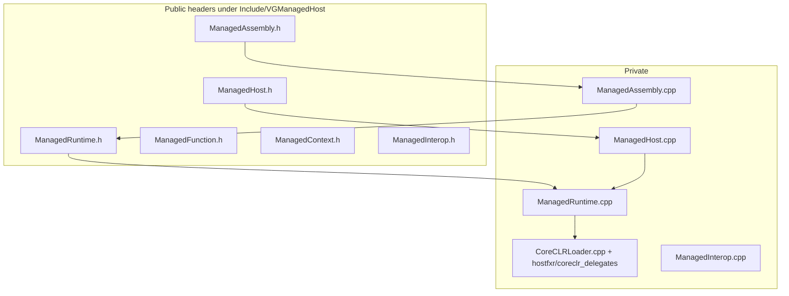
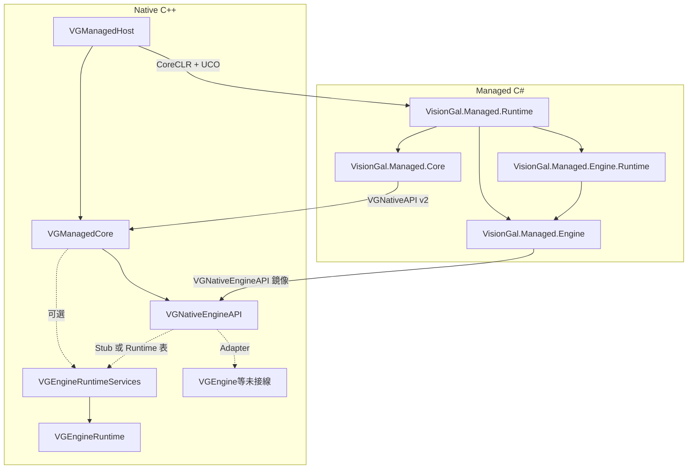

# MERGED — Managed 子樹模組文檔合集

本文件由 `merge_docs.py` 自動生成，**請勿手改**；請編輯各子目錄 `Docs/MODULE_ARCHITECTURE_AND_PROGRESS.md`、根目錄 `MANAGED_RUNTIME_ARCHITECTURE_AND_PROGRESS.md`，以及（可選）`Engine/Source/Runtime/VGNativeEngineAPI/Docs/...`、`VGEngineRuntime/Docs/...`、`VGEngineRuntimeServices/Docs/...` 後重新執行本腳本。

共收錄 **6** 個子模組文檔 + 根總覽。


---
## Module: VGManagedCore

# VGManagedCore — Managed Runtime 基礎層（Phase 2/3：Native/Managed ABI）

## 1. 定位

| 項目 | 說明 |
|------|------|
| **職責** | 定義並實作 **VisionGal Native ↔ Managed 共享 ABI**：**`VGNativeAPI`** 函數表、預設 Native 實作（如 **`LogInfo`**）、預設 API 表單例、建表服務（**`VGNativeApiTable_BuildDefault`**）。**Phase 3**：表尾掛載 **`engineServices`** → **`VGNativeEngineAPI`**（見 Runtime 模組 **VGNativeEngineAPI**）。**不包含** CoreCLR 啟動、hostfxr、程式集載入（見 **VGManagedHost**）。 |
| **不負責** | Gameplay、對白、Editor、Hot Reload、Roslyn、反射式 Invoke、擴展元資料。 |
| **CMake 目標** | **`VGManagedCore`**（**`STATIC`**） |
| **依賴** | **`VGNativeEngineAPI`**（**`PUBLIC`** 鏈接，傳遞標頭與靜態庫使用需求）；C++ 標準庫；**不**鏈接 `nethost`。 |

---

## 2. 目錄結構

```
Engine/Source/Managed/VGManagedCore/
├── CMakeLists.txt
├── Docs/
│   └── MODULE_ARCHITECTURE_AND_PROGRESS.md   ← 本文件
├── Include/VGManagedCore/
│   ├── VGManagedCoreConfig.h
│   ├── NativeAPI.h            ← VGNativeAPI、VG_NATIVE_API_VERSION、預設 LogInfo、engineServices
│   ├── ManagedHandle.h
│   ├── ManagedABI.h
│   ├── ManagedRuntimeServices.h
│   └── ManagedExports.h       ← VGNativeApi_GetDefaultTable
├── Private/
│   ├── NativeAPI.cpp
│   ├── ManagedRuntimeServices.cpp
│   └── ManagedExports.cpp
└── Managed/VisionGal.Managed.Core/
    ├── VisionGal.Managed.Core.csproj
    ├── VGNativeApiConstants.cs
    ├── VGNativeApi.cs
    └── NativeApiBootstrap.cs
```

---

## 3. 公開 C ABI 摘要

| 符號 | 說明 |
|------|------|
| `VG_NATIVE_API_VERSION` | 與託管 `VGNativeApiConstants.ApiVersion` 對齊（**當前為 2**）。 |
| `VGNativeAPI` | `apiVersion`、`reserved0`、`logInfo`、**`engineServices`**（`const VGNativeEngineAPI*`，可為 nullptr；預設表由建表函式填寫）。 |
| `VGNativeApi_DefaultLogInfo` | 預設 `logInfo`：寫 stderr + 內部診斷計數。 |
| `VGNativeApi_GetLogInfoCallCount` | 診斷：累計 `DefaultLogInfo` 呼叫次數。 |
| `VGNativeApiTable_BuildDefault` | 填充預設表並掛載 **`VGNativeEngineApi_GetDefaultTable()`**。 |
| `VGNativeApi_RegisterLogInfoOverride` | Phase 2 占位（未改變預設表）。 |
| `VGNativeApi_GetDefaultTable` | 回傳行程內唯讀單例表指標。 |

託管鏡像與安裝邏輯見 **`VisionGal.Managed.Core`**；引擎子表鏡像見 **`VisionGal.Managed.Engine`**（由 **`VisionGal.Managed.Runtime`** 引用）。

---

## 4. 與 VGManagedHost 的邊界

- **VGManagedHost**：載入 CoreCLR、解析 **`[UnmanagedCallersOnly]`**，將 **`VGNativeApi_GetDefaultTable()`** 的指標傳給託管 **`Entry.BootstrapNativeApi`**。
- **VGManagedCore**：提供表與 Native 側函式實作；**不**包含 hostfxr。

---

## 5. Phase 路線圖（本模組）

| Phase | 內容 |
|-------|------|
| **2** | **`VGNativeAPI`** v1、`LogInfo` 閉環、託管 **`NativeApiBootstrap`**。 |
| **3（當前）** | **`VG_NATIVE_API_VERSION` = 2**、**`engineServices`** 指標、與 **VGNativeEngineAPI** 建表串接。 |
| **4+** | 擴充表欄位（版本遞增）、**`RegisterLogInfoOverride`** 真正接線、與 Gameplay 合約對齊之共享 struct（遷入 **`ManagedABI.h`** 需評審）。 |

---

## 6. 開發進展

| 日期 | 進展 |
|------|------|
| **2026-05-14** | **Phase 2 落地**：新增 **VGManagedCore** 靜態庫、`VGNativeAPI`、預設 Log、單例表、**VisionGal.Managed.Core**、Runtime **`BootstrapNativeApi`**、擴展 **VGManagedHostTest**。 |
| **2026-05-14** | **Phase 3**：遞增 **`VG_NATIVE_API_VERSION`**、掛載 **VGNativeEngineAPI**、託管 **VisionGal.Managed.Engine**、Stub 跨邊界測試。 |


---
## Module: VGManagedEngine

# VGManagedEngine — Managed Engine SDK（VisionGal.Managed.Engine）

## 1. 定位

| 項目 | 說明 |
|------|------|
| **職責** | **僅**託管端 **Engine Service** 之 ABI 鏡像：`VGNativeEngineAPI` 與子表之 `[StructLayout(Sequential)]` 結構、`EngineNativeApiBootstrap` 安裝與 Stub 演練路徑、**Handle** 型別封裝。**不包含** Gameplay、對白、存檔、Sequence。 |
| **不負責** | CoreCLR 宿主、**`VGNativeAPI`** 宿主級欄位定義（見 **VisionGal.Managed.Core**）。 |
| **程式集** | **`VisionGal.Managed.Engine`**（`net10.0`，`AllowUnsafeBlocks`）、**`VisionGal.Managed.Engine.Runtime`**（薄封裝） |
| **依賴** | **VisionGal.Managed.Core**（取得 `VGNativeApi` / `VGNativeApiConstants`）。**Engine.Runtime** 另依賴 **VisionGal.Managed.Engine**。 |

---

## 2. 目錄結構

```
Engine/Source/Managed/VGManagedEngine/
├── Docs/
│   └── MODULE_ARCHITECTURE_AND_PROGRESS.md   ← 本文件
└── Managed/
    ├── VisionGal.Managed.Engine/
    │   ├── VisionGal.Managed.Engine.csproj
    │   ├── VGNativeEngineApiConstants.cs
    │   ├── VGNativeHandles.cs
    │   ├── VGNativeEngineApiTypes.cs
    │   └── EngineNativeApiBootstrap.cs
    └── VisionGal.Managed.Engine.Runtime/
        ├── VisionGal.Managed.Engine.Runtime.csproj
        └── EngineTime.cs
```

---

## 3. 公開 API 摘要

| 類型 / 成員 | 說明 |
|-------------|------|
| `VGNativeEngineApiConstants.LayoutVersion` | 與 Native `VG_NATIVE_ENGINE_API_LAYOUT_VERSION` 對齊。 |
| `VGNativeEngineApi` 等 | 與 C 頭 `EngineAPIRegistry.h` 欄位順序一致之鏡像。 |
| `EngineNativeApiBootstrap.InstallFromNativeApiTable` | 由 `VGNativeAPI*` 解析 `engineServices` 並按值快取函數指標。 |
| `EngineNativeApiBootstrap.ExerciseStubInteropPath` | 測試用：演練 **Timing**（含 Phase 4 擴充欄位）與 **AsyncWait** 三件套。 |
| **`EngineTime`**（**VisionGal.Managed.Engine.Runtime**） | 讀取已安裝 ABI 之 **DeltaTime** / **TotalTime** / **FrameIndex**。 |

---

## 4. 與 VisionGal.Managed.Runtime 的關係

- **`Entry.BootstrapNativeApi`** 在 **`NativeApiBootstrap.Install`** 之後呼叫 **`EngineNativeApiBootstrap.InstallFromNativeApiTable`** 與 **`ExerciseStubInteropPath`**。
- **`VisionGal.Managed.Runtime.csproj`** 以 `ProjectReference` 引用 **Engine** 與 **Engine.Runtime**；**`VGManagedHost/CMakeLists.txt`** 之 `dotnet publish` 依賴列表已納入兩目錄之 `*.cs`。

---

## 5. Phase 路線圖（本模組）

| Phase | 內容 |
|-------|------|
| **3** | 鏡像 Stub 表、Bootstrap、演練路徑。 |
| **4（當前）** | **`LayoutVersion` = 2** 鏡像、**Engine.Runtime** 薄封裝。 |
| **5+** | 依子系統新增 **Service 封裝類**（如正式 `VGRenderService`），仍禁止在此層撰寫 Gameplay。 |

---

## 6. 開發進展

| 日期 | 進展 |
|------|------|
| **2026-05-14** | 新增 **VisionGal.Managed.Engine** 與本模組文檔；與 **VGNativeEngineAPI** 完成跨邊界 Stub 驗證。 |
| **2026-05-14** | 新增 **VisionGal.Managed.Engine.Runtime**（**EngineTime**）與 ABI **layout v2** 鏡像欄位。 |


---
## Module: VGManagedHost

# VGManagedHost — Managed Runtime Host（CoreCLR / nethost）

## 1. 定位

| 项目 | 说明 |
|------|------|
| **职责** | **仅**负责：启动 CoreCLR、程序集加载、`load_assembly_and_get_function_pointer` 获取函数指针、运行时生命周期、多程序集登记、**Native → Managed** 的 UCO 调用解析。封装 **nethost / hostfxr**，对外头文件 **不暴露** `hostfxr.h` 类型。 |
| **不负责** | **不包含** `VGNativeAPI` 结构定义与引擎业务 ABI（见 **VGManagedCore**）；不负责 Gameplay、Editor、UI、对白、Sequence、Reflection Invoke、Hot Reload、Roslyn。 |
| **CMake 目标** | **`VGManagedHost`**（`SHARED`） |
| **依赖** | vcpkg **`nethost`**；**`PRIVATE`** 链接 **`VGManagedCore`**（ABI 默认实现随本 DLL 静态合并）。 |
| **根 CMake 选项** | **`VISIONGAL_ENABLE_MANAGED_HOST`**：Windows MSVC 默认 **ON**，其余平台默认 **OFF**；为 **OFF** 时不加入本子目录，避免未安装 `nethost` 的机器无法 configure。 |

---

## 2. CMake 与 vcpkg

| 项目 | 说明 |
|------|------|
| **安装** | 在所用 triplet 上执行：`vcpkg install nethost`（例如 `x64-windows`）。根 [CMakeLists.txt](../../../../../CMakeLists.txt) 已配置默认 `CMAKE_TOOLCHAIN_FILE` 指向 `E:/vcpkg/...`（可按本机修改）。 |
| **编译定义** | `PRIVATE VG_MANAGED_HOST_EXPORT` → **`VG_MANAGED_HOST_API`**（见 [VGManagedHostConfig.h](../Include/VGManagedHost/VGManagedHostConfig.h)）。 |
| **包含目录** | `PUBLIC`：`Include/`（对外 `#include "VGManagedHost/..."`）；`PRIVATE`：`Private/`（仅 **`CoreCLRLoader`** 等实现翻译单元使用，**禁止**作为引擎其它模块的 `PUBLIC` 依赖路径）。 |
| **非 Windows** | 若启用本模块，`CoreCLRLoader` 使用 `dlopen` / `dlsym`，`target_link_libraries(VGManagedHost PRIVATE dl)`（Unix 非 Apple）。 |
| **托管测试产物** | 缓存变量 **`VISIONGAL_MANAGED_PUBLISH_DIR`**（默认 `${CMAKE_BINARY_DIR}/ManagedRuntimePublish`）。若找到 **`dotnet`**，生成 **`visiongal_managed_runtime_publish`**：`dotnet publish` [VisionGal.Managed.Runtime.csproj](../Managed/VisionGal.Managed.Runtime/VisionGal.Managed.Runtime.csproj)（输出含 **`VisionGal.Managed.Core.dll`**、**`VisionGal.Managed.Engine.dll`**；`DEPENDS` 同時監視 Core 與 Engine 工程原始碼）。 |

### 2.1 单元测试（GTest）

| 项目 | 说明 |
|------|------|
| **条件** | `ENABLE_TESTS=ON` **且** 找到 **`dotnet`** 可执行文件。 |
| **目标** | **`VGManagedHostTest`**（[Engine/Source/Tests/VGManagedHostTest](../../../Tests/VGManagedHostTest/)） |
| **依赖** | `add_dependencies(VGManagedHostTest visiongal_managed_runtime_publish)`，保证先发布托管程序集。 |
| **运行时 DLL** | `POST_BUILD` 将 **`VGManagedHost.dll`** 复制到测试 exe 同目录，避免 `bin` 与 `lib` 分离导致加载失败。 |
| **ctest 环境变量** | **`VGMANAGED_TEST_ROOT`** = `VISIONGAL_MANAGED_PUBLISH_DIR`，目录内需含 **`VisionGal.Managed.Runtime.dll`**、**`VisionGal.Managed.Core.dll`**、**`VisionGal.Managed.Engine.dll`** 与 **`.runtimeconfig.json`**。 |

构建与测试示例（在已安装 `nethost` 与 .NET 8 SDK 的前提下）：

```bat
cmake -B build -DCMAKE_TOOLCHAIN_FILE=E:/vcpkg/scripts/buildsystems/vcpkg.cmake -DENABLE_TESTS=ON -DVISIONGAL_ENABLE_MANAGED_HOST=ON
cmake --build build --config Debug --target VGManagedHostTest visiongal_managed_runtime_publish
ctest -C Debug -R VGManagedHost --output-on-failure
```

---

## 3. 架构与分层



- **`CoreCLRLoader`**：唯一包含 **`nethost.h` / `hostfxr.h` / `coreclr_delegates.h`** 的翻译单元路径；负责 `get_hostfxr_path`、加载 **hostfxr**、**`hostfxr_initialize_for_runtime_config`**、**`hostfxr_get_runtime_delegate(hdt_load_assembly_and_get_function_pointer)`**、以及 **`load_assembly_and_get_function_pointer`** 调用链。
- **`VGManagedRuntime`**：运行时状态、**多程序集**路径登记、`TryResolveUnmanagedCallersOnly`（UTF-8 类型名/方法名 → 内部宽字符/UTF-8 与 `char_t` 对齐）。
- **`VGManagedHost`**：薄门面：`Initialize` / `LoadAssembly` / `TryGetUnmanagedCallersOnly` / `Shutdown` / `Runtime()`；**`PRIVATE`** 依赖 **VGManagedCore**（不在此头文件暴露 `VGNativeAPI` 定义）。
- **`VGManagedRuntimeContext`**：仅 **`void*`** 快照字段（**不透明**），供诊断或后续扩展；**不要**在引擎其它处将其转型为 hostfxr 类型。

---

## 3.1 Phase 2 与 VGManagedCore 边界

- **`VGNativeAPI`、默认 `LogInfo`、`VGNativeApi_GetDefaultTable`**：定义与实现位于 **[VGManagedCore](../../VGManagedCore/)**（**STATIC**），**不**进入 `Include/VGManagedHost` 公共头；宿主通过 **`PRIVATE`** 链接与 `#include "VGManagedCore/..."` 使用。
- **典型流程**：宿主解析 **`VisionGal.Managed.Runtime.Entry.BootstrapNativeApi`**，将 **`VGNativeApi_GetDefaultTable()`** 的指针传入托管；托管侧通过 **VisionGal.Managed.Core** 安装函数表并回调 **`logInfo`**；**Phase 3** 起由 **VisionGal.Managed.Engine** 解析 **`engineServices`** 並演練 Stub 路徑（無引擎 `DllImport`）。
- **测试**：`VGManagedHostTest` 中 **`BootstrapNativeApiCallsNativeLogInfo`** 依赖上述链路与 `VGManagedHost_GetNativeLogInfoCallCountForTest`（见 §5.2）。

---

## 4. 目录结构（与仓库一致）

```
Engine/Source/Managed/VGManagedHost/
├── CMakeLists.txt
├── Docs/
│   └── MODULE_ARCHITECTURE_AND_PROGRESS.md
├── Include/VGManagedHost/
│   ├── VGManagedHostConfig.h
│   ├── ManagedHost.h
│   ├── ManagedRuntime.h
│   ├── ManagedAssembly.h
│   ├── ManagedFunction.h
│   ├── ManagedContext.h
│   └── ManagedInterop.h
├── Private/
│   ├── CoreCLRLoader.h
│   ├── CoreCLRLoader.cpp
│   ├── ManagedHost.cpp
│   ├── ManagedRuntime.cpp
│   ├── ManagedAssembly.cpp
│   └── ManagedInterop.cpp
└── Managed/VisionGal.Managed.Runtime/
    ├── VisionGal.Managed.Runtime.csproj
    └── Entry.cs
```

---

## 5. 公开 API 说明（Phase 1–2）

### 5.1 `VGManagedHost` — [ManagedHost.h](../Include/VGManagedHost/ManagedHost.h)

| 方法 | 说明 |
|------|------|
| `VGManagedHost()` / `~VGManagedHost()` | 构造/析构；析构会关闭运行时。 |
| `bool Initialize(const std::filesystem::path& runtime_config_json, const std::filesystem::path* assembly_path_hint = nullptr)` | 使用给定 **`.runtimeconfig.json`** 初始化 hostfxr 上下文并缓存 **`load_assembly_and_get_function_pointer`**。建议传入 **`assembly_path_hint`** 指向同应用旁的 **`.dll`**，便于 **nethost** 解析匹配的 **hostfxr**。 |
| `bool LoadAssembly(const std::filesystem::path& assembly_path)` | 将程序集路径登记为多程序集宿主的一部分（Phase 1 不做额外校验；解析时以传入路径为准）。 |
| `bool TryGetUnmanagedCallersOnly(const std::filesystem::path& assembly_path, const char* type_utf8, const char* method_utf8, void** out_fn)` | 通过 **`load_assembly_and_get_function_pointer`** 与 **`UNMANAGEDCALLERSONLY_METHOD`** 解析 **`[UnmanagedCallersOnly]`** 静态方法；**`out_fn`** 为原始函数指针，由调用方按 ABI 转型（见 `VGManagedVoidThunk`）。**`type_utf8`** 为 CLR 类型名（含命名空间，如 `VisionGal.Managed.Runtime.Entry`）。 |
| `void Shutdown()` | 关闭 host 上下文并卸载 **hostfxr** 动态库。 |
| `VGManagedRuntime& Runtime()` | 访问底层运行时对象（高级用法 / 测试）。 |

### 5.2 测试用导出（Phase 2）

| 符号 | 说明 |
|------|------|
| `extern "C" VGManagedHost_GetNativeLogInfoCallCountForTest()` | 返回 **`VGNativeApi_DefaultLogInfo`** 累计调用次数，供 **GTest** 断言 **C# → Native** 经 **`VGNativeAPI`** 的闭环；**非**游戏发行公共 API。实现见 [ManagedHost.cpp](../Private/ManagedHost.cpp)。 |

### 5.3 `VGManagedRuntime` — [ManagedRuntime.h](../Include/VGManagedHost/ManagedRuntime.h)

| 方法 | 说明 |
|------|------|
| `Initialize` / `Shutdown` | 与 `VGManagedHost` 对应；`Shutdown` 清空已加载程序集登记。 |
| `void* LoadAssemblyDelegate() const` | 返回缓存的 **`load_assembly_and_get_function_pointer`** 指针（**不透明**）；仅供诊断或后续内部扩展。 |
| `void FillContextSnapshot(VGManagedRuntimeContext& out) const` | 填充 **`hostfxrHostContext`**（hostfxr 句柄地址）与 **`loadAssemblyAndGetFunctionPointerDelegate`**。 |
| `bool RegisterLoadedAssembly(...)` | 以规范化路径字符串为键登记多程序集。 |
| `bool TryResolveUnmanagedCallersOnly(...)` | 与 `VGManagedHost::TryGetUnmanagedCallersOnly` 相同语义。 |

### 5.4 `VGManagedAssembly` — [ManagedAssembly.h](../Include/VGManagedHost/ManagedAssembly.h)

| 方法 | 说明 |
|------|------|
| `explicit VGManagedAssembly(std::filesystem::path assemblyPath)` | 绑定某一托管 DLL 路径。 |
| `bool TryGetUnmanagedCallersOnly(VGManagedRuntime& runtime, const char* type_utf8, const char* method_utf8, void** outFunction) const` | 对构造时路径做解析；内部转调 **`VGManagedRuntime::TryResolveUnmanagedCallersOnly`**。 |

### 5.5 `VGManagedVoidThunk` — [ManagedFunction.h](../Include/VGManagedHost/ManagedFunction.h)

| 类型 | 说明 |
|------|------|
| `VGManagedVoidThunk` | Phase 1 无参无返回值 smoke 签名：Windows 为 **`void(__stdcall*)()`**，其它平台为 **`void(*)()`**。与托管侧 **`[UnmanagedCallersOnly(CallConvs = new[] { typeof(CallConvStdcall) })]`（Windows）** 对齐。 |

### 5.6 `VGManagedRuntimeContext` — [ManagedContext.h](../Include/VGManagedHost/ManagedContext.h)

| 字段 | 说明 |
|------|------|
| `void* hostfxrHostContext` | **不透明**：当前为 hostfxr host context 指针值。 |
| `void* loadAssemblyAndGetFunctionPointerDelegate` | **不透明**：缓存的 **`load_assembly_and_get_function_pointer`** 函数指针。 |

### 5.7 `VGManagedInterop`（Windows）— [ManagedInterop.h](../Include/VGManagedHost/ManagedInterop.h)

| 函数 | 说明 |
|------|------|
| `std::wstring Utf8ToWide(const char* utf8, std::size_t len = -1)` | UTF-8 → UTF-16，供与 **`char_t`**（宽字符）API 互操作。 |
| `std::wstring PathToWide(const std::filesystem::path& path)` | 路径 → 宽字符串（MSVC **`path::native()`**）。 |

---

## 6. 托管侧约定（Phase 1–2）

- 工程：**`net8.0`**，见 [VisionGal.Managed.Runtime.csproj](../Managed/VisionGal.Managed.Runtime/VisionGal.Managed.Runtime.csproj)；**ProjectReference** → **`VisionGal.Managed.Core`**（源码树位于 [VGManagedCore/Managed/VisionGal.Managed.Core](../../VGManagedCore/Managed/VisionGal.Managed.Core/)）。
- 入口：[Entry.cs](../Managed/VisionGal.Managed.Runtime/Entry.cs) — **`Smoke`**（Phase 1）；**`BootstrapNativeApi`**（Phase 2）接收 **`VGNativeAPI*`**（以 **`nint`** 传递），内部调用 **`NativeApiBootstrap`**（**Managed.Core**）。
- **C# → Native**：经 **`VGNativeAPI.logInfo`** 函数指针；**禁止**对引擎 DLL 使用 **`DllImport`**（Phase 2 起为硬约束方向）。

---

## 7. Phase 路线图（未实现部分仅规划）

| Phase | 内容 |
|-------|------|
| **1** | CoreCLR 启动、`load_assembly_and_get_function_pointer`、多程序集登记、GTest **`Smoke`**。 |
| **2（已完成于 VGManagedCore）** | **`VGNativeAPI`** 函数指针表、托管 **VisionGal.Managed.Core**、**`BootstrapNativeApi`**、GTest **`BootstrapNativeApiCallsNativeLogInfo`**。 |
| **3** | `VGManagedGameplay`：Gameplay / Async / Sequence 与托管运行时对接（依赖 ABI 评审）。 |
| **4** | `VGManagedEditor`：编辑器工具链。 |
| **5** | `AssemblyLoadContext`、Hot Reload、扩展重载。 |

---

## 8. 开发进展与变更记录

| 日期 | 进展 |
|------|------|
| **2026-05-14** | **Phase 1 落地**：新增 **`VGManagedHost`** 模块；**`CoreCLRLoader`** 封装 nethost + hostfxr；**`VGManagedHost` / `VGManagedRuntime` / `VGManagedAssembly`** 公开 API；**`VisionGal.Managed.Runtime`** smoke 程序集；**`VGManagedHostTest`** + **`visiongal_managed_runtime_publish`**；根 **`VISIONGAL_ENABLE_MANAGED_HOST`** 选项。 |
| **2026-05-14** | **Phase 2**：**`PRIVATE`** 链接 **`VGManagedCore`**；托管 **`BootstrapNativeApi`** + **`VisionGal.Managed.Core`**；测试导出 **`VGManagedHost_GetNativeLogInfoCallCountForTest`**；扩展 **GTest** 与 publish 依赖 **Core** 源码。 |

---

## 9. 已知限制与注意事项

- 需要本机安装 **.NET 8** 运行时/SDK，以便 **`dotnet publish`** 与 **`runtimeconfig.json`** 解析框架依赖。
- **`Initialize`** 所给 **`.runtimeconfig.json`** 必须与待加载的托管 DLL 框架版本一致（测试使用同一 publish 目录）。
- 引擎其它模块 **默认不链接** **`VGManagedHost`**，避免过早耦合；由宿主进程或测试目标按需 **`target_link_libraries(... VGManagedHost)`**。


---
## Module: VGEngineRuntime

# VGEngineRuntime — 行程級 Runtime Facade（Phase 4）

## 1. 定位

| 項目 | 說明 |
|------|------|
| **職責** | 提供 **`VGEngineRuntime`** 單例：`Initialize` / `Tick` / `Shutdown`；內建 **TimingSystem**（`std::chrono` 語意之累積時間與帧序）、**AsyncSystem**（背景 `std::thread` + 可輪詢完成）、**SceneSubsystem** / **AssetSubsystem** 空殼（未接 **VGEngine** / **VGAsset** 前回傳明確無效值）。 |
| **不負責** | 不鏈結 **VGEngine**、**VGRHI**、**VGUI**；不提供 Gameplay / 對白。 |
| **CMake 目標** | **`VGEngineRuntime`**（**`STATIC`**） |
| **依賴** | **`VGNativeEngineAPI`**（僅 **EngineHandles** 等標頭）。 |

---

## 2. 執行緒與生命週期

- **`Tick`** 須由與 **`Initialize` / `Shutdown` 相同之控制執行緒**呼叫（與未來 game loop 對齊）。
- **`Shutdown`** 會 **join** 尚未 **`releaseWait`** 之背景執行緒；請勿於 Async 回呼內呼叫 **`Shutdown`**。

---

## 3. 開發進展

| 日期 | 進展 |
|------|------|
| **2026-05-14** | Phase 4 首包：新增本靜態庫與子系統骨架；供 **VGEngineRuntimeServices** 轉發 ABI。 |


---
## Module: VGEngineRuntimeServices

# VGEngineRuntimeServices — Engine Service ABI Adapter（Phase 4）

## 1. 定位

| 項目 | 說明 |
|------|------|
| **職責** | 實作 **`VGNativeEngineApiTable_BuildRuntime`**：以 **`VGNativeEngineApiTable_BuildDefault`** 為基底，覆寫 **Timing**、**AsyncWait**、**Scene** 擴充欄位、**Asset** 擴充欄位，轉發至 **`VGEngineRuntime`**；並提供 **`VGNativeEngineApi_GetRuntimeTable`**、宿主輔助 **`VGEngineRuntimeHost_*`**。 |
| **不負責** | 不取代 **Stub** 目標（**`VGNativeEngineApi_GetDefaultTable`** 仍供純 Stub 測試）；Render / UI / Audio / Input 等仍沿用 Stub 函數指標。 |
| **CMake 目標** | **`VGEngineRuntimeServices`**（**`STATIC`**） |
| **依賴** | **`VGNativeEngineAPI`**、**`VGEngineRuntime`**。 |

---

## 2. 與 VGManagedCore 的關係

- CMake 選項 **`VISIONGAL_USE_ENGINE_RUNTIME_SERVICES`**（預設 **ON**）：**`VGNativeApiTable_BuildDefault`** 將 **`engineServices`** 設為 **`VGNativeEngineApi_GetRuntimeTable()`**；**OFF** 時仍使用 **`VGNativeEngineApi_GetDefaultTable()`**。

---

## 3. 開發進展

| 日期 | 進展 |
|------|------|
| **2026-05-14** | Phase 4 首包：新增本適配層與 **Runtime** 建表路徑。 |


---
## Module: VGNativeEngineAPI

# VGNativeEngineAPI — Native Engine Service ABI（Phase 3～4）

## 1. 定位

| 項目 | 說明 |
|------|------|
| **職責** | 僅承載 **Engine Runtime 服務層** 之 C 可互操作 **函數表聚合**（`VGNativeEngineAPI`）：Render、UI、Audio、Asset、Input、Scene、Timing、AsyncWait。**不包含** Gameplay、對白、變數、存檔、Sequence、Editor。 |
| **不負責** | 不連結 **VGEngine** / **VGRHI** / **VGUI**（RmlUi）；本模組提供 **Stub** 實作與診斷計數；**Timing / Async** 等之 **Runtime** 轉發由 **VGEngineRuntimeServices**（可選 CMake）覆寫函數指標。 |
| **CMake 目標** | **`VGNativeEngineAPI`**（**`STATIC`**） |
| **依賴** | 僅 C++ 標準庫。 |

---

## 2. 目錄結構

```
Engine/Source/Runtime/VGNativeEngineAPI/
├── CMakeLists.txt
├── Docs/
│   └── MODULE_ARCHITECTURE_AND_PROGRESS.md   ← 本文件
├── Include/VGNativeEngineAPI/
│   ├── NativeInterop.h
│   ├── EngineHandles.h
│   ├── RenderAPI.h
│   ├── UIAPI.h
│   ├── AudioAPI.h
│   ├── AssetAPI.h
│   ├── InputAPI.h
│   ├── SceneAPI.h
│   ├── TimingAPI.h
│   ├── AsyncWaitAPI.h
│   ├── EngineAPIRegistry.h
│   ├── NativeEngineAPI.h
│   └── VGNativeEngineApiConfig.h
└── Private/
    └── VGNativeEngineApiStubs.cpp
```

---

## 3. 公開 ABI 摘要

| 符號 / 概念 | 說明 |
|-------------|------|
| `VG_NATIVE_ENGINE_API_LAYOUT_VERSION` | 聚合體佈局版本；與託管 `VGNativeEngineApiConstants.LayoutVersion` 對齊。 |
| `VGNativeEngineAPI` | 子表：`render`、`ui`、`audio`、`asset`、`input`、`scene`、`timing`、`asyncWait`。 |
| `VGNativeEngineApiTable_BuildDefault` | 填充 Stub 函數指標。 |
| `VGNativeEngineApi_GetDefaultTable` | 行程內單例唯讀表指標（純 Stub）。 |
| `VGNativeEngineApi_GetStubInvokeCount` | 測試用：Stub 被呼叫之累計次數。 |
| **Handle typedef** | `VGTextureHandle`、`VGRenderTargetHandle`、`VGElementHandle`、`VGAudioHandle`、`VGAssetHandle`、`VGAsyncWaitHandle`、`VGEntityHandle` 皆為 `uint64_t`；**0** 表無效。 |
| **`VG_NATIVE_ENGINE_API_LAYOUT_VERSION`** | Phase 4 起為 **2**（Timing / Scene / Asset 子表尾擴充）。 |

**`extern "C"` 政策**：僅模組邊界導出上述建表 / 取表 / 診斷符號；業務能力一律經由 **函數表欄位** 間接呼叫。

---

## 4. 與 VGManagedCore 的關係

- **`VGNativeApiTable_BuildDefault`**（VGManagedCore）依 **`VISIONGAL_USE_ENGINE_RUNTIME_SERVICES`**：將 **`VGNativeAPI.engineServices`** 設為 **`VGNativeEngineApi_GetRuntimeTable()`** 或 **`VGNativeEngineApi_GetDefaultTable()`**。
- **`VG_NATIVE_API_VERSION`** 已遞增至 **2**，表尾追加 **`engineServices`** 指標欄位（不重排舊欄位）。

---

## 5. Phase 路線圖（本模組）

| Phase | 內容 |
|-------|------|
| **3** | 子 API 頭檔拆分、聚合體、Stub、`GetStubInvokeCount`、與 **VisionGal.Managed.Engine** 鏡像對齊。 |
| **4（當前）** | **`layoutVersion` = 2**：Timing（`getTotalTime` / `getFrameIndex`）、Scene 擴充、Asset 擴充；Runtime 轉發見 **VGEngineRuntimeServices**。 |
| **5+** | Adapter：將其餘 Stub 替換為呼叫 **VGEngine** / **VGRHI** / **VGUI**；維持 ABI 佈局或遞增 `layoutVersion`。 |

---

## 6. 開發進展

| 日期 | 進展 |
|------|------|
| **2026-05-14** | **Phase 3 落地**：新增本模組、預設 Stub、GTest 經託管 **ExerciseStubInteropPath** 驗證 Stub 計數遞增。 |
| **2026-05-14** | **Phase 4**：`layoutVersion` 遞增至 **2**；擴充子表欄位；與 **VGEngineRuntimeServices** 對齊之 Runtime 路徑。 |


---
## FinalOverview: MANAGED_RUNTIME_ARCHITECTURE_AND_PROGRESS.md

# VisionGal Managed Runtime — 架構與總進度

本文檔描述 **Managed Runtime** 分層、當前完成度與後續規劃。實作細節以各子模組 `Docs/MODULE_ARCHITECTURE_AND_PROGRESS.md` 為準；Native **Engine Service ABI** 另見 [VGNativeEngineAPI/Docs/MODULE_ARCHITECTURE_AND_PROGRESS.md](../Runtime/VGNativeEngineAPI/Docs/MODULE_ARCHITECTURE_AND_PROGRESS.md)。

---

## 1. 分層總覽



| 層級 | 模組 / 程式集 | 職責 |
|------|----------------|------|
| **Native Runtime Host** | **VGManagedHost** | CoreCLR 生命週期、nethost/hostfxr、`load_assembly_and_get_function_pointer`、多程式集登記；**不**承載業務 ABI。 |
| **Managed Runtime Foundation** | **VGManagedCore** + **VisionGal.Managed.Core** | **`VGNativeAPI`**、預設 Native 實作、託管鏡像與 **無 DllImport** 之函數表引導；**v2** 起掛載 **`engineServices`**。 |
| **Managed Engine SDK** | **VGNativeEngineAPI**（Native）+ **VisionGal.Managed.Engine** | **僅** Engine Service 函數表 ABI 與託管鏡像、Handle 型別、Stub / 未來 Adapter 接線點。**不含** Gameplay。 |
| **Engine Runtime（Native）** | **VGEngineRuntime** + **VGEngineRuntimeServices** | 行程級 **Timing / Async** 狀態機與 ABI 覆寫層；**不**鏈結完整 **VGEngine**（首包刻意減輕 Host 測試鏈）。 |
| **Managed Engine Runtime 薄封裝** | **VisionGal.Managed.Engine.Runtime** | 讀已安裝 ABI 之 **EngineTime** 等；依賴 **VisionGal.Managed.Engine**，**不**含 Gameplay。 |
| **託管入口程式集** | **VisionGal.Managed.Runtime** | `[UnmanagedCallersOnly]` 匯出、Bootstrap **Core + Engine**（並引用 **Engine.Runtime**）。 |
| **未來** | *VGManagedGameplay、VGManagedEditor* | 依 **穩定後之 ABI**；當前階段不實施。 |

---

## 2. Phase 總覽

| Phase | 名稱 | 狀態 | 說明 |
|-------|------|------|------|
| **1** | Native Runtime Host | **已完成** | C++ → C# 單向 UCO；見 [VGManagedHost/Docs/MODULE_ARCHITECTURE_AND_PROGRESS.md](VGManagedHost/Docs/MODULE_ARCHITECTURE_AND_PROGRESS.md)。 |
| **2** | Managed ABI Foundation | **已完成** | **VGManagedCore** + **`VGNativeAPI`** + **VisionGal.Managed.Core** + `BootstrapNativeApi` → Native `LogInfo` 閉環。 |
| **3** | Managed Engine Runtime Foundation | **已完成** | **VGNativeEngineAPI**（函數表 + Stub）、**`VG_NATIVE_API_VERSION` = 2** 與 **`engineServices`**、**VisionGal.Managed.Engine**、Handle 與 **AsyncWait** 最小 ABI。 |
| **4** | Engine Runtime Service Integration | **已完成（首包切片）** | **`VG_NATIVE_ENGINE_API_LAYOUT_VERSION` = 2**（Timing / Scene / Asset 表尾擴充）、**VGEngineRuntime**、**VGEngineRuntimeServices**、CMake **`VISIONGAL_USE_ENGINE_RUNTIME_SERVICES`**、**VisionGal.Managed.Engine.Runtime**、**VGManagedHostTest** 於 Runtime 模式下之 Tick / timing / async 斷言。**不含** Gameplay、**不**在 Host 測試鏈鏈結完整 **VGEngine**。 |
| **5** | VGManagedGameplay | 未開始 | 對白 / Sequence / 變數等 **需在 Engine ABI 評審後** 遷入。 |
| **6** | VGManagedEditor | 未開始 | 編輯器工具鏈與宿主 ABI 對齊。 |
| **7** | Hot Reload / ALC | 未開始 | `AssemblyLoadContext`、擴充卸載等。 |
| **8** | VGManagedRoslyn | 未開始 | 腳本編譯管線（依賴 ABI 穩定）。 |

**當前刻意不做**：Gameplay Runtime、Dialogue Runtime、Save、Sequence 產品化、Roslyn、Hot Reload、Visual Script——直至 **Engine Runtime ABI** 與 Adapter 策略定型。

---

## 3. 關鍵設計決策（摘要）

1. **函數表優先**：託管端經 **`VGNativeAPI*`** 與 **`VGNativeEngineAPI*`** 間接呼叫引擎能力，避免散落 `DllImport`。
2. **版本欄位**：**`VG_NATIVE_API_VERSION`** 與 **`VGNativeApiConstants.ApiVersion`** 同步；**`VG_NATIVE_ENGINE_API_LAYOUT_VERSION`** 與 **`VGNativeEngineApiConstants.LayoutVersion`** 同步；破壞性佈局變更必須遞增。
3. **Host 不膨脹**：hostfxr 細節封裝在 **VGManagedHost**；宿主級 ABI 在 **VGManagedCore**；Engine 服務 ABI 在 **VGNativeEngineAPI**。
4. **靜態合併**：**VGManagedCore** 以 **STATIC** 鏈入 **VGManagedHost.dll**；**VGNativeEngineAPI** 以 **STATIC** 鏈入 **VGManagedCore**；若啟用 **`VISIONGAL_USE_ENGINE_RUNTIME_SERVICES`**，另以 **STATIC** 鏈入 **VGEngineRuntimeServices** 與 **VGEngineRuntime**。
5. **Handle 邊界**：資源以 **uint64** Handle 暴露；**禁止**託管層持有 C++ 物件指標穿越 ABI。

---

## 4. 建置與測試（Windows / MSVC）

前提：vcpkg **`nethost`**、**.NET 10 SDK**（與 `net10.0` 目標一致）、根 **CMake** 中 `VISIONGAL_ENABLE_MANAGED_HOST=ON`、`ENABLE_TESTS=ON`。

```bat
cmake -B build -DCMAKE_TOOLCHAIN_FILE=<你的 vcpkg>/scripts/buildsystems/vcpkg.cmake -DENABLE_TESTS=ON -DVISIONGAL_ENABLE_MANAGED_HOST=ON
cmake --build build --config Debug --target VGManagedHostTest visiongal_managed_runtime_publish
ctest -C Debug -R VGManagedHost --output-on-failure
```

`dotnet publish` 由 **VGManagedHost/CMakeLists.txt** 驅動，輸出含 **VisionGal.Managed.Runtime.dll**、**VisionGal.Managed.Core.dll**、**VisionGal.Managed.Engine.dll**、**VisionGal.Managed.Engine.Runtime.dll**。

---

## 5. 變更記錄

| 日期 | 說明 |
|------|------|
| **2026-05-14** | 新增 **VGManagedCore**、**VisionGal.Managed.Core**；擴展 **VGManagedHostTest**（Phase 2 ABI）；本總覽文檔首版。 |
| **2026-05-14** | **Phase 3**：新增 **VGNativeEngineAPI**、**VisionGal.Managed.Engine**；**VG_NATIVE_API_VERSION** 升級至 2；總覽與子模組文檔更新。 |
| **2026-05-14** | **Phase 4**：**ABI layout v2**、**VGEngineRuntime** / **VGEngineRuntimeServices**、**VisionGal.Managed.Engine.Runtime**、**VISIONGAL_USE_ENGINE_RUNTIME_SERVICES** 選項與測試擴充。 |

---

## 6. 文檔合併

在 `Engine/Source/Managed` 執行 `python merge_docs.py` 可重新生成 **MERGED_ARCHITECTURE_AND_PROGRESS.md**（自動生成檔，請勿手改正文）。
