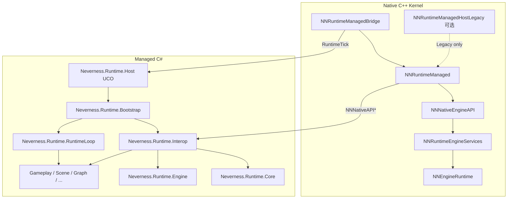

# Neverness Managed Runtime — 架构与总进度

本文档描述 **Neverness** 引擎 **托管 Runtime** 的分层、完成度与路线图。

- 上级总览：[MANAGED_ARCHITECTURE_AND_PROGRESS.md](../MANAGED_ARCHITECTURE_AND_PROGRESS.md)
- Native Kernel：[RUNTIME_ARCHITECTURE_AND_PROGRESS.md](../../Runtime/RUNTIME_ARCHITECTURE_AND_PROGRESS.md)
- Native ABI 契约：[NNNativeEngineAPI](../../Runtime/NNNativeEngineAPI/Docs/MODULE_ARCHITECTURE_AND_PROGRESS.md)

---

## 0. Neverness 主线原则（2026）

### 0.1 已确立原则

| 原则 | 说明 |
|------|------|
| **C# 主导 Runtime** | 启动（`RuntimeBootstrap`）、Interop、帧内调度、Gameplay/Scene/Graph 逻辑均在 Managed。 |
| **C++ 仅 Kernel** | Native：RHI、Platform、Window、FileSystem、Audio、Native ECS、外循环、ABI；**不**写 Galgame 产品逻辑。 |
| **不以 Host 为主路径** | `Neverness.Runtime.Host` 仅为 **UCO 导出薄层**；Legacy `NNRuntimeManagedHostLegacy` 可选、默认 OFF。 |
| **函数表 Interop** | 经 `Neverness.Runtime.Interop` 安装 API 表；禁止 `DllImport` 直调引擎。 |
| **Legacy 分界** | `VISIONGAL_BUILD_LEGACY_GALGAME`、Lua、`VGEngine::Run()` 旧循环仅兼容；新能力走 Kernel 路径。 |

### 0.2 阶段定位

- **NNNativeEngineAPI** 与托管镜像已版本化（ApiVersion **2**，LayoutVersion **10**，含 **`NNVfsAPI`** 等）。
- 重心：**Runtime Kernel 化**（统一排程、实体子系统、场景运行时），而非仅「服务表聚合」。

### 0.3 P0：Runtime Kernel 化

| 代号 | Native | Managed | 状态 |
|------|--------|---------|------|
| **P0-1** | `RuntimeScheduler`、`IRuntimeSubsystem` | `Neverness.Runtime.RuntimeLoop`（`RuntimeLoop` / `FrameScheduler` / `SubsystemScheduler` / `MainThreadDispatcher`） | **已落地** |
| **P0-2** | `NNRuntimeScene`、`NNSceneAPI` | `Neverness.Runtime.Scene`（`SceneNativeBridge`，经 ABI 访问 Native 场景图） | **已落地** |
| **P0-3** | Scene Runtime / Streaming | `Neverness.Runtime.Scene` 扩展 + Native **VGSceneRuntime** | **进行中** |
| **P0-4** | — | Managed Component 框架 | **未开始** |
| **P0-5** | **不**做 Native Graph VM | `Neverness.Runtime.Graph` → 未来 Graph.Runtime | **未开始** |

### 0.4 P1～P2 索引

| 阶段 | 内容 |
|------|------|
| **P1** | Editor 产品化、Asset Pipeline C# 化、Graph.Runtime |
| **P2** | GameFramework、Hot Reload / ALC、Roslyn |

### 0.5 Runtime 主导权迁移（M-1～M-6，2026-05-19）

| 阶段 | 内容 | 状态 |
|------|------|------|
| **M-1** | `Neverness.Runtime.Bootstrap` + `Entry` UCO + 可选 `Neverness.Runtime.App` | **已落地** |
| **M-2** | `Neverness.Runtime.Interop` 独立程序集 | **已落地** |
| **M-3** | `NNRuntimeManagedHostLegacy`，默认不构建 | **已落地** |
| **M-4** | `Entry` 仅 `Bootstrap` / `GetApiVersion` / `RuntimeTick`；演练迁入 xUnit | **已落地** |
| **M-5** | `RuntimeLoop` 重构 | **已落地** |
| **M-6** | `NNRuntimeManagedBridge`、`NNEngineRuntimeHost_TickManaged`、`NNRuntimeApplication` / **`NNApplicationAPI`** | **6a/6b 已落地**；`NEVERNESS_USE_RUNTIME_KERNEL` Editor 路径已接线；完整 Editor UI 迁移 **6c 待续** |

**入口双模式**

| 模式 | 说明 |
|------|------|
| **A（默认）** | Native 外循环 → 每帧 `Entry.RuntimeTick(dt)` |
| **B（调试）** | `Neverness.Runtime.App` Headless 外循环 |

---

## 1. 分层总览



### 1.1 模块职责表

| 层级 | 程序集 | 职责 |
|------|--------|------|
| **UCO 导出** | `Neverness.Runtime.Host` | `Entry.Bootstrap` / `GetApiVersion` / `RuntimeTick` → 转发 Bootstrap |
| **启动与循环** | `Neverness.Runtime.Bootstrap` | `RuntimeBootstrap`、`RuntimeInitializer`、`RuntimeMainLoop` |
| **Interop** | `Neverness.Runtime.Interop` | `NativeApiBootstrap`、`EngineNativeApiBootstrap`、`NativeHandleBridge` |
| **托管 Kernel** | `Neverness.Runtime.RuntimeLoop` | 帧管线：Early → Fixed → Update → Late → MainThread → Render |
| **ABI 镜像** | `Neverness.Runtime.Core` / `.Engine` | 结构体镜像与常量；**不含** Bootstrap 逻辑 |
| **Application** | `Neverness.Runtime.Application` | `ApplicationHost`（SDL 生命周期/事件泵/帧边界）+ `WindowHost`（`NNWindowAPI`） |
| **VFS** | `Neverness.Runtime.VFS` | `VFS.ReadText` / `WriteText` / `ReadBytes`（`NNVfsAPI` 函数表） |
| **地基** | Object、Reflection、Serialization、Assets | Unity 式基础设施 |
| **产品** | Gameplay、Scene、Graph、Inspector | Galgame / 工具向产品逻辑；场景实体经 **NNSceneAPI** |
| **Native ABI DLL** | `NevernessRuntime-Managed` | `NNNativeApi_GetDefaultTable()` 等 C 导出 |
| **Legacy（可选）** | `NNRuntimeManagedHostLegacy` | CoreCLR + hostfxr；**非**主路径 |

---

## 2. 模块文档索引

| 程序集 | 文档 |
|--------|------|
| `Neverness.Runtime.Bootstrap` | [Bootstrap/Docs](Neverness.Runtime.Bootstrap/Docs/MODULE_ARCHITECTURE_AND_PROGRESS.md) |
| `Neverness.Runtime.Interop` | [Interop/Docs](Neverness.Runtime.Interop/Docs/MODULE_ARCHITECTURE_AND_PROGRESS.md) |
| `Neverness.Runtime.Host` | [Host/Docs](Neverness.Runtime.Host/Docs/MODULE_ARCHITECTURE_AND_PROGRESS.md) |
| `Neverness.Runtime.RuntimeLoop` | [RuntimeLoop/Docs](Neverness.Runtime.RuntimeLoop/Docs/MODULE_ARCHITECTURE_AND_PROGRESS.md) |
| `Neverness.Runtime.Core` | [Core/Docs](Neverness.Runtime.Core/Docs/MODULE_ARCHITECTURE_AND_PROGRESS.md) |
| `Neverness.Runtime.Engine` | [Engine/Docs](Neverness.Runtime.Engine/Docs/MODULE_ARCHITECTURE_AND_PROGRESS.md) |
| `Neverness.Runtime.Application` | [Application/Docs](Neverness.Runtime.Application/Docs/MODULE_ARCHITECTURE_AND_PROGRESS.md) |
| `Neverness.Runtime.Object` | [Object/Docs](Neverness.Runtime.Object/Docs/MODULE_ARCHITECTURE_AND_PROGRESS.md) |
| `Neverness.Runtime.Reflection` | [Reflection/Docs](Neverness.Runtime.Reflection/Docs/MODULE_ARCHITECTURE_AND_PROGRESS.md) |
| `Neverness.Runtime.Serialization` | [Serialization/Docs](Neverness.Runtime.Serialization/Docs/MODULE_ARCHITECTURE_AND_PROGRESS.md) |
| `Neverness.Runtime.Assets` | [Assets/Docs](Neverness.Runtime.Assets/Docs/MODULE_ARCHITECTURE_AND_PROGRESS.md) |
| `Neverness.Runtime.Scene` | [Scene/Docs](Neverness.Runtime.Scene/Docs/MODULE_ARCHITECTURE_AND_PROGRESS.md) |
| `Neverness.Runtime.Gameplay` | [Gameplay/Docs](Neverness.Runtime.Gameplay/Docs/MODULE_ARCHITECTURE_AND_PROGRESS.md) |
| `Neverness.Runtime.Graph` | [Graph/Docs](Neverness.Runtime.Graph/Docs/MODULE_ARCHITECTURE_AND_PROGRESS.md) |
| `Neverness.Runtime.Inspector` | [Inspector/Docs](Neverness.Runtime.Inspector/Docs/MODULE_ARCHITECTURE_AND_PROGRESS.md) |
| `Neverness.Runtime.Scripting` | [Scripting/Docs](Neverness.Runtime.Scripting/Docs/MODULE_ARCHITECTURE_AND_PROGRESS.md) |
| `Neverness.Runtime.UndoRedo` | [UndoRedo/Docs](Neverness.Runtime.UndoRedo/Docs/MODULE_ARCHITECTURE_AND_PROGRESS.md) |

---

## 3. Phase 历史（ABI 与地基）

| Phase | 名称 | 状态 |
|-------|------|------|
| 1～2 | Native ABI + 托管镜像 | **已完成** |
| 3 | Engine Service ABI | **已完成** |
| 4 | `NNEngineRuntime` / EngineServices | **已完成（首包）** |
| 5 | Object / Scene / Assets 地基 | **已完成** |
| 6 | Gameplay（托管 slice 2–5） | **托管已落地**；Native Gameplay/存盘 ABI **待定** |
| 7～9 | Editor / Hot Reload / Roslyn | **未开始** |

演练逻辑已自 `Entry` 迁至 **Foundation.Tests**（`FoundationBootstrapDrillTests`、`GameplayBootstrapDrillTests`、`InteropSmokeTests` 等）。

---

## 4. 关键设计决策

1. **函数表优先**：`NNNativeAPI` / `NNNativeEngineAPI` 间接调用；版本字段与 Native 同步。
2. **Bootstrap 不膨胀**：启动顺序集中在 `RuntimeInitializer`；Interop 独立程序集。
3. **Host 程序集语义**：`Neverness.Runtime.Host` = UCO 导出层，**不是** CoreCLR 宿主。
4. **双 DLL（Legacy 时）**：`NevernessRuntime-ManagedHostLegacy.dll` + `NevernessRuntime-Managed.dll` 仅 Legacy 路径需要。
5. **Handle 边界**：`uint64` Handle；禁止托管持有 C++ 裸指针穿越 ABI。
6. **场景单一权威**：场景图存储在 Native；Managed `SceneEntity` 仅为 `NNEntityHandle` 薄门面。`NNEntityAPI`（Kernel Tick）与 `NNSceneAPI`（场景图）语义分离。

---

## 5. 构建与测试

```powershell
dotnet test Engine\Source\Managed\Runtime\Tests\NevernessRuntimeManaged-Foundation.Tests.csproj -c Debug
```

Native Kernel 与 Bridge 见 [RUNTIME_ARCHITECTURE_AND_PROGRESS.md](../../Runtime/RUNTIME_ARCHITECTURE_AND_PROGRESS.md)。

---

## 6. 变更记录

| 日期 | 说明 |
|------|------|
| **2026-05-19** | 全文重写：**Neverness** 品牌；**C# 主导 / C++ Kernel**；去除 Host 主路径叙事；对齐 M-1～M-6 落地状态；模块索引更新。 |
| **2026-05-19** | 删除 **Neverness.Runtime.Entity**；**Scene** 改为经 **NNSceneAPI** 的 Native ABI 薄门面（P0-2）。 |
