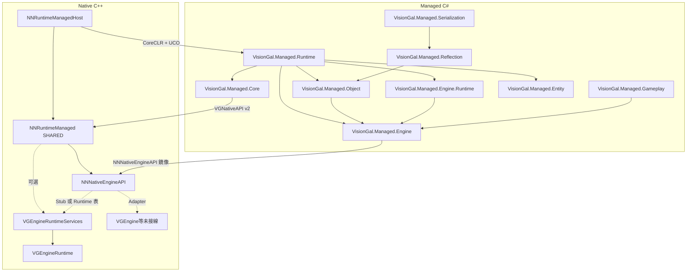

# MERGED — Managed 子樹模組文檔合集

本文件由 `merge_docs.py` 自動生成，**請勿手改**；請編輯各子目錄 `Docs/MODULE_ARCHITECTURE_AND_PROGRESS.md`、根目錄 `MANAGED_RUNTIME_ARCHITECTURE_AND_PROGRESS.md`，以及（可選）`Engine/Source/Runtime/NNNativeEngineAPI/Docs/...`、`NNRuntimeNativeEngineAPIStub/Docs/...`、`NNRuntimeEngine/Docs/...`、`NNRuntimeEngineServices/Docs/...` 後重新執行本腳本。

共收錄 **15** 個子模組文檔 + 根總覽。


---
## Module: Assets

# VGManagedAssets — 資產 GUID 與登記表（VisionGal.Managed.Assets）

## 1. 定位

| 項目 | 說明 |
|------|------|
| **職責** | **GUID**（128-bit，與 Native NNGuid 互操作）、**AssetDatabase**、**ImportPipeline**、**DependencyTracking**。 |
| **程式集** | **VisionGal.Managed.Assets**（`net10.0`，`AllowUnsafeBlocks`） |
| **依賴** | **VisionGal.Managed.Object**、**VisionGal.Managed.Engine** |

## 2. 匯入回退（Phase 5 加固）

- 優先 **`AssetRegistry.importAsset`**（Native）。
- Native 回傳零 GUID 時，使用 **`GUID.FromDeterministicPath`**（FNV-1a 穩定雜湊），**禁止**對虛擬路徑呼叫 **`GUID.Parse`**。
- **`AssetDatabase.ClearForTesting`**：清空託管快取（不呼叫 Native 登記表）。

## 3. Phase 5 進展

| 日期 | 進展 |
|------|------|
| **2026-05-15** | 初始模組：GUID、資產登記、匯入管線、依賴追蹤。 |
| **2026-05-15** | **加固**：確定性路徑 GUID；`ImportPipeline` 註解與測試；Bootstrap 演練 **Import** + **TryResolveGuid**。 |


---
## Module: Core

# NevernessRuntimeManaged-Core — 托管 ABI 镜像（Phase 2/3）

## 1. 定位

| 项目 | 说明 |
|------|------|
| **职责** | **VGNativeAPI** 的 C# 逐字段镜像、**`NativeApiBootstrap`**（禁止 `DllImport` 调引擎，经函数表间接调用）、**`VGNativeApiConstants`** 版本常量。 |
| **不负责** | Native 表构建、CoreCLR 宿主、Engine Service 子表定义（见 **Neverness.Managed.Engine**）。 |
| **程序集** | **`NevernessRuntimeManaged-Core`**（`net10.0`） |
| **命名空间** | **`Neverness.Managed.Core`** |
| **Native 契约** | [`Runtime/NNRuntimeManaged`](../../../../Runtime/NNRuntimeManaged/Docs/MODULE_ARCHITECTURE_AND_PROGRESS.md)（**`NevernessRuntime-Managed`** SHARED） |

---

## 2. 目录结构

```
Engine/Source/Managed/Runtime/Core/
├── NevernessRuntimeManaged-Core.csproj
├── VGNativeApiConstants.cs
├── VGNativeApi.cs              ← 镜像 Runtime/NNRuntimeManaged/Include/NativeAPI.h
├── NativeApiBootstrap.cs
└── Docs/
    └── MODULE_ARCHITECTURE_AND_PROGRESS.md   ← 本文件
```

---

## 3. 与 VGManagedHost 的边界

- **`Entry.BootstrapNativeApi`**（**NevernessRuntimeManaged-Runtime**）接收 Native 传入的 **`VGNativeAPI*`**，委托 **`NativeApiBootstrap.Install`**。
- 表指针由 **`VGNativeApi_GetDefaultTable()`**（**NNRuntimeManaged.dll**）提供，不由本程序集导出。

---

## 4. 开发进展

| 日期 | 进展 |
|------|------|
| **2026-05-14** | **Phase 2**：**VisionGal.Managed.Core** 首包；后重命名为 **NevernessRuntimeManaged-Core**。 |
| **2026-05-14** | **Phase 3**：**`EngineServices`** 字段与 **Neverness.Managed.Engine** 对齐。 |
| **2026-05-18** | Native ABI 迁至 **NNRuntimeManaged**；本模块仅保留 C# 镜像与 Bootstrap。 |


---
## Module: Engine

# VGManagedEngine — Managed Engine SDK（VisionGal.Managed.Engine）

## 1. 定位

| 項目 | 說明 |
|------|------|
| **職責** | **僅**託管端 **Engine Service** 之 ABI 鏡像：`NNNativeEngineAPI` 與子表之 `[StructLayout(Sequential)]` 結構（含 **layout v4** 之 **`NNEntityApi`**、**layout v5** 尾部 **`GetRuntimeTick`**）、`EngineNativeApiBootstrap` 安裝與 Stub 演練路徑、**Handle** 型別封裝。**不包含** Gameplay、對白、存檔、Sequence。 |
| **不負責** | CoreCLR 宿主、**`VGNativeAPI`** 宿主級欄位定義（見 **VisionGal.Managed.Core**）。 |
| **程式集** | **`VisionGal.Managed.Engine`**（`net10.0`，`AllowUnsafeBlocks`）、**`VisionGal.Managed.Engine.Runtime`**（薄封裝） |
| **依賴** | **VisionGal.Managed.Core**（取得 `VGNativeApi` / `VGNativeApiConstants`）。**Engine.Runtime** 另依賴 **VisionGal.Managed.Engine**。 |

---

## 2. 目錄結構

```
Engine/Source/Managed/VGManagedEngine/
├── Docs/
│   └── MODULE_ARCHITECTURE_AND_PROGRESS.md   ← 本文件
└── Managed/
    ├── VisionGal.Managed.Engine/
    │   ├── VisionGal.Managed.Engine.csproj
    │   ├── NNNativeEngineApiConstants.cs
    │   ├── NNNativeHandles.cs
    │   ├── NNNativeEngineApiTypes.cs
    │   └── EngineNativeApiBootstrap.cs
    └── VisionGal.Managed.Engine.Runtime/
        ├── VisionGal.Managed.Engine.Runtime.csproj
        └── EngineTime.cs
```

---

## 3. 公開 API 摘要

| 類型 / 成員 | 說明 |
|-------------|------|
| `NNNativeEngineApiConstants.LayoutVersion` | 與 Native `NN_NATIVE_ENGINE_API_LAYOUT_VERSION` 對齊（**4** 起含 **`NNEntityAPI`**；**5** 起含 **`GetRuntimeTick`**）。 |
| `NNNativeEngineApiConstants.EntityServiceAbiToken` | 與 Native `NN_ENTITY_SERVICE_ABI_TOKEN`（`EntityAPI.h`）一致之服務魔數。 |
| `NNNativeEngineApi` 等 | 與 C 頭 `EngineAPIRegistry.h` 欄位順序一致之鏡像（末尾 **`Entity`** 對應 **`NNEntityAPI`**）。 |
| `EngineNativeApiBootstrap.InstallFromNativeApiTable` | 由 `VGNativeAPI*` 解析 `engineServices` 並按值快取函數指標。 |
| `EngineNativeApiBootstrap.ExerciseStubInteropPath` | 測試用：演練 **Timing**（含 Phase 4 擴充欄位）、**AsyncWait** 三件套，及 **layout v5** 之 **`Entity.GetServiceAbiToken`** / **`GetRuntimeTick`** 冒煙。 |
| **`EngineTime`**（**VisionGal.Managed.Engine.Runtime**） | 讀取已安裝 ABI 之 **DeltaTime** / **TotalTime** / **FrameIndex**。 |

---

## 4. 與 VisionGal.Managed.Runtime 的關係

- **`Entry.BootstrapNativeApi`** 在 **`NativeApiBootstrap.Install`** 之後呼叫 **`EngineNativeApiBootstrap.InstallFromNativeApiTable`** 與 **`ExerciseStubInteropPath`**。
- **`VisionGal.Managed.Runtime.csproj`** 以 `ProjectReference` 引用 **Engine** 與 **Engine.Runtime**；**`VGManagedHost/CMakeLists.txt`** 之 `dotnet publish` 依賴列表已納入兩目錄之 `*.cs`。

---

## 5. Phase 路線圖（本模組）

| Phase | 內容 |
|-------|------|
| **3** | 鏡像 Stub 表、Bootstrap、演練路徑。 |
| **4（當前）** | **`LayoutVersion` = 5** 鏡像（含 **`NNEntityApi`**、**`GetRuntimeTick`**）、**Engine.Runtime** 薄封裝。 |
| **5+** | 依子系統新增 **Service 封裝類**（如正式 `VGRenderService`），仍禁止在此層撰寫 Gameplay。 |

---

## 6. 開發進展

| 日期 | 進展 |
|------|------|
| **2026-05-14** | 新增 **VisionGal.Managed.Engine** 與本模組文檔；與 **NNNativeEngineAPI** 完成跨邊界 Stub 驗證。 |
| **2026-05-14** | 新增 **VisionGal.Managed.Engine.Runtime**（**EngineTime**）與 ABI **layout v2** 鏡像欄位。 |
| **2026-05-15** | **layout v4**：**`NNEntityApi`**、**`EntityServiceAbiToken`**、**`ExerciseStubInteropPath`** 擴充；與 **NNNativeEngineAPI**／MANAGED **§2.7.1** 對齊。 |
| **2026-05-15** | **layout v5**：**`GetRuntimeTick`**、**`LayoutVersion` = 5**；**ExerciseStubInteropPath** 擴充；MANAGED **§2.7.1 Kernel 首包** 對齊。 |
| **2026-05-15** | **P0 註解收口**：**`NNNativeEngineApiConstants`** 補充 **layout v5** 語義與與 Native 版本不一致時之拒絕安裝行為說明（對齊 **InstallFromNativeApiTable**）。 |
| **2026-05-15** | **P0 對齊審計**：**`NNEntityApi`** **remarks** 擴充 **GetRuntimeTick** 與 **EntityWorld** 無鏡像承諾、欄位順序與 C 一致；**merge_docs** 刷新 **MERGED**。 |


---
## Module: Entity

# VGManagedEntity — 託管實體／元件世界（VisionGal.Managed.Entity）

## 1. 定位

| 項目 | 說明 |
|------|------|
| **職責** | P0：**EntityHandle**（Index + Generation）、**EntityWorld**（Spawn / Destroy / IsAlive；泛型與 **Type** 鍵 **HasComponent**／**TryGetComponent**／**GetComponent**／**RemoveComponent**；**GetComponentCount**；泛型 **TryGet**）、**VGComponent** 基底與 **Transform / Name / Active / Hierarchy** 元件、**ComponentPool** 骨架、**ComponentRegistry** 工廠表、**EntityArchetype** 枚舉占位。 |
| **程式集** | **VisionGal.Managed.Entity**（`net10.0`） |
| **依賴** | 無（僅 BCL） |
| **消費方** | **VisionGal.Managed.Runtime**（專案參考，納入 publish）；Foundation 單元測試。 |
| **不負責** | Native **VGEntitySystem** 完整實作；與 **SceneEntity** JSON 再水合無自動對應（並存，遷移另議）。**`NNEntityAPI`** Kernel 首包（**layout v5**、**`BuildRuntime`** 覆寫 **`entity.*`**）見 **VisionGal.Managed.Engine** 鏡像與 MANAGED **§2.7.1**；**EntityWorld** 與 Native **並存、非自動同步**（見 **§2.7.1** 資料策略）。 |

### 1.1 雙世界策略（2026 主線，MANAGED **§0.3** P0-2）

| 世界 | 職責 |
|------|------|
| **Native（目標）** | Runtime 實體句柄、場景圖、流式載入、**Transform**、渲染附掛等（**VGEntitySystem**／**VGSceneRuntime** 演進中）。 |
| **Managed（本程式集）** | **Gameplay ECS**：**EntityWorld** 純 C# 元件表與查詢；**不**承諾與 Kernel 資料結構自動鏡像；對齊透 **Gameplay 變數**、顯式 Facade 或未來窄橋接。 |

## 2. 與 VGManagedScene 之關係

- **SceneEntity**（`VisionGal.Managed.Scene`）仍為 VGObject 生命週期與序列化路徑；**EntityWorld** 為純託管 ECS 風格內核首包。
- 未來可選：劇本層橋接、或 **VGSceneRuntime** 載入後向 **EntityWorld** 顯式灌入元件（見總覽 **§0.3** **P0-3**；**非**自動同步）。

## 3. 完成度與進度總覽（2026-05-15）

| 區塊 | 狀態 |
|------|------|
| **核心型別** | **EntityHandle**、**EntityWorld**、**VGComponent** 已落地；**slice 2** 泛型 **HasComponent**／**GetComponent**；**slice 3** **GetComponentCount** 與行內中文註解；**slice 4** **HasComponent(handle, Type)**／**TryGetComponent(handle, Type, out)**（與 **ComponentRegistry.TryCreate** 鍵一致）；**slice 5** **GetComponent(handle, Type)**／**RemoveComponent(handle, Type)**（與泛型面對稱）；公開成員與 **EntityWorld** 已補中文 XML／行內註解。 |
| **基礎元件** | **Transform / Name / Active / Hierarchy** 首包欄位就緒；無自動與 Scene 同步。 |
| **擴展點** | **ComponentRegistry**（靜態工廠）、**ComponentPool**（骨架）、**EntityArchetype**（占位）。 |
| **測試** | **EntityWorldTests**（掛件／Destroy、工廠路徑、泛型與非泛型查詢／**Get**／**Remove**、**GetComponentCount**、世代偽造 Handle）；見 **VisionGal.Managed.Foundation.Tests**。 |
| **發佈鏈** | **VisionGal.Managed.Runtime** → publish；**VGManagedHost** CMake **DEPENDS**；**VGManagedHostTest** 斷言 **VisionGal.Managed.Entity.dll**。 |

## 4. 開發進展（變更記錄）

| 日期 | 進展 |
|------|------|
| **2026-05-15** | **首包**：託管實體世界與基礎元件；Runtime 參考；CMake `DEPENDS`；**VGManagedHostTest**；**EntityWorldTests**。 |
| **2026-05-15** | **補強**：程式集內公開 API 與 **EntityWorldTests** 補充詳細中文註解；本 MODULE 增「完成度與進度總覽」表；總覽 **MANAGED_RUNTIME** **§2.5 / §2.5.1** 同步。 |
| **2026-05-19** | **slice 2**：**EntityWorld.HasComponent** / **GetComponent**；**EntityWorld** 類 **remarks**（與 Native **NNEntityHandle** 無自動映射）；**EntityWorldTests** 擴充；總覽 **§2.5.2**、**§2.7.1** 交叉。 |
| **2026-05-20** | **slice 3**：**EntityWorld.GetComponentCount**；**Spawn**／**Destroy**／**IsAlive** 等行內中文註解補強；**EntityWorldTests** 計數與偽造世代；總覽 **§2.5.3**。 |
| **2026-05-21** | **slice 4**：**HasComponent(EntityHandle, Type)**、**TryGetComponent(EntityHandle, Type, out)**；**ThrowIfInvalidComponentLookupType**；**EntityWorldTests** 參數校驗與與泛型引用一致；總覽 **§2.5.4**。 |
| **2026-05-15** | **slice 5**：**GetComponent(EntityHandle, Type)**、**RemoveComponent(EntityHandle, Type)**；**EntityWorldTests** 對稱閉環；總覽 **§2.5.5**。 |
| **2026-05-15** | **§2.7.1 首包（跨棧）**：Native **`NNEntityAPI`** 子表骨架（**`getServiceAbiToken`**）與本模組邊界文檔更新；**EntityWorld** 仍純 C#。 |
| **2026-05-15** | **§2.7.1 Kernel 首包（layout v5）**：**`getRuntimeTick`**、**EntitySubsystem**、**`BuildRuntime`** **`entity.*`** 轉發；本 MODULE 更新殘留項與 **EntityWorld** 資料策略（並存、非自動同步）。 |
| **2026-05-15** | **P0 總覽對齊**：**EntityWorld** 類 **remarks** 明示 **NNEntityAPI**／**getRuntimeTick** 與託管資料無鏡像承諾；與 MANAGED **§2.7.1**／**§2.5** 同步。 |
| **2026-05-15** | **§0 雙世界**：新增 **§1.1** 表；與 MANAGED **§0.3** **P0-2** 對齊。 |

## 5. 未完成與後續

- 完整 **VGEntitySystem** 實作、**EntityWorld** 與 Native **資料鏡像**之顯式橋接（**不**在本模組單方承諾自動灌入）；**`NNEntityAPI`** Kernel 首包（**layout v5**）見 MANAGED **§2.7.1**。
- Archetype 批次分配、SoA **ComponentStorage**、多執行緒查表與查詢 API。
- 獨立 **VisionGal.Managed.Component**（序列化／反射元資料）與本模組拆分評審。

## 6. 近期規劃（對齊總覽 §2.7）

| 優先級 | 方向 |
|--------|------|
| **P0 下一跳** | **VGEntitySystem** 本體、**EntityWorld**／Native **顯式橋接**與產品級 Facade（**§2.7.1** Kernel 首包已 **layout v5**）；**總路線**見 MANAGED **§0.3** **P0-2**。 |
| **P1** | **VGSceneRuntime** 與託管 **VisionGal.Managed.Scene.Runtime**（**§0.3** **P0-3**）。 |
| **長期** | 與 **Graph.Runtime**、Gameplay 序列步驟之資料邊對齊（不本模組單方承諾時程）。 |


---
## Module: Gameplay

# VGManagedGameplay — Galgame 執行時（VisionGal.Managed.Gameplay）

## 1. 定位

| 項目 | 說明 |
|------|------|
| **職責** | Phase 6：**GameplayVariableStore**（託管變數表 + **JSON 快照** `ToJson` / `TryParseFromJson`）、**GameplaySessionSnapshot**（會話根 JSON：`variableStoreJson` + 可選 `sceneJson`）、**DialoguePresenter**、**SequenceRunner** / **ISequenceStep**（SetVariable / PresentDialogue / **RehydrateScene** / **SyncFirstEntityDisplayNameToVariable**；slice 5：**BranchOnVariableSequenceStep**、**WaitForVariableSequenceStep**、**SequenceMachineState**、**SequenceRunner.Advance**）。 |
| **程式集** | **VisionGal.Managed.Gameplay**（`net10.0`，`AllowUnsafeBlocks`） |
| **依賴** | **VisionGal.Managed.Core**、**VisionGal.Managed.Engine**、**VisionGal.Managed.Scene**、**VisionGal.Managed.Serialization**（**VersionTolerance** 選項） |
| **消費方** | **VisionGal.Managed.Runtime**（專案參考，使 `dotnet publish` 輸出含本程式集）；Foundation 單元測試。 |
| **不負責** | Native 劇本驅動 / Sequence **ABI**、Native 專用存檔 I/O、Legacy Galgame、Roslyn / Hot Reload。長期：**Lua Sequence** 由 **VisionGal.Managed.Graph.Runtime**（**§0.3** **P0-5**，**100% Managed**）替代，見總覽 **§0**。 |

## 2. 完成度與進度總覽（2026-05-17）

| 區塊 | 狀態 |
|------|------|
| **變數與持久化** | **GameplayVariableStore**（記憶體 + **ToJson** / **TryParseFromJson**）、**CopyFrom**；**GameplaySessionSnapshot**（根 JSON + 嵌套變子表 + 可選場景）已落地並有單測。 |
| **對白** | **DialoguePresenter** 經 Engine 服務表；ABI 未安裝時 no-op。 |
| **序列編排** | **SequenceRunner**：線性 **Run**；slice 3 場景再水合步驟；slice 5 **BranchOnVariableSequenceStep**、**WaitForVariableSequenceStep**、**SequenceMachineState**、**Advance**（**Waiting** 不推進下標）。實作分檔：**SequenceRunner.cs**、**SequenceFlow.cs**。 |
| **測試** | **VisionGal.Managed.Foundation.Tests**：變數表、對白、JSON、線性序列、場景聯動（條件式）、快照、分支／等待步驟／狀態機。 |
| **與總覽 Phase 6** | 與 [MANAGED_RUNTIME_ARCHITECTURE_AND_PROGRESS.md](../../MANAGED_RUNTIME_ARCHITECTURE_AND_PROGRESS.md) **§2** 一致：**託管** slice 2–5 已落地；**Native Gameplay／存檔** 為 Phase 6 **未開始子項**，見 **§2.7** 與總覽 **§5.1** 推進順序草案。 |
| **與 Native** | 本模組不擴充 **NNNativeEngineAPI** layout；後續 **Gameplay／存檔** ABI 見總覽 **§5.1**、**§2.7**。 |

## 3. Phase 6 進展

| 日期 | 進展 |
|------|------|
| **2026-05-15** | **首包**：變數表 API、對白 Presenter（ABI 未安裝時 no-op）；**VisionGal.Managed.Foundation.Tests** 覆蓋。 |
| **2026-05-15** | **Runtime 納入 publish**：**VisionGal.Managed.Runtime** 專案參考本模組；**VGManagedHostTest** 斷言 **VisionGal.Managed.Gameplay.dll** 存在於 publish 根目錄。 |
| **2026-05-15** | **Phase 6 slice 2**：變數表 JSON（`string|bool|int64|double`）、**SequenceRunner**、**Entry.BootstrapGameplay** UCO；**GetBootstrapFlags** 新增 **FlagGameplay (1<<4)**；**VisionGal.Managed.Foundation.Tests** 覆蓋 JSON 與序列。 |
| **2026-05-15** | **Phase 6 slice 3**：**SequenceContext.ActiveScene**；**RehydrateSceneSequenceStep** / **SyncFirstEntityDisplayNameToVariableSequenceStep** 與 **SceneRehydrator** 聯動；**Entry.BootstrapGameplay** 演練；程式集新增 **VisionGal.Managed.Scene** 參考；程式碼補充中文註解。 |
| **2026-05-15** | **Phase 6 slice 4**：**GameplaySessionSnapshot**（根 JSON + 嵌套變子文檔 + 可選場景 JSON）、**GameplayVariableStore.CopyFrom**；**BootstrapGameplay** 末尾演練快照往返；**GameplaySessionSnapshotTests**。 |
| **2026-05-15** | **Phase 6 slice 5**：託管序列**條件分支**與**可恢復等待**（**Advance** + **Waiting**）；**SequenceFlow.cs**（**SequenceMachineState**、**SequenceAdvanceKind**）；**SequenceRunnerTests** 擴充；公開 API 補充簡體中文 XML。 |
| **2026-05-16** | MODULE 增 **§2 完成度與進度總覽**；與 **RUNTIME** 根 **§5.2**、**MANAGED_RUNTIME §2.5** 對齊；**SequenceRunner.cs** 步驟型別之簡體中文 XML 補強。 |
| **2026-05-17** | **§2** 對齊總覽 **§2** Phase 6「託管已落地／Native 子項待定」表述；**SequenceFlow.cs** 註解補強；驗證矩陣見總覽 **§2.5**。 |
| **2026-05-18** | Native **Gameplay／存檔** 推進順序見總覽 [MANAGED_RUNTIME_ARCHITECTURE_AND_PROGRESS.md](../../MANAGED_RUNTIME_ARCHITECTURE_AND_PROGRESS.md) **§5.1**；**GameplaySessionSnapshot** 註解補充與 Native 對接說明。 |
| **2026-05-15** | **§0**：**不負責** 擴表列出 **VisionGal.Managed.Graph.Runtime**（**P0-5**）；長期 **Lua Sequence** 遷出主線見總覽 **§0**。 |

## 4. 後續

- Native Gameplay / 存檔 **ABI**（若凍結）與實際檔案 I/O；**實施順序草案**見總覽 [MANAGED_RUNTIME_ARCHITECTURE_AND_PROGRESS.md](../../MANAGED_RUNTIME_ARCHITECTURE_AND_PROGRESS.md) **§5.1**。
- 多實體條件步驟、跨 **Advance** 邊界之巢狀等待（子序列內變數門檻）等進階編排。


---
## Module: Graph

# VGManagedGraph — 節點圖（VisionGal.Managed.Graph）

## 1. 定位

| 項目 | 說明 |
|------|------|
| **職責** | **Graph** / **GraphNode** / **GraphEdge** / **GraphPort**、**GraphValidator** 結構驗證。 |
| **程式集** | **VisionGal.Managed.Graph**（`net10.0`） |
| **依賴** | **VisionGal.Managed.Reflection** |
| **主線（2026）** | 當前為**資料模型**與驗證；執行時目標程式集 **VisionGal.Managed.Graph.Runtime**（GraphVM、NodeExecutor 等，**100% Managed**，見 [MANAGED 總覽 §0.3 P0-5](../../MANAGED_RUNTIME_ARCHITECTURE_AND_PROGRESS.md)）。**不**做 Native Graph VM。 |

## 2. Phase 5 進展

| 日期 | 進展 |
|------|------|
| **2026-05-15** | 初始模組：節點圖資料模型與驗證器。 |
| **2026-05-15** | **加固**：**GraphSerializer** 屬性註解；未納入 Bootstrap 路徑。 |
| **2026-05-15** | **§0 主線**：補充 **Graph.Runtime** 與 MANAGED **§0.3** **P0-5** 索引。 |


---
## Module: Host

# NevernessRuntimeManaged-Runtime — 托管入口程序集（C#）

## 1. 定位

| 项目 | 说明 |
|------|------|
| **职责** | **`[UnmanagedCallersOnly]`** 导出（`Entry.Smoke`、`BootstrapNativeApi`、`BootstrapEngineFoundation` 等）；聚合引用 Foundation / Gameplay / Entity 等 C# 模块；**dotnet publish** 根程序集。 |
| **不负责** | CoreCLR 启动、hostfxr（见 **[NNRuntimeManagedHost](../../../../Runtime/NNRuntimeManagedHost/Docs/MODULE_ARCHITECTURE_AND_PROGRESS.md)**）；`VGNativeAPI` Native 实现（见 **NNRuntimeManaged**）。 |
| **程序集** | **`NevernessRuntimeManaged-Runtime`** |
| **命名空间** | **`Neverness.Managed.Runtime`** |

---

## 2. 目录结构

```
Engine/Source/Managed/Runtime/Host/
├── NevernessRuntimeManaged-Runtime.csproj
├── Entry.cs
└── Docs/
    └── MODULE_ARCHITECTURE_AND_PROGRESS.md
```

---

## 3. 与 Native 宿主边界

- Native **`VGManagedHost`**（**NevernessRuntime-ManagedHost**）解析 `Neverness.Managed.Runtime.Entry, NevernessRuntimeManaged-Runtime` 上的 UCO。
- **`BootstrapNativeApi`** 接收 **`VGNativeAPI*`**，委托 **Neverness.Managed.Core** 的 **`NativeApiBootstrap.Install`**。

---

## 4. 开发进展

| 日期 | 进展 |
|------|------|
| **2026-05-14** | Phase 1 Smoke + Phase 2 BootstrapNativeApi。 |
| **2026-05-18** | Native 宿主文档迁至 **NNRuntimeManagedHost**；本文件仅描述 C# 入口程序集。 |


---
## Module: Inspector

# VGManagedInspector — Inspector 視圖（VisionGal.Managed.Inspector）

## 1. 定位

| 項目 | 說明 |
|------|------|
| **職責** | **InspectorView** 綁定反射元資料、**PropertyDrawer** 讀寫屬性值（含 Range 約束）。 |
| **程式集** | **VisionGal.Managed.Inspector**（`net10.0`） |
| **依賴** | **VisionGal.Managed.Reflection**、**VisionGal.Managed.Editor** |

## 2. Phase 5 進展

| 日期 | 進展 |
|------|------|
| **2026-05-15** | 初始模組：Inspector 視圖與屬性繪製器。 |
| **2026-05-15** | **加固**：依賴 **Reflection** 掃描規則修正；Phase 7 產品化。 |


---
## Module: Object

# VGManagedObject — 託管物件生命週期（VisionGal.Managed.Object）

## 1. 定位

| 項目 | 說明 |
|------|------|
| **職責** | 託管 **VGObject** 抽象基底、**VGObjectId** 識別、靜態 **ObjectRegistry**、經 **EngineApi.Object** 之 **NativeHandleBridge**、**LifetimeSystem** retain/release 協調。 |
| **程式集** | **VisionGal.Managed.Object**（`net10.0`，`AllowUnsafeBlocks`） |
| **依賴** | **VisionGal.Managed.Engine** |

## 2. 生命週期契約（Phase 5 加固）

- **`createObject`** 成功時 Native 引用計數為 **1**；**`CreateAndRegister`** 不再額外 `Retain`。
- **`Dispose`** → **`Release`**；引用歸零後 **`DestroyObject`**。
- **`ObjectRegistry.ClearForTesting`**：先對所有已註冊物件呼叫 **`Dispose`**，再清空表與 Id 計數器。
- **`CreateAndRegister<T>`**：以反射匹配 `(VGObjectId, NNObjectHandle)` 或三參數 `(…, string typeName)` 建構子。

## 3. 進展

| 日期 | 進展 |
|------|------|
| **2026-05-15** | 初始模組：Id / Object / Registry / Native 橋接 / 生命週期系統。 |
| **2026-05-15** | **Phase 5 加固**：ref-count、`ClearForTesting`、反射建構 **SceneEntity**。 |
| **2026-05-15** | **Phase 5.3**：**SceneRehydrator** 經 **`LifetimeSystem`** 再水合場景實體（新 Native 控制代碼）。 |

## 4. 後續

- 執行緒安全之讀寫鎖（若多執行緒存取註冊表）。


---
## Module: Reflection

# VGManagedReflection — 託管反射元資料（VisionGal.Managed.Reflection）

## 1. 定位

| 項目 | 說明 |
|------|------|
| **職責** | Inspector / 序列化共用之屬性標記（SerializeField、HideInInspector、Range）、**TypeMetadata** / **PropertyMetadata**、**ReflectionRegistry** 快取。 |
| **程式集** | **VisionGal.Managed.Reflection**（`net10.0`） |
| **依賴** | **VisionGal.Managed.Object** |

## 2. 掃描規則（Phase 5 加固）

屬性納入序列化掃描當且僅當：

- 標記 **`[SerializeField]`**，或
- 具 **public setter** 之可讀寫屬性。

（已修正運算子優先級導致 public setter 誤判之問題。）

## 3. Phase 5 進展

| 日期 | 進展 |
|------|------|
| **2026-05-15** | 初始模組：屬性標記、型別/屬性元資料、註冊表快取。 |
| **2026-05-15** | **加固**：`TypeMetadata.ScanMembers` 邏輯修正；單元測試覆蓋 **SceneEntity.DisplayName** 與 fixture 欄位。 |


---
## Module: RuntimeLoop

# VGManagedRuntimeLoop — 託管 Runtime Loop API

## 1. 定位與邊界

| 項目 | 說明 |
|------|------|
| **程式集** | **VisionGal.Managed.RuntimeLoop**（`net10.0`） |
| **職責** | 提供與 Native **`visiongal::engine::RuntimeScheduler`** 對稱之 **`ManagedRuntimeScheduler`**、**`RuntimeTickGroup`**、**`ManagedRuntimeFrameContext`**、**`IManagedRuntimeSubsystem`**；**無** **DllImport**、**無** **VisionGal.Managed.Engine** 依賴，供純 C# 宿主或單元測試演練 **PlayerLoop** 式順序。 |
| **不負責** | 不驅動 **VGEngineRuntime**、不讀寫 **NNNativeEngineAPI**；與 Native 帧之對齊僅能由產品層自行約定（未來可選 P/Invoke／Host 回調，**本模組不提供**）。 |
| **對稱關係** | 見 [VGEngineRuntime MODULE](../../../Runtime/VGEngineRuntime/Docs/MODULE_ARCHITECTURE_AND_PROGRESS.md) **RuntimeScheduler**；總覽 **P0-1** 見 [MANAGED_RUNTIME_ARCHITECTURE_AND_PROGRESS.md](../../MANAGED_RUNTIME_ARCHITECTURE_AND_PROGRESS.md) **§0.3**。 |
| **消費方** | **VisionGal.Managed.Runtime**（專案參考，納入 publish）；**VisionGal.Managed.Foundation.Tests**。 |

## 2. 目錄與公開 API

- `RuntimeTickGroup.cs` — 與 Native **RuntimeTickGroup** 語義一致。
- `ManagedRuntimeFrameContext.cs` — 只讀帧上下文。
- `IManagedRuntimeSubsystem.cs` — 子系統介面。
- `ManagedRuntimeScheduler.cs` — 註冊、**InitializeRegistered** / **ShutdownRegistered**、**Tick**（含 **FixedUpdate** 累加與每帧最大步數上限）。

## 3. 開發進展

| 日期 | 進展 |
|------|------|
| **2026-05-15** | **P0-1 首包**：新程式集與 **ManagedRuntimeScheduler**；**VisionGal.Managed.Runtime** 專案參考；**VGManagedHost** CMake **DEPENDS**；**Foundation.Tests** 順序與 **FixedUpdate** 上限用例；與 Native **RuntimeScheduler** 管線對齊說明。 |

## 4. 相關鏈接

- [MANAGED_RUNTIME_ARCHITECTURE_AND_PROGRESS.md](../../MANAGED_RUNTIME_ARCHITECTURE_AND_PROGRESS.md) **§0.3**
- [VGEngineRuntime MODULE](../../../Runtime/VGEngineRuntime/Docs/MODULE_ARCHITECTURE_AND_PROGRESS.md)


---
## Module: Scene

# VGManagedScene — 場景與 Prefab（VisionGal.Managed.Scene）

## 1. 定位

| 項目 | 說明 |
|------|------|
| **職責** | **Scene** 容器、**SceneEntity**（VGObject 衍生）、**Prefab** 實例化、與 **SceneSerializer** JSON 往返、**SceneRehydrator** 實體再水合。 |
| **程式集** | **VisionGal.Managed.Scene**（`net10.0`） |
| **依賴** | **VisionGal.Managed.Object**、**VisionGal.Managed.Serialization** |

## 2. JSON 語意

| API | 說明 |
|-----|------|
| **`ToJson`** | 序列化為含 `formatVersion` 之 DTO JSON。 |
| **`FromJson`** | 僅還原 **`SceneDocument` DTO**，不重建 **`SceneEntity`**。 |
| **`ValidateRoundTripDocument`** | 驗證名稱、實體數與 **`DisplayName`** 等屬性 payload。 |
| **`RestoreFromDocument`** | 還原僅託管 **`Scene`** 容器（不含實體）。 |
| **`RehydrateFromJson`** / **`SceneRehydrator`** | 完整再水合：經 **`LifetimeSystem`** 建立新 Native 控制代碼並套用 DTO 屬性。 |

**刻意未接線**：Native **`NNSceneAPI`**（spawn / setParent 等）之 C# 橋接層。

## 3. 進展

| 日期 | 進展 |
|------|------|
| **2026-05-15** | 初始模組：場景實體、Prefab、序列化整合。 |
| **2026-05-15** | **Phase 5 加固**：`ValidateRoundTripDocument` / `RestoreFromDocument`（僅容器）。 |
| **2026-05-15** | **Phase 5.3**：**`SceneRehydrator`**、**`RehydrateFromJson`**；Bootstrap 演練 JSON→實體往返。 |
| **2026-05-15** | **Phase 6 slice 3（消費方）**：**VisionGal.Managed.Gameplay** 之 **SequenceRunner** 經 **SceneRehydrator** 編排場景再水合（劇本層，仍無 Native **NNSceneAPI** C# 橋接）。 |
| **2026-05-15** | **§0 主線**：本模組維持 **JSON／DTO** 與再水合工具鏈；**Runtime Scene** 目標見 **VisionGal.Managed.Scene.Runtime**（MANAGED **§0.3** **P0-3**）。 |


---
## Module: Scripting

# VGManagedScripting — 腳本載入與 Roslyn（VisionGal.Managed.Scripting）

## 1. 定位

| 項目 | 說明 |
|------|------|
| **職責** | **ManagedAssemblyLoadContextHost**、**HotReloadCoordinator**、**RoslynScriptCompiler**（`VISIONGAL_ENABLE_ROSLYN` / Microsoft.CodeAnalysis.CSharp 4.14.0）。 |
| **程式集** | **VisionGal.Managed.Scripting**（`net10.0`） |
| **依賴** | **VisionGal.Managed.Core** |

## 2. Phase 5 進展

| 日期 | 進展 |
|------|------|
| **2026-05-15** | 初始模組：ALC 宿主、熱重載、Roslyn 條件編譯編譯器。 |
| **2026-05-15** | **加固**：標記為 **脚手架**（非生產）；**VISIONGAL_ENABLE_ROSLYN** 未接線；Phase 8/9。 |


---
## Module: Serialization

# VGManagedSerialization — JSON 序列化（VisionGal.Managed.Serialization）

## 1. 定位

| 項目 | 說明 |
|------|------|
| **職責** | **VersionTolerance** 格式版本、**SceneSerializer** / **AssetSerializer** / **GraphSerializer**（System.Text.Json）。 |
| **程式集** | **VisionGal.Managed.Serialization**（`net10.0`） |
| **依賴** | **VisionGal.Managed.Reflection** |

## 2. 版本策略

- 寫入時強制 **`FormatVersion = CurrentFormatVersion`**（當前 **1**）。
- 讀取時 **`PropertyNameCaseInsensitive`** + 忽略未知欄位（寬鬆模式）；未來可於反序列化後顯式校驗版本號。

## 3. 進展

| 日期 | 進展 |
|------|------|
| **2026-05-15** | 初始模組：場景/資產/圖 JSON 序列化與版本容忍。 |
| **2026-05-15** | **Phase 5 加固**：**GraphSerializer** 中文註解；**formatVersion** 單元測試。 |
| **2026-05-15** | **Phase 5.3**：**`SceneSerializer.ApplyEntryProperties`**（DTO 屬性寫回託管實例）。 |
| **2026-05-15** | **VersionTolerance**：**`VersionToleranceTests`** 驗證根層未知 JSON 欄位不阻斷反序列化。 |
| **2026-05-15** | **消費方擴充**：**VisionGal.Managed.Gameplay** 之變數表 JSON 快照沿用 **`VersionTolerance.CreateOptions()`**（與場景/資產一致）。 |
| **2026-05-15** | **Phase 6 slice 4**：**GameplaySessionSnapshot** 根 JSON 與嵌套變子文檔同樣沿用 **VersionTolerance**（與場景 DTO 寬鬆讀取策略一致）。 |


---
## Module: UndoRedo

# VGManagedUndoRedo — 撤銷/重做（VisionGal.Managed.UndoRedo）

## 1. 定位

| 項目 | 說明 |
|------|------|
| **職責** | **IUndoableCommand**、**UndoStack** 雙棧、**PropertyChangeCommand** 屬性變更撤銷。 |
| **程式集** | **VisionGal.Managed.UndoRedo**（`net10.0`） |
| **依賴** | **VisionGal.Managed.Editor**（經 Inspector 引用鏈接 Reflection） |

## 2. Phase 5 進展

| 日期 | 進展 |
|------|------|
| **2026-05-15** | 初始模組：Undo/Redo 棧與屬性變更命令。 |
| **2026-05-15** | **加固**：首包切片；與 Editor Phase 7 聯動規劃。 |


---
## FinalOverview: MANAGED_RUNTIME_ARCHITECTURE_AND_PROGRESS.md

# VisionGal Managed Runtime — 架構與總進度

本文檔描述 **Managed Runtime** 分層、當前完成度與後續規劃。**VisionGal 2026 主線原則與 P0–P2 實施路線**見 **§0**。實作細節以各子模組 `Docs/MODULE_ARCHITECTURE_AND_PROGRESS.md` 為準；Native **Engine Service ABI** 另見 [NNNativeEngineAPI](../Runtime/NNNativeEngineAPI/Docs/MODULE_ARCHITECTURE_AND_PROGRESS.md)（契约）、[NNRuntimeNativeEngineAPIStub](../Runtime/NNRuntimeNativeEngineAPIStub/Docs/MODULE_ARCHITECTURE_AND_PROGRESS.md)（Stub）。Native **Runtime** 全模組總覽見 [RUNTIME_ARCHITECTURE_AND_PROGRESS.md](../Runtime/RUNTIME_ARCHITECTURE_AND_PROGRESS.md)。

---

## 0. VisionGal 主線原則與路線（2026）

### 0.1 已確立原則

| 原則 | 說明 |
|------|------|
| **Lua Runtime 主線停止演進** | **sol2**、Lua Scene／Sequence／Gameplay／UI Bridge 等：**不再新增主線功能**，僅 **Legacy** 相容、資料遷移與 **`VISIONGAL_BUILD_LEGACY_GALGAME=ON`** 建置路徑。 |
| **RuntimeGalgame 徹底 Legacy 化** | 預設 **`VISIONGAL_BUILD_LEGACY_GALGAME=OFF`** 為**主線與舊產品線分界**；舊 Runtime **不再**承載新路線能力。 |
| **C++ 不承擔 Gameplay 產品邏輯** | **Native**：Kernel、RHI、Renderer、Asset IO、Threading、**Scene Runtime**、Host、ABI 等。**Managed C#**：Gameplay、Entity 邏輯、Graph、Sequence、Dialogue、Inspector、Editor、Asset Pipeline、GameFramework（對齊 **Unity / Godot Mono / Unreal C# Layer** 式分工）。 |

### 0.2 階段定位：後 ABI 穩定期

- **NNNativeEngineAPI** 與託管鏡像已可版本化遞進；當前重心轉為 **Runtime 真正 Kernel 化**（統一排程、實體子系統、場景執行時），而非僅「服務表聚合」。

### 0.3 第一階段主線：P0 Runtime Kernel 化

| 代號 | 方向 | Native（目標模組／能力） | Managed（目標模組／能力） | 備註 |
|------|------|--------------------------|---------------------------|------|
| **P0-1** | **Runtime 排程與 Pipeline** | **RuntimeScheduler**（**VGRuntimeScheduler** 首包：**RuntimeTickGroup**、**FixedUpdate** 累加上限、**IRuntimeSubsystem**、**RuntimeFrameContext**；**EntitySubsystem** 掛 **Update**；**LateUpdate** 末 **FlushMainThreadDelegates** 占位） | **VisionGal.Managed.RuntimeLoop**（**ManagedRuntimeScheduler** 與 Native 管線對稱；無 Engine 依賴） | **layoutVersion** 不變；**`getRuntimeTick`** 語義不變。後續：更多子系統掛載、Async 主線程隊列、**RuntimePipelineBuilder** 可配置化。 |
| **P0-2** | **VGEntitySystem 正式化** | **NNRuntimeScene** Phase 2–3 已落地（System、層級、**NN_FIELD** 字段反射、**VGSC** 二進制序列化；**VGEngineRuntime::EcsScene** + **Update** Tick）；後續 **SceneSubsystem** 橋接、C API | **EntityWorld** 與 Native **雙世界策略** | **非**全量鏡像；**NNEntity** 打包與 **EntityHandle** 一致，**仍無**自動同步／C# 組件綁定。**EntitySubsystem** + **§2.7.1** 為前置首包。 |
| **P0-3** | **VGSceneRuntime** | **NNRuntimeScene** 為 Native 存儲後端（Phase 4+：**NNPrefab**／**NNSceneRuntime** Streaming）；Phase 3 二進制快照已就緒；JSON 與 **VGManagedScene** DTO 邊界分離 | **VisionGal.Managed.Scene.Runtime** | 主線從 **JSON Scene DTO** 走向 **Runtime Scene**；JSON 再水合保留為工具／相容路徑。 |
| **P0-4** | **Managed 元件框架** | — | **VGManagedComponent**（ComponentMetadata、PropertyBag、ComponentSerializer、InspectorBinding、ComponentActivator、DefaultValuePipeline 等） | Inspector／Graph／Serialization／SaveGame／Editor 地基。 |
| **P0-5** | **Graph Runtime（Lua 替代核心）** | **不**實作 Native Graph VM | **VisionGal.Managed.Graph.Runtime**（GraphVM、NodeExecutor、FlowScheduler、SignalBus、Async／Latent Node、變數綁定等）**100% Managed** | 統一 Dialogue、Gameplay、Event、Cutscene、狀態機；**Native 不參與**，避免重蹈 **Lua Runtime** 無限膨脹。 |

### 0.4 第二至四階段（索引）

| 階段 | 內容 |
|------|------|
| **P1 Editor 產品化** | **VisionGal.Managed.Editor** 擴充（Dock、Selection、Workspace、UndoRedo、CommandBus、ToolContext）；**VisionGal.Managed.Inspector**；**VisionGal.Managed.Graph.Editor**；Asset Browser；Scene Editor。 |
| **P1 Asset Pipeline C# 化** | **VisionGal.Managed.AssetPipeline**（Importer、Metadata、Dependency、Cooker）；Native 僅 **IO／Streaming／Compression／GPU Upload**。 |
| **P2 Gameplay Framework** | **VisionGal.Managed.GameFramework**（GameInstance、World、Level、Subsystem、SaveGame、PlayerContext、GameMode 等）。 |
| **P2 熱重載與 Roslyn** | **AssemblyLoadContext**、Editor／PlayMode Domain、**VGManagedRoslyn** 等。 |

### 0.5 與本文件既有章節之關係

- **§2.7.1**：**Kernel 首包**（**layout v5**、**EntitySubsystem**、**`entity.*`** 轉發）屬 **P0-2** 前置；**完整 VGEntitySystem** 與 **雙世界策略** 仍為 **P0-2** 本體與文檔化工作。
- **Native NNRuntimeScene Phase 2–3**（2026-05-17）：見 [NNRuntimeScene/Docs/MODULE_ARCHITECTURE_AND_PROGRESS.md](../Runtime/NNRuntimeScene/Docs/MODULE_ARCHITECTURE_AND_PROGRESS.md)；字段反射與 **VGSC** 序列化首包已落地；與 **EntityHandle** 打包對齊，**不**擴展 **NNNativeEngineAPI** layout，**無** C# 自動綁定。
- **§5.1**：Phase 6 Native（Gameplay／存檔）可與 **P0** 並行規劃，須**分別 ABI 評審**與 **layoutVersion** 同步。

---

## 1. 分層總覽



| 層級 | 模組 / 程式集 | 職責 |
|------|----------------|------|
| **Native Runtime Host（可選）** | **NNRuntimeManagedHost** | CoreCLR 生命週期、nethost/hostfxr、`load_assembly_and_get_function_pointer`；**`VISIONGAL_ENABLE_MANAGED_HOST`** 預設 **OFF**；見 [NNRuntimeManagedHost/Docs](../../Runtime/NNRuntimeManagedHost/Docs/MODULE_ARCHITECTURE_AND_PROGRESS.md)。 |
| **Managed Runtime Foundation（Native）** | **NNRuntimeManaged**（`NevernessRuntime-Managed` SHARED） | **`VGNativeAPI`**、預設 Native 實作、**`VGNativeApi_GetDefaultTable`** 從 DLL 導出；**v2** 起掛載 **`engineServices`**。 |
| **Managed Runtime Foundation（C#）** | **NevernessRuntimeManaged-Core** | 託管鏡像與 **無 DllImport** 之 **`NativeApiBootstrap`**；見 [Core/Docs](Core/Docs/MODULE_ARCHITECTURE_AND_PROGRESS.md)。 |
| **Managed Engine SDK** | **NNNativeEngineAPI**（Native）+ **VisionGal.Managed.Engine** | **僅** Engine Service 函數表 ABI 與託管鏡像、Handle 型別、Stub / 未來 Adapter 接線點；**layout v4** 起含 **`NNEntityAPI`** 子表；**layout v5** 起尾部 **`getRuntimeTick`**（**§2.7.1** Kernel 首包）。**不含** Gameplay 產品邏輯。 |
| **Engine Runtime（Native）** | **VGEngineRuntime** + **VGEngineRuntimeServices** | 行程級 **Timing / Async / Scene（擴充）/ Object / AssetRegistry**、**EntitySubsystem**（**`entity.*`** Runtime 轉發；**layout v5**）等狀態機；**不**鏈結完整 **VGEngine**。 |
| **Managed Engine Runtime 薄封裝** | **VisionGal.Managed.Engine.Runtime** | 讀已安裝 ABI 之 **EngineTime** 等；依賴 **VisionGal.Managed.Engine**，**不**含 Gameplay。 |
| **Managed Engine Foundation** | **VGManagedObject**、**VGManagedReflection**、**VGManagedSerialization**、**VGManagedAssets**、**VGManagedScene** 等 | Unity 式地基：註冊表、元資料、序列化、資產 GUID、場景再水合；Editor/Inspector/Graph 為資料模型 Shell。 |
| **Managed Gameplay** | **VGManagedGameplay** + **VisionGal.Managed.Gameplay** | Galgame 變數表、**GameplaySessionSnapshot**、對白、**SequenceRunner**（含 slice 5：**BranchOnVariableSequenceStep**、**WaitForVariableSequenceStep**、**Advance**）；與 Legacy 分離。 |
| **Managed Entity（P0 首包 + slice 2–5）** | **VGManagedEntity** + **VisionGal.Managed.Entity** | 託管 **EntityWorld** / **EntityHandle** / **VGComponent** 與基礎元件；泛型與 **Type** 鍵讀寫查詢（含 **GetComponent**／**RemoveComponent** 非泛型重載）、**GetComponentCount**。Native 側 **§2.7.1 Kernel 首包**：**`NNEntityAPI`**（**layout v5**、**`getServiceAbiToken`** + **`getRuntimeTick`**）由 **VGEngineRuntimeServices** 轉發 **EntitySubsystem**；與託管 **EntityWorld** **並存、非自動同步**；完整 **VGEntitySystem**／資料鏡像仍見 **§2.7**／**§2.7.1** 殘留。 |
| **託管入口程式集** | **VisionGal.Managed.Runtime** | `[UnmanagedCallersOnly]` 匯出、Bootstrap **Core + Engine + Foundation**；專案參考 **VisionGal.Managed.RuntimeLoop**（**P0-1**）。 |
| **託管 Runtime Loop（P0-1）** | **VisionGal.Managed.RuntimeLoop** | 與 Native **RuntimeScheduler** 對稱之 **ManagedRuntimeScheduler**；無 Engine 依賴；單元測試與純 C# 宿主可演練 **TickGroup** 順序。 |
| **Legacy（可選建置）** | `Engine/Source/Legacy/**` | Galgame 執行時與編輯器；**`VISIONGAL_BUILD_LEGACY_GALGAME`** 預設 **OFF**。 |

---

## 2. Phase 總覽

| Phase | 名稱 | 狀態 | 說明 |
|-------|------|------|------|
| **1** | Native Runtime Host | **已完成** | C++ → C# 單向 UCO。 |
| **2** | Managed ABI Foundation | **已完成** | **NNRuntimeManaged** + **`VGNativeAPI`** + **NevernessRuntimeManaged-Core**。 |
| **3** | Managed Engine Runtime Foundation | **已完成** | **NNNativeEngineAPI**、**`engineServices`**、**VisionGal.Managed.Engine**。 |
| **4** | Engine Runtime Service Integration | **已完成（首包）** | **VGEngineRuntime** / **VGEngineRuntimeServices**、layout v2+、Host 測試 Tick/timing/async。 |
| **5** | Managed Engine Infrastructure | **已完成（首包 + 加固 + 5.3）** | Foundation 模組樹、**BootstrapEngineFoundation**、**SceneRehydrator** 實體再水合。 |
| **5.3** | Scene Entity Rehydration | **已完成** | **`ApplyEntryProperties`**、**`RehydrateFromJson`**、Bootstrap 演練。 |
| **6** | VGManagedGameplay | **進行中（託管 slice 2–5 已落地；Native 子項待定）** | **（託管）** 首包 + slice 2–5：**GameplayVariableStore**、**GameplaySessionSnapshot**、**DialoguePresenter**、**SequenceRunner**（**SceneRehydrator**、slice 5：**BranchOnVariableSequenceStep**、**WaitForVariableSequenceStep**、**SequenceRunner.Advance**）、**`BootstrapGameplay`** + **FlagGameplay**。**（Phase 6 Native 子項）** **Gameplay／存檔** 服務表與檔案 I/O 仍待 ABI 評審後實作。 |
| **7** | Managed Editor 產品化 | **未開始** | 真實 UI / 工具鏈（當前 Shell 資料模型）。 |
| **8** | Hot Reload / ALC | **未開始** | **VGManagedScripting** 脚手架；生產化在 Phase 8。 |
| **9** | VGManagedRoslyn | **未開始** | Roslyn 編譯管線。 |

### 2.5 Managed Runtime 總體狀態（2026-05-17，對齊 P0 **§2.7.1 Kernel** + **NNRuntimeScene Phase 2–3**）

| 維度 | 說明 |
|------|------|
| **完成度** | Phase **1–5.3** 已閉環；Native **[NNRuntimeScene](../Runtime/NNRuntimeScene/Docs/MODULE_ARCHITECTURE_AND_PROGRESS.md) Phase 2–3**（System、層級、字段反射、**VGSC** 序列化；**Engine** **Update** Tick 適配）已合入，**不**改 **NNNativeEngineAPI** layout、**不**自動同步 **EntityWorld**、**無** C# 組件自動綁定；**Phase 6 託管子階段**（slice **2–5**：變數 JSON、場景再水合序列步、會話快照、條件分支與 **Advance** 可恢復等待；見 §2.3–§2.6.1）**已落地**；**Phase 6 整體**仍標「進行中」係因 **Native Gameplay／存檔 ABI** 尚未納表。**P0 託管 Entity** 首包與 **slice 2–5** 已納 publish 與 **Foundation.Tests**。**§2.7.1 Kernel 首包**：**`NNEntityAPI`** **layout v5**（**`getServiceAbiToken`**、**`getRuntimeTick`**）、**EntitySubsystem**、**`BuildRuntime`** 覆寫 **`entity.*`**、託管鏡像與測試已落地；完整 **VGEntitySystem**、**EntityWorld** 資料鏡像、**VGSceneRuntime**、Graph Runtime、Editor 產品化仍未完成。 |
| **開發進展** | **VisionGal.Managed.Gameplay**／**Entity** 同上；Native **NevernessRuntime-Scene** 與 [RUNTIME_ARCHITECTURE_AND_PROGRESS.md](../Runtime/RUNTIME_ARCHITECTURE_AND_PROGRESS.md) **§5.2** 同步；**VisionGal.Managed.Engine**：**layout v5** 鏡像、**`NNEntityApi`**、**`EngineNativeApiBootstrap.ExerciseStubInteropPath`** 擴充 **Entity** 冒煙（含 **`GetRuntimeTick`**）；**NativeEngineApiEntityServiceTests** 校驗 **LayoutVersion** 與可選已安裝路徑；**NNNativeEngineAPI** Stub 與 **VGEngineRuntimeServices** **`BuildRuntime`** 覆寫 **`entity.*`** 轉發 **EntitySubsystem**；**VGManagedHostTest** 斷言 **layoutVersion**、魔數與（Runtime 路徑下）**`getRuntimeTick`**；各 MODULE 與 [RUNTIME_ARCHITECTURE_AND_PROGRESS.md](../Runtime/RUNTIME_ARCHITECTURE_AND_PROGRESS.md) **§5.2** 同步。 |
| **未完成項（索引）** | **§2.7** 表格：完整 **VGEntitySystem**、**NNRuntimeScene** Phase 4+（**Prefab**／Streaming／**SceneSubsystem** 橋接／C API）、**EntityWorld**／Native **資料鏡像**、Native **Gameplay／存檔** ABI、**VGSceneRuntime** 產品化、Graph.Runtime、Editor Phase 7、GameFramework、AssetPipeline、Hot Reload／Roslyn、Lua 遷出等。（**`NNEntityAPI`** Kernel 首包見 **§2.7.1**；**第一階段 Kernel 化** 五項索引見 **§0.3**。） |
| **未來規劃** | 短期：Phase 6 **Native** 子項見 **§5.1**；**P0+** 接續完整 **VGEntitySystem** 與 **EntityWorld** 資料策略實作（**不**承諾跨 ABI 自動灌入）。**第一階段 Kernel 化路線**（排程器、Scene Runtime、Graph.Runtime、Managed Component）見 **§0.3**–**§0.4**。中期：**VGSceneRuntime**、Graph、Editor；長期：ALC、Roslyn、Lua 移除。 |

#### 2.5.1 P0 託管 Entity 切片（補強）

| 項目 | 狀態 |
|------|------|
| **程式集** | **VisionGal.Managed.Entity**（`net10.0`，僅 BCL） |
| **API** | **EntityHandle**、**EntityWorld**（泛型與 **Type** 鍵：**HasComponent**／**GetComponent**／**TryGetComponent**／**RemoveComponent**／**GetComponentCount**）、**VGComponent**、基礎元件、**ComponentRegistry**、**ComponentPool** 骨架、**EntityArchetype** 占位 |
| **測試** | **EntityWorldTests**（Spawn/掛件/Destroy、工廠路徑、泛型與非泛型查詢／**GetComponent**／**RemoveComponent**、**GetComponentCount**、世代防護） |
| **發佈** | **VisionGal.Managed.Runtime** 專案參考；**visiongal_managed_runtime_publish** 產出含 **VisionGal.Managed.Entity.dll** |
| **文檔** | [VGManagedEntity/Docs/MODULE_ARCHITECTURE_AND_PROGRESS.md](VGManagedEntity/Docs/MODULE_ARCHITECTURE_AND_PROGRESS.md)；本檔 **§2.7**（未完成路線圖） |

#### 2.5.2 P0 託管 Entity slice 2（查詢 API，2026-05-19）

| 類別 | 內容 |
|------|------|
| **API** | **EntityWorld.HasComponent{T}**、**GetComponent{T}**（實體無效／未掛載時拋 **InvalidOperationException**，與 **AddComponent** 之失敗語意對齊）；**EntityWorld** 類 **remarks** 補充與 Native **NNEntityHandle** 無自動映射。 |
| **測試** | **EntityWorldTests**：**HasComponent** 掛載前後與銷毀後、**GetComponent** 與 **TryGet** 引用一致、缺件／已銷毀拋錯、偽造世代 Handle。 |

#### 2.5.3 P0 託管 Entity slice 3（元件計數與註解，2026-05-20）

| 類別 | 內容 |
|------|------|
| **API** | **EntityWorld.GetComponentCount**（僅存活實體回傳字典鍵數量，否則 0；不暴露可變集合）。 |
| **註解** | **Spawn**／**Destroy**／**IsAlive**／**AddComponent**／**RemoveComponent**／**ClearForTesting** 行內中文補強；類 **remarks** 納入 **GetComponentCount**。 |
| **測試** | **EntityWorldTests**：空實體、掛載／移除、銷毀後計數、偽造世代 Handle 為 0。 |

#### 2.5.4 P0 託管 Entity slice 4（非泛型 **Type** 鍵查詢，2026-05-21）

| 類別 | 內容 |
|------|------|
| **API** | **EntityWorld.HasComponent(EntityHandle, Type)**、**TryGetComponent(EntityHandle, Type, out VGComponent?)**；與 **ComponentRegistry.TryCreate** 之精確 **Type** 鍵一致；非法型別拋 **ArgumentException**、null 拋 **ArgumentNullException**。 |
| **註解** | **EntityWorld** 類 **remarks** 補泛型／非泛型雙路徑說明；私有 **ThrowIfInvalidComponentLookupType** 附 XML。 |
| **測試** | **EntityWorldTests**：與泛型引用一致、缺件／銷毀／偽造世代、null 與非 **VGComponent** 型別參數校驗。 |

#### 2.5.5 P0 託管 Entity slice 5（非泛型 **Type** 鍵 **GetComponent**／**RemoveComponent**，2026-05-15）

| 類別 | 內容 |
|------|------|
| **API** | **EntityWorld.GetComponent(EntityHandle, Type)**（與泛型 **GetComponent{T}** 例外語意一致；成功回傳非 null **VGComponent**）；**EntityWorld.RemoveComponent(EntityHandle, Type)**（與泛型 **RemoveComponent{T}** 一致：已死靜默返回；存活則以精確鍵移除）。 |
| **註解** | **EntityWorld** 類 **remarks** 補 **Type** 鍵與泛型成對、供資料驅動／反射路徑；**ThrowIfInvalidComponentLookupType** 擴及 **Get**／**Remove** 非泛型路徑。 |
| **測試** | **EntityWorldTests**：非泛型 **Get**／**Remove** 與泛型引用與訊息一致、**GetComponentCount** 遞減、參數校驗。 |

### 2.1 Phase 5.3 摘要（2026-05-15）

| 類別 | 內容 |
|------|------|
| **API** | **`SceneSerializer.ApplyEntryProperties`**；**`SceneRehydrator`** / **`Scene.RehydrateFromJson`**。 |
| **Bootstrap** | **`BootstrapEngineFoundation`** 在 JSON 往返後清空註冊表並再水合，驗證 **DisplayName** 與 Native **IsAlive**。 |
| **測試** | **SceneRehydrationTests**（屬性套用 + 條件式 Engine 整合）；**VersionToleranceTests**（場景 DTO 含未知根欄位仍可反序列化）。 |

### 2.2 Phase 6 首包摘要（2026-05-15）

| 類別 | 內容 |
|------|------|
| **模組** | **VGManagedGameplay** / **VisionGal.Managed.Gameplay**。 |
| **API** | **GameplayVariableStore**；**DialoguePresenter**（`NNUIApi.SetDialogueText`，未安裝 ABI 時 no-op）。 |
| **測試** | **GameplayVariableStoreTests**、**DialoguePresenterTests**。 |
| **發佈** | **VisionGal.Managed.Runtime** 專案參考 **VisionGal.Managed.Gameplay**，**ManagedRuntimePublish** 含 **VisionGal.Managed.Gameplay.dll**；**VGManagedHostTest** 校驗該檔。 |

### 2.3 Phase 6 slice 2（2026-05-15）

| 類別 | 內容 |
|------|------|
| **API** | **GameplayVariableStore.ToJson** / **TryParseFromJson**（`formatVersion` + `entries`，型別 `string\|bool\|int64\|double`）；**SequenceRunner**、**SetVariableSequenceStep**、**PresentDialogueSequenceStep**。 |
| **UCO** | **`Entry.BootstrapGameplay`**（須在 **`BootstrapNativeApi`** 之後）；**`GetBootstrapFlags`** 新增 **`FlagGameplay` = 1<<4**。 |
| **測試** | **GameplayVariableStoreJsonTests**、**SequenceRunnerTests**；**VGManagedHostTest** 斷言 Gameplay 旗標。 |

### 2.4 Phase 6 slice 3（2026-05-15）

| 類別 | 內容 |
|------|------|
| **API** | **SequenceContext.ActiveScene**；**RehydrateSceneSequenceStep**、**SyncFirstEntityDisplayNameToVariableSequenceStep**（場景 JSON → 再水合 → 首實體 **DisplayName** 寫入變數表）。 |
| **依賴** | **VisionGal.Managed.Gameplay** 新增 **ProjectReference** → **VisionGal.Managed.Scene**。 |
| **Bootstrap** | **`Entry.BootstrapGameplay`**：清空註冊表後建場景快照 → 再清空 → 序列內再水合並校驗 **rehydratedTitle** 與 **gpBootstrap**。 |
| **測試** | **SequenceRunnerTests.Run_RehydrateSceneThenSyncFirstDisplayName_WritesVariable**（僅在 **EngineNativeApiBootstrap.IsInstalled** 時執行，與 **SceneRehydrationTests** 一致）；既有 **VGManagedHostTest** 仍斷言 **FlagGameplay**。 |

### 2.6 Phase 6 slice 4（2026-05-15）

| 類別 | 內容 |
|------|------|
| **API** | **GameplaySessionSnapshot**（`formatVersion`、`variableStoreJson`、`sceneJson?`）、**Capture** / **ToJson** / **TryParseFromJson** / **ApplyTo**；**GameplayVariableStore.CopyFrom**（供快照載入覆寫變數表）。 |
| **Bootstrap** | **`Entry.BootstrapGameplay`**：序列成功後組裝快照（含當前場景 JSON）→ 根 JSON 往返 → **ApplyTo** 新表並校驗 **gpBootstrap** / **rehydratedTitle**。 |
| **測試** | **GameplaySessionSnapshotTests**（純託管往返、根層未知欄位、可選場景字串；真實場景 JSON 仍受 Engine 安裝門檻約束）。 |

### 2.6.1 Phase 6 slice 5（2026-05-15）

| 類別 | 內容 |
|------|------|
| **API** | **BranchOnVariableSequenceStep**（變數寬鬆相等則執行 then/else 子序列）；**WaitForVariableSequenceStep**（真值門闩或與期望值相等）；**SequenceMachineState**、**SequenceRunner.Advance** / **SequenceAdvanceKind**（等待步阻塞時 **Waiting**，不推進下標）。 |
| **語義** | 含等待步之劇本應以 **Advance** 輪詢；線性 **Run** 在變數條件未滿足時對等待步返回 **false**；無 Native Input / Sequence 新 ABI。 |
| **測試** | **SequenceRunnerTests**（分支 then/else、**Advance** 之 **Waiting→Completed**、**Run** 與變數門檻）。 |

### 2.7 未完成與優先路線（P0–P2）

| 優先級 | 項目 | 狀態 | 說明 |
|--------|------|------|------|
| **P0** | **VisionGal.Managed.Entity**（託管） | **首包 + slice 2–5 已落地** | **EntityWorld**（Spawn / Destroy；泛型與 **Type** 鍵 **HasComponent**／**TryGetComponent**／**GetComponent**／**RemoveComponent**；**GetComponentCount**；泛型 **TryGet**）；**VGComponent** / 基礎元件；與 **SceneEntity** 並存。Native **§2.7.1 Kernel 首包**（**`NNEntityAPI`** **layout v5**）已接線；與 **EntityWorld** **並存、非自動同步**；資料鏡像見 **§2.7.1** 殘留。 |
| **P0** | **NNEntityAPI**（Native） | **Kernel 首包已落地／完整 ECS 子系統未開始** | **`EntityAPI.h`**、**`getServiceAbiToken`**、**`getRuntimeTick`**（尾部追加）、**`NN_NATIVE_ENGINE_API_LAYOUT_VERSION` = 5**；**EntitySubsystem**（經 **RuntimeScheduler** 之 **Update** 階段遞增 **`runtimeTick`**）；**`VGEngineRuntimeServices::BuildRuntime`** 覆寫 **`entity.*`**；Stub 供 **`BuildDefault`**／OFF 路徑；**VGManagedHostTest**、**NativeEngineApiEntityServiceTests**。真實 **VGEntitySystem**、與託管 **EntityWorld** 之資料鏡像仍待後續。 |
| **P0** | **Legacy RuntimeGalgame** | **凍結** | 停止新功能；與新 C# 路線並行直至遷移。 |
| **P0** | **VGEngineRuntime** Kernel 化 | **進行中（P0-1 Scheduler 首包 + §2.7.1 Entity）** | **Timing / Async / Scene / Object / AssetRegistry** 等轉發已落地；**§2.7.1** 起 **EntitySubsystem**；**P0-1** 起 **RuntimeScheduler** 統一 **IRuntimeSubsystem** 管線（**EntitySubsystem** 於 **Update** 組；**FixedUpdate**／**LateUpdate** 占位與累加器上限與託管 **ManagedRuntimeScheduler** 對齊）。完整 **VGEntitySystem** ECS、**VGAsset** 真實管線仍為後續擴充項。 |
| **P1** | **VGSceneRuntime** + **VGSceneRuntimeAPI** + **VisionGal.Managed.Scene.Runtime** | **未開始** | Load/Unload、Prefab Runtime、Streaming、Async Scene。 |
| **P1** | **VisionGal.Managed.Graph.Runtime**（GraphVM 等） | **未開始** | 全 C#；取代 Lua Sequence 之長期目標。 |
| **P1** | **Phase 7 Editor**（Core / Graph.Editor / Inspector / AssetBrowser / SceneEditor） | **未開始** | 當前 **VGManagedEditor** 為 Shell。 |
| **P2** | **VisionGal.Managed.GameFramework** | **未開始** | GameInstance、World、Level、Subsystem、SaveGame 等。 |
| **P2** | **VisionGal.Managed.AssetPipeline** | **未開始** | Importer、Meta、Cooker、Build。 |
| **P2** | **Hot Reload / ALC / Roslyn / Managed PlayMode** | **未開始** | 對齊 Phase 8–9 與 **VGManagedScripting** 深化。 |
| **長期** | **移除 Lua**（sol2、Lua UI/Sequence/Script） | **未開始** | 依賴 Graph Runtime + Gameplay + Editor 成熟後執行。 |

#### 2.7.1 Native **NNEntityAPI** 與 Kernel 首包（索引）— **§2.7.1 已落檔（含 layout v5）**

以下涵蓋 **ABI 前置**與 **Kernel 首包**；**完整 VGEntitySystem** 與 **EntityWorld 資料鏡像**仍列殘留。

| 原條目 | 狀態 | 說明 |
|--------|------|------|
| **ABI 評審** | **已落檔** | 採 **`NNNativeEngineAPI` 聚合體尾部**獨立 **`NNEntityAPI entity`** 子表（不擴展 **`NNSceneAPI`**）；子表僅允許**尾部追加**欄位；**`NN_NATIVE_ENGINE_API_LAYOUT_VERSION`** 已遞增至 **5**（**`getRuntimeTick`**）；與 **VisionGal.Managed.Engine** **`LayoutVersion`**、**`NNNativeEngineApi`** 欄位順序同步。 |
| **Kernel 首包** | **已落地** | **`EntityAPI.h`**；**`NNNativeEngineApiStubs.cpp`** 之 **`getServiceAbiToken`** / **`getRuntimeTick`**；**`EntitySubsystem`**（**`RuntimeScheduler`** 在 **Update** 階段驅動 **`runtimeTick`** 遞增；**`Shutdown`** 經調度器 **`ShutdownRegistered`** 觸發 **`Reset`**）；**`VGEngineRuntimeServices::BuildRuntime`** 覆寫 **`outTable->entity.*`** 轉發至 **`VGEngineRuntime::Instance().Entity()`**；**`EngineNativeApiBootstrap.ExerciseStubInteropPath`**；**VGManagedHostTest**、**`NativeEngineApiEntityServiceTests`**。 |
| **與 SceneAPI 之邊界** | **已文件化** | **`SceneAPI.h` / `EngineHandles.h` / `EntityAPI.h`** 與 [NNNativeEngineAPI MODULE](../Runtime/NNNativeEngineAPI/Docs/MODULE_ARCHITECTURE_AND_PROGRESS.md)：**`NNEntityHandle`**＝場景圖；託管 **`EntityHandle`**＝純 C# ECS；**不承諾**數值互通；**`getRuntimeTick`** 僅供觀測 Runtime 已驅動子表，**不代表** **EntityWorld** 已鏡像。 |

**EntityWorld／Gameplay 資料策略（文件契約）**：託管 **EntityWorld** 與 Native **Entity** 路徑 **並存**、**無跨 ABI 自動同步**；未來若需對齊，僅經 **Gameplay 變數**、顯式 Facade 或專用橋接 API（本階段**不**實作自動灌入）。

**殘留（後續）**：完整 **VGEntitySystem**（Native ECS 等）、**EntityWorld** 與 Native **資料結構鏡像**、Gameplay 與引擎實體之產品級對齊（索引仍見 **§2.7** 優先級表）。

---

## 3. 關鍵設計決策（摘要）

1. **函數表優先**：託管端經 **`VGNativeAPI*`** 與 **`NNNativeEngineAPI*`** 間接呼叫引擎能力，避免散落 `DllImport`。
2. **版本欄位**：**`VG_NATIVE_API_VERSION`** / **`NN_NATIVE_ENGINE_API_LAYOUT_VERSION`** 與託管常數同步；破壞性佈局變更必須遞增。
3. **Host 不膨脹**：hostfxr 封裝在 **NNRuntimeManagedHost**（可選建置）；宿主 ABI 在 **NNRuntimeManaged**（SHARED）；Engine 服務 ABI 契約在 **NNNativeEngineAPI**，Stub 在 **NNRuntimeNativeEngineAPIStub**。
4. **雙 DLL 部署**：啟用 Host 時需 **NevernessRuntime-ManagedHost.dll** + **NevernessRuntime-Managed.dll**；可選 **NevernessRuntime-EngineServices** 鏈入建表路徑。
5. **Handle 邊界**：資源以 **uint64** Handle 暴露；禁止託管層持有 C++ 物件指標穿越 ABI。
6. **Object 生命週期**：**`createObject`** 成功即 ref=1，**`Dispose`** 遞減至 0 後 **destroy**；再水合一律建立**新** Native 控制代碼。

---

## 4. 建置與測試（Windows / MSVC）

前提：vcpkg **`nethost`**、**.NET 10 SDK**、**`VISIONGAL_ENABLE_MANAGED_HOST=ON`**、**`ENABLE_TESTS=ON`**。

```bat
cmake -B build -DCMAKE_TOOLCHAIN_FILE=<vcpkg>/scripts/buildsystems/vcpkg.cmake -DENABLE_TESTS=ON -DVISIONGAL_ENABLE_MANAGED_HOST=ON
cmake --build build --config Debug --target VGManagedHostTest visiongal_managed_runtime_publish visiongal_managed_foundation_tests
ctest -C Debug -R VGManagedHost --output-on-failure
dotnet test Engine/Source/Managed/Tests/VisionGal.Managed.Foundation.Tests/VisionGal.Managed.Foundation.Tests.csproj -c Debug
```

`dotnet publish` 輸出目錄預設：**`${CMAKE_BINARY_DIR}/ManagedRuntimePublish`**。

---

## 5. 未來規劃（Phase 6+）

| Phase | 目標 | 依賴 |
|-------|------|------|
| **6** | Native **Gameplay / 存檔** ABI 等（**Phase 6 Native 子項**） | **託管** slice 2–5 與 **Entity** 首包 + **§2.5.2–2.5.5**（查詢／計數／**Type** 鍵讀寫）已落地；**Native** 服務表／檔案 I/O 仍待 ABI 評審（與 **§2** Phase 6 說明欄一致）。 |
| **P0+** | Native **VGEntitySystem**（實體子系統）、**VGSceneRuntime**、**Graph.Runtime** | 見 §2.7（**NNEntityAPI** Kernel 首包已 **layout v5**；完整系統本體仍待） |
| **7** | Editor 產品化：Inspector/Graph 與真實 UI | Phase 6 或並行 Shell 深化 |
| **8** | **AssemblyLoadContext**、Hot Reload 卸載 | 宿主多程序集策略 |
| **9** | **Roslyn** 腳本編譯（`VISIONGAL_ENABLE_ROSLYN`） | ABI 凍結、ALC 就緒 |
| **長期** | **VGEngine** 全量 Adapter 替換 Stub | 各 Engine Service 子表逐項接線 |

### 5.1 Phase 6 Native 子項（Gameplay／存檔）推進順序（草案）

以下為 **不改 layout 前** 的建議順序，實作前須完成 **ABI 佈局評審** 並同步 **VisionGal.Managed.Engine** 鏡像常數；細節仍以 **§2.7** 優先級表為準。

| 順序 | 工作項 | 說明 |
|------|--------|------|
| **1** | **佈局與版本** | 在 **NNNativeEngineAPI** 定義 **Gameplay／Save** 子函數表（或擴展既有服務表）；遞增 **`NN_NATIVE_ENGINE_API_LAYOUT_VERSION`**；託管端補齊讀表與 **Stub** 演練。 |
| **2** | **最小 I/O 語義** | 明確存檔路徑／slot、錯誤碼、同步或異步回調；與 **GameplaySessionSnapshot** 託管 JSON 之對應（可選：Native 僅管檔案、內容仍由託管序列化）。 |
| **3** | **Runtime 轉發** | 在 **VGEngineRuntimeServices**（或專用服務）掛接實表；**VGManagedHostTest** + **Foundation.Tests** 擴充跨 ABI 演練。 |
| **4** | **產品化** | 與 **Phase 7** Editor、**Graph.Runtime** 長期路線對齊；不與 Legacy Galgame 新路徑耦合。 |

---

## 6. 變更記錄

| 日期 | 說明 |
|------|------|
| **2026-05-14** | **Phase 2–4** 落地；本總覽首版。 |
| **2026-05-15** | **Phase 5 首包**：layout v3、Legacy 凍結、Foundation 模組樹、**BootstrapEngineFoundation**。 |
| **2026-05-15** | **Phase 5 加固**：生命週期/匯入/場景 DTO 往返/反射修正；Foundation.Tests + **GetBootstrapFlags**。 |
| **2026-05-15** | **Phase 5.3 + Phase 6 首包**：**SceneRehydrator**、**ApplyEntryProperties**；**VGManagedGameplay**；文檔與測試同步。 |
| **2026-05-15** | **Runtime ↔ Gameplay publish**：Runtime 專案參考 Gameplay；GTest 斷言 publish 含 **VisionGal.Managed.Gameplay.dll**；**VersionToleranceTests**（未知 JSON 根欄位）。 |
| **2026-05-15** | **Phase 6 slice 3**：**SequenceRunner** 場景再水合步驟、**Gameplay→Scene** 專案參考、**BootstrapGameplay** 擴充；**MANAGED_RUNTIME** / 模組文檔與中文註解同步。 |
| **2026-05-15** | **Phase 6 slice 4**：**GameplaySessionSnapshot**、**CopyFrom**、**BootstrapGameplay** 快照演練、**GameplaySessionSnapshotTests**；文檔與 **merge_docs** 同步。 |
| **2026-05-15** | **P0 託管 Entity 首包**：**VGManagedEntity** / **VisionGal.Managed.Entity**；Runtime 參考；CMake **DEPENDS**；**VGManagedHostTest** 斷言 **VisionGal.Managed.Entity.dll**；**EntityWorldTests**；**§2.7** 路線圖與 **merge_docs**。 |
| **2026-05-15** | **P0 Entity 補強**：**VisionGal.Managed.Entity** 與 **EntityWorldTests** 補充詳細中文註解；**MANAGED_RUNTIME §2.5** 擴充總體完成度／未完成項索引／**§2.5.1** 切片表；**VGManagedEntity** MODULE 進度表更新；**merge_docs**。 |
| **2026-05-15** | **Phase 6 slice 5**：**BranchOnVariableSequenceStep**、**WaitForVariableSequenceStep**、**SequenceMachineState**、**SequenceRunner.Advance**；**SequenceRunnerTests** 擴充；**VGManagedGameplay** MODULE 與本總覽 **§2.6.1**／Phase 表同步；**merge_docs**。 |
| **2026-05-15** | **§2.5** 總體狀態更新（slice 5 納入完成度／未完成項仍指向 §2.7）；**VGManagedGameplay** MODULE 完成度表；**RUNTIME** 根 **§5.2** 與 **NNNativeEngineAPI** / **VGEngineRuntime** MODULE 進展列；**SequenceRunner** 類步驟之簡體中文 XML 補強；**merge_docs**。 |
| **2026-05-15** | **§2 Phase 6** 狀態欄與說明欄拆清「託管 slice 2–5 已落地」vs「Native Gameplay／存檔子項」；**§2.5** 同步完成度語義與 **Foundation.Tests**／**VGManagedHostTest** 表述；**SequenceFlow.cs** XML；**RUNTIME §5.1** 里程碑；**merge_docs**。 |
| **2026-05-15** | **§5.1** 增 **Phase 6 Native 子項**（Gameplay／存檔）推進順序草案；**§2.5** 未來規劃指向 **§5.1**；**RUNTIME** 增 **§6** 未來規劃；**NNNativeEngineAPI**／**VGManagedGameplay** MODULE 與 **GameplaySessionSnapshot** 註解交叉；**merge_docs**；**Foundation.Tests**。 |
| **2026-05-15** | **P0 託管 Entity slice 2**：**EntityWorld.HasComponent** / **GetComponent**、**EntityWorldTests** 擴充、**EntityWorld** 類 **remarks**；**§2.5.1**／新增 **§2.5.2**；**§2.7** 託管 Entity 狀態更新與新增 **§2.7.1** Native **NNEntityAPI** 前置索引；**RUNTIME** 根 **§5.1**／**§5.2**、**NNNativeEngineAPI**／**VGEngineRuntime**／**VGManagedEntity** MODULE 交叉；**merge_docs**；**Foundation.Tests**。 |
| **2026-05-15** | **P0 託管 Entity slice 3**：**EntityWorld.GetComponentCount**、關鍵路徑行內中文註解；新增 **§2.5.3**；**§2.5**／**§2.7**／Phase 6 依賴列同步；**VGManagedEntity** MODULE、**RUNTIME** 根 **§5.1**／**§5.2**／**§6.1**、**VGEngineRuntime** MODULE；**merge_docs**；**Foundation.Tests**。 |
| **2026-05-21** | **P0 託管 Entity slice 4**：**EntityWorld.HasComponent(handle, Type)**、**TryGetComponent(handle, Type, out)**；**EntityWorldTests** 非泛型路徑；新增 **§2.5.4**；**§2.5**／**§2.7**／§1 分層表／Phase 6 依賴列；**VGManagedEntity** MODULE、**RUNTIME** 根、**NNNativeEngineAPI**／**VGEngineRuntime** MODULE；**merge_docs**；**Foundation.Tests**。 |
| **2026-05-15** | **P0 託管 Entity slice 5**：**EntityWorld.GetComponent(handle, Type)**、**RemoveComponent(handle, Type)**；**EntityWorldTests** 對稱閉環；新增 **§2.5.5**；**§2.5**／**§2.5.1**／**§2.7**／§1 分層表／Phase 6 依賴列；**VGManagedEntity** MODULE、**RUNTIME** 根 **§5.1**／**§5.2**／**§6.1**、**NNNativeEngineAPI**／**VGEngineRuntime** MODULE；**merge_docs**；**Foundation.Tests**。 |
| **2026-05-15** | **§2.7.1 首包**：**layout v4**、**`EntityAPI.h`**、**`NNEntityAPI`** Stub 與託管鏡像；**SceneAPI**／**EngineHandles**／**EntityAPI** 邊界註釋；**VGEngineRuntimeServices** 繼承 Stub 註釋；**VGManagedHostTest**／**NativeEngineApiEntityServiceTests**；**§2.7**／**§2.7.1**／**RUNTIME**／各 MODULE 與 **merge_docs**。 |
| **2026-05-15** | **§2.7.1 Kernel 首包（layout v5）**：**`getRuntimeTick`**、**EntitySubsystem**、**`BuildRuntime`** 覆寫 **`entity.*`**；託管鏡像與 **ExerciseStubInteropPath**／測試擴充；**§207**／**§2.7**／**RUNTIME**／各 MODULE；**EntityWorld** 並存與非自動同步策略文件化；**merge_docs**。 |
| **2026-05-15** | **P0 文檔與註解收口**：**VGEngineRuntime**／**EntitySubsystem** 源碼補充詳細簡體中文文件頭與契約說明；**NNNativeEngineApiConstants** XML 擴充；**Tests/CMakeLists.txt** 使 **visiongal_managed_foundation_tests** 依賴 **visiongal_managed_runtime_publish** 以避免並行 **dotnet** 競態；**§2.5**／**§2.7** Kernel 化狀態欄更新；**RUNTIME §5.2** 日期對齊；相關 MODULE 變更列；**merge_docs**；**Foundation.Tests**。 |
| **2026-05-15** | **P0 對齊審計（MERGED 刷新）**：核對 Native **layout v5**、**BuildRuntime** **`entity.*`**、託管鏡像與測試與 **§2.7.1** 一致；**VGEngineRuntimeServices.cpp**／**NNNativeEngineApiTypes.cs** 補強中文註解；**NNNativeEngineAPI**／**VGEngineRuntimeServices**／**VGManagedHost** MODULE 與 **merge_docs**；無行為變更。 |
| **2026-05-15** | **§0 VisionGal 主線（2026）**：Lua／Legacy 分界、**C++ 不承擔 Gameplay**、**P0 Runtime Kernel 化**（P0-1～P0-5）與 **P1／P2** 索引表；與 **§2.5**／**§2.7** 關聯說明；各相關 MODULE 交叉更新；**merge_docs**。 |
| **2026-05-15** | **P0-1 RuntimeScheduler**：Native **RuntimeScheduler**／**IRuntimeSubsystem**／**EntitySubsystem** 掛 **Update**；託管 **VisionGal.Managed.RuntimeLoop**；**VGManagedHost** CMake 與 **Foundation.Tests**；**layoutVersion** 不變；文檔 **§0.3**／**§2.7**／**§2.7.1**、**VGEngineRuntime**／**VGManagedRuntimeLoop** MODULE、**RUNTIME** 根；**merge_docs**。 |

---

## 7. 文檔合併

在 `Engine/Source/Managed` 執行 `python merge_docs.py` 可重新生成 **MERGED_ARCHITECTURE_AND_PROGRESS.md**（自動生成檔，請勿手改正文）。
