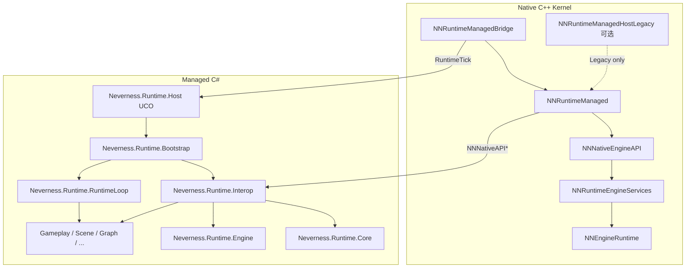

# MERGED — Managed 子樹模組文檔合集

本文件由 `merge_docs.py` 自動生成，**請勿手改**；請編輯各子目錄 `Docs/MODULE_ARCHITECTURE_AND_PROGRESS.md`、根目錄 `MANAGED_RUNTIME_ARCHITECTURE_AND_PROGRESS.md`，以及（可選）`Engine/Source/Runtime/NNNativeEngineAPI/Docs/...`、`NNRuntimeNativeEngineAPIStub/Docs/...`、`NNRuntimeEngine/Docs/...`、`NNRuntimeEngineServices/Docs/...` 後重新執行本腳本。

共收錄 **16** 個子模組文檔 + 根總覽。


---
## Module: Neverness.Runtime.Assets

# Neverness.Runtime.Assets — 托管资产 GUID 与导入

## 1. 定位

| 项目 | 说明 |
|------|------|
| **程序集** | `Neverness.Runtime.Assets` |
| **命名空间** | `Neverness.Managed.Assets` |
| **职责** | `AssetDatabase`、`ImportPipeline`；可选经 Interop 同步 Native `AssetRegistry` |
| **不负责** | GPU 上传、Pak 解压（Native Kernel） |

## 2. 依赖

- `Neverness.Runtime.Object`、`Engine`、`Interop`

## 3. 开发进展

| 日期 | 进展 |
|------|------|
| **2026-05-15** | Phase 5 地基 |


---
## Module: Neverness.Runtime.Bootstrap

# Neverness.Runtime.Bootstrap — 托管 Runtime 启动与主循环

## 1. 定位

| 项目 | 说明 |
|------|------|
| **程序集** | `Neverness.Runtime.Bootstrap` |
| **命名空间** | `Neverness.Managed.Bootstrap` |
| **职责** | `RuntimeBootstrap`、`RuntimeInitializer`、`RuntimeMainLoop`；对接 Native `Entry` 与可选 `Neverness.Runtime.App` |
| **不负责** | Interop 实现（**Neverness.Runtime.Interop**）、Native Kernel |

## 2. 关键类型

| 类型 | 说明 |
|------|------|
| `RuntimeBootstrap` | 进程级 `Start` / `Shutdown`；`GetPackedApiVersion` |
| `RuntimeInitializer` | Interop 安装、子系统注册、`InitializeRegistered` |
| `RuntimeMainLoop` | 单帧 `Tick`；包装 `Neverness.Runtime.RuntimeLoop.RuntimeLoop` |
| `NativeBootstrapContext` | `NativeApiTable`、运行模式（`NativeDriven` / `ManagedOuterLoop`） |

## 3. 依赖

- `Neverness.Runtime.Interop`
- `Neverness.Runtime.RuntimeLoop`

## 4. 开发进展

| 日期 | 进展 |
|------|------|
| **2026-05-19** | M-1 落地；C# 主导启动路径确立 |


---
## Module: Neverness.Runtime.Core

# Neverness.Runtime.Core — NNNativeAPI 托管镜像

## 1. 定位

| 项目 | 说明 |
|------|------|
| **程序集** | `Neverness.Runtime.Core` |
| **命名空间** | `Neverness.Managed.Core` |
| **职责** | `NNNativeApi`、`NNNativeApiConstants`（镜像 `NativeAPI.h`） |
| **不负责** | Bootstrap 安装（**Neverness.Runtime.Interop**）、Native 表实现（**NNRuntimeManaged**） |

## 2. 主要类型

- `NNNativeApi` — 与 Native `NNNativeAPI` 逐字段对齐
- `NNNativeApiConstants.ApiVersion` — 当前 **2**

## 3. 边界

- Native 经 `NNNativeApi_GetDefaultTable()` 提供表指针
- `Entry.Bootstrap` → `RuntimeInitializer` → `NativeApiBootstrap.Install`（Interop 程序集）

## 4. 开发进展

| 日期 | 进展 |
|------|------|
| **2026-05-14** | Phase 2 ABI 镜像 |
| **2026-05-19** | Bootstrap 迁至 Interop；Core 仅保留镜像 |


---
## Module: Neverness.Runtime.Engine

# Neverness.Runtime.Engine — NNNativeEngineAPI 托管镜像

## 1. 定位

| 项目 | 说明 |
|------|------|
| **程序集** | `Neverness.Runtime.Engine` |
| **命名空间** | `Neverness.Managed.Engine` |
| **职责** | `NNNativeEngineApi` 及子表结构体镜像、`NNNativeEngineApiConstants` |
| **不负责** | Bootstrap（**Neverness.Runtime.Interop**）、Gameplay |

## 2. 版本

- `NNNativeEngineApiConstants.LayoutVersion` — 当前 **5**（含 `NNEntityApi`、`GetRuntimeTick`）

## 3. 边界

- 从 `NNNativeAPI.engineServices` 解析；安装由 `EngineNativeApiBootstrap`（Interop）完成
- 与 Native `EntitySubsystem` **无**自动数据同步

## 4. 开发进展

| 日期 | 进展 |
|------|------|
| **2026-05-14** | Phase 3 Engine Service ABI |
| **2026-05-19** | Bootstrap 迁至 Interop |


---
## Module: Neverness.Runtime.Gameplay

# Neverness.Runtime.Gameplay — Galgame 产品逻辑（100% Managed）

## 1. 定位

| 项目 | 说明 |
|------|------|
| **程序集** | `Neverness.Runtime.Gameplay` |
| **命名空间** | `Neverness.Managed.Gameplay` |
| **职责** | 变量表、序列、`SequenceRunner`、`GameplaySessionSnapshot`、`DialoguePresenter` |
| **不负责** | Native Gameplay/存盘 ABI（待定）；CoreCLR 宿主 |

> **C# 主导**：Gameplay 产品逻辑**仅**在 Managed；C++ Kernel 不提供 Galgame 序列/存盘实现。

## 2. 主要 API

- `GameplayVariableStore` — JSON 往返
- `SequenceRunner` / `Advance` — 序列与等待步
- `GameplaySessionSnapshot` — 会话快照
- `DialoguePresenter` — 经 Engine UI 子表（Stub）

## 3. 依赖

- `Neverness.Runtime.Scene`、`Serialization`、`Interop`

## 4. 开发进展

| 日期 | 进展 |
|------|------|
| **2026-05-15** | Phase 6 slice 2～5 |
| **2026-05-19** | `Entry` 演练迁至 `GameplayBootstrapDrillTests` |


---
## Module: Neverness.Runtime.Graph

# Neverness.Runtime.Graph — 图数据模型（Shell）

## 1. 定位

| 项目 | 说明 |
|------|------|
| **程序集** | `Neverness.Runtime.Graph` |
| **命名空间** | `Neverness.Managed.Graph` |
| **职责** | 图/节点数据模型 Shell；未来 **Graph.Runtime**（P0-5） |
| **不负责** | Native Graph VM（**明确不做**） |

> 长期由 **100% Managed** `Graph.Runtime` 替代 Lua Sequence。

## 2. 依赖

- `Neverness.Runtime.Reflection`

## 3. 开发进展

| 日期 | 进展 |
|------|------|
| **2026-05-15** | 数据模型 Shell |


---
## Module: Neverness.Runtime.Host

# Neverness.Runtime.Host — UCO 导出层

## 1. 定位

| 项目 | 说明 |
|------|------|
| **程序集** | `Neverness.Runtime.Host` |
| **命名空间** | `Neverness.Managed.Runtime` |
| **职责** | 向 Native 导出 `[UnmanagedCallersOnly]`：`Bootstrap`、`GetApiVersion`、`RuntimeTick` |
| **不负责** | 启动逻辑（见 **Neverness.Runtime.Bootstrap**）、Interop（见 **Neverness.Runtime.Interop**）、CoreCLR（Legacy 见 **NNRuntimeManagedHostLegacy**） |

> **命名说明**：本程序集历史上称「Host」，现仅表示 **Native 可调用的 UCO 入口**，**不是** 架构上的 Runtime 宿主。主路径为进程内嵌 CLR + `RuntimeBootstrap`。

## 2. UCO 接口

| 方法 | 说明 |
|------|------|
| `Bootstrap(nint)` | 安装 API 表并初始化；非阻塞 |
| `GetApiVersion()` | `(ApiVersion << 16) \| LayoutVersion` |
| `RuntimeTick(float)` | 托管 Kernel 单帧 |

## 3. 依赖

- 仅引用 `Neverness.Runtime.Bootstrap`

## 4. 开发进展

| 日期 | 进展 |
|------|------|
| **2026-05-19** | Migration-4：瘦身为 UCO 转发层；不再聚合 Gameplay/Scene 等产品程序集 |


---
## Module: Neverness.Runtime.Inspector

# Neverness.Runtime.Inspector — Inspector 数据绑定 Shell

## 1. 定位

| 项目 | 说明 |
|------|------|
| **程序集** | `Neverness.Runtime.Inspector` |
| **命名空间** | `Neverness.Managed.Inspector` |
| **职责** | Inspector 绑定与展示的数据模型 Shell |
| **不负责** | 编辑器 UI 渲染（**Neverness.Editor.Framework** + ImGui） |

## 2. 依赖

- `Neverness.Runtime.Reflection`
- `Neverness.Editor.Framework`

## 3. 开发进展

| 日期 | 进展 |
|------|------|
| **2026-05-15** | Shell；产品化见 Editor P1 |


---
## Module: Neverness.Runtime.Interop

# Neverness.Runtime.Interop — Native ↔ Managed 互操作

## 1. 定位

| 项目 | 说明 |
|------|------|
| **程序集** | `Neverness.Runtime.Interop` |
| **命名空间** | `Neverness.Managed.Interop` |
| **职责** | `NativeApiBootstrap`、`EngineNativeApiBootstrap`、`NativeHandleBridge`、`RuntimeVersionInfo` |
| **禁止** | `DllImport` 直调引擎；仅经函数表间接调用 |
| **不负责** | ABI 结构体定义（**Core** / **Engine**） |

## 2. 安装顺序（`RuntimeInitializer`）

1. `NativeApiBootstrap.Install(table)`
2. `EngineNativeApiBootstrap.InstallFromNativeApiTable(table)`
3. 生产路径**不**调用 `ExerciseStubInteropPath`（仅测试）

## 3. 依赖

- `Neverness.Runtime.Core`
- `Neverness.Runtime.Engine`

## 4. 开发进展

| 日期 | 进展 |
|------|------|
| **2026-05-19** | M-2：自 Core/Engine/Object 迁出 |


---
## Module: Neverness.Runtime.Object

# Neverness.Runtime.Object — 托管对象与 Native Handle

## 1. 定位

| 项目 | 说明 |
|------|------|
| **程序集** | `Neverness.Runtime.Object` |
| **命名空间** | `Neverness.Managed.Object` |
| **职责** | `VGObject`、`LifetimeSystem`、`ObjectRegistry`；经 **Interop** 的 `NativeHandleBridge` 操作 Native 控制代码 |
| **不负责** | Interop 安装（**Neverness.Runtime.Interop**） |

## 2. 生命周期

- `LifetimeSystem.CreateAndRegister` → Native `createObject`（ref=1）
- `Dispose` → retain/release 至 0 后 destroy

## 3. 依赖

- `Neverness.Runtime.Engine`
- `Neverness.Runtime.Interop`

## 4. 开发进展

| 日期 | 进展 |
|------|------|
| **2026-05-15** | Phase 5 地基 |
| **2026-05-19** | `NativeHandleBridge` 迁至 Interop |


---
## Module: Neverness.Runtime.Reflection

# Neverness.Runtime.Reflection — 类型元数据

## 1. 定位

| 项目 | 说明 |
|------|------|
| **程序集** | `Neverness.Runtime.Reflection` |
| **命名空间** | `Neverness.Managed.Reflection` |
| **职责** | `TypeMetadata`、`SerializeField`、属性扫描（Inspector/序列化地基） |
| **不负责** | Native 字段反射（**NNRuntimeScene** `NN_FIELD` 属 C++） |

## 2. 依赖

- `Neverness.Runtime.Object`

## 3. 开发进展

| 日期 | 进展 |
|------|------|
| **2026-05-15** | Phase 5 地基 |


---
## Module: Neverness.Runtime.RuntimeLoop

# Neverness.Runtime.RuntimeLoop — 托管 Kernel 主循环

## 1. 定位

| 项目 | 说明 |
|------|------|
| **程序集** | `Neverness.Runtime.RuntimeLoop` |
| **命名空间** | `Neverness.Managed.RuntimeLoop` |
| **职责** | 与 Native `RuntimeScheduler` 对称的帧管线 |
| **不负责** | Engine ABI、产品 Gameplay 逻辑 |

## 2. 管线顺序

`EarlyUpdate → FixedUpdate(0..N) → Update → LateUpdate → MainThreadDispatcher.Drain → Render`

## 3. 公开 API

| 类型 | 说明 |
|------|------|
| `RuntimeLoop` | 组合调度器 |
| `FrameScheduler` | Fixed 累加与步数上限 |
| `SubsystemScheduler` | 子系统分桶 Tick |
| `MainThreadDispatcher` | 主线程委托队列 |
| `ManagedRuntimeScheduler` | **已弃用**；薄包装 |

## 4. 开发进展

| 日期 | 进展 |
|------|------|
| **2026-05-15** | P0-1 首包 |
| **2026-05-19** | M-5：`RuntimeLoop` 协作类型重构 |


---
## Module: Neverness.Runtime.Scene

# Neverness.Runtime.Scene — Native 场景 ABI 门面

## 1. 定位

| 项目 | 说明 |
|------|------|
| **程序集** | `Neverness.Runtime.Scene` |
| **命名空间** | `Neverness.Managed.Scene` |
| **职责** | `Scene`、`SceneEntity`、`SceneNativeBridge`；经 `NNSceneAPI` 访问 C++ 场景图 |
| **不负责** | 场景存储与 ECS 迭代（**NNRuntimeScene** / Kernel）；托管不复制实体数据 |

## 2. 与 Native 边界

- **运行时**：`SceneNativeBridge` → `EngineNativeApiBootstrap.EngineApi.Scene`（`loadScene` / `spawn` / `destroy` / `find` 等）
- **句柄**：`SceneEntity` 持有 `NNEntityHandle`（与 `NNObjectHandle` / `VGObject` 分离）
- **JSON**：`SceneSerializer` 为工具/存档 DTO；再水合经 Native `spawn` 创建新句柄，不复活旧控制码
- **EntityAPI**：`NNEntityAPI`（Kernel 子系统 Tick）与场景图 API 语义分离，见 MANAGED 总览 §2.7.1

## 3. 依赖

- `Neverness.Runtime.Interop`
- `Neverness.Runtime.Engine`
- `Neverness.Runtime.Reflection`
- `Neverness.Runtime.Serialization`

## 4. 开发进展

| 日期 | 进展 |
|------|------|
| **2026-05-15** | Phase 5.3 JSON 再水合（Object 路径） |
| **2026-05-19** | 删除 `Neverness.Runtime.Entity`；Scene 改为 Native ABI 薄门面；Stub `spawn` 返回非零句柄供测试 |


---
## Module: Neverness.Runtime.Scripting

# Neverness.Runtime.Scripting — 脚本与 ALC 脚手架

## 1. 定位

| 项目 | 说明 |
|------|------|
| **程序集** | `Neverness.Runtime.Scripting` |
| **命名空间** | `Neverness.Managed.Scripting` |
| **职责** | Hot Reload / `AssemblyLoadContext` 脚手架（Phase 8～9） |
| **不负责** | Roslyn 编译器集成（未来独立模块） |

## 2. 依赖

- `Neverness.Runtime.Core`

## 3. 开发进展

| 日期 | 进展 |
|------|------|
| **2026-05-15** | 脚手架 |


---
## Module: Neverness.Runtime.Serialization

# Neverness.Runtime.Serialization — 序列化与版本容忍

## 1. 定位

| 项目 | 说明 |
|------|------|
| **程序集** | `Neverness.Runtime.Serialization` |
| **命名空间** | `Neverness.Managed.Serialization` |
| **职责** | `GraphSerializer`、`SceneSerializer`、DTO 与未知字段容忍 |
| **不负责** | Native 二进制 Scene（**VGSC** 属 C++） |

## 2. 依赖

- `Neverness.Runtime.Reflection`

## 3. 开发进展

| 日期 | 进展 |
|------|------|
| **2026-05-15** | Phase 5 地基 |


---
## Module: Neverness.Runtime.UndoRedo

# Neverness.Runtime.UndoRedo — 撤销重做（编辑器向）

## 1. 定位

| 项目 | 说明 |
|------|------|
| **程序集** | `Neverness.Runtime.UndoRedo` |
| **命名空间** | `Neverness.Managed.UndoRedo` |
| **职责** | 编辑器撤销/重做栈 Shell |
| **不负责** | Runtime 游戏逻辑 |

## 2. 依赖

- `Neverness.Editor.Framework`

## 3. 开发进展

| 日期 | 进展 |
|------|------|
| **2026-05-15** | Shell |


---
## FinalOverview: MANAGED_RUNTIME_ARCHITECTURE_AND_PROGRESS.md

# Neverness Managed Runtime — 架构与总进度

本文档描述 **Neverness** 引擎 **托管 Runtime** 的分层、完成度与路线图。

- 上级总览：[MANAGED_ARCHITECTURE_AND_PROGRESS.md](../MANAGED_ARCHITECTURE_AND_PROGRESS.md)
- Native Kernel：[RUNTIME_ARCHITECTURE_AND_PROGRESS.md](../../Runtime/RUNTIME_ARCHITECTURE_AND_PROGRESS.md)
- Native ABI 契约：[NNNativeEngineAPI](../../Runtime/NNNativeEngineAPI/Docs/MODULE_ARCHITECTURE_AND_PROGRESS.md)

---

## 0. Neverness 主线原则（2026）

### 0.1 已确立原则

| 原则 | 说明 |
|------|------|
| **C# 主导 Runtime** | 启动（`RuntimeBootstrap`）、Interop、帧内调度、Gameplay/Scene/Graph 逻辑均在 Managed。 |
| **C++ 仅 Kernel** | Native：RHI、Platform、Window、FileSystem、Audio、Native ECS、外循环、ABI；**不**写 Galgame 产品逻辑。 |
| **不以 Host 为主路径** | `Neverness.Runtime.Host` 仅为 **UCO 导出薄层**；Legacy `NNRuntimeManagedHostLegacy` 可选、默认 OFF。 |
| **函数表 Interop** | 经 `Neverness.Runtime.Interop` 安装 API 表；禁止 `DllImport` 直调引擎。 |
| **Legacy 分界** | `VISIONGAL_BUILD_LEGACY_GALGAME`、Lua、`VGEngine::Run()` 旧循环仅兼容；新能力走 Kernel 路径。 |

### 0.2 阶段定位

- **NNNativeEngineAPI** 与托管镜像已版本化（ApiVersion **2**，LayoutVersion **5**）。
- 重心：**Runtime Kernel 化**（统一排程、实体子系统、场景运行时），而非仅「服务表聚合」。

### 0.3 P0：Runtime Kernel 化

| 代号 | Native | Managed | 状态 |
|------|--------|---------|------|
| **P0-1** | `RuntimeScheduler`、`IRuntimeSubsystem` | `Neverness.Runtime.RuntimeLoop`（`RuntimeLoop` / `FrameScheduler` / `SubsystemScheduler` / `MainThreadDispatcher`） | **已落地** |
| **P0-2** | `NNRuntimeScene`、`NNSceneAPI` | `Neverness.Runtime.Scene`（`SceneNativeBridge`，经 ABI 访问 Native 场景图） | **已落地** |
| **P0-3** | Scene Runtime / Streaming | `Neverness.Runtime.Scene` 扩展 + Native **VGSceneRuntime** | **进行中** |
| **P0-4** | — | Managed Component 框架 | **未开始** |
| **P0-5** | **不**做 Native Graph VM | `Neverness.Runtime.Graph` → 未来 Graph.Runtime | **未开始** |

### 0.4 P1～P2 索引

| 阶段 | 内容 |
|------|------|
| **P1** | Editor 产品化、Asset Pipeline C# 化、Graph.Runtime |
| **P2** | GameFramework、Hot Reload / ALC、Roslyn |

### 0.5 Runtime 主导权迁移（M-1～M-6，2026-05-19）

| 阶段 | 内容 | 状态 |
|------|------|------|
| **M-1** | `Neverness.Runtime.Bootstrap` + `Entry` UCO + 可选 `Neverness.Runtime.App` | **已落地** |
| **M-2** | `Neverness.Runtime.Interop` 独立程序集 | **已落地** |
| **M-3** | `NNRuntimeManagedHostLegacy`，默认不构建 | **已落地** |
| **M-4** | `Entry` 仅 `Bootstrap` / `GetApiVersion` / `RuntimeTick`；演练迁入 xUnit | **已落地** |
| **M-5** | `RuntimeLoop` 重构 | **已落地** |
| **M-6** | `NNRuntimeManagedBridge`、`NNEngineRuntimeHost_TickManaged`、Kernel App 开关 | **6a/6b 已落地**；Editor 迁移 **6c 待续** |

**入口双模式**

| 模式 | 说明 |
|------|------|
| **A（默认）** | Native 外循环 → 每帧 `Entry.RuntimeTick(dt)` |
| **B（调试）** | `Neverness.Runtime.App` Headless 外循环 |

---

## 1. 分层总览



### 1.1 模块职责表

| 层级 | 程序集 | 职责 |
|------|--------|------|
| **UCO 导出** | `Neverness.Runtime.Host` | `Entry.Bootstrap` / `GetApiVersion` / `RuntimeTick` → 转发 Bootstrap |
| **启动与循环** | `Neverness.Runtime.Bootstrap` | `RuntimeBootstrap`、`RuntimeInitializer`、`RuntimeMainLoop` |
| **Interop** | `Neverness.Runtime.Interop` | `NativeApiBootstrap`、`EngineNativeApiBootstrap`、`NativeHandleBridge` |
| **托管 Kernel** | `Neverness.Runtime.RuntimeLoop` | 帧管线：Early → Fixed → Update → Late → MainThread → Render |
| **ABI 镜像** | `Neverness.Runtime.Core` / `.Engine` | 结构体镜像与常量；**不含** Bootstrap 逻辑 |
| **地基** | Object、Reflection、Serialization、Assets | Unity 式基础设施 |
| **产品** | Gameplay、Scene、Graph、Inspector | Galgame / 工具向产品逻辑；场景实体经 **NNSceneAPI** |
| **Native ABI DLL** | `NevernessRuntime-Managed` | `NNNativeApi_GetDefaultTable()` 等 C 导出 |
| **Legacy（可选）** | `NNRuntimeManagedHostLegacy` | CoreCLR + hostfxr；**非**主路径 |

---

## 2. 模块文档索引

| 程序集 | 文档 |
|--------|------|
| `Neverness.Runtime.Bootstrap` | [Bootstrap/Docs](Neverness.Runtime.Bootstrap/Docs/MODULE_ARCHITECTURE_AND_PROGRESS.md) |
| `Neverness.Runtime.Interop` | [Interop/Docs](Neverness.Runtime.Interop/Docs/MODULE_ARCHITECTURE_AND_PROGRESS.md) |
| `Neverness.Runtime.Host` | [Host/Docs](Neverness.Runtime.Host/Docs/MODULE_ARCHITECTURE_AND_PROGRESS.md) |
| `Neverness.Runtime.RuntimeLoop` | [RuntimeLoop/Docs](Neverness.Runtime.RuntimeLoop/Docs/MODULE_ARCHITECTURE_AND_PROGRESS.md) |
| `Neverness.Runtime.Core` | [Core/Docs](Neverness.Runtime.Core/Docs/MODULE_ARCHITECTURE_AND_PROGRESS.md) |
| `Neverness.Runtime.Engine` | [Engine/Docs](Neverness.Runtime.Engine/Docs/MODULE_ARCHITECTURE_AND_PROGRESS.md) |
| `Neverness.Runtime.Object` | [Object/Docs](Neverness.Runtime.Object/Docs/MODULE_ARCHITECTURE_AND_PROGRESS.md) |
| `Neverness.Runtime.Reflection` | [Reflection/Docs](Neverness.Runtime.Reflection/Docs/MODULE_ARCHITECTURE_AND_PROGRESS.md) |
| `Neverness.Runtime.Serialization` | [Serialization/Docs](Neverness.Runtime.Serialization/Docs/MODULE_ARCHITECTURE_AND_PROGRESS.md) |
| `Neverness.Runtime.Assets` | [Assets/Docs](Neverness.Runtime.Assets/Docs/MODULE_ARCHITECTURE_AND_PROGRESS.md) |
| `Neverness.Runtime.Scene` | [Scene/Docs](Neverness.Runtime.Scene/Docs/MODULE_ARCHITECTURE_AND_PROGRESS.md) |
| `Neverness.Runtime.Gameplay` | [Gameplay/Docs](Neverness.Runtime.Gameplay/Docs/MODULE_ARCHITECTURE_AND_PROGRESS.md) |
| `Neverness.Runtime.Graph` | [Graph/Docs](Neverness.Runtime.Graph/Docs/MODULE_ARCHITECTURE_AND_PROGRESS.md) |
| `Neverness.Runtime.Inspector` | [Inspector/Docs](Neverness.Runtime.Inspector/Docs/MODULE_ARCHITECTURE_AND_PROGRESS.md) |
| `Neverness.Runtime.Scripting` | [Scripting/Docs](Neverness.Runtime.Scripting/Docs/MODULE_ARCHITECTURE_AND_PROGRESS.md) |
| `Neverness.Runtime.UndoRedo` | [UndoRedo/Docs](Neverness.Runtime.UndoRedo/Docs/MODULE_ARCHITECTURE_AND_PROGRESS.md) |

---

## 3. Phase 历史（ABI 与地基）

| Phase | 名称 | 状态 |
|-------|------|------|
| 1～2 | Native ABI + 托管镜像 | **已完成** |
| 3 | Engine Service ABI | **已完成** |
| 4 | `NNEngineRuntime` / EngineServices | **已完成（首包）** |
| 5 | Object / Scene / Assets 地基 | **已完成** |
| 6 | Gameplay（托管 slice 2–5） | **托管已落地**；Native Gameplay/存盘 ABI **待定** |
| 7～9 | Editor / Hot Reload / Roslyn | **未开始** |

演练逻辑已自 `Entry` 迁至 **Foundation.Tests**（`FoundationBootstrapDrillTests`、`GameplayBootstrapDrillTests`、`InteropSmokeTests` 等）。

---

## 4. 关键设计决策

1. **函数表优先**：`NNNativeAPI` / `NNNativeEngineAPI` 间接调用；版本字段与 Native 同步。
2. **Bootstrap 不膨胀**：启动顺序集中在 `RuntimeInitializer`；Interop 独立程序集。
3. **Host 程序集语义**：`Neverness.Runtime.Host` = UCO 导出层，**不是** CoreCLR 宿主。
4. **双 DLL（Legacy 时）**：`NevernessRuntime-ManagedHostLegacy.dll` + `NevernessRuntime-Managed.dll` 仅 Legacy 路径需要。
5. **Handle 边界**：`uint64` Handle；禁止托管持有 C++ 裸指针穿越 ABI。
6. **场景单一权威**：场景图存储在 Native；Managed `SceneEntity` 仅为 `NNEntityHandle` 薄门面。`NNEntityAPI`（Kernel Tick）与 `NNSceneAPI`（场景图）语义分离。

---

## 5. 构建与测试

```powershell
dotnet test Engine\Source\Managed\Runtime\Tests\NevernessRuntimeManaged-Foundation.Tests.csproj -c Debug
```

Native Kernel 与 Bridge 见 [RUNTIME_ARCHITECTURE_AND_PROGRESS.md](../../Runtime/RUNTIME_ARCHITECTURE_AND_PROGRESS.md)。

---

## 6. 变更记录

| 日期 | 说明 |
|------|------|
| **2026-05-19** | 全文重写：**Neverness** 品牌；**C# 主导 / C++ Kernel**；去除 Host 主路径叙事；对齐 M-1～M-6 落地状态；模块索引更新。 |
| **2026-05-19** | 删除 **Neverness.Runtime.Entity**；**Scene** 改为经 **NNSceneAPI** 的 Native ABI 薄门面（P0-2）。 |
