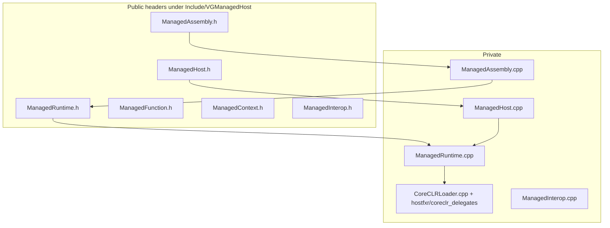

# VGManagedHost — Managed Runtime Host（CoreCLR / nethost）

## 1. 定位

| 项目 | 说明 |
|------|------|
| **职责** | **仅**负责：启动 CoreCLR、程序集加载、`load_assembly_and_get_function_pointer` 获取函数指针、运行时生命周期、多程序集登记、**Native → Managed** 的 UCO 调用解析。封装 **nethost / hostfxr**，对外头文件 **不暴露** `hostfxr.h` 类型。 |
| **不负责** | **不包含** `VGNativeAPI` 结构定义与引擎业务 ABI（见 **VGManagedCore**）；不负责 Gameplay、Editor、UI、对白、Sequence、Reflection Invoke、Hot Reload、Roslyn。 |
| **CMake 目标** | **`VGManagedHost`**（`SHARED`） |
| **依赖** | vcpkg **`nethost`**；**`PRIVATE`** 链接 **`VGManagedCore`**（ABI 默认实现随本 DLL 静态合并）。 |
| **根 CMake 选项** | **`VISIONGAL_ENABLE_MANAGED_HOST`**：Windows MSVC 默认 **ON**，其余平台默认 **OFF**；为 **OFF** 时不加入本子目录，避免未安装 `nethost` 的机器无法 configure。 |

---

## 2. CMake 与 vcpkg

| 项目 | 说明 |
|------|------|
| **安装** | 在所用 triplet 上执行：`vcpkg install nethost`（例如 `x64-windows`）。根 [CMakeLists.txt](../../../../../CMakeLists.txt) 已配置默认 `CMAKE_TOOLCHAIN_FILE` 指向 `E:/vcpkg/...`（可按本机修改）。 |
| **编译定义** | `PRIVATE VG_MANAGED_HOST_EXPORT` → **`VG_MANAGED_HOST_API`**（见 [VGManagedHostConfig.h](../Include/VGManagedHost/VGManagedHostConfig.h)）。 |
| **包含目录** | `PUBLIC`：`Include/`（对外 `#include "VGManagedHost/..."`）；`PRIVATE`：`Private/`（仅 **`CoreCLRLoader`** 等实现翻译单元使用，**禁止**作为引擎其它模块的 `PUBLIC` 依赖路径）。 |
| **非 Windows** | 若启用本模块，`CoreCLRLoader` 使用 `dlopen` / `dlsym`，`target_link_libraries(VGManagedHost PRIVATE dl)`（Unix 非 Apple）。 |
| **托管测试产物** | 缓存变量 **`VISIONGAL_MANAGED_PUBLISH_DIR`**（默认 `${CMAKE_BINARY_DIR}/ManagedRuntimePublish`）。若找到 **`dotnet`**，生成 **`visiongal_managed_runtime_publish`**：`dotnet publish` [VisionGal.Managed.Runtime.csproj](../Managed/VisionGal.Managed.Runtime/VisionGal.Managed.Runtime.csproj)（输出含 **`VisionGal.Managed.Core.dll`**、**`VisionGal.Managed.Engine.dll`**；`DEPENDS` 同時監視 Core 與 Engine 工程原始碼）。 |

### 2.1 单元测试（GTest）

| 项目 | 说明 |
|------|------|
| **条件** | `ENABLE_TESTS=ON` **且** 找到 **`dotnet`** 可执行文件。 |
| **目标** | **`VGManagedHostTest`**（[Engine/Source/Tests/VGManagedHostTest](../../../Tests/VGManagedHostTest/)） |
| **依赖** | `add_dependencies(VGManagedHostTest visiongal_managed_runtime_publish)`，保证先发布托管程序集。 |
| **运行时 DLL** | `POST_BUILD` 将 **`VGManagedHost.dll`** 复制到测试 exe 同目录，避免 `bin` 与 `lib` 分离导致加载失败。 |
| **ctest 环境变量** | **`VGMANAGED_TEST_ROOT`** = `VISIONGAL_MANAGED_PUBLISH_DIR`，目录内需含 **`VisionGal.Managed.Runtime.dll`**、**`VisionGal.Managed.Core.dll`**、**`VisionGal.Managed.Engine.dll`** 与 **`.runtimeconfig.json`**。 |

构建与测试示例（在已安装 `nethost` 与 .NET 8 SDK 的前提下）：

```bat
cmake -B build -DCMAKE_TOOLCHAIN_FILE=E:/vcpkg/scripts/buildsystems/vcpkg.cmake -DENABLE_TESTS=ON -DVISIONGAL_ENABLE_MANAGED_HOST=ON
cmake --build build --config Debug --target VGManagedHostTest visiongal_managed_runtime_publish
ctest -C Debug -R VGManagedHost --output-on-failure
```

---

## 3. 架构与分层



- **`CoreCLRLoader`**：唯一包含 **`nethost.h` / `hostfxr.h` / `coreclr_delegates.h`** 的翻译单元路径；负责 `get_hostfxr_path`、加载 **hostfxr**、**`hostfxr_initialize_for_runtime_config`**、**`hostfxr_get_runtime_delegate(hdt_load_assembly_and_get_function_pointer)`**、以及 **`load_assembly_and_get_function_pointer`** 调用链。
- **`VGManagedRuntime`**：运行时状态、**多程序集**路径登记、`TryResolveUnmanagedCallersOnly`（UTF-8 类型名/方法名 → 内部宽字符/UTF-8 与 `char_t` 对齐）。
- **`VGManagedHost`**：薄门面：`Initialize` / `LoadAssembly` / `TryGetUnmanagedCallersOnly` / `Shutdown` / `Runtime()`；**`PRIVATE`** 依赖 **VGManagedCore**（不在此头文件暴露 `VGNativeAPI` 定义）。
- **`VGManagedRuntimeContext`**：仅 **`void*`** 快照字段（**不透明**），供诊断或后续扩展；**不要**在引擎其它处将其转型为 hostfxr 类型。

---

## 3.1 Phase 2 与 VGManagedCore 边界

- **`VGNativeAPI`、默认 `LogInfo`、`VGNativeApi_GetDefaultTable`**：定义与实现位于 **[VGManagedCore](../../VGManagedCore/)**（**STATIC**），**不**进入 `Include/VGManagedHost` 公共头；宿主通过 **`PRIVATE`** 链接与 `#include "VGManagedCore/..."` 使用。
- **典型流程**：宿主解析 **`VisionGal.Managed.Runtime.Entry.BootstrapNativeApi`**，将 **`VGNativeApi_GetDefaultTable()`** 的指针传入托管；托管侧通过 **VisionGal.Managed.Core** 安装函数表并回调 **`logInfo`**；**Phase 3** 起由 **VisionGal.Managed.Engine** 解析 **`engineServices`** 並演練 Stub 路徑（無引擎 `DllImport`）。
- **测试**：`VGManagedHostTest` 中 **`BootstrapNativeApiCallsNativeLogInfo`** 依赖上述链路与 `VGManagedHost_GetNativeLogInfoCallCountForTest`（见 §5.2）。

---

## 4. 目录结构（与仓库一致）

```
Engine/Source/Managed/VGManagedHost/
├── CMakeLists.txt
├── Docs/
│   └── MODULE_ARCHITECTURE_AND_PROGRESS.md
├── Include/VGManagedHost/
│   ├── VGManagedHostConfig.h
│   ├── ManagedHost.h
│   ├── ManagedRuntime.h
│   ├── ManagedAssembly.h
│   ├── ManagedFunction.h
│   ├── ManagedContext.h
│   └── ManagedInterop.h
├── Private/
│   ├── CoreCLRLoader.h
│   ├── CoreCLRLoader.cpp
│   ├── ManagedHost.cpp
│   ├── ManagedRuntime.cpp
│   ├── ManagedAssembly.cpp
│   └── ManagedInterop.cpp
└── Managed/VisionGal.Managed.Runtime/
    ├── VisionGal.Managed.Runtime.csproj
    └── Entry.cs
```

---

## 5. 公开 API 说明（Phase 1–2）

### 5.1 `VGManagedHost` — [ManagedHost.h](../Include/VGManagedHost/ManagedHost.h)

| 方法 | 说明 |
|------|------|
| `VGManagedHost()` / `~VGManagedHost()` | 构造/析构；析构会关闭运行时。 |
| `bool Initialize(const std::filesystem::path& runtime_config_json, const std::filesystem::path* assembly_path_hint = nullptr)` | 使用给定 **`.runtimeconfig.json`** 初始化 hostfxr 上下文并缓存 **`load_assembly_and_get_function_pointer`**。建议传入 **`assembly_path_hint`** 指向同应用旁的 **`.dll`**，便于 **nethost** 解析匹配的 **hostfxr**。 |
| `bool LoadAssembly(const std::filesystem::path& assembly_path)` | 将程序集路径登记为多程序集宿主的一部分（Phase 1 不做额外校验；解析时以传入路径为准）。 |
| `bool TryGetUnmanagedCallersOnly(const std::filesystem::path& assembly_path, const char* type_utf8, const char* method_utf8, void** out_fn)` | 通过 **`load_assembly_and_get_function_pointer`** 与 **`UNMANAGEDCALLERSONLY_METHOD`** 解析 **`[UnmanagedCallersOnly]`** 静态方法；**`out_fn`** 为原始函数指针，由调用方按 ABI 转型（见 `VGManagedVoidThunk`）。**`type_utf8`** 为 CLR 类型名（含命名空间，如 `VisionGal.Managed.Runtime.Entry`）。 |
| `void Shutdown()` | 关闭 host 上下文并卸载 **hostfxr** 动态库。 |
| `VGManagedRuntime& Runtime()` | 访问底层运行时对象（高级用法 / 测试）。 |

### 5.2 测试用导出（Phase 2）

| 符号 | 说明 |
|------|------|
| `extern "C" VGManagedHost_GetNativeLogInfoCallCountForTest()` | 返回 **`VGNativeApi_DefaultLogInfo`** 累计调用次数，供 **GTest** 断言 **C# → Native** 经 **`VGNativeAPI`** 的闭环；**非**游戏发行公共 API。实现见 [ManagedHost.cpp](../Private/ManagedHost.cpp)。 |

### 5.3 `VGManagedRuntime` — [ManagedRuntime.h](../Include/VGManagedHost/ManagedRuntime.h)

| 方法 | 说明 |
|------|------|
| `Initialize` / `Shutdown` | 与 `VGManagedHost` 对应；`Shutdown` 清空已加载程序集登记。 |
| `void* LoadAssemblyDelegate() const` | 返回缓存的 **`load_assembly_and_get_function_pointer`** 指针（**不透明**）；仅供诊断或后续内部扩展。 |
| `void FillContextSnapshot(VGManagedRuntimeContext& out) const` | 填充 **`hostfxrHostContext`**（hostfxr 句柄地址）与 **`loadAssemblyAndGetFunctionPointerDelegate`**。 |
| `bool RegisterLoadedAssembly(...)` | 以规范化路径字符串为键登记多程序集。 |
| `bool TryResolveUnmanagedCallersOnly(...)` | 与 `VGManagedHost::TryGetUnmanagedCallersOnly` 相同语义。 |

### 5.4 `VGManagedAssembly` — [ManagedAssembly.h](../Include/VGManagedHost/ManagedAssembly.h)

| 方法 | 说明 |
|------|------|
| `explicit VGManagedAssembly(std::filesystem::path assemblyPath)` | 绑定某一托管 DLL 路径。 |
| `bool TryGetUnmanagedCallersOnly(VGManagedRuntime& runtime, const char* type_utf8, const char* method_utf8, void** outFunction) const` | 对构造时路径做解析；内部转调 **`VGManagedRuntime::TryResolveUnmanagedCallersOnly`**。 |

### 5.5 `VGManagedVoidThunk` — [ManagedFunction.h](../Include/VGManagedHost/ManagedFunction.h)

| 类型 | 说明 |
|------|------|
| `VGManagedVoidThunk` | Phase 1 无参无返回值 smoke 签名：Windows 为 **`void(__stdcall*)()`**，其它平台为 **`void(*)()`**。与托管侧 **`[UnmanagedCallersOnly(CallConvs = new[] { typeof(CallConvStdcall) })]`（Windows）** 对齐。 |

### 5.6 `VGManagedRuntimeContext` — [ManagedContext.h](../Include/VGManagedHost/ManagedContext.h)

| 字段 | 说明 |
|------|------|
| `void* hostfxrHostContext` | **不透明**：当前为 hostfxr host context 指针值。 |
| `void* loadAssemblyAndGetFunctionPointerDelegate` | **不透明**：缓存的 **`load_assembly_and_get_function_pointer`** 函数指针。 |

### 5.7 `VGManagedInterop`（Windows）— [ManagedInterop.h](../Include/VGManagedHost/ManagedInterop.h)

| 函数 | 说明 |
|------|------|
| `std::wstring Utf8ToWide(const char* utf8, std::size_t len = -1)` | UTF-8 → UTF-16，供与 **`char_t`**（宽字符）API 互操作。 |
| `std::wstring PathToWide(const std::filesystem::path& path)` | 路径 → 宽字符串（MSVC **`path::native()`**）。 |

---

## 6. 托管侧约定（Phase 1–2）

- 工程：**`net8.0`**，见 [VisionGal.Managed.Runtime.csproj](../Managed/VisionGal.Managed.Runtime/VisionGal.Managed.Runtime.csproj)；**ProjectReference** → **`VisionGal.Managed.Core`**（源码树位于 [VGManagedCore/Managed/VisionGal.Managed.Core](../../VGManagedCore/Managed/VisionGal.Managed.Core/)）。
- 入口：[Entry.cs](../Managed/VisionGal.Managed.Runtime/Entry.cs) — **`Smoke`**（Phase 1）；**`BootstrapNativeApi`**（Phase 2）接收 **`VGNativeAPI*`**（以 **`nint`** 传递），内部调用 **`NativeApiBootstrap`**（**Managed.Core**）。
- **C# → Native**：经 **`VGNativeAPI.logInfo`** 函数指针；**禁止**对引擎 DLL 使用 **`DllImport`**（Phase 2 起为硬约束方向）。

---

## 7. Phase 路线图（未实现部分仅规划）

| Phase | 内容 |
|-------|------|
| **1** | CoreCLR 启动、`load_assembly_and_get_function_pointer`、多程序集登记、GTest **`Smoke`**。 |
| **2（已完成于 VGManagedCore）** | **`VGNativeAPI`** 函数指针表、托管 **VisionGal.Managed.Core**、**`BootstrapNativeApi`**、GTest **`BootstrapNativeApiCallsNativeLogInfo`**。 |
| **3** | `VGManagedGameplay`：Gameplay / Async / Sequence 与托管运行时对接（依赖 ABI 评审）。 |
| **4** | `VGManagedEditor`：编辑器工具链。 |
| **5** | `AssemblyLoadContext`、Hot Reload、扩展重载。 |

---

## 8. 开发进展与变更记录

| 日期 | 进展 |
|------|------|
| **2026-05-14** | **Phase 1 落地**：新增 **`VGManagedHost`** 模块；**`CoreCLRLoader`** 封装 nethost + hostfxr；**`VGManagedHost` / `VGManagedRuntime` / `VGManagedAssembly`** 公开 API；**`VisionGal.Managed.Runtime`** smoke 程序集；**`VGManagedHostTest`** + **`visiongal_managed_runtime_publish`**；根 **`VISIONGAL_ENABLE_MANAGED_HOST`** 选项。 |
| **2026-05-14** | **Phase 2**：**`PRIVATE`** 链接 **`VGManagedCore`**；托管 **`BootstrapNativeApi`** + **`VisionGal.Managed.Core`**；测试导出 **`VGManagedHost_GetNativeLogInfoCallCountForTest`**；扩展 **GTest** 与 publish 依赖 **Core** 源码。 |

---

## 9. 已知限制与注意事项

- 需要本机安装 **.NET 8** 运行时/SDK，以便 **`dotnet publish`** 与 **`runtimeconfig.json`** 解析框架依赖。
- **`Initialize`** 所给 **`.runtimeconfig.json`** 必须与待加载的托管 DLL 框架版本一致（测试使用同一 publish 目录）。
- 引擎其它模块 **默认不链接** **`VGManagedHost`**，避免过早耦合；由宿主进程或测试目标按需 **`target_link_libraries(... VGManagedHost)`**。
