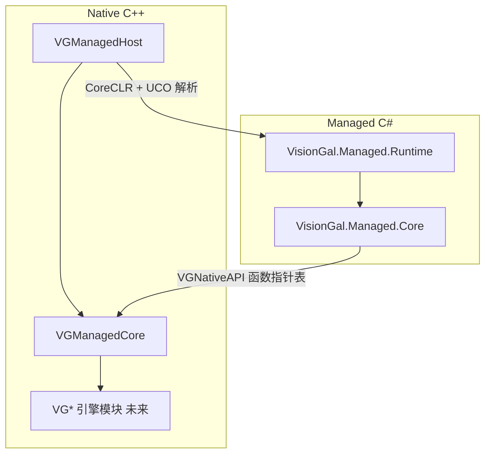

# VisionGal Managed Runtime — 架构与总进度

本文档描述 **Managed Runtime** 分层、当前完成度与后续规划。实现细节以各子模块 `Docs/MODULE_ARCHITECTURE_AND_PROGRESS.md` 为准。

---

## 1. 分层总览



| 层级 | 模块 / 程序集 | 职责 |
|------|----------------|------|
| **Native Runtime Host** | **VGManagedHost** | CoreCLR 生命周期、nethost/hostfxr、`load_assembly_and_get_function_pointer`、多程序集登记；**不**承载业务 ABI。 |
| **Managed Runtime Foundation** | **VGManagedCore**（静态库）+ **VisionGal.Managed.Core** | **`VGNativeAPI`**、默认 Native 实现、托管侧镜像与 **无 DllImport** 的函数表引导。 |
| **托管入口程序集** | **VisionGal.Managed.Runtime** | `[UnmanagedCallersOnly]` 导出（Smoke、Bootstrap 等），引用 **Managed.Core**。 |
| **未来：Gameplay / Editor** | *VGManagedGameplay、VGManagedEditor*（未建） | 依赖 **稳定后的 ABI**；当前阶段不实施。 |

---

## 2. Phase 总览

| Phase | 名称 | 状态 | 说明 |
|-------|------|------|------|
| **1** | Native Runtime Host | **已完成** | C++ → C# 单向 UCO；见 [VGManagedHost/Docs/MODULE_ARCHITECTURE_AND_PROGRESS.md](VGManagedHost/Docs/MODULE_ARCHITECTURE_AND_PROGRESS.md)。 |
| **2** | Managed ABI Foundation | **已完成** | **VGManagedCore** + `VGNativeAPI` + 托管 **VisionGal.Managed.Core** + `BootstrapNativeApi` → Native `LogInfo` 闭环；测试见 **VGManagedHostTest**。 |
| **3** | VGManagedGameplay | 未开始 | 对白 / Sequence / 变量等 **需在 ABI 评审后** 迁入共享头与版本化表扩展。 |
| **4** | VGManagedEditor | 未开始 | 编辑器工具链与宿主 ABI 对齐。 |
| **5** | Hot Reload / ALC | 未开始 | `AssemblyLoadContext`、扩展卸载等。 |
| **6** | VGManagedRoslyn | 未开始 | 脚本编译管线（依赖 ABI 稳定）。 |

---

## 3. 关键设计决策（摘要）

1. **函数表优先**：托管侧通过 **`VGNativeAPI*`** 调用引擎能力，避免散落 `DllImport`。
2. **版本字段**：`VGNativeAPI.apiVersion` 与 `VGNativeApiConstants.ApiVersion` 同步；破坏性布局变更必须递增。
3. **Host 不膨胀**：hostfxr 细节封装在 **VGManagedHost**；ABI 类型与默认实现放在 **VGManagedCore**。
4. **静态合并**：**VGManagedCore** 以 **STATIC** 链接进 **VGManagedHost.dll**，减少发行 DLL 数量（Phase 2）。

---

## 4. 构建与测试（Windows / MSVC）

前提：vcpkg **`nethost`**、**.NET 8 SDK**、根 **CMake** 中 `VISIONGAL_ENABLE_MANAGED_HOST=ON`、`ENABLE_TESTS=ON`。

```bat
cmake -B build -DCMAKE_TOOLCHAIN_FILE=<你的 vcpkg>/scripts/buildsystems/vcpkg.cmake -DENABLE_TESTS=ON -DVISIONGAL_ENABLE_MANAGED_HOST=ON
cmake --build build --config Debug --target VGManagedHostTest visiongal_managed_runtime_publish
ctest -C Debug -R VGManagedHost --output-on-failure
```

`dotnet publish` 由 **VGManagedHost/CMakeLists.txt** 驱动，输出含 **VisionGal.Managed.Runtime.dll** 与 **VisionGal.Managed.Core.dll**。

---

## 5. 变更记录

| 日期 | 说明 |
|------|------|
| **2026-05-14** | 新增 **VGManagedCore**、**VisionGal.Managed.Core**；扩展 **VGManagedHostTest**（Phase 2 ABI）；本总览文档首版。 |
