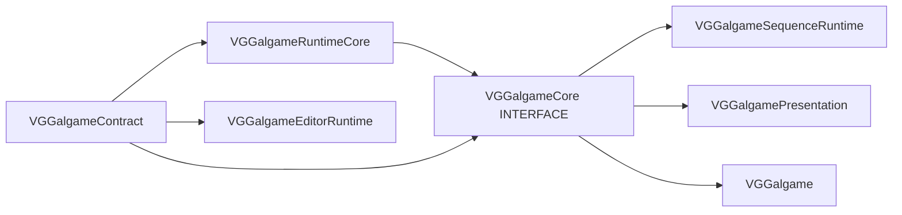

# Galgame Runtime 总览 — 模块矩阵与 Phase 8 进度

本文档描述 **VisionGal Phase 8 — Runtime Decoupling & Execution Architecture Refactor** 落地后的 **模块拆分、CMake 依赖方向** 与 **各子文档入口**。详细 API 仍以各模块 `Docs/MODULE_ARCHITECTURE_AND_PROGRESS.md` 为准。

---

## 1. 模块矩阵（2026-05-13）

| CMake 目标 | 职责摘要 | 典型依赖 |
|------------|----------|----------|
| **VGGalgameContract** | 纯 ABI：`IGalGameEngine`、`ISubsystemBus`、各 `I*Subsystem`、`IStoryScriptSystem`、`IGalRuntimeSession`、`IExecutionScheduler`、`IRuntimeEventPipeline`、`ILuaRuntimeBridge`、`IRuntimeLayerGraph`、`IRuntimeSnapshotProvider` 等。 | `INTERFACE` → `VGEngine`、`VGCore` |
| **VGGalgameRuntimeCore** | 运行时数据与实现：`GalGameContext`、`SaveArchive`、`GalGameScriptExecutorFactory`、`IGameSystem` / `IGameObject`、序列化组件等；**DLL 输出名仍为 `VGGalgameCore.dll`**。 | `PUBLIC` → `VGGalgameContract`、`VGEngine` |
| **VGGalgameCore** | **聚合 `INTERFACE` 目标**：转发头目录 + 链接 Contract + RuntimeCore；兼容存量 `target_link_libraries(... VGGalgameCore)`。 | `INTERFACE` |
| **VGGalgameSequenceRuntime** | 原 `VGGalgameScriptSequence` 目录重命名；Sequence 执行内核。**DLL 输出名仍为 `VGGalgameScriptSequence.dll`**。 | `PUBLIC` → `VGGalgameCore` |
| **VGGalgamePresentation** | 表现层首包：`RenderPipeline` 等（后续转场 / 动画 / 对白 UI）。 | `PUBLIC` → `VGGalgameCore`、`VGEngine` |
| **VGGalgame** | 宿主引擎 `GalGameEngine`、`GalRuntimeSessionHost`、`GalDefaultExecutionScheduler`、`GalSubsystemBus` 等。 | `PUBLIC` → `VGGalgamePresentation`、`VGGalgameSequenceRuntime`、… |
| **VGGalgameEditorRuntime** | 编辑器与运行时隔离：`IEditorGalgameRuntimeBridge`（`INTERFACE`）。 | `INTERFACE` → `VGGalgameContract` |

---

## 2. 依赖方向（约束）

**禁止**：`VGGalgameContract` 的公开头文件反向 `#include` `VGGalgameRuntimeCore` 的实现头（除通过 `Engine/Source/Runtime` 根路径的显式路径外，架构上仍应避免循环）。

---

## 3. Phase 8 子阶段状态（摘要）

| 子阶段 | 状态 | 说明 |
|--------|------|------|
| **8.1 Contract / RuntimeCore 拆分** | 已落地 | 新建 Contract + RuntimeCore；`VGGalgameCore` 为 INTERFACE 聚合；`#include "VGGalgameCore/..."` 薄转发保留。 |
| **8.2 Runtime Session** | 已落地 | `IGalRuntimeSession` + `GalRuntimeSessionHost`；`GalGameEngine::OnUpdate` 走会话 `Tick`。 |
| **8.3 Execution Scheduler** | 已落地（骨架） | `IExecutionScheduler` + `GalDefaultExecutionScheduler`（当前转发 `StoryScriptSystem::Update`）。 |
| **8.4 Dialogue Runtime / Presentation** | 文档 + 占位 | `DialogueRuntimePresentationSplit.h` 说明边界；代码级拆分待续。 |
| **8.5 Runtime Layer Graph** | 骨架 | `IRuntimeLayerGraph` + `GalRuntimeLayerGraphAdapter`（`TickLayers` 占位）。 |
| **8.6 Snapshot / Save** | 骨架 | `IRuntimeSnapshotProvider`；`SaveArchive` 聚合改造待续。 |
| **8.7 Editor Runtime 隔离** | 骨架 | `VGGalgameEditorRuntime` + `IEditorGalgameRuntimeBridge`；`VGEditorGalgame` 已链接该 INTERFACE。 |
| **Sequence 模块重命名** | 已落地 | 目录 `VGGalgameSequenceRuntime`；CMake 目标 `VGGalgameSequenceRuntime`；DLL 名保持兼容。 |

---

## 4. 各模块文档入口

- [VGGalgameContract/Docs/MODULE_ARCHITECTURE_AND_PROGRESS.md](VGGalgameContract/Docs/MODULE_ARCHITECTURE_AND_PROGRESS.md)
- [VGGalgameRuntimeCore/Docs/MODULE_ARCHITECTURE_AND_PROGRESS.md](VGGalgameRuntimeCore/Docs/MODULE_ARCHITECTURE_AND_PROGRESS.md)
- [VGGalgameCore（聚合 shim）](VGGalgameCore/CMakeLists.txt) — 文档见 RuntimeCore / Contract。
- [VGGalgame/Docs/MODULE_ARCHITECTURE_AND_PROGRESS.md](VGGalgame/Docs/MODULE_ARCHITECTURE_AND_PROGRESS.md)
- [VGGalgameSequenceRuntime/Docs/MODULE_ARCHITECTURE_AND_PROGRESS.md](VGGalgameSequenceRuntime/Docs/MODULE_ARCHITECTURE_AND_PROGRESS.md)
- [VGGalgamePresentation/Docs/MODULE_ARCHITECTURE_AND_PROGRESS.md](VGGalgamePresentation/Docs/MODULE_ARCHITECTURE_AND_PROGRESS.md)
- [VGGalgameEditorRuntime/Docs/MODULE_ARCHITECTURE_AND_PROGRESS.md](VGGalgameEditorRuntime/Docs/MODULE_ARCHITECTURE_AND_PROGRESS.md)

---

## 5. 脚本与规范

- `Engine/Scripts/gen_vggalgame_core_shims.ps1`：重新生成 `VGGalgameCore/` 下薄转发头。
- `Engine/Scripts/check_vggalgame_core_includes.ps1`：禁止在 Core 转发目录中引入 NodeGraph / Sequence / Editor 路径（已更新 Sequence 目录名）。
