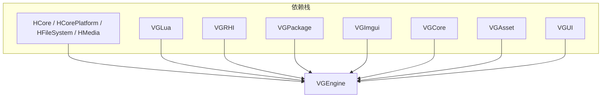

# VGEngine — 模块详细说明、架构、目录与 API

本文档描述 `Engine/Source/Runtime/VGEngine` 的**职责边界**、**构建方式**、**目录结构**、**典型用法**与**公开类型 API**（以当前头文件为准）。与 Native 总栈关系见 [RUNTIME_ARCHITECTURE_AND_PROGRESS.md](../../RUNTIME_ARCHITECTURE_AND_PROGRESS.md)。

---

## 1. 定位与边界

| 项目 | 说明 |
|------|------|
| **职责** | 在 **VGCore**（应用壳、窗口、VFS、事件总线等）之上，聚合 **VGRHI**、**VGUI**（RmlUi）、**VGAsset**、**HMedia**、**VGLua**、**VGPackage**、**VGImgui** 等，实现 **游戏主循环入口（`VGEngine`）**、**渲染子引擎（`CoreGameEngine` / `CoreRenderEngine`）**、**ECS 场景（`Scene` + `Components`）**、**资源加载器（纹理/音视频）**、**项目与构建设置**、**2D 动画与转场**、**Lua 绑定入口** 等高层能力。 |
| **不负责** | **不**实现 **Engine Service C ABI**（见 **VGNativeEngineAPI**）；**不**实现行程级 **Runtime Kernel**（见 **VGEngineRuntime** / **VGEngineRuntimeServices**）。托管主线 Gameplay 逻辑在 **Managed**，本库为 **Native 渲染与场景执行** 层。 |
| **CMake 目标** | `VGEngine`（`SHARED`） |
| **导出宏** | 编译目标定义 `ENGINE_API_EXPORT` → **`VG_ENGINE_API`**（`Include/EngineConfig.h`）：Windows 为 `dllexport`/`dllimport`，其他平台为可见性属性。 |
| **典型消费者** | **VGDesktopApplication**、**VGLauncher**、编辑器运行时桥等需要 OpenGL 场景与 RmlUi 的宿主。 |

---

## 2. 架构总览

### 2.1 分层关系（概念）



### 2.2 运行时两条主线

| 主线 | 入口类型 | 说明 |
|------|-----------|------|
| **应用级主循环** | `VisionGal::VGEngine` | 单例 `Get()`：`LoadProject` → `Run()` 内 **SDL 事件泵** + `OnApplicationUpdate` 分发到多个 **`IEngineApplication`**；`OnUpdateSubSystem` 驱动 **ViewportManager** 等。 |
| **渲染与场景** | `CoreGameEngine` → `CoreRenderEngine` → `CoreRenderPipeline` | 实现 **`IGameEngine`** / **`IGameEngineContext`**（定义在 **VGCore**），负责 **视口**、**场景渲染**、**渲染前后回调**、**子引擎 `ISubGameEngine`** 链。 |

**场景数据模型**：`IScene` / `IGameActor` / `IComponent` 接口在 **VGCore**（`VGCore/Interface/SceneInterface.h`），具体 ECS 实现在本模块 **`Scene::Scene`**（基于 **HCore** 的 `Horizon::HECS`）。

---

## 3. 构建与选项

| 项目 | 说明 |
|------|------|
| **C++ 标准** | **C++17**（`CMAKE_CXX_STANDARD 17`）。 |
| **预编译头** | `Include/pch.h`（`target_precompile_headers`）。 |
| **包含目录** | **PRIVATE**：`Engine/Source/Runtime`、`Engine/Source/Kernel`、`Include`、`Interface`；**PUBLIC**：`VGLua/Include`（向依赖方传播 sol2 / Lua 头）。 |
| **编译定义** | `ENGINE_API_EXPORT`（仅本库构建时导出符号）。 |
| **MSVC** | `/utf-8`、`/bigobj`、并行 `/MP`。 |
| **链接** | 见 [`CMakeLists.txt`](../CMakeLists.txt)：`SDL3`、`SDL3_image`、`RmlUi`、`VGLua`、`HCore`、`HCorePlatform`、`HFileSystem`、`HMedia`、`VGRHI`、`VGPackage`、`VGImgui`、`VGCore`、`VGAsset`、`VGUI`；**PRIVATE** 平台 **OpenGL**。 |

**说明**：`CMakeLists.txt` 中 `file(GLOB ...)` 仍包含 `Include/Asset`、`Include/Core`、`Include/Data`、`Include/Event`、`Include/Resource` 等路径；若仓库中对应目录暂无源文件，不影响当前已存在的编译单元。

---

## 4. 目录结构（完整）

```
Engine/Source/Runtime/VGEngine/
├── CMakeLists.txt
├── Docs/
│   └── MODULE_ARCHITECTURE_AND_PROGRESS.md    ← 本文件
├── Interface/
│   └── CoreLua.h                              ← 全局 Lua 状态入口（与 Include 互补）
├── Include/
│   ├── pch.h
│   ├── EngineConfig.h                         ← VG_ENGINE_API
│   ├── Animation/
│   │   ├── Audio/                             ← 音频驱动动画
│   │   ├── Core/                              ← Tween、属性插值、图元脚本、2D 动画核心类型
│   │   └── Interface/                         ← Animation2DScript、AnimationScriptManager
│   ├── Engine/
│   │   ├── VGEngine.h
│   │   ├── Manager.h                          ← Get*Manager 全局访问
│   │   ├── ResourceManager.h                  ← 纹理/视频/音频 ResourceManager
│   │   ├── EngineResource.h
│   │   ├── AudioPlayer.h
│   │   ├── VideoPlayer.h
│   │   ├── ImGuiLayer.h
│   │   └── Manager/
│   │       ├── ViewportManager.h
│   │       ├── ShaderManager.h
│   │       └── SceneManager.h
│   ├── Game/
│   │   ├── GameEngine.h                       ← CoreGameEngine、CoreGameEngineContext
│   │   ├── RenderEngine.h                     ← CoreRenderEngine
│   │   └── RenderPipeline.h                   ← CoreRenderPipeline
│   ├── Lua/                                   ← 脚本绑定与 LuaScript
│   ├── Project/                               ← ProjectSettings、ProjectBuilder
│   ├── Render/                                ← Sprite、Camera、Renderer、转场、Texture2D
│   └── Scene/                                 ← Scene、GameActor、Components、Factory、Serializer
└── Source/
    ├── pch.cpp
    ├── Animation/    (Audio / Core / Interface 镜像)
    ├── Engine/       (+ Manager/)
    ├── Game/
    ├── Lua/
    ├── Project/
    ├── Render/
    └── Scene/
```

---

## 5. 使用说明

### 5.1 CMake 链接

```cmake
target_link_libraries(YourTarget PRIVATE VGEngine)
# 或 PUBLIC：若 YourTarget 的头文件暴露了 VGEngine 类型
```

将 **`Engine/Source/Runtime`** 与 **`Engine/Source/Kernel`** 加入 **include path** 后，可按项目习惯使用：

- `#include "Engine/VGEngine.h"`
- `#include "Game/GameEngine.h"`
- 或带 `VGEngine/Include/` 前缀的路径（取决于目标 `target_include_directories` 配置）。

### 5.2 符号导出

- **消费** `VGEngine` 动态库时：**不要**在依赖目标上定义 `ENGINE_API_EXPORT`，以便 `VG_ENGINE_API` 解析为 **import**。
- **扩展** 本库源码时：保持由 `VGEngine` 目标统一导出。

### 5.3 `VGEngine` 单典型流程

1. `VGEngine::Get()->LoadProject()`：内部 `Initialize()` → `ProjectSettings::LoadProjectSettings()` → `CreateResourceManagers()`。
2. 按需 `LoadEditorMainScene()` / `LoadProjectMainScene()`（依赖 **SceneManager** 与项目配置）。
3. `AddApplication(Ref<IEngineApplication>)` 注册渲染/ UI 应用层。
4. `Run()`：循环中 `SDL_PumpEvents` / `SDL_PollEvent`，分发 `ProcessEvent` 到各 application；每帧 `OnUpdateSubSystem(delta)` 与 `OnApplicationUpdate(delta)`；可选 **60Hz** 附近睡眠以稳帧。
5. 退出：`RequestExit()` 或 `SDL_EVENT_QUIT`；`Shutdown()` 调用 `SDL_Quit()`。

### 5.4 `CoreGameEngine` 典型流程

1. 创建 **SDL3 OpenGL 窗口**（`Horizon::SDL3::OpenGLWindow*`）。
2. 构造 `CoreGameEngine`，调用 `Initialize(window)`：内部创建 **Viewport**、初始化 **`CoreRenderEngine`**，并填充 **`CoreGameEngineContext`**（`uiSystem` / `window` / `viewport` 指针需由宿主注入或后续赋值，见实现）。
3. 每帧：`OnUpdate(delta)` → `OnRender()`。
4. 可选：`AddSubGameEngine(Ref<ISubGameEngine>)` 挂载子循环。
5. `GetContext()` 可注册 **渲染前后回调**（`AddBeforeRenderCallback` / `AddAfterRenderCallback`），由渲染管线在合适时机执行。

### 5.5 场景工厂注册

- **`SceneFactory`**（`Include/Scene/SceneFactory.h`）实现 **`ISceneFactory::CreateScene`**，返回 `MakeRef<Scene>()`。
- **`GameActorFactory`** 实现 **`IGameActorFactory`**，并支持自定义 **`IGameActorBuilder`**。
- 宿主应在启动时调用 **VGCore** 的 **`SceneFactoryRegistry::Register`** / **`GameActorFactoryRegistry::Register`** 指向上述实例（具体注册代码通常在应用层，不在本文件展开）。

### 5.6 线程与 GL 上下文

- **SDL 事件**、**OpenGL 命令**、**RmlUi** 更新应在**同一主线程**（或与 `MakeCurrentRenderContext` 文档化约定一致的线程）执行。
- 异步资源加载若引入后台线程，须通过线程安全队列与主线程提交 GPU 资源。

---

## 6. 与 VGCore 接口的配合（摘要）

以下类型定义在 **VGCore**（`VGCore/Interface/*.h`），**VGEngine** 提供实现或消费方：

| 接口 | 头文件 | 本模块角色 |
|------|--------|------------|
| `IEngineApplication` / `IEngineApplicationLayer` | `VGCore/Interface/EngineInterface.h` | `VGEngine::AddApplication` 持有并驱动。 |
| `IGameEngine` / `IGameEngineContext` / `ISubGameEngine` / `IRenderPipeline` | `VGCore/Interface/GameEngineInterface.h` | `CoreGameEngine`、`CoreRenderEngine`、`CoreRenderPipeline` 实现。 |
| `IScene` / `IGameActor` / `IComponent` | `VGCore/Interface/SceneInterface.h` | `Scene`、`GameActor`、各 `*Component` 实现或继承。 |
| `IScript` / `IScriptVariable` / `ICamera` / `IOrthoCamera` / `IAnimationScript` | `VGCore/Interface/GameInterface.h` | `LuaScript`、相机类、动画脚本体系。 |
| `VGEngineResource` | `VGCore/Include/Core/Core.h` | `Texture2D`、`IScene`、`IScript` 等基类，提供 `GetResourcePath` / `SetResourcePath`。 |

---

## 7. API 参考（按头文件域）

以下列出 **`VisionGal` 命名空间**内、本模块头文件中**对外可见**的主要类型与方法。**参数语义**以头文件注释与实现为准；此处为快速检索表。

### 7.1 `Include/Engine/VGEngine.h` — `VGEngine`

| 方法 | 说明 |
|------|------|
| `static VGEngine* Get()` | 进程内单例。 |
| `bool LoadProject()` | 初始化 Core、加载工程设置、创建资源管理器。 |
| `ProjectSettings& GetProjectConfig()` | 返回成员侧工程配置引用（与全局 `ProjectSettings::GetProjectSettings()` 协同使用以实际加载为准）。 |
| `void LoadEditorMainScene()` | 按编辑器配置加载主场景或空场景。 |
| `void LoadProjectMainScene()` | 按应用程序配置加载运行主场景；失败时弹窗并 `RequestExit()`。 |
| `void Run()` | 阻塞主循环（事件 + 子系统 + Application 更新）。 |
| `void AddApplication(Ref<IEngineApplication> layer)` | 注册应用层。 |
| `void OnApplicationUpdate(float deltaTime)` | 对所有 application 调用更新（内部异常隔离）。 |
| `bool ProcessEvents()` | 处理 SDL 事件；`false` 表示应结束循环。 |
| `void Shutdown()` | 当前实现为 `SDL_Quit()`。 |
| `void RequestExit()` | 置运行标志为 false。 |

### 7.2 `Include/Engine/Manager.h` — 全局 Manager 访问

| 自由函数 | 返回 |
|----------|------|
| `ViewportManager* GetViewportManager()` | 视口管理。 |
| `ShaderManager* GetShaderManager()` | 内置着色器程序。 |
| `AssetManager* GetAssetManager()` | **VGAsset** 资源管理器。 |
| `SceneManager* GetSceneManager()` | 场景加载与播放模式切换。 |

### 7.3 `Include/Engine/Manager/ViewportManager.h`

| 方法 | 说明 |
|------|------|
| `static ViewportManager* Get()` | 单例式访问。 |
| `void SetMainViewport(Viewport* viewport)` | 设置主视口。 |
| `Viewport* GetMainViewport()` | 获取主视口。 |
| `Viewport* NewViewport(float2 size)` | 创建视口实例。 |
| `void FrameUpdate()` | 每帧更新（由 `VGEngine::OnUpdateSubSystem` 调用）。 |

### 7.4 `Include/Engine/Manager/ShaderManager.h`

| 方法 | 说明 |
|------|------|
| `static ShaderManager* Get()` | 单例式访问。 |
| `VGFX::IShaderProgram* GetBuiltinProgram(const String& name)` | 按名获取内置 **VGRHI** 着色器程序。 |

### 7.5 `Include/Engine/Manager/SceneManager.h`

| 方法 | 说明 |
|------|------|
| `static SceneManager* Get()` | 单例式访问。 |
| `bool EnterPlayMode()` / `bool ExitPlayMode()` | 编辑器场景与运行场景切换。 |
| `bool IsPlayMode() const` | 是否处于播放模式。 |
| `bool SaveScene(Scene* scene, const String& path)` | 保存场景。 |
| `Ref<IScene> LoadScene(const String& path)` | 从路径加载场景。 |
| `Ref<Scene> LoadNewScene()` | 新空白场景。 |
| `void LoadSceneOnUpdate(const String& path)` | 延迟到 `Update` 阶段加载。 |
| `IScene* GetCurrentEditorScene() const` | 当前编辑器场景。 |
| `IScene* GetCurrentRunningScene() const` | 当前运行场景。 |
| `void Update(float delta)` | 驱动内部任务队列（如延迟加载）。 |
| `bool SetCurrentScene(const Ref<IScene>& scene)` | 设置当前活动场景。 |

### 7.6 `Include/Engine/ResourceManager.h`

| 类型 | 关键 API |
|------|----------|
| `TextureResourceManager`（`HSingletonBase` + `VGObjectLoader`） | `static Ref<Texture2D> CreateRenderTexture(TextureAsset& asset)`；`static void CreateManager()`；`VGObjectPtr StaticLoadObject(const String& path)`；`uint64 NumCacheTexture() const`。 |
| `VideoResourceManager` | `static void CreateManager()`；`StaticLoadObject`。 |
| `AudioResourceManager` | `static void CreateManager()`；`StaticLoadObject`。 |
| `void CreateResourceManagers()` | 一次性创建上述管理器（`LoadProject` 内调用）。 |

### 7.7 `Include/Engine/EngineResource.h`

| 类型 | API |
|------|-----|
| `EngineResource` | `static std::string GetDefaultSpriteTexturePath()`（与 `Core::GetDefaultSpriteTexturePath` 用途类似，见实现选用）。 |

### 7.8 `Include/Engine/AudioPlayer.h`

| 类型 | 说明 |
|------|------|
| `VGAudioPlayer` | 继承 `Horizon::AudioPlayer`，引擎侧音频播放器薄封装。 |

### 7.9 `Include/Engine/VideoPlayer.h`

| 类型 | 说明 |
|------|------|
| `IVideoPlayer` | 继承 `Horizon::IVideoPlayer`；扩展 `Open`、`GetVideoTexture` / `GetVideoTextureRef`。 |
| `FVideoPlayer` | `static Ref<FVideoPlayer> CreatePlayer(const Ref<IVideoClip>& clip)`；播放控制、`Update`、纹理输出等（见头文件完整列表）。 |

### 7.10 `Include/Engine/ImGuiLayer.h`

| 类型 | API |
|------|-----|
| `ImguiOpengl3Layer` | 构造：`ImguiOpengl3Layer(Horizon::SDL3::Window*, SDL_GLContext)`；`BeginFrame()` / `EndFrame()`。 |

### 7.11 `Include/Game/GameEngine.h`

| 类型 | API |
|------|-----|
| `CoreGameEngineContext` | 实现 `IGameEngineContext`：`GetUISystem` / `GetWindow` / `GetViewport`；渲染前后回调 map 的增删执行。 |
| `CoreGameEngine` | `void OnUpdate(float)` / `void OnRender()`；`void Initialize(OpenGLWindow*)`；`void AddSubGameEngine(const Ref<ISubGameEngine>&)`；`CoreGameEngineContext* GetContext()`；`Viewport* GetViewport() const`；`void SetRenderFinalResultToScreen(bool)`。 |

### 7.12 `Include/Game/RenderEngine.h` — `CoreRenderEngine`

| 方法 | 说明 |
|------|------|
| `void Initialize(IGameEngineContext* context)` | 绑定上下文与视口。 |
| `void OnViewportSizeChanged(int width, int height)` | 视口尺寸变化。 |
| `void SetRenderFinalResultToScreen(bool enable)` | 是否直接上屏。 |
| `void RenderUIBackground()` / `RenderToScreenRT()` / `RenderFinalResultRT()` 等 | 多阶段渲染与 UI 背景合成（见头文件）。 |
| `void OnUpdate(float)` / `void OnRender()` | `IGameEngine` 接口实现。 |

### 7.13 `Include/Game/RenderPipeline.h` — `CoreRenderPipeline`

| 方法 | 说明 |
|------|------|
| `void Initialize(IGameEngineContext* context)` | 初始化管线。 |
| `void SetScene(IScene* scene)` / `void SetViewport(Viewport* viewport)` | 绑定场景与视口。 |
| `void OnUpdate()` / `void OnRender()` | `IRenderPipeline` 实现。 |
| `void RenderScene(IScene* scene, ICamera* camera, uint pipelineIndex)` | 按管线索引渲染子集。 |
| `void CreateRenderTargets(float2 size)` | RT 分配。 |
| `VGFX::ITexture* GetRenderResult()` | 当前渲染结果纹理。 |

### 7.14 `Include/Scene/Scene.h` — `Scene`

| 方法 | 说明 |
|------|------|
| `IGameActor* CreateActor(IEntity* parent = nullptr)` | 创建游戏对象。 |
| `template<typename T> T* AddEntityComponent(IEntity* entity)` | 在 ECS world 中 `emplace` 并登记组件。 |
| `void AddEntityComponent(IEntity* entity, IComponent* component)` | 非模板登记。 |
| `IEntity* GetActor(VGActorID)` / `bool RemoveActor` / `bool ExistActor` | Actor 查询与删除。 |
| `Horizon::HECS* GetWorld()` | 返回底层 ECS。 |
| `void Update()` | 场景帧更新。 |
| `IGameActor* GetSceneActor()` | 场景根 Actor。 |
| `IGameActor* CreateDeserializeActor(...)` 等 | 反序列化管线钩子。 |

### 7.15 `Include/Scene/GameActor.h` — `GameActor`

| 方法 | 说明 |
|------|------|
| `void SetVisible(bool)` / `bool GetVisible()` | 可见性。 |
| `IComponent* GetComponentByType(const String& type)` | 按类型名查询。 |
| `IComponent* AddComponentByType(const String& type)` | 按类型名添加。 |

### 7.16 `Include/Scene/GameActorFactory.h`

| 类型 | API |
|------|-----|
| `IGameActorBuilder` | `GetType()`、`BuildActor(IGameActor* emptyActor)`。 |
| `GameActorFactory` | `IGameActorFactory` 实现：`CreateActor(IScene*, const String& type, IEntity* parent)`；`void AddGameActorCreator(const Ref<IGameActorBuilder>&)`；`std::vector<String>& GetActorTypeList()`。 |
| `GameActorFactory* GetGameActorFactory()` | 全局工厂访问。 |

### 7.17 `Include/Scene/SceneFactory.h` — `SceneFactory`

| 方法 | 说明 |
|------|------|
| `Ref<IScene> CreateScene() override` | 返回 `MakeRef<Scene>()`。 |

### 7.18 `Include/Scene/SceneSystem.h`

| 类型 | API |
|------|-----|
| `SceneSystem` | `static void Initialize()`；引擎构造时调用以注册子系统。 |

### 7.19 `Include/Scene/Components.h` — 主要组件（均继承 `IComponent`）

| 组件 | 要点 |
|------|------|
| `TransformComponent` | `location` / `rotation` / `scale` / `model` / `is_dirty` / `visible`；`Update()`；Cereal `serialize`。 |
| `SpriteRendererComponent` | `sprite`、`material`、`color`、`flip`、`pipelineIndex`；分 `save`/`load` 序列化。 |
| `FullScreenRendererComponent` | `Ref<FullScreenQuad> image`、`VGFX::IShaderProgram* shader`。 |
| `ScriptComponent` | `std::vector<Ref<IScript>> scripts`；脚本变量序列化。 |
| `CameraComponent` | `Ref<ICamera> camera`。 |
| `VideoPlayerComponent` | 播放控制：`Play`/`Stop`/`Update`、`SetLoop`、`IsPlaying`、`GetSprite` 等；含 `IVideoClip`/`IVideoPlayer`/`Sprite`。 |
| `AudioSourceComponent` | `Play`/`Stop`/`Update`、`SetVolume`/`GetVolume`、`SetLoop`、`IsPlayingAudio` 等。 |
| `RmlUIDocumentComponent` | `Ref<RmlUIDocument> document`。 |
| `AnimationScriptComponent` | `std::vector<Ref<IAnimationScript>> scripts`。 |

### 7.20 `Include/Scene/ComponentSerializer.h`

为各组件提供 **`IEntityComponentSerializer<T>`** 实现（`NewRef`、`AddActorSerializeComponent`），供 **VGAsset** 场景序列化管线注册使用。

### 7.21 `Include/Render/Renderer.h`

| 类型 | API |
|------|-----|
| `SpriteRendererHandler` | `void Render(IGameActor* sprite, ICamera* camera, uint pipelineIndex)`。 |
| `FullScreenRendererHandler` | `void Render(FullScreenRendererComponent* renderer)`。 |

### 7.22 `Include/Render/Sprite.h`

| 类型 | API |
|------|-----|
| `FullScreenQuad` | `static Ref<FullScreenQuad> Create()`；`GetMesh` / `GetTexture` / `SetTexture`。 |
| `Sprite`（`ISprite`） | 构造 / `Create`；`GetMesh`、`GetITexture`、`GetSize`、`GetPosition`、`GetTexture2D`。 |

### 7.23 `Include/Render/Texture2D.h`

| 方法 | 说明 |
|------|------|
| `int Width()` / `int Height()` / `float2 Size()` | 尺寸查询。 |
| `const VGFX::TextureDesc* GetTextureDesc()` | 描述符。 |
| `Ref<VGFX::ITexture>& GetTexture()` / `void SetTexture(...)` | GPU 纹理句柄。 |

### 7.24 `Include/Render/Material.h`

| 方法 | 说明 |
|------|------|
| `static Ref<Material> Create()` | 工厂。 |
| `VGFX::IShaderProgram* GetShaderProgram()` | 当前材质着色器。 |

### 7.25 `Include/Render/Camera.h` — `Letterbox2DCamera`

继承 `IOrthoCamera`：`GetMatrix`、`OnViewportSizeChange`、`GetLeft`/`Right`/`Top`/`Bottom` 等；`GetCameraType()` 返回 `"Letterbox2D"`。

### 7.26 `Include/Render/Transition.h` — 转场

| 类型 | 说明 |
|------|------|
| `SceneTransitionBase` | 实现 `ISceneTransition`：`Transition`、`SetPrevFrame`/`SetNextFrame`、`SetLayer`、`SetDuration`、`Start`/`Finish`、`IsFinish`、`GetProgress`；子类实现 `OnRenderTransition()`。 |
| `DissolveSceneTransition` / `FadeSceneTransition` / `PushSceneTransition` / `CustomImageSceneTransition` | 具体效果与枚举见头文件。 |

### 7.27 `Include/Render/TransitionManager.h`

| 方法 | 说明 |
|------|------|
| `static TransitionManager* GetInstance()` | 单例。 |
| `static Ref<ISceneTransition> CreateTransitionWithCommand(const String& cmd)` | 命令字符串创建转场。 |
| `static Ref<ISceneTransition> CreateCustomImageTransitionWithCommand(const String& imagePath, const String& cmd)` | 带贴图命令。 |
| `bool StartTransitionWithCommand(const String& layer, const String& cmd)` | 启动转场。 |
| `bool StartCustomImageTransitionWithCommand(...)` | 自定义图转场。 |
| `void StartTransition(const Ref<ISceneTransition>& transition)` | 直接启动。 |
| `void Update()` | 每帧推进。 |
| `ISceneTransition* GetLayerTransition(const String& layer)` | 查询层上活动转场。 |
| `void LayerTransition(const String& layer, const Ref<VGFX::ITexture>& prev, const Ref<VGFX::ITexture>& next)` | 注入前后帧纹理。 |
| `bool IsTransitioning() const` | 是否有转场进行中。 |
| `void AbortAllTransitions()` | 丢弃全部层队列（不触发完成回调）。 |
| `std::string LayerTranslateEnglish(const String& layer)` | 层名本地化/映射辅助。 |
| `OnTransitionEvent` | `HEventDelegate<const TransitionEvent&>`。 |

### 7.28 `Include/Render/TextureConverter.h`

静态工具：`ToRGB`、`ToRGBWithAlphaBlending`、`FlipY`、`SaveAsJPG`、`SaveAsJPGWithOptions`（像素缓冲来自 **VGRHI**）。

### 7.29 `Include/Project/ProjectSettingInterface.h`

| 方法 | 说明 |
|------|------|
| `virtual void Load(const nlohmann::json&)` / `Save(nlohmann::json&)` | 子块读写。 |

### 7.30 `Include/Project/ProjectSettings.h` — `ProjectSettings`

| 成员 / 方法 | 说明 |
|-------------|------|
| `ProjectSettingsEditor Editor` | `MainScene` 等编辑器字段。 |
| `ProjectSettingsApplication Application` | 应用名、运行主场景、窗口宽高与可调整性。 |
| `ProjectSettingsGalGame GalGame` | 设计分辨率。 |
| `GetSettingsNameList` / `GetSettingsByName` / `GetSettingsByIndex` | 多段设置访问。 |
| `static void Load` / `Save` / `LoadProjectSettings` / `SaveProjectSettings` | 全局持久化。 |
| `static ProjectSettings& GetProjectSettings()` | 全局单例式访问。 |
| `static void ReadSettingFromFileVFS` / `SaveSettingToFileVFS` | 基于 VFS 路径读写子配置。 |

### 7.31 `Include/Project/ProjectBuilder.h`

| 类型 | API |
|------|-----|
| `ProjectBuilder::BuildContext` | `OutputDirectory`、`TargetPlatform`、`process`、`isError`、`errorMessage`。 |
| `static bool BuildProject(BuildContext&)` | 执行构建。 |
| `static bool CheckBuildSettingIsValid(const BuildContext&)` | 校验。 |
| `static bool WriteDirectoryToPakFile(...)` | 目录打包为 Pak。 |

### 7.32 `Include/Lua/*.h` — Lua 栈

| 类型 | API |
|------|-----|
| `CoreLua`（`Interface/CoreLua.h`） | `Initialize()`、`GetCoreLuaState()`、`Update()`、`RegisterGlobalAPI` 注册扩展。 |
| `CoreLuaInterface` | 聚合 `Lua::CoreTypesLuaInterface`、`ApplicationLuaInterface`、`DataBindingLuaInterface`、`InputLuaInterface` 的 `Initialize(sol::state&)`。 |
| `VGLuaInterface` | `ExtractErrorLineNumber`、`Initialise(sol::state&)`。 |
| `LuaScript`（`IScript`） | `LoadFromFile`、`Awake`/`Start`/`Update`/`FixedUpdate`、`GetVariables`、`Reload` 等。 |
| `LuaDataBridge` / `LuaDataBridgeManager` | 跨 Lua/C++ 的命名数据桥；`GetInstance`、`GetDataBridge`。 |
| `LuaVariant` | `FromLuaObject` / `ToLuaObject`。 |
| `RenderLuaInterface` / `SceneLuaInterface` / `Lua::TransitionManagerLuaInterface` | 各子系统 `Initialize(sol::state&)`。 |

### 7.33 `Include/Animation/Core/AnimationCore.h`

| 类型 | 说明 |
|------|------|
| `Animation2DPrimitiveType` | 平移、缩放、旋转、精灵 alpha/颜色、可见性等枚举。 |
| `Animation2DPrimitive` | `type` + `union` 存取值及起始值备份。 |
| `Animation2DProperty` | `std::vector<Animation2DPrimitive> primitive`、`duration`、`Tween tween`。 |

### 7.34 `Include/Animation/Core/Tween.h` — `Tween`

缓动类型 `Type` / `Direction`、`operator()(float t)`、`reverse`、`to_string`、`ParseTweenByString`。

### 7.35 `Include/Animation/Core/AnimationProperty.h`

`IAnimationProperty` 及 `FloatAnimationProperty`、`Float2AnimationProperty` 等插值状态机（`Start`/`Update`/`Finish`/`IsFinish` 等）。

### 7.36 `Include/Animation/Core/PrimitiveScriptInterface.h`

| 类型 | 说明 |
|------|------|
| `IAnimationPrimitiveScript` | `CanParse`、`ParseLua`、`GetPrimitiveType`、`StartAnimationScript`。 |
| `FloatAnimationPrimitiveScript` / `Float2AnimationPrimitiveScript` / `Float3AnimationPrimitiveScript` | 通用图元脚本基类与模板 `TFloat*` / `TFloat2*` 封装。 |

### 7.37 `Include/Animation/Interface/Animation2DScript.h`

| 方法 | 说明 |
|------|------|
| `void OnUpdate(HEntityInterface*)` | 每帧推进。 |
| `bool Animate(const Animation2DProperty&, int iterations, bool alternate, float delay)` | 关键帧动画。 |
| `bool AnimateLua(const sol::table&, float duration, std::string tween, ...)` | Lua 表驱动。 |
| `bool AddAnimationKey(...)` / `AddAnimationKeyLua(...)` | 追加关键帧。 |
| `static bool ParseAnimationProperty(const sol::table&, Animation2DProperty& out)` | 解析。 |

### 7.38 `Include/Animation/Interface/AnimationScriptManager.h`

| 方法 | 说明 |
|------|------|
| `static bool AddActorAnimationScript(IGameActor* actor, const Ref<IAnimationScript>& script)` | 为 Actor 挂载动画脚本。 |

### 7.39 `Include/Animation/Audio/AudioAnimation.h` / `AudioAnimationScript.h` / `AudioAnimationScriptManager.h`

- **`AudioAnimationScript`**：`TransformVolume` / `TransformVisible`、`OnUpdate` / `OnFixUpdate`、状态 `AudioAnimationState`。
- **`AudioFadeInOutAnimationScript`**：封装 `AudioAnimationScript`，支持 In/Out 与时长、曲线。
- **`AudioAnimationScriptManager`**：`GetInstance`、`CreateAudioAnimationWithCommand`、`StartAudioAnimationWithCommand`。

---

## 8. 开发进展

| 日期 | 内容 |
|------|------|
| 2026-05-15 | 文档首版：Include 域索引与 `CoreGameEngine` 入口。 |
| 2026-05-16 | **完整重写**：架构说明、完整目录树、使用流程、`VGEngine`/`CoreGameEngine`/场景/渲染/动画/Lua/工程 等 **API 级**条目表。 |

---

## 9. 相关链接

- [Runtime 总览](../../RUNTIME_ARCHITECTURE_AND_PROGRESS.md)
- [VGCore](../VGCore/Docs/MODULE_ARCHITECTURE_AND_PROGRESS.md)
- [VGRHI](../VGRHI/Docs/MODULE_ARCHITECTURE_AND_PROGRESS.md)
- [VGUI](../VGUI/Docs/MODULE_ARCHITECTURE_AND_PROGRESS.md)
- [VGAsset](../VGAsset/Docs/MODULE_ARCHITECTURE_AND_PROGRESS.md)
- [VGEngineRuntime](../VGEngineRuntime/Docs/MODULE_ARCHITECTURE_AND_PROGRESS.md)
- [VGNativeEngineAPI](../VGNativeEngineAPI/Docs/MODULE_ARCHITECTURE_AND_PROGRESS.md)
