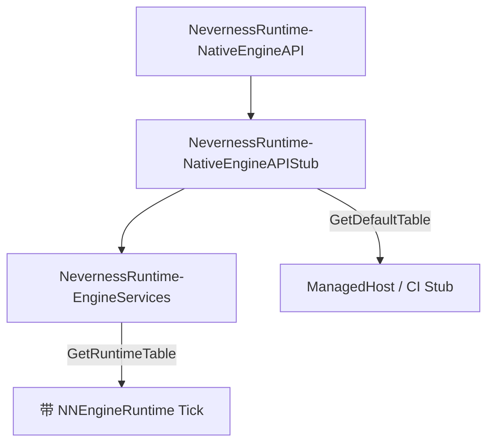

# NNRuntimeNativeEngineAPIStub — Stub / 虚拟 Runtime

> CMake 目标 **`NevernessRuntime-NativeEngineAPIStub`**；别名 **`NNNativeEngineAPIStub`**。C 导出符号为 **`NNNativeEngineApi_*`**（与 **NNNativeEngineAPI** 契约一致）。

## 1. 定位与边界

| 项目 | 说明 |
|------|------|
| **职责** | Editor / ManagedHost / 单元测试用的 **轻量引擎模拟器**：默认 Stub 函数指针、进程内 Mock（Object 引用计数表、AssetRegistry 路径↔GUID 映射）、**`NNNativeEngineApi_GetStubInvokeCount`** 测试计数、**`NNNativeEngineApi_GetDefaultTable`** 行程单例。 |
| **不负责** | 不链接 **NNEngineRuntime**、RHI、Legacy；不承载 Gameplay 产品逻辑。 |
| **CMake 目标** | `NevernessRuntime-NativeEngineAPIStub`（`STATIC`） |
| **依赖** | `NevernessRuntime-NativeEngineAPI`（`PUBLIC`，仅 ABI 头文件） |
| **典型消费者** | **NNRuntimeManaged**（`VISIONGAL_USE_ENGINE_RUNTIME_SERVICES=OFF` 或作为 Runtime 表基底）、**NevernessRuntime-EngineServices**（`BuildRuntime` 先调 `BuildDefault`）、**VGManagedHostTest**。 |

## 2. 目录结构

```
Engine/Source/Runtime/NNRuntimeNativeEngineAPIStub/
├── CMakeLists.txt
├── Docs/
│   └── MODULE_ARCHITECTURE_AND_PROGRESS.md
├── Public/
│   └── NNRuntimeNativeEngineApiStub.h      ← BuildDefault / GetDefaultTable / GetStubInvokeCount
└── Private/
    ├── Registry/NNNativeEngineApiTable.cpp  ← 聚合根建表（仅 NNBuild* 调用）
    ├── Common/StubInvokeCounter.*          ← 跨子系统 bump 计数
    ├── Internal/ApiStubBuilders.h
    ├── Render|UI|Audio|Asset|Input|Scene|Timing|Async|Entity/*ApiStubs.cpp
    ├── Object/ObjectStubDatabase.*         ← NN::StubRuntime::Object 状态
    └── AssetRegistry/AssetRegistryStubDatabase.*
```

## 3. 建表 API

| 符号 | 说明 |
|------|------|
| `NNNativeEngineApiTable_BuildDefault` | `memset` + `layoutVersion` + 各 **`NNBuildXxxApiStubs`** |
| `NNNativeEngineApi_GetDefaultTable` | 进程静态单例（`std::call_once`） |
| `NNNativeEngineApi_GetStubInvokeCount` | Stub 路径累计调用次数（测试观测） |
| `NNBuildRenderApiStubs` 等 | 仅写入子表函数指针；声明于 `Private/Internal/ApiStubBuilders.h` |

### 4.1 包含方式

```cpp
#include "NNRuntimeNativeEngineApiStub.h"
```

须链接 **`NevernessRuntime-NativeEngineAPIStub`**（会传递 ABI 头路径）。

## 4. 与双 Backend 架构



## 5. 开发进展

| 日期 | 进展 |
|------|------|
| 2026-05-18 | 从 **NNNativeEngineAPI** 拆出 God TU；子系统分文件 + **`NNBuild*ApiStubs`**；Object/AssetRegistry 状态迁入 **`NN::StubRuntime::*`**。 |

## 6. 相关链接

- [NNNativeEngineAPI](../NNNativeEngineAPI/Docs/MODULE_ARCHITECTURE_AND_PROGRESS.md)
- [NNRuntimeEngineServices](../NNRuntimeEngineServices/Docs/MODULE_ARCHITECTURE_AND_PROGRESS.md)
- [Runtime 总览](../../RUNTIME_ARCHITECTURE_AND_PROGRESS.md)
