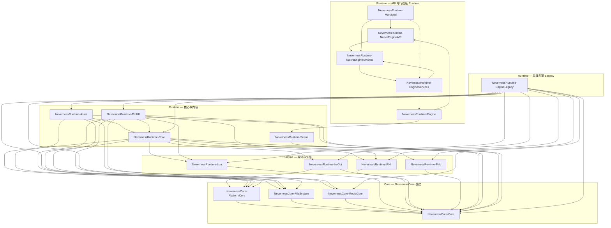

# Neverness Native Runtime — 架构与总进度

本文描述根 [`CMakeLists.txt`](../../../CMakeLists.txt) 中纳入的 **12 个** `Engine/Source/Runtime` **NN\*** 子模块的分层、依赖与文档入口。**NevernessCore** 原生基建位于 [`Engine/Source/Core`](../Core/KERNEL_ARCHITECTURE_AND_PROGRESS.md)（**4** 个默认构建 + **NNMeta** 目录预留；节点图模块目录存在但默认未构建）。**VisionGal 2026 Native 主线分工**（与 Managed **§0** 对齐）见本文 **§0**。各 Runtime 子模块的详细说明见 **该模块目录下** `Docs/MODULE_ARCHITECTURE_AND_PROGRESS.md`（路径索引见 [§2 模块索引](#2-模块索引)）。

与 **Managed** 栈的关系见 [MANAGED_RUNTIME_ARCHITECTURE_AND_PROGRESS.md](../Managed/MANAGED_RUNTIME_ARCHITECTURE_AND_PROGRESS.md)；其中 **Engine Service ABI** 与 **行程级 Runtime** 的 C 侧入口见 [NNNativeEngineAPI/Docs/MODULE_ARCHITECTURE_AND_PROGRESS.md](NNNativeEngineAPI/Docs/MODULE_ARCHITECTURE_AND_PROGRESS.md)、[NNRuntimeEngineServices/Docs/MODULE_ARCHITECTURE_AND_PROGRESS.md](NNRuntimeEngineServices/Docs/MODULE_ARCHITECTURE_AND_PROGRESS.md)。

---

## 0. Native 主线分工（2026，与 Managed 对齐）

| 原则 | Native 职责 | 非职责 |
|------|---------------|--------|
| **Kernel 化** | **NevernessRuntime-Engine**（`NNRuntimeEngine`，类名仍为 `VGEngineRuntime`）演进为真正 **Runtime Kernel**（排程、子系统生命周期、Scene／Entity 执行时等，见 Managed [MANAGED_RUNTIME_ARCHITECTURE_AND_PROGRESS.md](../Managed/MANAGED_RUNTIME_ARCHITECTURE_AND_PROGRESS.md) **§0.3**） | 不承载 **Gameplay 产品逻辑**（变量表、剧本 DSL、Graph VM 等均在 **Managed**） |
| **Lua** | **NevernessRuntime-Lua**（`NNRuntimeLua`）等仍存在于基建图中，**主线不再演进**；仅 **Legacy** 兼容 | 新能力不依赖 Lua Runtime 扩展 |
| **Graph** | **不**引入 Native Graph VM | **VisionGal.Managed.Graph.Runtime** 100% Managed（见 Managed **§0.3** P0-5） |

---

## 命名约定（目录 / CMake / 命名空间 vs C ABI）

| 层级 | 现行约定 | 说明 |
|------|----------|------|
| **源码目录** | `NNRuntime*`、`NNNativeEngineAPI`、`NNEngineLegacy` | 物理路径在 `Engine/Source/Runtime/` |
| **CMake 目标** | `NevernessRuntime-*`、`NevernessCore-*` | 链接与 `target_link_libraries` 以此为准 |
| **C++ 命名空间** | `NN::Runtime` | 应用壳、RHI、Legacy 引擎、Asset、RmlUI 等 |
| **C++ 命名空间** | `NN::Runtime::engine` | 行程级 Runtime Facade（`VGEngineRuntime`）与子系统 |
| **Include** | `#include <NNCore/...>` | Core 根为 `Engine/Source/Core`（CMake 变量 `VISIONGAL_KERNEL_ROOT`） |
| **Include** | `#include "NNNativeEngineAPI/Include/..."` | Runtime 内跨 ABI 模块常见写法 |
| **C ABI（Engine Service）** | `NNNativeEngineAPI`、`NNRenderAPI`、`NNNativeEngineApi_GetRuntimeTable()` 等 **`NN*`** | 与 **Neverness.Managed.Engine** 镜像对齐；**`VGEngineRuntime`** 等 C++ Facade 仍保留 **VG** 前缀（见 **NNRuntimeEngine**） |

**曾用名对照（脚注）**：VGLua→`NNRuntimeLua`；VGRHI→`NNRuntimeRHI`；VGPackage→`NNRuntimePak`；VGImgui→`NNRuntimeImGui`；VGCore→`NNRuntimeCore`；NNNativeEngineAPI→`NNNativeEngineAPI`；**VGEngineRuntime**→`NNRuntimeEngine`；VGEngineRuntimeServices→`NNRuntimeEngineServices`；VGAsset→`NNRuntimeAsset`；VGUI→`NNRuntimeRmlui`；**VGEngine**→`NNEngineLegacy`。

---

## 1. 分层总览（Native）

说明：上图为 **主要链接依赖** 的简化视图（以各模块 `CMakeLists.txt` 中 `target_link_libraries` 为准）；**NevernessCore** 细节见 [Core 总览](../Core/KERNEL_ARCHITECTURE_AND_PROGRESS.md)。**`NevernessRuntime-NativeEngineAPI` / `NevernessRuntime-Engine` / `NevernessRuntime-EngineServices` 不链接 `NevernessRuntime-EngineLegacy`**，供托管宿主与 Stub/Runtime 表路径使用。**`NNEngineLegacy`** 与根 CMake 选项 **`VISIONGAL_BUILD_LEGACY_GALGAME`**（`Engine/Source/Legacy` 旧产品线）不是同一概念。

---

## 2. 模块索引

| 目录 | CMake 目标 | 曾用名 | 文档 | 一句话职责 | 成熟度 |
|------|------------|--------|------|------------|--------|
| *(Core 基建)* | — | H\* | [Core 模块索引](../Core/KERNEL_ARCHITECTURE_AND_PROGRESS.md#2-模块索引) | NNCore、平台、文件系统、媒体等 | 见 Core 文档 |
| NNRuntimeLua | `NevernessRuntime-Lua` | VGLua | [Docs](NNRuntimeLua/Docs/MODULE_ARCHITECTURE_AND_PROGRESS.md) | Lua + sol2 绑定栈 | 生产 |
| NNRuntimeRHI | `NevernessRuntime-RHI` | VGRHI | [Docs](NNRuntimeRHI/Docs/MODULE_ARCHITECTURE_AND_PROGRESS.md) | OpenGL 渲染硬件抽象 | 生产 |
| NNRuntimePak | `NevernessRuntime-Pak` | VGPackage | [Docs](NNRuntimePak/Docs/MODULE_ARCHITECTURE_AND_PROGRESS.md) | 包体 / 资源包相关 | 生产 |
| NNRuntimeImGui | `NevernessRuntime-ImGui` | VGImgui | [Docs](NNRuntimeImGui/Docs/MODULE_ARCHITECTURE_AND_PROGRESS.md) | ImGui / 工具向 UI 扩展 | 生产 |
| NNRuntimeCore | `NevernessRuntime-Core` | VGCore | [Docs](NNRuntimeCore/Docs/MODULE_ARCHITECTURE_AND_PROGRESS.md) | 应用壳、窗口、与多子系统绑定的核心动态库 | 生产 |
| NNRuntimeScene | `NevernessRuntime-Scene` | — | [Docs](NNRuntimeScene/Docs/MODULE_ARCHITECTURE_AND_PROGRESS.md) | ECS-first Scene（System、层级、字段反射、二进制序列化） | **Phase 2–3 已落地** |
| NNNativeEngineAPI | `NevernessRuntime-NativeEngineAPI` | NNNativeEngineAPI | [Docs](NNNativeEngineAPI/Docs/MODULE_ARCHITECTURE_AND_PROGRESS.md) | Engine Service C ABI（仅头文件契约）；**layout v6** 含 **`NNApplicationAPI`** | ABI 稳定演进 |
| NNRuntimeApplication | `NevernessRuntime-Application` | — | [Docs](NNRuntimeApplication/Docs/MODULE_ARCHITECTURE_AND_PROGRESS.md) | 统一 SDL Application 宿主（`NNApplicationAPI` Runtime 实现） | **已落地** |
| NNRuntimeNativeEngineAPIStub | `NevernessRuntime-NativeEngineAPIStub` | NNNativeEngineAPIStub | [Docs](NNRuntimeNativeEngineAPIStub/Docs/MODULE_ARCHITECTURE_AND_PROGRESS.md) | Stub / Mock / GetDefaultTable | 已落地 |
| NNRuntimeManaged | `NevernessRuntime-Managed` | VGManagedCore | [Docs](NNRuntimeManaged/Docs/MODULE_ARCHITECTURE_AND_PROGRESS.md) | **NNNativeAPI** 函数表 SHARED 导出；托管镜像在 Managed/Runtime/Core | Phase 2–3 已落地 |
| NNRuntimeManagedHostLegacy | `NevernessRuntime-ManagedHostLegacy` | VGManagedHost（弃用别名） | [Docs](NNRuntimeManagedHostLegacy/Docs/MODULE_ARCHITECTURE_AND_PROGRESS.md) | Legacy CoreCLR 宿主（**可选**，`VISIONGAL_ENABLE_MANAGED_HOST_LEGACY`）；主路径见 Entry.Bootstrap | Migration-3 |
| NNRuntimeManagedBridge | `NevernessRuntime-ManagedBridge` | — | [Docs](NNRuntimeManagedBridge/Docs/MODULE_ARCHITECTURE_AND_PROGRESS.md) | `NNEngineRuntimeHost_TickManaged` 桥接 | Migration-6a |
| NNRuntimeEngine | `NevernessRuntime-Engine` | **VGEngineRuntime** | [Docs](NNRuntimeEngine/Docs/MODULE_ARCHITECTURE_AND_PROGRESS.md) | 行程级 Timing / Async / 子系统门面 | Phase4 首包 |
| NNRuntimeEngineServices | `NevernessRuntime-EngineServices` | VGEngineRuntimeServices | [Docs](NNRuntimeEngineServices/Docs/MODULE_ARCHITECTURE_AND_PROGRESS.md) | 将 ABI 表覆写为转发表（别名 **NNEngineRuntimeServices**） | Phase4 首包 |
| NNRuntimeAsset | `NevernessRuntime-Asset` | VGAsset | [Docs](NNRuntimeAsset/Docs/MODULE_ARCHITECTURE_AND_PROGRESS.md) | Galgame 等资源类型与加载 | 生产 |
| NNRuntimeRmlui | `NevernessRuntime-RmlUI` | VGUI | [Docs](NNRuntimeRmlui/Docs/MODULE_ARCHITECTURE_AND_PROGRESS.md) | RmlUi + Lua 元素等 UI 运行时 | 生产 |
| NNEngineLegacy | `NevernessRuntime-EngineLegacy` | **VGEngine** | [Docs](NNEngineLegacy/Docs/MODULE_ARCHITECTURE_AND_PROGRESS.md) | 单体游戏引擎（场景、资源、渲染管线等；编辑器主链） | 生产 |

---

## 3. 全局构建开关（与本树相关）

| 选项 | 默认 | 说明 |
|------|------|------|
| `VISIONGAL_USE_ENGINE_RUNTIME_SERVICES` | ON | 为 **NNRuntimeManaged** 的默认 Native 表挂载 `NNNativeEngineApi_GetRuntimeTable()`；OFF 时 Stub 表路径见 [NNRuntimeEngineServices 文档](NNRuntimeEngineServices/Docs/MODULE_ARCHITECTURE_AND_PROGRESS.md)。 |
| `VISIONGAL_BUILD_LEGACY_GALGAME` | OFF | **Legacy Galgame** 不在 `Source/Runtime` 内；开启后在 `Engine/Source/Legacy` 追加旧产品线目标。 |
| `VISIONGAL_ENABLE_MANAGED_HOST_LEGACY` | **OFF** | 为 **ON** 时（仅 Win/MSVC）构建 **NNRuntimeManagedHostLegacy**；旧名 `VISIONGAL_ENABLE_MANAGED_HOST` 转发并 WARNING。 |
| `NEVERNESS_BUILD_RUNTIME_KERNEL_APP` | **OFF** | 构建 **NNRuntimeKernelApplication** 演示（Native+Managed 双 Tick）。 |

---

## 4. Phase 总览（Runtime 视角）

| Phase | 内容 | 状态 |
|-------|------|------|
| Core 基建 | NevernessCore-Core / 平台 / 文件系统 / 媒体（见 [Core](../Core/KERNEL_ARCHITECTURE_AND_PROGRESS.md)） | 持续维护 |
| Runtime 基建 | Lua / RHI / 包 / ImGui / Core | 持续维护 |
| 引擎主体 | EngineLegacy（原 VGEngine）+ Asset + RmlUI 聚合 | 持续维护 |
| Engine ABI | NNNativeEngineAPI / `NNNativeEngineAPI`（函数表 + Stub） | 已落地，随 layout 演进 |
| 行程级 Runtime | NNRuntimeEngine + NNRuntimeEngineServices | Phase 4 首包已合入；**§2.7.1** **EntitySubsystem** 与 **`entity.*`** Runtime 覆写（**layout v5**）已合入 |

---

## 5. 开发进展与总体状态

### 5.1 里程碑时间线

| 日期 | 进展 |
|------|------|
| 2026-05-17 | **NNRuntimeScene Phase 1**：`NevernessRuntime-Scene`（世代 **NNEntity**、entt registry、Query、**NNComponentRegistry**）；**standalone**，不修改 EngineLegacy / SceneSubsystem / ABI layout；见 [NNRuntimeScene 文档](NNRuntimeScene/Docs/MODULE_ARCHITECTURE_AND_PROGRESS.md)。 |
| 2026-05-17 | **NNRuntimeScene Phase 2–3**：**ISceneSystem** 调度、**NNHierarchySystem**、**NNSceneEventBus**/**NNDirtyTracker**、字段反射（**NN_FIELD**）、**NNSceneSerializer**（**VGSC**）；**NevernessRuntime-Engine** 私有链接 Scene，**NNRuntimeSceneTickSubsystem** 挂 **Update** 驱动 **`VGEngineRuntime::EcsScene()`**。 |
| 2026-05-17 | **NN\*** 目录与 **NevernessRuntime-\*** / **NevernessCore-\*** CMake 目标重命名后，Runtime/Core 架构文档与代码对齐（命名约定见上文）。 |
| 2026-05-16 | **H\*** 模块迁入 `Engine/Source/Core`；Runtime 根文档改为 **11** 个 Runtime 子模块 + Core 互链。 |
| 2026-05-15 | 补齐 Runtime 根总览与各模块 `Docs/MODULE_ARCHITECTURE_AND_PROGRESS.md` 索引，统一简体中文与互链。 |
| 2026-05-15 | Managed Phase 6 slice 5：**VisionGal.Managed.Gameplay** 序列分支与 **Advance** 可恢复等待（纯托管）；总览见 [MANAGED_RUNTIME_ARCHITECTURE_AND_PROGRESS.md](../Managed/MANAGED_RUNTIME_ARCHITECTURE_AND_PROGRESS.md) §2.6.1。 |
| 2026-05-16 | 根文档补充 **§5.2** 总体状态表（完成度 / 未完成项 / 未来规划）；与 **NNNativeEngineAPI**、**NNRuntimeEngine** 模块文档交叉更新。 |
| 2026-05-17 | 与 [MANAGED_RUNTIME_ARCHITECTURE_AND_PROGRESS.md](../Managed/MANAGED_RUNTIME_ARCHITECTURE_AND_PROGRESS.md) **§2** 对齐：**Phase 6 托管** slice 2–5 已落地；验证侧以 **VisionGal.Managed.Foundation.Tests**（dotnet）为主。 |
| 2026-05-18 | Managed **§5.1** 增 **Phase 6 Native**（Gameplay／存档）推进顺序草案；本根 **§6** 与之对齐。 |
| 2026-05-19 | 托管 **P0 VisionGal.Managed.Entity** 递增至 **HasComponent** / **GetComponent**（纯 C#）；当时 **Native `NNEntityAPI` 子表**仍未纳入 **NNNativeEngineAPI**（随后由 **layout v4** 骨架落地，见 MANAGED **§2.7.1**）。 |
| 2026-05-20 | 托管 **EntityWorld** 增 **GetComponentCount** 与关键路径中文注释（MANAGED **§2.5.3**）；**Native** 侧无变更；验证仍以 **Foundation.Tests** 为主。 |
| 2026-05-21 | 托管 **EntityWorld** 增 **Type** 键 **HasComponent**／**TryGetComponent**（MANAGED **§2.5.4**）；当时 **Native `NNEntityAPI`** 仍未纳入表（随后由 **layout v4** 骨架取代，见下行）。 |
| 2026-05-15 | **layout v4**：**NNNativeEngineAPI** 尾部 **`NNEntityAPI`** 骨架（**`EntityAPI.h`**、`getServiceAbiToken`）；与托管 **VisionGal.Managed.Engine** 镜像及 **VGManagedHostTest** / **NativeEngineApiEntityServiceTests** 对齐；**NNRuntimeEngineServices** 当前继承 Stub；**NNEntityHandle** 与托管 **EntityHandle** 边界见 MANAGED **§2.7.1**。 |
| 2026-05-15 | Managed **§2.7.1 首包**：见上；RUNTIME **§5.2** / **§6** 同步「子表已纳入、系统未开始」语义。 |
| 2026-05-15 | **layout v5 / §2.7.1 Kernel 首包**：**`getRuntimeTick`**、**EntitySubsystem**、**`BuildRuntime`** 覆写 **`entity.*`**；MANAGED **§2.7.1** 与 **§5.2**／**§6** 同步「Runtime 已驱动 Entity 子表观测」语义；完整 **VGEntitySystem** 仍为后续项。 |

### 5.2 Runtime 总体状态（2026-05-17，与 MANAGED §2.5 对齐）

| 维度 | 说明 |
|------|------|
| **完成度** | **12** 个 Runtime 子模块 + **4** 个默认构建 Core 子模块（**NNMeta** 目录预留）；**NevernessRuntime-Scene** Phase 2–3（ECS Handle + System + 字段反射 + 二进制序列化）已合入；**NevernessRuntime-Engine** 经 **NNRuntimeSceneTickSubsystem** 在 **Update** 组驱动 **`EcsScene()`**（与 **SceneSubsystem** 并存）；**NevernessRuntime-EngineLegacy**（原 VGEngine）、**NevernessRuntime-Asset**、**NevernessRuntime-RmlUI** 等为生产级；**NNNativeEngineAPI**（函数表 + Stub，**layout v4** 起含尾部 **`NNEntityAPI`**；**layout v5** 起含 **`getRuntimeTick`**）与 **NevernessRuntime-Engine** / **NevernessRuntime-EngineServices**（Phase 4 首包 + **EntitySubsystem**；**P0-1** 起 **RuntimeScheduler** / **IRuntimeSubsystem** 统一 Tick 管线，**EntitySubsystem** 挂 **Update** 组）已与托管 **Phase 4** 打通 Tick、Async、Scene 内存模型、Object、AssetRegistry 等转发路径；**`BuildRuntime`** 覆写 **`entity.*`** 至 **EntitySubsystem**。托管 **P0 Entity**（**VisionGal.Managed.Entity**）在 **EntityWorld** 上已具备泛型与 **Type** 键查询／**GetComponent**／**RemoveComponent** 及 **GetComponentCount**（MANAGED **§2.5.2–§2.5.5**），与 Native 场景 **NNEntityHandle** 仍无自动桥接；**`NNEntityAPI`** 当前为 ABI 冒烟 + **`getRuntimeTick`** 可观测性，**不代表**托管 **EntityWorld** 已镜像（见 MANAGED **§2.7.1**）。对称托管 **VisionGal.Managed.RuntimeLoop** 见 MANAGED **§0.3**。 |
| **开发进展** | 各 Native 模块以 `Docs/MODULE_ARCHITECTURE_AND_PROGRESS.md` 末尾「开发进展」为准。托管 **Phase 6 托管子阶段**（slice 2–5，见 MANAGED **§2.3–§2.6.1**）为纯 C#，**不**修改本树 C++ 与 ABI layout；托管 **P0 Entity** slice 2–5 见 MANAGED **§2.5.2**–**§2.5.5**。**Phase 6** 整体在 MANAGED **§2** 仍标「进行中」系因 **Native Gameplay／存档** 子项未纳入 ABI 表。 |
| **未完成项** | **NNRuntimeScene** Phase 4+（**Prefab**、**NNSceneRuntime** Streaming、**SceneSubsystem** 数据桥接、C API **`NN_AddComponent`**、JSON 导出）；**VGEntitySystem**（完整实体子系统实现）未开始；**`NNEntityAPI`** Kernel 首包已随 **layout v5** 纳入并由 **BuildRuntime** 转发（见 MANAGED **§2.7.1**）。**EntityWorld** 与 Native **数据镜像**仍为后续文档与实现项。**NevernessRuntime-Engine** 与 **NevernessRuntime-Asset** 真实资源管线、**EngineLegacy** 全量 Adapter 仍为长期项；Lua 栈迁移依赖产品与 Graph 路线。**P0-1 Scheduler 首包**已落地（**Timing → FrameContext → RuntimeScheduler**；**Async** 主线程队列仍为占位）；**Kernel 化第一阶段**其余项（Scene Runtime、双世界深化、Graph.Runtime、Managed Component）见 Managed **§0.3**。索引性清单见 [MANAGED_RUNTIME_ARCHITECTURE_AND_PROGRESS.md](../Managed/MANAGED_RUNTIME_ARCHITECTURE_AND_PROGRESS.md) **§2.7**。 |
| **未来规划** | 与 Managed [MANAGED_RUNTIME_ARCHITECTURE_AND_PROGRESS.md](../Managed/MANAGED_RUNTIME_ARCHITECTURE_AND_PROGRESS.md) **§5** 总表及 **§5.1** Native 子项草案对齐：**NNNativeEngineAPI** 扩展 Gameplay／存档子表、**NNRuntimeEngineServices** 转发、跨栈测试；并继续 **P0+**（**VGEntitySystem**、Scene Runtime、Graph）与 **Kernel 化**。**Runtime Kernel 第一阶段路线**（Scheduler、Scene Runtime、双世界实体等）见 Managed **§0**。 |

## 6. 未来规划（与 Managed §5 / §5.1 对齐）

| 维度 | 说明 |
|------|------|
| **完成度（Native 侧）** | **Phase 6 Native 子项**（Gameplay／存档服务表与文件 I/O）尚未纳入 **NNNativeEngineAPI**；托管侧 **GameplaySessionSnapshot** 等已提供 JSON 容器，可与 Native 层「文件句柄 + 字节缓冲」策略对接（见 Managed **§5.1**）。 |
| **开发进展** | 以 **NNNativeEngineAPI**、**NNRuntimeEngineServices** 模块文档「开发进展」为准；ABI 变更前维持 Stub 与现有 Host 测试路径。 |
| **未完成项** | 与 Managed **§2.7** 一致：**VGEntitySystem**（完整实现）与 **EntityWorld**／Native **数据镜像**；Gameplay／存档 Native 表、**VGSceneRuntime**、Graph、Lua 迁出等。**`NNEntityAPI`** Kernel 首包已纳入 **layout v5**，**`BuildRuntime`** 已覆写 **`entity.*`**（MANAGED **§2.7.1**）。 |
| **推进顺序（索引）** | 详细四步草案见 [MANAGED_RUNTIME_ARCHITECTURE_AND_PROGRESS.md](../Managed/MANAGED_RUNTIME_ARCHITECTURE_AND_PROGRESS.md) **§5.1**（布局与版本、最小 I/O 语义、Runtime 转发、产品化）。 |

### 6.1 里程碑补充

| 日期 | 进展 |
|------|------|
| 2026-05-18 | 根文档新增 **§6**；与 Managed **§5.1** Phase 6 Native 子项推进顺序交叉引用。 |
| 2026-05-19 | 与 MANAGED **§2.5.2** 对齐：托管 **EntityWorld** 查询 API；**Native NNEntityAPI** 仍见 MANAGED **§2.7.1**。 |
| 2026-05-20 | 与 MANAGED **§2.5.3** 对齐：**GetComponentCount** 与注释补强；**Runtime Kernel** 子系统与托管 **EntityWorld** 仍无自动桥接。 |
| 2026-05-21 | 与 MANAGED **§2.5.4** 对齐：**Type** 键查询仍纯 C#；**`NNEntityAPI`** 子表尚未落地（已由 **layout v4** 取代，见下行）。 |
| 2026-05-15 | 与 MANAGED **§2.5.5** 对齐：**Type** 键 **GetComponent**／**RemoveComponent** 仍纯 C#；**Kernel** 无新增转发。 |
| 2026-05-15 | **layout v4**：**`NNEntityAPI`** 子表骨架已纳入 **NNNativeEngineAPI**；**`getServiceAbiToken`** 冒烟；**VGEntitySystem** 仍未实现。 |
| 2026-05-15 | **layout v5**：**`getRuntimeTick`**；**EntitySubsystem**；**`BuildRuntime`** 覆写 **`entity.*`**；**VGEntitySystem** 完整实现仍为后续。 |
| 2026-05-20 | **layout v6**：**`NNApplicationAPI`**；**NNRuntimeApplication**（SDL 窗口/事件泵）；**`BuildRuntime`** 覆写 **`application.*`**；托管 **Neverness.Runtime.Application**。 |
| 2026-05-15 | **P0 文档对齐**：**§5.2** 表头日期与 Phase 表「行程级 Runtime」行补充 **Entity** 转发语义；与 MANAGED **§2.5**／**§2.7.1** 一致。 |
| 2026-05-15 | **P0 对齐审计**：与 MANAGED **§2.7.1** 再核一致；**MERGED** 由 **merge_docs** 源文档刷新；无 Native 行为变更。 |
| 2026-05-15 | **§0 对齐**：新增本文 **§0** Native 主线分工；与 Managed **§0**（2026 原则、P0–P2）互链；**§5.2** 未来规划指向 **Kernel 化** 阶段表。 |
| 2026-05-15 | **§0 主线叙事落地**：Managed **§0** 写入 **P0-1～P0-5**／**P1／P2** 表；本根 **§5.2** 未完成项补 **§0.3** 索引。 |
| 2026-05-17 | **NNRuntimeScene Phase 1** 与 MANAGED **§0.3 P0-2/P0-3** 对齐：**NNEntity** 打包与 **EntityHandle** 一致；仍无 C# 自动桥接。 |
| 2026-05-17 | **NNRuntimeScene Phase 2–3**：Native 字段反射首包 + **VGSC** 序列化；**Engine→Scene** 适配已合入；仍无 C# 自动组件绑定。 |
| 2026-05-15 | **P0-1**：**NNRuntimeEngine** 内 **RuntimeScheduler**；**EntitySubsystem** 实现 **IRuntimeSubsystem**；托管 **VisionGal.Managed.RuntimeLoop**；**ABI layout** 未变。 |
