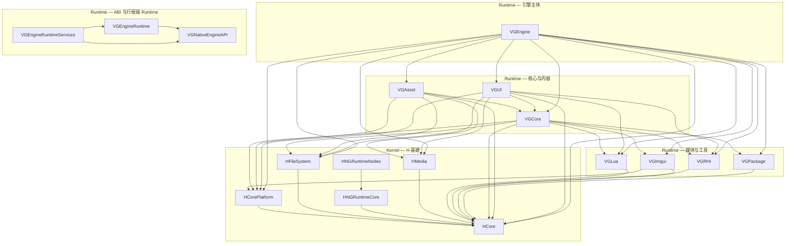

# VisionGal Native Runtime — 架构与总进度

本文描述根 [`CMakeLists.txt`](../../../CMakeLists.txt) 中纳入的 **11 个** `Engine/Source/Runtime` **VG\*** 子模块的分层、依赖与文档入口。**H\*** 原生基建已迁入 [`Engine/Source/Kernel`](../Kernel/KERNEL_ARCHITECTURE_AND_PROGRESS.md)（**6** 个默认构建 + **HMeta** 目录预留）。**VisionGal 2026 Native 主線分工**（与 Managed **§0** 对齐）见本文 **§0**。各 Runtime 子模块的详细说明见 **该模块目录下** `Docs/MODULE_ARCHITECTURE_AND_PROGRESS.md`（路径索引见 [§2 模块索引](#2-模块索引)）。

与 **Managed** 栈的关系见 [MANAGED_RUNTIME_ARCHITECTURE_AND_PROGRESS.md](../Managed/MANAGED_RUNTIME_ARCHITECTURE_AND_PROGRESS.md)；其中 **Engine Service ABI** 与 **行程级 Runtime** 的 C 侧入口见 [VGNativeEngineAPI/Docs/MODULE_ARCHITECTURE_AND_PROGRESS.md](VGNativeEngineAPI/Docs/MODULE_ARCHITECTURE_AND_PROGRESS.md)、[VGEngineRuntimeServices/Docs/MODULE_ARCHITECTURE_AND_PROGRESS.md](VGEngineRuntimeServices/Docs/MODULE_ARCHITECTURE_AND_PROGRESS.md)。

---

## 0. Native 主線分工（2026，与 Managed 对齐）

| 原则 | Native 职责 | 非职责 |
|------|---------------|--------|
| **Kernel 化** | **VGEngineRuntime** 演进为真正 **Runtime Kernel**（排程、子系统生命周期、Scene／Entity 执行时等，见 Managed [MANAGED_RUNTIME_ARCHITECTURE_AND_PROGRESS.md](../Managed/MANAGED_RUNTIME_ARCHITECTURE_AND_PROGRESS.md) **§0.3**） | 不承载 **Gameplay 产品逻辑**（变量表、剧本 DSL、Graph VM 等均在 **Managed**） |
| **Lua** | **VGLua** 等仍存在于基建图中，**主线不再演进**；仅 **Legacy** 兼容 | 新能力不依赖 Lua Runtime 扩展 |
| **Graph** | **不**引入 Native Graph VM | **VisionGal.Managed.Graph.Runtime** 100% Managed（见 Managed **§0.3** P0-5） |

---

## 1. 分层总览（Native）

说明：上图为 **主要链接依赖** 的简化视图（以各模块 `CMakeLists.txt` 中 `target_link_libraries` 为准）；**H\*** 细节见 [Kernel 总览](../Kernel/KERNEL_ARCHITECTURE_AND_PROGRESS.md)。**`VGNativeEngineAPI` / `VGEngineRuntime` / `VGEngineRuntimeServices` 不链接 `VGEngine`**，供托管宿主与 Stub/Runtime 表路径使用。

---

## 2. 模块索引

| 模块 | CMake 目标 | 文档 | 一句话职责 | 成熟度 |
|------|------------|------|------------|--------|
| *(H\* 基建)* | — | [Kernel 模块索引](../Kernel/KERNEL_ARCHITECTURE_AND_PROGRESS.md#2-模块索引) | HCore、平台、文件系统、媒体、节点图运行时等 | 见 Kernel 文档 |
| VGLua | `VGLua` | [Docs/MODULE_ARCHITECTURE_AND_PROGRESS.md](VGLua/Docs/MODULE_ARCHITECTURE_AND_PROGRESS.md) | Lua + sol2 绑定栈 | 生产 |
| VGRHI | `VGRHI` | [Docs/MODULE_ARCHITECTURE_AND_PROGRESS.md](VGRHI/Docs/MODULE_ARCHITECTURE_AND_PROGRESS.md) | OpenGL 渲染硬件抽象 | 生产 |
| VGPackage | `VGPackage` | [Docs/MODULE_ARCHITECTURE_AND_PROGRESS.md](VGPackage/Docs/MODULE_ARCHITECTURE_AND_PROGRESS.md) | 包体 / 资源包相关 | 生产 |
| VGImgui | `VGImgui` | [Docs/MODULE_ARCHITECTURE_AND_PROGRESS.md](VGImgui/Docs/MODULE_ARCHITECTURE_AND_PROGRESS.md) | ImGui / 工具向 UI 扩展 | 生产 |
| VGCore | `VGCore` | [Docs/MODULE_ARCHITECTURE_AND_PROGRESS.md](VGCore/Docs/MODULE_ARCHITECTURE_AND_PROGRESS.md) | 应用壳、窗口、与多子系统绑定的核心动态库 | 生产 |
| VGNativeEngineAPI | `VGNativeEngineAPI` | [Docs/MODULE_ARCHITECTURE_AND_PROGRESS.md](VGNativeEngineAPI/Docs/MODULE_ARCHITECTURE_AND_PROGRESS.md) | Engine Service C ABI（函数表 + Stub） | ABI 稳定演进 |
| VGEngineRuntime | `VGEngineRuntime` | [Docs/MODULE_ARCHITECTURE_AND_PROGRESS.md](VGEngineRuntime/Docs/MODULE_ARCHITECTURE_AND_PROGRESS.md) | 行程级 Timing / Async / 子系统门面 | Phase4 首包 |
| VGEngineRuntimeServices | `VGEngineRuntimeServices` | [Docs/MODULE_ARCHITECTURE_AND_PROGRESS.md](VGEngineRuntimeServices/Docs/MODULE_ARCHITECTURE_AND_PROGRESS.md) | 将 ABI 表覆写为转发表 | Phase4 首包 |
| VGAsset | `VGAsset` | [Docs/MODULE_ARCHITECTURE_AND_PROGRESS.md](VGAsset/Docs/MODULE_ARCHITECTURE_AND_PROGRESS.md) | Galgame 等资源类型与加载 | 生产 |
| VGUI | `VGUI` | [Docs/MODULE_ARCHITECTURE_AND_PROGRESS.md](VGUI/Docs/MODULE_ARCHITECTURE_AND_PROGRESS.md) | RmlUi + Lua 元素等 UI 运行时 | 生产 |
| VGEngine | `VGEngine` | [Docs/MODULE_ARCHITECTURE_AND_PROGRESS.md](VGEngine/Docs/MODULE_ARCHITECTURE_AND_PROGRESS.md) | 游戏引擎主体（场景、资源、渲染管线等） | 生产 |

---

## 3. 全局构建开关（与本树相关）

| 选项 | 默认 | 说明 |
|------|------|------|
| `VISIONGAL_USE_ENGINE_RUNTIME_SERVICES` | ON | 为 `VGManagedCore` 的默认 Native 表挂载 `VGNativeEngineApi_GetRuntimeTable()`；OFF 时 Stub 表路径见 [VGEngineRuntimeServices 文档](VGEngineRuntimeServices/Docs/MODULE_ARCHITECTURE_AND_PROGRESS.md)。 |
| `VISIONGAL_BUILD_LEGACY_GALGAME` | OFF | **Legacy Galgame** 不在 `Source/Runtime` 内；开启后在 `Engine/Source/Legacy` 追加旧产品线目标。 |
| `VISIONGAL_ENABLE_MANAGED_HOST` | Win/MSVC 上 ON | 构建托管宿主时才会加入 `VGManagedCore` / `VGManagedHost`，与 Runtime ABI 文档交叉引用。 |

---

## 4. Phase 总览（Runtime 视角）

| Phase | 内容 | 状态 |
|-------|------|------|
| Kernel 基建 | HCore / 平台 / 文件系统 / 媒体 / 节点图（见 [Kernel](../Kernel/KERNEL_ARCHITECTURE_AND_PROGRESS.md)） | 持续维护 |
| Runtime 基建 | Lua / RHI / 包 / ImGui / Core | 持续维护 |
| 引擎主体 | VGEngine + VGAsset + VGUI 聚合 | 持续维护 |
| Engine ABI | VGNativeEngineAPI（函数表 + Stub） | 已落地，随 layout 演进 |
| 行程级 Runtime | VGEngineRuntime + VGEngineRuntimeServices | Phase 4 首包已合入；**§2.7.1** **EntitySubsystem** 与 **`entity.*`** Runtime 覆写（**layout v5**）已合入 |

---

## 5. 开发进展与总体状态

### 5.1 里程碑时间线

| 日期 | 进展 |
|------|------|
| 2026-05-16 | **H\*** 模块迁入 `Engine/Source/Kernel`；Runtime 根文档改为 **11** 个 VG 子模块 + Kernel 互链。 |
| 2026-05-15 | 补齐 Runtime 根总览与各模块 `Docs/MODULE_ARCHITECTURE_AND_PROGRESS.md` 索引，统一简体中文与互链。 |
| 2026-05-15 | Managed Phase 6 slice 5：**VisionGal.Managed.Gameplay** 序列分支与 **Advance** 可恢复等待（纯托管）；总览见 [MANAGED_RUNTIME_ARCHITECTURE_AND_PROGRESS.md](../Managed/MANAGED_RUNTIME_ARCHITECTURE_AND_PROGRESS.md) §2.6.1。 |
| 2026-05-16 | 根文档补充 **§5.2** 总体状态表（完成度 / 未完成项 / 未来规划）；与 **VGNativeEngineAPI**、**VGEngineRuntime** 模块文档交叉更新。 |
| 2026-05-17 | 与 [MANAGED_RUNTIME_ARCHITECTURE_AND_PROGRESS.md](../Managed/MANAGED_RUNTIME_ARCHITECTURE_AND_PROGRESS.md) **§2** 对齐：**Phase 6 托管** slice 2–5 已落地；验证侧以 **VisionGal.Managed.Foundation.Tests**（dotnet）与 **VGManagedHostTest**（ctest，可选）为主。 |
| 2026-05-18 | Managed **§5.1** 增 **Phase 6 Native**（Gameplay／存档）推进顺序草案；本根 **§6** 与之对齐。 |
| 2026-05-19 | 托管 **P0 VisionGal.Managed.Entity** 递增至 **HasComponent** / **GetComponent**（纯 C#）；当时 **Native `VGEntityAPI` 子表**仍未纳入 **VGNativeEngineAPI**（随后由 **layout v4** 骨架落地，见 MANAGED **§2.7.1**）。 |
| 2026-05-20 | 托管 **EntityWorld** 增 **GetComponentCount** 与关键路径中文注释（MANAGED **§2.5.3**）；**Native** 侧无变更；验证仍以 **Foundation.Tests** 为主。 |
| 2026-05-21 | 托管 **EntityWorld** 增 **Type** 键 **HasComponent**／**TryGetComponent**（MANAGED **§2.5.4**）；当时 **Native `VGEntityAPI`** 仍未纳入表（随后由 **layout v4** 骨架取代，见下行）。 |
| 2026-05-15 | **layout v4**：**VGNativeEngineAPI** 尾部 **`VGEntityAPI`** 骨架（**`EntityAPI.h`**、`getServiceAbiToken`）；与托管 **VisionGal.Managed.Engine** 镜像及 **VGManagedHostTest** / **NativeEngineApiEntityServiceTests** 对齐；**VGEngineRuntimeServices** 当前继承 Stub；**VGEntityHandle** 与托管 **EntityHandle** 边界见 MANAGED **§2.7.1**。 |
| 2026-05-15 | Managed **§2.7.1 首包**：见上；RUNTIME **§5.2** / **§6** 同步「子表已纳入、系统未开始」语义。 |
| 2026-05-15 | **layout v5 / §2.7.1 Kernel 首包**：**`getRuntimeTick`**、**EntitySubsystem**、**`BuildRuntime`** 覆写 **`entity.*`**；MANAGED **§2.7.1**／**§207** 与 **§5.2**／**§6** 同步「Runtime 已驱动 Entity 子表观测」语义；完整 **VGEntitySystem** 仍为后续项。 |

### 5.2 Runtime 总体状态（2026-05-15，与 MANAGED §2.5 对齐）

| 维度 | 说明 |
|------|------|
| **完成度** | **11** 个 Runtime 子模块 + **6** 个 Kernel 子模块（**7** 含 **HMeta** 目录）；**VGEngine**、**VGAsset**、**VGUI** 等为生产级；**VGNativeEngineAPI**（函数表 + Stub，**layout v4** 起含尾部 **`VGEntityAPI`**；**layout v5** 起含 **`getRuntimeTick`**）与 **VGEngineRuntime** / **VGEngineRuntimeServices**（Phase 4 首包 + **EntitySubsystem**；**P0-1** 起 **RuntimeScheduler** / **IRuntimeSubsystem** 统一 Tick 管线，**EntitySubsystem** 挂 **Update** 组）已与托管 **Phase 4** 打通 Tick、Async、Scene 内存模型、Object、AssetRegistry 等转发路径；**`BuildRuntime`** 覆写 **`entity.*`** 至 **EntitySubsystem**。托管 **P0 Entity**（**VisionGal.Managed.Entity**）在 **EntityWorld** 上已具备泛型与 **Type** 键查询／**GetComponent**／**RemoveComponent** 及 **GetComponentCount**（MANAGED **§2.5.2–§2.5.5**），与 Native 场景 **VGEntityHandle** 仍无自动桥接；**`VGEntityAPI`** 当前为 ABI 冒烟 + **`getRuntimeTick`** 可观测性，**不代表**托管 **EntityWorld** 已镜像（见 MANAGED **§2.7.1**）。对称托管 **VisionGal.Managed.RuntimeLoop** 见 MANAGED **§0.3**。 |
| **开发进展** | 各 Native 模块以 `Docs/MODULE_ARCHITECTURE_AND_PROGRESS.md` 末尾「开发进展」为准。托管 **Phase 6 托管子阶段**（slice 2–5，见 MANAGED **§2.3–§2.6.1**）为纯 C#，**不**修改本树 C++ 与 ABI layout；托管 **P0 Entity** slice 2–5 见 MANAGED **§2.5.2**–**§2.5.5**。**Phase 6** 整体在 MANAGED **§2** 仍标「进行中」系因 **Native Gameplay／存档** 子项未纳入 ABI 表。 |
| **未完成项** | **VGEntitySystem**（完整实体子系统实现）未开始；**`VGEntityAPI`** Kernel 首包已随 **layout v5** 纳入并由 **BuildRuntime** 转发（见 MANAGED **§2.7.1**）。**EntityWorld** 与 Native **数据镜像**仍为后续文档与实现项。**VGEngineRuntime** 与 **VGAsset** 真实资源管线、**VGEngine** 全量 Adapter 仍为长期项；Lua 栈迁移依赖产品与 Graph 路线。**P0-1 Scheduler 首包**已落地（**Timing → FrameContext → RuntimeScheduler**；**Async** 主线程队列仍为占位）；**Kernel 化第一阶段**其余项（Scene Runtime、双世界深化、Graph.Runtime、Managed Component）见 Managed **§0.3**。索引性清单见 [MANAGED_RUNTIME_ARCHITECTURE_AND_PROGRESS.md](../Managed/MANAGED_RUNTIME_ARCHITECTURE_AND_PROGRESS.md) **§2.7**。 |
| **未来规划** | 与 Managed [MANAGED_RUNTIME_ARCHITECTURE_AND_PROGRESS.md](../Managed/MANAGED_RUNTIME_ARCHITECTURE_AND_PROGRESS.md) **§5** 总表及 **§5.1** Native 子项草案对齐：**VGNativeEngineAPI** 扩展 Gameplay／存档子表、**VGEngineRuntimeServices** 转发、跨栈测试；并继续 **P0+**（**VGEntitySystem**、Scene Runtime、Graph）与 **Kernel 化**。**Runtime Kernel 第一阶段路线**（Scheduler、Scene Runtime、双世界实体等）见 Managed **§0**。 |

## 6. 未来规划（与 Managed §5 / §5.1 对齐）

| 维度 | 说明 |
|------|------|
| **完成度（Native 侧）** | **Phase 6 Native 子项**（Gameplay／存档服务表与文件 I/O）尚未纳入 **VGNativeEngineAPI**；托管侧 **GameplaySessionSnapshot** 等已提供 JSON 容器，可与 Native 层「文件句柄 + 字节缓冲」策略对接（见 Managed **§5.1**）。 |
| **开发进展** | 以 **VGNativeEngineAPI**、**VGEngineRuntimeServices** 模块文档「开发进展」为准；ABI 变更前维持 Stub 与现有 Host 测试路径。 |
| **未完成项** | 与 Managed **§2.7** 一致：**VGEntitySystem**（完整实现）与 **EntityWorld**／Native **数据镜像**；Gameplay／存档 Native 表、**VGSceneRuntime**、Graph、Lua 迁出等。**`VGEntityAPI`** Kernel 首包已纳入 **layout v5**，**`BuildRuntime`** 已覆写 **`entity.*`**（MANAGED **§2.7.1**）。 |
| **推进顺序（索引）** | 详细四步草案见 [MANAGED_RUNTIME_ARCHITECTURE_AND_PROGRESS.md](../Managed/MANAGED_RUNTIME_ARCHITECTURE_AND_PROGRESS.md) **§5.1**（布局与版本、最小 I/O 语义、Runtime 转发、产品化）。 |

### 6.1 里程碑补充

| 日期 | 进展 |
|------|------|
| 2026-05-18 | 根文档新增 **§6**；与 Managed **§5.1** Phase 6 Native 子项推进顺序交叉引用。 |
| 2026-05-19 | 与 MANAGED **§2.5.2** 对齐：托管 **EntityWorld** 查询 API；**Native VGEntityAPI** 仍见 MANAGED **§2.7.1**。 |
| 2026-05-20 | 与 MANAGED **§2.5.3** 对齐：**GetComponentCount** 与注释补强；**Kernel** 子系统与托管 **EntityWorld** 仍无自动桥接。 |
| 2026-05-21 | 与 MANAGED **§2.5.4** 对齐：**Type** 键查询仍纯 C#；**`VGEntityAPI`** 子表尚未落地（已由 **layout v4** 取代，见下行）。 |
| 2026-05-15 | 与 MANAGED **§2.5.5** 对齐：**Type** 键 **GetComponent**／**RemoveComponent** 仍纯 C#；**Kernel** 无新增转发。 |
| 2026-05-15 | **layout v4**：**`VGEntityAPI`** 子表骨架已纳入 **VGNativeEngineAPI**；**`getServiceAbiToken`** 冒烟；**VGEntitySystem** 仍未实现。 |
| 2026-05-15 | **layout v5**：**`getRuntimeTick`**；**EntitySubsystem**；**`BuildRuntime`** 覆写 **`entity.*`**；**VGEntitySystem** 完整实现仍为后续。 |
| 2026-05-15 | **P0 文档对齐**：**§5.2** 表头日期与 Phase 表「行程级 Runtime」行补充 **Entity** 转发语义；与 MANAGED **§2.5**／**§2.7.1** 一致。 |
| 2026-05-15 | **P0 對齊審計**：與 MANAGED **§2.7.1** 再核一致；**MERGED** 由 **merge_docs** 源文檔刷新；無 Native 行為變更。 |
| 2026-05-15 | **§0 對齊**：新增本文 **§0** Native 主線分工；與 Managed **§0**（2026 原則、P0–P2）互鏈；**§5.2** 未來規劃指向 **Kernel 化** 階段表。 |
| 2026-05-15 | **§0 主線敘事落地**：Managed **§0** 寫入 **P0-1～P0-5**／**P1／P2** 表；本根 **§5.2** 未完成項補 **§0.3** 索引。 |
| 2026-05-15 | **P0-1**：**VGEngineRuntime** 內 **RuntimeScheduler**（**VGRuntimeScheduler**）；**EntitySubsystem** 實現 **IRuntimeSubsystem**；託管 **VisionGal.Managed.RuntimeLoop**；**ABI layout** 未變。 |
