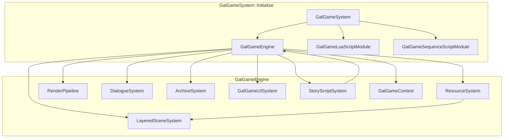

# VGGalgame 模块架构、使用说明与开发进展

本文档描述 **Galgame 展示与运行时集成层** 目标 `VGGalgame`（CMake：`SHARED`）的目录结构、**`GalGameEngine`** 子系统协作关系、**`GalGameSystem`** 引导步骤，以及本模块内 **具体类** 的 **API 说明**（在 **`VGGalgameCore`** 已定义的 **`I*`** 接口之上）。

导出宏见 `VGGalgameConfig.h`（`VG_GALGAME_API`）；编译定义 `VG_GALGAME_EXPORT`。

---

## 1. 模块定位与依赖

| 项目 | 说明 |
|------|------|
| **职责** | 实现 **`IGalGameEngine`** 的具体类 **`GalGameEngine`**；装配 **存档 `ArchiveSystem`**、**对话 `DialogueSystem`**、**分层场景 `LayeredSceneSystem`**、**渲染 `RenderPipeline`**、**资源 `ResourceSystem`**、**UI `GalGameUISystem`**、**剧情 `StoryScriptSystem`**（实现位于本模块 **`Include/ScriptSystem/`**）；实现 **`Game.h`** 中的 **`GalSprite` / `GalAudio` / `GalVideo` / `GalCharacter`**；提供 **`GalGameSystem::Initialize`** 完成子引擎注册、Actor 工厂、场景序列化段、Lua API 与 **Lua / Sequence** 模块挂载。 |
| **CMake 链接** | `PUBLIC VGGalgameNodeGraph`、`PUBLIC VGGalgameCore`、`PUBLIC VGGalgameScriptLua`、`PUBLIC VGGalgameScriptSequence`（并间接依赖 **`VGEngine`** 等）。 |
| **典型消费方** | 桌面宿主、编辑器 Play Mode、测试工程；通过 **`CoreGameEngine::AddSubGameEngine`** 挂载。 |
| **不负责** | `IStoryScriptSystem` 的接口定义（在 Core）、**`GalGameScriptExecutorFactory`**（在 Core **`IStoryScript.h`**）、节点图执行函数（在 **`VGGalgameNodeGraph`**）、Sequence/Lua 执行器具体实现。 |

---

## 2. 源码目录结构（与仓库实际文件一致）

| 路径 | 职责 |
|------|------|
| `VGGalgameConfig.h` | **`VG_GALGAME_API`**。 |
| `Interface/GalgameSystem.h` / `Source/Interface/GalgameSystem.cpp` | **`GalGameSystem::Initialize`**：创建 **`GalGameEngine`**、注册 **`GalGameEngineGameActorBuilder`**、**`GalGameEngineComponentSerializer`**、**`GalGameLuaBinding`**、**`GalGameLuaScriptModule::MountEngineRuntime`**、**`GalGameSequenceScriptModule::MountEngineRuntime`**（实现在 **`Source/Interface/GalGameSequenceScriptModuleMount.cpp`**）。 |
| `Include/GalGameEngine.h` / `Source/GalGameEngine.cpp` | **`GalGameEngine`**：子系统生命周期、**`Initialize`**、**`OnUpdate`**、渲染回调里驱动 **`RenderPipeline`**；**`GalSubsystemBus`** 聚合 **`ISubsystemBus`**。 |
| `Include/GalSubsystemBus.h` / `Source/GalSubsystemBus.cpp` | **`GalSubsystemBus`** 与各 **`Gal*SubsystemAdapter`**：将宿主能力挂到 **`ISceneSubsystem`** 等接口。 |
| `Include/Game.h` / `Source/Game.cpp` | **`GalSprite`**、**`GalAudio`**、**`GalVideo`**、**`GalCharacter`** 实现。 |
| `Include/ArchiveSystem.h` / `Source/ArchiveSystem.cpp` | 槽位存档 JSON 目录扫描与读写。 |
| `Include/DialogueSystem/DialogueSystem.h`、**`TypingEffect.h`** / `Source/DialogueSystem/*.cpp` | **`DialogueSystem`** + 打字机效果。 |
| `Include/ResourceSystem.h` / `Source/ResourceSystem.cpp` | 场景 Actor 创建与 **`LayeredSceneSystem`** 挂载。 |
| `Include/SceneSystem/*` / `Source/SceneSystem/*` | **`LayeredSceneSystem`**、**`SceneSpriteManager`**、**`SceneAudioManager`**、**`SceneVideoManager`**。 |
| `Include/UISystem/GalUISystem.h` / `Source/UISystem/GalUISystem.cpp` | **`GalGameUISystem`**。 |
| `Include/ScriptSystem/StoryScriptSystem.h` / `Source/ScriptSystem/StoryScriptSystem.cpp` | **`StoryScriptSystem`**：实现 **`IStoryScriptSystem`**；加载脚本、存档回放、UI 选择/输入桥接。 |
| `Include/ScriptSystem/StoryExecutionInstance.h` / `Source/ScriptSystem/StoryExecutionInstance.cpp` | **`StoryExecutionInstance`**：**`IStoryExecutionInstance`** 包装 **`IStoryScriptExecutor`**。 |
| `Include/RenderPipeline.h` / `Source/RenderPipeline.cpp` | Gal 分层渲染与截屏相关 RT。 |
| `Include/SpriteAnimationScriptManager.h` / `Source/SpriteAnimationScriptManager.cpp` | **`SpriteTransformScriptManager`**：精灵变换命令工厂。 |
| `Include/SpriteAnimationScript.h` / `Source/SpriteAnimationScript.cpp` | **`ScrollTransformScript`** 等动画脚本片段。 |
| `CMakeLists.txt` | `GLOB` 收集源；定义 **`VG_GALGAME_EXPORT`**。 |
| `Docs/MODULE_ARCHITECTURE_AND_PROGRESS.md` | 本文件。 |

---

## 3. 总体架构



**一帧更新顺序**（`GalGameEngine::OnUpdate`）：**`LayeredSceneSystem::OnUpdate`** → **`DialogueSystem::Update`** → **`StoryScriptSystem::Update`**。

**渲染**：引擎 **`IGameEngineContext`** 的 **BeforeRender** 回调中调用 **`RenderPipeline::Render`**（见 **`GalGameEngine::Initialize`** 订阅）。

**主场景切换**（`EngineEventType::MainSceneChanged`）：清空分层场景、切换 **`Scene*`**、**`DialogueSystem::Clear`**；若处于播放模式则 **`LoadSceneStoryScriptOnUpdate`** 延迟加载脚本，避免资源残留竞态（见 **`GalGameEngine.cpp`** 注释）。

---

## 4. 详细使用说明

### 4.1 引擎启动时挂载（推荐）

在 **`CoreGameEngine`** 已完成基础上下文（含 UI **`Rml::Context`**）可用后调用一次：

```cpp
VisionGal::GalGameSystem::Initialize(coreGameEngine);
```

效果摘要（`GalgameSystem.cpp`）：

1. `MakeRef<GalGame::GalGameEngine>()` → **`galgameEngine->Initialize(engine.GetContext())`** → **`engine.AddSubGameEngine(galgameEngine)`**。
2. 注册 **`GalGameEngine`** 类型 Actor 构建器（标签「GalGame Engine」并添加 **`GalGameEngineComponent`**）。
3. **`SceneSerializerRegistry::RegisterSegmentSerializer`** 注册 **`GalGameEngineComponentSerializer`**。
4. **`CoreLua::RegisterGlobalAPI`** 内 **`GalGameLuaBinding::Register`**。
5. **`GalGameLuaScriptModule::MountEngineRuntime`** + **`GalGameSequenceScriptModule::MountEngineRuntime`**。

### 4.2 取得 `IGalGameEngine*`

- 由 **`CoreGameEngine`** 子引擎列表查询 **`GalGameEngine`** 实例后向上转型；或
- 在 Lua / 工具代码中通过 **`VisionGal::GalGame::GalGameEngineAccess::Current()`**（由 **`GalGameEngine::Initialize`** 调用 **`GalGameEngineAccess::SetCurrent`** 注入）。

### 4.3 典型游戏循环配合

1. 确保宿主每帧调用 **`IGalGameEngine::OnUpdate(deltaTime)`**（子引擎接口继承自 **`ISubGameEngine`**）。
2. 渲染管线由引擎上下文 **BeforeRender** 自动触发 **`RenderPipeline`**；无需在空实现的 **`OnRender`** 中重复调用。
3. 剧情推进：脚本系统内部 **`Tick`** 执行器；玩家确认对白继续时调用 **`IDialogueSystem::ContinueDialogue`** 与（若使用 Sequence 执行器）**`IStoryScriptSystem`** / **`IStoryExecutionInstance::Continue`**（详见本模块 **`Include/ScriptSystem/`** 与 **`VGGalgameScriptSequence`** 文档）。

### 4.4 场景侧配置

在场景 Actor 上挂载 **`GalGameEngineComponent`**，填写 **`scriptPath`** 与各类 UI 资产路径；进入场景且 **`IsPlayMode()`** 为真时，由 **`GalGameEngine::OnMainSceneChanged`** 触发 **`StoryScriptSystem::LoadSceneStoryScriptOnUpdate`**。

### 4.5 转场与快进

**`GalGameEngine::TransitionCommand*`**：若 **`DialogueSystem::IsFastForward()`** 为真则直接返回成功并不启动转场；否则委托 **`TransitionManager`**（`VGEngine`）。

---

## 5. 本模块公开类型 API 参考

### 5.1 `GalGameSystem`（`Interface/GalgameSystem.h`）

| API | 说明 |
|-----|------|
| `static void Initialize(CoreGameEngine& engine)` | **一次性**引导：子引擎、工厂、序列化、Lua、脚本模块挂载。 |

### 5.2 `GalGameEngine`（`Include/GalGameEngine.h`）

在 **`IGalGameEngine`** 之外扩展：

| API | 说明 |
|-----|------|
| `void Initialize(IGameEngineContext* context)` | 设置 **`GalGameEngineAccess::SetCurrent`**、**`CreateSubsystem`**、订阅视口尺寸与 **BeforeRender**。 |
| `void OnRender() override` | 当前为空；实际渲染在 **`OneRenderSceneCallback`**。 |
| `void OnUpdate(float deltaTime) override` | 见 §3 更新顺序。 |

**`CreateSubsystem` 私有流程**：分配 **`GalGameContext`** 且 **`Engine = this`** → 对话系统 **`InitialiseDataModel` + `Initialize`** → **`LayeredSceneSystem::Initialize`** → **`RenderPipeline::Initialize`** → **`ArchiveSystem::Initialise`** → **`StoryScriptSystem::SetEngine` + `Initialise`** → **`ResourceSystem::Initialize`** → **`GalGameUISystem::Initialize`**。

### 5.3 `ArchiveSystem`（`Include/ArchiveSystem.h`）

| API | 说明 |
|-----|------|
| `bool Initialise(const Ref<GalGameContext>& ctx)` | 绑定上下文，扫描存档目录。 |
| `SaveArchive SaveArchiveByNumber(const String& number) override` | 构造当前状态存档（含 **`archiveData`** 序列化路径逻辑，见实现）。 |
| `SaveArchive GetArchiveByNumber` / `bool HasArchiveByNumber` | 读槽位。 |
| `std::string GetCurrentDateFormat()` / `GetCurrentTimeFormat()` | UI 用时间戳字符串。 |

### 5.4 `DialogueSystem`（`Include/DialogueSystem/DialogueSystem.h`）

| API | 说明 |
|-----|------|
| `void Initialize(const Ref<GalGameContext>& ctx)` | 绑定上下文与运行时状态。 |
| `bool InitialiseDataModel(Rml::Context* context)` | 绑定 Rml 数据模型（返回值表示是否成功，见实现）。 |
| 其余方法 | 与 **`IDialogueSystem`** 一一对应；内部 **`TypingEffect`** 驱动 **`m_DialogName` / `m_DialogText`** 显示串。 |
| `void Update() override` | 每帧：**`TypingEffect::Update`**、快进、自动继续逻辑（**`ProcessFastForward`** / **`ProcessAutoDialogue`**）。 |

### 5.5 `ResourceSystem`（`Include/ResourceSystem.h`）

| API | 说明 |
|-----|------|
| `void Initialize(const Ref<GalGameContext>& galCtx, const Ref<LayeredSceneSystem>& sceneSystem)` | 保存 **`Scene*`**（来自上下文主场景）、绑定分层管理器。 |
| `bool PreLoadResource(const String& path)` | 预加载。 |
| `GalSprite* ShowSprite` / `ShowColor` | 创建精灵包装并加入场景图。 |
| `GalAudio* PlayAudio` / `GalVideo* PlayVideo` | 创建音/视频 Actor。 |
| `bool RemoveSprite(GalSprite*)` / `RemoveAudio(GalAudio*)` | 从分层管理器移除。 |

### 5.6 `LayeredSceneSystem`（`Include/SceneSystem/LayeredSceneSystem.h`）

| API | 说明 |
|-----|------|
| `void Initialize(const Ref<GalGameContext>& ctx)` | 将上下文传给子 **`Scene*Manager`**。 |
| `AddCharacter` / `ClearAll` / `ClearAllCharacter` | 角色列表与场景资源清理。 |
| `TraverseScene` / `TraverseCharacter` | 遍历回调。 |
| `OnUpdate` override | 转发子管理器更新（若实现内有 Tick）。 |
| `GetSpriteManager` / `GetAudioManager` / `GetVideoManager` | 返回内部 **`SceneSpriteManager`** 等实例地址（生命周期同 **`LayeredSceneSystem`**）。 |

### 5.7 `GalGameUISystem`（`Include/UISystem/GalUISystem.h`）

| API | 说明 |
|-----|------|
| `void Initialize(const Ref<GalGameContext>& galCtx, IGameEngineContext* context)` | 缓存 **`IScene*`** 与上下文。 |
| `ShowChoiceUI` / `GetChoiceOptionByIndex` / `GetChoiceOptionSize` / `SelectCurrentChoice` | 选择支状态机 + 通过 **`GalGameContext::uiEventBus`** 派发 **`GalGameUIEvent`**（见 **`GalGameEvent.h`**）。 |
| `ShowFullScreenTextUI` / `GetFullScreenTextItem` / `GetFullScreenTextSize` | 全屏文本队列。 |
| `ShowInputUI` / `InputSubmitted` / `GetInputTitle` / `GetInputButtonText` | 输入框流程。 |

### 5.8 `RenderPipeline`（`Include/RenderPipeline.h`）

| API | 说明 |
|-----|------|
| `void Initialize(IGameEngineContext* context)` | 创建 RT、全屏渲染组件等。 |
| `void Render(ILayeredSceneManager* scene, IOrthoCamera* camera, OpenGL::RenderTarget2D* rt)` | 主入口：背景层、场景层、角层混合（**`RenderBackgroundLayer`** / **`RenderSceneLayer`** / **`RenderMixCharacterSprite`**）。 |
| `void OnScreenSizeChanged(int width, int height)` | 视口变化时重建 RT。 |
| `void CaptureBackgroundLayer()` / `CaptureSceneLayer()` | 抓取上一帧纹理供转场使用。 |
| `void SetScene(Scene* scene)` | 主场景指针。 |

### 5.9 `SpriteTransformScriptManager`（`Include/SpriteAnimationScriptManager.h`）

| API | 说明 |
|-----|------|
| `static SpriteTransformScriptManager* GetInstance()` | 单例访问（若实现为单例）。 |
| `static Ref<IAnimationScript> CreateSpriteTransformWithCommand(IGalGameEngine*, IGameActor*, const String& cmd)` | 解析命令字符串创建 **`IAnimationScript`**。 |
| `static bool StartSpriteTransformWithCommand(...)` | 便捷启动。 |

### 5.10 `ScrollTransformScript`（`Include/SpriteAnimationScript.h`）

| API | 说明 |
|-----|------|
| `enum class Direction { Left, Right, Up, Down }` | 滚动方向。 |
| `void SetDuration(float)` / `SetEasing(EasingFunction)` | 动画参数。 |
| `void Start() override` | **`IAnimationScript`** 生命周期。 |
| `void OnUpdate(Horizon::HEntityInterface* entity) override` | 每帧更新 **`TransformAnimationScript`**。 |

### 5.11 `GalSprite` / `GalAudio` / `GalVideo` / `GalCharacter`（`Include/Game.h`）

均实现 **`VGGalgameCore`** 对应 **`I*`** 接口；额外暴露 **`m_Engine`**、路径、图层、底层 **`IGameActor*`** 与（精灵）**`GalGameRuntimeState*`** 指针，供实现体内访问引擎与全局 UI 状态。

**`GalCharacter::FigureState`**：记录隐藏标志、状态名、当前立绘 **`IGalSprite*`**、当前语音 **`IGalAudio*`**；支持 **`AddFigure`** 状态表、**`ShowFigure`/`HideFigure`** 与 Lua 回调列表。

---

## 6. 开发进展（与当前代码对齐）

### 6.1 已完成

- **`GalGameEngine`** 完整子系统装配与主场景切换流程（含 **OnUpdate** 管线）。
- **资源 / 分层场景 / 渲染管线 / 对话（Rml 数据模型 + 打字机）/ 存档槽位 / Gal UI 事件总线** 联通。
- **`GalGameSystem`** 与 **Lua**、**Sequence** 模块引导一致化。
- **`Game.h`** 资源具体类与 **`SpriteTransformScriptManager`**、**`ScrollTransformScript`**。

### 6.2 进行中 / 占位

- **`GalGameEngine::Reset`** 仍为空；主场景切换时部分对话状态清理代码保留为注释（快进/自动/回调策略待定）。
- **`GalGameEngine::OnRender`** 为空设计，依赖 **BeforeRender** 回调；若宿主未注册引擎上下文回调需自行补渲染路径。

### 6.3 已知集成注意

- **`OneRenderSceneCallback`** 使用 **`Letterbox2DCamera`** 动态转型：摄像机类型不匹配时可能无法渲染 Gal 层，需与项目默认相机对齐。
- **`GalGameUISystem`** 依赖 **`IGameEngineContext`** 提供的主场景指针；场景未就绪时 UI 接口行为以实现为准。

---

## 7. 修订记录

| 日期 | 说明 |
|------|------|
| 2026-05-13 | 删除对 **`VGGalgameRuntime`** 的依赖：**`StoryScriptSystem`** / **`StoryExecutionInstance`** 迁入本模块 **`ScriptSystem/`**；`PUBLIC` 链接 **`VGGalgameNodeGraph`**、**`VGGalgameCore`**。 |
| 2026-05-12 | 重写：纠正与 ScriptSequence 文档误粘贴问题；补齐 VGGalgame 目录、架构、`GalGameSystem` 引导与实现类 API 表。 |
