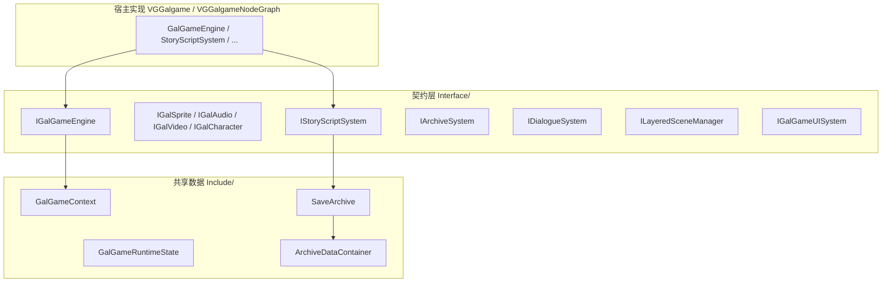

# VGGalgameCore 模块架构、使用说明与开发进展

本文档描述 **Galgame 核心契约与共享数据层** 目标 `VGGalgameCore`（CMake：`SHARED`）的目录结构、在引擎中的位置、集成方式，以及 **`Interface/`** 与 **`Include/`** 中公开类型的 **API 说明**。

导出宏见 `VGGalCoreConfig.h`（`VG_GALGAME_CORE_API`）；编译定义 `VG_GALGAME_CORE_EXPORT`。

---

## 1. 模块定位与依赖

| 项目 | 说明 |
|------|------|
| **职责** | 定义 **`IGalGameEngine`**（门面 + **`GetSubsystemBus()` / `GetContext()`**）及对话 / 场景 / UI / 存档等 **`I*`** 契约（`IGameSystem.h`）；**`ISubsystemBus`** 与各 **`I*Subsystem`**；**`GalGameEngineAccess`**（`thread_local` 当前引擎指针，Lua/编辑器迁移期入口）；**`GalGameLayoutUtils`**（设计分辨率与精灵偏移）；定义 **`IStoryScriptSystem`**、**`IStoryExecutionInstance`**；**`SaveArchive`**、**`ArchiveDataContainer`**、**`GalGameContext`** / **`IGalGameContext`**、**`GalGameRuntimeState`**、**`GalGameEvent.h`**；**`GalGameEngineComponent`** 与序列化器。 |
| **CMake 链接** | `PUBLIC VGEngine`；`PUBLIC` 暴露 `Engine/Source/Runtime/VGLua/Include`（供 `sol::` 等 Lua 绑定类型出现在接口中）。 |
| **典型消费方** | **`VGGalgame`**（含 **`StoryScriptSystem`** 等具体子系统）、**`VGGalgameNodeGraph`**、**`VGGalgameScriptSequence`**、**`VGGalgameScriptLua`**、工具与测试工程。 |
| **不负责** | 具体渲染、资源创建、Rml 数据模型、脚本执行器实现——均在其它 Runtime 模块。 |

---

## 2. 源码目录结构（与仓库实际文件一致）

CMake 使用 `GLOB` 收集 `Interface/*.h`、`Include/*.h`、`Source/**/*.cpp`（`CMakeLists.txt` 中仍列出若干未来子目录占位，当前仓库 **仅有下表路径**）。

| 路径 | 职责 |
|------|------|
| `VGGalCoreConfig.h` | DLL 导出宏 **`VG_GALGAME_CORE_API`**。 |
| `Include/VGGalgameCore_Deprecated.h` | **`VG_DEPRECATED_MSG` / `VG_DEPRECATED`**：SubsystemBus 迁移期弃用标记（MSVC / GCC-Clang）。 |
| `Interface/IGameEngine.h` | **`IGalGameEngine`**：继承 **`ISubGameEngine`**；门面 API + **`GetSubsystemBus()`** + **`GetContext()`**。 |
| `Interface/IGameObject.h` | **`SpriteDesc`**；**`IGalGameResource`** / **`IGalSprite`** / **`IGalAudio`** / **`IGalVideo`** / **`IGalCharacter`** 资源侧抽象（含 `sol::` 动画与回调）。 |
| `Interface/IGameSystem.h` | **`IArchiveSystem`**、**`IDialogueSystem`**、分层场景 **`IScene*Layer`**、**`ISceneSpriteManager`**、**`ISceneAudioManager`**、**`ISceneVideoManager`**、**`ILayeredSceneManager`**、**`IGalGameUISystem`**。 |
| `Interface/IStoryScriptSystem.h` | **`IStoryExecutionInstance`**、**`IStoryScriptSystem`**。 |
| `Include/GalGameLayoutUtils.h` / `Source/GalGameLayoutUtils.cpp` | **`GalGameLayoutUtils`**：`SetDesignSize` / `GetDesignSize` / `GetSpriteXOffset` / `GetSpriteYOffset`（原 `GameEngineCore` 布局逻辑）。 |
| `Include/GalGameEngineAccess.h` / `Source/GalGameEngineAccess.cpp` | **`GalGameEngineAccess`**：`thread_local` 当前 **`IGalGameEngine*`**，**`Current()` / `SetCurrent()`**；由 **`GalGameEngine::Initialize`** 注入，供 Lua / 编辑器无显式指针场景。 |
| `Interface/ISubsystemBus.h` 与各 **`I*Subsystem.h`** | **SubsystemBus**：**`Scene` / `UI` / `Audio` / `Script` / `Archive` / `Dialogue`** 子系统纯虚接口。 |
| `Interface/IGalGameContext.h` | **`IGalGameContext`**；**`GalGameContext`** 实现之。 |
| `Include/GalGameContext.h` | **`GalGameContext`**：`Engine`、双事件总线、**`GalGameRuntimeState`**、**`Ref<ArchiveDataContainer>`**。 |
| `Include/GalGameRuntimeState.h` | **`GalGameRuntimeState`**：脚本路径、当前对白、截图像素、打字/快进/自动模式、读档标志等。 |
| `Include/GalGameEvent.h` | **`GalEngineEventBus`**、**`GalGameUIEventBus`** 及载荷结构（`HEventDelegate`）。 |
| `Include/SaveArchive.h` / `Source/SaveArchive.cpp` | **`SaveArchive`** JSON 读写（`Base` + `Data`）。 |
| `Include/ArchiveDataContainer.h` / `Source/ArchiveDataContainer.cpp` | **`ArchiveDataContainer`**：继承 `VGDataContainer`，**`__Choices__` / `__Inputs__`** 命名空间与 Lua 绑定初始化。 |
| `Include/Components.h` / `Source/Components.cpp` | **`GalGameEngineComponent`** + **`GalGameEngineComponentSerializer`**。 |
| `Interface/IStoryScriptExecutor.h` | **`IStoryScriptExecutor`**、**`IStoryScriptExecutorCreator`**：脚本执行器与按资产加载的创建器契约。 |
| `Interface/IStoryScript.h` / `Source/IStoryScript.cpp` | **`GalGameScriptExecutorFactory`**：按类型注册/加载 **`IStoryScriptExecutor`**（Lua / Sequence 等在宿主挂载时注册）。 |
| `Source/GalGameLayoutUtils.cpp` | **`GalGameLayoutUtils`** 实现。 |
| `Source/GalGameEngineAccess.cpp` | **`GalGameEngineAccess`** 实现。 |
| `Docs/MODULE_ARCHITECTURE_AND_PROGRESS.md` | 本文件。 |

---

## 2.1 Phase 0–6 — SubsystemBus 迁移记录（摘要）

| 项目 | 说明 |
|------|------|
| **Phase 0** | 曾用 **`VGGalgameCore_Deprecated.h`** 标记上帝引擎 API；Phase 6 起 **`IGalGameEngine`** 门面与总线并存，弃用宏已从接口移除。 |
| **总线** | **`ISubsystemBus`** + **`I*Subsystem`**；宿主 **`GalSubsystemBus`**（`VGGalgame`）装配。 |
| **全局指针** | **`GalGameEngineAccess`**（`thread_local`）取代已删除的 **`GameEngineCore`**。 |
| **布局** | **`GalGameLayoutUtils`** 承接设计分辨率与精灵偏移。 |
| **脚本** | **`IStoryExecutionInstance::Tick/Continue(ISubsystemBus*)`**；**`IStoryScriptExecutor::Run(ISubsystemBus*, IGalGameContext*)`**；**`SSSequenceExecutionContext::SubsystemBus`**。 |

---

## 3. 总体架构

**分层**：引擎子系统契约（`IGameEngine` / `IGameSystem`）→ 剧情脚本抽象（`IStoryScriptSystem`）→ 共享状态与存档模型（`GalGameContext`、`SaveArchive`）→ 场景侧配置组件（`GalGameEngineComponent`）。

**`GalGameEngineAccess`**：在 **`GalGameEngine::Initialize`** 内 **`SetCurrent(this)`**，供 **Lua（`GalGameLuaBinding::GetEngine`）/ 编辑器** 通过 **`Current()`** 解析 **`IGalGameEngine*`**。布局读写见 **`GalGameLayoutUtils`** → **`ProjectSettings::GetProjectSettings().GalGame`**。

---

## 4. 详细使用说明

### 4.1 作为依赖库链接

在 CMake 中 `target_link_libraries(YourTarget PUBLIC VGGalgameCore)`（或 `PRIVATE`，按 ABI 暴露需求），并保证可找到 `VGEngine`、`VGLua` 相关头路径（已由目标 `PUBLIC` 传递）。

### 4.2 扩展或替换子系统

- 面向 **玩法 / 脚本 / 序列** 的代码应只依赖 **`IGalGameEngine*`** 与各 **`I*System*`**，避免反向依赖 `VGGalgame` 中的具体类名，以降低循环依赖与 DLL 边界成本。
- 新增子系统接口时：在 **`IGameEngine.h`** 增加纯虚访问器，并在 **`GalGameEngine`**（`VGGalgame`）中实现装配。

### 4.3 存档与变量容器

- **`SaveArchive::WriteToJson` / `ReadFromJson`**：`Base` 元数据 + **`Data`** 为 **`ArchiveDataContainer::Serialize` / `Deserialize`** 结果。
- **`ArchiveDataContainer::GetChoicesNamespace()`** → 内部命名空间 **`__Choices__`**；**`GetInputNamespace()`** → **`__Inputs__`**，供剧情选择支与输入存档分区使用。
- Lua 侧通过 **`ArchiveDataContainer::InitializeLuaBinding`** 注册的 userdata 访问（见 `ArchiveDataContainer.cpp`：`剧情选择`、`文本输入` 等属性名）。

### 4.4 场景与编辑器

- 在场景中挂载 **`GalGameEngineComponent`** 可持久化 **`scriptPath`**、**`choiceUIPath`**、**`fullScreenTextUIPath`**、**`inputUIPath`**（cereal `save`/`load`）。
- **`GalGameEngineComponentSerializer`** 向 **`SceneSerializerRegistry`** 注册后，由编辑器/运行时场景加载流程调用（注册发生在 **`GalGameSystem::Initialize`**，见 `VGGalgame` 文档）。

---

## 5. 接口与类型 API 参考

以下按头文件分组；**返回值 / 指针生命周期** 以宿主实现为准（`VGGalgame` 中多为引擎持有子系统、资源对象由场景与分层管理器跟踪）。

### 5.1 `GalGameLayoutUtils`（`Include/GalGameLayoutUtils.h`）

| API | 说明 |
|-----|------|
| `static void SetDesignSize(float2 size)` | 写入 **`ProjectSettings::GalGame`** 的设计分辨率宽/高。 |
| `static float2 GetDesignSize()` | 读出设计分辨率。 |
| `static float GetSpriteYOffset(float size_y)` | 基于设计高度与精灵高度计算纵向偏移（居中系）。 |
| `static float GetSpriteXOffset(float size_x)` | 基于设计宽度与精灵宽度计算横向偏移。 |

### 5.1b `GalGameEngineAccess`（`Include/GalGameEngineAccess.h`）

| API | 说明 |
|-----|------|
| `static IGalGameEngine* Current() noexcept` | 当前线程 **`SetCurrent`** 后的引擎指针（可能为空）。 |
| `static void SetCurrent(IGalGameEngine* engine) noexcept` | 设置当前引擎；**`GalGameEngine::Initialize`** 内调用。 |

### 5.2 `IGalGameEngine`（`Interface/IGameEngine.h`）

继承 **`ISubGameEngine`**（`VGCore/Interface/GameEngineInterface.h`）。

| API | 说明 |
|-----|------|
| `virtual bool PreLoadResource(const String& path) = 0` | 预加载资源。 |
| `virtual bool TransitionCommand(const String& layer, const String& cmd) = 0` | 图层转场命令。 |
| `virtual bool TransitionCommandWithCustomImage(const String& layer, const String& imagePath, const String& cmd) = 0` | 自定义贴图转场。 |
| `virtual IGalSprite* ShowSprite(const std::string& layer, const std::string& path) = 0` | 显示精灵。 |
| `virtual IGalSprite* ShowColor(const std::string& layer, const float4& color) = 0` | 纯色块精灵。 |
| `virtual IGalAudio* PlayAudio(const std::string& layer, const std::string& path) = 0` | 播放音频。 |
| `virtual IGalVideo* PlayVideo(const std::string& layer, const std::string& path) = 0` | 播放视频。 |
| `virtual IGalCharacter* CreateCharacter(const String& name) = 0` | 创建角色逻辑对象。 |
| `virtual bool LoadArchive(const SaveArchive& archive) = 0` | 自存档恢复（通常委托剧情系统）。 |
| `virtual bool RemoveSprite(IGalSprite* sprite) = 0` | 移除精灵。 |
| `virtual bool RemoveAudio(IGalAudio* audio) = 0` | 移除音频。 |
| `virtual void HideAllCharacterSprite() = 0` | 隐藏所有角色立绘。 |
| `virtual IArchiveSystem* GetArchiveSystem() = 0` | 存档槽位系统。 |
| `virtual IDialogueSystem* GetDialogueSystem() = 0` | 对话系统。 |
| `virtual ILayeredSceneManager* GetLayeredSceneManager() = 0` | 分层场景。 |
| `virtual IStoryScriptSystem* GetStoryScriptSystem() = 0` | 剧情脚本系统。 |
| `virtual IGalGameUISystem* GetGalGameUISystem() = 0` | Gal UI 门面。 |
| `virtual bool LoadStoryScript(const String& path) = 0` | 加载脚本。 |
| `virtual void LoadStoryScriptOnUpdate(const String& path) = 0` | 延迟到更新阶段加载（场景切换等）。 |
| `virtual void ReloadStoryScript() = 0` | 热重载当前脚本。 |
| `virtual void Reset() = 0` | 引擎重置。 |
| `virtual void Wait(float duration) = 0` | 脚本侧等待（实现委托剧情系统）。 |
| `virtual void CaptureSceneImage() = 0` | 捕获当前画面到运行时状态（像素读回）。 |
| `virtual ArchiveDataContainer* GetArchiveDataContainer() const = 0` | 全局存档数据容器（非拥有指针，与 `GalGameContext::archiveData` 一致）。 |
| `virtual ISubsystemBus* GetSubsystemBus() = 0` | 子系统总线：Scene / UI / Audio / Script / Archive / Dialogue。 |
| `virtual IGalGameContext* GetContext() = 0` | Gal 运行时上下文。 |

### 5.3 `IGalGameResource` / 资源接口（`Interface/IGameObject.h`）

**`SpriteDesc`**：路径、图层、透明度、偏移、旋转、缩放、`visible`。

**`IGalGameResource`**：`GetResourcePath`、`GetResourceActor`、`GetResourceLayer`、`SetResourceLayer`。

**`IGalSprite`**：`Show`、`With(transform)`、`Animate(sol::table, duration, tween, ...)`、`SetPosX/Y`、`GetPosX/Y`、`SetPosOffsetX/Y`、`SetScale*`、`GetScale*`、`AlignBottom*`、`GetTransformComponent`、`Cut`。

**`IGalAudio`**：`SetLoop`、`Stop`、`IsPlayingAudio`、`IsLooping`、`SetVolume`/`GetVolume`、`With`。

**`IGalVideo`**：`SetLoop`、`Stop`、`IsPlaying`、`IsLooping`、`SetVolume`/`GetVolume`。

**`IGalCharacter`**：`GetName`/`SetName`、`Say`、`Voice`/`GetCurrentVoice`、`AddFigure`、`ShowFigure`/`HideFigure`/`GetCurrentFigure`、立绘显隐 **Lua 回调** 注册与清理。

### 5.4 `IGameSystem.h` 子系统接口摘要

- **`IArchiveSystem`**：`SaveArchiveByNumber` / `GetArchiveByNumber` / `HasArchiveByNumber`。
- **`IDialogueSystem`**：角色发言、打字机开关与查询、`ContinueDialogue`、对白列表访问、自动/快进、`IsVoicing`、打字 **Lua 回调**、`JumpToDialog`、`Reset`/`Clear`/`Update`/`ClearDialogList`。
- **`ISceneSpriteLayer` / `ISceneAudioLayer` / `ISceneVideoLayer`**：层内增删、音量、`Clear`、`StopPlay`、`IsPlayFinished`（音视频层）。
- **`ISceneSpriteManager`**：按层/全局遍历、`ClearSpriteLayer`/`ClearAllSprite`、`AddSprite`/`RemoveSprite`、`MoveSpriteToLayer`、`AddSpriteLayer`、`GetSpriteLayer`。
- **`ISceneAudioManager`** / **`ISceneVideoManager`**：对称的音频/视频遍历与层管理（视频管理器头文件中回调参数名为 `audio` 系历史命名，语义为 **`IGalVideo*`**）。
- **`ILayeredSceneManager`**：角色列表、`ClearAll`/`ClearAllCharacter`、`TraverseScene`/`TraverseCharacter`、`OnUpdate`；**`GetAudioLayer`/`GetSpriteLayer`** 与 **`GetSpriteManager`/`GetAudioManager`/`GetVideoManager`**。
- **`IGalGameUISystem`**：选择 UI、全屏文字 UI、输入 UI 的展示与查询；**`InputSubmitted`** 由 UI 层回传文本。

### 5.5 `IStoryScriptSystem` / `IStoryExecutionInstance`（`Interface/IStoryScriptSystem.h`）

**`IStoryExecutionInstance`**：

| API | 说明 |
|-----|------|
| `virtual void Tick(float deltaTime, ISubsystemBus* bus) = 0` | 每帧推进执行器；**`bus`** 为子系统总线（宿主注入）。 |
| `virtual void Continue(ISubsystemBus* bus) = 0` | 继续（对白闸门 / Wait 等）。 |
| `virtual IRuntimeInterface* QueryInterface(InterfaceID id) = 0` | 运行期反射。 |
| `template<typename T> T* ExecutionQuery()` | 对 **`QueryInterface(typeid(T))`** 的封装。 |

**`IStoryScriptSystem`**：

| API | 说明 |
|-----|------|
| `GetExecutionInstance(unsigned id = 0)` | 当前执行实例（宿主可返回 nullptr）。 |
| `ReloadStoryScript` / `LoadStoryScript` / `LoadStoryScriptOnUpdate` | 脚本加载与热重载。 |
| `GetCurrentStoryScriptPath` / `GetScriptLastWriteTime` | 调试与热重载检测。 |
| `DoChoice` / `DoInput` | 选择支与输入请求进入脚本层。 |
| `LoadSceneStoryScript` / `LoadSceneStoryScriptOnUpdate` | 从 **`IScene*`** 读取 **`GalGameEngineComponent`** 并加载脚本。 |
| `Wait(float)` | 剧情等待（与 `IGalGameEngine::Wait` 对齐）。 |
| `LoadArchive(const SaveArchive&)` | 自存档恢复脚本与变量（具体语义见 `StoryScriptSystem` 实现）。 |

### 5.6 `GalGameContext` / `GalGameRuntimeState`

- **`GalGameContext`**：推荐 **`GalGameContext::Create(engine, bus)`** 作为唯一入口；默认构造仍创建 **`archiveData`**；实现 **`IGalGameContext`**；持有 **`IGalGameEngine* Engine`（弱引用）**、双事件总线、**`GalGameRuntimeState runtimeState`**、**`Ref<ArchiveDataContainer> archiveData`**。
- **`GalGameRuntimeState`**：Phase 7 嵌套 **`dialogue` / `textDisplay` / `playback`** 与顶层 **`currentScriptPath`**、**`screenshotPixels`**。

### 5.7 `GalGameEvent.h`

- **`GalGameScriptEventType`**：`OnScriptStartLoad` / `OnScriptFinishedLoad`；载荷 **`GalGameScriptEvent`**。
- **`GalGameScriptExecuteEventType`**：`ContinueExecute`；载荷 **`GalGameScriptExecuteEvent`**。
- **`GalEngineEventBus`**：`OnStoryScriptEvent`、`OnStoryScriptExecuteEvent`。
- **`GalGameUIEvent`**：`ShowChoiceUI` / `ChoiceSelected` / `ShowInputUI` / `InputSubmitted` 及关联字段。
- **`GalGameUIEventBus`**：`OnUIEvent`。

### 5.8 `SaveArchive`

| 成员 / 方法 | 说明 |
|-------------|------|
| `isGalGameArchive` / `isValid` / `version` | 存档鉴别与版本字符串。 |
| `scriptPath` / `line` | 恢复点脚本与行号（与脚本系统约定）。 |
| `saveNumberString`、`date`、`time`、`dateTime`、`description`、`screenshotPath` | UI 展示与文件侧路径。 |
| `screenshotPixels` / `archiveData` | 像素快照与 **`ArchiveDataContainer`** 树。 |
| `void WriteToJson(nlohmann::json&)` / `void ReadFromJson(...)` | JSON 序列化；含 **`saveArchiveSchemaVersion`**、**`schemaHash`**、**`contextSnapshot` / `runtimeState`** 占位分区；**`Data`** 内嵌 **`archiveSchemaVersion`** / **`archiveSchemaHash`**。 |
| `static bool ValidateArchiveSchema(const nlohmann::json&)` | Phase 7：反序列化前校验；失败则 **`isValid=false`**。 |

### 5.9 `ArchiveDataContainer`

| API | 说明 |
|-----|------|
| `schemaVersion` / `schemaHash` | Phase 7：与 **`SaveArchive::ValidateArchiveSchema`** 及磁盘 **`Data.archiveSchema*`** 字段对齐的元数据。 |
| `VGDataNamespace* GetChoicesNamespace()` | **`__Choices__`**。 |
| `VGDataNamespace* GetInputNamespace()` | **`__Inputs__`**。 |
| `static void InitializeLuaBinding(sol::table& L)` | 注册 **`VGDataNamespace`**、**`ArchiveDataContainer`** userdata 与中文方法名绑定。 |

### 5.10 `GalGameEngineComponent` / `GalGameEngineComponentSerializer`

| 成员 / API | 说明 |
|------------|------|
| `std::string GetComponentType() const override` | 组件类型字符串（`Components.cpp` 实现）。 |
| `scriptPath` / `choiceUIPath` / `fullScreenTextUIPath` / `inputUIPath` | 场景持久化字段；cereal **`save`/`load`** 模板成员。 |
| **`GalGameEngineComponentSerializer`** | **`IEntityComponentSerializer<GalGameEngineComponent>`**；`NewRef`、`AddActorSerializeComponent`。 |

---

## 6. 开发进展（与当前代码对齐）

### 6.1 已完成

- **`ISubsystemBus` + 各 `I*Subsystem`**、**`GalGameEngineAccess`**、**`GalGameLayoutUtils`**、**`IGalGameContext`**；**`IStoryExecutionInstance::Tick/Continue` 接收 `ISubsystemBus*`**；**`IStoryScriptExecutor::Run(ISubsystemBus*, IGalGameContext*)`**；已移除 **`GameEngineCore`**。
- **`IGalGameEngine`** 门面与 **`GetSubsystemBus` / `GetContext`**；**`SaveArchive` JSON**、**`ArchiveDataContainer`** 与 **Lua 绑定**。
- **`IStoryScriptSystem`** 与 **`IStoryExecutionInstance`** 抽象，与 **`VGGalgame::StoryScriptSystem`**、**`VGGalgameScriptSequence`** 等协作。
- **`GalGameEngineComponent`** 场景序列化与 **`GalGameSystem`**（在 `VGGalgame`）注册。

### 6.2 进行中 / 占位

- **`IGalGameEngine::Reset`** 在 `GalGameEngine` 中将 **`GalGameContext::Engine`** 置 **`nullptr`**（弱引用断开）；其余子系统释放策略仍由宿主演进。
- **`GalGameEngineComponent`** 内历史 **`Ref<LuaStoryScript>`** 等字段已注释，脚本完全由运行时 **`StoryScriptSystem`** 管理路径。

### 6.3 与其它模块的边界

- **剧情执行内核**（Sequence 剪辑表、`SequenceExecutionInstance` 等）属于 **`VGGalgameScriptSequence`**，见该模块文档；**`VGGalgameCore`** 仅保留 **`IStoryExecutionInstance`** 最小虚接口与 **`IStoryScriptSystem`** 门面。
- **`StoryScriptSystem`** 具体类在 **`VGGalgame`**（`Include/ScriptSystem/`），不在本库。

---

## 7. Phase 7 — SubsystemBus 与边界锁定（2026-05-12）

### 7.1 架构与 ABI

- **ABI 冻结标记**：`IGameEngine.h`、`IGameSystem.h`、`IStoryScriptSystem.h`、`ISubsystemBus.h` 文件头 `CORE ABI STABLE`。
- **`IStoryScriptExecutor`**：契约位于 [`Interface/IStoryScriptExecutor.h`](../Interface/IStoryScriptExecutor.h)；全局注册工厂 **`GalGameScriptExecutorFactory`** 位于 [`Interface/IStoryScript.h`](../Interface/IStoryScript.h) + [`Source/IStoryScript.cpp`](../Source/IStoryScript.cpp)。
- **总线语义**：`ISubsystemBus` 注明 **不拥有子系统生命周期**；可选 **`Snapshot`/`Restore`** 默认空实现；窄快照类型 **`SubsystemBusSnapshot`**。
- **执行与存档**：`SubsystemBusGuard`、`GalGameContext::Create`、`GalGameRuntimeState` 嵌套分组、`GalExecutionLifecycle`、`IStoryExecutionAdapter`、`GalGameContextSnapshot`。
- **依赖规则**：仓库 [`.cursor/rules/vggalgame-core-includes.mdc`](../../../../.cursor/rules/vggalgame-core-includes.mdc)；脚本 [`Engine/Scripts/check_vggalgame_core_includes.ps1`](../../../../Scripts/check_vggalgame_core_includes.ps1)。

### 7.2 已知限制

- **`VGGalgameCore` CMake** 仍 `PUBLIC` 链接 **`VGEngine`**；与「Core 仅 std+sol」终极目标差距在后续拆分静态「契约」库时消除。

---

## 8. 修订记录

| 日期 | 说明 |
|------|------|
| 2026-05-13 | 删除 **`VGGalgameRuntime`**：`GalGameScriptExecutorFactory` 迁入 Core（**`IStoryScript.h`** / **`IStoryScript.cpp`**）；节点图执行迁入 **`VGGalgameNodeGraph`**；**`StoryScriptSystem`** 迁入 **`VGGalgame`**。 |
| 2026-05-12 | Phase 7：`IStoryScriptExecutor` 入 Core；`SaveArchive` schema + `ValidateArchiveSchema`；Lua 子系统门面；`GalGameContext::Create`；`GalGameRuntimeState` 嵌套；Sequence 解链旧 Runtime 链接；`GalGameSequenceScriptModuleMount` 迁至 `VGGalgame`。 |
| 2026-05-12 | SubsystemBus 重构落地：`ISubsystemBus`、`GalSubsystemBus`（`VGGalgame`）、`GalGameEngineAccess`（`thread_local`）、`GalGameLayoutUtils`；删除 `GameEngineCore`；`IStoryExecutionInstance` / `IStoryScriptExecutor` / Sequence 上下文改走总线。 |
