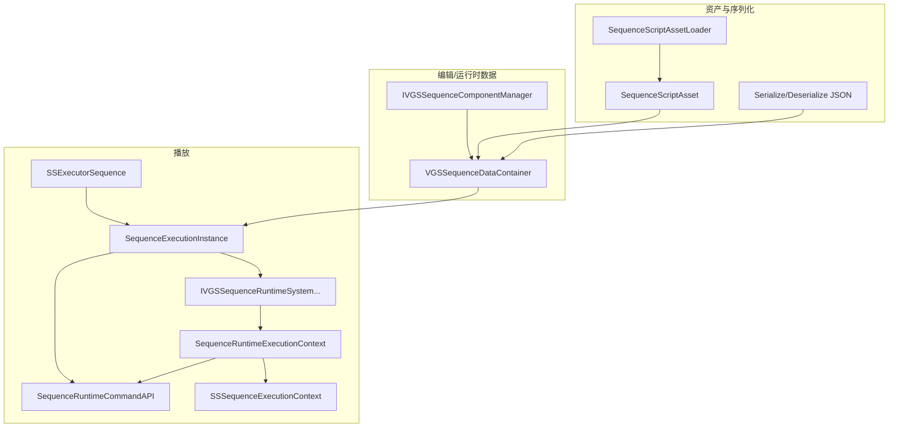

# VGGalgameScriptSequence 模块架构、使用说明与开发进展

本文档描述 **Galgame 可视化序列脚本（`.vgasset` 等）运行时库** 目标 `VGGalgameScriptSequence`（CMake：`SHARED`，**不依赖 Editor**）的目录结构、调度架构、资源与序列化约定，以及集成到引擎 / 自定义宿主时的**详细使用步骤**。

导出宏见 `GSSExport.h`（`VG_GSS_API`）；编译定义 `VG_GALGAME_SCRIPT_SEQUENCE_EXPORT`。

---

## 1. 模块定位与依赖

- **职责**：线性 **Sequence 剪辑表**（`IVGSSequenceComponent` 条目）的加载、JSON 序列化、**数据驱动** 的 **`SequenceExecutionInstance`（Sequence Runtime Kernel）** 调度，以及对话 / 立绘 / 背景等内置 **`IVGSSequenceRuntimeSystem`** 实现；通过 **`ISubsystemBus`**（写入 **`SSSequenceExecutionContext::SubsystemBus`**）与 **`SSExecutorResourceManager`** 与 Galgame 展示层交互。
- **CMake 链接**：`PUBLIC VGGalgameCore`（**不**再 `PUBLIC` 链接已删除的 **`VGGalgameRuntime`**；**`GalGameScriptExecutorFactory`** 在 **`VGGalgameCore`**；注册仍由 **`VGGalgame`** 挂载代码调用 **`GalGameScriptExecutorFactory::RegisterAssetExecutor`**）。
- **典型消费方**：`VGGalgame`、`VGEditorGalgameSequence`（编辑器侧私有链接以访问运行时类型与序列化）、`VGDesktopApplication` 等（以工程 CMake 为准）。

---

## 2. 源码目录结构

CMake 使用 `GLOB` 收集根目录、`Include/**`、`Interface/**`、`Source/**` 下头/源。逻辑分组如下。

| 路径 | 职责 |
|------|------|
| `GSSExport.h` | DLL 导出宏 `VG_GSS_API`。 |
| `Module.h` | **`GalGameSequenceScriptModule::MountEngineRuntime()`** 声明；**实现**迁至 **`VGGalgame/Source/Interface/GalGameSequenceScriptModuleMount.cpp`**（通过 **`#include "VGGalgameCore/Interface/IStoryScript.h"`** 访问 **`GalGameScriptExecutorFactory`**；Sequence 目标仅需链接 **`VGGalgameCore`**）。 |
| `Interface/IVGSSequenceComponent.h` / `Source/Interface/IVGSSequenceComponent.cpp` | **`IVGSSequenceComponent`**（含 **`GetComponentTypeID()`**）、**`TVGSSequenceComponent<T>`**、**`IVGSSequenceComponentManager`**（单例注册表 + **`CreateSequenceEntryByTypeNameID`** / **`EnumerateRegisteredTypeNameIDs`**）。 |
| `Interface/IVGSSequenceRuntimeSystem.h` | **`IVGSSequenceRuntimeSystem`**：**`SupportsType`** / `CanExecute` / **`Execute(SequenceRuntimeExecutionContext&)`** / **`Tick(SequenceRuntimeExecutionContext&)`** / **`ShouldHoldPlaybackAfterExecute`**（Wait 闸门语义）。 |
| `Interface/VGSTypeDefine.h` | **`VGSS_INVALID_OBJECT_ID`** 及强类型 ObjectID 别名。 |
| `Interface/VGSSObjectIDGenerator.h` / `Source/Interface/VGSSObjectIDGenerator.cpp` | 运行时对象 ID 生成器实现。 |
| `Include/Runtime/SequenceComponentTypeId.h` / `Source/Runtime/SequenceComponentTypeId.cpp` | **`SequenceComponentTypeID`** 与 **`MakeSequenceComponentTypeIDFromTypeName`**（FNV-1a 64，与 JSON `type` 字符串对应）。 |
| `Include/Runtime/SequenceExecutionCursor.h` | **`SequenceExecutionCursor`**：剪辑表游标。 |
| `Include/Runtime/SequenceExecutionFrame.h` | **`SequenceExecutionFrame`**：游标、`HasDispatched`、**`ActiveWaitTokenIds`**、可选 **`SequenceParallelGroup`**。 |
| `Include/Runtime/SequenceRuntimeExecutionContext.h` | **`SequenceRuntimeExecutionContext`**：`SharedContext` + 活动帧 + **`IStorySequenceExecutionInstance*`** + **`SequenceRuntimeCommandAPI*`** + **`SequenceVariableTable*`** + **`SequenceSignalBus*`** + `DeltaTime`。 |
| `Include/Runtime/SequenceRuntimeCommandAPI.h` / `Source/Runtime/SequenceRuntimeCommandAPI.cpp` | **`SequenceRuntimeCommandAPI`**：`Continue` / **`ContinueWithResume`** / `JumpToSequenceIndex` / `PushFrame`/`PopFrame`（占位）/ **`EmitSignal(name, payload)`** / **`SetVariable`** / **`BeginParallelClipGroup`**。 |
| `Include/Runtime/IStoryExecutionInstance.h` | **`IStorySequenceExecutionInstance`**：内核执行实例虚接口（`GalGame::` 命名空间）。 |
| `Include/Runtime/SequenceExecutionInstance.h` / `Source/Runtime/SequenceExecutionInstance.cpp` | **`SequenceExecutionInstance`**：Runtime Kernel；**`m_GlobalTickCounter`**、**`AsyncWaitRegistry`**、**`SequenceSignalBus`**、**`SequenceVariableTable`**、**`m_UserStateBlob`**、帧轨迹；线性 / 并行 `Tick`。 |
| `Include/Runtime/SequenceValue.h` / `Source/Runtime/SequenceValue.cpp` | **`SequenceValue` / `SequenceValueType`**：Int / Float / Bool / String + JSON 互转。 |
| `Include/Runtime/SequenceVariableTable.h` / `Source/Runtime/SequenceVariableTable.cpp` | **`SequenceVariableTable`**：运行时变量表。 |
| `Include/Runtime/WaitToken.h` / `Include/Runtime/ResumeToken.h` | **`WaitToken`**、**`ResumeToken`**：异步闸门句柄。 |
| `Include/Runtime/AsyncWaitRegistry.h` / `Source/Runtime/AsyncWaitRegistry.cpp` | **`AsyncWaitRegistry`**：WaitToken 分配与 Resolve。 |
| `Include/Runtime/SequenceSignalBus.h` / `Source/Runtime/SequenceSignalBus.cpp` | **`SequenceSignalBus`** / **`SequenceSignal`**：单线程信号队列 + 订阅。 |
| `Include/Runtime/SequenceBlockingPolicy.h` | **`SequenceBlockingPolicy`**：并行汇合策略。 |
| `Include/Runtime/SequenceParallelGroup.h` | **`SequenceParallelGroup`**：并行槽位与派发 / 等待状态。 |
| `Include/Runtime/SequenceRuntimeSnapshot.h` / `Source/Runtime/SequenceRuntimeSnapshot.cpp` | **`SequenceRuntimeSnapshot`**：内存态快照聚合（扩展点）。 |
| `Include/Runtime/SequenceStateSerializer.h` / `Source/Runtime/SequenceStateSerializer.cpp` | **`SequenceStateSerializer`**：`Save`/`Load` 内核 JSON（`schemaVersion`）。 |
| `Include/SequenceRuntimeTypes.h` | **`ESSSequenceExecutorState`**、**`SSSequenceRuntimeDebugInfo`**、**`SSSequenceRuntimeInspectorInfo`**（`IRuntimeInterface`）。 |
| `Include/Sequence/DataContainer.h` / `Source/Sequence/DataContainer.cpp` | **`VGSSequenceDataContainer`**：条目增删改、重排；**`AddVGSSequenceDataContainerDefaultEntries`**。 |
| `Include/Sequence/Components.h` / `Source/Sequence/Components.cpp` | 内置组件：**`VGSSC_CommonDialogue`**、**`VGSSC_ChangeFigure`**、**`VGSSC_ChangeBackground`**（及 `GetTypeNameID` 字符串约定）。 |
| `Include/Sequence/DataContainerSerialization.h` / `Source/Sequence/DataContainerSerialization.cpp` | **nlohmann::json** 容器序列化、**`VGSSequenceComponentJsonRegistry`**、**`TVGSSequenceComponentJsonBinding<T>`**、内置 `component_to_json` / `component_from_json` 与静态注册。 |
| `Include/SequenceExecutionContext.h` | **`SSSequenceExecutionContext`**：`SequenceData`、`ResourceManager`、**`SubsystemBus`**（`ISubsystemBus*`，非拥有）。 |
| `Include/SequenceExecutionData.h` | **`SSSequenceExecutionData`**：默认构造内创建空的 `VGSSequenceDataContainer`；资产载体用。 |
| `Include/SequenceExecutor.h` | **历史别名**：`using SSSequenceExecutor = SequenceExecutionInstance`；实现已迁至 `Runtime/SequenceExecutionInstance.*`。 |
| `Include/ExecutorResourceManager.h` / `Source/ExecutorResourceManager.cpp` | **`SSExecutorResourceManager`**：角色/精灵/音频/视频的注册表、Layer 索引、元数据、线程安全说明。 |
| `Include/RuntimeSystem/Dialogue.h` 等 + `Source/RuntimeSystem/*.cpp` | **`VGSDialogueRuntimeSystem`**、**`VGSFigureRuntimeSystem`**、**`VGSBackgroundRuntimeSystem`**。 |
| `Include/Asset/Asset.h` / `Source/Asset/Asset.cpp` | **`SequenceScriptAssetType`**（`GetNameID()` → **`GalGameSequenceScript`**）、**`SequenceScriptAsset`**（`ExecutionData`）、`SequenceScriptAssetWriter` / **`SequenceScriptAssetLoader`**。 |
| `Include/Asset/AssetFactory.h` / `Source/Asset/AssetFactory.cpp` | **`GalGameSequenceScriptAssetFactory`**：`CreateAsset` 等。 |
| `Include/Executor.h` / `Source/Executor.cpp` | **`SSExecutorSequence`**：实现 **`IStoryScriptExecutor`**；**`Run(ISubsystemBus*, IGalGameContext*)`** / `Tick` / `ContinueDialogue`；`Run` 内构造 **`SequenceExecutionInstance`** 并以 **`Ref<IStoryExecutionInstance>`** 持有。 |
| `Include/ExecutorCreator.h` / `Source/ExecutorCreator.cpp` | **`SSExecutorCreatorSequence`**：`LoadFromAsset` → `SSExecutorSequence::LoadFromAsset`。 |
| `Docs/MODULE_ARCHITECTURE_AND_PROGRESS.md` | 本文件。 |

---

## 3. 总体架构

**分层**：资产层（`SequenceScriptAsset` + Loader）→ 数据容器（`VGSSequenceDataContainer` + 组件多态）→ **Runtime Kernel** **`SequenceExecutionInstance`**（状态机、**帧栈**、Wait、`SequenceRuntimeCommandAPI`）→ **域系统** `IVGSSequenceRuntimeSystem`（`SupportsType` 优先，其次 `CanExecute`）→ **扩展上下文** **`SequenceRuntimeExecutionContext`**（内含 **`SSSequenceExecutionContext*`** 即 `SharedContext`）。

设计约束（见头文件注释）：**禁止在 `SequenceExecutionInstance` 内对组件类型写巨型 `switch`**；扩展通过 **`RegisterRuntimeSystem`**，且 **`FindRuntimeSystem` 逆序遍历**，后注册者优先匹配 **`SupportsType`**，再回退 **`CanExecute`**。



**`Tick` 语义摘要**（`SequenceExecutionInstance.cpp`）：`Playing` 且绑定有效时，**`m_GlobalTickCounter`** 每帧自增；对当前剪辑先 **`RuntimeSystem::Tick`**；若活动帧 **`ActiveWaitTokenIds`** 中存在 **`AsyncWaitRegistry`** 未解析的 id，则本帧不再前进；`Execute` 后若 **`ShouldHoldPlaybackAfterExecute`** 为 true，则 **`CreateWait`** 并将 token 压入 **`ActiveWaitTokenIds`**。宿主 **`Continue()`** / **`ContinueWithResume(ResumeToken)`** 经 **`SequenceRuntimeCommandAPI`** 触发 **`Resolve`**。可选 **`SequenceParallelGroup`** 下按 **`WaitAll` / `WaitAny`** 汇合后跳到 **`ResumeSequenceIndex`**。**`ProcessSignals`** 内 **`SequenceSignalBus::DispatchQueued`**。单帧线性路径下最多前进一条剪辑。队列为空或越界后 **`Finished`**。

**存档（Phase 2B）**：**`SequenceStateSerializer::Save/Load`** 持久化帧栈、变量表、Wait 注册表 Active 集、**`GlobalTickCounter`**、**`UserStateBlob`**；若 **`SSSequenceExecutionContext::ResourceManager`** 非空，同时读写 **`VGSSObjectIDGenerator::GetNextRawIdForSave` / `RestoreNextRawIdFromSave`**。**不**序列化 `VGSSequenceDataContainer` 内剪辑条目本身，也**不**恢复已注册 Gal 对象；读档后宿主需保证剪辑数据与资源表与存档一致。

---

## 4. 详细使用说明

### 4.1 引擎启动时挂载（资产 + 脚本执行器）

在合适的引擎初始化阶段调用一次：

```cpp
VisionGal::GalGame::GalGameSequenceScriptModule::MountEngineRuntime();
```

效果（`Module.cpp`）：

1. `EngineAssetFactory::Get().RegisterFactory(MakeScope<GalGameSequenceScriptAssetFactory>());`
2. `GalGameScriptExecutorFactory::Get().RegisterAssetExecutor(SequenceScriptAssetType{}.GetNameID(), MakeRef<SSExecutorCreatorSequence>());`

之后 VFS / 资源管线即可按 **`GalGameSequenceScript`** 类型创建资产，故事系统可通过工厂加载 **`SSExecutorSequence`**。

### 4.2 作为 `IStoryScriptExecutor` 使用（推荐路径）

1. 使用 **`SSExecutorSequence::LoadFromAsset(path)`** 或工厂 **`SSExecutorCreatorSequence::LoadFromAsset(path)`** 得到 `Ref<SSExecutorSequence>`（内部 `SequenceScriptAssetLoader` 读盘并取出 `ExecutionData`）。
2. 在合适的生命周期调用 **`Run(ISubsystemBus* bus, IGalGameContext* ctx)`**：会创建 **`SSExecutorResourceManager`**，填充 **`m_ExecutionContext.SubsystemBus`** / **`SequenceData`**，构造 **`SequenceExecutionInstance`** 并 **`Play()`**，内核以 **`Ref<IStoryExecutionInstance>`** 保存。
3. **每帧**调用 **`Tick(deltaTime)`**（宿主侧；内核 **`IStoryExecutionInstance::Tick(dt, bus)`** 由 **`SSExecutorSequence`** 转发并传入 **`SubsystemBus`**）。
4. 当对话等剪辑将 **`ShouldHoldPlaybackAfterExecute`** 置为等待时，由 UI/输入层在玩家确认继续时调用 **`ContinueDialogue()`**（转发到 **`m_Executor->Continue(bus)`**）。
5. 调试 UI 可通过 **`QueryInterface(typeid(SSSequenceRuntimeDebugInfo))`** 取得当前索引、类型名、是否 Waiting；**`QueryInterface(typeid(SSSequenceRuntimeInspectorInfo))`** 取得栈深、并行摘要、**`GlobalTickCounter`** 与帧轨迹文本（见 **`SequenceExecutionInstance::QueryInterface`**）。

**注意**：`PreLoadScriptResource`、`OnChoiceSelected`、`OnInputSubmitted` 等接口当前多为占位（`Executor.cpp`），扩展选择支/输入流时在保持 `IStoryScriptExecutor` 契约的前提下在此模块或上层实现。

### 4.3 仅使用调度器 + 自建上下文（不走路径资产）

适用于测试、工具或嵌入式播放：

1. 准备 **`Ref<VGSSequenceDataContainer>`**，向 `m_Sequence` 填入 **`IVGSSequenceComponent`**（或通过 **`IVGSSequenceComponentManager::CreateSequenceEntryByTypeNameID`** 克隆模板后改字段）。
2. 构造 **`SSSequenceExecutionContext`**：`SequenceData`、`ResourceManager`（`MakeRef<SSExecutorResourceManager>()`）、**`SubsystemBus`** 指向有效 **`ISubsystemBus*`**（整个 Tick 周期内保持有效）。
3. **`SequenceExecutionInstance` executor**；**`executor.SetExecutionContext(&ctx)`**；按需 **`RegisterRuntimeSystem`**（若需覆盖内置三个域，后注册者优先匹配）。
4. **`Play()`**，之后每帧 **`Tick(dt, bus)`**；Wait 时 **`Continue(bus)`**。

### 4.4 新增一种序列组件（运行时 + 存档 + 可选执行域）

需同时满足以下约定（与 `DataContainerSerialization.h` 注释一致）：

| 步骤 | 操作 |
|------|------|
| 1 | 定义结构体 `struct MyClip : TVGSSequenceComponent<MyClip>`，实现 **`GetTypeNameID()`** 返回稳定字符串（与 JSON `"type"` 一致）；**`GetComponentTypeID()`** 由模板基类默认提供（与 `type` 字符串哈希一致）。 |
| 2 | 在 **`IVGSSequenceComponentManager::Get()`** 生命周期内 **`EmplaceComponentType<MyClip>()`**（或等价注册），保证 **`CreateSequenceEntryByTypeNameID`** 可创建实例。 |
| 3 | 在命名空间 **`VisionGal`** 中实现 **`void component_to_json(const MyClip&, nlohmann::json& out)`** 与 **`void component_from_json(const nlohmann::json& in, MyClip& out)`**（供 ADL）。 |
| 4 | 在模块静态初始化处（可参考 `DataContainerSerialization.cpp` 的 **`VGSSequenceJsonBuiltinRegistration`**）执行 **`VGSSequenceComponentJsonRegistry::Get().Register(typeId, std::make_shared<TVGSSequenceComponentJsonBinding<MyClip>>())`**。 |
| 5 | 若需要运行时行为：实现 **`IVGSSequenceRuntimeSystem`**（优先 **`SupportsType(MakeSequenceComponentTypeIDFromTypeName(...))`**，必要时保留 **`CanExecute`** 兜底），在宿主或本库构造 **`SequenceExecutionInstance` 之后** **`RegisterRuntimeSystem`**；业务副作用请只通过 **`SequenceRuntimeExecutionContext::SharedContext`** 与 **`CommandAPI`** 驱动状态；若 **`ShouldHoldPlaybackAfterExecute`** 为 true，宿主需在适当时机调用 **`Continue()`**。 |

编辑器侧若需与 **`EnumerateRegisteredTypeNameIDs`** 对齐，应在编辑器 Bootstrap 中注册与运行时相同的 **`TypeNameID`** 与 Schema（见 `VGEditorGalgameSequence` 文档）。

### 4.5 JSON 根形状（序列化常量）

根对象含 **`formatVersion`**（`kVGSSequenceJsonFormatVersion`）、**`sequence`** 数组。单条条目含 **`type`**、**`sequenceIndex`**、**`data`**（组件自有字段）。详见 **`DataContainerSerialization.h`** 内联注释与 `SerializeVGSSequenceDataContainerToJson` / `DeserializeVGSSequenceDataContainerFromJson`（失败时保持 `out` 不变）。

---

## 5. 开发进展（与当前代码对齐）

### 5.1 已完成

- 三内置组件 + 三内置 `RuntimeSystem` + 完整调度与 Wait/Continue。
- 容器 JSON 序列化、绑定注册表、内置类型静态注册。
- `SSExecutorResourceManager` 角色/精灵/音视频注册、Layer 与元数据、文档化线程安全约束。
- `SSExecutorSequence` 对接 `IStoryScriptExecutor`、资产 Loader、修改时间记录。
- `GalGameSequenceScriptModule::MountEngineRuntime` 双注册。
- **Phase 2A — Execution Core 稳定化**：`IStorySequenceExecutionInstance`、`SequenceExecutionInstance`、帧栈 + `SequenceExecutionCursor`、`SequenceRuntimeExecutionContext`、`SequenceRuntimeCommandAPI`、`SequenceComponentTypeID` + `SupportsType` 优先分派、`Tick` 管线拆分、`SSExecutorSequence` 以 **`Ref<IStoryExecutionInstance>`** 持有内核。
- **Phase 2B — Save / Load**：`SequenceStateSerializer`、`SequenceRuntimeSnapshot`、`m_UserStateBlob`、`VGSSObjectIDGenerator` 读档恢复计数器、**`Engine/Source/Tests/VGGalgameScriptSequenceTest`**（GTest：`Save→Tick→Load`、挂起 token + **`Continue(nullptr)`**）。
- **Phase 2C — WaitToken / Continuation**：`AsyncWaitRegistry`、`ActiveWaitTokenIds`、`ContinueWithResume`。
- **Phase 2D — SignalBus**：`SequenceSignalBus`、`EmitSignal`、上下文 **`SignalBus*`**。
- **Phase 2E — Variable**：`SequenceValue`、`SequenceVariableTable`、`SetVariable`（**未做**通用表达式 `EvaluateExpression`，留后续）。
- **Phase 2F — Parallel**：`SequenceParallelGroup`、`SequenceBlockingPolicy`、`BeginParallelClipGroup`、并行 `Tick` 汇合。
- **Phase 2G — Inspector**：`SSSequenceRuntimeInspectorInfo`、`QueryInterface`、环形帧轨迹。

### 5.2 Phase 2 路线图（Runtime 与 API 契约，未进入 Graph/Editor）

| 阶段 | 目标 |
|------|------|
| **Phase 2A** | Execution Core 稳定化（**已完成**：见 5.1） |
| **Phase 2B** | Runtime State / SaveLoad（**已完成**：`SequenceStateSerializer`、ObjectID 计数器、`UserStateBlob`、单测） |
| **Phase 2C** | Continuation 与 Async Wait（**已完成**：WaitToken、`ResumeToken`、`AsyncWaitRegistry`） |
| **Phase 2D** | Runtime Event 与 Signal（**已完成**：`SequenceSignalBus`） |
| **Phase 2E** | Variable / Expression（**变量已完成**；表达式求值未做） |
| **Phase 2F** | Timeline / Parallel / Blocking（**已完成**：并行组） |
| **Phase 2G** | Debugger / Inspector Runtime（**已完成**：`SSSequenceRuntimeInspectorInfo` + 帧轨迹） |
| **Phase 2H** | Sequence Package 与 Streaming（分块序列、资源预载） |

### 5.3 进行中 / 占位

- `SSExecutorSequence::PreLoadScriptResource` 为空；`OnChoiceSelected` / `OnInputSubmitted` 未接线。
- `SequenceRuntimeCommandAPI::PushFrame` / `PopFrame`：Phase 2A 不改变栈深度，与多子序列/调用栈对接时实装。
- CMake：`VGGalgameScriptSequence` **仅** `PUBLIC VGGalgameCore`；宿主 **`VGGalgame`** 负责 **`MountEngineRuntime`** 实现与 Runtime 工厂链接。

### 5.4 已知实现细节

- 无匹配 **`IVGSSequenceRuntimeSystem`** 的组件：**不阻塞**，当帧跳过并前进索引（便于渐进接入新类型）。
- **`GSSExport.h`** 在非 Windows 分支使用宏名 **`VG_GALGAME_SCRIPT_VISUAL_EXPORT`**，与 Windows 侧 **`VG_GALGAME_SCRIPT_SEQUENCE_EXPORT`** 不一致；跨平台打包时需统一宏命名与编译定义。
- **`SequenceStateSerializer`** 仅保证 **内核调度状态** 与 **变量 / Wait / UserBlob / ObjectID 计数器** 一致；**不**恢复 `ResourceManager` 内已绑定的 Gal 对象；读档后若异步系统不再 `Resolve` 旧 token，需宿主或重放逻辑处理。

---

## 6. 修订记录

| 日期 | 说明 |
|------|------|
| 2026-05-12 | 初版：目录结构、架构、`Tick`/Wait 语义、集成步骤与扩展清单。 |
| 2026-05-12 | Phase 2A：引入 `SequenceExecutionInstance`、`IStoryExecutionInstance`、`SequenceRuntimeExecutionContext` / `CommandAPI`、组件类型 ID 与 `Tick` 管线；更新目录表与 Phase 2 路线图。 |
| 2026-05-12 | SubsystemBus：`SSSequenceExecutionContext::SubsystemBus`；`Run(ISubsystemBus*, IGalGameContext*)`；`IStoryExecutionInstance::Tick/Continue` 带 bus；内置 RuntimeSystem 经总线访问 Scene/Dialogue。 |
