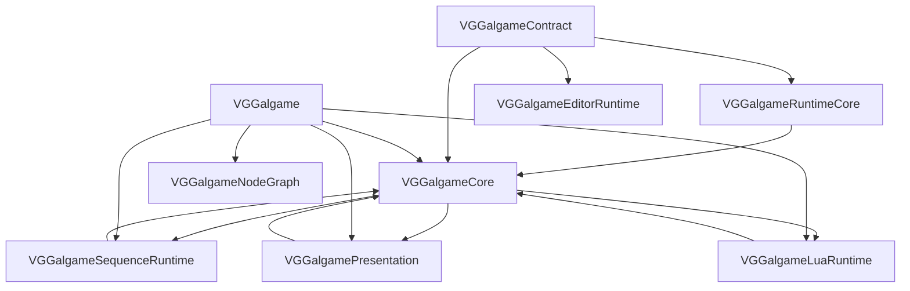

# Galgame Runtime 总览 — 模块矩阵与 Phase 8 进度

本文档描述 **VisionGal Phase 8 — Runtime Decoupling & Execution Architecture Refactor** 落地后的 **九模块 CMake 矩阵**、**依赖方向** 与 **各子文档入口**。契约与实现类的 **详细 API 表** 以各模块 [`Docs/MODULE_ARCHITECTURE_AND_PROGRESS.md`](VGGalgameContract/Docs/MODULE_ARCHITECTURE_AND_PROGRESS.md) 为准（自 Contract / RuntimeCore 起向下展开）。

---

## 1. 模块矩阵（九目标）

| CMake 目标 | 类型 | 职责摘要 | 典型依赖 / 备注 |
|------------|------|----------|----------------|
| **VGGalgameContract** | `INTERFACE` | 纯 ABI：`IGalGameEngine`、`IGalGameRuntime`、`ISubsystemBus`（含 **`IPlaybackSubsystem`**）、`IRuntimeExecutionServices`、`ISequenceAction`、`IExecutionScheduler`（**`GalYieldInstruction`**）、`IGalRuntimeSession`、`ILuaRuntimeBridge`、占位 `IRuntimeDebugBridge` / `IGalRuntimeEventBus` / `IVariableRuntime` / `IRuntimeSnapshotProvider` 等。 | → `VGEngine`、`VGCore` |
| **VGGalgameRuntimeCore** | `SHARED` | 运行时数据与实现：`GalGameContext`、`SaveArchive`、`GalGameScriptExecutorFactory`、`IGameSystem.h` / `IGameObject.h`、`GalGameEngineAccess`、`Components`、**`ISerializableRuntimeState`** 等。**DLL 文件名 `VGGalgameCore.dll`**（`OUTPUT_NAME`）。 | `PUBLIC` → `VGGalgameContract`、`VGEngine` |
| **VGGalgameCore** | `INTERFACE` | **聚合**：转发头 + 链接 Contract + RuntimeCore；兼容存量 `target_link_libraries(... VGGalgameCore)`。 | → Contract、RuntimeCore |
| **VGGalgameNodeGraph** | `SHARED` | DialogueList 数据模型 + **`VGNodeExec_Galgame`** 节点执行函数；依赖 HNG。**不依赖 VGGalgameCore**。 | `PUBLIC` → `HNGRuntimeCore`、`HCore` |
| **VGGalgameLuaRuntime** | `SHARED` | Lua 剧情：`LuaStoryScript`、`GalGameLuaBinding`、`GalGameLuaScriptModule::MountEngineRuntime`。 | `PUBLIC` → `VGGalgameCore`；Lua 头路径 |
| **VGGalgameSequenceRuntime** | `SHARED` | Sequence 执行内核；**`GalGameSequenceScriptModule::MountEngineRuntime`** 实现在 **`Source/Interface/Module.cpp`**。**DLL 名 `VGGalgameScriptSequence.dll`**。 | `PUBLIC` → `VGGalgameCore` |
| **VGGalgamePresentation** | `SHARED` | 表现层首包：**`RenderPipeline`**（Gal 分层渲染 / RT）。 | `PUBLIC` → `VGGalgameCore`、`VGEngine` |
| **VGGalgame** | `SHARED` | 宿主 **`GalGameEngine`**、**`GalRuntimeCoordinator`**（Phase 8A）、**`GalRuntimeSessionHost`**、**`GalDefaultExecutionScheduler`**、**`GalSubsystemBus`**、对白门面与子运行时等。 | `PUBLIC` → `VGGalgameNodeGraph`、`VGGalgameCore`、`VGGalgamePresentation`、`VGGalgameLuaRuntime`、`VGGalgameSequenceRuntime` |
| **VGGalgameEditorRuntime** | `INTERFACE` | 编辑器隔离：**`IEditorGalgameRuntimeBridge`**。 | → `VGGalgameContract` |

根目录 [`CMakeLists.txt`](../../../CMakeLists.txt)（仓库根）`add_subdirectory` 顺序：**Contract → RuntimeCore → Core → NodeGraph → LuaRuntime → SequenceRuntime → Presentation → VGGalgame →（其它）→ EditorRuntime**。

---

## 2. 依赖方向（约束）

**说明**：**`VGGalgameNodeGraph`** 不经过 **`VGGalgameCore`**；仅由 **`VGGalgame`** 显式 `PUBLIC` 链接以保证宿主进程加载节点图 DLL。

**禁止**：`VGGalgameContract` 的公开头反向 `#include` **`VGGalgameRuntimeCore`** 的实现头（除经 `Engine/Source/Runtime` 根的受控路径外，仍应避免循环依赖）。

---

## 3. Phase 8 子阶段状态（摘要）

| 子阶段 | 状态 | 说明 |
|--------|------|------|
| **8.1 Contract / RuntimeCore 拆分** | 已落地 | 新建 Contract + RuntimeCore；`VGGalgameCore` 为 INTERFACE 聚合；`#include "VGGalgameCore/..."` 薄转发保留。 |
| **8.2 Runtime Session** | 已落地 | `IGalRuntimeSession` + `GalRuntimeSessionHost`；`GalGameEngine::OnUpdate` → `GalRuntimeSessionHost::Tick` → **`GalRuntimeCoordinator::TickFrame`**（顺序见 `GalRuntimeCoordinator.cpp`）。 |
| **8A Runtime 生命周期统一（Coordinator）** | **首包已落地** | **`GalRuntimePhase`**；**`GalRuntimeCoordinator`** 接管 Tick 顺序、主场景切换、**`ResetRuntime`**、析构 **Shutdown**；**`CreateSubsystem`** 顺序：Context → Systems → **StoryScriptSystem**；**`SaveRuntimeState`/`RestoreRuntimeState`** 占位。详见 [VGGalgame 文档](VGGalgame/Docs/MODULE_ARCHITECTURE_AND_PROGRESS.md)。 |
| **8.3 Execution Scheduler** | 演进中 | `GalYieldKind` / `GalYieldInstruction`、`SubmitYield`；`GalDefaultExecutionScheduler` 与 `StoryScriptSystem` 协同；新增 **`Reset`** 供 Coordinator 全量清理。详见 [VGGalgame 文档](VGGalgame/Docs/MODULE_ARCHITECTURE_AND_PROGRESS.md)。 |
| **8B StoryScriptSystem 解耦** | **首包已落地** | **`IScriptRuntime`**（Contract）、**`GalScriptRuntimeRegistry`**、**`GalAssetTypeScriptRuntime`**；**`StoryScriptSystem`** 改为 **`ISubsystemBus*`** 注入，移除 **`SetEngine`/`IGalGameEngine*`**；加载 **Registry → Factory** 回退。**`RuntimeLoader` 独立类**、**`CreateExecution(IStoryExecutionInstance)`** 仍待迭代。 |
| **8.4 Dialogue Runtime / Presentation** | 已落地（首包） | `DialogueRmlPresentation`、`DialogueLineRuntime`、`DialogueTypingRuntime`、`DialoguePlaybackRuntime` + `DialogueSystem`；`RenderPipeline` 迁至 **Presentation**。 |
| **8.5 Runtime Layer Graph** | 骨架 | `IRuntimeLayerGraph` + `GalRuntimeLayerGraphAdapter`（`TickLayers` 占位）。 |
| **8.6 Snapshot / Save** | 演进中 | **`ISerializableRuntimeState`**；`IRuntimeSnapshotProvider` 骨架；SaveArchive schema 与 Lua 绑定联动时升版本。 |
| **8.7 Editor Runtime 隔离** | 演进中 | **`IRuntimeDebugBridge`** 占位；`VGGalgameEditorRuntime` + **`IEditorGalgameRuntimeBridge`**。 |
| **8.8 Engine / Context 去耦** | 已落地（首包） | 瘦 **`IGalGameEngine`**；`GalGameContext` 无 **`Engine`** 指针；`GalSubsystemBus` Adapter；`IGalGameRuntime` + `IPlaybackSubsystem`。 |
| **8.9 Runtime Event 统一** | 骨架 | **`IGalRuntimeEventBus`** 占位。 |
| **Sequence 模块重命名** | 已落地 | 目录 **`VGGalgameSequenceRuntime`**；CMake 目标同名；DLL 名保持 **`VGGalgameScriptSequence.dll`**。 |
| **Lua 独立库** | 已落地 | **`VGGalgameLuaRuntime`**；详见 [LuaRuntime 文档](VGGalgameLuaRuntime/Docs/MODULE_ARCHITECTURE_AND_PROGRESS.md)。 |
| **NodeGraph 独立库** | 已落地 | **`VGGalgameNodeGraph`**；详见 [NodeGraph 文档](VGGalgameNodeGraph/Docs/MODULE_ARCHITECTURE_AND_PROGRESS.md)。 |

### 3.1 本轮宿主侧落地与已知缺口（2026-05-13）

- **已落地**：**Phase 8A** — **`GalRuntimeCoordinator`** / **`GalRuntimePhase`**、**`Reset`/`Shutdown`**、**`CreateSubsystem`** 顺序；**Phase 8B（首包）** — **`IScriptRuntime`**（**`VGGalgameContract`**）、**`GalScriptRuntimeRegistry`** / **`GalAssetTypeScriptRuntime`**（**`VGGalgame`**）；**`StoryScriptSystem`** 仅持 **`ISubsystemBus*`**，不再持 **`IGalGameEngine*`**；脚本加载 **Registry 优先、工厂回退**。
- **存留 / 后续阶段**：**`RuntimeLoader`** 独立类型、**Wait/Signal** 全走调度器（**8C**）；**`SaveRuntimeState`/`RestoreRuntimeState`** 仅占位（**8D**）；**ResourceSystem** 与 **Scene** Actor 回收（**8E**）；Render/UI/EventHub（**8F–8G**）。

---

## 4. 各模块文档入口

| 模块 | 文档 |
|------|------|
| VGGalgameContract | [VGGalgameContract/Docs/MODULE_ARCHITECTURE_AND_PROGRESS.md](VGGalgameContract/Docs/MODULE_ARCHITECTURE_AND_PROGRESS.md) |
| VGGalgameRuntimeCore | [VGGalgameRuntimeCore/Docs/MODULE_ARCHITECTURE_AND_PROGRESS.md](VGGalgameRuntimeCore/Docs/MODULE_ARCHITECTURE_AND_PROGRESS.md) |
| VGGalgameCore（INTERFACE 聚合） | [VGGalgameCore/Docs/MODULE_ARCHITECTURE_AND_PROGRESS.md](VGGalgameCore/Docs/MODULE_ARCHITECTURE_AND_PROGRESS.md) |
| VGGalgameNodeGraph | [VGGalgameNodeGraph/Docs/MODULE_ARCHITECTURE_AND_PROGRESS.md](VGGalgameNodeGraph/Docs/MODULE_ARCHITECTURE_AND_PROGRESS.md) |
| VGGalgameLuaRuntime | [VGGalgameLuaRuntime/Docs/MODULE_ARCHITECTURE_AND_PROGRESS.md](VGGalgameLuaRuntime/Docs/MODULE_ARCHITECTURE_AND_PROGRESS.md) |
| VGGalgameSequenceRuntime | [VGGalgameSequenceRuntime/Docs/MODULE_ARCHITECTURE_AND_PROGRESS.md](VGGalgameSequenceRuntime/Docs/MODULE_ARCHITECTURE_AND_PROGRESS.md) |
| VGGalgamePresentation | [VGGalgamePresentation/Docs/MODULE_ARCHITECTURE_AND_PROGRESS.md](VGGalgamePresentation/Docs/MODULE_ARCHITECTURE_AND_PROGRESS.md) |
| VGGalgame | [VGGalgame/Docs/MODULE_ARCHITECTURE_AND_PROGRESS.md](VGGalgame/Docs/MODULE_ARCHITECTURE_AND_PROGRESS.md) |
| VGGalgameEditorRuntime | [VGGalgameEditorRuntime/Docs/MODULE_ARCHITECTURE_AND_PROGRESS.md](VGGalgameEditorRuntime/Docs/MODULE_ARCHITECTURE_AND_PROGRESS.md) |

---

## 5. 脚本与合并文档

| 路径 | 说明 |
|------|------|
| `Engine/Scripts/gen_vggalgame_core_shims.ps1` | 重新生成 `VGGalgameCore/` 下薄转发头。 |
| `Engine/Scripts/check_vggalgame_core_includes.ps1` | 校验 Core 转发目录未引入禁止路径。 |
| `Engine/Source/RuntimeGalgame/merge_docs.py` | 将各模块 **`Docs/MODULE_ARCHITECTURE_AND_PROGRESS.md`** 合并为 **`MERGED_ARCHITECTURE_AND_PROGRESS.md`**（默认 **包含全部子模块**；便于全文检索与对外导出）。在 **`RuntimeGalgame`** 目录执行：`python merge_docs.py`。 |

---

## 6. 修订记录

| 日期 | 说明 |
|------|------|
| 2026-05-13 | **Phase 8B**：总览 §3 **8B** 与 §3.1 更新；**`IScriptRuntime`** / Registry 首包落地说明。 |
| 2026-05-13 | Phase 8 表：新增 **8A Coordinator**、**8B 未开始**；**8.2** 与 **8.3** 说明对齐 **`GalRuntimeCoordinator::TickFrame`** 与 **`GalDefaultExecutionScheduler::Reset`**；矩阵 **VGGalgame** 职责列补充 Coordinator。 |
| 2026-05-13 | 总览更新：九模块矩阵、依赖图含 NodeGraph、文档入口含 **VGGalgameCore** / **NodeGraph**；脚本节补充 **merge_docs.py**。 |
