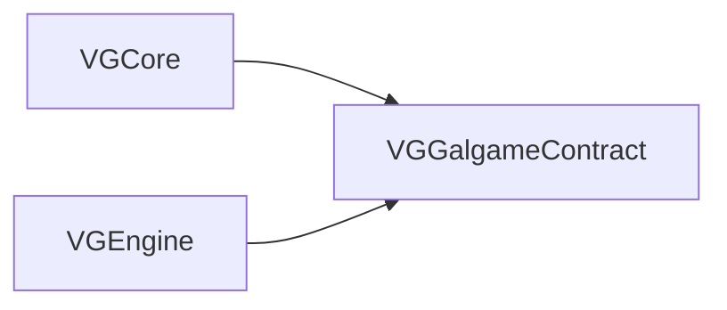

# VGGalgameContract — Phase 8 纯 ABI（INTERFACE）

## 1. 定位

| 项目 | 说明 |
|------|------|
| **职责** | 仅承载 **对外稳定虚接口**、**窄数据类型**（如 **`SubsystemBusSnapshot`**）与 **Yield/调度相关枚举**；**不包含** `SaveArchive` / `GalGameContext` / 执行器工厂 **实现**（见 **VGGalgameRuntimeCore**）。 |
| **CMake** | `INTERFACE` 库；`target_include_directories` 暴露本模块根与 `Engine/Source/Runtime` 根，以支持 `VGGalgameContract/Interface/...` 与历史 `Interface/...` 双风格。 |
| **依赖** | `INTERFACE` → **`VGEngine`**、**`VGCore`**。 |
| **ABI 提示** | 标注 **CORE ABI STABLE** 的头变更须版本号与存档 schema 联动；**Phase 11 前**部分门面（如 **`IGalGameEngine`**）仍可演进。 |

---

## 2. CMake

```cmake
add_library(VGGalgameContract INTERFACE)
target_link_libraries(VGGalgameContract INTERFACE VGEngine VGCore)
```

无独立 `.cpp`、无 DLL。

---

## 3. 目录结构

```
VGGalgameContract/
├── CMakeLists.txt
├── VGGalCoreConfig.h              # VG_GALGAME_CORE_API（由 RuntimeCore DLL 导出时定义 VG_GALGAME_CORE_EXPORT）
├── Include/
│   └── SubsystemBusSnapshot.h
└── Interface/
    ├── IGameEngine.h              # IGalGameEngine（瘦门面）
    ├── ISubsystemBus.h
    ├── IGalGameContext.h
    ├── IGalGameRuntime.h
    ├── IGalRuntimeSession.h
    ├── IExecutionScheduler.h      # GalYieldKind / GalYieldInstruction / IExecutionScheduler
    ├── IPlaybackSubsystem.h
    ├── IRuntimeExecutionServices.h
    ├── ISequenceAction.h
    ├── IScriptSubsystem.h
    ├── IStoryScriptSystem.h
    ├── IStoryScriptExecutor.h
    ├── IScriptRuntime.h           # Phase 8B：可注册脚本后端（Lua/Sequence/…）
    ├── IStoryExecutionAdapter.h
    ├── ISceneSubsystem.h
    ├── IUISubsystem.h
    ├── IAudioSubsystem.h
    ├── IArchiveSubsystem.h
    ├── IDialogueSubsystem.h
    ├── IDialoguePresenter.h
    ├── IChoicePresenter.h
    ├── IVariableRuntime.h
    ├── IRuntimeEventPipeline.h
    ├── IGalRuntimeEventBus.h
    ├── ILuaRuntimeBridge.h
    ├── IRuntimeDebugBridge.h
    ├── IRuntimeLayerGraph.h
    ├── IRuntimeSnapshotProvider.h
    └── ...
```

---

## 4. 依赖关系



---

## 5. 使用说明

1. **仅依赖契约的模块**（如 **SequenceRuntime**、测试桩）应 **`target_link_libraries(... VGGalgameContract)`** 或通过 **`VGGalgameCore`** INTERFACE 间接获得。
2. **包含路径**：推荐 `#include "VGGalgameContract/Interface/IGameEngine.h"`；同目录下相对包含（如 `IGameEngine.h` 内含 `IGalGameContext.h`）依赖本目录为 include root。
3. **与 RuntimeCore 分界**：需要 **`SaveArchive`** 完整类型、`**GalGameContext**` 定义时，须链接 **RuntimeCore**（或 `VGGalgameCore` 聚合），不可仅在 Contract 中前向声明处展开使用。

---

## 6. 开发进展

| 子项 | 状态 |
|------|------|
| Phase 8.1 Contract 独立目标 | 已落地 |
| `IGalGameRuntime` / `IPlaybackSubsystem` / `IRuntimeExecutionServices` / `ISequenceAction` | 已落地 |
| `IGalRuntimeSession` / `IExecutionScheduler` + Yield | 已落地（调度器逻辑宿主实现演进中） |
| `IRuntimeDebugBridge` / `IGalRuntimeEventBus` / `IVariableRuntime` / Presenter 占位 | 骨架 |
| `IRuntimeEventPipeline` / `ILuaRuntimeBridge` / `IRuntimeLayerGraph` / `IRuntimeSnapshotProvider` | 骨架 |

---

## 7. API 参考（按头文件）

以下表格为 **public virtual / 关键类型** 摘要；**完整签名与注释以各 `.h` 为准**。

### 7.1 `VGGalCoreConfig.h`

| 符号 | 说明 |
|------|------|
| **`VG_GALGAME_CORE_API`** | 导入/导出宏；在 **VGGalgameRuntimeCore** 编译 SHARED 且定义 **`VG_GALGAME_CORE_EXPORT`** 时导出。 |

### 7.2 `Include/SubsystemBusSnapshot.h`

| 成员 | 说明 |
|------|------|
| **`opaqueToken`** (`std::uint64_t`) | 总线快照不透明句柄；默认 **Snapshot/Restore** 为空操作。 |

### 7.3 `Interface/IGameEngine.h` — `IGalGameEngine`

| 方法 | 说明 |
|------|------|
| **`Reset()`** | 重置引擎状态。 |
| **`GetSubsystemBus()`** | 返回 **`ISubsystemBus*`**。 |
| **`GetContext()`** | 返回 **`IGalGameContext*`**。 |
| **`GetRuntimeSession()`** | 返回 **`IGalRuntimeSession*`**（`noexcept`）。 |
| **`GetRuntime()`** | 返回 **`IGalGameRuntime*`**（`noexcept`）；多域运行时聚合。 |

继承 **`ISubGameEngine`**（`VGCore`）；具体 ShowSprite 等能力经 **SubsystemBus**。

### 7.4 `Interface/ISubsystemBus.h` — `ISubsystemBus`

| 方法 | 说明 |
|------|------|
| **`Snapshot()`** | 默认返回空 **`SubsystemBusSnapshot`**。 |
| **`Restore(const SubsystemBusSnapshot&)`** | 默认空操作。 |
| **`Scene()` / `UI()` / `Audio()` / `Script()` / `Archive()` / `Dialogue()`** | 各子系统指针。 |
| **`Playback()`** | **`IPlaybackSubsystem*`**（Wait/节拍）。 |

### 7.5 `Interface/IGalGameContext.h` — `IGalGameContext`

| 方法 | 说明 |
|------|------|
| 虚析构 | 具体实现为 **`GalGameContext`**（RuntimeCore）。 |

### 7.6 `Interface/IGalGameRuntime.h` — `IGalGameRuntime`

| 方法 | 说明 |
|------|------|
| **`GetExecutionRuntime()`** | **`IStoryScriptSystem*`**。 |
| **`GetSaveRuntime()`** | **`IArchiveSystem*`**（定义见 RuntimeCore `IGameSystem.h`）。 |
| **`GetPlaybackRuntime()`** | **`IPlaybackSubsystem*`**。 |
| **`GetVariableRuntime()`** | **`IVariableRuntime*`**；可 nullptr。 |

### 7.7 `Interface/IGalRuntimeSession.h` — `IGalRuntimeSession`

| 方法 | 说明 |
|------|------|
| **`Start` / `Stop` / `Pause` / `Resume`** | 会话生命周期。 |
| **`Tick(float deltaTime)`** | 每帧入口。 |
| **`GetSubsystemBus()`** | 同引擎总线视图。 |
| **`GetExecutionScheduler()`** | **`IExecutionScheduler*`**。 |
| **`GetRuntimeState()`** | **`IGalGameContext*`**（当前与资源上下文同源映射）。 |
| **`GetResourceContext()`** | 同上（演进中可拆分）。 |
| **`GetEventPipeline()`** | **`IRuntimeEventPipeline*`**；可 nullptr。 |

### 7.8 `Interface/IExecutionScheduler.h`

| 类型 | 说明 |
|------|------|
| **`GalExecutionHandle`** | `std::uint64_t`，`0` 无效。 |
| **`GalYieldKind`** | `WaitSeconds`、`WaitDialogueContinue`。 |
| **`GalYieldInstruction`** | `kind` + `seconds` 等载荷。 |

| 方法 | 说明 |
|------|------|
| **`SubmitWait(float)`** | 提交等待任务。 |
| **`Cancel` / `Pause` / `Resume`** | 按句柄控制。 |
| **`PauseAll` / `ResumeAll`** | 全局暂停恢复。 |
| **`Tick(float)`** | 每帧驱动。 |
| **`SubmitYield(const GalYieldInstruction&)`** | 默认返回 `0`；宿主可覆盖。 |

### 7.9 `Interface/IPlaybackSubsystem.h` — `IPlaybackSubsystem`

| 方法 | 说明 |
|------|------|
| **`Wait(float durationSeconds)`** | 协程式等待。 |

### 7.10 `Interface/IRuntimeExecutionServices.h` — `IRuntimeExecutionServices`

| 方法 | 说明 |
|------|------|
| **`DialogueCharacterSay(character, text)`** | 窄服务：播一行对白。 |

### 7.11 `Interface/ISequenceAction.h` — `ISequenceAction`

| 方法 | 说明 |
|------|------|
| **`Execute(IRuntimeExecutionServices&)`** | 执行。 |
| **`Suspend` / `Resume` / `Cancel`** | 默认空操作可覆盖。 |

### 7.12 `Interface/IScriptSubsystem.h` — `IScriptSubsystem`

| 方法 | 说明 |
|------|------|
| **`LoadStoryScript` / `LoadStoryScriptOnUpdate` / `ReloadStoryScript`** | 脚本路径加载。 |
| **`Wait(float)`** | 脚本侧等待。 |
| **`GetStoryScriptSystem()`** | **`IStoryScriptSystem*`**。 |

### 7.13 `Interface/IStoryScriptSystem.h` — `IStoryExecutionInstance` / `IStoryScriptSystem`

**`IStoryExecutionInstance`**

| 方法 | 说明 |
|------|------|
| **`Tick(deltaTime, ISubsystemBus*)`** | 每帧。 |
| **`Continue(ISubsystemBus*)`** | 继续（对白/选项后）。 |
| **`QueryInterface(InterfaceID)`** | RTTI 风格查询；模板 **`ExecutionQuery<T>()`**。 |

**`IStoryScriptSystem`**

| 方法 | 说明 |
|------|------|
| **`GetExecutionInstance(unsigned id)`** | 默认实例 `id=0`。 |
| **`ReloadStoryScript` / `LoadStoryScript` / `LoadStoryScriptOnUpdate`** | 加载策略。 |
| **`GetCurrentStoryScriptPath`** / **`GetScriptLastWriteTime`** | 热重载辅助。 |
| **`DoChoice` / `DoInput`** | UI 事件入口。 |
| **`LoadSceneStoryScript` / `LoadSceneStoryScriptOnUpdate`** | 场景级加载。 |
| **`Wait(float)`** | 等待。 |
| **`LoadArchive(const SaveArchive&)`** | 读档（`SaveArchive` 完整类型在 RuntimeCore）。 |

### 7.14 `Interface/IStoryScriptExecutor.h` — `IStoryScriptExecutor` / `IStoryScriptExecutorCreator`

**`IStoryScriptExecutor`**（继承 **`VGEngineResource`**）

| 方法 | 说明 |
|------|------|
| **`Run(ISubsystemBus*, IGalGameContext*)`** | 启动执行。 |
| **`Tick(float)`** | 每帧。 |
| **`QueryInterface`** | 扩展查询。 |
| **`PreLoadScriptResource`** | 预加载。 |
| **`GetScriptLastWriteTime`** | 文件时间。 |
| **`ContinueDialogue`** | 继续对白。 |
| **`OnChoiceSelected` / `OnInputSubmitted`** | UI 回调。 |

**`IStoryScriptExecutorCreator`**

| 方法 | 说明 |
|------|------|
| **`LoadFromAsset(const String& path)`** | 返回 **`Ref<IStoryScriptExecutor>`**。 |

#### 7.14.1 `Interface/IScriptRuntime.h` — `IScriptRuntime`（Phase 8B）

**`IScriptRuntime`**（继承 **`VGEngineResource`**）：宿主侧 **`GalScriptRuntimeRegistry`** 的表项；当前 **`CreateScriptExecutor`** 仍委托 **`GalGameScriptExecutorFactory`**，与 **`IStoryScriptExecutorCreator`** 并存，便于后续迁入 **`IStoryExecutionInstance`** 直建路径。

| 方法 | 说明 |
|------|------|
| **`GetRuntimeName`** | 调试短名。 |
| **`CanLoad(assetPath)`** | 是否承接该路径（通常与 **`GetAssetTypeNameID`** 对齐）。 |
| **`CreateScriptExecutor(assetPath)`** | 同步构造 **`IStoryScriptExecutor`**；失败返回 **nullptr**。 |

### 7.15 `Interface/IStoryExecutionAdapter.h` — `IStoryExecutionAdapter`

| 方法 | 说明 |
|------|------|
| **`GetExecution()`** | **`IStoryExecutionInstance*`**（不拥有）。 |
| **`Tick` / `Continue`** | 转发到执行实例。 |

### 7.16 `Interface/ISceneSubsystem.h` — `ISceneSubsystem`

| 方法 | 说明 |
|------|------|
| **`PreLoadResource`** | 预加载资源。 |
| **`TransitionCommand` / `TransitionCommandWithCustomImage`** | 转场命令。 |
| **`ShowSprite` / `ShowColor` / `PlayVideo` / `CreateCharacter`** | 场景表现。 |
| **`RemoveSprite` / `HideAllCharacterSprite` / `CaptureSceneImage`** | 资源与截图。 |
| **`GetLayeredSceneManager()`** | **`ILayeredSceneManager*`**（RuntimeCore 定义）。 |

### 7.17 `Interface/IUISubsystem.h` — `IUISubsystem`

| 方法 | 说明 |
|------|------|
| **`GetGalGameUISystem()`** | **`IGalGameUISystem*`**（RuntimeCore `IGameSystem.h`）。 |

### 7.18 `Interface/IAudioSubsystem.h` — `IAudioSubsystem`

| 方法 | 说明 |
|------|------|
| **`PlayAudio(layer, path)`** | 返回 **`IGalAudio*`**。 |
| **`RemoveAudio(IGalAudio*)`** | 移除。 |

### 7.19 `Interface/IArchiveSubsystem.h` — `IArchiveSubsystem`

| 方法 | 说明 |
|------|------|
| **`LoadArchive(const SaveArchive&)`** | 读档。 |
| **`GetArchiveDataContainer()`** | **`ArchiveDataContainer*`**。 |
| **`GetArchiveSystem()`** | **`IArchiveSystem*`**。 |

### 7.20 `Interface/IDialogueSubsystem.h` — `IDialogueSubsystem`

| 方法 | 说明 |
|------|------|
| **`GetDialogueSystem()`** | **`IDialogueSystem*`**（RuntimeCore）。 |

### 7.21 `Interface/IDialoguePresenter.h` — `IDialoguePresenter`

| 方法 | 说明 |
|------|------|
| **`OnDialogueVisualChanged()`** | 非纯虚默认空；占位。 |

### 7.22 `Interface/IChoicePresenter.h` — `IChoicePresenter`

占位结构体，无纯虚方法（避免破坏构建）。

### 7.23 `Interface/IVariableRuntime.h` — `IVariableRuntime`

占位，仅虚析构。

### 7.24 `Interface/IRuntimeEventPipeline.h` — `IRuntimeEventPipeline`

骨架，仅虚析构。

### 7.25 `Interface/IGalRuntimeEventBus.h` — `IGalRuntimeEventBus`

骨架，仅虚析构。

### 7.26 `Interface/ILuaRuntimeBridge.h` — `ILuaRuntimeBridge`

| 方法 | 说明 |
|------|------|
| **`GetActiveSession()`** | **`IGalRuntimeSession*`**。 |
| **`GetSubsystemBus()`** | **`ISubsystemBus*`**。 |

### 7.27 `Interface/IRuntimeDebugBridge.h` — `IRuntimeDebugBridge`

占位，仅虚析构。

### 7.28 `Interface/IRuntimeLayerGraph.h`

| 类型 / 方法 | 说明 |
|-------------|------|
| **`GalRuntimeLayerKind`** | Background / Character / Effect / UI / Transition。 |
| **`TickLayers(float)`** | 按图层图刷新。 |

### 7.29 `Interface/IRuntimeSnapshotProvider.h` — `IRuntimeSnapshotProvider`

| 方法 | 说明 |
|------|------|
| **`SnapshotSectionId()`** | 稳定段键，如 `"DialogueRuntime"`。 |

---

## 8. 修订记录

| 日期 | 说明 |
|------|------|
| 2026-05-13 | **Phase 8B**：新增 **`IScriptRuntime.h`**；目录树与 §7.14.1 API 说明。 |
| 2026-05-13 | 扩充 API 参考节：覆盖 `Interface/` 与 `Include/SubsystemBusSnapshot.h`；与 RuntimeCore / Core 聚合文档交叉引用。 |
| 2026-05-13 | Phase 8.1：自原 VGGalgameCore 拆出独立 **Contract** 目标。 |
