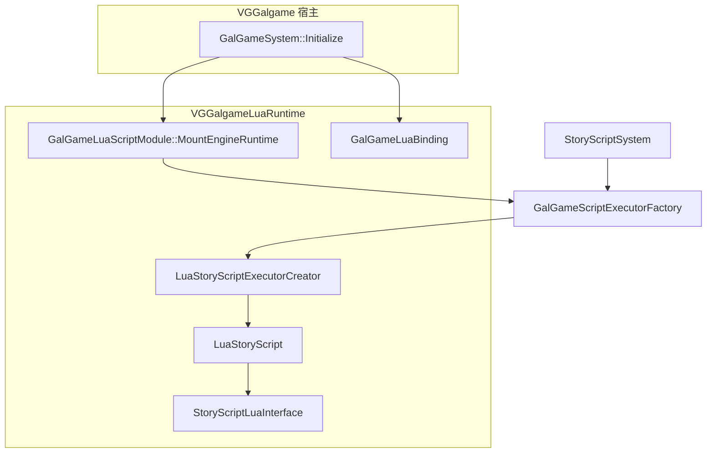

# VGGalgameLuaRuntime — 架构、使用说明与 API

本文档描述 **CMake 目标 `VGGalgameLuaRuntime`**（Lua 剧情脚本运行时 DLL）的职责、目录结构、与宿主/工厂的衔接方式，以及 **C++ 接口类** 与 **Lua 侧 `GalGame` API** 的说明。

---

## 1. 模块职责（一句话）

在进程内提供 **基于 sol2 的 Lua 剧情脚本执行器**（`LuaStoryScript`），向 **`GalGameScriptExecutorFactory`** 注册资产类型 **`GalGameLuaScript`** 对应的创建器；并在编辑器/核心 Lua 中注册 **`GalGame` 命名空间绑定**（`GalGameLuaBinding`）。**不依赖 Editor**，仅依赖 **`VGGalgameCore`** 与 **`VGLua`** 公开头路径。

---

## 2. CMake 与依赖

| 项目 | 说明 |
|------|------|
| **目标名** | `VGGalgameLuaRuntime`（`SHARED`） |
| **导出宏** | 编译 `PRIVATE VG_GALGAME_SCRIPT_LUA_EXPORT` → `VGGalgameScriptLuaConfig.h` 中 `VG_GALGAME_SCRIPT_LUA_API` |
| **链接** | `PUBLIC VGGalgameCore` |
| **对外 Include** | `PUBLIC`：`Engine/Source/Runtime/VGLua/Include`（sol2 等） |
| **对内 Include** | `PRIVATE`：`Engine/Source/Runtime`、`Engine/Source/RuntimeGalgame`、本模块 `Include/`、`Interface/` |
| **宿主链接** | `VGGalgame` → `PUBLIC VGGalgameLuaRuntime`（游戏宿主加载本 DLL 并调用 `MountEngineRuntime`） |

根 `CMakeLists.txt` 通过 `add_subdirectory(Engine/Source/RuntimeGalgame/VGGalgameLuaRuntime)` 引入本目标。

---

## 3. 目录结构

```
VGGalgameLuaRuntime/
├── CMakeLists.txt                 # 目标定义、宏、链接
├── Module.h                       # GalGameLuaScriptModule::MountEngineRuntime
├── VGGalgameScriptLuaConfig.h     # VG_GALGAME_SCRIPT_LUA_API
├── Include/
│   ├── SSExecutor.h               # LuaStoryScript（IStoryScriptExecutor）
│   └── SSExecutorCreator.h        # LuaStoryScriptExecutorCreator
├── Interface/
│   ├── LuaBinding.h               # GalGameLuaBinding
│   └── StoryScriptLuaInterface.h  # StoryScriptLuaInterface
├── Source/
│   ├── Module.cpp
│   ├── SSExecutor.cpp
│   ├── SSExecutorCreator.cpp
│   └── Interface/
│       ├── LuaBinding.cpp
│       └── StoryScriptLuaInterface.cpp
└── Docs/
    └── MODULE_ARCHITECTURE_AND_PROGRESS.md   # 本文档
```

**命名说明**：历史文件名 `SSExecutor*` 表示「Story Script Executor」；公开类型名为 **`LuaStoryScript`** / **`LuaStoryScriptExecutorCreator`**。

---

## 4. 运行时如何挂载（使用说明）

### 4.1 引擎侧（已实现）

在 **`GalGameSystem::Initialize`**（`VGGalgame/Source/Interface/GalgameSystem.cpp`）中：

1. **`CoreLua::RegisterGlobalAPI`**：对全局 `sol::state` 调用 **`GalGameLuaBinding::Register`**，使编辑器/通用 Lua 可使用 `GalGame` API（与剧情脚本内 `RegisterScript` 注册的表一致，见下文）。
2. **`GalGameLuaScriptModule::MountEngineRuntime()`**：向 **`GalGameScriptExecutorFactory::Get()`** 注册  
   `RegisterAssetExecutor(GLuaScriptAssetType{}.GetNameID(), MakeRef<LuaStoryScriptExecutorCreator>())`  
   其中类型 ID 为 **`"GalGameLuaScript"`**（见 `VGAsset/Include/GalGameAsset.h`）。

因此：**任何链接 `VGGalgame` 的宿主**在初始化 GalGame 子系统后，即可按资产类型加载 Lua 剧情脚本；**无需**在业务代码中再次调用 `MountEngineRuntime`，除非自行搭建不含 `VGGalgame` 的测试宿主（此时需自行链接本库并调用一次）。

### 4.2 剧情脚本资产与执行流程

1. 资源为 **`GalGameLuaScript`** 类型的文本脚本（由 `VFS` 读取路径对应文件内容）。
2. **`LuaStoryScriptExecutorCreator::LoadFromAsset`**：先 **`StoryScriptLuaInterface::ResetStoryScript()`**，再 **`LuaStoryScript::LoadFromFile(path)`**（仅设置路径，构造时已 **`RegisterScript`**）。
3. **`LuaStoryScript::Run(bus, gameContext)`**：  
   - 从 `GalGameContext` 取 **`IGalGameEngine*`**，写入 `GalGame["引擎"]` 与全局 **`VG`**（均为同一引擎指针）。  
   - 读文件、`m_LuaState.script(code)` 得到 **`sol::coroutine`**。  
   - 设置 **`StoryScriptLuaInterface`** 当前协程与脚本路径，调用 **`PreLoadScriptResource()`**，然后 **`m_Coroutine()`** 启动协程。  
4. 用户操作（继续对话、选项、输入）经 **`IStoryScriptExecutor`** 转发到 **`StoryScriptLuaInterface::Continue`**，以 **无参 / 数值 / 字符串** 恢复协程。

### 4.3 协程与 `Continue` 约定

- Lua 剧情应使用 **sol2 协程**；在 C++ 绑定中，对需要等待引擎/UI 的 API 使用 **`sol::yielding`**，与 **`StoryScriptLuaInterface::Continue`** 配对。
- **`Continue(ContinueType::None)`**：恢复协程且无返回值传入。  
- **`ContinueType::Number` / `String`**：将 `number` 或 `str` 作为 **`(*co)(arg)`** 的参数传入（用于选项索引对应的字符串、输入框文本等；具体由脚本侧 `coroutine.yield` 约定）。

### 4.4 资源预加载

**`PreLoadScriptResource`** 在脚本源码上用正则扫描引号内的路径，扩展名为  
`png|jpg|jpeg|tga|bmp|wav|mp3|ogg` 时，调用 **`ISubsystemBus::Scene()->PreLoadResource(path)`**。用于降低首帧加载卡顿；非完整解析器，复杂字符串拼接路径可能无法识别。

---

## 5. 架构示意



---

## 6. 开发进展（截至文档编写时）

| 主题 | 状态 | 说明 |
|------|------|------|
| 独立 CMake 目标 `VGGalgameLuaRuntime` | 已落地 | 与 `VGGalgame` 解耦链接；DLL 承载执行器与绑定实现。 |
| 工厂注册 `GalGameLuaScript` | 已落地 | `Module.cpp` 注册 `LuaStoryScriptExecutorCreator`。 |
| `LuaStoryScript` 协程驱动 | 已落地 | `Run` / `ContinueDialogue` / 选项与输入回调经 `StoryScriptLuaInterface`。 |
| `GalGameLuaBinding` | 持续演进 | Phase 7 起子系统经 **`IGalGameEngine::SubsystemBus`** 暴露；含 `IGalRuntimeSession` / `IExecutionScheduler` 等绑定。 |
| `LuaStoryScript::Tick` | 空实现 | 当前无每帧逻辑。 |
| `QueryInterface` | 恒为 `nullptr` | 尚未暴露扩展接口。 |
| 头文件命名 `SSExecutor` | 技术债 | 与类型名 `LuaStoryScript` 不一致，后续可重命名文件以对齐。 |

---

## 7. C++ 接口类 API 参考

命名空间均为 **`VisionGal::GalGame`**。

### 7.1 `GalGameLuaScriptModule`（`Module.h`）

| 声明 | 说明 |
|------|------|
| `static void MountEngineRuntime()` | 向 `GalGameScriptExecutorFactory` 注册 **`GalGameLuaScript`** → `LuaStoryScriptExecutorCreator`。进程内应只在与 Sequence 等其它后端一致的初始化点调用一次（当前由 `GalGameSystem::Initialize` 调用）。 |

### 7.2 `LuaStoryScriptExecutorCreator`（`SSExecutorCreator.h`）

继承 **`IStoryScriptExecutorCreator`**（契约见 `VGGalgameContract/Interface/IStoryScriptExecutor.h`）。

| 方法 | 说明 |
|------|------|
| `Ref<IStoryScriptExecutor> LoadFromAsset(const String& path) override` | 调用 `StoryScriptLuaInterface::ResetStoryScript()` 后返回 `LuaStoryScript::LoadFromFile(path)`。 |

### 7.3 `LuaStoryScript`（`SSExecutor.h` / `SSExecutor.cpp`）

**`ScriptExecutionContext`**（同头文件）：聚合 **`ISubsystemBus*`**、**`IGalGameContext*`**、**`IGalGameEngine*`**；**`Run`** 时填充，供 Lua 绑定在 Phase 8 后逐步减少对 **`GalGameEngineAccess`** 的依赖。

继承 **`IStoryScriptExecutor`**。

| 方法 | 说明 |
|------|------|
| `LuaStoryScript()` | 构造内调用 `GalGameLuaBinding::RegisterScript(m_LuaState)`（打开 base/math/string/table + `VGLuaInterface::Initialise` + `Register`）。 |
| `static Ref<LuaStoryScript> LoadFromFile(const String& file)` | 创建实例并 `SetResourcePath(path)`。 |
| `bool Run(ISubsystemBus* bus, IGalGameContext* gameContext) override` | 绑定引擎指针到 `GalGame["引擎"]` 与 `VG`，读盘加载脚本，设置协程与路径，`PreLoadScriptResource()`，执行首次 `m_Coroutine()`；错误时打日志并广播 `LuaScriptEvent`。 |
| `void Tick(float deltaTime) override` | 当前为空。 |
| `IRuntimeInterface* QueryInterface(InterfaceID id) override` | 返回 `nullptr`。 |
| `void PreLoadScriptResource() override` | 正则扫描脚本中的媒体路径并 `Scene()->PreLoadResource`。 |
| `std::filesystem::file_time_type GetScriptLastWriteTime() const override` | 基于 VFS 绝对路径的文件最后修改时间；文件不存在则未定义行为依赖默认构造。 |
| `void ContinueDialogue() override` | `StoryScriptLuaInterface::Continue()`。 |
| `void OnChoiceSelected(...)` override | `Continue(ContinueType::String, 0, options[currentChoice])`。 |
| `void OnInputSubmitted(...)` override | `Continue(ContinueType::String, 0, text)`。 |
| `sol::coroutine GetCoroutine()` | 返回内部协程引用（供调试或扩展）。 |

### 7.4 `StoryScriptLuaInterface`（`StoryScriptLuaInterface.h` / `.cpp`）

静态工具类；维护 **进程内单例** 的当前协程指针与脚本路径（用于错误事件）。

| 成员 | 说明 |
|------|------|
| `enum class ContinueType { None, Number, String }` | 恢复协程时是否向 Lua 传入参数。 |
| `static int Continue(ContinueType type = None, int number = 0, const std::string& str = "")` | 若协程已结束则清空指针；否则 `(*co)()` / `(*co)(number)` / `(*co)(str)`；错误时日志 + `LuaScriptEvent`。返回值当前恒为 `0`。 |
| `static void ResetStoryScript()` | 将当前协程指针置空（加载新脚本前由 Creator 调用）。 |
| `static void SetStoryScriptCoroutine(sol::coroutine* co)` | `Run` 时由 `LuaStoryScript` 设置。 |
| `static sol::coroutine* GetStoryScriptCoroutine()` | 查询当前协程指针。 |
| `static void SetCurrentStoryScriptPath(const std::string& path)` | 供错误上报关联路径。 |

### 7.5 `GalGameLuaBinding`（`LuaBinding.h` / `.cpp`）

| 方法 | 说明 |
|------|------|
| `static void Register(sol::state& state)` | 创建/填充全局表 **`GalGame`**，注册 `GetEngine` / `获取引擎` / `引擎`、`GalSubsystemBus`、`IGalGameEngine` 及子系统门面、`IGalCharacter`、`IGalSprite`、`IGalAudio`、`IGalVideo`、对话/存档/UI/场景、`SaveArchive`、`IGalRuntimeSession`、`IExecutionScheduler` 等 usertype 与中英双语成员（完整列表以 `LuaBinding.cpp` 为准）。 |
| `static void RegisterScript(sol::state& state)` | `open_libraries` + `VGLuaInterface::Initialise` + `Register`，供 **`LuaStoryScript`** 独立 `sol::state` 使用。 |

**Lua 全局表要点摘要**（实现见 `Source/Interface/LuaBinding.cpp`）：

- **`GalGame.GetEngine` / `GalGame.获取引擎` / `GalGame.引擎()`**：经 `GalGameEngineAccess::Current()` 取当前 `IGalGameEngine*`（剧情运行时由 `Run` 同时注入 `GalGame["引擎"]` 与 `VG`）。  
- **`GalGame.Engine`**：`Scene` / `Audio` / `Script` 子表（`ShowSprite`、`PlayAudio`、`LoadStoryScript` 等便捷函数，内部从当前引擎取 `ISubsystemBus`）。  
- **`IGalGameEngine`**：`SubsystemBus`、`RuntimeSession`、**`Runtime`**（`IGalGameRuntime`）、`剧情选择`（yielding）、`全屏文字`、`文本输入`（yielding）、**`等待`→`Playback::Wait`**、转场、立绘/背景/BGM、**`对话系统` / `存档系统` / `场景系统` / `UI系统`** 子系统引用、`存档数据` 等（能力均经总线委托，与瘦 `IGalGameEngine` 对齐）。  
- 子系统 usertype：**`GalSubsystemBus`** 增加 **`Playback`**；**`IPlaybackSubsystem`** 注册 **`等待`**（yielding）；**`IGalGameRuntime`** 暴露执行/存档/播放子域。  

新增 Lua 能力时，应优先在 **`GalGameLuaBinding::Register`** 中扩展，并评估 **`IStoryScriptExecutor` 契约** 与存档版本说明（见 Contract 头文件注释）。

---

## 8. 相关文档与代码入口

- 总览：[RuntimeGalgame/GALGAME_MODULE_ARCHITECTURE_AND_PROGRESS.md](../../GALGAME_MODULE_ARCHITECTURE_AND_PROGRESS.md)  
- 执行器工厂：`VGGalgameRuntimeCore/Interface/IStoryScript.h`  
- 契约：`VGGalgameContract/Interface/IStoryScriptExecutor.h`  
- 宿主初始化：`VGGalgame/Source/Interface/GalgameSystem.cpp`  

### 8.1 修订记录

| 日期 | 说明 |
|------|------|
| 2026-05-13 | Phase 8：`LuaBinding` 对齐瘦引擎与 **`IPlaybackSubsystem`**；**`ScriptExecutionContext`** 注入；**`GalGame.Engine.Script.Wait`** 与 **`Playback::Wait`** 同源。 |
