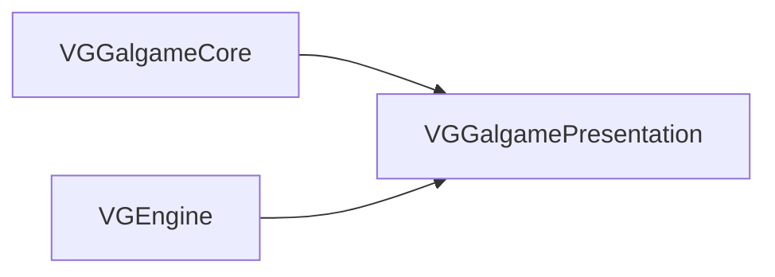
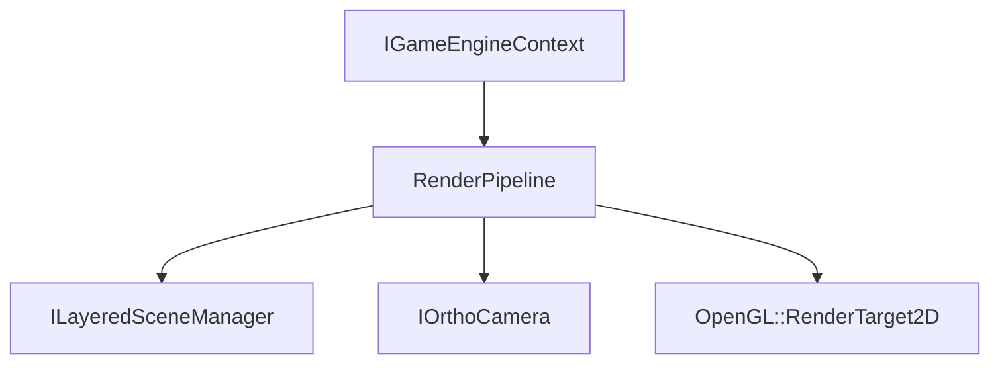

# VGGalgamePresentation — 表现层（Phase 8）

## 1. 定位

| 项目 | 说明 |
|------|------|
| **职责** | 与 Gal **玩法状态**解耦的 **渲染与视觉表现** 逻辑首包；当前主要包含 **`RenderPipeline`**（分层 Gal 场景渲染、截屏 RT、与转场相关的上一帧纹理抓取）。 |
| **不负责** | 剧情脚本、存档、子系统总线、Rml 对白数据模型（在 **`VGGalgame`**）；纯契约（在 **`VGGalgameContract`**）。 |
| **CMake** | `SHARED`；**`VG_GALGAME_PRESENTATION_API`**（`VGGalPresentationConfig.h`）；**`PUBLIC`** 链接 **`VGGalgameCore`**、**`VGEngine`**。 |
| **典型消费方** | **`VGGalgame`**（`PUBLIC` 链接）；通过 **`VGGalgame/Include/RenderPipeline.h`** 薄 include 引用本模块头。 |

---

## 2. CMake 与依赖

| 项目 | 说明 |
|------|------|
| **目标** | `VGGalgamePresentation` |
| **源文件** | `Include/RenderPipeline.h`、`Source/RenderPipeline.cpp`、`VGGalPresentationConfig.h`（见 [CMakeLists.txt](../CMakeLists.txt)） |
| **编译宏** | `PRIVATE VG_GALGAME_PRESENTATION_EXPORT` |
| **链接** | `PUBLIC VGGalgameCore`、`PUBLIC VGEngine` |



---

## 3. 目录结构

```
VGGalgamePresentation/
├── CMakeLists.txt
├── VGGalPresentationConfig.h
├── Include/
│   └── RenderPipeline.h
├── Source/
│   └── RenderPipeline.cpp
└── Docs/
    └── MODULE_ARCHITECTURE_AND_PROGRESS.md
```

---

## 4. 与 VGGalgame 的衔接

| 项目 | 说明 |
|------|------|
| **头文件转发** | [VGGalgame/Include/RenderPipeline.h](../../VGGalgame/Include/RenderPipeline.h) 单行 **`#include "VGGalgamePresentation/Include/RenderPipeline.h"`** |
| **类型持有** | **`GalGameEngine`** 内 **`Ref<RenderPipeline> m_RenderPipeline`**，在 **`CreateSubsystem`** 中 **`MakeRef<RenderPipeline>()`** 并 **`Initialize(context)`** |
| **渲染触发** | 宿主在 **`IGameEngineContext`** 的 **BeforeRender**（或等价回调）中调用 **`RenderPipeline::Render`**（见 **`GalGameEngine::Initialize`** 订阅实现） |

---

## 5. 架构与数据流



- **`Initialize`**：按视口创建 **`OpenGL::RenderTarget2D`** 链、全屏渲染组件等。
- **`Render`**：背景层 → 场景层 → 角色层混合（**`RenderBackgroundLayer`** / **`RenderSceneLayer`** / **`RenderMixCharacterSprite`**）。
- **`CaptureBackgroundLayer` / `CaptureSceneLayer`**：写入 **`m_PrevBackgroundTexture`** / **`m_PrevSceneTexture`** 供 **`TransitionManager`** 与 Gal 引擎转场逻辑使用。

---

## 6. 使用说明

1. **正常游戏宿主**：只需链接 **`VGGalgame`**，无需单独链接本库（已 `PUBLIC` 传递）。
2. **自定义最小宿主**（无 `VGGalgame`）：`target_link_libraries(... VGGalgamePresentation VGGalgameCore VGEngine)`，自行在合适的渲染阶段调用 **`RenderPipeline::Render`**，并提供 **`ILayeredSceneManager`** 与相机。
3. **屏幕尺寸变化**：调用 **`OnScreenSizeChanged`** 以重建 RT。

---

## 7. API 参考 — `RenderPipeline`

| 方法 | 说明 |
|------|------|
| **`RenderPipeline()`** | 默认构造。 |
| **`void Initialize(IGameEngineContext* context)`** | 绑定引擎上下文并创建内部 RT / 组件。 |
| **`void Render(ILayeredSceneManager* scene, IOrthoCamera* camera, OpenGL::RenderTarget2D* rt)`** | 主渲染入口。 |
| **`void OnScreenSizeChanged(int width, int height)`** | 视口变化。 |
| **`void CaptureBackgroundLayer()`** | 抓取背景层上一帧纹理。 |
| **`void CaptureSceneLayer()`** | 抓取场景层上一帧纹理。 |
| **`void SetScene(Scene* scene)`** | 设置当前 **`Scene*`**。 |

私有辅助方法（**`RenderSprite`**、**`RenderFullScreen`**、各层 **`Render*Layer`**）见 [RenderPipeline.h](../Include/RenderPipeline.h) / [RenderPipeline.cpp](../Source/RenderPipeline.cpp)。

---

## 8. 开发进展

| 日期 | 说明 |
|------|------|
| 2026-05-13 | Phase 8.4：自 **`VGGalgame`** 迁入 **`RenderPipeline`**；宿主头文件改为薄转发。 |
| 2026-05-13 | 文档扩充：CMake、目录、依赖图、与宿主衔接、API 表。 |

---

## 9. 相关文档

- [VGGalgame/Docs/MODULE_ARCHITECTURE_AND_PROGRESS.md](../../VGGalgame/Docs/MODULE_ARCHITECTURE_AND_PROGRESS.md)
- [GALGAME_MODULE_ARCHITECTURE_AND_PROGRESS.md](../../GALGAME_MODULE_ARCHITECTURE_AND_PROGRESS.md)
