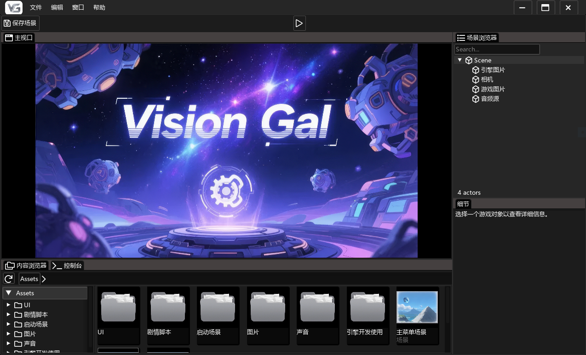
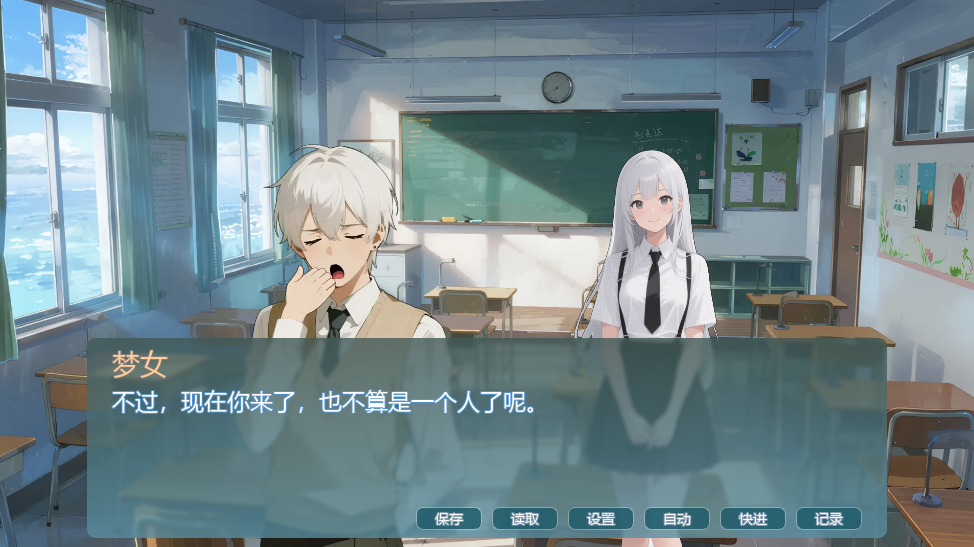

# The VisionGal Visual Novel Engine
VisionGal 是一个功能强大的视觉小说引擎，专为创建高质量视觉小说和交互式叙事体验而设计。引擎采用 C++ 开发，具有良好的跨平台性和可扩展性。




## 功能特点
- 提供完善的可视化编辑器，支持实时预览编辑效果，方便创作和管理视觉小说内容
- 全部自定义的UI界面，用类似Html和Css的语法来定义界面，用Lua脚本定义界面的行为
- 支持丰富功能的剧情脚本语言，支持中文编写剧情脚本，优雅的追加语法编写剧情
- 支持跨平台，目前已经在Windows上测试通过，Macos和Linux上的测试正在进行中
- 完全开源的MIT协议，开发的游戏版权属于个人所有，你也可以修改引擎源代码，完全不受限制

## 直接下载
请访问 [Releases 页面](https://github.com/DarlingZeroX/VisionGal/releases) 下载最新的预编译版本。

## 构建与安装
VisionGal 引擎使用 [CMake](https://cmake.org/)构建，库依赖使用 vcpkg 管理

### vcpkg
vcpkg 是一个 C++ 库管理器，用于管理 C++ 库的依赖关系。在构建 VisionGal 引擎之前，需要先安装 [vcpkg](https://vcpkg.io/en/getting-started.html)

### 安装依赖库
```
vcpkg install freetype
vcpkg install sdl3
vcpkg install sdl3-image[jpeg,png,tiff,webp]
vcpkg install rmlui[freetype]
vcpkg install ffmpeg
vcpkg install nethost
```
安装ffmpeg的时间可能会比较长，需要耐心等待，因为需要编译ffmpeg的源代码。

### 构建
安装完依赖库后，使用 [Git](https://git-scm.com/) 和 [CMake](https://cmake.org/) 按以下命令构建VisonGal

```
git clone https://github.com/DarlingZeroX/VisionGal
cd VisionGal
cmake -B build -S . -DCMAKE_TOOLCHAIN_FILE="<path-to-vcpkg>/scripts/buildsystems/vcpkg.cmake"
cmake --build Build
```
\<path-to-vcpkg\> 替换为你实际的vcpkg安装路径，例如：D:\/vcpkg

## 快速开始
请查看引擎主页： [https://darlingzerox.github.io/VisionGalDoc/](https://darlingzerox.github.io/VisionGalDoc/)   
了解如何使用 VisionGal 引擎创建您的第一个视觉小说项目。

## 许可证
VisionGal 采用 MIT 许可证 ，允许个人和商业使用。


